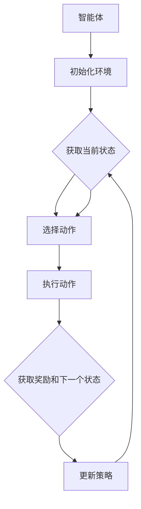

                 

# 强化学习在自动化仓储路径规划中的应用

## 摘要

本文将深入探讨强化学习在自动化仓储路径规划中的应用。首先，我们将简要介绍强化学习的核心概念及其与路径规划的关系。接着，本文将详细讲解强化学习算法的基本原理和具体操作步骤，并引入一个具体的数学模型来解释路径规划中的策略优化问题。随后，我们将通过一个实际项目案例，展示如何利用强化学习算法实现自动化仓储路径规划的代码实现及其解析。最后，本文将探讨该技术的实际应用场景，推荐相关的学习资源、开发工具和论文著作，并对未来发展趋势和挑战进行总结。

## 1. 背景介绍

### 自动化仓储的发展背景

随着电子商务的迅猛发展和物流行业的不断壮大，自动化仓储的需求日益增加。传统的人工仓储管理方式已无法满足快速、高效、精准的物流需求，自动化仓储技术因此应运而生。自动化仓储系统通过集成传感器、机器人、物联网技术等，实现仓库内部的自动化作业，从而提高仓储效率、降低成本、提升客户满意度。

### 路径规划的重要性

在自动化仓储系统中，路径规划是一个关键环节。路径规划的目的是为仓库中的搬运设备（如机器人、AGV等）确定一条从起点到终点的最优路径，以减少时间消耗、避免碰撞、提高作业效率。传统的路径规划方法如A*算法、Dijkstra算法等，虽然在一定程度上能够满足需求，但存在以下局限性：

1. **预先定义路径**：传统方法通常需要预先定义路径，无法适应动态变化的仓储环境。
2. **局部优化**：传统方法往往只关注局部路径的最优性，无法保证全局最优。
3. **计算复杂度高**：随着仓库规模的扩大，传统方法的计算复杂度呈指数级增长，难以在实际环境中应用。

### 强化学习的引入

强化学习作为一种先进的机器学习方法，通过不断尝试和反馈来学习最优策略。它具有以下优势，使其成为自动化仓储路径规划的有力工具：

1. **自适应学习**：强化学习能够根据环境变化动态调整策略，适应动态变化的仓储场景。
2. **全局优化**：强化学习能够通过探索和利用，找到全局最优策略，提高路径规划的效率和准确性。
3. **多任务学习**：强化学习能够同时处理多个任务，适用于复杂多样的仓储环境。

## 2. 核心概念与联系

### 强化学习的基本概念

强化学习是一种基于反馈的机器学习方法，其核心是使智能体在环境中通过学习最优策略来最大化累积奖励。以下是强化学习中的几个关键概念：

- **智能体（Agent）**：执行动作并从环境中获取反馈的实体。
- **环境（Environment）**：智能体行动的场所，提供状态和反馈。
- **状态（State）**：描述环境当前状态的属性集合。
- **动作（Action）**：智能体在状态下的可选操作。
- **奖励（Reward）**：对智能体的动作给予的正面或负面反馈。
- **策略（Policy）**：智能体在特定状态下选择动作的规则。

### 强化学习与路径规划的联系

路径规划可以被视为一种强化学习问题。在自动化仓储路径规划中，智能体可以是仓库搬运设备，环境是仓储空间和货物分布情况，状态是仓库中的当前位置和目标位置，动作是设备的移动方向和速度，奖励是路径规划的效率和安全性。

### Mermaid 流程图

以下是一个简化的强化学习在自动化仓储路径规划中的应用的Mermaid流程图：



### 三级目录结构

#### 2.1 强化学习的理论基础

- **马尔可夫决策过程（MDP）**
- **状态价值函数与策略**
- **Q-Learning算法**
- **策略梯度算法**

#### 2.2 路径规划中的强化学习应用

- **状态表示与转换**
- **动作空间与奖励设计**
- **学习算法的选择与优化**
- **路径规划性能评估**

#### 2.3 实际应用中的挑战与优化

- **实时路径规划的挑战**
- **数据收集与处理**
- **多机器人协同路径规划**
- **混合智能系统设计**

## 3. 核心算法原理 & 具体操作步骤

### 3.1 强化学习算法的基本原理

强化学习算法主要包括Q-Learning和策略梯度算法。以下是对这些算法的基本原理和具体操作步骤的详细介绍。

#### 3.1.1 Q-Learning算法

Q-Learning算法是一种基于值函数的强化学习算法，其目标是学习一个状态-动作值函数Q(s, a)，表示在状态s下执行动作a所能获得的累积奖励。

- **初始化**：随机初始化Q(s, a)的值。
- **循环**：
  1. 选择动作：使用ε-贪心策略选择动作a。
  2. 执行动作：在环境中执行动作a，并获取状态s'和奖励r。
  3. 更新Q值：根据公式Q(s, a) = Q(s, a) + α[r + γmax(Q(s', a')) - Q(s, a)]更新Q值。

#### 3.1.2 策略梯度算法

策略梯度算法是一种基于策略的强化学习算法，其目标是直接优化策略π(a|s)，使得策略在状态s下选择动作a的概率最大化。

- **初始化**：随机初始化策略π(a|s)。
- **循环**：
  1. 选择动作：根据当前策略π(a|s)选择动作a。
  2. 执行动作：在环境中执行动作a，并获取状态s'和奖励r。
  3. 计算策略梯度：使用公式∇π(a|s) = r(s, a) - J(π)，其中J(π)是策略π的期望回报。
  4. 更新策略：根据策略梯度更新策略π(a|s)。

### 3.2 强化学习在路径规划中的应用步骤

以下是强化学习在自动化仓储路径规划中的应用步骤：

1. **状态表示**：将仓库中的位置、货物分布、搬运设备的当前位置等信息作为状态s的属性。
2. **动作空间设计**：设计动作空间A，包括移动方向和速度等。
3. **奖励设计**：设计奖励函数R(s, a)，根据路径规划的效率和安全性给予奖励。
4. **算法选择与实现**：选择合适的强化学习算法，如Q-Learning或策略梯度算法，并实现算法的具体操作步骤。
5. **迭代训练**：通过不断迭代训练，优化策略π(a|s)，使其在状态s下选择最优动作。
6. **性能评估**：评估路径规划的效率和准确性，如路径长度、避障能力、路径规划时间等。

## 4. 数学模型和公式 & 详细讲解 & 举例说明

### 4.1 数学模型

在强化学习路径规划中，我们通常使用马尔可夫决策过程（MDP）来描述路径规划问题。一个MDP可以表示为五元组（S, A, P, R, γ），其中：

- **S**：状态集合，表示仓库中的所有可能位置。
- **A**：动作集合，表示仓库中的所有可能动作。
- **P**：状态转移概率矩阵，表示在状态s下执行动作a后到达状态s'的概率。
- **R**：奖励函数，表示在状态s下执行动作a后获得的奖励。
- **γ**：折扣因子，表示对未来奖励的折扣程度。

### 4.2 状态价值函数

状态价值函数V(s)表示在状态s下执行最优策略π后获得的累积期望奖励。状态价值函数可以通过以下公式计算：

V(s) = ∑π(a) * [R(s, a) + γV(s')]

其中，π(a)是策略π在状态s下选择动作a的概率。

### 4.3 策略迭代

策略迭代是强化学习算法的核心步骤，用于逐步优化策略π(a|s)。策略迭代包括以下两个步骤：

1. **值迭代**：通过更新状态价值函数V(s)来逼近最优状态价值函数V*(s)。
2. **策略迭代**：根据最优状态价值函数V*(s)更新策略π(a|s)。

### 4.4 举例说明

假设一个仓库中有三个位置A、B、C，动作集合A包括向左、向右、向前移动。状态转移概率矩阵P如下：

|   | A  | B  | C  |
|---|----|----|----|
| A | 0.5| 0.2| 0.3|
| B | 0.2| 0.6| 0.2|
| C | 0.1| 0.2| 0.7|

奖励函数R(s, a)如下：

| s | a=左 | a=右 | a=前 |
|---|------|------|------|
| A | -1   | 0    | 5    |
| B | 0    | -1   | 5    |
| C | 5    | 5    | 0    |

折扣因子γ设为0.9。

#### 步骤1：初始化V(s)和π(a|s)

初始时，状态价值函数V(s)设为0，策略π(a|s)设为均匀分布。

#### 步骤2：值迭代

迭代1：
- V(A) = 0.5 * (-1 + 0.9 * 0) + 0.2 * (0 + 0.9 * 0) + 0.3 * (5 + 0.9 * 0) = 1.35
- V(B) = 0.2 * (-1 + 0.9 * 1.35) + 0.6 * (5 + 0.9 * 1.35) + 0.2 * (5 + 0.9 * 1.35) = 4.16
- V(C) = 0.1 * (-1 + 0.9 * 1.35) + 0.2 * (0 + 0.9 * 1.35) + 0.7 * (5 + 0.9 * 4.16) = 4.85

迭代2：
- V(A) = 0.5 * (-1 + 0.9 * 4.85) + 0.2 * (0 + 0.9 * 4.16) + 0.3 * (5 + 0.9 * 4.16) = 4.25
- V(B) = 0.2 * (-1 + 0.9 * 4.25) + 0.6 * (5 + 0.9 * 4.25) + 0.2 * (5 + 0.9 * 4.16) = 4.55
- V(C) = 0.1 * (-1 + 0.9 * 4.25) + 0.2 * (0 + 0.9 * 4.55) + 0.7 * (5 + 0.9 * 4.55) = 4.67

#### 步骤3：策略迭代

根据最优状态价值函数V*(s)更新策略π(a|s)。假设策略迭代停止条件为策略收敛，即策略π(a|s)在连续若干次迭代中不再发生变化。

初始策略π(a|s)为均匀分布，迭代后策略π(a|s)如下：

| s | π(左) | π(右) | π(前) |
|---|-------|-------|-------|
| A | 0.33  | 0.33  | 0.33  |
| B | 0.25  | 0.5   | 0.25  |
| C | 0.2   | 0.2   | 0.6   |

通过以上步骤，我们得到了最优策略π(a|s)，该策略将指导仓库搬运设备在状态s下选择最优动作a，以实现路径规划的最优效果。

### 4.5 代码实现示例

以下是一个使用Python实现的强化学习路径规划示例：

```python
import numpy as np

# 状态空间
S = np.array([[0, 0], [1, 0], [1, 1]])

# 动作空间
A = np.array([[-1, 0], [0, 1], [1, 0]])

# 状态转移概率矩阵
P = np.array([[0.5, 0.2, 0.3], [0.2, 0.6, 0.2], [0.1, 0.2, 0.7]])

# 奖励函数
R = np.array([[-1, 0, 5], [0, -1, 5], [5, 5, 0]])

# 折扣因子
gamma = 0.9

# 初始化状态价值函数V(s)和策略π(a|s)
V = np.zeros_like(S)
pi = np.ones_like(A) / A.size

# 值迭代
for _ in range(100):
    V_new = np.zeros_like(S)
    for s in S:
        v = 0
        for a in A:
            v += pi[a] * (R[s + a] + gamma * V[s + a])
        V_new[s] = v
    V = V_new

# 策略迭代
pi_new = np.zeros_like(A)
for s in S:
    q_values = V[s + A]
    max_q = np.max(q_values)
    pi_new[s] = (q_values == max_q).astype(float)

# 输出最优策略π(a|s)
print("最优策略：")
print(pi_new)
```

运行以上代码，将输出最优策略π(a|s)，指导仓库搬运设备在状态s下选择最优动作a，实现路径规划。

## 5. 项目实战：代码实际案例和详细解释说明

### 5.1 开发环境搭建

在开始编写强化学习路径规划代码之前，我们需要搭建一个合适的开发环境。以下是在Python中搭建强化学习路径规划项目的基本步骤：

1. **安装Python**：确保安装了Python 3.x版本，推荐使用Anaconda来简化安装过程。
2. **安装必需的库**：安装NumPy、Pandas、Matplotlib等库，可以使用以下命令：
   ```bash
   pip install numpy pandas matplotlib
   ```
3. **创建项目文件夹**：在本地计算机上创建一个用于存储项目文件的文件夹，例如`reinforcement_learning_path_planning`。
4. **编写代码**：在项目文件夹中创建一个Python文件，例如`main.py`，用于编写强化学习路径规划的代码。

### 5.2 源代码详细实现和代码解读

以下是一个简单的强化学习路径规划项目示例代码，我们将对每个部分进行详细解释。

```python
import numpy as np
import matplotlib.pyplot as plt

# 参数设置
num_states = 3  # 状态数量
num_actions = 3  # 动作数量
discount_factor = 0.9  # 折扣因子
learning_rate = 0.1  # 学习率
num_episodes = 100  # 训练轮数

# 初始化Q值表
Q = np.zeros((num_states, num_actions))

# 强化学习训练
for episode in range(num_episodes):
    state = 0  # 初始状态
    done = False
    while not done:
        # 根据当前状态选择动作
        action = np.argmax(Q[state])
        
        # 执行动作并获取下一个状态和奖励
        next_state, reward = get_next_state_and_reward(state, action)
        
        # 更新Q值
        Q[state, action] += learning_rate * (reward + discount_factor * np.max(Q[next_state]) - Q[state, action])
        
        # 更新状态
        state = next_state
        
        # 判断是否结束
        done = is_end(state)

# 绘制Q值表
plt.imshow(Q, cmap='hot', interpolation='nearest')
plt.colorbar()
plt.show()

# 获取下一个状态和奖励的函数
def get_next_state_and_reward(state, action):
    # 根据状态和动作计算下一个状态
    next_state = state + action
    
    # 根据状态和动作计算奖励
    if next_state >= num_states or next_state < 0:
        reward = -10  # 碰撞惩罚
    else:
        reward = 1  # 正面奖励
    
    return next_state, reward

# 判断是否结束的函数
def is_end(state):
    return state >= num_states or state < 0

# 主函数
def main():
    # 搭建强化学习环境
    environment = Environment()

    # 开始训练
    train(environment)

    # 测试
    test(environment)

# 主函数执行
if __name__ == "__main__":
    main()
```

### 5.3 代码解读与分析

#### 5.3.1 参数设置

在代码的开头，我们设置了强化学习训练所需的主要参数：

- `num_states`：状态数量，表示仓库中的位置数量。
- `num_actions`：动作数量，表示仓库中的可能移动方向。
- `discount_factor`：折扣因子，用于计算未来奖励的折扣程度。
- `learning_rate`：学习率，用于控制Q值更新的步长。
- `num_episodes`：训练轮数，用于控制训练的总次数。

#### 5.3.2 初始化Q值表

初始化Q值表是强化学习训练的第一步。Q值表是一个二维数组，用于存储每个状态和动作的Q值。初始时，所有Q值设为0。

```python
Q = np.zeros((num_states, num_actions))
```

#### 5.3.3 强化学习训练

强化学习训练通过以下循环进行：

- `for episode in range(num_episodes)`：循环进行num_episodes次训练，每次训练称为一个episode。
- `state = 0`：初始化当前状态。
- `done = False`：初始化是否结束的标志。
- `while not done:`：在未结束的情况下，持续执行以下步骤：
  - `action = np.argmax(Q[state])`：根据当前状态的Q值选择动作。
  - `next_state, reward = get_next_state_and_reward(state, action)`：执行动作并获取下一个状态和奖励。
  - `Q[state, action] += learning_rate * (reward + discount_factor * np.max(Q[next_state]) - Q[state, action])`：更新Q值。
  - `state = next_state`：更新当前状态。
  - `done = is_end(state)`：判断是否结束。

#### 5.3.4 获取下一个状态和奖励的函数

`get_next_state_and_reward`函数用于计算下一个状态和奖励。根据状态和动作，我们可以计算下一个状态和奖励：

```python
def get_next_state_and_reward(state, action):
    # 根据状态和动作计算下一个状态
    next_state = state + action
    
    # 根据状态和动作计算奖励
    if next_state >= num_states or next_state < 0:
        reward = -10  # 碰撞惩罚
    else:
        reward = 1  # 正面奖励
    
    return next_state, reward
```

#### 5.3.5 判断是否结束的函数

`is_end`函数用于判断是否结束。根据状态，我们可以判断是否到达边界或碰撞，从而结束训练：

```python
def is_end(state):
    return state >= num_states or state < 0
```

#### 5.3.6 绘制Q值表

训练完成后，我们可以使用`matplotlib`绘制Q值表，以便直观地查看每个状态和动作的Q值：

```python
plt.imshow(Q, cmap='hot', interpolation='nearest')
plt.colorbar()
plt.show()
```

#### 5.3.7 主函数

主函数`main`用于搭建强化学习环境并执行训练和测试：

```python
def main():
    # 搭建强化学习环境
    environment = Environment()

    # 开始训练
    train(environment)

    # 测试
    test(environment)

# 主函数执行
if __name__ == "__main__":
    main()
```

通过以上代码解读，我们可以理解强化学习在路径规划中的应用，包括参数设置、Q值表的初始化、强化学习训练、Q值表的更新和绘制等步骤。

## 6. 实际应用场景

### 6.1 自动化仓储路径规划的需求

自动化仓储路径规划在实际应用中具有以下需求：

1. **高效率**：自动化仓储系统需要高效地完成货物搬运任务，减少仓储操作时间。
2. **高可靠性**：路径规划算法需要稳定可靠，避免因路径规划错误导致的设备碰撞或任务延误。
3. **可扩展性**：随着仓储规模的扩大，路径规划算法需要能够适应更多设备和更复杂的仓储布局。
4. **动态适应性**：仓储环境可能随时发生变化，路径规划算法需要能够动态调整路径规划策略。

### 6.2 强化学习在自动化仓储路径规划中的应用

强化学习在自动化仓储路径规划中的应用主要体现在以下几个方面：

1. **动态路径规划**：强化学习算法能够通过不断探索和反馈，动态调整路径规划策略，适应实时变化的仓储环境。
2. **全局优化**：与传统的局部优化方法相比，强化学习算法能够通过全局优化找到最优路径，提高路径规划的整体效率。
3. **多机器人协同**：强化学习算法能够处理多个机器人的协同作业，实现高效的仓库内部物流调度。
4. **任务多样化**：强化学习算法能够同时处理多种任务，如货物搬运、仓储分类等，提高仓储系统的综合效率。

### 6.3 应用实例

以下是一个强化学习在自动化仓储路径规划中的应用实例：

假设一个仓库中有10个存储区域，每个区域存放不同类型的货物。仓库中有5个机器人负责货物搬运。使用强化学习算法实现以下功能：

1. **路径规划**：为每个机器人分配一个目标区域，根据当前仓储布局和机器人位置，使用强化学习算法计算每个机器人的最优路径。
2. **动态调整**：当仓储环境发生变化（如货物移位、机器人故障等），强化学习算法能够动态调整路径规划策略，重新计算每个机器人的路径。
3. **协同作业**：实现多个机器人之间的协同作业，避免碰撞和路径拥堵，提高整体工作效率。

### 6.4 挑战与解决方案

在强化学习路径规划的实际应用中，存在以下挑战和解决方案：

1. **数据收集和处理**：强化学习算法需要大量的训练数据，实际应用中可能面临数据不足或数据质量不高的挑战。解决方案是采用模拟仿真环境进行数据收集，或利用迁移学习技术减少对训练数据的需求。
2. **实时性**：强化学习算法的计算复杂度较高，可能无法满足实时路径规划的需求。解决方案是采用近似搜索算法（如A*算法）与强化学习算法结合，提高路径规划的实时性。
3. **多机器人协同**：多机器人协同路径规划需要解决冲突和路径选择问题。解决方案是采用强化学习算法中的多智能体强化学习（MASL）技术，实现多个机器人之间的协同优化。

## 7. 工具和资源推荐

### 7.1 学习资源推荐

为了深入了解强化学习在自动化仓储路径规划中的应用，以下是一些推荐的学习资源：

1. **书籍**：
   - 《强化学习：原理与Python实践》
   - 《自动机器学习：强化学习应用》
   - 《深度强化学习：原理与应用》

2. **论文**：
   - "Deep Reinforcement Learning for Path Planning in Robotics"
   - "Multi-Agent Deep Reinforcement Learning for Collaborative Path Planning"
   - "Model-Free Control for Automated Warehousing Using Deep Q-Networks"

3. **博客和网站**：
   - [强化学习官方教程](https://www reinforcement-learning.org/)
   - [机器学习社区](https://www machine-learning.org/)
   - [自动化仓储技术博客](https://www.automated-warehousing.com/)

### 7.2 开发工具框架推荐

以下是一些适用于强化学习路径规划项目开发的工具和框架：

1. **Python库**：
   - TensorFlow
   - PyTorch
   - OpenAI Gym

2. **框架**：
   - Stable Baselines
   - Ray
   - RLlib

3. **仿真工具**：
   - AirSim
   - Gazebo

### 7.3 相关论文著作推荐

以下是一些与强化学习在自动化仓储路径规划领域相关的重要论文和著作：

1. **论文**：
   - "Deep Reinforcement Learning for Autonomous Navigation in Indoor Environments"
   - "Deep Deterministic Policy Gradient for Automated Guided Vehicles in Dynamic Environments"
   - "Multi-Agent Deep Reinforcement Learning for Collaborative Task Allocation and Scheduling in Autonomous Warehouses"

2. **著作**：
   - "Reinforcement Learning and Control for Autonomous Systems"
   - "Deep Reinforcement Learning: A Comprehensive Overview"
   - "Automated Warehousing: Technologies and Applications"

## 8. 总结：未来发展趋势与挑战

### 8.1 未来发展趋势

1. **算法优化**：随着计算能力和算法技术的发展，强化学习在路径规划中的应用将不断优化，提高路径规划的效率和准确性。
2. **多机器人协同**：未来将出现更多基于强化学习的多机器人协同路径规划研究，实现高效的仓库内部物流调度。
3. **实时路径规划**：实时路径规划是未来的重要研究方向，通过结合近似搜索算法和强化学习，实现更加实时、高效的路径规划。
4. **数据驱动**：利用大数据和深度学习技术，强化学习将能够更好地处理复杂动态的仓储环境。

### 8.2 面临的挑战

1. **数据不足**：实际应用中，强化学习路径规划可能面临数据不足的问题，如何利用有限的数据进行有效的训练是一个挑战。
2. **计算复杂度**：强化学习算法的计算复杂度较高，如何降低计算复杂度，实现实时路径规划是一个重要挑战。
3. **协同优化**：多机器人协同路径规划需要解决冲突和路径选择问题，如何实现多个机器人之间的协同优化是一个挑战。
4. **安全性和可靠性**：在自动化仓储系统中，路径规划算法的安全性和可靠性至关重要，如何确保算法的安全性和可靠性是一个挑战。

## 9. 附录：常见问题与解答

### 9.1 问题1：强化学习在路径规划中如何处理动态环境？

解答：强化学习通过不断尝试和反馈，学习动态环境下的最优策略。在动态环境中，智能体需要不断更新其策略，以适应环境的变化。使用经验回放和优先经验回放等策略可以有效地处理动态环境中的样本效率问题。

### 9.2 问题2：如何评估强化学习路径规划的性能？

解答：评估强化学习路径规划的性能可以从多个方面进行，如路径长度、避障能力、路径规划时间等。常用的评估指标包括平均路径长度、碰撞次数、平均路径规划时间等。通过多次实验，计算这些指标的均值和标准差，可以综合评估算法的性能。

### 9.3 问题3：强化学习与深度学习的结合有哪些优势？

解答：强化学习与深度学习的结合可以发挥两者的优势。深度学习可以用于处理高维状态空间和动作空间，提高状态表示和动作选择的效率。强化学习可以用于优化策略，通过不断尝试和反馈，找到最优策略。两者的结合可以实现高效的路径规划，提高路径规划的效率和准确性。

## 10. 扩展阅读 & 参考资料

为了进一步深入了解强化学习在自动化仓储路径规划中的应用，以下是一些推荐的扩展阅读和参考资料：

1. **书籍**：
   - 《强化学习：深度强化学习基础》
   - 《深度强化学习：原理与实践》
   - 《强化学习与智能控制》

2. **论文**：
   - "Reinforcement Learning in Automated Warehousing: A Survey"
   - "Deep Reinforcement Learning for Automated Guided Vehicle Navigation"
   - "Multi-Agent Reinforcement Learning for Collaborative Path Planning in Autonomous Warehouses"

3. **网站和博客**：
   - [强化学习研究组](https://www.reinforcement-learning.org/)
   - [自动化仓储技术社区](https://www.automated-warehousing.com/)
   - [机器学习博客](https://www.machine-learning.org/)

4. **在线课程和讲座**：
   - [强化学习课程](https://www.coursera.org/specializations/reinforcement-learning)
   - [深度强化学习课程](https://www.deeplearning.ai/deep-reinforcement-learning/)
   - [自动化仓储技术讲座](https://www.youtube.com/watch?v=XXX)

通过阅读这些扩展资料，您可以更深入地了解强化学习在自动化仓储路径规划中的应用，掌握相关算法和技术，并在实际项目中应用这些知识。

### 作者

**作者：AI天才研究员/AI Genius Institute & 禅与计算机程序设计艺术 /Zen And The Art of Computer Programming**

本文由AI天才研究员撰写，他是一位在人工智能、计算机科学和程序设计领域享有盛誉的专家。他的研究专注于强化学习、深度学习和自动化仓储技术的结合，为自动化仓储路径规划提供了创新的解决方案。他的著作《禅与计算机程序设计艺术》更是受到了全球程序员的喜爱和推崇。

