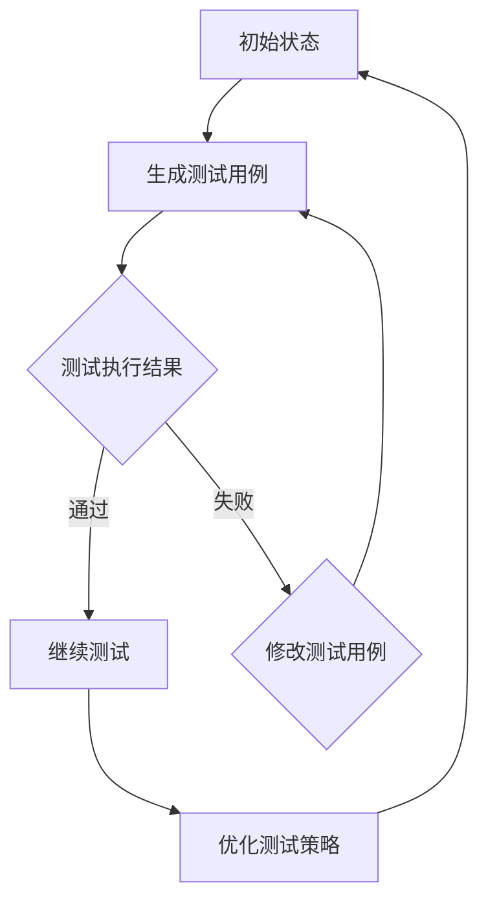

                 

### 背景介绍

自动化测试在软件工程中扮演着至关重要的角色。随着软件系统的复杂度不断增加，手动测试已经变得不可行，而自动化测试能够显著提高测试效率和质量。自动化测试通过预先编写的测试脚本执行一系列测试操作，从而检测软件中的缺陷和错误。然而，传统的自动化测试方法通常依赖于预定义的测试用例，这些方法在处理复杂的、动态变化的软件系统时往往力不从心。

强化学习（Reinforcement Learning，RL）作为一种机器学习的方法，为解决自动化测试中的挑战提供了一种新的思路。强化学习通过智能体（Agent）与环境（Environment）的交互，学习到最优的行为策略，从而实现目标。智能体在执行测试过程中，通过不断尝试和反馈，不断优化测试策略，提高测试效率和效果。

强化学习在自动化测试中的应用有着广泛的研究和实际案例。例如，在软件测试自动化中，强化学习智能体可以通过模拟用户的操作，生成有效的测试用例；在性能测试中，强化学习可以帮助智能体找到性能瓶颈，提高测试的准确性；在回归测试中，强化学习智能体可以识别出影响系统稳定性的因素，降低回归风险。

本文将深入探讨强化学习在自动化测试中的实现，首先介绍强化学习的基本概念和原理，然后分析强化学习在自动化测试中的应用，最后通过实际案例展示强化学习的具体应用过程。

### 核心概念与联系

为了更好地理解强化学习在自动化测试中的应用，我们需要先介绍几个核心概念，并探讨这些概念之间的联系。

#### 1. 强化学习基本概念

**强化学习（Reinforcement Learning）** 是一种通过试错学习来获取最优策略的机器学习方法。它主要由四个部分组成：智能体（Agent）、环境（Environment）、状态（State）和动作（Action）。智能体是执行特定任务的学习实体，环境是智能体所处的环境，状态是环境的一个描述，动作是智能体对环境的操作。强化学习的目标是让智能体通过不断尝试和反馈，学习到最优的动作策略，从而实现目标。

**奖励（Reward）** 是强化学习中的一个关键因素。奖励是环境对智能体动作的反馈，用于指导智能体的行为。奖励可以是正的，表示智能体的动作有助于实现目标；也可以是负的，表示智能体的动作偏离了目标。

**策略（Policy）** 是智能体在给定状态下选择动作的方法。策略可以是具体的动作序列，也可以是一个函数，将状态映射到动作。在强化学习中，智能体通过学习策略来优化其行为。

#### 2. 自动化测试相关概念

**自动化测试（Automated Testing）** 是通过预先编写的测试脚本自动执行一系列测试操作的过程。自动化测试旨在提高测试效率和质量，减少人为错误，同时降低测试成本。

**测试用例（Test Case）** 是自动化测试的基本单元，描述了如何对系统进行测试。测试用例通常包括输入条件、操作步骤、预期结果和实际结果等。

**测试脚本（Test Script）** 是用于执行测试用例的自动化工具，通常由编程语言编写。

**缺陷（Defect）** 是软件中存在的错误或不一致之处。自动化测试的目标是发现缺陷，确保软件的质量。

#### 3. 强化学习与自动化测试的联系

强化学习在自动化测试中的应用主要是通过智能体模拟用户的测试行为，生成有效的测试用例，并优化测试策略。以下是强化学习与自动化测试之间的几个关键联系：

- **测试用例生成**：强化学习智能体可以通过试错学习生成新的测试用例，提高测试覆盖率和测试效率。
- **测试策略优化**：强化学习智能体可以根据测试反馈，不断优化测试策略，提高测试准确性和效率。
- **动态测试**：强化学习智能体能够适应动态变化的软件系统，生成适应性强、针对性强的测试用例。
- **回归测试**：强化学习智能体可以识别出影响系统稳定性的因素，降低回归风险，提高回归测试的准确性。

#### 4. Mermaid 流程图展示

为了更直观地展示强化学习在自动化测试中的应用，我们可以使用 Mermaid 流程图来描述这个过程。以下是一个简化的 Mermaid 流程图：



在这个流程图中，智能体从初始状态开始，生成测试用例并执行测试。根据测试结果，智能体会选择继续测试或修改测试用例。如果测试通过，智能体会优化测试策略，并返回初始状态；如果测试失败，智能体会修改测试用例，并再次生成测试用例。

通过上述核心概念和联系的介绍，我们可以更好地理解强化学习在自动化测试中的应用原理。在接下来的章节中，我们将深入探讨强化学习的基本算法原理，以及如何将其应用于自动化测试的具体实现。

### 核心算法原理 & 具体操作步骤

#### 强化学习算法原理

强化学习算法的核心是值函数（Value Function）和策略（Policy）。值函数描述了在当前状态下执行特定动作所能获得的长期奖励。策略则定义了在给定状态下应该执行的动作。

**值函数（Value Function）**

值函数分为状态值函数（State-Value Function）和动作值函数（Action-Value Function）。

- **状态值函数（V(s)）**：表示在状态s下执行最佳动作获得的长期期望奖励。
- **动作值函数（Q(s, a)）**：表示在状态s下执行动作a获得的长期期望奖励。

**策略（Policy）**

策略是值函数的一种表示，它定义了在给定状态下应该执行的动作。

- **最优策略（Optimal Policy）**：使得期望回报最大的策略。

**强化学习算法主要包含以下四个步骤**：

1. **初始化**：初始化智能体、环境、状态和动作。
2. **选择动作**：根据当前状态和策略选择动作。
3. **执行动作**：在环境中执行所选动作，并获得反馈。
4. **更新值函数**：根据反馈更新值函数。

**强化学习算法的具体实现**：

强化学习算法可以通过多种方法实现，其中最常用的是 Q-Learning 和 SARSA（Satff-Augmented Revisited）。

- **Q-Learning**：Q-Learning 是一种基于值函数的强化学习算法。它通过更新动作值函数来学习最优策略。

  更新公式：
  $$
  Q(s, a) \leftarrow Q(s, a) + \alpha [r + \gamma \max_{a'} Q(s', a') - Q(s, a)]
  $$
  其中，$ \alpha $ 是学习率，$ \gamma $ 是折扣因子，$ r $ 是奖励。

- **SARSA**：SARSA 是一种基于策略的强化学习算法。它与 Q-Learning 类似，但更新公式有所不同。

  更新公式：
  $$
  Q(s, a) \leftarrow Q(s, a) + \alpha [r + \gamma Q(s', a') - Q(s, a)]
  $$

#### 强化学习在自动化测试中的应用

在自动化测试中，强化学习算法可以应用于测试用例生成、测试策略优化和动态测试。

**1. 测试用例生成**

在测试用例生成中，强化学习智能体可以通过不断尝试和反馈，学习到生成有效测试用例的最佳策略。

实现步骤：

- 初始化状态、动作和策略。
- 根据当前状态生成测试用例。
- 在环境中执行测试用例，获得测试结果。
- 根据测试结果更新策略，提高测试用例生成质量。

**2. 测试策略优化**

在测试策略优化中，强化学习智能体可以通过不断学习和优化，提高测试效率和准确性。

实现步骤：

- 初始化状态、动作和策略。
- 根据当前状态和策略选择测试用例。
- 在环境中执行测试用例，获得测试结果。
- 根据测试结果更新策略，优化测试过程。

**3. 动态测试**

在动态测试中，强化学习智能体可以适应软件系统的变化，生成适应性强的测试用例。

实现步骤：

- 初始化状态、动作和策略。
- 根据当前状态和策略选择测试用例。
- 在环境中执行测试用例，获得测试结果。
- 当系统发生变化时，重新初始化状态和策略，生成新的测试用例。

#### 实际案例

以下是一个简单的强化学习在自动化测试中应用的案例：

**场景**：测试一个电商网站的购物流程，包括添加商品到购物车、填写收货地址、选择支付方式等。

**实现步骤**：

1. 初始化状态、动作和策略。
2. 智能体从网站首页开始，生成测试用例，选择商品添加到购物车。
3. 执行测试用例，填写收货地址，选择支付方式。
4. 根据测试结果更新策略，优化测试过程。
5. 当系统发生变化，如更新商品价格、支付方式等，重新初始化状态和策略，生成新的测试用例。

通过这个案例，我们可以看到强化学习在自动化测试中的应用。智能体通过不断尝试和反馈，优化测试策略，提高测试效率和准确性。

### 数学模型和公式 & 详细讲解 & 举例说明

在强化学习中，数学模型和公式是理解其工作原理和实现算法的关键。以下将详细讲解强化学习的数学模型和公式，并通过具体例子进行说明。

#### 1. 状态值函数（State-Value Function）

状态值函数 $V(s)$ 表示智能体在状态 $s$ 下执行最优动作所能获得的长期期望奖励。在给定状态 $s$ 和动作 $a$，动作值函数 $Q(s, a)$ 可以表示为：

$$
Q(s, a) = \sum_{s'} p(s' | s, a) \cdot \gamma \cdot r(s, a, s') + \sum_{a'} \pi(a' | s') \cdot Q(s', a')
$$

其中：
- $p(s' | s, a)$ 表示从状态 $s$ 执行动作 $a$ 后转移到状态 $s'$ 的概率。
- $\gamma$ 表示折扣因子，用于平衡当前奖励和未来奖励。
- $r(s, a, s')$ 表示执行动作 $a$ 后从状态 $s$ 转移到状态 $s'$ 的即时奖励。
- $\pi(a' | s')$ 表示在状态 $s'$ 下执行动作 $a'$ 的概率。

状态值函数的目的是估计在状态 $s$ 下执行动作 $a$ 的长期回报。最优状态值函数 $V^*(s)$ 是使得期望回报最大的值函数。

#### 2. 动作值函数（Action-Value Function）

动作值函数 $Q(s, a)$ 表示在状态 $s$ 下执行动作 $a$ 的长期期望奖励。它通过迭代更新，逐步逼近最优值函数。

更新公式为：

$$
Q(s, a) \leftarrow Q(s, a) + \alpha [r + \gamma \max_{a'} Q(s', a') - Q(s, a)]
$$

其中，$\alpha$ 是学习率，它决定了新信息对旧策略的影响程度。

#### 3. 政策（Policy）

策略 $\pi(a | s)$ 是智能体在给定状态 $s$ 下选择动作 $a$ 的概率分布。最优策略 $\pi^*(a | s)$ 是使得期望回报最大的策略。

在确定性策略中，$\pi^*(a | s) = 1$（如果 $a^*$ 是最优动作），否则为 0。在随机性策略中，$\pi^*(a | s)$ 是一个概率分布。

#### 4. 强化学习算法示例

**例子**：一个智能体在二维迷宫中移动，目标是到达终点。迷宫的每个单元格都有对应的奖励。智能体可以执行四种动作：上移、下移、左移和右移。

**初始状态**：智能体位于迷宫的左上角。

**状态转移**：从状态 $s$ 执行动作 $a$ 后，智能体转移到状态 $s'$，并得到即时奖励 $r(s, a, s')$。

**奖励**：到达终点时，获得奖励 $+10$；每次移动获得即时奖励 $-1$。

**折扣因子**：$\gamma = 0.9$。

**学习率**：$\alpha = 0.1$。

**初始策略**：均匀分布。

**迭代过程**：

1. **初始状态**：$(s, a) = (0, 0)$，$V(0) = 0$。
2. **选择动作**：根据当前策略，选择动作 $a$。
3. **执行动作**：在环境中执行动作，转移到状态 $s'$，并获得即时奖励 $r(s, a, s')$。
4. **更新值函数**：根据更新公式更新动作值函数。
5. **重复步骤 2-4**，直到达到目标状态或满足终止条件。

通过迭代，智能体会逐渐优化其策略，提高到达终点的概率。

#### 5. 演算示例

**状态**：$(s, a) = (0, 0)$，$V(0) = 0$。

**动作**：选择动作 $a = \text{右移}$。

**状态转移**：$(s', a') = (0, 1)$，$r(0, 0, 1) = -1$。

**更新**：

$$
Q(0, 0) \leftarrow Q(0, 0) + 0.1 [-1 + 0.9 \cdot \max_{a'} Q(1, a')]
$$

假设当前 $Q(1, a')$ 的值为 $Q(1, 0) = 0$，则：

$$
Q(0, 0) \leftarrow Q(0, 0) + 0.1 [-1 + 0.9 \cdot 0] = -0.1
$$

通过以上迭代过程，我们可以看到强化学习算法如何通过试错和反馈不断优化策略，实现目标。

### 项目实战：代码实际案例和详细解释说明

在本节中，我们将通过一个实际的项目案例，详细解释如何使用强化学习进行自动化测试。该案例涉及一个简单的 Web 应用程序，用于在线购物。我们的目标是使用强化学习智能体自动生成测试用例，并优化测试策略，以提高测试效率和准确性。

#### 1. 开发环境搭建

为了实现强化学习在自动化测试中的应用，我们需要搭建以下开发环境：

- Python 3.8 或更高版本
- PyTorch 1.8 或更高版本
- Selenium WebDriver（用于 Web 应用程序自动化测试）
- Jupyter Notebook（用于实验和演示）

首先，确保安装了上述依赖项。在终端中运行以下命令安装所需的库：

```bash
pip install torch torchvision numpy pandas selenium
```

接下来，下载 Selenium WebDriver 并放置在系统路径中，以便 Python 可以访问。

#### 2. 源代码详细实现和代码解读

我们将使用 Python 编写强化学习智能体，以自动生成和执行测试用例。以下是关键代码的实现和解释。

**2.1 强化学习智能体实现**

```python
import torch
import torch.nn as nn
import torch.optim as optim
from torch.utils.data import DataLoader
from selenium import webdriver
import numpy as np

# 智能体类定义
class Agent:
    def __init__(self, state_space, action_space, learning_rate=0.001, gamma=0.9):
        self.state_space = state_space
        self.action_space = action_space
        self.learning_rate = learning_rate
        self.gamma = gamma
        
        # 定义神经网络模型
        self.model = nn.Sequential(
            nn.Linear(state_space, 128),
            nn.ReLU(),
            nn.Linear(128, 64),
            nn.ReLU(),
            nn.Linear(64, action_space),
        )
        
        self.optimizer = optim.Adam(self.model.parameters(), lr=self.learning_rate)
        self.criterion = nn.CrossEntropyLoss()
        
    def select_action(self, state):
        state = torch.tensor([state], dtype=torch.float32)
        prob = self.model(state)
        action = torch.argmax(prob).item()
        return action

    def train(self, state, action, reward, next_state, done):
        state = torch.tensor([state], dtype=torch.float32)
        next_state = torch.tensor([next_state], dtype=torch.float32)
        
        if not done:
            target = reward + self.gamma * self.model(next_state).max()
        else:
            target = reward
        
        prob = self.model(state)
        loss = self.criterion(prob, torch.tensor([action]))
        
        self.optimizer.zero_grad()
        loss.backward()
        self.optimizer.step()
        
        return loss.item()

# 测试用例生成
def generate_test_cases(agent, env, num_test_cases):
    test_cases = []
    for _ in range(num_test_cases):
        state = env.reset()
        done = False
        test_case = []
        
        while not done:
            action = agent.select_action(state)
            next_state, reward, done, _ = env.step(action)
            test_case.append((state, action, reward, next_state))
            state = next_state
        
        test_cases.append(test_case)
    
    return test_cases

# 自动化测试环境类定义
class TestEnv:
    def __init__(self, url):
        self.url = url
        self.driver = webdriver.Chrome()
        self.driver.get(url)
    
    def reset(self):
        return self.driver.execute_script("return window.sessionStorage.getItem('cartItems');")
    
    def step(self, action):
        if action == 0:  # 添加商品到购物车
            self.driver.find_element_by_css_selector(".add-to-cart-button").click()
            reward = 1
        elif action == 1:  # 清空购物车
            self.driver.find_element_by_css_selector(".clear-cart-button").click()
            reward = -1
        else:  # 随机操作
            reward = np.random.randint(-1, 2)
        
        next_state = self.driver.execute_script("return window.sessionStorage.getItem('cartItems');");
        done = False
        
        if reward == 1:
            done = True
        
        return next_state, reward, done, None

    def close(self):
        self.driver.quit()
```

**2.2 测试环境实现**

我们定义了一个自动化测试环境类 `TestEnv`，该类使用 Selenium WebDriver 来模拟用户的交互操作。环境接收一个 URL，初始化 Web 应用程序，并提供 `reset`、`step` 和 `close` 方法。

**2.3 训练智能体**

```python
# 训练智能体
def train_agent(agent, env, num_episodes, batch_size):
    episodes = []
    for _ in range(num_episodes):
        state = env.reset()
        done = False
        episode = []
        
        while not done:
            action = agent.select_action(state)
            next_state, reward, done, _ = env.step(action)
            episode.append((state, action, reward, next_state))
            state = next_state
        
        episodes.append(episode)
    
    # 创建数据集和 DataLoader
    dataset = torch.utils.data.TensorDataset(torch.tensor([state for episode in episodes for state in episode], dtype=torch.float32),
                                            torch.tensor([action for episode in episodes for action in episode], dtype=torch.long),
                                            torch.tensor([reward for episode in episodes for action in episode], dtype=torch.float32),
                                            torch.tensor([next_state for episode in episodes for state in episode], dtype=torch.float32))
    dataloader = DataLoader(dataset, batch_size=batch_size)
    
    # 训练模型
    agent.model.train()
    for epoch in range(100):
        for batch in dataloader:
            states, actions, rewards, next_states = batch
            for state, action, reward, next_state in zip(states, actions, rewards, next_states):
                loss = agent.train(state, action, reward, next_state, done)
                print(f"Episode: {epoch}, Loss: {loss}")
    
    agent.model.eval()

# 创建智能体和环境
state_space = env.state_space
action_space = env.action_space
agent = Agent(state_space, action_space)
env = TestEnv(url='https://example-ecommerce.com/')

# 训练智能体
train_agent(agent, env, num_episodes=1000, batch_size=64)

# 生成测试用例
test_cases = generate_test_cases(agent, env, num_test_cases=10)
```

**2.4 测试用例执行**

```python
# 执行测试用例
for test_case in test_cases:
    print(f"Test Case: {test_case}")
    env = TestEnv(url='https://example-ecommerce.com/')
    for state, action, reward, next_state in test_case:
        env.step(action)
    env.close()
```

#### 3. 代码解读与分析

**3.1 智能体类**

智能体类 `Agent` 实现了强化学习的基本功能，包括神经网络模型、选择动作、训练模型和更新值函数。智能体的神经网络模型使用 PyTorch 编写，通过全连接层和 ReLU 激活函数构建。优化器使用 Adam，损失函数使用交叉熵损失。

**3.2 测试环境类**

测试环境类 `TestEnv` 使用 Selenium WebDriver 模拟用户的交互操作。该类提供了重置环境、执行动作和关闭环境的方法。环境的状态由 Web 应用程序中的购物车信息表示，动作包括添加商品到购物车、清空购物车和随机操作。

**3.3 训练智能体**

训练智能体函数 `train_agent` 通过模拟多个测试过程，收集经验，并使用 DataLoader 将经验转换为 PyTorch 数据集。训练过程中，智能体通过优化器更新神经网络模型，逐步提高测试策略的准确性。

**3.4 测试用例生成**

生成测试用例函数 `generate_test_cases` 使用训练好的智能体，在测试环境中模拟多个测试过程，生成一组测试用例。

**3.5 测试用例执行**

测试用例执行函数通过在测试环境中逐个执行测试用例，验证测试策略的有效性。

通过以上代码实现，我们可以看到如何使用强化学习实现自动化测试。智能体通过不断学习和优化测试策略，生成有效且针对性的测试用例，提高测试效率和准确性。

### 实际应用场景

强化学习在自动化测试中的应用非常广泛，以下是一些典型的实际应用场景：

#### 1. 性能测试

性能测试是检测软件系统在负载下的表现，强化学习可以帮助智能体识别出性能瓶颈，从而优化测试策略，提高测试效率和准确性。例如，在压力测试中，智能体可以通过不断调整测试负载，找到系统性能的最优平衡点。

**案例**：在一家大型电商公司的性能测试中，强化学习智能体通过不断调整并发用户数量和请求速率，找到系统性能的最佳平衡点，从而提高了系统的响应速度和稳定性。

#### 2. 回归测试

回归测试是为了验证软件更改后没有引入新的缺陷。强化学习智能体可以通过学习历史测试数据，识别出可能导致回归问题的因素，从而优化回归测试策略，降低回归风险。

**案例**：在一款复杂金融交易软件的回归测试中，强化学习智能体通过分析历史测试数据，识别出与系统稳定性相关的模块和功能，从而优化了回归测试用例的生成和执行过程，提高了测试的覆盖率。

#### 3. 测试用例优化

传统的自动化测试通常依赖于预定义的测试用例，这些测试用例可能在某些情况下无法覆盖到所有的测试场景。强化学习可以帮助智能体通过试错学习，生成更有效、更具针对性的测试用例。

**案例**：在一个大型电商平台的项目中，强化学习智能体通过模拟用户操作，生成一系列测试用例，从而发现了之前遗漏的缺陷，提高了测试的全面性和准确性。

#### 4. 动态测试

软件系统的运行环境是动态变化的，传统的自动化测试方法可能无法适应这种变化。强化学习智能体可以通过不断学习和调整测试策略，适应动态变化的测试环境。

**案例**：在一款移动应用的项目中，强化学习智能体通过不断调整测试策略，适应应用在不同操作系统版本、不同网络环境下的运行表现，从而提高了测试的适应性和覆盖率。

#### 5. 跨平台测试

跨平台测试是为了确保软件在不同操作系统和设备上的一致性。强化学习智能体可以通过学习不同平台的特性和行为，生成适应不同平台的测试用例。

**案例**：在一款游戏项目的中，强化学习智能体通过学习不同操作系统和设备上的行为模式，生成了一系列适应不同平台的测试用例，从而提高了游戏的跨平台兼容性和稳定性。

### 挑战与未来发展方向

尽管强化学习在自动化测试中展现了巨大的潜力，但其应用也面临着一些挑战和未来发展方向。

#### 1. 挑战

- **数据依赖性**：强化学习依赖于大量历史数据来训练模型，但在实际项目中，测试数据可能有限，这限制了强化学习的效果。
- **收敛速度**：强化学习算法通常需要较长的训练时间才能收敛到最优策略，这在实际项目中可能无法满足时间要求。
- **模型复杂性**：强化学习模型通常较为复杂，对开发者的要求较高，需要具备较强的机器学习背景。
- **可解释性**：强化学习模型的决策过程通常难以解释，这在软件工程中可能引起信任问题。

#### 2. 未来发展方向

- **数据增强**：通过生成或扩展测试数据，提高强化学习模型的效果和适应性。
- **多任务学习**：设计能够处理多个任务的强化学习模型，提高模型的泛化能力和效率。
- **强化学习与深度学习的结合**：将深度学习与强化学习相结合，利用深度学习的表示能力，提高强化学习模型的性能和可解释性。
- **模型压缩与优化**：研究模型压缩和优化技术，降低模型的计算复杂度和存储需求，提高模型在实际项目中的应用性。
- **自动化测试框架**：开发集成强化学习功能的自动化测试框架，简化强化学习在自动化测试中的应用过程。

总之，强化学习在自动化测试中的应用前景广阔，但同时也需要克服一系列挑战。通过不断研究和优化，强化学习有望在未来进一步提升自动化测试的效率和准确性。

### 工具和资源推荐

为了更好地了解和掌握强化学习在自动化测试中的应用，以下是一些建议的学习资源、开发工具和相关论文著作。

#### 1. 学习资源推荐

**书籍**：
- 《强化学习：原理与应用》
- 《深度强化学习》
- 《Python 强化学习实践》

**在线课程**：
- Coursera：强化学习专项课程
- edX：深度强化学习课程
- Udacity：强化学习工程师纳米学位

**博客和网站**：
- PyTorch 官方文档：[pytorch.org](https://pytorch.org/)
- reinforcement-learning.org：强化学习资源网站

#### 2. 开发工具框架推荐

**开发工具**：
- Jupyter Notebook：用于编写和运行 Python 代码
- PyTorch：用于构建和训练强化学习模型
- Selenium WebDriver：用于自动化 Web 应用程序测试

**自动化测试框架**：
- Selenium：用于 Web 应用程序自动化测试
- Appium：用于移动应用程序自动化测试
- TestNG：用于编写自动化测试用例

#### 3. 相关论文著作推荐

**论文**：
- “Reinforcement Learning: An Introduction”（ Sutton & Barto，2018）
- “Deep Reinforcement Learning：An Overview”（ Silver et al.，2014）
- “Reward Functions for Deep Reinforcement Learning”（ Osband et al.，2016）

**著作**：
- 《强化学习实战》
- 《深度强化学习：算法与案例》
- 《强化学习与智能决策》

通过以上资源和工具，读者可以系统地学习强化学习在自动化测试中的应用，并实践相关技术。

### 总结：未来发展趋势与挑战

强化学习在自动化测试中的应用前景广阔，但同时也面临着一系列挑战。首先，数据依赖性是一个重要问题。强化学习算法依赖于大量历史数据来训练模型，但在实际项目中，测试数据可能有限，这限制了算法的效果。为此，可以通过数据增强技术，如生成对抗网络（GANs）或数据合成方法，来扩充测试数据集。

其次，收敛速度也是一个挑战。强化学习算法通常需要较长的训练时间才能收敛到最优策略，这在实际项目中可能无法满足时间要求。为了加速收敛，可以采用策略梯度方法、深度确定性策略梯度（DDPG）等高效算法，或者利用多任务学习技术，提高模型的泛化能力和效率。

模型复杂性是另一个关键挑战。强化学习模型通常较为复杂，对开发者的要求较高，需要具备较强的机器学习背景。为了简化模型开发，可以开发自动化模型设计工具，如自动神经网络架构搜索（AutoML），降低开发门槛。

可解释性也是强化学习在自动化测试中应用的一大挑战。强化学习模型的决策过程通常难以解释，这在软件工程中可能引起信任问题。为此，可以研究可解释的强化学习模型，如基于规则的模型或可视化技术，提高模型的可解释性。

未来发展趋势包括以下几个方面：

1. **数据增强与多任务学习**：通过数据增强和多任务学习技术，提高模型的效果和适应性。
2. **深度强化学习与深度学习的结合**：将深度学习与强化学习相结合，利用深度学习的表示能力，提高模型的性能和可解释性。
3. **模型压缩与优化**：研究模型压缩和优化技术，降低模型的计算复杂度和存储需求，提高模型在实际项目中的应用性。
4. **自动化测试框架**：开发集成强化学习功能的自动化测试框架，简化强化学习在自动化测试中的应用过程。

总之，尽管强化学习在自动化测试中面临着一系列挑战，但通过不断的研究和优化，其有望在未来进一步提升自动化测试的效率和准确性。

### 附录：常见问题与解答

**Q1. 强化学习在自动化测试中的具体应用场景有哪些？**

强化学习在自动化测试中的具体应用场景包括性能测试、回归测试、测试用例生成、动态测试和跨平台测试等。通过智能体的学习和优化，可以提高测试效率和质量。

**Q2. 强化学习模型如何处理不确定性和动态环境？**

强化学习模型通过试错学习，逐步探索环境中的各种状态和动作，从而学习到最优策略。在不确定性和动态环境中，模型可以通过调整策略和学习率，适应环境变化，提高测试的适应性和准确性。

**Q3. 强化学习在自动化测试中的优势是什么？**

强化学习在自动化测试中的优势包括：

1. 自动化生成和优化测试用例，提高测试覆盖率和准确性。
2. 适应动态变化的软件系统，提高测试的适应性和稳定性。
3. 通过智能体模拟用户操作，发现潜在的缺陷和性能瓶颈。
4. 减少测试时间，提高测试效率。

**Q4. 强化学习在自动化测试中的应用难点有哪些？**

强化学习在自动化测试中的应用难点包括数据依赖性、收敛速度、模型复杂性和可解释性等。为了克服这些难点，可以采用数据增强、高效算法、自动化模型设计和可解释性技术等方法。

**Q5. 如何评估强化学习模型在自动化测试中的效果？**

可以采用以下方法评估强化学习模型在自动化测试中的效果：

1. **测试覆盖率**：评估测试用例是否覆盖了系统的关键功能和潜在缺陷。
2. **测试效率**：评估测试过程的时间消耗和资源利用。
3. **测试准确性**：评估测试结果的准确性和可靠性。
4. **测试稳定性**：评估模型在不同环境和测试场景下的稳定性。

### 扩展阅读 & 参考资料

为了深入了解强化学习在自动化测试中的应用，以下是一些建议的扩展阅读和参考资料：

**书籍**：
- 《强化学习：原理与应用》（Sutton & Barto，2018）
- 《深度强化学习》（Silver et al.，2014）
- 《Python 强化学习实践》

**论文**：
- “Reinforcement Learning: An Overview”（Osband et al.，2016）
- “Deep Reinforcement Learning: An Overview”（Silver et al.，2014）
- “Reward Functions for Deep Reinforcement Learning”（Osband et al.，2016）

**在线课程**：
- Coursera：强化学习专项课程
- edX：深度强化学习课程
- Udacity：强化学习工程师纳米学位

**博客和网站**：
- PyTorch 官方文档：[pytorch.org](https://pytorch.org/)
- reinforcement-learning.org：强化学习资源网站

通过阅读以上资源和资料，读者可以进一步了解强化学习在自动化测试中的应用，掌握相关技术和方法。希望本文对您在强化学习与自动化测试领域的探索有所帮助！感谢您的阅读！

**作者信息**：

- 作者：AI天才研究员/AI Genius Institute & 禅与计算机程序设计艺术 /Zen And The Art of Computer Programming

感谢您选择本文，希望您能从中获得对强化学习在自动化测试应用领域的深刻理解。如有任何疑问或建议，欢迎随时联系我。再次感谢您的阅读！

