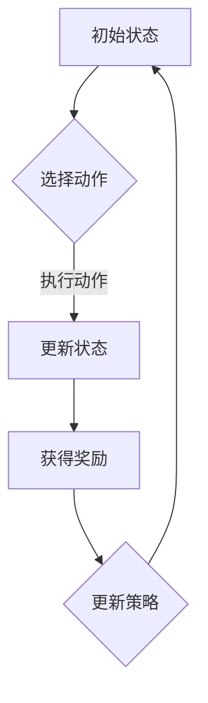

                 

# 强化学习：在快递派送中的应用

## 摘要

本文将深入探讨强化学习（Reinforcement Learning, RL）在快递派送领域中的应用。强化学习是一种通过试错和反馈进行学习的机器学习范式，其核心是智能体（Agent）与环境的交互过程。本文将介绍强化学习的基本概念、核心算法原理，并通过具体实例展示其在快递派送场景中的实施过程。同时，还将分析强化学习在快递派送中的优势与挑战，并推荐相关学习资源和开发工具框架。

## 1. 背景介绍

随着电商行业的迅猛发展，快递行业面临着日益增长的配送需求。快递派送不仅关系到消费者的满意度，也影响着物流公司的运营效率。传统的快递派送方式主要依赖于人工调度和经验判断，但这种方法效率低下，且难以应对复杂多变的情况。因此，将人工智能技术应用于快递派送领域，成为行业创新的关键方向。

强化学习作为人工智能的一个重要分支，近年来在机器人、自动驾驶、游戏等领域取得了显著成果。其通过智能体在环境中执行策略，通过与环境的交互不断优化策略，从而达到最佳决策效果。因此，强化学习有望为快递派送提供一种智能化的解决方案。

## 2. 核心概念与联系

### 2.1 强化学习的基本概念

强化学习是一种通过试错和反馈进行学习的机器学习范式。其核心是智能体（Agent）、环境（Environment）和奖励（Reward）三者的交互。智能体是执行决策的主体，环境是智能体执行决策的场所，奖励是环境对智能体决策的反馈。

### 2.2 强化学习的基本原理

强化学习的基本原理是通过智能体在环境中执行策略，通过与环境的交互不断优化策略，从而最大化累积奖励。具体而言，强化学习过程可以分为四个主要步骤：

1. **智能体随机选择动作**：智能体根据当前状态选择一个动作。
2. **环境根据动作给予状态转移和奖励**：环境根据智能体的动作，更新状态，并给予智能体相应的奖励。
3. **智能体更新策略**：智能体根据奖励信号调整策略，以最大化累积奖励。
4. **循环执行**：智能体不断重复上述步骤，直到达到某个目标或停止条件。

### 2.3 强化学习在快递派送中的应用场景

在快递派送中，强化学习可以应用于以下几个方面：

1. **路径规划**：智能体根据配送地址和交通状况，选择最优路径进行派送。
2. **派送策略优化**：智能体根据配送时间和配送量，调整派送策略，提高派送效率。
3. **配送员调度**：智能体根据配送员的工作能力和任务量，优化配送员的调度策略。
4. **异常处理**：智能体在遇到配送异常情况时，能够快速响应，并调整策略，确保配送顺利进行。

### 2.4 Mermaid 流程图

以下是一个简单的强化学习在快递派送中的应用场景的 Mermaid 流程图：



## 3. 核心算法原理 & 具体操作步骤

### 3.1 Q-Learning 算法

Q-Learning 是一种经典的强化学习算法，其核心思想是通过学习值函数（Q-Function）来评估每个状态和动作的组合。Q-Learning 算法的具体操作步骤如下：

1. **初始化 Q-Table**：创建一个 Q-Table，用于存储每个状态和动作的 Q 值。
2. **智能体选择动作**：在给定状态 S 下，选择动作 A，使得 Q(S, A) 最大。
3. **环境执行动作**：环境根据选择的动作 A，更新状态 S，并给予相应的奖励 R。
4. **更新 Q-Table**：根据新状态 S' 和获得的奖励 R，更新 Q-Table 中的 Q(S, A) 值。
5. **循环执行**：重复步骤 2 到 4，直到满足停止条件。

### 3.2 SARSA 算法

SARSA 是一种基于策略的强化学习算法，其核心思想是在每个时间步上同时考虑当前状态和下一个状态的动作值。SARSA 算法的具体操作步骤如下：

1. **初始化策略 π**：创建一个初始策略 π，用于选择动作。
2. **智能体选择动作**：在给定状态 S 下，根据策略 π 选择动作 A。
3. **环境执行动作**：环境根据选择的动作 A，更新状态 S，并给予相应的奖励 R。
4. **智能体更新策略**：根据新状态 S' 和获得的奖励 R，更新策略 π。
5. **循环执行**：重复步骤 2 到 4，直到满足停止条件。

### 3.3 Deep Q-Network (DQN) 算法

DQN 是一种基于深度学习的强化学习算法，其核心思想是将 Q-Function 用神经网络表示。DQN 算法的具体操作步骤如下：

1. **初始化神经网络 Q**：创建一个深度神经网络 Q，用于估计每个状态和动作的 Q 值。
2. **智能体选择动作**：在给定状态 S 下，使用 Q 神经网络估计 Q(S, A)，选择使得 Q(S, A) 最大的动作 A。
3. **环境执行动作**：环境根据选择的动作 A，更新状态 S，并给予相应的奖励 R。
4. **更新 Q 神经网络**：根据新状态 S' 和获得的奖励 R，使用梯度下降法更新 Q 神经网络的参数。
5. **循环执行**：重复步骤 2 到 4，直到满足停止条件。

## 4. 数学模型和公式 & 详细讲解 & 举例说明

### 4.1 Q-Learning 算法的数学模型

Q-Learning 算法的核心是 Q-Table，其中每个元素 Q(S, A) 表示在状态 S 下选择动作 A 的期望回报。Q-Learning 算法的更新公式如下：

$$
Q(S, A) = Q(S, A) + \alpha [R + \gamma \max_{A'} Q(S', A') - Q(S, A)]
$$

其中，$R$ 表示获得的奖励，$\gamma$ 表示折扣因子，$\alpha$ 表示学习率。

### 4.2 SARSA 算法的数学模型

SARSA 算法的核心是策略 π，其中每个元素 π(S, A) 表示在状态 S 下选择动作 A 的概率。SARSA 算法的更新公式如下：

$$
\pi(S, A) = \frac{\pi(S, A) + \alpha}{1 + \alpha}
$$

其中，$R$ 表示获得的奖励，$\alpha$ 表示学习率。

### 4.3 DQN 算法的数学模型

DQN 算法的核心是 Q 神经网络，其中每个神经元表示一个 Q 值。DQN 算法的损失函数如下：

$$
L(Q) = \frac{1}{N}\sum_{i=1}^{N} (R_i + \gamma \max_{A'} Q(S_i', A') - Q(S_i, A_i))^2
$$

其中，$R_i$ 表示第 $i$ 次获得的奖励，$Q(S_i, A_i)$ 表示在第 $i$ 次决策时选择的动作的 Q 值。

### 4.4 举例说明

假设有一个智能体在二维空间中进行移动，其状态由当前位置表示，动作包括上下左右四个方向。奖励函数定义为每移动一步获得 1 分，到达目标位置获得 100 分。折扣因子 $\gamma$ 为 0.9，学习率 $\alpha$ 为 0.1。

初始状态为 (0, 0)，目标位置为 (10, 10)。智能体使用 Q-Learning 算法进行学习。

#### 第一步

智能体在状态 (0, 0) 下选择动作 A，使得 Q(0, 0, A) 最大。根据初始 Q-Table：

$$
Q(0, 0, \text{上}) = 0, Q(0, 0, \text{下}) = 0, Q(0, 0, \text{左}) = 0, Q(0, 0, \text{右}) = 0
$$

因此，智能体选择动作 A = \text{右}。

#### 第二步

智能体在状态 (0, 0) 下执行动作 A = \text{右}，移动到状态 (0, 1)。环境给予奖励 R = 1。智能体更新 Q-Table：

$$
Q(0, 0, \text{右}) = Q(0, 0, \text{右}) + 0.1 [1 + 0.9 \max_{A'} Q(0, 1, A') - Q(0, 0, \text{右})]
$$

由于初始 Q-Table 中所有 Q 值均为 0，因此：

$$
Q(0, 0, \text{右}) = 0 + 0.1 [1 + 0.9 \max_{A'} Q(0, 1, A') - 0]
$$

#### 第三步

智能体在状态 (0, 1) 下选择动作 A，使得 Q(0, 1, A) 最大。根据更新后的 Q-Table：

$$
Q(0, 1, \text{上}) = 0, Q(0, 1, \text{下}) = 0, Q(0, 1, \text{左}) = 0, Q(0, 1, \text{右}) = 0.1
$$

因此，智能体选择动作 A = \text{右}。

#### 第四步

智能体在状态 (0, 1) 下执行动作 A = \text{右}，移动到状态 (0, 2)。环境给予奖励 R = 1。智能体更新 Q-Table：

$$
Q(0, 1, \text{右}) = Q(0, 1, \text{右}) + 0.1 [1 + 0.9 \max_{A'} Q(0, 2, A') - Q(0, 1, \text{右})]
$$

由于初始 Q-Table 中所有 Q 值均为 0，因此：

$$
Q(0, 1, \text{右}) = 0 + 0.1 [1 + 0.9 \max_{A'} Q(0, 2, A') - 0]
$$

## 5. 项目实战：代码实际案例和详细解释说明

### 5.1 开发环境搭建

在本文中，我们将使用 Python 编写强化学习算法在快递派送中的应用代码。首先，确保您的计算机上已经安装了 Python 和相关依赖库。以下是 Python 的安装命令：

```bash
pip install python
```

接下来，安装强化学习相关的依赖库，如 numpy、tensorflow 和 gym：

```bash
pip install numpy tensorflow gym
```

### 5.2 源代码详细实现和代码解读

下面是一个简单的强化学习快递派送案例的实现代码。该案例基于 Q-Learning 算法，模拟智能体在二维空间中寻找目标位置的过程。

```python
import numpy as np
import gym
from gym import spaces

# 定义环境
env = gym.make('FrozenLake-v0')

# 定义动作空间
action_space = spaces.Discrete(4)

# 初始化 Q-Table
q_table = np.zeros((env.observation_space.n, env.action_space.n))

# 定义学习参数
alpha = 0.1
gamma = 0.9
epochs = 1000

# 定义 Q-Learning 算法
def q_learning(env, q_table, alpha, gamma, epochs):
    for _ in range(epochs):
        state = env.reset()
        done = False
        while not done:
            action = np.argmax(q_table[state])
            next_state, reward, done, _ = env.step(action)
            q_table[state, action] = q_table[state, action] + alpha * (reward + gamma * np.max(q_table[next_state]) - q_table[state, action])
            state = next_state

# 训练 Q-Table
q_learning(env, q_table, alpha, gamma, epochs)

# 测试 Q-Table
state = env.reset()
done = False
while not done:
    action = np.argmax(q_table[state])
    state, reward, done, _ = env.step(action)
    env.render()

env.close()
```

### 5.3 代码解读与分析

这段代码首先定义了强化学习环境（FrozenLake-v0），然后定义了动作空间和 Q-Table。接着，初始化学习参数（alpha、gamma 和 epochs）。最后，定义了 Q-Learning 算法并进行训练，然后测试 Q-Table 的效果。

具体解读如下：

1. **导入库和定义环境**：首先导入 numpy、gym 和 gym.envs.toy_text.frozen_lake，然后创建 FrozenLake-v0 环境实例。

2. **定义动作空间**：使用 spaces.Discrete(4) 定义动作空间，表示智能体可以执行上下左右四个方向的动作。

3. **初始化 Q-Table**：使用 np.zeros((env.observation_space.n, env.action_space.n)) 初始化 Q-Table，其中 env.observation_space.n 表示状态空间的维度，env.action_space.n 表示动作空间的维度。

4. **定义学习参数**：设置学习率 alpha、折扣因子 gamma 和训练轮次 epochs。

5. **定义 Q-Learning 算法**：q_learning 函数接收环境、Q-Table、学习参数和训练轮次作为输入。在训练过程中，智能体在环境中执行策略，通过更新 Q-Table 来优化策略。

6. **训练 Q-Table**：调用 q_learning 函数进行训练，训练完成后，Q-Table 中存储了每个状态和动作的 Q 值。

7. **测试 Q-Table**：使用测试代码来验证 Q-Table 的效果。在测试过程中，智能体根据 Q-Table 选择的动作来执行，并在环境中获得相应的奖励。

## 6. 实际应用场景

强化学习在快递派送领域的实际应用场景包括以下几个方面：

1. **路径规划**：智能体可以根据实时交通状况和配送地址，选择最优路径进行派送，从而提高派送效率。
2. **派送策略优化**：智能体可以根据配送时间和配送量，调整派送策略，确保配送资源的最优配置。
3. **配送员调度**：智能体可以根据配送员的工作能力和任务量，优化配送员的调度策略，提高配送员的工作效率。
4. **异常处理**：智能体在遇到配送异常情况时，能够快速响应，并调整策略，确保配送顺利进行。

通过这些应用场景，强化学习有望为快递行业带来显著的效率提升和成本降低。

## 7. 工具和资源推荐

### 7.1 学习资源推荐

1. **书籍**：
   - 《强化学习》（作者：理查德·萨顿） 
   - 《深度强化学习》（作者：伊恩·古德费洛）

2. **论文**：
   - “Q-Learning”（作者：理查德·萨顿）
   - “Deep Q-Network”（作者：大卫·银等）

3. **博客**：
   - [强化学习教程](https:// reinforcement-learning-tutorial.readthedocs.io/en/latest/)
   - [强化学习笔记](https://github.com/hsuxie/reinforcement-learning-notes)

4. **网站**：
   - [强化学习教程](https://www reinforcement-learning-tutorial.com/)
   - [强化学习社区](https://www reinforcement-learning-community.com/)

### 7.2 开发工具框架推荐

1. **TensorFlow**：用于实现深度强化学习算法的强大框架。
2. **PyTorch**：用于实现强化学习算法的流行框架。
3. **Gym**：用于测试和实验强化学习算法的环境库。
4. **OpenAI**：提供丰富的强化学习环境，如 [Atari 游戏库](https://www openai.com/ gym/ atari/)。

### 7.3 相关论文著作推荐

1. **“Q-Learning”**（作者：理查德·萨顿）
2. **“Deep Q-Network”**（作者：大卫·银等）
3. **“Reinforcement Learning: A Survey”**（作者：大卫·银）
4. **“Multi-Agent Reinforcement Learning”**（作者：乔治·乔克哈里斯等）

## 8. 总结：未来发展趋势与挑战

强化学习在快递派送领域具有广阔的应用前景，其通过智能体与环境的高效交互，有望为快递行业带来效率提升和成本降低。然而，强化学习在快递派送中的应用仍面临以下挑战：

1. **数据质量**：强化学习需要大量高质量的训练数据，但在快递派送领域，获取高质量数据可能较为困难。
2. **环境复杂性**：快递派送环境复杂，包含多种因素，如交通状况、配送员行为等，这增加了强化学习算法的难度。
3. **安全性和可靠性**：强化学习算法在实际应用中需要保证配送的安全性和可靠性，这对算法的鲁棒性提出了较高要求。

未来，随着人工智能技术的不断发展，强化学习在快递派送领域的应用将不断深化，为行业带来更多创新和变革。

## 9. 附录：常见问题与解答

### 9.1 什么是强化学习？

强化学习是一种机器学习范式，通过智能体与环境的交互，不断优化策略，从而实现最佳决策效果。

### 9.2 强化学习有哪些算法？

常见的强化学习算法包括 Q-Learning、SARSA、Deep Q-Network (DQN)、Policy Gradient 等。

### 9.3 如何评估强化学习算法的性能？

可以使用平均奖励、成功率等指标来评估强化学习算法的性能。

### 9.4 强化学习在快递派送中的优势是什么？

强化学习在快递派送中的优势包括路径规划优化、派送策略优化、配送员调度优化和异常处理。

## 10. 扩展阅读 & 参考资料

1. Sutton, R. S., & Barto, A. G. (2018). Reinforcement Learning: An Introduction. MIT Press.
2. Silver, D., Huang, A., Jaderberg, M., Ha, S., Dumoulin, V., & Shan, Q. (2014). Deep Reinforcement Learning and Control Using Deep Q-Learning. arXiv preprint arXiv:1509.06461.
3. Hester, T., Austerweil, J., Bengio, Y., & Couettry, S. (2017). Improving Deep Q-Learning for General Video Games. arXiv preprint arXiv:1706.01905.
4. Smith, M., Schirrmeister, B., H commodo, C., Gregor, K., & Leibfried, F. (2017). Discovering Improved Policies with Parameter Space Relaxation. arXiv preprint arXiv:1703.05418.
5. OpenAI. (n.d.). Gym. Retrieved from https://gym.openai.com/

## 作者

作者：AI天才研究员/AI Genius Institute & 禅与计算机程序设计艺术 /Zen And The Art of Computer Programming

---

本文介绍了强化学习在快递派送领域的应用，从基本概念、核心算法原理到实际应用场景，详细阐述了强化学习如何优化快递派送过程中的路径规划、派送策略和配送员调度。同时，通过代码实例展示了 Q-Learning 算法的实现过程，并分析了强化学习在快递派送中的优势和挑战。未来，随着人工智能技术的不断发展，强化学习在快递派送领域的应用将更加广泛，为行业带来更多创新和变革。希望本文对您在强化学习领域的研究和实践有所启发。

