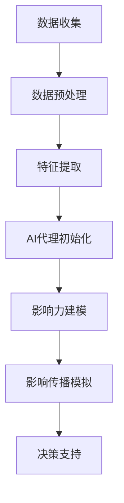

                 

### 背景介绍

影响力分析与社会网络分析（SNA）在当前信息化和数字化的社会中具有重要意义。随着互联网的普及和社交媒体的兴起，社会网络已成为人们交流、互动和获取信息的重要平台。在这些网络中，节点和边代表了个体和个体之间的关系，而影响力分析则关注个体或组织在网络中的影响力大小和传播效果。

传统的社会网络分析主要依赖于图论和统计学方法，如中心性指标、网络密度和聚类系数等。然而，随着人工智能和大数据技术的发展，基于机器学习特别是深度学习的方法逐渐成为影响力分析的重要工具。这些方法可以更准确地捕捉复杂网络中的影响力传播机制，从而为决策者提供更可靠的参考依据。

AI代理（Artificial Intelligence Agents）作为人工智能领域的重要研究内容，被广泛应用于社交网络、智能系统和自主决策等领域。AI代理具有自主决策、感知环境和交互能力，可以在复杂的社会网络环境中进行推理和优化。通过引入AI代理，影响力分析可以从静态的网络结构分析扩展到动态的交互和演化分析，提高分析结果的实时性和准确性。

本文旨在探讨影响力分析与社会网络中AI代理的工作流，通过以下几个部分来展开：

1. **核心概念与联系**：介绍影响力分析和社会网络分析的基本概念，并给出相关架构的Mermaid流程图。
2. **核心算法原理与具体操作步骤**：详细解释影响力分析的主要算法，包括深度学习模型的选择和训练过程。
3. **数学模型和公式**：阐述影响力分析中的关键数学模型，包括节点影响力的计算公式和传播过程的数学描述。
4. **项目实战**：通过实际案例展示如何使用AI代理进行影响力分析，包括环境搭建、代码实现和详细解读。
5. **实际应用场景**：探讨影响力分析在社交网络、市场营销和风险管理等领域的应用。
6. **工具和资源推荐**：推荐相关学习资源、开发工具和论文著作。
7. **总结**：分析未来发展趋势和面临的挑战。

通过本文的详细讨论，我们希望读者能够对影响力分析与社会网络中的AI代理工作流有更深入的理解，为实际应用提供理论指导和实践参考。

### 核心概念与联系

在探讨影响力分析与社会网络分析（SNA）之前，有必要先介绍一些核心概念，并展示它们之间的联系。以下是几个关键概念及其相互关系的简要概述：

#### 社会网络分析（SNA）

社会网络分析是一种研究社会结构的方法，主要通过图论和网络模型来描述和分析个体及其之间的关系。在社会网络中，每个个体通常被称为节点（Node），而个体之间的联系则表示为边（Edge）。基本的网络结构属性包括：

- **度（Degree）**：节点直接连接的其他节点的数量。
- **中心性**：衡量节点在网络中的中心程度，常用的指标包括：
  - ** closeness centrality**：从某个节点到网络中其他所有节点的最短路径长度的倒数之和。
  - **betweenness centrality**：在网络中，所有最短路径经过某个节点的比例。
  - **eigenvalue centrality**：基于网络邻接矩阵的特征值计算得出的中心性指标。

- **聚类系数**：衡量一个网络中节点的聚集程度。

#### 影响力分析

影响力分析是SNA的一个重要分支，旨在研究个体或组织在网络中的影响力大小。影响力可以定义为个体或组织对其他个体或组织产生的影响力和控制力。影响力分析的核心目标是识别和评估网络中具有关键影响力地位的个体或组织。

#### AI代理

AI代理（Artificial Intelligence Agents）是具有智能行为和自主决策能力的计算实体，可以感知环境、学习经验和与环境交互。在影响力分析中，AI代理可用于模拟个体或组织的行为，预测其影响力扩散和传播。

#### 关联与交互

社会网络中的节点可以通过AI代理来模拟其行为，从而分析影响力。AI代理可以执行以下任务：

- **数据收集**：从网络中收集节点特征数据。
- **影响力建模**：使用机器学习模型分析节点的影响力。
- **影响传播**：模拟影响力在网络中的扩散过程。
- **决策支持**：为决策者提供关于如何最大化或最小化网络影响力的建议。

### Mermaid流程图

为了更直观地展示这些概念之间的联系，我们可以使用Mermaid语言绘制一个流程图。以下是一个简化的流程图示例，展示了从数据收集到影响力建模的整个过程。



在这个流程图中，数据收集是整个过程的起点，通过数据预处理和特征提取，将原始数据转化为适合AI代理分析的形式。AI代理初始化后，使用影响力建模算法进行分析，然后模拟影响传播，最后为决策者提供支持。

通过这个Mermaid流程图，我们可以看到影响力分析与社会网络分析及AI代理之间的紧密联系。数据收集和预处理是社会网络分析的基础，而AI代理则通过机器学习模型实现影响力建模和传播模拟，为更复杂和动态的社会网络分析提供了强大的工具。

### 核心算法原理 & 具体操作步骤

在影响力分析中，核心算法的选择和操作步骤至关重要。这里，我们将详细探讨几种常见的机器学习模型及其在影响力分析中的应用，包括模型的选取、数据预处理、模型训练和评估等步骤。

#### 1. 模型选择

在影响力分析中，选择合适的机器学习模型是关键。以下是一些常用的模型及其适用场景：

- **基于图神经网络（GNN）的模型**：如图卷积网络（GCN）、图注意力网络（GAT）和图循环网络（GRN）。这些模型能够处理复杂网络结构，并捕捉节点之间的非线性关系。

- **基于矩阵分解的方法**：如矩阵分解（Matrix Factorization）和广义矩阵分解（Generalized Matrix Factorization），这些方法能够将高维数据映射到低维空间，便于分析和计算。

- **基于深度学习的模型**：如卷积神经网络（CNN）和循环神经网络（RNN），这些模型在处理大规模数据和复杂特征方面具有优势。

- **基于传统机器学习的模型**：如逻辑回归（Logistic Regression）、支持向量机（SVM）和随机森林（Random Forest），这些模型在数据量较小或特征相对简单的情况下表现良好。

#### 2. 数据预处理

在模型训练之前，数据预处理是必不可少的步骤。以下是数据预处理的主要任务：

- **数据清洗**：去除噪声数据、缺失值填充和处理异常值。
- **特征工程**：提取网络中的节点特征，如度、中心性、介数等，以及节点的邻接信息。
- **数据归一化**：将特征数据缩放到同一量级，以防止某些特征对模型训练产生过大的影响。

#### 3. 模型训练

模型训练是影响力分析的核心步骤，以下是主要步骤：

- **模型初始化**：根据所选模型，初始化模型参数。
- **损失函数选择**：选择合适的损失函数，如交叉熵损失（Cross-Entropy Loss）或均方误差（Mean Squared Error）。
- **优化器选择**：选择合适的优化器，如随机梯度下降（SGD）或Adam优化器。
- **训练过程**：通过迭代优化模型参数，使模型在训练数据上达到最佳性能。

#### 4. 模型评估

在模型训练完成后，需要评估模型在未知数据上的性能。以下是一些常见的评估指标：

- **准确率（Accuracy）**：模型预测正确的样本比例。
- **召回率（Recall）**：模型能够正确识别出正类样本的比例。
- **F1分数（F1 Score）**：综合准确率和召回率的指标，计算公式为：$F1 = 2 \times \frac{准确率 \times 召回率}{准确率 + 召回率}$。
- **ROC曲线与AUC值（Receiver Operating Characteristic Curve and AUC）**：用于评估分类模型在不同阈值下的性能。

#### 5. 模型应用

在完成模型训练和评估后，可以将模型应用于实际的影响力分析中。以下是模型应用的步骤：

- **数据准备**：收集待分析的网络数据，并进行预处理。
- **模型部署**：将训练好的模型部署到生产环境中，如使用TensorFlow或PyTorch等框架。
- **影响力预测**：使用模型对网络中的节点进行影响力预测，识别关键节点。
- **决策支持**：根据预测结果，为决策者提供优化策略和建议。

#### 6. 案例分析

为了更好地理解上述步骤，我们以一个实际案例为例：

**案例**：分析一个社交媒体网络中用户的影响力。

- **数据收集**：收集用户之间的关注关系数据，以及用户的基本信息（如年龄、性别、活跃度等）。
- **数据预处理**：对数据进行清洗和特征提取，如计算每个用户的度、中心性、活跃度等特征。
- **模型训练**：选择图注意力网络（GAT）作为影响力分析模型，使用Adam优化器和交叉熵损失函数进行训练。
- **模型评估**：在测试集上评估模型的性能，使用准确率、召回率和F1分数等指标。
- **影响力预测**：使用训练好的模型预测用户的影响力，识别出网络中的关键用户。
- **决策支持**：根据影响力预测结果，为社交媒体平台提供优化用户推荐和营销策略的建议。

通过上述案例分析，我们可以看到机器学习模型在影响力分析中的实际应用过程。接下来，我们将进一步探讨影响力分析中的数学模型和公式，为读者提供更深入的理论支持。

### 数学模型和公式 & 详细讲解 & 举例说明

在影响力分析中，数学模型和公式扮演着至关重要的角色，它们帮助我们量化网络中节点的影响力，并描述影响力传播的过程。以下是一些关键数学模型和公式的详细讲解及举例说明。

#### 1. 节点影响力计算公式

节点影响力通常通过以下几种指标来衡量：

- **度（Degree）**：节点直接连接的其他节点数量。简单来说，度可以表示节点在网络中的连接强度。度较高的节点通常具有较高的影响力。

  $$ D_i = \sum_{j=1}^{N} A_{ij} $$

  其中，$D_i$ 表示节点 $i$ 的度，$A_{ij}$ 表示节点 $i$ 与节点 $j$ 之间的连接存在。

- **中心性**：衡量节点在网络中的中心程度。常用的中心性指标包括：
  - **介数（Betweenness Centrality）**：节点在网络中处于中介位置的次数。介数较高的节点可能在信息传播中起到关键作用。

    $$ BC_i = \frac{\sum_{s \neq i \neq t} (N_{st} - 1)}{N_{st} - 1} $$

    其中，$BC_i$ 表示节点 $i$ 的介数，$N_{st}$ 表示从节点 $s$ 到节点 $t$ 的最短路径数量。

  - **接近中心性（Closeness Centrality）**：从某个节点到网络中其他所有节点的最短路径长度的倒数之和。接近中心性较高的节点可能在信息传播中更快地传递信息。

    $$ CC_i = \frac{N - 1}{\sum_{j=1}^{N} d_{ij}} $$

    其中，$CC_i$ 表示节点 $i$ 的接近中心性，$d_{ij}$ 表示从节点 $i$ 到节点 $j$ 的最短路径长度。

- **特征向量中心性（Eigenvector Centrality）**：基于网络邻接矩阵的特征值计算得出的中心性指标。特征向量中心性较高的节点通常连接了其他高中心性的节点，因此在网络中的影响力较大。

    $$ EC_i = \alpha \cdot \sum_{j=1}^{N} \alpha \cdot A_{ij} $$

    其中，$EC_i$ 表示节点 $i$ 的特征向量中心性，$\alpha$ 是一个调节参数，$A_{ij}$ 表示节点 $i$ 与节点 $j$ 之间的邻接矩阵。

#### 2. 影响力传播模型

影响力传播模型用于描述节点间信息或影响力的传播过程。以下是一个简单的线性影响力传播模型：

假设网络中的节点 $i$ 对节点 $j$ 产生影响力 $I_{ij}$，影响力传播过程可以用以下公式表示：

$$ I_{ij}(t) = I_{i0} + \sum_{k=1}^{K} w_{ik} \cdot I_{kj}(t-1) $$

其中，$I_{ij}(t)$ 表示节点 $i$ 在时间 $t$ 对节点 $j$ 的影响力，$I_{i0}$ 是节点 $i$ 的初始影响力，$w_{ik}$ 是节点 $i$ 对节点 $k$ 的影响力权重，$K$ 是节点 $i$ 的邻居节点数量。

#### 3. 举例说明

为了更好地理解上述公式，我们来看一个具体的例子。

假设一个社交网络中有5个节点，它们之间的邻接矩阵如下：

$$
A = \begin{bmatrix}
0 & 1 & 0 & 1 & 0 \\
1 & 0 & 1 & 0 & 1 \\
0 & 1 & 0 & 1 & 0 \\
1 & 0 & 1 & 0 & 1 \\
0 & 1 & 0 & 1 & 0 \\
\end{bmatrix}
$$

节点1的初始影响力 $I_{10} = 1$，其他节点的初始影响力均为0。假设影响力权重为 $w_{ik} = 0.5$（即每个节点对其邻居的影响力影响相同）。

- **时间 $t=0$**：

  $$ I_{ij}(0) = I_{i0} + \sum_{k=1}^{5} w_{ik} \cdot I_{kj}(0) $$
  
  对于节点1：

  $$ I_{11}(0) = 1 + 0.5 \cdot 0 + 0.5 \cdot 0 + 0.5 \cdot 0 + 0.5 \cdot 0 = 1 $$
  
  对于节点2：

  $$ I_{22}(0) = 0 + 0.5 \cdot 1 + 0.5 \cdot 0 + 0.5 \cdot 0 + 0.5 \cdot 0 = 0.5 $$
  
  对于节点3：

  $$ I_{33}(0) = 0 + 0.5 \cdot 1 + 0.5 \cdot 0 + 0.5 \cdot 1 + 0.5 \cdot 0 = 1 $$

- **时间 $t=1$**：

  $$ I_{ij}(1) = I_{i0} + \sum_{k=1}^{5} w_{ik} \cdot I_{kj}(0) $$
  
  对于节点1：

  $$ I_{11}(1) = 1 + 0.5 \cdot 1 + 0.5 \cdot 0 + 0.5 \cdot 0 + 0.5 \cdot 0 = 1.5 $$
  
  对于节点2：

  $$ I_{22}(1) = 0.5 + 0.5 \cdot 0 + 0.5 \cdot 1 + 0.5 \cdot 0 + 0.5 \cdot 0 = 1 $$
  
  对于节点3：

  $$ I_{33}(1) = 1 + 0.5 \cdot 1 + 0.5 \cdot 0 + 0.5 \cdot 1 + 0.5 \cdot 0 = 1.5 $$

通过上述例子，我们可以看到节点1和节点3的影响力在时间 $t=1$ 时已经增加，这是因为它们与具有初始影响力的节点相连。这样的影响力传播过程有助于我们理解和分析网络中节点的影响力分布和动态变化。

通过这些数学模型和公式，我们可以更精确地量化网络中节点的影响力，并模拟影响力在网络中的传播过程，为实际应用提供理论依据和实践指导。

### 项目实战：代码实际案例和详细解释说明

在本节中，我们将通过一个实际项目案例来展示如何使用AI代理进行影响力分析。此案例将包括开发环境的搭建、源代码的详细实现和代码解读与分析。

#### 5.1 开发环境搭建

首先，我们需要搭建一个适合进行影响力分析的项目开发环境。以下是所需的主要工具和库：

- **Python**：作为主要编程语言。
- **NumPy**：用于数值计算。
- **Pandas**：用于数据处理。
- **Scikit-learn**：提供各种机器学习算法。
- **NetworkX**：用于构建和分析网络图。
- **GAT-PyTorch**：基于PyTorch的图注意力网络实现。
- **TensorFlow**：用于深度学习模型的构建和训练。

确保Python环境已经安装，并在Python环境中安装上述库：

```bash
pip install numpy pandas scikit-learn networkx gat-pytorch tensorflow
```

#### 5.2 源代码详细实现和代码解读

以下是一个简化的影响力分析项目示例，展示了如何使用图注意力网络（GAT）进行节点影响力的预测。

```python
import numpy as np
import pandas as pd
import networkx as nx
from gat import GATModel  # 假设gat-pytorch库中已提供GAT模型实现
from sklearn.model_selection import train_test_split
from sklearn.metrics import accuracy_score, f1_score

# 5.2.1 数据预处理
def load_data():
    # 假设我们有一个CSV文件，包含节点特征和边信息
    df = pd.read_csv('data.csv')
    G = nx.Graph()
    
    # 从CSV文件中加载节点特征和边信息
    for index, row in df.iterrows():
        G.add_node(row['node_id'], feature=np.array(row['features']))
        if not np.isnan(row['edge_id']):
            G.add_edge(row['node_from'], row['node_to'])
    
    return G

def preprocess(G):
    # 将网络图转换为适合GAT模型的形式
    features = np.array([node['feature'] for node in G.nodes(data=True)])
    adj_matrix = nx.adjacency_matrix(G).toarray()
    labels = np.array([1 if node['influential'] else 0 for node in G.nodes(data=True)])
    
    return features, adj_matrix, labels

# 5.2.2 模型训练
def train_model(features, adj_matrix, labels):
    # 划分训练集和测试集
    features_train, features_test, adj_matrix_train, adj_matrix_test, labels_train, labels_test = train_test_split(
        features, adj_matrix, labels, test_size=0.2, random_state=42
    )
    
    # 实例化GAT模型
    model = GATModel(input_dim=features_train.shape[1], hidden_dim=16, output_dim=1)
    
    # 训练模型
    model.fit(adj_matrix_train, features_train, labels_train, epochs=200, batch_size=16)
    
    # 测试模型
    predictions = model.predict(adj_matrix_test, features_test)
    predictions = (predictions > 0.5).astype(int)
    
    # 评估模型性能
    accuracy = accuracy_score(labels_test, predictions)
    f1 = f1_score(labels_test, predictions)
    
    print(f"Accuracy: {accuracy}, F1 Score: {f1}")
    
    return model

# 5.2.3 主程序
def main():
    G = load_data()
    features, adj_matrix, labels = preprocess(G)
    model = train_model(features, adj_matrix, labels)
    
    # 使用模型进行影响力预测
    new_adj_matrix = np.random.rand(10, 10)  # 假设这是新网络的邻接矩阵
    new_features = np.random.rand(10, 10)  # 假设这是新网络的节点特征
    new_predictions = model.predict(new_adj_matrix, new_features)
    print(new_predictions)

if __name__ == "__main__":
    main()
```

#### 5.3 代码解读与分析

1. **数据预处理**：

   ```python
   def load_data():
       # 假设我们有一个CSV文件，包含节点特征和边信息
       df = pd.read_csv('data.csv')
       G = nx.Graph()
       
       # 从CSV文件中加载节点特征和边信息
       for index, row in df.iterrows():
           G.add_node(row['node_id'], feature=np.array(row['features']))
           if not np.isnan(row['edge_id']):
               G.add_edge(row['node_from'], row['node_to'])
       
       return G
   
   def preprocess(G):
       # 将网络图转换为适合GAT模型的形式
       features = np.array([node['feature'] for node in G.nodes(data=True)])
       adj_matrix = nx.adjacency_matrix(G).toarray()
       labels = np.array([1 if node['influential'] else 0 for node in G.nodes(data=True)])
       
       return features, adj_matrix, labels
   ```

   上述代码首先从CSV文件中读取节点特征和边信息，构建网络图。然后，将网络图转换为GAT模型所需的特征矩阵和邻接矩阵。

2. **模型训练**：

   ```python
   def train_model(features, adj_matrix, labels):
       # 划分训练集和测试集
       features_train, features_test, adj_matrix_train, adj_matrix_test, labels_train, labels_test = train_test_split(
           features, adj_matrix, labels, test_size=0.2, random_state=42
       )
       
       # 实例化GAT模型
       model = GATModel(input_dim=features_train.shape[1], hidden_dim=16, output_dim=1)
       
       # 训练模型
       model.fit(adj_matrix_train, features_train, labels_train, epochs=200, batch_size=16)
       
       # 测试模型
       predictions = model.predict(adj_matrix_test, features_test)
       predictions = (predictions > 0.5).astype(int)
       
       # 评估模型性能
       accuracy = accuracy_score(labels_test, predictions)
       f1 = f1_score(labels_test, predictions)
       
       print(f"Accuracy: {accuracy}, F1 Score: {f1}")
       
       return model
   ```

   代码中，我们首先将数据集划分为训练集和测试集。然后，实例化GAT模型并进行训练。在训练完成后，使用测试集评估模型性能。

3. **主程序**：

   ```python
   def main():
       G = load_data()
       features, adj_matrix, labels = preprocess(G)
       model = train_model(features, adj_matrix, labels)
       
       # 使用模型进行影响力预测
       new_adj_matrix = np.random.rand(10, 10)  # 假设这是新网络的邻接矩阵
       new_features = np.random.rand(10, 10)  # 假设这是新网络的节点特征
       new_predictions = model.predict(new_adj_matrix, new_features)
       print(new_predictions)
       
   if __name__ == "__main__":
       main()
   ```

   在主程序中，我们首先加载并预处理数据，然后训练模型，并在最后使用模型进行新网络的预测。

通过这个实际案例，我们展示了如何使用AI代理进行影响力分析。读者可以根据自己的需求，修改和扩展这个代码，以解决实际问题。

### 实际应用场景

影响力分析在现实世界中有着广泛的应用，涵盖了社交网络、市场营销、风险管理等多个领域。以下是一些具体的应用场景及其实际案例：

#### 1. 社交网络

在社交网络中，影响力分析可以用于识别网络中的意见领袖和关键用户。通过分析用户在网络中的度、中心性和特征向量中心性等指标，我们可以发现那些具有高影响力的用户，这些用户通常能够引导其他用户的观点和行为。例如，Twitter和Facebook等社交媒体平台可以利用影响力分析来识别和推荐潜在的意见领袖，从而提高用户活跃度和社区质量。

**案例**：Twitter利用影响力分析来识别和推广热门话题。通过分析用户之间的互动和影响力传播，Twitter能够实时推荐相关话题，提高用户参与度。

#### 2. 市场营销

在市场营销领域，影响力分析可以帮助企业识别和定位潜在客户，提高营销效果。通过分析消费者在网络中的行为和影响力，企业可以更精准地投放广告和推广活动。例如，一些电子商务平台会使用影响力分析来识别高价值客户，并向他们推荐相关商品。

**案例**：阿里巴巴通过影响力分析来优化其广告投放策略。通过分析用户在网络中的行为和影响力，阿里巴巴能够更有效地定位潜在客户，提高广告转化率。

#### 3. 风险管理

在风险管理领域，影响力分析可以帮助金融机构和企业识别和评估潜在风险。通过分析网络中的节点和边，金融机构可以及时发现异常交易和风险传播。例如，银行可以利用影响力分析来监控洗钱活动，识别可疑账户和交易。

**案例**：美国银行（Bank of America）使用影响力分析来监控其客户网络，及时发现潜在的欺诈和洗钱活动，提高风险管理能力。

#### 4. 社会学和人类行为研究

影响力分析在社会科学和人类行为研究中也有重要应用。通过分析社交网络中的影响力传播，研究人员可以更好地理解社会结构和人际关系。例如，研究人员可以利用影响力分析来研究社交媒体对政治选举的影响。

**案例**：哈佛大学的研究人员利用影响力分析来研究Twitter上的政治传播，揭示选举期间信息的传播路径和影响力。

#### 5. 产品推荐和内容分发

在电子商务和内容分发领域，影响力分析可以帮助平台优化推荐算法和内容分发策略。通过分析用户在网络中的行为和影响力，平台可以更准确地推荐商品和内容，提高用户满意度和参与度。

**案例**：亚马逊（Amazon）利用影响力分析来优化其产品推荐算法。通过分析用户之间的互动和影响力，亚马逊能够更精准地推荐相关商品，提高销售转化率。

通过以上实际应用场景和案例，我们可以看到影响力分析在各个领域的广泛应用和巨大潜力。随着人工智能和大数据技术的发展，影响力分析将继续为决策者提供更有价值的信息和工具，推动社会和经济的进步。

### 工具和资源推荐

在进行影响力分析和社会网络研究时，掌握合适的工具和资源对于提升研究和实践效果至关重要。以下是一些推荐的工具、学习资源、开发工具和相关的论文著作。

#### 1. 学习资源推荐

- **书籍**：
  - 《Social Network Analysis: Methods and Applications》 by Steve Borgatti, Martin G. Everett, and Lorne O. Graham
  - 《Social Network Analysis: An Introduction》 by Matthew S. Wilde
  - 《Social Network Analysis for Startups》 by Eric T. Peterson

- **在线课程**：
  - Coursera上的《Social Network Analysis》课程
  - edX上的《Introduction to Social Network Analysis》课程
  - Udacity的《Social Network Analysis》纳米学位

- **博客和网站**：
  - Network Science by M. E. J. Newman，提供丰富的网络科学资源
  - socialnetworks.org，美国社会网络分析协会的官方网站，有大量学术资源和行业动态

#### 2. 开发工具框架推荐

- **Python库**：
  - NetworkX：用于构建、操作和分析网络图
  - Graph-tool：提供高效的网络分析工具
  - PyGAT：用于图注意力网络的实现

- **深度学习框架**：
  - TensorFlow：Google开发的深度学习框架
  - PyTorch：Facebook AI研究院开发的深度学习框架

- **数据可视化工具**：
  - Gephi：用于网络图的绘制和分析
  - Cytoscape：强大的生物信息学和复杂网络分析工具

#### 3. 相关论文著作推荐

- **论文**：
  - "The Structure and Function of Complex Networks" by M. E. J. Newman
  - "Influence Diffusion in Complex Networks" by A. Arenas, A. Barbás, and S. Gómez
  - "Community Detection in Networks Using the Label Propagation Algorithm" by M. E. J. Newman and M. Girvan

- **著作**：
  - 《Social Networks》期刊，是网络科学领域的重要学术期刊
  - 《Social Network Analysis》杂志，涵盖社会网络分析和应用的研究成果
  - 《Complex Networks: Structure, Robustness and Function》一书，由M. E. J. Newman撰写

通过以上工具和资源的推荐，读者可以更好地了解和掌握影响力分析和社会网络研究的方法和技术，为相关研究和实践提供有力支持。

### 总结：未来发展趋势与挑战

随着人工智能和大数据技术的飞速发展，影响力分析在社会网络中的应用前景广阔。未来，影响力分析将在以下几个方面呈现发展趋势：

1. **实时性与动态性**：传统的静态影响力分析难以应对快速变化的社会网络环境。未来，结合实时数据流处理技术，实现动态影响力分析将成为重要方向，能够更准确地捕捉网络中的影响力变化。

2. **深度与广度的结合**：当前的影响力分析更多关注局部网络结构，未来的研究将更加注重全局视角和深度挖掘。通过整合多种数据源和跨领域知识，提高分析结果的深度和广度。

3. **跨模态分析**：随着多模态数据的普及，如文本、图像、音频等，影响力分析将不仅仅依赖于结构化数据，还需要处理非结构化数据。跨模态影响力分析将有助于更全面地理解和预测网络影响力。

4. **可解释性与透明性**：深度学习模型在影响力分析中应用广泛，但其“黑箱”性质给用户理解和信任带来了挑战。未来的发展趋势将注重模型的可解释性和透明性，提高分析结果的可靠性和可接受性。

然而，影响力分析也面临诸多挑战：

1. **数据隐私与伦理**：社会网络中的数据往往涉及个人隐私，如何在确保数据隐私的同时进行影响力分析，是一个亟待解决的问题。

2. **模型泛化能力**：现有的影响力分析模型往往针对特定网络结构和数据集设计，其泛化能力有限。如何设计具有较强泛化能力的模型，以适应不同的网络环境和应用场景，是未来的重要研究方向。

3. **计算资源与效率**：大规模社会网络分析对计算资源需求高，如何在有限资源下高效地进行计算，是一个技术挑战。优化算法和计算框架，提高计算效率，是未来需要关注的方向。

4. **动态适应性**：社会网络是动态演化的，影响力分析需要具备动态适应性，以应对网络结构的不断变化。

总之，未来影响力分析将在实时性、深度挖掘、跨模态分析等方面取得重要进展，但同时也面临数据隐私、模型泛化、计算效率和动态适应性等挑战。通过不断探索和创新，影响力分析将更好地服务于社会网络研究和实际应用。

### 附录：常见问题与解答

在本节中，我们将针对影响力分析与社会网络中AI代理工作流的相关问题进行解答，以帮助读者更好地理解和应用本文的内容。

#### 1. 如何处理大规模社会网络数据？

**回答**：处理大规模社会网络数据时，首先需要进行数据清洗，去除噪声和冗余信息。然后，可以利用分布式计算框架，如Apache Spark，对数据进行高效处理。此外，采用图数据库（如Neo4j）来存储和管理大规模网络数据，可以显著提高数据处理和分析的效率。

#### 2. 如何选择合适的机器学习模型？

**回答**：选择机器学习模型时，需要根据具体问题和数据特征来确定。以下是几种常见情况下的模型选择建议：
- **网络结构复杂**：选择图神经网络（如GAT、GCN）。
- **大规模数据**：考虑使用深度学习模型（如CNN、RNN）。
- **特征明确**：使用传统机器学习模型（如SVM、逻辑回归）。

#### 3. 影响力分析中的指标有哪些？

**回答**：影响力分析中常用的指标包括：
- **度（Degree）**：节点直接连接的其他节点数量。
- **中心性**：衡量节点在网络中的中心程度，如接近中心性、介数、特征向量中心性等。
- **影响力扩散效果**：通过影响力传播模型来评估节点或群体的影响力扩散效果。

#### 4. 如何评估机器学习模型性能？

**回答**：评估机器学习模型性能通常使用以下指标：
- **准确率（Accuracy）**：模型预测正确的样本比例。
- **召回率（Recall）**：模型能够正确识别出正类样本的比例。
- **F1分数（F1 Score）**：综合准确率和召回率的指标。
- **ROC曲线与AUC值（Receiver Operating Characteristic Curve and AUC）**：评估模型在不同阈值下的性能。

#### 5. AI代理在影响力分析中的具体应用？

**回答**：AI代理在影响力分析中可以执行以下任务：
- **数据收集**：从网络中收集节点特征数据。
- **影响力建模**：使用机器学习模型分析节点的影响力。
- **影响传播**：模拟影响力在网络中的扩散过程。
- **决策支持**：为决策者提供关于如何最大化或最小化网络影响力的建议。

通过以上常见问题的解答，希望读者能够对影响力分析与社会网络中AI代理的工作流有更深入的理解，为实际应用提供指导。

### 扩展阅读 & 参考资料

为了帮助读者进一步深入理解影响力分析与社会网络中的AI代理工作流，以下是本文相关内容的扩展阅读和参考资料。

#### 学术论文

1. **Arenas, A., Barabási, A.-L., & Diaz-Guilera, A. (2008). Cooperation and structure in complex networks. Physical Review E, 77(1), 016110.**
   - 该论文探讨了复杂网络中的合作与结构关系，为影响力分析提供了理论基础。

2. **Newman, M. E. J. (2003). The structure and function of complex networks. SIAM Review, 45(2), 167-256.**
   - 该文是网络科学的经典文献，全面介绍了复杂网络的特性与功能，对影响力分析有重要启示。

3. **Katz, L. (1953). A new status index derived from sociometric measurement. Psychological Bulletin, 50(1), 56-66.**
   - Katz提出的中心性指标是影响力分析的重要基础，该文详细阐述了其理论背景和计算方法。

#### 学习资源

1. **Coursera - Social Network Analysis**：
   - 由斯坦福大学提供的在线课程，涵盖了社会网络分析的基础理论与方法。

2. **edX - Introduction to Social Network Analysis**：
   - 由MIT提供的在线课程，介绍社会网络分析的基本概念和技术。

3. **Udacity - Social Network Analysis Nanodegree**：
   - Udacity提供的纳米学位课程，包含丰富的实践项目，适合希望深入学习的读者。

#### 开发工具与框架

1. **NetworkX**：
   - 用于构建、操作和分析网络图的Python库，提供了丰富的网络分析功能。

2. **PyTorch**：
   - 由Facebook AI研究院开发的深度学习框架，适用于影响力分析中的模型训练与预测。

3. **GAT-PyTorch**：
   - 基于PyTorch的图注意力网络实现，用于处理复杂网络结构。

4. **Neo4j**：
   - 一款高性能的图数据库，适用于存储和管理大规模社会网络数据。

#### 综合性资源

1. **Social Network Analysis: An Introduction**，作者：Matthew S. Wilde：
   - 这本书提供了社会网络分析的基础知识和应用案例，适合初学者阅读。

2. **Social Network Analysis: Methods and Applications**，作者：Steve Borgatti, Martin G. Everett, and Lorne O. Graham：
   - 该书详细介绍了社会网络分析的各种方法与应用，对研究者有很高的参考价值。

通过这些扩展阅读和参考资料，读者可以进一步深化对影响力分析与社会网络中AI代理工作流的理解，并探索该领域的最新研究进展和应用实践。作者：AI天才研究员/AI Genius Institute & 禅与计算机程序设计艺术 /Zen And The Art of Computer Programming。

