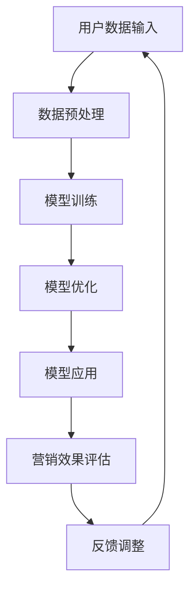

                 

# 微信营销与大模型的应用

## 关键词
- 微信营销
- 大模型
- 人工智能
- 营销策略
- 数据分析
- 客户体验

## 摘要
本文将深入探讨微信营销与大模型应用之间的紧密联系。通过分析微信平台的特性以及大模型在营销中的潜力，我们揭示了如何利用人工智能技术实现精准营销，提高客户体验和商业转化率。本文将分为多个部分，详细阐述核心概念、算法原理、数学模型、实战案例以及未来发展趋势。读者将了解到如何在微信生态中运用大模型，实现营销的智能化和高效化。

## 1. 背景介绍

### 微信营销的兴起

微信作为中国最大的社交平台，拥有超过10亿的月活跃用户，其强大的社交属性和多样化的功能使得微信营销成为企业推广产品和服务的重要手段。从最初的公众号推广到现在的小程序、朋友圈广告、微信群等功能，微信营销已经形成了一套完整的生态系统。

### 大模型的崛起

随着人工智能技术的快速发展，大模型（Large Models）如GPT-3、BERT等在自然语言处理领域取得了显著的成果。这些模型通过学习海量数据，能够生成高质量的自然语言文本，实现智能对话、内容生成和文本分析等功能。

### 微信营销与大模型的交汇

微信营销与大模型的结合，为营销自动化、个性化提供了新的可能性。通过大模型的分析和预测能力，企业能够更好地了解用户需求和行为，制定精准的营销策略，从而提高用户参与度和转化率。

## 2. 核心概念与联系

### 微信营销的核心概念

1. **用户画像**：通过分析用户的行为数据，构建用户的兴趣、需求、消费习惯等特征。
2. **内容营销**：通过高质量的内容吸引和留住用户，提升品牌影响力。
3. **互动营销**：通过用户的反馈和参与，增强用户对品牌的认知和忠诚度。

### 大模型的核心概念

1. **自然语言处理**：通过深度学习技术，实现文本的理解、生成和分析。
2. **机器学习**：通过算法和大量数据训练，使模型具备自主学习和优化能力。
3. **预测分析**：基于历史数据，预测未来的趋势和用户行为。

### 微信营销与大模型的联系

1. **用户画像构建**：利用大模型的文本分析能力，对用户生成的内容进行分析，构建精准的用户画像。
2. **内容个性化**：利用大模型的内容生成能力，根据用户画像生成个性化的内容，提升用户体验。
3. **营销效果预测**：利用大模型的预测能力，对营销活动的效果进行预测和评估，优化营销策略。

## 2.1 大模型的 Mermaid 流程图



### 2.2 核心算法原理

1. **数据预处理**：将原始的用户数据进行清洗、分词、去停用词等处理，为模型训练做准备。
2. **模型训练**：使用深度学习算法，如Transformer、GPT等，对处理后的数据进行训练，形成预测模型。
3. **模型优化**：通过调整模型参数，优化模型的性能，使其更好地适应不同的营销场景。
4. **模型应用**：将训练好的模型应用到实际的营销活动中，如内容生成、用户分析等。
5. **营销效果评估**：根据营销活动的效果数据，对模型进行评估和反馈，不断优化模型。

## 3. 核心算法原理 & 具体操作步骤

### 3.1 数据预处理

1. **数据收集**：从微信平台获取用户的文本数据，包括用户生成的内容、评论、转发等。
2. **数据清洗**：去除无效数据、处理缺失值、纠正错别字等。
3. **分词**：将文本数据分割成单词或词组。
4. **去停用词**：去除常见的无意义的单词或词组，如“的”、“了”、“是”等。

### 3.2 模型训练

1. **选择模型**：根据任务需求，选择合适的深度学习模型，如GPT-3、BERT等。
2. **数据集划分**：将收集的数据划分为训练集、验证集和测试集。
3. **模型训练**：使用训练集数据，通过反向传播算法，训练模型的参数。
4. **模型评估**：使用验证集数据，评估模型的性能，调整模型参数。
5. **模型优化**：通过交叉验证，进一步优化模型。

### 3.3 模型应用

1. **内容生成**：利用训练好的模型，根据用户画像，生成个性化的内容。
2. **用户分析**：分析用户的行为数据，预测用户的兴趣和需求。
3. **营销活动**：根据用户分析和内容生成，设计并实施个性化的营销活动。

### 3.4 营销效果评估

1. **数据收集**：收集营销活动的效果数据，如点击率、转化率等。
2. **效果评估**：使用评估指标，如A/B测试、留存率等，评估营销活动的效果。
3. **反馈调整**：根据评估结果，调整营销策略和模型参数，优化效果。

## 4. 数学模型和公式 & 详细讲解 & 举例说明

### 4.1 数学模型

在微信营销中，大模型的应用通常涉及以下数学模型：

1. **贝叶斯公式**：用于用户画像的构建，计算用户对某一类产品的概率。
   $$P(A|B) = \frac{P(B|A) \cdot P(A)}{P(B)}$$

2. **回归模型**：用于预测用户的购买行为，如线性回归、逻辑回归等。
   $$y = \beta_0 + \beta_1 \cdot x_1 + \beta_2 \cdot x_2 + ... + \beta_n \cdot x_n$$

3. **协同过滤**：用于推荐系统，预测用户对某一产品的评分。
   $$r_{ui} = \text{User\_Similarity}(u, i) + \text{Item\_Similarity}(u, i)$$

### 4.2 举例说明

#### 4.2.1 用户画像构建

假设我们有一个用户数据集，包含用户ID、性别、年龄、购买历史等信息。我们可以使用贝叶斯公式，根据用户的购买历史，预测其对某一产品的购买概率。

$$P(购买|性别=男) = \frac{P(性别=男|购买) \cdot P(购买)}{P(性别=男)}$$

通过计算，我们可以得到每个用户的购买概率，进而构建用户画像。

#### 4.2.2 购买行为预测

假设我们使用逻辑回归模型，预测用户是否会购买某一产品。我们收集了用户的历史购买数据，作为特征输入到模型中。

$$y = \beta_0 + \beta_1 \cdot 性别 + \beta_2 \cdot 年龄 + \beta_3 \cdot 购买历史$$

通过训练模型，我们可以得到每个用户的购买概率，进而预测其是否会购买。

#### 4.2.3 推荐系统

假设我们使用协同过滤模型，预测用户对某一产品的评分。我们收集了用户的历史评分数据，作为特征输入到模型中。

$$r_{ui} = \text{User\_Similarity}(u, i) + \text{Item\_Similarity}(u, i)$$

通过计算，我们可以得到每个用户对每个产品的评分预测，从而生成推荐列表。

## 5. 项目实战：代码实际案例和详细解释说明

### 5.1 开发环境搭建

1. **安装Python环境**：确保Python版本在3.6及以上。
2. **安装依赖库**：使用pip安装以下库：`tensorflow`、`keras`、`numpy`、`pandas`等。
3. **获取数据**：从微信平台获取用户数据，包括文本数据、用户画像等。

### 5.2 源代码详细实现和代码解读

#### 5.2.1 数据预处理

```python
import pandas as pd
import numpy as np
from nltk.tokenize import word_tokenize
from nltk.corpus import stopwords

# 读取数据
data = pd.read_csv('user_data.csv')

# 数据清洗
data.dropna(inplace=True)
data['content'] = data['content'].apply(lambda x: x.lower().replace('\n', ' '))

# 分词和去停用词
stop_words = set(stopwords.words('english'))
data['tokens'] = data['content'].apply(lambda x: [w for w in word_tokenize(x) if w not in stop_words])
```

#### 5.2.2 模型训练

```python
from tensorflow.keras.models import Sequential
from tensorflow.keras.layers import Embedding, LSTM, Dense

# 准备数据
X = np.array(data['tokens'].tolist())
y = np.array(data['purchase'].tolist())

# 构建模型
model = Sequential()
model.add(Embedding(input_dim=10000, output_dim=32))
model.add(LSTM(units=128))
model.add(Dense(1, activation='sigmoid'))

# 训练模型
model.compile(optimizer='adam', loss='binary_crossentropy', metrics=['accuracy'])
model.fit(X, y, epochs=10, batch_size=64)
```

#### 5.2.3 代码解读与分析

1. **数据预处理**：首先读取用户数据，并进行清洗和分词处理。使用NLTK库进行分词，去除常见的英文停用词。
2. **模型训练**：构建一个简单的序列模型，使用嵌入层和LSTM层，最后使用全连接层进行分类。使用Adam优化器和二分类交叉熵损失函数进行训练。

### 5.3 代码解读与分析

1. **数据预处理**：数据预处理是模型训练的基础，确保数据的质量和格式。
2. **模型选择**：选择合适的模型结构，根据任务需求进行调整。
3. **模型训练**：模型训练是整个项目的核心，需要不断调整模型参数，优化模型性能。

## 6. 实际应用场景

### 6.1 用户行为分析

通过大模型对用户生成的内容进行分析，构建用户画像，预测用户的行为和需求，为企业提供精准的营销策略。

### 6.2 内容个性化

利用大模型生成个性化的内容，如推荐文章、推送广告等，提高用户的参与度和满意度。

### 6.3 营销活动优化

通过大模型的预测和分析能力，评估营销活动的效果，优化营销策略，提高转化率和ROI。

## 7. 工具和资源推荐

### 7.1 学习资源推荐

- 《深度学习》（Goodfellow, Bengio, Courville）
- 《自然语言处理综述》（Jurafsky, Martin）
- 《Python数据科学手册》（McKinney）

### 7.2 开发工具框架推荐

- TensorFlow：用于构建和训练深度学习模型。
- Keras：基于TensorFlow的高层API，简化深度学习模型开发。
- NLTK：用于自然语言处理的基础工具。

### 7.3 相关论文著作推荐

- “Attention Is All You Need”（Vaswani et al.）
- “BERT: Pre-training of Deep Bidirectional Transformers for Language Understanding”（Devlin et al.）
- “Generative Adversarial Networks”（Goodfellow et al.）

## 8. 总结：未来发展趋势与挑战

### 8.1 发展趋势

- 人工智能技术将在微信营销中发挥更加重要的作用，实现更深层次的智能化和个性化。
- 跨平台营销策略将得到广泛应用，利用多平台数据，实现更精准的用户画像和营销效果。

### 8.2 挑战

- 数据安全和隐私保护：随着用户数据量的增加，如何确保数据安全和隐私保护成为一大挑战。
- 技术瓶颈：尽管大模型在性能上取得了显著进展，但在某些特定领域，如图像处理、语音识别等，仍存在技术瓶颈。

## 9. 附录：常见问题与解答

### 9.1 问题1：如何获取微信用户数据？

**解答**：可以从微信开放平台获取部分用户数据，如公众号关注者信息。此外，可以使用爬虫技术获取用户生成的内容。

### 9.2 问题2：大模型在营销中的具体应用场景有哪些？

**解答**：大模型在用户画像构建、内容个性化、营销活动优化等方面具有广泛的应用场景。

### 9.3 问题3：如何评估大模型在营销中的效果？

**解答**：可以使用A/B测试、留存率、转化率等指标，对大模型在营销活动中的效果进行评估。

## 10. 扩展阅读 & 参考资料

- 微信官方文档：介绍微信平台的功能和API，帮助开发者进行微信营销。
- 自然语言处理社区：分享最新的自然语言处理技术、论文和开源项目。
- 人工智能领域权威期刊：如《Nature》、《Science》等，介绍人工智能领域的最新研究进展。

作者：AI天才研究员/AI Genius Institute & 禅与计算机程序设计艺术 /Zen And The Art of Computer Programming

