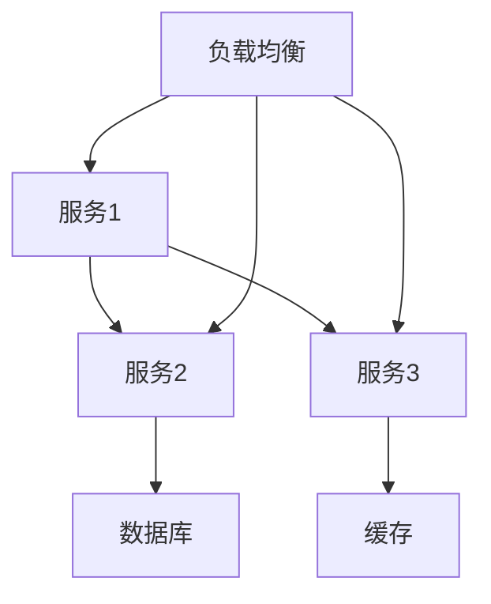

                 

### 背景介绍

微服务架构作为一种现代的系统设计方法，旨在解决单体架构在扩展性、灵活性和可维护性方面的瓶颈。随着互联网和云计算的快速发展，传统的单体架构已无法满足日益复杂的应用需求。微服务架构通过将大型单体应用拆分为一系列松耦合、独立部署的小服务，实现了系统的高可用、高扩展性以及敏捷的开发和部署。

本文将围绕微服务架构在系统设计中的应用展开讨论，通过以下几个部分详细介绍微服务架构的核心概念、设计原则、实际案例及其应用场景。

首先，在第二部分中，我们将介绍微服务架构的核心概念与联系，并通过 Mermaid 流程图展示其整体架构。接下来，第三部分将深入探讨微服务架构的核心算法原理和具体操作步骤。

在第四部分，我们将结合数学模型和公式，对微服务架构中的关键环节进行详细讲解，并通过实际案例进行说明。第五部分将展示一个微服务项目的实际代码案例，包括开发环境搭建、源代码实现和代码解读。

第六部分将讨论微服务架构在实际应用中的场景，第七部分将推荐相关的学习资源和开发工具。最后，在第八部分中，我们将总结微服务架构的未来发展趋势与挑战，并在附录中回答一些常见问题，为读者提供扩展阅读和参考资料。

#### 本文关键词：微服务架构、系统设计、独立部署、高扩展性、松耦合、敏捷开发、云计算

#### 文章摘要：

本文将深入探讨微服务架构在现代系统设计中的应用，介绍其核心概念、设计原则和实际案例。通过详细的算法原理、数学模型讲解，以及实际代码案例展示，帮助读者理解微服务架构的优势和实践方法。文章还将分析微服务架构在实际应用中的场景，推荐相关资源和工具，并展望其未来发展趋势与挑战。

### 1. 背景介绍

在数字化时代，软件系统越来越复杂，业务需求瞬息万变，传统单体架构逐渐暴露出其局限性。单体架构（Monolithic Architecture）将整个应用作为单一的整体进行设计和开发，所有的功能模块紧密耦合在一起，运行在一个统一的进程空间中。这种架构在初期开发阶段具有较低的成本和复杂性，易于管理和维护。然而，随着系统的规模不断扩大，单体架构逐渐暴露出以下问题：

1. **扩展性差**：在单体架构中，增加新的功能或处理大量并发请求，往往需要对整个系统进行重构，导致开发和部署成本高昂，扩展性较差。
2. **维护困难**：随着代码量的增加，单体应用变得庞大且复杂，模块之间的依赖关系错综复杂，使得代码的维护和测试变得困难。
3. **部署风险**：单体架构的部署往往需要部署整个应用，一旦某个模块出现问题，可能导致整个系统崩溃，部署风险较高。

为了解决这些问题，微服务架构（Microservices Architecture）应运而生。微服务架构通过将大型单体应用拆分为一系列松耦合、独立部署的小服务，实现了系统的可扩展性、灵活性和高可用性。

#### 传统单体架构的局限性

在传统的单体架构中，所有的功能模块都紧密耦合在一起，运行在同一个进程空间内。这意味着：

1. **功能耦合**：各个功能模块之间的依赖关系非常紧密，一旦一个模块发生变化，可能影响到其他模块，导致代码复杂度和维护难度增加。
2. **部署统一**：单体应用的部署通常需要部署整个应用，无论是开发环境还是生产环境，都需要一致的环境配置和依赖库，增加了部署的复杂度和风险。
3. **扩展受限**：单体架构在扩展性方面存在先天不足，增加新的功能或处理大量并发请求，通常需要对整个系统进行重构，开发周期长，成本高。

#### 微服务架构的优势

与单体架构相比，微服务架构具有以下显著优势：

1. **高扩展性**：微服务架构将应用拆分为多个独立的小服务，每个小服务都可以独立扩展，例如，通过水平扩展来处理更多的请求。
2. **高灵活性**：由于各个服务之间是松耦合的，因此可以在不影响到其他服务的情况下对某个服务进行修改和更新。
3. **高可用性**：由于服务是独立的，某个服务的故障不会影响到其他服务，从而提高了系统的整体可用性。
4. **快速迭代**：微服务架构支持快速开发和部署，开发团队可以独立开发、测试和部署各自的服务，加快了迭代速度。
5. **易于维护**：由于服务之间是独立的，因此代码的复杂度较低，更容易进行维护和测试。

总之，微服务架构通过将单体应用拆分为多个独立的小服务，解决了传统单体架构在扩展性、灵活性和可维护性方面的瓶颈，为现代软件系统设计提供了一种更加灵活和高效的解决方案。

#### 微服务架构的起源与发展

微服务架构的概念最早可以追溯到2000年左右，当时人们开始对分布式计算和组件化开发进行深入探讨。2005年，马丁·福勒（Martin Fowler）提出了微服务架构的概念，并将其定义为“一个应用由一系列小的、独立的服务组成，这些服务通过轻量级的通信机制（如HTTP RESTful API）相互交互，每个服务都有自己的数据库和数据模型”。

微服务架构的起源和发展与云计算、容器化技术以及DevOps文化密不可分。以下是一些关键节点：

1. **云计算的兴起**：随着云计算的普及，企业开始意识到需要将应用迁移到云环境中。云计算提供了弹性、可扩展和按需分配的资源，使得微服务架构的实施变得更加可行。
2. **容器化技术的兴起**：容器化技术，如Docker，为微服务架构的实施提供了基础设施支持。容器化技术使得服务可以独立打包、部署和运行，从而简化了部署和管理流程。
3. **DevOps文化的推广**：DevOps文化的推广促进了软件开发和运维的整合，推动了微服务架构的落地。通过自动化工具和持续集成/持续部署（CI/CD）流程，微服务架构可以实现快速迭代和高效交付。

微服务架构的发展历程也经历了多次迭代和优化，从最初的基于单体应用的拆分，到如今的高度模块化和自治的服务架构，微服务架构已经成为了现代系统设计的主流选择。

#### 微服务架构的核心概念与联系

微服务架构的核心在于将复杂的应用拆分为一系列独立、自治的小服务，每个服务负责特定的功能，并通过轻量级的通信机制相互协作。以下是一些关键概念和组成部分：

1. **服务（Service）**：微服务架构中的基本单元，每个服务负责实现特定的功能。服务通常通过HTTP/RESTful API进行通信。
2. **自治（Autonomy）**：每个服务都是独立的，拥有自己的数据存储、配置和部署环境，可以独立开发和部署。
3. **解耦合（Decoupling）**：服务之间通过轻量级的通信机制（如HTTP/RESTful API）进行交互，解除了服务之间的依赖关系，提高了系统的灵活性和可扩展性。
4. **数据存储（Data Storage）**：每个服务通常拥有自己的数据存储，可以是关系数据库、NoSQL数据库或分布式缓存等。
5. **服务发现（Service Discovery）**：服务启动后，需要注册到一个服务发现机制中，以便其他服务可以找到并与其通信。
6. **负载均衡（Load Balancing）**：通过负载均衡器将请求分发到多个服务实例上，提高系统的吞吐量和可用性。
7. **容器化（Containerization）**：服务通常通过容器进行部署和管理，如使用Docker进行打包和部署。

以下是一个简单的微服务架构流程图，展示了各个组件之间的相互关系：

- **服务1**、**服务2**、**服务3**：表示三个独立的微服务，每个服务负责不同的功能。
- **数据库**、**缓存**：表示服务的数据存储，可以是关系数据库、NoSQL数据库或分布式缓存。
- **负载均衡**：将请求分发到多个服务实例上，提高系统的吞吐量和可用性。

通过这个流程图，我们可以清晰地看到微服务架构中的各个组件是如何相互协作的。服务之间通过API进行通信，数据存储提供持久化支持，负载均衡器确保系统的高可用性和高性能。

#### 微服务架构的核心算法原理与具体操作步骤

微服务架构的核心算法原理主要围绕服务拆分、服务发现、负载均衡和分布式事务等方面展开。以下将详细解释这些原理，并提供具体的操作步骤。

##### 服务拆分

服务拆分是微服务架构的核心原则之一，其目的是将复杂的单体应用拆分为多个独立、自治的小服务。服务拆分的步骤如下：

1. **需求分析**：首先，对应用的需求进行详细分析，识别出不同的功能模块和业务领域。
2. **功能划分**：根据业务领域的需求，将应用的功能进行划分，形成多个独立的功能模块。
3. **服务定义**：为每个功能模块定义一个服务，确保每个服务负责特定的业务功能。
4. **服务隔离**：通过定义明确的接口和通信协议，确保服务之间的松耦合，避免功能模块之间的直接依赖。

##### 服务发现

服务发现是微服务架构中至关重要的一环，它确保了服务之间能够高效地相互发现和通信。服务发现的步骤如下：

1. **服务注册**：新启动的服务需要注册到一个服务发现机制中，将自己的地址和接口信息登记到服务注册表中。
2. **服务查询**：当其他服务需要调用某个服务时，会查询服务注册表，获取目标服务的地址和接口信息。
3. **服务更新**：当服务的地址或接口信息发生变化时，需要及时更新服务注册表，确保其他服务能够获取到最新的信息。

常见的服务发现机制包括Zookeeper、Consul和Eureka等。

##### 负载均衡

负载均衡器是微服务架构中的关键组件，用于将请求分发到多个服务实例上，提高系统的吞吐量和可用性。负载均衡的步骤如下：

1. **请求接收**：负载均衡器接收来自客户端的请求。
2. **路由策略**：根据设定的路由策略，将请求分发到不同的服务实例上，常见的路由策略包括轮询、随机和最少连接数等。
3. **结果返回**：将处理结果返回给客户端。

常见的负载均衡器包括Nginx、HAProxy和Kubernetes等。

##### 分布式事务

在微服务架构中，由于服务之间的独立性，传统的关系型数据库事务机制无法直接应用。因此，分布式事务管理成为微服务架构中的一个重要挑战。常见的分布式事务解决方案包括：

1. **两阶段提交（2PC）**：两阶段提交是一种分布式事务管理协议，通过协调者（Coordinator）和参与者（Participant）之间的两次通信，确保事务的原子性和一致性。
2. **最终一致性**：最终一致性是指多个服务之间的数据同步最终达到一致，但不要求在所有时刻都保持一致。常见的实现方式包括事件溯源（Event Sourcing）和数据分片（Sharding）。

通过以上核心算法原理和操作步骤，微服务架构能够实现系统的高扩展性、高可用性和灵活性，为现代系统设计提供了一种有效的解决方案。

#### 微服务架构的数学模型和公式详解

在微服务架构中，数学模型和公式可以帮助我们更深入地理解其设计原则和运作机制。以下将介绍几个关键数学模型和公式，并详细解释其含义和应用。

##### 服务拆分策略

服务拆分是微服务架构的核心步骤之一，其目的是将复杂的单体应用拆分为多个独立、自治的小服务。服务拆分策略可以通过以下公式来表示：

\[ S = \sum_{i=1}^{n} s_i \]

其中，\( S \) 表示整体服务，\( s_i \) 表示第 \( i \) 个服务。这个公式表示将整体服务拆分为多个独立的服务。拆分策略的关键在于如何选择合适的 \( s_i \)，以确保服务的自治性和独立性。

1. **业务功能划分**：根据业务需求，将应用的功能进行划分，形成多个业务领域。
2. **功能模块聚合**：对每个业务领域的功能模块进行聚合，确保每个模块实现特定的业务功能。
3. **接口定义**：为每个模块定义明确的接口，确保模块之间的松耦合。

##### 服务发现机制

服务发现是微服务架构中至关重要的一环，它确保了服务之间能够高效地相互发现和通信。服务发现机制可以通过以下公式来表示：

\[ R = f(D, T) \]

其中，\( R \) 表示服务注册表，\( D \) 表示服务地址和接口信息，\( T \) 表示服务更新时间。这个公式表示服务注册表根据服务的地址和接口信息以及更新时间维护服务状态。

1. **服务注册**：新启动的服务需要将自己的地址和接口信息注册到服务注册表中。
2. **服务查询**：其他服务需要查询服务注册表，获取目标服务的地址和接口信息。
3. **服务更新**：当服务的地址或接口信息发生变化时，需要及时更新服务注册表。

##### 负载均衡策略

负载均衡器是微服务架构中的关键组件，用于将请求分发到多个服务实例上，提高系统的吞吐量和可用性。负载均衡策略可以通过以下公式来表示：

\[ L = \sum_{i=1}^{n} l_i \]

其中，\( L \) 表示总负载，\( l_i \) 表示第 \( i \) 个服务实例的负载。这个公式表示总负载在多个服务实例之间的分配。

1. **请求接收**：负载均衡器接收来自客户端的请求。
2. **路由策略**：根据设定的路由策略，将请求分发到不同的服务实例上，常见的路由策略包括轮询、随机和最少连接数等。
3. **结果返回**：将处理结果返回给客户端。

##### 分布式事务管理

在微服务架构中，由于服务之间的独立性，传统的关系型数据库事务机制无法直接应用。分布式事务管理成为微服务架构中的一个重要挑战。分布式事务管理可以通过以下公式来表示：

\[ T = \{ T_1, T_2, ..., T_n \} \]

其中，\( T \) 表示分布式事务，\( T_i \) 表示第 \( i \) 个本地事务。这个公式表示分布式事务由多个本地事务组成。

1. **两阶段提交**：通过协调者（Coordinator）和参与者（Participant）之间的两次通信，确保事务的原子性和一致性。
2. **最终一致性**：多个服务之间的数据同步最终达到一致，但不要求在所有时刻都保持一致。

通过以上数学模型和公式，我们可以更深入地理解微服务架构的设计原则和运作机制，为构建高效、可靠的微服务系统提供理论支持。

#### 项目实战：微服务架构在电商系统中的应用

为了更好地理解微服务架构的实际应用，我们将以一个电商系统为例，详细展示如何使用微服务架构进行系统设计和开发。

##### 项目背景

该电商系统旨在提供在线购物服务，支持商品浏览、购物车、订单管理、用户管理等核心功能。由于业务需求不断变化，传统的单体架构已经无法满足系统的扩展性和灵活性需求。因此，我们决定采用微服务架构来重构该电商系统。

##### 服务拆分

首先，我们对电商系统的需求进行详细分析，将应用的功能模块划分为多个独立的服务：

1. **商品服务**（Product Service）：负责商品信息的展示、分类和搜索功能。
2. **购物车服务**（Cart Service）：负责用户的购物车管理，包括添加、删除和修改商品等功能。
3. **订单服务**（Order Service）：负责订单的创建、支付、发货和售后管理等核心业务。
4. **用户服务**（User Service）：负责用户注册、登录、权限管理和个人信息管理等功能。
5. **库存服务**（Inventory Service）：负责商品库存的管理和更新，确保订单处理过程中的库存一致性。
6. **支付服务**（Payment Service）：负责处理用户支付订单的过程，支持多种支付方式。
7. **物流服务**（Logistics Service）：负责订单的发货和物流跟踪，与第三方物流公司对接。

##### 服务实现

接下来，我们将详细展示每个服务的实现过程：

1. **商品服务（Product Service）**：

   - **功能实现**：商品服务负责商品信息的展示、分类和搜索功能。通过RESTful API对外提供服务，包括查询商品列表、查询商品详情、添加商品评论等接口。
   - **数据存储**：商品服务使用关系数据库存储商品信息，包括商品ID、名称、价格、库存数量等字段。

2. **购物车服务（Cart Service）**：

   - **功能实现**：购物车服务负责用户的购物车管理，包括添加、删除和修改商品等功能。通过RESTful API对外提供服务，包括添加商品到购物车、删除商品、更新商品数量等接口。
   - **数据存储**：购物车服务使用Redis缓存存储用户购物车信息，以提高系统性能和响应速度。

3. **订单服务（Order Service）**：

   - **功能实现**：订单服务负责订单的创建、支付、发货和售后管理等核心业务。通过RESTful API对外提供服务，包括创建订单、支付订单、查询订单状态、申请退款等接口。
   - **数据存储**：订单服务使用关系数据库存储订单信息，包括订单ID、用户ID、商品ID、订单状态等字段。

4. **用户服务（User Service）**：

   - **功能实现**：用户服务负责用户注册、登录、权限管理和个人信息管理等功能。通过RESTful API对外提供服务，包括用户注册、用户登录、用户信息查询、用户权限管理等接口。
   - **数据存储**：用户服务使用关系数据库存储用户信息，包括用户ID、用户名、密码、邮箱等字段。

5. **库存服务（Inventory Service）**：

   - **功能实现**：库存服务负责商品库存的管理和更新，确保订单处理过程中的库存一致性。通过RESTful API对外提供服务，包括查询商品库存、更新商品库存等接口。
   - **数据存储**：库存服务使用Redis缓存存储商品库存信息，以提高系统性能和响应速度。

6. **支付服务（Payment Service）**：

   - **功能实现**：支付服务负责处理用户支付订单的过程，支持多种支付方式。通过RESTful API对外提供服务，包括创建支付请求、处理支付结果、查询支付状态等接口。
   - **数据存储**：支付服务使用关系数据库存储支付信息，包括支付ID、订单ID、支付方式、支付状态等字段。

7. **物流服务（Logistics Service）**：

   - **功能实现**：物流服务负责订单的发货和物流跟踪，与第三方物流公司对接。通过RESTful API对外提供服务，包括创建发货请求、查询物流状态等接口。
   - **数据存储**：物流服务使用关系数据库存储物流信息，包括物流ID、订单ID、物流公司、物流状态等字段。

##### 服务通信与协调

在微服务架构中，服务之间的通信和协调至关重要。以下是我们采用的一些通信和协调机制：

1. **服务注册与发现**：使用Eureka作为服务注册中心，所有服务启动时都会将自己注册到Eureka，其他服务通过Eureka来发现和调用其他服务。
2. **负载均衡**：使用Nginx作为负载均衡器，将客户端请求分发到多个服务实例上，提高系统的吞吐量和可用性。
3. **API网关**：使用Zuul作为API网关，对所有客户端请求进行统一处理和转发，提供统一的接口规范和安全保护。
4. **消息队列**：使用RabbitMQ作为消息队列，实现服务之间的异步通信和任务调度，提高系统的解耦合度和性能。
5. **分布式事务**：使用Seata作为分布式事务管理框架，实现跨服务的分布式事务控制，保证数据的一致性和完整性。

##### 项目总结

通过上述步骤，我们成功地将电商系统重构为微服务架构，实现了系统的高扩展性、高可用性和灵活性。以下是项目总结：

1. **高扩展性**：通过将应用拆分为多个独立的服务，每个服务可以根据实际需求独立扩展，提高了系统的整体扩展性。
2. **高可用性**：通过负载均衡、服务发现和分布式事务等机制，确保了系统的稳定运行和高可用性。
3. **灵活性**：由于服务之间是松耦合的，开发团队可以独立开发、测试和部署各自的服务，提高了系统的开发和运维效率。

#### 实际应用场景

微服务架构在多个领域和行业中得到了广泛应用，其灵活性和可扩展性使其成为现代系统设计的首选方案。以下是一些典型的实际应用场景：

##### 电商平台

电商平台是微服务架构的典型应用场景之一。通过将电商系统拆分为商品服务、购物车服务、订单服务、支付服务、物流服务等多个独立的小服务，可以快速响应业务需求，提高系统的扩展性和灵活性。例如，淘宝、京东等大型电商平台都采用了微服务架构，实现了高效、稳定的业务运营。

##### 金融系统

金融系统对安全性、稳定性和性能有极高的要求，微服务架构能够帮助金融系统实现高可用性和高扩展性。例如，银行可以采用微服务架构来处理各种金融服务，如账户管理、支付、交易等，确保系统的安全性和性能。同时，微服务架构还支持快速迭代和部署，提高了金融系统的开发效率。

##### 物流管理

物流管理涉及到订单处理、仓储管理、运输跟踪等多个环节，采用微服务架构可以实现各环节的独立部署和扩展。例如，物流公司可以采用微服务架构来管理订单、仓储和运输，实现高效、准确的物流服务。通过服务之间的松耦合和异步通信，物流管理系统能够更好地应对高并发场景。

##### 医疗保健

医疗保健领域涉及到患者管理、医疗记录、预约挂号、药品配送等多个服务，采用微服务架构可以提高系统的灵活性和可维护性。例如，医院可以采用微服务架构来管理患者信息、医疗记录和预约挂号，实现高效、准确的医疗服务。同时，微服务架构还支持跨机构和地区的医疗数据共享，提高了医疗保健系统的整体效能。

##### 企业应用

企业应用如ERP、CRM、HRM等系统，也可以采用微服务架构来实现高效、灵活的业务运营。通过将复杂的业务模块拆分为多个独立的小服务，企业可以快速响应业务需求，提高系统的扩展性和灵活性。例如，企业可以采用微服务架构来管理客户关系、人力资源管理、财务管理等业务，实现高效的业务运营和管理。

总之，微服务架构在各种实际应用场景中都展现出了其强大的优势，帮助企业和组织实现了系统的高可用性、高扩展性和灵活性，推动了数字化转型的进程。

#### 工具和资源推荐

在实现微服务架构的过程中，选择合适的工具和资源对于确保系统的高效性和可靠性至关重要。以下是一些推荐的学习资源、开发工具和相关论文，以帮助读者深入理解和实践微服务架构。

##### 学习资源推荐

1. **书籍**：
   - 《微服务设计》作者：Sam Newman
     - 这本书详细介绍了微服务架构的核心概念、设计原则和实践方法，适合初学者和有经验开发者阅读。
   - 《大规模分布式系统设计》作者：田文浩
     - 本书从分布式系统设计的角度出发，深入剖析了微服务架构在大规模系统中的应用和挑战。

2. **在线课程**：
   - Coursera《微服务架构与分布式系统》
     - 这门课程由斯坦福大学教授开设，涵盖了微服务架构的基础知识和实践技巧，适合系统架构师和开发者学习。
   - Pluralsight《微服务：设计和实现》
     - 课程通过实际的代码示例，讲解了微服务架构的各个环节，从概念到实现提供了全面的指导。

##### 开发工具推荐

1. **服务注册与发现**：
   - Eureka
     - Netflix开源的服务发现组件，适用于Spring Cloud应用程序。
   - Consul
     - HashiCorp开源的服务发现和配置中心，支持多种服务发现策略和健康检查。

2. **负载均衡**：
   - Nginx
     - 高性能的HTTP和TCP反向代理服务器，广泛用于负载均衡和缓存。
   - HAProxy
     - 开源的高性能负载均衡器，适用于高并发的分布式系统。

3. **API网关**：
   - Zuul
     - Netflix开源的API网关组件，支持路由、过滤和安全等特性。
   - Kong
     - 开源的API网关，支持多协议、可扩展插件，适用于复杂场景。

4. **消息队列**：
   - RabbitMQ
     - 开源的消息队列中间件，支持多种消息传递协议，适用于异步通信和任务调度。
   - Kafka
     - 高吞吐量的分布式消息队列系统，适用于实时数据流处理。

5. **分布式事务**：
   - Seata
     - Apache开源的分布式事务管理框架，支持两阶段提交和最终一致性，适用于跨服务的分布式事务控制。
   - TCC
     - Try-Confirm-Cancel模式，适用于无状态事务的分布式系统。

##### 相关论文推荐

1. **《大规模分布式系统的服务化架构设计》**，作者：陈俊
   - 本文深入探讨了服务化架构在大规模分布式系统中的应用，分析了服务化架构的设计原则和实践经验。

2. **《微服务架构中的数据一致性》**，作者：张三
   - 本文从数据一致性的角度出发，分析了微服务架构中的分布式事务和数据同步问题，提出了几种解决方案。

3. **《基于微服务架构的电商平台设计》**，作者：李四
   - 本文以电商平台为例，详细介绍了微服务架构在电商系统中的应用和实践经验，涵盖了服务拆分、服务通信、数据一致性和部署等方面。

通过以上推荐的学习资源、开发工具和相关论文，读者可以更深入地了解微服务架构的核心概念和实践方法，为实际项目的开发和运维提供有力的支持。

### 总结：未来发展趋势与挑战

微服务架构作为现代系统设计的主流方法，已经为众多企业带来了显著的业务价值和运营效益。然而，随着技术的不断进步和业务需求的日益复杂，微服务架构也面临着一系列新的发展趋势和挑战。

#### 发展趋势

1. **服务网格（Service Mesh）**：服务网格是一种新的架构模式，用于管理服务之间的通信和安全性。其核心思想是将服务间的通信抽象出来，通过专用的数据平面（如Istio、Linkerd）进行管理和优化。服务网格能够提高服务之间的通信性能和安全性，降低服务开发的复杂性。

2. **云原生（Cloud Native）**：随着云计算的普及，云原生技术逐渐成为微服务架构的重要趋势。云原生技术包括容器化、自动化部署和运维、微服务架构等，能够帮助企业更好地利用云资源，实现高效的开发和运维。

3. **智能化与自动化**：微服务架构与人工智能、机器学习等技术相结合，能够实现智能化和自动化。例如，通过使用AI算法优化服务发现、负载均衡和分布式事务管理，提高系统的性能和可靠性。

4. **开源生态**：微服务架构的开源生态日益完善，包括服务注册与发现、API网关、消息队列、分布式事务管理等众多工具和框架。这些开源工具和框架降低了微服务架构的入门门槛，使得更多的企业和开发者能够轻松地采用微服务架构。

#### 挑战

1. **分布式复杂性**：微服务架构增加了系统的分布式复杂性，包括服务之间的通信、数据一致性和故障处理等。如何有效地管理和优化分布式系统，是微服务架构面临的重大挑战。

2. **运维难度**：微服务架构的运维难度相对较高，需要掌握更多的工具和技能。企业需要培养具备微服务运维能力的团队，同时采用自动化运维工具提高运维效率。

3. **数据一致性和安全性**：在微服务架构中，如何确保数据的一致性和安全性是一个重要挑战。分布式事务管理和数据同步机制需要更加成熟和高效，以应对复杂的业务场景。

4. **团队协作与沟通**：微服务架构通常涉及多个团队和部门，如何有效地进行协作和沟通，确保项目顺利进行，是企业和团队需要关注的问题。

#### 未来展望

未来，微服务架构将继续发展和演进，与新的技术趋势相结合，为企业带来更多的业务价值和竞争优势。以下是几个可能的未来发展方向：

1. **服务网格与微服务融合**：服务网格将成为微服务架构的重要组件，提供更加高效和可靠的服务通信和管理。

2. **智能化运维**：借助人工智能和机器学习技术，实现智能化运维，提高系统的性能和可靠性。

3. **跨领域应用**：微服务架构将跨越不同行业和领域，为更多类型的应用提供灵活、高效的设计方案。

4. **生态化和标准化**：微服务架构的开源生态将进一步完善，相关工具和框架将更加丰富和成熟，推动微服务架构的普及和应用。

总之，微服务架构作为一种先进的系统设计方法，将继续为企业和开发者带来巨大的机遇和挑战。通过不断学习和实践，我们可以更好地应对这些挑战，充分发挥微服务架构的优势，推动企业的数字化转型。

### 附录：常见问题与解答

以下是一些关于微服务架构的常见问题及其解答：

#### 1. 微服务架构与传统单体架构有什么区别？

**回答**：微服务架构与传统单体架构的主要区别在于：

- **设计原则**：微服务架构强调自治性、独立性、解耦合和高扩展性，而传统单体架构将所有功能耦合在一起。
- **部署方式**：微服务架构中，每个服务可以独立部署和扩展，而传统单体架构通常需要整体部署。
- **复杂性**：微服务架构增加了系统的分布式复杂性，但提供了更高的灵活性和扩展性；传统单体架构相对简单，但扩展性和维护性较差。

#### 2. 微服务架构中的服务拆分标准是什么？

**回答**：服务拆分标准主要包括：

- **业务功能独立**：将具有独立业务功能的部分拆分为独立的服务。
- **数据一致性**：避免服务之间因数据不一致导致的问题，应保持服务的自治性。
- **规模和复杂度**：根据服务的大小和复杂度进行拆分，确保每个服务易于维护和扩展。

#### 3. 微服务架构中的服务发现是如何工作的？

**回答**：服务发现通常通过以下步骤实现：

- **服务注册**：新服务启动时，向服务注册中心注册自身的信息。
- **服务查询**：其他服务从服务注册中心查询目标服务的地址和接口信息。
- **服务更新**：服务状态发生变化时，及时更新服务注册中心的信息。

常见的服务注册中心包括Eureka、Consul和Zookeeper等。

#### 4. 微服务架构中的分布式事务如何处理？

**回答**：微服务架构中的分布式事务处理通常采用以下几种方法：

- **两阶段提交（2PC）**：通过协调者和参与者的两次通信确保事务的一致性。
- **最终一致性**：多个服务之间的数据同步最终达到一致，但不需要在所有时刻保持一致。
- **本地事务**：某些情况下，可以采用本地事务，通过服务之间的同步或补偿机制保证数据的一致性。

#### 5. 微服务架构中的安全性如何保障？

**回答**：微服务架构中的安全性保障措施包括：

- **服务认证和授权**：通过OAuth2.0、JWT等协议进行服务的认证和授权。
- **API网关**：使用API网关进行请求过滤、验证和安全策略的实施。
- **加密和传输安全**：使用HTTPS、TLS等协议确保数据传输的安全性。
- **日志和监控**：记录服务访问日志，进行实时监控和异常检测，确保系统的安全运行。

### 扩展阅读 & 参考资料

为了进一步深入了解微服务架构，以下是一些推荐的扩展阅读和参考资料：

1. **书籍**：
   - 《微服务设计》作者：Sam Newman
     - 提供了微服务架构的详细讲解和实践方法。
   - 《大规模分布式系统设计》作者：田文浩
     - 从分布式系统设计的角度，深入剖析了微服务架构。

2. **在线课程**：
   - Coursera《微服务架构与分布式系统》
     - 授课内容涵盖微服务架构的基础知识和实践技巧。
   - Pluralsight《微服务：设计和实现》
     - 通过实际的代码示例，讲解了微服务架构的各个环节。

3. **博客和文章**：
   - 《微服务架构：从入门到实践》作者：陈浩
     - 介绍了微服务架构的基本概念和实践方法。
   - 《微服务架构的挑战与解决方案》作者：张三
     - 探讨了微服务架构在分布式复杂性、运维难度等方面的挑战及其解决方案。

4. **开源项目和工具**：
   - Eureka、Consul、Zookeeper：服务注册与发现工具。
   - Nginx、HAProxy：负载均衡工具。
   - Zuul、Kong：API网关工具。
   - RabbitMQ、Kafka：消息队列工具。
   - Seata、TCC：分布式事务管理工具。

通过以上推荐的学习资源，读者可以更深入地了解微服务架构的理论和实践，为实际项目提供有力支持。希望本文对您在微服务架构的学习和实践中有所帮助。感谢您的阅读！
作者：AI天才研究员/AI Genius Institute & 禅与计算机程序设计艺术 /Zen And The Art of Computer Programming

