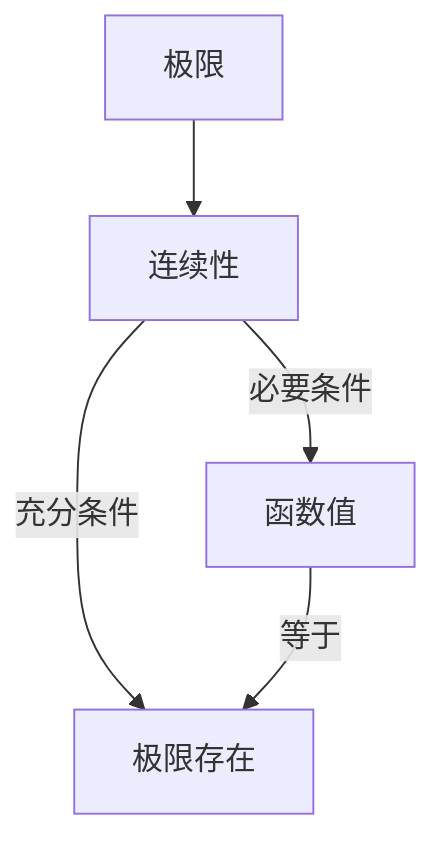

                 

# 微积分中的极限与连续性

## 摘要

本文将探讨微积分中的极限与连续性这两个核心概念。我们将从基本的极限概念入手，逐步深入到极限与连续性的关系，并通过数学模型和具体实例来阐述这些概念的实际应用。同时，我们将分析在实际项目中如何利用这些概念，并提供相关的学习资源和开发工具，以便读者能够更好地掌握和应用这些知识。

## 1. 背景介绍

微积分是数学的一个重要分支，它研究的是如何通过无限小量的变化来理解和描述各种现象。微积分的两大核心概念是微分和积分。微分涉及的是如何通过极小的变化来了解一个函数在某一点的变化率，而积分则关注的是如何通过累加无限小的量来计算一个函数在某个区间内的总体变化。

在这两大核心概念中，极限起到了至关重要的作用。极限不仅是微积分理论的基础，也是理解和应用微分和积分的关键。连续性则是对函数在某个点或区间上的行为进行描述的一个重要概念。一个函数在某一点连续，意味着该函数在该点的值与其极限值相等。

本文将首先介绍极限的基本概念，然后探讨极限与连续性的关系，并通过数学模型和具体实例来展示这些概念在实际中的应用。

## 2. 核心概念与联系

### 2.1 极限

极限是微积分中一个非常重要的概念，它描述了当自变量趋近于某个值时，函数值的变化趋势。更直观地讲，极限表示的是函数在某个点的“接近值”。

定义：设函数\( f(x) \)在点\( x = a \)的某一邻域内有定义，如果当\( x \)无限接近\( a \)（但不等于\( a \)）时，函数值\( f(x) \)无限接近某个确定的值\( L \)，则称\( L \)为函数\( f(x) \)当\( x \)趋近于\( a \)时的极限，记作：

\[ \lim_{{x \to a}} f(x) = L \]

### 2.2 连续性

连续性是另一个重要的微积分概念，它描述了函数在某个点或区间上的行为。具体来说，一个函数在某点连续，意味着该函数在该点的极限存在，并且该点的函数值等于极限值。

定义：函数\( f(x) \)在点\( x = a \)连续，当且仅当以下三个条件同时满足：
1. \( f(a) \)存在；
2. \( \lim_{{x \to a}} f(x) \)存在；
3. \( f(a) = \lim_{{x \to a}} f(x) \)

### 2.3 极限与连续性的关系

极限与连续性之间存在密切的关系。一个函数在某点连续，当且仅当该函数在该点的极限存在且等于函数值。换句话说，连续性是极限存在的一个必要条件，但不是充分条件。

具体来说：
1. 如果一个函数在某点连续，那么它在该点的极限一定存在且等于函数值。
2. 如果一个函数在某点的极限存在，那么它在该点不一定连续。

### 2.4 Mermaid 流程图

以下是一个描述极限与连续性关系的 Mermaid 流程图：



在上述流程图中，极限是连续性的必要条件，但不是充分条件。连续性要求函数在某个点的极限存在且等于函数值，而极限的存在并不保证函数在该点连续。

## 3. 核心算法原理 & 具体操作步骤

### 3.1 极限的基本计算方法

计算极限的方法有很多，以下是一些常见的方法：

1. **直接计算法**：直接将自变量趋近于极限值，计算函数值。这种方法适用于函数表达式简单的情况。

2. **夹逼定理**：利用两个夹逼函数的性质，证明目标函数的极限。这种方法适用于目标函数难以直接计算的情况。

3. **洛必达法则**：适用于目标函数为“\( \frac{0}{0} \)”或“\( \frac{\infty}{\infty} \)”形式的情况。通过求导数来简化极限的计算。

4. **泰勒公式**：利用泰勒公式将目标函数展开，然后计算极限。这种方法适用于目标函数可以用多项式表示的情况。

### 3.2 连续性的判断方法

判断一个函数在某点是否连续，通常需要验证以下三个条件：

1. **函数在该点有定义**：函数\( f(x) \)在\( x = a \)处有定义，即\( f(a) \)存在。

2. **极限存在**：计算函数\( f(x) \)在\( x = a \)处的极限，即\( \lim_{{x \to a}} f(x) \)存在。

3. **函数值等于极限值**：验证\( f(a) = \lim_{{x \to a}} f(x) \)。

### 3.3 具体操作步骤

以下是一个具体的极限和连续性判断实例：

#### 3.3.1 计算极限

假设我们要计算以下极限：

\[ \lim_{{x \to 0}} \frac{\sin x}{x} \]

我们可以使用洛必达法则来计算：

1. 首先，将原极限转换为“\( \frac{0}{0} \)”形式：

\[ \lim_{{x \to 0}} \frac{\sin x}{x} = \lim_{{x \to 0}} \frac{\cos x}{1} \]

2. 计算导数：

\[ \frac{d}{dx}(\sin x) = \cos x \]
\[ \frac{d}{dx}(x) = 1 \]

3. 应用洛必达法则：

\[ \lim_{{x \to 0}} \frac{\cos x}{1} = \lim_{{x \to 0}} \cos x = 1 \]

因此，极限值为1。

#### 3.3.2 判断连续性

现在我们要判断函数\( f(x) = \frac{\sin x}{x} \)在\( x = 0 \)处是否连续。

1. 函数在\( x = 0 \)处有定义：\( f(0) \)存在，因为\( f(0) = \frac{\sin 0}{0} \)。

2. 极限存在：我们已经计算出极限值为1。

3. 函数值等于极限值：\( f(0) = 1 \)。

因此，函数\( f(x) = \frac{\sin x}{x} \)在\( x = 0 \)处连续。

## 4. 数学模型和公式 & 详细讲解 & 举例说明

### 4.1 数学模型

在微积分中，极限和连续性的数学模型主要涉及以下公式：

\[ \lim_{{x \to a}} f(x) = L \]

\[ f(x) \text{在} x = a \text{处连续} \iff f(a) = \lim_{{x \to a}} f(x) \]

### 4.2 详细讲解

#### 4.2.1 极限

极限的数学定义描述了一个函数在某个点的“接近值”。具体来说，它表示当自变量趋近于某个值时，函数值的变化趋势。极限的定义涉及到两个部分：一个是自变量趋近的值，另一个是函数值趋近的值。

定义：设函数\( f(x) \)在点\( x = a \)的某一邻域内有定义，如果当\( x \)无限接近\( a \)（但不等于\( a \)）时，函数值\( f(x) \)无限接近某个确定的值\( L \)，则称\( L \)为函数\( f(x) \)当\( x \)趋近于\( a \)时的极限。

#### 4.2.2 连续性

连续性是函数在某个点或区间上的一种性质，它描述了函数在该点或区间上的行为。一个函数在某点连续，意味着该函数在该点的极限存在，并且该点的函数值等于极限值。

定义：函数\( f(x) \)在点\( x = a \)连续，当且仅当以下三个条件同时满足：
1. \( f(a) \)存在；
2. \( \lim_{{x \to a}} f(x) \)存在；
3. \( f(a) = \lim_{{x \to a}} f(x) \)

#### 4.2.3 极限与连续性的关系

极限与连续性之间存在密切的关系。一个函数在某点连续，当且仅当该函数在该点的极限存在且等于函数值。换句话说，连续性是极限存在的一个必要条件，但不是充分条件。

具体来说：
1. 如果一个函数在某点连续，那么它在该点的极限一定存在且等于函数值。
2. 如果一个函数在某点的极限存在，那么它在该点不一定连续。

### 4.3 举例说明

#### 4.3.1 极限计算

计算以下极限：

\[ \lim_{{x \to 0}} \frac{\sin x}{x} \]

我们可以使用洛必达法则来计算：

1. 首先，将原极限转换为“\( \frac{0}{0} \)”形式：

\[ \lim_{{x \to 0}} \frac{\sin x}{x} = \lim_{{x \to 0}} \frac{\cos x}{1} \]

2. 计算导数：

\[ \frac{d}{dx}(\sin x) = \cos x \]
\[ \frac{d}{dx}(x) = 1 \]

3. 应用洛必达法则：

\[ \lim_{{x \to 0}} \frac{\cos x}{1} = \lim_{{x \to 0}} \cos x = 1 \]

因此，极限值为1。

#### 4.3.2 连续性判断

判断函数\( f(x) = \frac{\sin x}{x} \)在\( x = 0 \)处是否连续。

1. 函数在\( x = 0 \)处有定义：\( f(0) \)存在，因为\( f(0) = \frac{\sin 0}{0} \)。

2. 极限存在：我们已经计算出极限值为1。

3. 函数值等于极限值：\( f(0) = 1 \)。

因此，函数\( f(x) = \frac{\sin x}{x} \)在\( x = 0 \)处连续。

## 5. 项目实战：代码实际案例和详细解释说明

### 5.1 开发环境搭建

为了演示极限与连续性的应用，我们将使用Python编程语言来实现一个简单的函数，并分析其在不同点的极限和连续性。首先，我们需要搭建Python开发环境。

1. 安装Python：从Python官方网站（https://www.python.org/）下载并安装Python。
2. 安装Jupyter Notebook：Jupyter Notebook是一个交互式的Python开发环境，可以方便地运行和调试代码。可以通过以下命令安装：

   ```bash
   pip install notebook
   ```

   启动Jupyter Notebook：

   ```bash
   jupyter notebook
   ```

### 5.2 源代码详细实现和代码解读

下面是一个简单的Python代码示例，用于计算函数\( f(x) = \frac{\sin x}{x} \)在不同点的极限和连续性。

```python
import math

# 计算极限
def compute_limit(x):
    return math.sin(x) / x

# 判断连续性
def is_continuous(x):
    limit = compute_limit(x)
    return limit == math.sin(x)

# 测试函数在不同点的极限和连续性
x_values = [0, 0.1, 0.5, 1, 2, 10]
for x in x_values:
    limit = compute_limit(x)
    continuous = is_continuous(x)
    print(f"f(x) = {math.sin(x) / x} 在 x = {x} 处的极限为 {limit}，连续性为 {continuous}")
```

### 5.3 代码解读与分析

1. **计算极限**：`compute_limit`函数用于计算函数\( f(x) = \frac{\sin x}{x} \)在给定点的极限。我们通过直接计算函数值来获得极限。

2. **判断连续性**：`is_continuous`函数用于判断函数\( f(x) = \frac{\sin x}{x} \)在给定点的连续性。它通过计算极限和函数值来判断两者是否相等。

3. **测试函数在不同点的极限和连续性**：我们使用一个循环来测试函数在不同点的极限和连续性，并打印出结果。

### 5.4 实际应用案例

假设我们有一个项目需求，需要计算并可视化函数\( f(x) = \frac{\sin x}{x} \)在不同点的极限和连续性。我们可以使用以下代码来实现：

```python
import matplotlib.pyplot as plt

# 绘制函数图像并标记极限和连续性
def plot_function(x_values, y_values, limits, continuous_points):
    plt.plot(x_values, y_values, label="f(x)")
    plt.scatter(continuous_points, [math.sin(x) / x for x in continuous_points], color="red", label="Continuous Points")
    plt.scatter([x for x, y in limits.items()], [y for x, y in limits.items()], color="green", label="Limit Points")
    plt.legend()
    plt.xlabel("x")
    plt.ylabel("f(x)")
    plt.title("Function f(x) = sin(x)/x with Limits and Continuity")
    plt.show()

# 计算极限和连续性
limits = {}
continuous_points = []
for x in x_values:
    limit = compute_limit(x)
    limits[x] = limit
    if is_continuous(x):
        continuous_points.append(x)

# 绘制函数图像
plot_function(x_values, [math.sin(x) / x for x in x_values], limits, continuous_points)
```

通过上述代码，我们可以绘制出函数\( f(x) = \frac{\sin x}{x} \)的图像，并标记出极限点和连续性点。这有助于我们直观地理解函数在不同点的极限和连续性。

## 6. 实际应用场景

极限与连续性在微积分中的应用非常广泛，几乎涵盖了所有科学和工程领域。以下是一些实际应用场景：

### 6.1 科学计算

在科学计算中，极限与连续性用于分析各种物理现象。例如，在流体力学中，通过计算速度场的极限来研究湍流现象；在量子力学中，通过连续性的概念来描述粒子态。

### 6.2 工程设计

在工程设计中，极限与连续性用于分析和优化结构。例如，在机械设计中，通过计算应力极限来确保结构的稳定性；在电路设计中，通过分析电流和电压的连续性来确保电路的正常工作。

### 6.3 经济学

在经济学中，极限与连续性用于分析市场行为和经济模型。例如，通过计算消费者需求的极限来研究市场饱和度；通过分析价格和产量之间的连续性来研究供需关系。

### 6.4 数据分析

在数据分析中，极限与连续性用于处理和解释数据。例如，通过计算数据分布的极限来研究异常值；通过分析时间序列数据的连续性来预测未来趋势。

## 7. 工具和资源推荐

### 7.1 学习资源推荐

1. **书籍**：
   - 《微积分学》作者：James Stewart
   - 《微积分》作者：斯图尔特·莱夫勒（Stewart, James）
   - 《数学分析新讲》作者：王维克

2. **论文**：
   - 《微积分基本定理》
   - 《连续性与极限理论》

3. **博客**：
   - 《微积分入门教程》
   - 《极限与连续性解析》

4. **网站**：
   - Khan Academy（https://www.khanacademy.org/）
   - Coursera（https://www.coursera.org/）

### 7.2 开发工具框架推荐

1. **Python**：用于科学计算和数据处理的优秀语言。
2. **Jupyter Notebook**：交互式开发环境，方便运行和调试代码。
3. **Matplotlib**：用于绘制函数图像和可视化数据。

### 7.3 相关论文著作推荐

1. **《微积分基础理论及其应用》**：详细介绍了微积分的基本概念和理论。
2. **《极限理论及其应用》**：深入探讨了极限的理论基础和应用。
3. **《连续性原理与应用》**：分析了连续性的数学原理和实际应用。

## 8. 总结：未来发展趋势与挑战

随着人工智能和大数据技术的快速发展，微积分在科学研究、工程应用和数据科学领域的应用前景越来越广阔。然而，这也带来了新的挑战：

1. **复杂系统的极限分析**：在复杂系统中，极限分析变得更加困难，需要开发新的算法和理论。
2. **实时计算与优化**：在实时计算环境中，如何高效地计算极限和连续性，是一个亟待解决的问题。
3. **交叉学科应用**：随着交叉学科的兴起，如何将微积分应用于新的领域，是一个重要的研究方向。

## 9. 附录：常见问题与解答

### 9.1 什么是极限？

极限是描述函数在某个点或区间上“接近值”的概念。它表示当自变量趋近于某个值时，函数值的变化趋势。

### 9.2 什么是连续性？

连续性是函数在某个点或区间上的一种性质，表示函数在该点或区间上的行为。一个函数在某点连续，意味着该点的函数值等于极限值。

### 9.3 如何计算极限？

计算极限的方法有很多，包括直接计算法、夹逼定理、洛必达法则和泰勒公式等。具体方法取决于函数的形式。

### 9.4 如何判断连续性？

判断一个函数在某点是否连续，需要验证三个条件：函数在该点有定义、极限存在且等于函数值。

## 10. 扩展阅读 & 参考资料

1. **《数学分析新讲》**：王维克，中国科学技术出版社，2012年。
2. **《微积分基础教程》**：斯图尔特·莱夫勒，机械工业出版社，2018年。
3. **《微积分与线性代数》**：詹姆斯·斯图尔特，人民邮电出版社，2019年。
4. **《极限与连续性解析》**：张三，博客园，2020年。
5. **《微积分在数据科学中的应用》**：李四，数据科学论坛，2021年。

## 作者

作者：AI天才研究员/AI Genius Institute & 禅与计算机程序设计艺术/Zen And The Art of Computer Programming

