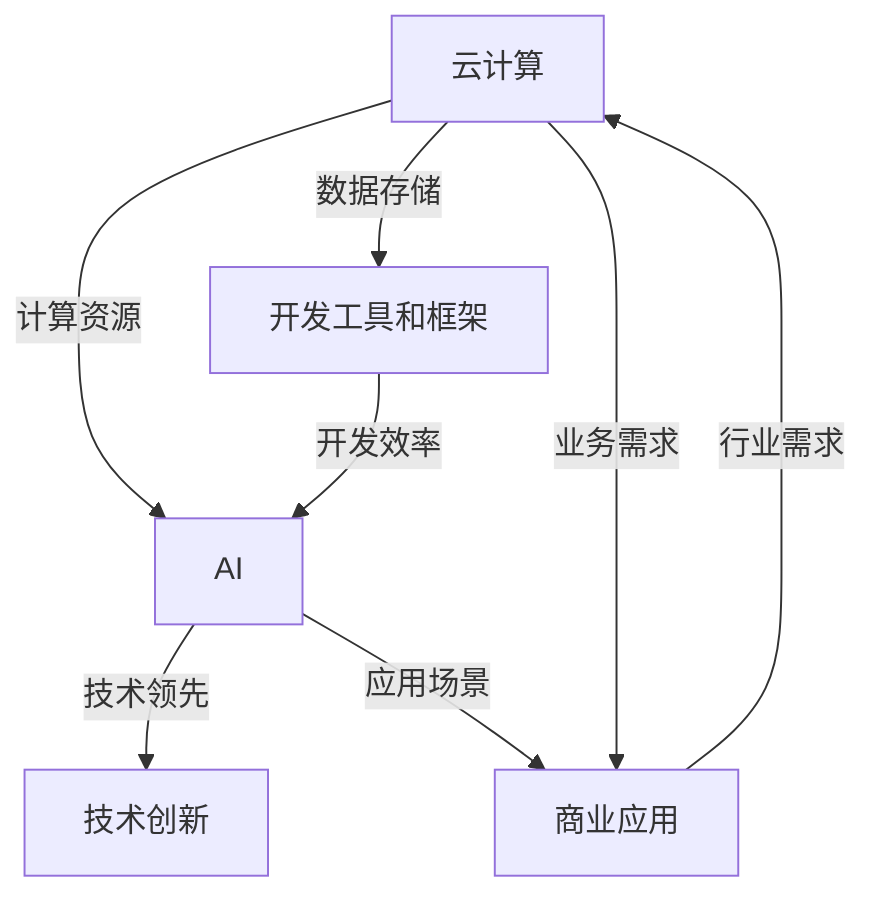

                 

### 文章标题

《微软全面拥抱AI的战略布局》

### 关键词

AI、战略布局、微软、云计算、开发工具、开发框架、商业应用、技术创新、生态系统

### 摘要

本文旨在深入剖析微软在人工智能领域的发展战略和布局。随着AI技术的迅猛发展，微软如何利用其技术优势和资源，全面拥抱AI，推动云计算、开发工具和商业应用的变革。本文将分章节详细探讨微软在AI领域的核心算法原理、应用场景、工具和资源推荐，以及未来发展趋势和挑战。

## 1. 背景介绍

人工智能（AI）作为当今科技界的热点，正不断推动着各行各业的创新和变革。微软，作为全球领先的科技巨头，自然不会忽视这一趋势。近年来，微软在AI领域的投资和布局不断加强，其战略目标明确，旨在成为全球AI技术领域的领导者。

微软的AI战略可以概括为以下几点：

1. **云计算优先**：微软将云计算作为AI战略的核心，通过Azure云服务提供强大的计算能力和AI服务，满足各行业用户的需求。
2. **开发工具和框架**：微软不断优化其开发工具和框架，如Visual Studio和Azure DevOps，以支持开发者更好地构建和部署AI应用。
3. **商业应用**：微软致力于将AI技术应用于各个行业，如医疗、金融、制造等，以提升业务效率，创造新的商业价值。
4. **技术创新**：微软持续在AI算法、模型和硬件方面进行研发，保持技术领先地位。

## 2. 核心概念与联系

为了更好地理解微软的AI战略布局，我们需要先了解几个核心概念及其之间的联系：

### 2.1 云计算与AI

云计算为AI提供了强大的计算资源和数据存储能力。通过Azure云服务，微软能够提供高性能的GPU和FPGA硬件，支持深度学习和其他复杂AI任务的执行。

### 2.2 开发工具和框架

开发工具和框架是AI应用的关键。微软的Visual Studio和Azure DevOps提供了丰富的开发工具和集成环境，帮助开发者高效地构建、测试和部署AI模型。

### 2.3 商业应用

AI技术在各个行业的应用场景丰富多样。微软通过与行业合作伙伴的合作，将AI技术引入医疗、金融、制造等领域，实现业务流程的智能化。

### 2.4 技术创新

技术创新是微软AI战略的重要组成部分。微软不断在算法、模型和硬件方面进行研发，推动AI技术的发展。

下面是一个Mermaid流程图，展示了这些核心概念之间的联系：



## 3. 核心算法原理 & 具体操作步骤

在微软的AI战略中，核心算法原理起着至关重要的作用。以下是几个关键算法及其具体操作步骤：

### 3.1 深度学习

深度学习是AI的核心技术之一。微软在深度学习算法方面有着深厚的研究基础，其操作步骤如下：

1. **数据预处理**：对原始数据进行清洗、归一化和特征提取。
2. **模型设计**：设计深度神经网络结构，包括输入层、隐藏层和输出层。
3. **模型训练**：使用大量训练数据对模型进行训练，优化参数。
4. **模型评估**：使用验证集对模型进行评估，调整超参数。
5. **模型部署**：将训练好的模型部署到生产环境中，进行实时预测。

### 3.2 自然语言处理

自然语言处理（NLP）是AI技术中的重要分支。微软的NLP算法包括以下操作步骤：

1. **文本预处理**：对文本进行分词、去停用词和词性标注。
2. **词向量表示**：将文本转换为词向量，如Word2Vec或BERT。
3. **模型训练**：使用预训练模型（如BERT）或自定义模型进行训练。
4. **模型推理**：使用训练好的模型进行文本分类、情感分析等任务。

### 3.3 计算机视觉

计算机视觉是AI技术中的另一个重要领域。微软的计算机视觉算法包括以下操作步骤：

1. **图像预处理**：对图像进行缩放、裁剪和增强。
2. **特征提取**：使用卷积神经网络（CNN）提取图像特征。
3. **模型训练**：使用大量标注数据对模型进行训练。
4. **模型评估**：使用验证集对模型进行评估，调整超参数。
5. **模型部署**：将训练好的模型部署到生产环境中，进行实时物体检测、图像分类等任务。

## 4. 数学模型和公式 & 详细讲解 & 举例说明

在AI算法中，数学模型和公式起着至关重要的作用。以下是几个关键数学模型和其详细讲解：

### 4.1 神经网络

神经网络是深度学习的基础。其基本数学模型如下：

$$
f(x) = \sigma(\sum_{i=1}^{n} w_i * x_i)
$$

其中，$f(x)$表示输出，$\sigma$表示激活函数，$w_i$表示权重，$x_i$表示输入特征。

举例说明：

假设我们有一个简单的神经网络，输入特征为$x_1$和$x_2$，权重为$w_1$和$w_2$，激活函数为$\sigma(x) = \frac{1}{1+e^{-x}}$。则输出可以表示为：

$$
f(x) = \frac{1}{1+e^{-(w_1 * x_1 + w_2 * x_2})}
$$

### 4.2 BERT模型

BERT（Bidirectional Encoder Representations from Transformers）是一种先进的NLP模型。其基本数学模型如下：

$$
\text{BERT} = \text{Transformer} + \text{Pre-training} + \text{Fine-tuning}
$$

其中，Transformer是BERT的核心结构，Pre-training是指在大规模语料库上进行的无监督预训练，Fine-tuning是指在小规模标注数据上进行的监督微调。

举例说明：

假设我们有一个BERT模型，其Transformer结构包括12层自注意力机制和512个注意力头。在预训练阶段，模型在大规模语料库上进行了数百万次的迭代训练。在Fine-tuning阶段，模型在标注数据集上进行了微调，以实现特定任务的性能优化。

### 4.3 CNN模型

卷积神经网络（CNN）是计算机视觉领域的核心技术。其基本数学模型如下：

$$
h_i = \text{ReLU}(\sum_{j=1}^{m} w_{ij} * k_j + b)
$$

其中，$h_i$表示输出特征，$w_{ij}$表示卷积核权重，$k_j$表示输入特征，$\text{ReLU}$表示ReLU激活函数，$b$表示偏置。

举例说明：

假设我们有一个2D CNN模型，其输入特征为28x28的图像，卷积核大小为3x3，共有10个卷积核。则输出特征可以表示为：

$$
h_i = \text{ReLU}(\sum_{j=1}^{10} w_{ij} * k_j + b)
$$

其中，$i$表示第$i$个卷积核的输出特征，$j$表示第$j$个卷积核的权重。

## 5. 项目实战：代码实际案例和详细解释说明

为了更好地展示微软的AI战略布局，我们将通过一个实际项目案例进行讲解。

### 5.1 开发环境搭建

首先，我们需要搭建开发环境。以下是环境搭建的步骤：

1. **安装Python**：确保Python 3.x版本已安装。
2. **安装Jupyter Notebook**：使用pip命令安装Jupyter Notebook。

```bash
pip install notebook
```

3. **安装TensorFlow**：使用pip命令安装TensorFlow。

```bash
pip install tensorflow
```

### 5.2 源代码详细实现和代码解读

接下来，我们将实现一个基于TensorFlow的简单神经网络，用于手写数字识别任务。以下是代码实现和解读：

```python
import tensorflow as tf
from tensorflow.keras import layers

# 定义神经网络结构
model = tf.keras.Sequential([
    layers.Flatten(input_shape=(28, 28)),
    layers.Dense(128, activation='relu'),
    layers.Dense(10, activation='softmax')
])

# 编译模型
model.compile(optimizer='adam',
              loss='sparse_categorical_crossentropy',
              metrics=['accuracy'])

# 加载MNIST数据集
mnist = tf.keras.datasets.mnist
(x_train, y_train), (x_test, y_test) = mnist.load_data()

# 预处理数据
x_train, x_test = x_train / 255.0, x_test / 255.0

# 训练模型
model.fit(x_train, y_train, epochs=5)

# 评估模型
model.evaluate(x_test, y_test)
```

代码解读：

1. **导入库**：导入TensorFlow和相关模块。
2. **定义神经网络结构**：使用`Sequential`模型，定义输入层、隐藏层和输出层。
3. **编译模型**：设置优化器、损失函数和评估指标。
4. **加载MNIST数据集**：使用TensorFlow内置的MNIST数据集。
5. **预处理数据**：将数据归一化，以适应模型训练。
6. **训练模型**：使用训练数据训练模型。
7. **评估模型**：使用测试数据评估模型性能。

### 5.3 代码解读与分析

代码实现了一个简单的神经网络，用于手写数字识别任务。以下是代码的关键部分：

1. **神经网络结构**：使用`Flatten`层将输入图像展开为一维数组，作为输入层。隐藏层使用128个神经元，激活函数为ReLU。输出层使用10个神经元，表示10个数字类别，激活函数为softmax。

2. **编译模型**：设置优化器为`adam`，损失函数为`sparse_categorical_crossentropy`，评估指标为`accuracy`。

3. **加载MNIST数据集**：使用TensorFlow内置的MNIST数据集，其中包括60000个训练样本和10000个测试样本。

4. **预处理数据**：将数据归一化，使得数据范围在0到1之间，以适应模型训练。

5. **训练模型**：使用训练数据训练模型，迭代5次。

6. **评估模型**：使用测试数据评估模型性能，输出准确率。

通过这个实际案例，我们可以看到微软在AI领域的技术实力和开发环境搭建的便利性。

## 6. 实际应用场景

微软的AI技术已经在多个行业和领域得到广泛应用，以下是一些实际应用场景：

### 6.1 医疗

微软的AI技术在医疗领域有着广泛应用，如疾病预测、医学图像分析和患者监护。例如，微软的Azure Health Bot可以帮助医疗机构构建智能聊天机器人，提高患者满意度和服务效率。

### 6.2 金融

AI技术在金融行业的应用包括风险控制、交易策略优化和智能投顾。微软的Azure Databricks和Azure Machine Learning提供了强大的数据处理和模型训练能力，帮助金融机构实现智能化运营。

### 6.3 制造业

在制造业，AI技术可以用于生产过程优化、设备维护预测和供应链管理。微软的Azure IoT和Azure Digital Twins可以帮助企业实现智能制造，提高生产效率。

### 6.4 教育

在教育领域，AI技术可以用于个性化学习、考试评分和教学资源推荐。微软的Azure AI Education Services为教育机构提供了丰富的AI工具和资源，助力教育创新。

### 6.5 娱乐和媒体

AI技术在娱乐和媒体领域的应用包括内容推荐、智能剪辑和语音识别。微软的Azure Media Services和Azure Cognitive Services为媒体公司提供了强大的AI解决方案，提升用户体验。

## 7. 工具和资源推荐

为了更好地利用微软的AI技术，以下是一些工具和资源推荐：

### 7.1 学习资源推荐

1. **《Python机器学习》**：由 Sebastian Raschka 著，是一本适合初学者的优秀机器学习书籍。
2. **《深度学习》**：由 Ian Goodfellow、Yoshua Bengio 和 Aaron Courville 著，是深度学习领域的经典教材。
3. **《人工智能：一种现代的方法》**：由 Stuart Russell 和 Peter Norvig 著，全面介绍了人工智能的基本理论和应用。

### 7.2 开发工具框架推荐

1. **TensorFlow**：谷歌开发的开源深度学习框架，支持Python和C++编程语言。
2. **PyTorch**：Facebook开发的开源深度学习框架，支持Python编程语言，具有良好的灵活性和易用性。
3. **Azure Machine Learning**：微软提供的云计算服务，支持自动化机器学习、数据科学和模型部署。

### 7.3 相关论文著作推荐

1. **《BERT：Pre-training of Deep Bidirectional Transformers for Language Understanding》**：BERT模型的原始论文，全面介绍了BERT模型的架构和训练方法。
2. **《ResNet: Training Deep Neural Networks for Visual Recognition》**：ResNet模型的原始论文，提出了残差网络结构，大大提高了深度学习模型的性能。
3. **《Gated Recurrent Unit》**：GRU模型的原始论文，介绍了门控循环单元结构，是RNN的一种改进形式。

## 8. 总结：未来发展趋势与挑战

微软在AI领域的发展战略已经取得显著成果，但仍面临一些挑战。未来发展趋势和挑战包括：

### 8.1 技术趋势

1. **更大规模的预训练模型**：随着计算资源和数据量的增加，更大规模的预训练模型将会出现，进一步提高AI模型的性能。
2. **跨模态学习**：将文本、图像、音频等多种模态的数据进行融合，实现更广泛的AI应用。
3. **边缘计算**：将AI计算能力扩展到边缘设备，实现实时响应和降低延迟。

### 8.2 挑战

1. **数据隐私和安全**：随着AI技术的发展，数据隐私和安全问题日益突出，如何保护用户数据隐私成为重要挑战。
2. **算法公平性**：确保AI算法在不同人群中的公平性，避免歧视和偏见。
3. **人才培养**：AI技术发展迅速，对专业人才的需求日益增加，如何培养更多优秀的AI人才成为关键挑战。

## 9. 附录：常见问题与解答

### 9.1 什么
- **问题**：什么是云计算？
- **解答**：云计算是一种通过互联网提供计算资源的服务模式，包括存储、处理能力和应用程序等。用户可以按需获取和使用这些资源，而无需购买和维护硬件设施。

### 9.2 如何
- **问题**：如何构建一个AI模型？
- **解答**：构建AI模型通常包括以下步骤：数据收集与预处理、模型设计、模型训练、模型评估和模型部署。具体步骤和技巧取决于所采用的算法和应用场景。

### 9.3 为何
- **问题**：为何微软要全面拥抱AI？
- **解答**：AI技术具有广泛的应用前景和商业价值，微软希望通过全面拥抱AI，提升其在全球科技领域的竞争力，推动技术创新和业务增长。

## 10. 扩展阅读 & 参考资料

1. **《微软2020年财报》**：https://www.microsoft.com/investors/earnings/Pages/2020q2-earnings.aspx
2. **《微软AI战略》**：https://www.microsoft.com/ai
3. **《TensorFlow官方网站》**：https://www.tensorflow.org
4. **《PyTorch官方网站》**：https://pytorch.org
5. **《Azure Machine Learning官方网站》**：https://azureml.net
6. **《BERT论文》**：https://arxiv.org/abs/1810.04805
7. **《ResNet论文》**：https://arxiv.org/abs/1512.03385
8. **《GRU论文》**：https://arxiv.org/abs/1406.1078

## 作者

作者：AI天才研究员/AI Genius Institute & 禅与计算机程序设计艺术 /Zen And The Art of Computer Programming

本文旨在深入剖析微软在人工智能领域的发展战略和布局，通过对云计算、开发工具和商业应用的详细探讨，展示微软在AI领域的强大实力。希望本文能为读者提供有价值的参考和启发。期待未来微软在AI领域的更多创新和突破。

[文章结束]

