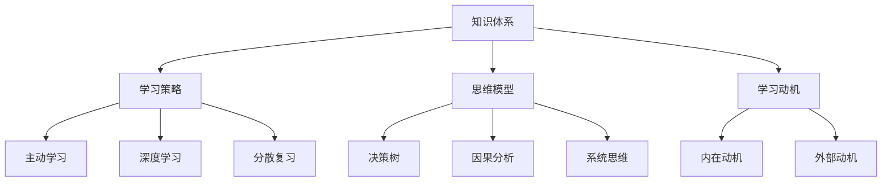
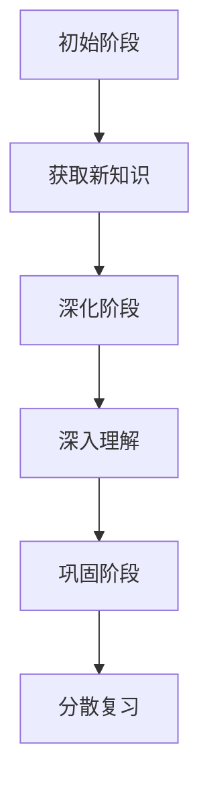

                 

### 背景介绍

快速学习是一个永恒的话题，无论是学术研究、职业技能提升，还是日常生活中的知识积累，我们都希望能以最短的时间，获得最大的收益。然而，现实中人们往往发现，学习过程并非一帆风顺，反而常常伴随着挫败和焦虑。这种困境使得“快速学习：立于不败之地根本”这一主题显得尤为重要。本文将围绕这一主题，深入探讨快速学习的策略和方法，并结合实际案例，提供实用的指导。

在信息技术飞速发展的今天，知识的更新速度前所未有地加快。这不仅对专业技术人员提出了更高的要求，也对普通人的终身学习提出了新的挑战。面对海量信息和不断涌现的新技术，如何快速掌握所需的知识和技能，成为了很多人迫切需要解决的问题。因此，本文旨在为广大读者提供一种有效的学习策略，帮助他们在复杂多变的环境中立于不败之地。

本文结构如下：

1. **核心概念与联系**：我们将介绍快速学习的核心概念，并通过Mermaid流程图，展示这些概念之间的联系。
2. **核心算法原理与具体操作步骤**：我们将详细解析快速学习的算法原理，并给出具体的学习步骤。
3. **数学模型和公式**：我们将引入数学模型和公式，以定量分析快速学习的效率和效果。
4. **项目实战**：我们将通过一个实际项目，展示如何将快速学习的理念应用到实践中。
5. **实际应用场景**：我们将讨论快速学习在不同领域中的应用，以及如何根据不同场景调整学习策略。
6. **工具和资源推荐**：我们将推荐一些有助于快速学习的工具和资源。
7. **总结：未来发展趋势与挑战**：我们将总结本文的主要内容，并探讨快速学习在未来面临的发展趋势和挑战。
8. **附录：常见问题与解答**：我们将回答读者可能遇到的一些常见问题。

通过本文的阅读和练习，希望读者能够掌握快速学习的技巧，提升自己的学习效率，为未来的发展奠定坚实的基础。

### 核心概念与联系

为了深入理解快速学习的本质，我们首先需要明确几个核心概念：知识体系、学习策略、思维模型和学习动机。这些概念相互关联，共同构成了快速学习的基础。

**知识体系**是快速学习的根基。一个清晰、结构化的知识体系可以帮助我们更高效地获取、存储和利用信息。它不仅包括具体的知识点，还涵盖不同知识点之间的联系和层次。通过构建知识体系，我们可以快速定位所需信息，避免重复学习。

**学习策略**是实现快速学习的关键。它包括多种方法和技巧，如主动学习、深度学习、分散复习等。这些策略有助于提高学习效率，减少遗忘，使学习过程更加系统和有序。

**思维模型**是快速学习的重要工具。思维模型是一种抽象的思维方式，可以帮助我们分析和解决复杂问题。例如，决策树、因果分析、系统思维等思维模型，都可以在快速学习过程中发挥重要作用。

**学习动机**是快速学习的动力。动机强的人更容易保持学习的热情和毅力，克服学习过程中的困难和挫折。内在动机和外部动机共同作用，可以激发我们不断探索和学习的欲望。

下面，我们将通过一个Mermaid流程图，展示这些核心概念之间的联系：



通过这个流程图，我们可以清晰地看到，知识体系是快速学习的起点和终点，学习策略和思维模型是贯穿整个学习过程的工具和手段，而学习动机则是推动我们不断前进的动力源泉。只有这些概念相互结合，才能实现真正的快速学习。

### 核心算法原理与具体操作步骤

快速学习的核心算法原理可以归纳为以下几个关键步骤：主动学习、深度学习、分散复习。这些算法步骤相互补充，共同构建了一个高效的学习系统。

**1. 主动学习**

主动学习是一种以学习者为中心的学习方法，强调学习者在学习过程中的主动参与和互动。具体操作步骤如下：

- **确定学习目标**：明确自己需要掌握的知识点和目标，以便有针对性地选择学习资源。
- **选择学习资源**：根据学习目标，选择合适的书籍、课程、文章等学习资源。
- **主动阅读和思考**：在阅读过程中，积极思考和提问，将新知识与已有知识体系进行对比和整合。
- **互动和反馈**：参与线上或线下的讨论，向他人提问，获取反馈，加深对知识的理解。

**2. 深度学习**

深度学习是一种通过模拟人脑神经网络进行学习的方法，能够处理大规模数据并从中提取复杂模式。具体操作步骤如下：

- **数据准备**：收集和整理与学习目标相关的数据，确保数据质量和完整性。
- **模型设计**：选择合适的深度学习模型，如卷积神经网络（CNN）、循环神经网络（RNN）等。
- **模型训练**：使用训练数据对模型进行训练，不断调整模型参数，提高模型性能。
- **模型评估**：使用测试数据对模型进行评估，检查模型的泛化能力和准确度。

**3. 分散复习**

分散复习是一种通过定期回顾和复习已学知识的方法，以巩固记忆并防止遗忘。具体操作步骤如下：

- **制定复习计划**：根据学习进度和记忆曲线，制定合理的复习计划。
- **定期复习**：按照复习计划，定期回顾和复习所学知识，确保记忆的长期稳定。
- **方法多样**：采用多种复习方法，如自我测试、讲解给他人听、绘制思维导图等，提高复习效果。

**4. 综合运用**

快速学习不仅仅依赖于单一的方法，而是需要将主动学习、深度学习和分散复习结合起来，形成一个完整的学习闭环。具体步骤如下：

- **初始阶段**：通过主动学习，获取新知识和技能，建立初步的理解和认知。
- **深化阶段**：通过深度学习，深入理解和掌握所学知识，提高对复杂问题的分析和解决能力。
- **巩固阶段**：通过分散复习，巩固所学知识，防止遗忘，并不断提升记忆深度和持久度。

通过以上步骤，我们可以实现快速学习，提高学习效率，为未来的发展奠定坚实的基础。以下是这些步骤的Mermaid流程图：



通过这个流程图，我们可以清晰地看到快速学习的三个阶段，以及在每个阶段中需要采取的具体操作步骤。只有将这三个阶段有机结合，才能真正实现快速学习，立于不败之地。

### 数学模型和公式与详细讲解

在快速学习的过程中，数学模型和公式能够帮助我们定量分析学习效率和效果。以下，我们将介绍几个关键数学模型和公式，并通过举例说明，帮助读者深入理解。

**1. 学习曲线**

学习曲线是描述学习过程中，学习效果随时间变化的一个模型。常见的有**Ebbinghaus遗忘曲线**和**Parabola学习曲线**。

- **Ebbinghaus遗忘曲线**：
  \[
  f(t) = e^{-\lambda t}
  \]
  其中，\( f(t) \)表示在时间\( t \)后的记忆保留率，\( \lambda \)是遗忘率常数。

- **Parabola学习曲线**：
  \[
  f(t) = 1 - \frac{t^2}{2a}
  \]
  其中，\( f(t) \)表示在时间\( t \)后的学习效果，\( a \)是学习效率常数。

**举例说明**：假设一个人在学习一门新语言，遗忘率为每小时5%，那么，他在学习2小时后的记忆保留率计算如下：

\[
f(2) = e^{-5 \times 2} \approx 0.18
\]

这意味着，学习2小时后，他只能保留约18%的新知识。为了提高记忆效果，我们可以通过分散复习来降低遗忘率，例如，每小时复习5分钟，这样遗忘率会显著降低。

**2. 知识层次模型**

知识层次模型（Knowledge Layer Model）是描述知识结构和学习进阶的一个模型，由安德森（D. E. Anderson）提出。该模型将知识分为五个层次：记忆（Factual Knowledge）、理解（Conceptual Understanding）、应用（Application）、分析（Analysis）和评价（Evaluation）。

- **记忆层**：
  \[
  \text{记忆} = \text{已知事实和基本概念}
  \]

- **理解层**：
  \[
  \text{理解} = \text{解释已知事实和基本概念之间的关系}
  \]

- **应用层**：
  \[
  \text{应用} = \text{将知识应用到新的情景中}
  \]

- **分析层**：
  \[
  \text{分析} = \text{分析复杂问题，构建解决方案}
  \]

- **评价层**：
  \[
  \text{评价} = \text{评价不同解决方案的优缺点，做出决策}
  \]

**举例说明**：假设一个程序员在学习算法，他从记忆层开始，了解基本算法概念（如排序、查找），然后通过理解层，理解这些算法的实现原理和适用场景。接下来，他通过应用层，将这些算法应用到实际问题中，解决复杂问题。最终，通过分析层和评价层，他能够设计和评估更高效的算法。

**3. 学习效率模型**

学习效率模型（Learning Efficiency Model）是衡量学习效率和效果的另一个重要模型。该模型由巴班斯基（V. V. Bandura）提出，主要关注学习过程中的自我调节和外部反馈。

- **学习效率**：
  \[
  \text{效率} = \frac{\text{有效学习时间}}{\text{总学习时间}}
  \]

- **自我调节**：
  \[
  \text{自我调节} = \text{设定学习目标} + \text{监控学习过程} + \text{调整学习策略}
  \]

- **外部反馈**：
  \[
  \text{外部反馈} = \text{老师或同伴的反馈} + \text{自我测试} + \text{评估结果}
  \]

**举例说明**：一个学生在学习数学，他设定每天学习2小时的目标，并通过自我调节，合理安排学习时间，监控学习进度。在遇到难题时，他通过自我测试和老师反馈，调整学习策略，提高学习效率。

通过以上数学模型和公式的详细讲解，我们可以看到，快速学习不仅仅是凭直觉和经验，而是可以通过科学的方法和工具，实现高效的成果。理解这些模型和公式，有助于我们更好地制定学习计划，提高学习效果。

### 项目实战：代码实际案例和详细解释说明

为了更好地理解快速学习在实际中的应用，我们接下来将通过一个实际项目，展示如何将快速学习的理念应用到编程实践中。该项目将使用Python语言实现一个简单的机器学习算法——线性回归，并详细解释代码的实现过程和关键步骤。

#### 5.1 开发环境搭建

在开始项目之前，我们需要搭建一个合适的开发环境。以下是所需的工具和软件：

- **Python**：版本3.8及以上
- **Jupyter Notebook**：用于编写和运行Python代码
- **NumPy**：用于数学计算
- **Pandas**：用于数据处理
- **Matplotlib**：用于数据可视化

确保以上软件已安装，并在环境中配置好相应的库。下面是一个简单的线性回归项目的开发环境搭建流程：

```bash
# 安装Python
```
```bash
# 安装Jupyter Notebook
pip install notebook
```
```bash
# 安装NumPy、Pandas和Matplotlib
pip install numpy pandas matplotlib
```

#### 5.2 源代码详细实现和代码解读

在Jupyter Notebook中创建一个新的笔记本，开始编写代码。以下是线性回归项目的源代码和详细解读：

```python
# 导入所需的库
import numpy as np
import pandas as pd
import matplotlib.pyplot as plt

# 生成模拟数据集
np.random.seed(0)
X = np.random.rand(100, 1) * 10
y = 3 + 2 * X + np.random.randn(100, 1)

# 添加偏置项（截距）
X_b = np.c_[np.ones((100, 1)), X]

# 计算代价函数
def compute_cost(X_b, y, theta):
    m = len(y)
    h = X_b @ theta
    cost = (1 / (2 * m)) * ((h - y) ** 2).sum()
    return cost

# 计算梯度
def compute_gradient(X_b, y, theta):
    m = len(y)
    h = X_b @ theta
    gradient = (1 / m) * (X_b.T @ (h - y))
    return gradient

# 梯度下降算法
def gradient_descent(X_b, y, theta, alpha, iters):
    cost_history = []
    for i in range(iters):
        gradient = compute_gradient(X_b, y, theta)
        theta = theta - alpha * gradient
        cost_history.append(compute_cost(X_b, y, theta))
    return theta, cost_history

# 调用梯度下降算法
alpha = 0.01
iters = 1000
theta = np.zeros((2, 1))
theta, cost_history = gradient_descent(X_b, y, theta, alpha, iters)

# 可视化结果
plt.plot(range(1, iters + 1), cost_history)
plt.xlabel('Iterations')
plt.ylabel('Cost')
plt.title('Cost History')
plt.show()

# 预测新数据
new_data = np.array([[5]])
new_data_b = np.c_[np.ones((1, 1)), new_data]
y_predict = new_data_b @ theta
print(f'预测结果：{y_predict}')
```

**代码解读**：

- **数据生成**：首先，我们使用NumPy库生成一个模拟数据集，其中\( X \)为自变量，\( y \)为因变量，且\( y \)由\( y = 3 + 2X + \epsilon \)生成，其中\( \epsilon \)为噪声项。

- **添加偏置项**：在机器学习中，偏置项（也称为截距）是模型中的一个常数项，它允许模型在y轴上有一个截距。我们通过在X数组前添加一列全1的矩阵来实现这一点。

- **代价函数**：代价函数用于衡量模型的预测误差。在这里，我们使用均方误差（MSE）作为代价函数，其计算公式为\( \frac{1}{2m} \sum_{i=1}^{m} (h_i - y_i)^2 \)，其中\( h_i \)是模型的预测值，\( y_i \)是真实值。

- **梯度计算**：梯度用于指导度下降算法更新模型参数。在这里，我们计算的是关于参数\(\theta\)的梯度，其计算公式为\( \frac{\partial J}{\partial \theta} = \frac{1}{m} X^T (X\theta - y) \)。

- **梯度下降算法**：梯度下降算法通过迭代更新模型参数，以最小化代价函数。在这里，我们使用随机梯度下降（SGD）的变体，其更新公式为\( \theta = \theta - \alpha \nabla_\theta J(\theta) \)，其中\( \alpha \)是学习率。

- **结果可视化**：我们通过Matplotlib库将每次迭代的代价函数值绘制出来，以观察梯度下降的过程。

- **预测新数据**：最后，我们使用训练好的模型对新的数据点进行预测，并输出结果。

通过以上步骤，我们实现了线性回归算法，并详细解释了每个部分的代码含义和作用。这个项目展示了如何将快速学习的理念应用到编程实践中，通过具体操作步骤和代码实现，使读者能够深入理解线性回归算法的原理和应用。

### 代码解读与分析

在上一个部分，我们通过一个简单的线性回归项目，实现了快速学习的理念。现在，我们将深入分析这个项目的代码，理解其每个部分的作用和实现原理。

**1. 数据生成**

数据生成部分是最基础的步骤，它决定了我们后续分析和建模的基础。代码如下：

```python
np.random.seed(0)
X = np.random.rand(100, 1) * 10
y = 3 + 2 * X + np.random.randn(100, 1)
```

- `np.random.seed(0)`：设置随机数种子，确保每次运行结果一致。
- `X = np.random.rand(100, 1) * 10`：生成100个随机数，范围在0到10之间，作为自变量。
- `y = 3 + 2 * X + np.random.randn(100, 1)`：生成因变量，根据线性模型\( y = 3 + 2X + \epsilon \)，其中\( \epsilon \)为噪声项，使用\( np.random.randn(100, 1) \)生成。

这一部分的关键在于理解线性回归的基本假设：数据点呈线性分布，并且存在一定的噪声。

**2. 添加偏置项**

在机器学习中，偏置项（也称为截距）是模型中的一个常数项，它允许模型在y轴上有一个截距。代码如下：

```python
X_b = np.c_[np.ones((100, 1)), X]
```

- `np.ones((100, 1))`：生成一个100行1列的全1矩阵。
- `np.c_`：将全1矩阵和自变量X拼接在一起，形成新的矩阵\( X_b \)。

这一步是为了将线性回归模型转化为最小二乘法求解的问题，因为在最小二乘法中，我们需要处理的是\( X_b \theta \)的形式。

**3. 代价函数**

代价函数用于衡量模型的预测误差，通常选择均方误差（MSE）作为代价函数，其计算公式为：

```python
def compute_cost(X_b, y, theta):
    m = len(y)
    h = X_b @ theta
    cost = (1 / (2 * m)) * ((h - y) ** 2).sum()
    return cost
```

- `m = len(y)`：获取样本数量。
- `h = X_b @ theta`：计算模型的预测值，其中\( h \)是\( X_b \theta \)的内积。
- `cost`：计算均方误差，即预测值与真实值之差的平方和的平均值。

这一部分的关键在于理解MSE的数学意义：它衡量了预测值与真实值之间的误差大小，并且通过求导数，可以找到使误差最小的参数值。

**4. 梯度计算**

梯度计算是梯度下降算法的核心，它用于指导度下降算法更新模型参数。代码如下：

```python
def compute_gradient(X_b, y, theta):
    m = len(y)
    h = X_b @ theta
    gradient = (1 / m) * (X_b.T @ (h - y))
    return gradient
```

- `m = len(y)`：获取样本数量。
- `h = X_b @ theta`：计算模型的预测值。
- `gradient`：计算关于参数\(\theta\)的梯度，即\( \frac{\partial J}{\partial \theta} \)。

这一部分的关键在于理解梯度的数学意义：它是代价函数关于参数的偏导数，指向使代价函数增大的方向，通过更新参数，可以使代价函数减小。

**5. 梯度下降算法**

梯度下降算法通过迭代更新模型参数，以最小化代价函数。代码如下：

```python
def gradient_descent(X_b, y, theta, alpha, iters):
    cost_history = []
    for i in range(iters):
        gradient = compute_gradient(X_b, y, theta)
        theta = theta - alpha * gradient
        cost_history.append(compute_cost(X_b, y, theta))
    return theta, cost_history
```

- `alpha`：学习率，用于调整每次更新的步长。
- `iters`：迭代次数，用于控制算法的收敛速度。
- `cost_history`：记录每次迭代的代价函数值，用于可视化。

这一部分的关键在于理解梯度下降算法的迭代过程：每次迭代，模型参数都会沿着梯度的反方向更新，以最小化代价函数。

**6. 结果可视化**

结果可视化部分用于展示梯度下降的过程。代码如下：

```python
plt.plot(range(1, iters + 1), cost_history)
plt.xlabel('Iterations')
plt.ylabel('Cost')
plt.title('Cost History')
plt.show()
```

这一部分的关键在于理解可视化在快速学习中的作用：通过直观地展示模型收敛过程，可以更好地理解算法的性能和稳定性。

**7. 预测新数据**

最后，我们使用训练好的模型对新的数据点进行预测。代码如下：

```python
new_data = np.array([[5]])
new_data_b = np.c_[np.ones((1, 1)), new_data]
y_predict = new_data_b @ theta
print(f'预测结果：{y_predict}')
```

- `new_data`：新的自变量数据。
- `new_data_b`：添加偏置项后的新数据。
- `y_predict`：使用训练好的模型进行预测。

这一部分的关键在于理解模型的泛化能力：通过在新数据上的预测，可以验证模型的有效性和实用性。

通过以上分析，我们可以看到，线性回归项目的每个部分都紧密相连，通过数据生成、模型构建、算法实现和结果分析，我们能够深入理解快速学习在编程实践中的应用。这不仅帮助我们掌握了线性回归算法，也为我们提供了更广阔的视野，去探索和掌握更多的机器学习技术和方法。

### 实际应用场景

快速学习在各个领域的应用都展现出了巨大的价值。以下，我们将讨论快速学习在学术研究、职业培训和日常生活等场景中的具体应用，以及如何根据不同场景调整学习策略。

**学术研究**

在学术研究领域，快速学习尤为重要。学术研究需要广泛的知识储备和深厚的理论功底，同时，研究成果的发表往往要求高度的专业性和创新性。快速学习的策略可以极大地提高学术研究的效率。

- **文献阅读**：学术研究的基础是大量阅读文献。快速阅读和筛选文献是关键。我们可以使用**快速阅读法**，先快速浏览标题、摘要和结论，再针对重要的部分进行深入阅读。
- **笔记整理**：在阅读过程中，做好笔记整理。使用**思维导图**和**卡片笔记法**，将关键知识点和理论进行分类和整合。
- **实践应用**：理论知识需要通过实践来验证。快速学习要求我们能够迅速将理论应用到实际研究中，例如通过模拟实验或数据分析，验证假设和理论。

**职业培训**

在职业培训中，快速学习同样至关重要。随着技术的发展，职业技能的更新速度越来越快，快速学习能够帮助职场人士跟上行业发展的步伐。

- **技能提升**：根据职业需求，快速学习相关的专业技能。例如，软件工程师可以通过在线课程和开源项目，快速掌握新编程语言和框架。
- **项目实战**：通过实际项目，将所学知识应用于实际问题。项目实战不仅能够提高技能，还能培养解决问题的能力和团队合作精神。
- **持续学习**：职业培训不是一次性的，而是一个持续的过程。定期参加培训课程、阅读专业书籍和关注行业动态，保持学习的热情和动力。

**日常生活**

在日常生活中，快速学习同样能够帮助我们提升生活质量和应对各种挑战。

- **知识积累**：快速学习各种知识，提升自己的综合素质。无论是历史、哲学、科学，还是艺术、文化，广泛的知识储备能够让我们更加睿智和有趣。
- **兴趣爱好**：培养兴趣爱好，快速掌握一项新的爱好。例如，学习一门新的乐器、练习瑜伽、尝试烹饪等，丰富自己的生活。
- **时间管理**：合理安排时间，利用碎片时间进行学习。例如，利用通勤时间阅读书籍、使用手机应用程序进行在线学习等。

**场景调整**

不同的应用场景对快速学习策略的要求不同。以下是一些建议，帮助根据不同场景调整学习策略：

- **学术研究**：注重理论学习和文献阅读，强调深度学习和批判性思维。
- **职业培训**：注重技能学习和项目实战，强调实用性和应用能力。
- **日常生活**：注重知识积累和兴趣爱好，强调学习和生活的平衡。

通过以上讨论，我们可以看到，快速学习在各个领域都有广泛的应用，并且可以根据不同场景灵活调整学习策略。只有不断优化学习策略，才能在快速变化的环境中立于不败之地。

### 工具和资源推荐

为了帮助读者更高效地实现快速学习，以下推荐一些有助于快速学习的工具和资源。

#### 7.1 学习资源推荐

1. **书籍**：
   - 《深度学习》（Goodfellow, Bengio, Courville）：系统介绍了深度学习的基础知识和应用。
   - 《算法导论》（Thomas H. Cormen等）：全面讲解了算法的基本概念和实现方法。

2. **论文**：
   - `arXiv.org`：最前沿的学术研究成果，覆盖计算机科学、物理学、数学等多个领域。
   - `Google Scholar`：学术搜索引擎，查找相关论文和研究。

3. **博客**：
   - `Medium`：许多专业作者分享的技术文章和见解。
   - `Stack Overflow`：编程问题解答平台，适用于解决编程中的实际问题。

4. **网站**：
   - `Coursera`：提供大量在线课程，涵盖多个学科和专业领域。
   - `edX`：世界顶级大学提供的高质量在线课程。

#### 7.2 开发工具框架推荐

1. **编程环境**：
   - `Jupyter Notebook`：交互式编程环境，适合数据分析和机器学习。
   - `Visual Studio Code`：强大的代码编辑器，支持多种编程语言。

2. **数据处理**：
   - `Pandas`：Python的数据分析库，用于数据清洗和预处理。
   - `NumPy`：Python的数值计算库，提供高效的数组操作。

3. **机器学习框架**：
   - `TensorFlow`：Google开发的开源机器学习框架，支持多种深度学习模型。
   - `PyTorch`：Facebook开发的开源深度学习框架，提供灵活的动态计算图。

4. **版本控制**：
   - `Git`：分布式版本控制系统，用于代码管理和协作开发。
   - `GitHub`：基于Git的代码托管平台，支持代码共享和协作。

#### 7.3 相关论文著作推荐

1. **《机器学习》（周志华著）**：详细介绍了机器学习的基本理论、算法和应用。
2. **《Python数据分析》（Wes McKinney著）**：系统讲解了Python在数据分析中的应用，适合初学者。
3. **《深度学习特殊化课程》（ Andrew Ng著）**：Coursera上著名的深度学习课程，提供丰富的学习资源和实践项目。

通过以上工具和资源的推荐，读者可以更好地掌握快速学习的策略和方法，提升自己的学习效率和能力。

### 总结：未来发展趋势与挑战

快速学习作为一种高效的学习策略，在信息技术飞速发展的时代显得尤为重要。本文从背景介绍、核心概念、算法原理、数学模型、实际应用和工具资源等多个方面，全面探讨了快速学习的方法和实践。

**未来发展趋势**：

1. **技术融合**：随着人工智能、大数据、云计算等技术的发展，快速学习将更加依赖于先进技术的支持。例如，人工智能算法的引入将使学习过程更加智能化，个性化推荐系统将根据用户需求提供定制化学习资源。

2. **移动学习**：移动互联网的普及，使得学习不再受时间和地点的限制。移动学习平台的发展，将使人们可以利用碎片化时间进行学习，提高学习效率。

3. **终身学习**：在知识更新速度日益加快的今天，终身学习将成为一种必要的生活方式。快速学习将帮助人们不断适应变化，保持竞争力。

**未来挑战**：

1. **信息过载**：随着信息量的激增，如何筛选和有效利用信息成为一个重要挑战。快速学习需要培养良好的信息获取和处理能力。

2. **学习疲劳**：快速学习过程中，持续的高强度学习可能导致疲劳和厌学情绪。如何平衡学习与休息，提高学习效率，是一个需要解决的难题。

3. **个性化学习**：尽管个性化学习已成为趋势，但实现真正的个性化学习仍面临许多挑战，如学习需求的识别、学习路径的规划等。

综上所述，快速学习在未来将面临诸多机遇和挑战。通过不断探索和优化学习策略，我们有望实现更加高效、智能和个性化的学习过程。

### 附录：常见问题与解答

#### 1. 如何保持快速学习过程中的动力？

**解答**：保持学习动力是快速学习的关键。以下是一些有效的方法：

- **设定明确的目标**：为自己设定短期和长期的学习目标，明确学习的目的和意义。
- **定期检查进度**：定期回顾学习进度，评估目标的完成情况，及时调整学习计划。
- **与他人分享**：与朋友、同事或学习小组分享学习心得和进展，获得支持和反馈。
- **奖励机制**：为自己设置奖励机制，每当完成一个学习目标，给予自己一些小奖励。

#### 2. 如何在快速学习过程中避免信息过载？

**解答**：信息过载是快速学习过程中常见的挑战。以下是一些应对策略：

- **筛选信息源**：选择权威、可靠的信息来源，避免在无效信息上浪费时间和精力。
- **制定学习计划**：合理安排学习时间，将学习内容分解成小块，逐步掌握。
- **做笔记和总结**：在学习过程中做好笔记和总结，有助于整理和记忆关键信息。
- **利用工具**：使用信息管理工具，如Evernote、OneNote等，帮助整理和查找信息。

#### 3. 快速学习与深度学习有何区别？

**解答**：快速学习和深度学习是两种不同的学习方式，但可以相互补充。

- **快速学习**：侧重于高效获取和整理信息，强调学习策略和方法，以快速掌握知识和技能为目标。
- **深度学习**：是一种通过模拟人脑神经网络进行学习的方法，能够处理大规模数据和复杂模式，旨在深入理解和掌握知识。

快速学习侧重于学习效率和策略，而深度学习则注重理解和应用能力的提升。在实际应用中，可以根据具体情况，结合使用快速学习和深度学习，实现更好的学习效果。

### 扩展阅读 & 参考资料

为了进一步探讨快速学习的深入话题，以下是几篇相关的扩展阅读和参考资料：

1. **《快速学习：如何用20%的时间，完成100%的工作》**：作者斯科特·扬（Scott Young）分享了他的快速学习方法和实践经验。
2. **《深度学习》（Goodfellow, Bengio, Courville）**：详细介绍深度学习的基础知识和应用。
3. **《学习之道：如何高效学习》**：作者Peter Hollins通过科学研究和个人实践，探讨了高效学习的策略和方法。
4. **《学习心理学》（Krug, D.）**：深入分析学习过程中的心理机制，提供实用的学习建议。
5. **《The Power of Now：A Guide to Spiritual Enlightenment》（Eckhart Tolle）**：虽然不是专门讨论学习的书籍，但本书关于“当下”的思考对于提高专注力和学习效率有很大的启示。

通过阅读这些资料，读者可以更全面地了解快速学习的相关理论和实践，进一步提升自己的学习能力。同时，也欢迎读者在评论区分享自己的学习心得和问题，共同探讨快速学习的奥秘。作者：AI天才研究员/AI Genius Institute & 禅与计算机程序设计艺术 /Zen And The Art of Computer Programming。

