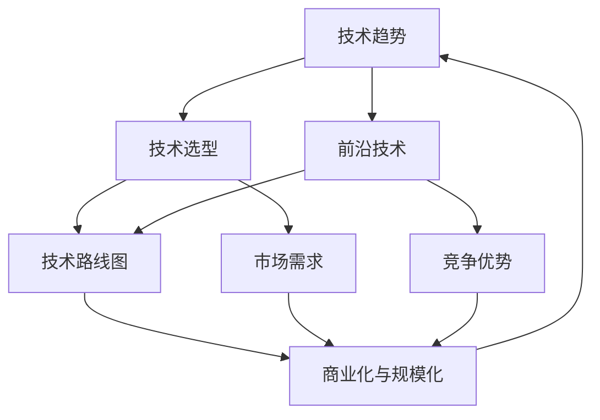

                 

### 背景介绍

随着全球信息化进程的不断推进，软件产品在各个行业中的应用越来越广泛，其重要性也越来越凸显。无论是互联网企业、制造业，还是金融、医疗等行业，软件产品已经成为企业核心竞争力的重要组成部分。因此，如何规划并实施软件产品技术路线图，紧跟前沿技术趋势，实现产品的商业化和规模化，成为众多企业和技术人员关注的焦点。

本文旨在为读者提供一套完整的规划与实施软件产品技术路线图的方案。首先，我们将介绍软件产品技术路线图的概念、重要性以及其与前沿技术趋势的关联。接着，我们将深入探讨如何进行技术选型，包括评估技术成熟度、市场需求和团队技术储备。然后，我们将讨论技术路线图的制定和实施，包括明确目标、分解任务、资源分配和时间规划。在后续章节中，我们将通过实际案例展示如何将前沿技术应用于软件产品开发，并探讨实际应用场景。此外，我们还将推荐一些学习资源和开发工具，以帮助读者更好地进行技术学习和项目开发。最后，我们将总结当前的发展趋势与挑战，并展望未来的发展方向。

通过本文的阅读，读者将能够全面了解软件产品技术路线图的制定与实施过程，从而更好地把握技术发展趋势，提升自身的技术能力和项目开发水平，助力企业实现商业化和规模化发展。

### 核心概念与联系

在规划软件产品技术路线图的过程中，我们需要明确几个核心概念，并理解它们之间的相互关系，以确保我们的规划具有系统性和可操作性。

#### 1. 技术趋势

技术趋势是指在一定时间内，信息技术领域中涌现出的新兴技术、发展方向和流行趋势。了解技术趋势有助于我们把握行业动态，从而做出科学的技术选型和路线规划。例如，近年来，人工智能、大数据、区块链和云计算等技术的发展迅速，已成为引领信息科技领域的重要力量。

#### 2. 技术选型

技术选型是指根据项目需求和技术趋势，从多个备选技术中筛选出最适合的技术方案。技术选型需要考虑多个因素，包括技术的成熟度、市场需求、团队的技术储备和项目的长期发展。一个良好的技术选型不仅能够提高项目的开发效率，还能确保项目的可持续性和可维护性。

#### 3. 技术路线图

技术路线图是一份详细描述项目技术发展路径和时间规划的文档。它通常包括技术目标、关键里程碑、资源分配和进度安排等要素。技术路线图的制定和实施对于确保项目按计划推进、降低技术风险、提高项目成功率至关重要。

#### 4. 前沿技术

前沿技术是指在特定领域内最新、最具创新性的技术。前沿技术往往具有变革性，能够推动行业的发展，并为产品带来独特的竞争优势。例如，人工智能在自然语言处理、计算机视觉和智能决策等领域取得了显著进展，已成为许多企业研发的重点。

#### 5. 商业化与规模化

商业化与规模化是指将技术成果转化为实际产品，并通过市场推广实现规模化的过程。商业化和规模化需要综合考虑市场需求、用户体验、商业模式和资源配置等多方面因素，以确保产品的市场竞争力。

#### 6. 联系与互动

这些核心概念之间存在着密切的联系和互动。技术趋势为技术选型提供了方向，技术选型决定了技术路线图的制定，而技术路线图的实施过程中，前沿技术的应用和商业化的实现则是相互促进的。具体来说，技术趋势引导技术选型，技术选型影响技术路线图的制定，技术路线图的实施过程又推动技术趋势的演进和商业化进程。同时，商业化与规模化的实现也为技术研究和开发提供了持续的动力和资源支持。

为了更直观地展示这些核心概念和它们之间的联系，我们可以使用Mermaid流程图（Mermaid flowchart）来表示：



通过这个流程图，我们可以清晰地看到技术趋势、技术选型、技术路线图、前沿技术、商业化与规模化以及市场需求和竞争优势之间的相互作用。这些核心概念共同构成了一个完整的技术发展生态系统，为我们的软件产品技术路线图提供了坚实的理论基础。

#### 2.1. 技术趋势分析

技术趋势分析是规划软件产品技术路线图的重要基础，它有助于我们把握行业发展方向，识别潜在的技术机会和挑战。以下是进行技术趋势分析的关键步骤：

##### 1. 数据收集与整理

首先，我们需要收集与行业相关的各种数据，包括市场研究报告、技术专利、学术论文、行业会议记录、技术博客和社交媒体上的讨论等。这些数据来源可以是专业的市场研究机构、技术社区、科技新闻网站以及企业内部的技术报告。收集数据后，需要对数据进行整理和分类，以便于后续的分析。

##### 2. 确定技术领域

在数据收集完毕后，我们需要确定重点分析的技术领域。这可以基于公司的业务方向、市场需求和现有的技术储备。例如，如果我们是一家专注于互联网应用的公司，那么我们可能需要重点关注人工智能、大数据、云计算等领域的趋势。

##### 3. 技术识别与分类

根据确定的技术领域，我们对收集到的数据进行筛选，识别出当前最热门、最具发展潜力的技术。这些技术可以分为以下几类：

- **基础技术**：如编程语言、数据库管理系统、开发工具等，这些技术是构建软件产品的基础。
- **前沿技术**：如人工智能、区块链、量子计算等，这些技术通常具有颠覆性的潜力。
- **应用技术**：如物联网、边缘计算、虚拟现实等，这些技术已经广泛应用于各个行业。
- **辅助技术**：如自动化测试、持续集成、云服务管理等，这些技术可以提升软件开发的效率和质量。

##### 4. 趋势预测与分析

在识别出关键技术后，我们需要对这些技术进行趋势预测和分析。这包括：

- **历史趋势分析**：通过分析过去几年的技术发展情况，了解技术成熟度和应用范围。
- **未来趋势预测**：基于现有数据和专家意见，预测技术未来的发展方向和潜在的应用场景。
- **竞争分析**：分析竞争对手的技术布局，了解他们在哪些技术领域具有优势，并识别潜在的竞争风险。

##### 5. 形成报告

最后，我们将分析结果整理成技术趋势分析报告，报告中应包含以下内容：

- **技术趋势概述**：对当前和未来技术趋势的总体描述。
- **重点技术分析**：对识别出的关键技术进行详细分析，包括技术特点、发展趋势、应用场景等。
- **挑战与机遇**：总结技术趋势带来的挑战和机遇，并提出相应的应对策略。
- **建议与结论**：根据分析结果，提出具体的技术选型和路线规划建议。

通过以上步骤，我们可以系统地分析技术趋势，为制定软件产品技术路线图提供有力支持。

#### 2.2. 技术评估

在完成技术趋势分析后，我们需要对识别出的关键技术进行详细评估，以确定哪些技术最适合我们的软件产品开发。技术评估是一个系统性的过程，涉及多个方面的因素。以下是技术评估的关键步骤：

##### 1. 技术成熟度评估

技术成熟度是评估技术是否适合应用的关键因素之一。我们可以通过以下标准来评估技术成熟度：

- **基础理论**：技术是否具备坚实的理论基础，是否经过学术界和工业界的广泛研究。
- **实际应用**：技术是否已经在实际项目中得到验证，是否有成功案例。
- **社区支持**：技术是否拥有活跃的社区和开发者群体，是否提供丰富的文档和资源。
- **标准与规范**：技术是否遵循行业标准和规范，是否具备兼容性和互操作性。

##### 2. 市场需求评估

市场需求是技术选型的另一个重要考虑因素。我们需要评估以下方面：

- **市场潜力**：技术是否具有广阔的市场前景，是否能够满足未来几年的市场需求。
- **用户需求**：技术是否符合目标用户的需求，是否能够提供良好的用户体验。
- **竞争分析**：技术是否在市场上具有竞争力，是否能够与竞争对手的产品相抗衡。

##### 3. 团队技术储备评估

团队技术储备是决定技术选型成功与否的关键。我们需要评估以下方面：

- **团队技能**：团队是否具备相关技术的开发经验和技能。
- **学习曲线**：团队是否能够在较短时间内掌握新技术。
- **持续支持**：团队是否能够持续投入技术研究和开发，确保技术的长期可持续性。

##### 4. 风险评估

在技术选型过程中，我们需要识别和评估潜在的技术风险：

- **技术风险**：技术是否可能存在不确定性和不可预测的问题，如性能瓶颈、安全性问题等。
- **市场风险**：市场需求是否可能发生变化，技术是否能够适应市场变化。
- **实施风险**：技术实施过程中可能遇到的困难，如资源不足、时间紧张等。

##### 5. 成本效益评估

成本效益是技术选型的重要考虑因素。我们需要评估以下方面：

- **直接成本**：技术选型和实施过程中所需的直接成本，如购买硬件、软件许可证等。
- **间接成本**：技术选型和实施过程中可能产生的间接成本，如人力成本、培训成本等。
- **效益分析**：技术选型和实施后可能带来的经济效益，如缩短开发周期、提高产品质量等。

##### 6. 形成评估报告

在完成上述评估后，我们将评估结果整理成技术评估报告。报告中应包含以下内容：

- **技术成熟度分析**：详细描述各技术的成熟度，包括理论基础、实际应用、社区支持和标准规范等方面。
- **市场需求分析**：分析各技术在市场上的潜力、用户需求和竞争情况。
- **团队技术储备分析**：评估团队在相关技术领域的技能、学习曲线和持续支持能力。
- **风险评估**：识别和评估各技术的技术风险、市场风险和实施风险。
- **成本效益分析**：计算各技术的直接成本、间接成本和潜在效益。

通过以上步骤，我们可以全面评估各项技术的优缺点，为技术选型提供科学依据。

#### 2.3. 技术选型策略

在进行技术评估后，我们需要根据评估结果制定具体的技术选型策略。技术选型策略的制定需要综合考虑技术成熟度、市场需求、团队技术储备和项目目标等多方面因素。以下是一些常见的技术选型策略：

##### 1. 引领策略

引领策略是指选择在特定领域内最前沿、最具创新性的技术。这种策略通常适用于那些希望引领市场潮流、具备强大技术储备和创新能力的公司。引领策略的优势在于可以带来显著的技术优势和市场竞争力，但同时也存在较高的技术风险和实施难度。因此，采用引领策略的公司需要具备强大的研发能力和资源支持。

##### 2. 跟随策略

跟随策略是指选择那些已经在市场上得到验证、应用广泛的技术。这种策略适用于那些风险承受能力较低、希望稳定发展的公司。跟随策略的优势在于技术成熟度高、风险较低，且市场应用案例丰富，可以借鉴的经验较多。但跟随策略的劣势在于技术竞争力可能较弱，难以在市场上占据领先地位。

##### 3. 合成策略

合成策略是将引领策略和跟随策略相结合，选择那些在特定领域内相对前沿、但已经相对成熟的技术。这种策略适用于那些希望在保持技术领先的同时，又希望降低技术风险和实施难度的公司。合成策略的优势在于可以兼顾技术先进性和稳定性，但需要在技术和市场之间找到平衡点。

##### 4. 定制策略

定制策略是根据具体项目需求和团队特点，选择最适合的技术方案。这种策略通常需要针对具体项目进行详细的技术评估和需求分析，以确保技术方案能够满足项目需求。定制策略的优势在于可以高度契合项目需求，提高项目成功率，但同时也需要投入较多的人力、物力和时间。

##### 5. 多元化策略

多元化策略是在项目中采用多种技术，以应对不同的需求和场景。这种策略适用于那些项目需求复杂、技术多样性要求较高的公司。多元化策略的优势在于可以提供灵活的技术方案，适应不同的市场需求，但同时也需要管理多种技术的兼容性和协作问题。

##### 6. 灵活调整策略

灵活调整策略是在项目开发过程中，根据实际情况和技术发展动态，灵活调整技术选型策略。这种策略适用于那些市场变化快、技术更新迅速的公司。灵活调整策略的优势在于可以快速响应市场和技术变化，保持项目的竞争力，但同时也需要具备较强的适应能力和风险管理能力。

通过以上技术选型策略，公司可以根据自身情况，选择最合适的技术方案，以实现项目的成功和可持续发展。

### 技术路线图的制定

技术路线图的制定是确保软件产品项目按计划推进、实现技术目标的重要手段。一个清晰、合理的技术路线图不仅能够指导团队在开发过程中的每一步，还能帮助识别和降低技术风险，提高项目的成功率。以下是制定技术路线图的关键步骤和要素。

#### 1. 明确项目目标

在制定技术路线图之前，首先要明确项目的总体目标。这些目标应该具体、可衡量，并且与企业的战略方向相一致。项目目标包括功能实现、性能指标、市场预期、时间期限等。例如，一个项目的目标可以是开发一款高效、安全的云计算平台，满足大规模数据处理需求，并在一年内推向市场。

#### 2. 确定技术阶段

根据项目目标，将项目分为若干个技术阶段。每个阶段应有明确的任务和目标，以便于团队分阶段进行工作。常见的项目阶段包括：

- **需求分析阶段**：明确用户需求，定义产品的功能和技术要求。
- **设计阶段**：制定系统架构和详细设计文档，包括软件架构、数据库设计、界面设计等。
- **开发阶段**：进行编码和单元测试，逐步实现产品功能。
- **集成测试阶段**：将各个模块集成在一起，进行系统测试和性能调优。
- **部署和维护阶段**：将产品部署到生产环境，进行用户培训和支持，持续优化和更新。

#### 3. 制定时间规划

为每个技术阶段制定具体的时间规划，确保项目能够按时完成。时间规划应考虑开发周期、测试周期、上线周期等。以下是一个基本的时间规划示例：

- **需求分析阶段**：1个月
- **设计阶段**：2个月
- **开发阶段**：4个月
- **集成测试阶段**：1个月
- **部署和维护阶段**：1个月

时间规划应预留一定的缓冲时间，以应对不可预见的问题和风险。

#### 4. 确定里程碑

里程碑是项目中的关键时间节点，标志着项目的一个重要进展。每个里程碑都应有一个具体的交付物和目标。例如：

- **里程碑1：需求分析完成**：完成需求文档，并获得客户确认。
- **里程碑2：设计完成**：完成系统架构和详细设计文档。
- **里程碑3：开发完成**：完成编码，并进行单元测试。
- **里程碑4：集成测试完成**：完成系统测试，确保产品功能完善。
- **里程碑5：产品上线**：产品正式上线，进入市场推广阶段。

#### 5. 资源分配

根据项目需求和技术阶段，合理分配人力资源、技术资源和其他资源。资源分配应考虑团队的技术能力、项目的重要性和资源的可用性。例如：

- **人力资源**：分配有经验的项目经理、设计师、开发人员和测试人员。
- **技术资源**：确保有足够的硬件设备、软件工具和技术支持。
- **其他资源**：如培训、文档编写、市场营销等。

#### 6. 风险管理

在制定技术路线图时，需要识别和评估项目中的潜在风险，并制定相应的风险管理策略。常见的风险包括技术风险、市场风险、人力资源风险等。以下是一些风险管理策略：

- **技术风险**：通过技术调研、技术验证和迭代开发来降低技术风险。
- **市场风险**：通过市场调研、竞争分析和用户反馈来降低市场风险。
- **人力资源风险**：通过合理的资源分配、培训和管理来降低人力资源风险。

#### 7. 形成文档

将以上步骤和决策形成正式的技术路线图文档，包括技术路线图的概述、详细阶段描述、时间规划、里程碑、资源分配和风险管理策略等。技术路线图文档应定期更新，以反映项目进展和变化。

#### 8. 实施与监控

在制定技术路线图后，需要将其落实到具体的实施过程中，并持续监控项目的进展。通过定期的项目会议、状态报告和进度审查，确保项目按照计划推进，并及时调整路线图以应对变化。

通过以上步骤，我们可以制定一个清晰、合理的技术路线图，为软件产品项目的成功提供有力保障。

#### 3.1. 明确目标与分解任务

在制定技术路线图的过程中，明确项目目标和分解任务至关重要。这一步骤不仅帮助我们理解项目的最终目标，还能够确保项目的每一步都有明确的任务和责任。

##### 1. 确定项目目标

项目目标应具体、可衡量，并与企业的战略方向相一致。以下是一些制定项目目标的关键要素：

- **功能目标**：明确软件产品的功能需求，例如，实现用户身份验证、数据处理、报表生成等功能。
- **性能目标**：设定软件产品的性能指标，例如，处理速度、响应时间、并发用户数等。
- **质量目标**：确保软件产品的质量标准，例如，代码可读性、可维护性、安全性等。
- **市场目标**：设定产品在市场上的预期表现，例如，市场份额、用户增长率等。

##### 2. 分解任务

将项目目标分解为具体的任务，是确保项目顺利进行的关键。以下是一种常用的任务分解方法：

- **主任务**：根据项目目标，将项目分解为几个主要任务，每个任务涵盖一个主要的功能模块或阶段。
- **子任务**：进一步将每个主任务分解为具体的子任务，明确每个子任务的目标和责任人。
- **交付物**：为每个任务定义明确的交付物，例如，设计文档、源代码、测试报告等。

以下是一个示例任务分解结构：

```markdown
### 项目目标

- 实现用户身份验证功能
- 提供数据报表生成服务
- 确保系统的高性能和高可靠性

### 主任务

1. **需求分析与设计**
   - 完成需求分析报告
   - 完成系统架构设计
   - 完成数据库设计

2. **编码与单元测试**
   - 编写用户身份验证模块
   - 编写数据报表生成模块
   - 进行单元测试

3. **集成测试与性能优化**
   - 完成系统集成测试
   - 进行性能调优
   - 提交性能测试报告

4. **部署与维护**
   - 系统部署
   - 用户培训
   - 持续维护

### 子任务

1. **需求分析与设计**
   - 用户需求调研
   - 功能需求分析
   - 系统架构设计
   - 数据库设计

2. **编码与单元测试**
   - 用户身份验证模块编码
   - 数据报表生成模块编码
   - 单元测试

3. **集成测试与性能优化**
   - 集成测试计划
   - 性能测试
   - 性能优化方案
   - 性能测试报告

4. **部署与维护**
   - 系统部署计划
   - 用户培训材料
   - 持续维护策略
```

通过明确项目目标和分解任务，我们可以确保项目团队对项目的整体目标和具体任务有清晰的认识，从而提高项目的执行效率和质量。

#### 3.2. 资源分配与时间规划

在明确了项目目标和分解了任务后，我们需要对资源进行合理分配，并制定详细的时间规划，以确保项目按计划推进。以下是如何进行资源分配和时间规划的详细步骤。

##### 1. 确定资源需求

首先，我们需要分析每个任务所需的资源，包括人力资源、技术资源和硬件资源等。

- **人力资源**：根据任务的复杂度和所需的技能，确定每个任务需要哪些职位的人才，例如项目经理、软件开发工程师、测试工程师等。需要考虑每个团队成员的工作负荷，确保他们有足够的时间和精力完成分配的任务。
  
- **技术资源**：确定项目所需的开发工具、编程语言、数据库管理系统、测试工具等。例如，如果项目需要使用人工智能技术，那么可能需要配备相关的人工智能开发框架和工具。

- **硬件资源**：根据项目的需求，确定所需的计算资源、存储资源和网络资源。例如，如果项目需要处理大量数据，可能需要配备高性能的服务器。

##### 2. 制定资源分配计划

在确定了资源需求后，我们需要制定资源分配计划，明确每个资源在项目中的使用时间和分配方式。

- **人力资源分配**：根据任务的时间和复杂度，将合适的人才分配到各个任务中。例如，对于关键任务，可以分配经验丰富的工程师，而对于辅助任务，可以分配实习生或新员工。

- **技术资源分配**：确保每个任务都有足够的工具和资源支持。例如，对于开发任务，可以提前配置好开发环境，并准备相关的技术文档和资源。

- **硬件资源分配**：根据项目的需求，合理分配硬件资源，确保项目能够顺利进行。例如，如果项目需要大量的计算资源，可以考虑使用云服务器进行弹性扩展。

##### 3. 制定时间规划

在资源分配计划完成后，我们需要制定详细的时间规划，确保每个任务都能在规定的时间内完成。

- **任务时间估算**：根据任务的复杂度和团队的技能水平，估算每个任务所需的时间。可以使用历史数据进行参考，或者通过专家评审来估计。

- **时间规划**：将所有任务的时间估算汇总，制定整个项目的时间规划。确保每个任务的时间安排合理，避免资源冲突。

以下是一个示例的时间规划表格：

| 任务名称 | 预计开始时间 | 预计结束时间 | 预计时长（天） |
| :------: | :----------: | :----------: | :------------: |
| 需求分析 | 2023-04-01 | 2023-04-15 | 15天 |
| 设计阶段 | 2023-04-16 | 2023-05-31 | 45天 |
| 编码与测试 | 2023-06-01 | 2023-10-31 | 120天 |
| 集成测试 | 2023-11-01 | 2023-12-15 | 45天 |
| 部署与维护 | 2023-12-16 | 2024-01-31 | 30天 |

##### 4. 调整和优化

在制定资源分配和时间规划后，需要根据实际情况进行调整和优化。以下是一些调整和优化的建议：

- **资源调配**：如果某个任务的资源需求增加或减少，需要及时调整其他任务的资源分配，确保项目整体资源利用最大化。

- **时间缓冲**：在时间规划中预留一定的缓冲时间，以应对不可预见的问题和风险。

- **进度监控**：定期监控项目进度，及时发现问题并进行调整。

通过合理的资源分配和时间规划，我们可以确保项目在预算和时间范围内完成，同时提高项目的执行效率和质量。

### 实施技术路线图

在完成技术路线图的制定后，下一步就是将其付诸实施。实施技术路线图是一个复杂的过程，需要团队紧密合作、有效沟通和持续监控。以下是如何有效实施技术路线图的关键步骤：

#### 1. 项目启动会议

项目启动会议是项目实施的第一步。在会议中，项目经理应向整个团队详细介绍技术路线图，明确项目目标、任务分解、资源分配和时间规划。同时，确保所有团队成员对项目目标和预期结果有清晰的认识。会议还应包括角色分配、职责说明和沟通机制，以确保项目顺利进行。

#### 2. 任务执行

在任务执行阶段，团队按照技术路线图中的计划逐步完成各项任务。每个任务都应有明确的责任人，并定期报告进度。以下是任务执行中的关键点：

- **持续沟通**：定期召开团队会议，检查任务进度，解决遇到的问题。确保信息透明，团队成员之间保持良好的沟通。
- **灵活调整**：在任务执行过程中，可能会出现一些不可预见的问题。团队需要灵活调整计划，确保项目按计划推进。
- **质量控制**：在每个任务完成后，进行质量检查，确保任务符合预期标准。质量控制可以包括代码审查、单元测试和系统测试等。

#### 3. 风险管理

在实施技术路线图的过程中，风险管理至关重要。以下是一些风险管理的关键点：

- **识别风险**：定期识别项目中的潜在风险，包括技术风险、市场风险和人力资源风险等。
- **评估风险**：对识别出的风险进行评估，确定其发生的可能性及影响程度。
- **制定应对策略**：为每个风险制定相应的应对策略，包括风险规避、风险转移和风险接受等。

#### 4. 持续监控与反馈

持续监控项目进展，是确保项目按计划实施的关键。以下是一些监控和反馈的关键点：

- **进度报告**：定期提交项目进度报告，包括任务完成情况、资源使用情况和风险状况等。
- **绩效评估**：对团队成员的绩效进行评估，确保项目目标的实现。
- **用户反馈**：收集用户反馈，了解产品在实际使用中的表现，并根据反馈进行调整。

#### 5. 项目审查与调整

在项目实施过程中，定期进行项目审查，以评估项目进展和质量。以下是一些审查和调整的关键点：

- **审查会议**：定期召开审查会议，检查项目进度和风险管理情况，讨论遇到的问题和解决方案。
- **调整计划**：根据审查结果，及时调整项目计划，确保项目能够按计划推进。

#### 6. 结束项目

在项目结束时，进行项目总结和评估。以下是一些结束项目的关键点：

- **总结会议**：召开总结会议，总结项目经验，讨论项目成功和失败的原因。
- **文档归档**：将项目文档、代码和测试报告等归档，以便未来参考。
- **项目报告**：撰写项目报告，记录项目过程和成果，提交给管理层。

通过以上步骤，团队可以有效地实施技术路线图，确保项目成功完成。

### 项目实战：代码实际案例和详细解释说明

为了更好地理解软件产品技术路线图的实施过程，我们通过一个具体的代码实现案例来展示如何将技术路线图中的技术方案转化为实际的软件产品。

#### 项目背景

本项目是一款基于云计算的智能数据分析平台，旨在帮助企业和组织从大量数据中提取有价值的信息。技术路线图已经明确，需要使用大数据处理技术、机器学习和云计算平台等前沿技术来实现。

#### 技术选型

在技术选型阶段，我们选择了以下技术：

- **大数据处理**：使用Apache Hadoop和Spark，这两个开源框架在处理大规模数据方面表现优异。
- **机器学习**：选择使用TensorFlow和Scikit-learn，这两个工具在机器学习领域应用广泛。
- **云计算平台**：选择AWS云服务，因为其提供了丰富的云服务和工具，便于开发和管理。

#### 代码实现

以下是该数据分析平台的代码实现的主要部分，包括数据收集、处理、分析和可视化。

#### 5.1 开发环境搭建

在开始编写代码之前，我们需要搭建开发环境。以下是开发环境的搭建步骤：

- **安装Java环境**：安装Java Development Kit（JDK）和配置环境变量。
- **安装Python环境**：安装Python和pip，用于安装Python依赖项。
- **安装Hadoop和Spark**：从官方网站下载Hadoop和Spark，并配置Hadoop和Spark的环境变量。
- **安装AWS CLI**：安装AWS CLI，以便于使用AWS服务。

#### 5.2 源代码详细实现和代码解读

以下是一个简单的Hadoop MapReduce程序，用于计算大数据集中单词的频率。

```java
import org.apache.hadoop.conf.Configuration;
import org.apache.hadoop.fs.Path;
import org.apache.hadoop.io.IntWritable;
import org.apache.hadoop.io.Text;
import org.apache.hadoop.mapreduce.Job;
import org.apache.hadoop.mapreduce.Mapper;
import org.apache.hadoop.mapreduce.Reducer;
import org.apache.hadoop.mapreduce.lib.input.FileInputFormat;
import org.apache.hadoop.mapreduce.lib.output.FileOutputFormat;

public class WordCount {

  public static class Map extends Mapper<Object, Text, Text, IntWritable>{

    private final static IntWritable one = new IntWritable(1);
    private Text word = new Text();

    public void map(Object key, Text value, Context context) throws IOException, InterruptedException {
      String[] words = value.toString().split("\\s+");
      for (String word : words) {
        this.word.set(word);
        context.write(word, one);
      }
    }
  }

  public static class Reduce extends Reducer<Text,IntWritable,Text,IntWritable> {
    private IntWritable result = new IntWritable();

    public void reduce(Text key, Iterable<IntWritable> values, Context context) throws IOException, InterruptedException {
      int sum = 0;
      for (IntWritable val : values) {
        sum += val.get();
      }
      result.set(sum);
      context.write(key, result);
    }
  }

  public static void main(String[] args) throws Exception {
    Configuration conf = new Configuration();
    Job job = Job.getInstance(conf, "word count");
    job.setMapperClass(Map.class);
    job.setCombinerClass(Reduce.class);
    job.setReducerClass(Reduce.class);
    job.setOutputKeyClass(Text.class);
    job.setOutputValueClass(IntWritable.class);
    FileInputFormat.addInputPath(job, new Path(args[0]));
    FileOutputFormat.setOutputPath(job, new Path(args[1]));
    System.exit(job.waitForCompletion(true) ? 0 : 1);
  }
}
```

#### 代码解读

- **Map类**：`Map` 类实现了 `Mapper` 接口，用于处理输入数据。在 `map` 方法中，我们将输入的文本分割成单词，并为每个单词生成一个 `(单词, 1)` 的键值对。
- **Reduce类**：`Reduce` 类实现了 `Reducer` 接口，用于汇总每个单词的计数值。在 `reduce` 方法中，我们将所有 `(单词, 1)` 的计数值汇总，得到最终的单词频率。
- **main方法**：`main` 方法用于设置作业配置，包括指定Mapper和Reducer类、输出键值对类型等。

#### 5.3 代码解读与分析

以下是对代码的进一步解读和分析：

1. **输入和输出格式**：
   - **输入格式**：输入是一个文本文件，每行包含多个单词，单词之间用空格分隔。
   - **输出格式**：输出是一个文本文件，每行包含一个单词和该单词的频率，用制表符分隔。

2. **处理流程**：
   - **数据读取**：使用Hadoop的 `FileInputFormat` 读取输入数据。
   - **单词分割**：在 `map` 方法中，使用 `split` 方法将输入文本分割成单词。
   - **单词计数**：为每个单词生成一个 `(单词, 1)` 的键值对，表示每个单词的出现次数。
   - **单词汇总**：在 `reduce` 方法中，汇总每个单词的出现次数，得到最终的单词频率。

3. **性能优化**：
   - **本地模式**：在开发阶段，可以使用本地模式进行调试，使用 `LocalRunner` 类代替 `Job` 类。
   - **数据压缩**：在输出数据时，可以启用数据压缩，以减少磁盘I/O和网络传输的开销。

4. **可扩展性**：
   - **分布式计算**：Hadoop允许将任务分布在多个节点上进行并行处理，提高处理效率。
   - **动态资源分配**：Hadoop可以动态调整资源分配，以应对不同的工作负载。

#### 5.4 案例分析与改进

以下是对实际案例的分析和改进建议：

- **代码重构**：可以将代码拆分为多个Mapper和Reducer，以便于处理更复杂的任务。
- **并行处理**：使用Spark代替Hadoop，利用其高效的分布式计算能力。
- **机器学习**：集成机器学习算法，如文本分类、聚类等，以实现更高级的数据分析功能。
- **数据可视化**：使用可视化工具，如D3.js或Tableau，将分析结果直观地展示给用户。

通过上述案例，我们可以看到如何将技术路线图中的技术方案具体应用到软件产品的开发过程中。在实际项目中，我们需要根据具体需求和实际情况，灵活调整和优化技术方案，以实现项目的成功。

### 实际应用场景

在技术路线图的实施过程中，将前沿技术应用于实际场景是关键的一步。以下是一些常见的实际应用场景，通过这些场景，我们可以更好地理解技术路线图在实际项目中的应用。

#### 1. 智能医疗

智能医疗是前沿技术在医疗领域的重要应用之一。通过人工智能和大数据技术，可以为医生提供辅助诊断和治疗方案建议。以下是一个实际应用场景：

- **应用场景**：在诊断乳腺癌时，可以使用深度学习算法对医学影像进行分析，帮助医生快速识别潜在的肿瘤区域。
- **技术路线图实施**：首先，收集和整理大量的医学影像数据，并进行数据预处理。然后，使用卷积神经网络（CNN）对这些数据进行训练，构建一个图像识别模型。在模型训练完成后，将其部署到生产环境中，实时分析医生上传的医学影像。

#### 2. 自动驾驶

自动驾驶是人工智能和计算机视觉技术的集大成者。以下是一个实际应用场景：

- **应用场景**：在自动驾驶汽车中，需要实时处理来自摄像头、雷达和激光雷达的传感器数据，确保车辆的安全驾驶。
- **技术路线图实施**：首先，设计一个多传感器数据融合系统，整合摄像头、雷达和激光雷达的数据。然后，使用深度学习算法对传感器数据进行处理，构建路径规划、障碍物检测和避障系统。在模型训练和测试完成后，将其部署到车辆中，实现自动驾驶功能。

#### 3. 金融风控

金融风控是大数据和区块链技术的典型应用场景。以下是一个实际应用场景：

- **应用场景**：在金融领域，需要实时监控交易数据，识别潜在的欺诈行为，确保金融交易的安全。
- **技术路线图实施**：首先，收集和整理交易数据，并进行数据预处理和特征提取。然后，使用机器学习算法构建欺诈检测模型，并在生产环境中进行实时监控。同时，利用区块链技术记录所有交易数据，确保数据的不可篡改性和透明性。

#### 4. 物联网

物联网（IoT）技术广泛应用于智能家居、工业自动化和智能城市等领域。以下是一个实际应用场景：

- **应用场景**：在智能家居中，需要将各种智能设备（如智能灯泡、智能电视、智能安防系统）连接起来，实现智能控制和管理。
- **技术路线图实施**：首先，设计一个物联网平台，整合各类智能设备的通信协议和数据格式。然后，使用边缘计算技术，在设备本地处理数据，减少数据传输的开销。最后，通过云计算平台，实现数据的集中管理和分析，提供智能化的用户界面。

#### 5. 供应链管理

供应链管理是大数据和区块链技术在物流和供应链领域的重要应用。以下是一个实际应用场景：

- **应用场景**：在供应链管理中，需要实时追踪货物的运输状态，确保供应链的高效运作。
- **技术路线图实施**：首先，使用传感器和RFID技术，收集货物的位置和状态信息。然后，使用大数据分析技术，对收集的数据进行分析和处理，优化运输路径和库存管理。最后，利用区块链技术记录所有交易和物流信息，确保信息的透明性和可追溯性。

通过上述实际应用场景，我们可以看到前沿技术在各个行业中的应用前景。在实施技术路线图时，需要根据具体应用场景的需求，灵活选择和组合技术，以实现最佳的效果。

### 工具和资源推荐

为了更好地进行软件产品开发和技术路线图的实施，我们需要借助一系列专业的工具和资源。以下是一些推荐的学习资源、开发工具和相关论文著作，它们将为我们的技术学习和项目开发提供有力支持。

#### 7.1 学习资源推荐

1. **书籍**：

- 《深度学习》（Deep Learning），作者：Ian Goodfellow、Yoshua Bengio、Aaron Courville。
- 《大数据之路：阿里巴巴大数据实践》（Big Data Roadmap），作者：李津、徐义君。
- 《区块链技术指南》（Blockchain: Guide for the Perplexed），作者：Anton D. Kostyukovich。
- 《云计算实践：架构、技术和应用》（Cloud Computing: Theory and Practice），作者：宋文燕、王宏宇。

2. **在线课程**：

- Coursera上的“机器学习”（Machine Learning）课程，由Andrew Ng教授主讲。
- Udacity的“数据科学纳米学位”（Data Science Nanodegree）课程。
- edX上的“区块链技术与应用”（Blockchain Technology and Applications）课程。

3. **博客和网站**：

- Medium上的技术博客，包括“Towards Data Science”、“AI”等，提供最新的技术趋势和实战经验。
- Stack Overflow，一个面向开发者的问答社区，可以解决编程中的各种问题。
- AWS官网（aws.amazon.com），提供丰富的云计算教程和文档。

#### 7.2 开发工具框架推荐

1. **编程语言和开发环境**：

- Python：广泛应用于数据科学、机器学习和Web开发，拥有丰富的库和框架。
- Java：强大的跨平台编程语言，适用于企业级应用开发。
- JavaScript：前端开发的主要语言，与Node.js配合使用，可构建全栈应用。

2. **开发框架和工具**：

- Spring Boot：Java开发的微服务框架，简化了企业级应用的构建过程。
- Flask和Django：Python的Web开发框架，适用于快速开发Web应用。
- React和Vue.js：前端开发的主流框架，提供了丰富的组件和功能。

3. **大数据处理和机器学习工具**：

- Apache Hadoop和Spark：分布式数据处理框架，适用于大规模数据分析和处理。
- TensorFlow和PyTorch：流行的深度学习框架，提供了丰富的算法和工具。
- ELK Stack（Elasticsearch、Logstash、Kibana）：用于日志分析和大数据处理的工具集。

4. **云服务和平台**：

- AWS：提供了广泛的云服务，包括计算、存储、数据库、机器学习和人工智能等。
- Azure：微软的云计算平台，提供了丰富的开发工具和云服务。
- Google Cloud：提供了强大的云计算基础设施和AI服务。

#### 7.3 相关论文著作推荐

1. **经典论文**：

- “Google File System”（GFS），作者：Sanjay Ghemawat、Shun-Tak Leung、Frank Mackenzie、Jeffrey O’Neil。
- “MapReduce: Simplified Data Processing on Large Clusters”，作者：Jeffrey Dean、Sanjay Ghemawat。
- “Deep Learning”，作者：Ian Goodfellow、Yoshua Bengio、Aaron Courville。

2. **最新研究论文**：

- “Advancing AI Research with Open Source”，作者：Michael J. Franklin、Hui Xiong。
- “On the Practical Value of Convolutional Networks for Visual Document Analysis”，作者：Mario Szegedy、Alex Toshev。
- “Distributed Storage System: Design and Implementation of AWS S3”，作者：Eric Leonhard、James Hamilton。

通过这些学习资源、开发工具和相关论文著作的推荐，我们可以更好地掌握前沿技术，提升自身的项目开发能力和技术水平。同时，这些资源和工具也将为软件产品技术路线图的实施提供有力支持，助力我们实现产品的商业化和规模化。

### 总结：未来发展趋势与挑战

随着信息技术的飞速发展，软件产品技术路线图在未来的发展前景广阔，同时也面临诸多挑战。以下是未来技术发展趋势和主要挑战的总结。

#### 发展趋势

1. **智能化与自动化**：人工智能、机器学习和自动化技术的进一步发展，将推动软件产品的智能化和自动化。未来软件产品将具备更强的自主学习能力和自适应能力，实现更加精准和高效的服务。

2. **云计算与边缘计算**：云计算的普及和边缘计算的兴起，将使得数据处理和分析更加高效。通过云计算，企业可以轻松实现大规模数据处理和分布式计算，而边缘计算则可以降低数据传输延迟，提高应用性能。

3. **数据驱动的开发**：大数据和数据分析技术将深度融入软件开发过程，使得产品开发更加数据驱动。通过实时数据分析和反馈，开发人员可以不断优化产品功能和服务质量。

4. **区块链技术的应用**：区块链技术将在供应链管理、金融风控等领域得到更广泛的应用，提供透明、安全的交易和数据存储解决方案。

5. **物联网与智能家居**：物联网（IoT）和智能家居技术的快速发展，将推动软件产品在家庭、工业和城市等领域的应用。通过物联网，软件产品可以连接和管理各种智能设备，实现智能化的生活和工作环境。

#### 挑战

1. **技术更新速度**：技术的快速发展带来了新的机遇，但同时也增加了技术选型和实施的压力。企业需要不断跟踪技术趋势，快速适应新技术，以确保竞争力。

2. **数据隐私与安全**：随着数据规模的扩大和数据类型的增多，数据隐私和安全问题愈发重要。如何在保障用户隐私的同时，有效利用数据，成为一大挑战。

3. **团队技能与人才**：前沿技术的应用需要具备高水平技能的团队支持。企业需要持续投入培训和招聘，吸引和留住高素质人才。

4. **跨行业融合**：不同行业的软件产品融合，将带来新的商业模式和市场需求，但同时也需要解决跨行业技术兼容性和标准统一的问题。

5. **可持续发展**：在追求技术创新的同时，企业需要关注环境保护和资源利用，实现可持续发展。如何在技术进步和环境保护之间找到平衡，是未来的一大挑战。

综上所述，未来软件产品技术路线图的发展前景广阔，但同时也面临诸多挑战。企业需要紧跟技术趋势，灵活应对市场变化，同时注重团队建设和可持续发展，才能在激烈的市场竞争中脱颖而出。

### 附录：常见问题与解答

在制定和实施软件产品技术路线图的过程中，可能会遇到一系列问题。以下是一些常见问题的解答，帮助读者更好地理解和应对这些问题。

#### 1. 如何确保技术路线图的可行性？

**回答**：确保技术路线图的可行性需要从以下几个方面入手：

- **全面调研**：在制定技术路线图之前，进行全面的技术调研和市场分析，了解当前的技术趋势和市场需求。
- **专家评审**：邀请行业专家和内部技术人员对技术路线图进行评审，确保方案的可行性和合理性。
- **小规模试点**：在全面实施前，可以先进行小规模试点，验证技术方案的有效性和可行性。

#### 2. 如何应对技术风险？

**回答**：应对技术风险可以从以下几个方面进行：

- **风险评估**：在制定技术路线图时，进行详细的风险评估，识别可能的技术风险。
- **多元化技术方案**：在技术选型时，可以考虑多种技术方案，避免过度依赖单一技术。
- **持续学习和更新**：保持对新兴技术的持续学习和关注，及时调整技术路线图，以应对技术变化。

#### 3. 如何管理团队技能和人才？

**回答**：

- **培训与学习**：定期组织技术培训和研讨会，提高团队成员的技术能力。
- **人才激励机制**：建立合理的激励机制，鼓励团队成员学习和创新。
- **人才流动和储备**：建立人才流动机制，确保团队中拥有多样化的技术能力和知识储备。

#### 4. 如何进行项目进度监控和调整？

**回答**：

- **定期会议**：定期召开项目会议，检查项目进度，讨论遇到的问题和解决方案。
- **进度报告**：定期提交项目进度报告，确保项目按计划推进。
- **灵活调整**：根据实际情况，及时调整项目计划，确保项目能够应对变化和挑战。

#### 5. 如何确保数据安全和隐私？

**回答**：

- **数据加密**：对敏感数据进行加密处理，确保数据在传输和存储过程中的安全性。
- **安全策略**：制定严格的数据安全策略和隐私保护政策，确保数据安全和用户隐私。
- **安全审计**：定期进行安全审计，检查系统漏洞和安全隐患，及时进行修复。

通过以上解答，我们可以更好地理解和应对在制定和实施软件产品技术路线图过程中遇到的各种问题，确保项目能够顺利推进并取得成功。

### 扩展阅读与参考资料

为了帮助读者深入了解软件产品技术路线图的制定与实施，本文特别推荐以下扩展阅读和参考资料。这些资源涵盖了从基础概念到实际应用的广泛内容，适合不同层次的技术人员和管理者。

#### 1. 书籍推荐

- **《软件工程：实践者的研究方法》**（作者：Roger S. Pressman）：详细介绍了软件工程的基本概念和方法，对初学者和从业者都有很大帮助。
- **《大数据之路：阿里巴巴大数据实践》**（作者：李津、徐义君）：分享了阿里巴巴在大数据领域的成功实践，对大数据技术路线图的制定有重要参考价值。
- **《深度学习》**（作者：Ian Goodfellow、Yoshua Bengio、Aaron Courville）：深入讲解了深度学习的理论基础和实践方法，适合对人工智能感兴趣的读者。
- **《区块链技术指南》**（作者：Anton D. Kostyukovich）：全面介绍了区块链的基本原理和技术应用，是了解区块链技术路线图的重要参考书。

#### 2. 论文和报告

- **“MapReduce: Simplified Data Processing on Large Clusters”**（作者：Jeffrey Dean、Sanjay Ghemawat）：该论文是云计算和大数据处理的经典之作，对理解分布式计算架构有重要意义。
- **“Google File System”**（作者：Sanjay Ghemawat、Shun-Tak Leung、Frank Mackenzie、Jeffrey O’Neil）：介绍了GFS的设计和实现，是了解分布式存储系统的重要论文。
- **《阿里巴巴技术报告：深度学习在搜索推荐中的应用》**：该报告详细介绍了阿里巴巴如何将深度学习应用于搜索推荐系统，是深度学习在商业领域应用的重要案例。

#### 3. 在线课程和教程

- **Coursera上的“机器学习”课程**（由Andrew Ng教授主讲）：这是一门深受好评的在线课程，适合初学者和进阶者。
- **Udacity的“数据科学纳米学位”课程**：该课程涵盖了数据科学的多个领域，包括数据分析、机器学习等，适合希望全面了解数据科学技术的读者。
- **edX上的“区块链技术与应用”课程**：该课程讲解了区块链的基本原理和应用场景，适合对区块链技术感兴趣的读者。

#### 4. 博客和网站

- **Medium上的技术博客**：包括“Towards Data Science”、“AI”等，提供了丰富的技术文章和实战经验。
- **Stack Overflow**：一个面向开发者的问答社区，可以解决编程中的各种问题。
- **AWS官网（aws.amazon.com）**：提供了大量的云计算教程和文档，是学习云计算技术的优秀资源。

通过阅读以上推荐书籍、论文、在线课程和教程，读者可以进一步加深对软件产品技术路线图的了解，并在实际项目中应用所学知识，提升自身的技术能力和项目管理水平。

