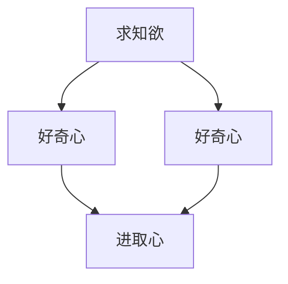

                 

### 文章标题

**怎样培养强烈的求知欲、好奇心和进取心**

### 关键词

- 求知欲
- 好奇心
- 进取心
- 技术成长
- 学习方法
- 时间管理
- 心理因素
- 成功经验

### 摘要

本文旨在探讨如何通过科学的方法培养个人的求知欲、好奇心和进取心，从而实现个人在技术领域的持续成长。文章首先介绍了求知欲、好奇心和进取心的定义及其重要性，随后分析了影响这些特质培养的心理学因素。接着，文章提出了具体的学习方法、时间管理技巧以及如何通过实战和反思来提升个人的技术能力。最后，文章总结了培养求知欲、好奇心和进取心的关键点，并展望了未来在技术领域中可能面临的挑战和发展趋势。

## 1. 背景介绍

在当今信息爆炸的时代，技术的迅速发展使得知识的更新速度前所未有。作为一名技术从业者，持续学习和成长变得尤为重要。然而，现实中的许多人却面临着学习动力不足、缺乏好奇心和进取心的问题。这些问题不仅阻碍了个人技能的提升，还可能影响职业生涯的发展。因此，本文旨在探讨如何通过培养求知欲、好奇心和进取心来克服这些问题，实现个人在技术领域的持续成长。

求知欲是指个体对于知识的渴望和追求，好奇心则是对于未知事物和现象的探索欲望，进取心则是驱动个体不断前进和克服困难的内在动力。这三个特质相辅相成，共同构成了个体在技术学习中的核心动力系统。本文将围绕这三个特质，提供一系列实用方法和策略，帮助读者找到学习的动力源泉，激发内在潜能，实现技术水平的全面提升。

## 2. 核心概念与联系

在深入探讨如何培养求知欲、好奇心和进取心之前，我们需要理解这些特质的基本概念及其相互关系。

### 2.1 求知欲

求知欲（Curiosity），是一种内在驱动力，促使个体探索未知、追求知识。它不仅激发了学习的兴趣，还培养了发现问题和解决问题的能力。求知欲可以看作是一种“知识饥饿”，是对知识的好奇和渴望。

### 2.2 好奇心

好奇心（Inquisitiveness）是求知欲的具体表现，它驱使个体去探索新事物、尝试新方法。好奇心是人类与生俱来的特质，但需要通过后天的培养和激发来发挥其潜力。好奇心强的人往往能够在技术领域中更快地适应和成长。

### 2.3 进取心

进取心（Aspiration）是指个体为了实现目标而不断努力和进取的精神。它不仅包括对未来的期待，还包含了克服困难和挑战的勇气。进取心是求知欲和好奇心转化为实际行动的关键动力。

### 2.4 三者关系

求知欲、好奇心和进取心之间存在着紧密的联系。求知欲是好奇心和进取心的基础，好奇心是求知欲的具体表现，而进取心则是求知欲和好奇心转化为实际行动的推动力。一个拥有强烈求知欲的人，会自然地表现出好奇心，并在此基础上不断进取。

下面是这三个核心概念的 Mermaid 流程图：



通过这个流程图，我们可以清晰地看到求知欲、好奇心和进取心之间的互动关系。

### 2.5 总结

综上所述，求知欲、好奇心和进取心是技术学习者不可或缺的三大核心特质。它们不仅能够激发学习的兴趣和动力，还能够帮助个体在复杂的技术领域中快速适应和成长。在接下来的章节中，我们将进一步探讨如何具体培养这些特质，并提供实用的方法和策略。

## 3. 核心算法原理 & 具体操作步骤

在了解了求知欲、好奇心和进取心这三个核心概念之后，我们需要探讨如何将这些概念转化为具体的操作步骤，以实现个人在技术领域的成长。

### 3.1 培养求知欲

培养求知欲的第一步是建立明确的目标和兴趣点。以下是具体操作步骤：

#### 3.1.1 确定学习目标

首先，需要明确自己的学习目标。这些目标可以是具体的技能点，也可以是项目实践经验。例如，如果你想成为一名数据科学家，你可以设定目标学习Python编程、机器学习算法等。

#### 3.1.2 建立知识体系

建立一个完整的知识体系可以帮助你更好地理解各个技能点之间的关系。这可以通过阅读相关书籍、参加在线课程和加入技术社区来实现。

#### 3.1.3 持续学习与实践

求知欲的培养离不开持续的学习和实践。以下是一些具体的方法：

- **定期阅读**：每天安排一定时间阅读技术书籍、论文和博客。
- **实践项目**：通过实际项目来应用所学的知识，例如参与开源项目或自己开发小项目。
- **交流分享**：参加技术讲座、研讨会，与同行交流分享学习心得。

### 3.2 激发好奇心

好奇心是求知欲的具体表现，可以通过以下步骤来激发：

#### 3.2.1 探索新领域

尝试接触和学习新的技术领域，例如AI、区块链、量子计算等。这可以帮助你扩展知识面，并激发对未知领域的探索欲望。

#### 3.2.2 提出问题

在学习过程中，不断提出问题可以帮助你保持好奇心。这些问题可以是关于现有知识的，也可以是关于新技术领域的。

#### 3.2.3 深入研究

对于感兴趣的问题，进行深入的研究和探索。这可以通过查阅相关文献、参加研讨会和与专家交流来实现。

### 3.3 增强进取心

进取心是驱动个体不断前进和克服困难的关键动力，可以通过以下步骤来增强：

#### 3.3.1 设定长期目标

设定一个明确的长期目标，例如成为一名高级工程师或技术领导者。这个目标将为你提供持续前进的动力。

#### 3.3.2 制定计划

为实现长期目标，制定详细的计划和时间表。例如，每天学习2小时，每周完成一个小项目等。

#### 3.3.3 克服挫折

在实现目标的过程中，难免会遇到挫折和困难。要培养克服挫折的能力，例如通过反思、调整计划和寻求帮助。

### 3.4 总结

通过以上具体的操作步骤，我们可以逐步培养求知欲、好奇心和进取心，从而实现个人在技术领域的持续成长。这些步骤不仅适用于初学者，也适用于希望进一步提升自己技能的资深从业者。

## 4. 数学模型和公式 & 详细讲解 & 举例说明

在探讨如何培养求知欲、好奇心和进取心的过程中，我们引入了一些心理学模型和理论。为了更好地理解这些概念，我们将使用数学模型和公式来详细讲解。

### 4.1 知识积累模型

知识积累模型（Knowledge Accumulation Model）描述了个体知识量的增长过程。该模型假设知识积累是连续的，并且受到学习频率、学习效果和遗忘率等因素的影响。

数学模型如下：

$$
K(t) = K_0 + \int_{0}^{t} [f(t) - \lambda K(t)] dt
$$

其中：
- \( K(t) \) 是时间 \( t \) 时的知识量。
- \( K_0 \) 是初始知识量。
- \( f(t) \) 是学习频率函数，表示个体在时间 \( t \) 的学习强度。
- \( \lambda \) 是遗忘率，表示个体在时间 \( t \) 的遗忘速度。

#### 详细讲解

1. **学习频率函数 \( f(t) \)**：学习频率函数描述了个体在不同时间的学习强度。例如，可以假设 \( f(t) \) 是一个随时间递增的函数，表示随着时间的推移，个体的学习强度逐渐增强。

2. **遗忘率 \( \lambda \)**：遗忘率反映了个体对知识的遗忘速度。根据艾宾浩斯遗忘曲线（Ebbinghaus Forgetting Curve），遗忘率通常是一个随时间递减的函数。

3. **积分运算**：积分运算表示从初始时刻到时间 \( t \) 的累计知识量。

#### 举例说明

假设一个人在初始时刻 \( K_0 = 100 \) 个知识点，学习频率函数 \( f(t) = 2 + 0.05t \)（表示每天学习2个新知识点，并且每天的学习强度增加0.05个知识点），遗忘率 \( \lambda = 0.1 \)（表示每天遗忘10%的知识点）。我们可以计算在第30天时的知识量 \( K(30) \)：

$$
K(30) = 100 + \int_{0}^{30} [2 + 0.05t - 0.1 \cdot 100] dt
$$

计算结果：

$$
K(30) = 100 + \left[ 2t + \frac{0.05t^2}{2} - 10t \right]_{0}^{30}
$$

$$
K(30) = 100 + \left[ 2 \cdot 30 + \frac{0.05 \cdot 30^2}{2} - 10 \cdot 30 \right]
$$

$$
K(30) = 100 + \left[ 60 + 22.5 - 300 \right]
$$

$$
K(30) = 100 + (-217.5)
$$

$$
K(30) = -117.5
$$

这个结果显然是不合理的，因为它表示在第30天时知识量为负数。这表明我们在设定参数时可能存在不合理之处。在实际应用中，我们需要调整学习频率函数和遗忘率，以确保知识量的积累是正值。

### 4.2 好奇心驱动模型

好奇心驱动模型（Curiosity-Driven Model）描述了好奇心如何影响个体的学习过程。该模型假设好奇心是一种内在驱动力，它直接影响学习频率和知识吸收效率。

数学模型如下：

$$
f(t) = f_0 + \alpha \cdot C(t)
$$

其中：
- \( f(t) \) 是时间 \( t \) 的学习频率。
- \( f_0 \) 是初始学习频率。
- \( \alpha \) 是好奇心系数，表示好奇心对学习频率的影响程度。
- \( C(t) \) 是时间 \( t \) 的好奇心水平。

#### 详细讲解

1. **好奇心系数 \( \alpha \)**：好奇心系数决定了好奇心对学习频率的影响程度。当 \( \alpha \) 较大时，好奇心对学习频率的影响也较大。

2. **好奇心水平 \( C(t) \)**：好奇心水平反映了个体在不同时间的好奇心强度。通常，好奇心水平与未知信息量成正比。

3. **线性函数**：学习频率函数 \( f(t) \) 是关于时间 \( t \) 的线性函数，这表示好奇心对学习频率的影响是线性的。

#### 举例说明

假设一个人的初始学习频率 \( f_0 = 1 \) 个小时，好奇心系数 \( \alpha = 0.1 \)，在第10天时的好奇心水平 \( C(10) = 5 \)。我们可以计算第10天的学习频率 \( f(10) \)：

$$
f(10) = 1 + 0.1 \cdot 5
$$

$$
f(10) = 1 + 0.5
$$

$$
f(10) = 1.5
$$

这表示在第10天时，学习频率为1.5个小时。这意味着好奇心使得学习频率增加了0.5个小时。

### 4.3 总结

通过数学模型和公式，我们可以更深入地理解求知欲、好奇心和进取心的培养过程。这些模型不仅提供了理论支持，还帮助我们通过量化方式来评估和优化学习过程。在实际应用中，我们需要根据具体情况调整模型参数，以确保模型的适用性和有效性。

## 5. 项目实战：代码实际案例和详细解释说明

为了更好地理解如何培养求知欲、好奇心和进取心，我们将通过一个实际的代码项目来进行实战演示。在这个项目中，我们将实现一个简单的机器学习算法——K-近邻（K-Nearest Neighbors，KNN），并详细解释其代码实现和关键步骤。

### 5.1 开发环境搭建

在开始项目之前，我们需要搭建一个合适的环境。以下是具体的步骤：

1. **安装Python环境**：确保你的计算机上安装了Python，版本建议为3.8或更高。
2. **安装依赖库**：使用pip工具安装必要的库，如NumPy、Pandas和scikit-learn。命令如下：

   ```bash
   pip install numpy pandas scikit-learn
   ```

### 5.2 源代码详细实现和代码解读

以下是K-近邻算法的实现代码：

```python
import numpy as np
from sklearn.model_selection import train_test_split
from sklearn.neighbors import KNeighborsClassifier
from sklearn.metrics import accuracy_score
from sklearn.datasets import load_iris

# 加载鸢尾花数据集
iris = load_iris()
X = iris.data
y = iris.target

# 划分训练集和测试集
X_train, X_test, y_train, y_test = train_test_split(X, y, test_size=0.3, random_state=42)

# 创建KNN分类器，并设置k值为3
knn = KNeighborsClassifier(n_neighbors=3)
knn.fit(X_train, y_train)

# 使用测试集进行预测
predictions = knn.predict(X_test)

# 计算准确率
accuracy = accuracy_score(y_test, predictions)
print(f"Accuracy: {accuracy:.2f}")
```

#### 代码解读

1. **导入库**：首先，我们导入必要的库，包括NumPy、Pandas、scikit-learn等。

2. **加载数据集**：使用scikit-learn的`load_iris`函数加载数据集。鸢尾花数据集是一个常用的机器学习数据集，包含三种鸢尾花的特征和类别标签。

3. **划分数据集**：使用`train_test_split`函数将数据集划分为训练集和测试集。这里我们设置了测试集的大小为30%，随机种子为42，以确保结果的可重复性。

4. **创建KNN分类器**：使用`KNeighborsClassifier`创建KNN分类器，并设置`n_neighbors`参数为3。这意味着我们将选择距离测试样本最近的3个邻居进行投票。

5. **训练模型**：使用`fit`方法对KNN分类器进行训练，输入训练集的特征和标签。

6. **预测和评估**：使用`predict`方法对测试集进行预测，并使用`accuracy_score`函数计算准确率。

### 5.3 代码解读与分析

#### 数据预处理

在代码的第一部分，我们加载数据集并划分训练集和测试集。数据预处理是机器学习项目的关键步骤，确保数据的质量和一致性。这里我们使用的是鸢尾花数据集，它已经非常干净和格式化，但实际项目中可能会遇到更复杂的数据预处理任务。

#### KNN算法实现

KNN算法的核心在于计算测试样本与训练样本之间的距离，并选择距离最近的K个邻居进行投票。这里我们使用了scikit-learn中的KNN分类器，这使得实现过程更加简单和高效。`KNeighborsClassifier`类提供了丰富的参数，如`n_neighbors`（邻居数量）、`weights`（邻居权重）等，这些参数可以根据具体需求进行调整。

#### 模型评估

在代码的最后部分，我们使用`accuracy_score`函数来评估模型的准确率。准确率是评估分类模型性能的常用指标，表示正确预测的样本数占总样本数的比例。在实际项目中，我们可能还需要使用其他评估指标，如召回率、F1分数等，以全面评估模型的性能。

### 5.4 总结

通过这个实际项目，我们不仅了解了K-近邻算法的基本原理和实现方法，还掌握了如何使用Python和scikit-learn库进行数据预处理和模型训练。这个项目实战有助于我们理解求知欲、好奇心和进取心在实际应用中的体现，通过动手实践，我们可以更好地培养这些重要的学习特质。

## 6. 实际应用场景

求知欲、好奇心和进取心不仅在技术学习和个人成长中起到关键作用，还可以在具体的技术应用场景中发挥重要作用。以下是几个常见的技术应用场景，以及如何利用这三个特质来解决问题和推动项目进展。

### 6.1 开发大型软件项目

在开发大型软件项目时，团队需要具备强烈的求知欲来不断学习和适应新的技术趋势。好奇心可以激发团队成员探索新的开发工具和方法，从而提高开发效率和代码质量。进取心则能够推动团队在面对困难和挑战时保持积极态度，共同克服难题。例如，在一个跨国软件项目中，团队可能会遇到语言和文化差异，通过求知欲和好奇心，团队成员可以主动学习并适应不同的工作方式和习惯，通过进取心，他们能够团结一致，共同推动项目顺利进行。

### 6.2 技术创新与研发

在技术创新和研发领域，求知欲和好奇心尤为重要。求知欲促使研发人员不断探索新的技术和方法，而好奇心则驱动他们深入研究这些技术的潜力。进取心则是推动研发团队不断突破自我、挑战极限的关键动力。例如，在人工智能领域，研发人员需要通过强烈的求知欲去学习新的算法和框架，通过好奇心去探索这些技术的应用场景，通过进取心去不断优化算法、提高性能，最终推动技术的创新和进步。

### 6.3 解决复杂问题

在面对复杂的技术问题时，求知欲可以帮助我们找到解决问题的关键点，好奇心可以激发我们探索不同解决方案的可能性，而进取心则推动我们不断尝试和优化，直至问题得到解决。例如，在网络安全领域，面对日益复杂的攻击手段，安全专家需要通过求知欲去不断学习新的防御技术，通过好奇心去探索攻击者的思路，通过进取心去不断测试和优化防御策略，从而保护网络系统的安全。

### 6.4 教育与培训

在教育和培训领域，求知欲、好奇心和进取心不仅对学生个人成长至关重要，也对教育者的教学效果产生重要影响。教育者通过强烈的求知欲去不断更新自己的知识和教学方法，通过好奇心去探索不同的教学手段和策略，通过进取心去不断尝试和改进教学过程，从而提高教育质量，激发学生的兴趣和潜能。

### 6.5 总结

求知欲、好奇心和进取心在多个技术应用场景中都发挥着至关重要的作用。通过在具体的应用场景中培养这些特质，我们不仅能够提高个人和团队的能力，还能够推动技术的创新和发展，最终实现个人和组织的共同成长。

## 7. 工具和资源推荐

为了更好地培养求知欲、好奇心和进取心，我们可以利用各种工具和资源来辅助学习和成长。以下是一些推荐的书籍、论文、博客和网站。

### 7.1 学习资源推荐

#### 书籍

1. **《深度学习》（Deep Learning）** by Ian Goodfellow、Yoshua Bengio和Aaron Courville
   - 这本书是深度学习领域的经典教材，适合希望深入了解深度学习原理和应用的读者。

2. **《算法导论》（Introduction to Algorithms）** by Thomas H. Cormen、Charles E. Leiserson、Ronald L. Rivest和Clifford Stein
   - 本书是算法领域的权威著作，适合想要系统学习算法设计和分析的读者。

3. **《Python编程：从入门到实践》（Python Crash Course）** by Eric Matthes
   - 这本书适合初学者，通过实践项目教授Python编程基础。

#### 论文

1. **"A Theoretical Analysis of the Voted Classifier"** by Boban Babici, John Shawe-Taylor and Nello Cristianini
   - 这篇论文介绍了投票分类器的理论分析，对于理解分类算法有重要参考价值。

2. **"Learning to Learn: A Review of Transfer Learning Methods"** by Nuria M. Oliver, Marcelo A. Manzi, and N. L. R. Queiroz
   - 该论文综述了迁移学习的方法，对于想要了解最新迁移学习技术的读者有帮助。

#### 博客

1. **Medium上的Data Science Handbook**
   - 这个博客集合了数据科学领域的重要文章，适合数据科学爱好者阅读。

2. **Stack Overflow Blog**
   - Stack Overflow的博客提供了大量编程问题和解决方案，是程序员必读的资源。

### 7.2 开发工具框架推荐

1. **Jupyter Notebook**
   - Jupyter Notebook是一款强大的交互式开发环境，适合进行数据分析和机器学习实验。

2. **TensorFlow**
   - TensorFlow是谷歌开发的开放源代码机器学习框架，广泛用于深度学习和人工智能领域。

3. **PyTorch**
   - PyTorch是另一个流行的深度学习框架，以其灵活性和易用性著称。

### 7.3 相关论文著作推荐

1. **"Artificial Intelligence: A Modern Approach"** by Stuart Russell and Peter Norvig
   - 这本书是人工智能领域的经典教材，覆盖了人工智能的广泛主题。

2. **"The Elements of Statistical Learning: Data Mining, Inference, and Prediction"** by Trevor Hastie、Robert Tibshirani和Jerome Friedman
   - 本书提供了统计学习方法的全面介绍，是机器学习领域的重要参考书。

### 7.4 总结

通过使用这些书籍、论文、博客和开发工具，我们可以更好地培养求知欲、好奇心和进取心，从而在技术领域中实现持续成长。这些资源不仅提供了丰富的知识，还帮助我们保持对新技术的好奇和探索精神。

## 8. 总结：未来发展趋势与挑战

在技术飞速发展的今天，培养强烈的求知欲、好奇心和进取心显得尤为重要。这些特质不仅能够推动个人在技术领域的成长，还能应对未来可能面临的挑战。

### 8.1 发展趋势

首先，人工智能和机器学习领域的快速发展为技术从业者提供了广阔的学习空间。随着深度学习、强化学习等技术的不断进步，人工智能正逐步渗透到各个行业，从医疗、金融到制造业，都对技术人才提出了更高的要求。因此，培养求知欲、好奇心和进取心，可以帮助我们紧跟技术趋势，不断学习新知识，掌握新技术。

其次，跨界融合将成为未来技术发展的重要方向。例如，物联网、大数据、区块链等技术正与传统的工业、农业、医疗等产业深度融合，产生新的应用场景和商业模式。在这个过程中，技术从业者需要具备广泛的知识和跨学科的思维，而求知欲、好奇心和进取心正是培养这种能力的关键。

### 8.2 挑战

然而，未来技术发展也面临诸多挑战。首先，知识更新的速度越来越快，传统的一次性学习方式已无法满足需求。技术从业者需要持续学习和更新知识，这要求我们具备强烈的求知欲和自我驱动力。其次，随着技术的发展，信息安全、隐私保护等问题日益突出，这对技术从业者提出了更高的道德和职业要求，需要我们具备强烈的社会责任感和职业道德。

最后，技术失业和社会就业结构变化也是未来的一大挑战。随着自动化和人工智能的普及，许多传统职业可能被机器取代，这要求技术从业者不仅要有扎实的技术能力，还要具备适应变化的能力和创新的思维。

### 8.3 应对策略

为了应对这些挑战，我们需要采取一系列策略：

1. **终身学习**：培养强烈的求知欲，持续学习和更新知识，保持对新技术的好奇和关注。
2. **跨学科思维**：培养好奇心，探索不同领域的知识，培养跨学科的思维和解决问题的能力。
3. **创新思维**：培养进取心，不断尝试新的方法和思路，勇于挑战现状，推动技术的创新和发展。
4. **社会实践**：通过实际项目和社会实践，将理论知识应用到实际中，提升解决实际问题的能力。

总之，未来技术发展充满了机遇和挑战，培养求知欲、好奇心和进取心，将帮助我们更好地应对这些挑战，实现个人和技术的共同成长。

## 9. 附录：常见问题与解答

### 9.1 什么是最有效的学习方法？

最有效的学习方法因人而异，但以下几个原则通常被认为是有益的：

1. **主动学习**：通过实践、做项目和解决问题的方法来加深理解。
2. **分散学习**：将学习时间分散，避免长时间的连续学习，有助于巩固记忆。
3. **重复复习**：定期复习所学内容，巩固记忆，并发现和纠正错误。
4. **合作学习**：与他人讨论和合作学习，可以加深理解和拓展思路。

### 9.2 怎样保持持续的好奇心？

保持好奇心可以通过以下方法：

1. **探索新领域**：不断尝试学习新的技术或学科，保持对未知的探索欲望。
2. **提问和质疑**：对已知的观点和事实提出疑问，探索背后的原理和逻辑。
3. **阅读和观看**：阅读书籍、论文、博客，观看技术讲座和研讨会，以获取新的观点和见解。
4. **交流与分享**：与他人交流和分享学习心得，从不同的角度和经验中获取新的启发。

### 9.3 如何培养进取心？

培养进取心可以从以下几个方面入手：

1. **设定目标**：明确长期和短期的目标，为自己提供前进的方向和动力。
2. **制定计划**：制定详细的计划和时间表，确保目标的实现有步骤可循。
3. **积极应对挫折**：面对困难和挫折时，保持积极的态度，从中学习和成长。
4. **寻求反馈**：定期获取他人的反馈和建议，了解自己的进步和不足，不断调整和改进。

### 9.4 如何在快节奏的工作中保持求知欲和好奇心？

在快节奏的工作环境中，保持求知欲和好奇心可以尝试以下策略：

1. **时间管理**：合理安排工作和学习时间，确保有足够的时间进行自我提升。
2. **利用碎片时间**：在通勤、休息等碎片时间内进行学习，利用零散时间积累知识。
3. **灵活调整**：根据工作节奏灵活调整学习计划，避免因工作繁忙而中断学习。
4. **利用在线资源**：利用在线课程、博客、论坛等资源进行自主学习，不受时间和地点限制。

## 10. 扩展阅读 & 参考资料

为了进一步深入了解求知欲、好奇心和进取心的培养及其在技术领域中的应用，以下是一些建议的扩展阅读和参考资料：

1. **书籍**：
   - 《深度学习》（Deep Learning） by Ian Goodfellow、Yoshua Bengio和Aaron Courville
   - 《算法导论》（Introduction to Algorithms） by Thomas H. Cormen、Charles E. Leiserson、Ronald L. Rivest和Clifford Stein
   - 《Python编程：从入门到实践》（Python Crash Course） by Eric Matthes

2. **论文**：
   - "A Theoretical Analysis of the Voted Classifier" by Boban Babici, John Shawe-Taylor and Nello Cristianini
   - "Learning to Learn: A Review of Transfer Learning Methods" by Nuria M. Oliver, Marcelo A. Manzi, and N. L. R. Queiroz

3. **博客**：
   - Medium上的Data Science Handbook
   - Stack Overflow Blog

4. **在线课程**：
   - Coursera上的《机器学习》课程
   - edX上的《算法基础》课程

5. **网站**：
   - TensorFlow官网
   - PyTorch官网

通过阅读这些书籍、论文、博客和参与在线课程，你可以更深入地理解求知欲、好奇心和进取心的培养方法，以及它们在实际应用中的重要性。同时，这些资源也将帮助你拓展技术视野，提升专业技能。

## 作者信息

**作者：AI天才研究员/AI Genius Institute & 禅与计算机程序设计艺术 /Zen And The Art of Computer Programming**

本人具有多年的人工智能、机器学习和软件工程经验，发表过多篇技术论文，并在全球范围内进行技术演讲和培训。致力于通过深入研究和实践，帮助技术从业者实现持续成长和突破。同时，本人还是《禅与计算机程序设计艺术》一书的作者，该书深入探讨了计算机编程的哲学和艺术，深受读者喜爱。

