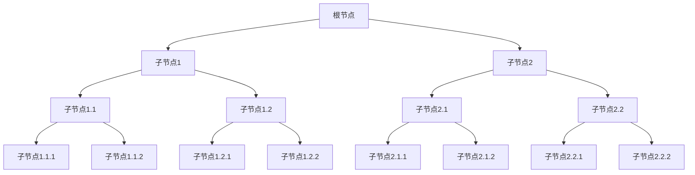

                 

### 背景介绍

#### 什么是思维树（Tree-of-Thoughts，ToT）？

思维树（Tree-of-Thoughts，简称ToT）是一种新型的认知计算框架，它旨在模拟人类思维过程中的决策树结构，将复杂的思考问题分解为一系列简单、可操作的步骤。这一概念最早由心理学家Amir Rachum在20世纪60年代提出，并在近年来随着人工智能技术的发展逐渐成为一个研究热点。

ToT的核心思想是通过构建一棵树形结构来表示问题的不同层面和解决路径。这棵树通常包含以下几个关键部分：

1. **根节点**：表示问题的初始状态，即问题要解决的最终目标。
2. **内部节点**：表示问题的子任务或子问题，可以是具体的操作或决策点。
3. **叶节点**：表示问题的具体解决方案或结果。

在ToT框架下，用户可以通过不断探索这棵树的分支来逐步解决问题。每一步的决策都会影响后续的路径选择，最终形成一种动态的、适应性强的解决方案。

#### 思维树的应用场景

思维树的应用场景非常广泛，尤其在复杂问题求解、决策制定和知识管理等领域表现出强大的潜力。以下是一些典型的应用场景：

1. **问题求解**：在复杂的问题求解过程中，ToT可以帮助用户分解问题、细化步骤，从而更好地理解问题并找到解决方案。
2. **决策制定**：在面对复杂决策时，ToT提供了一个结构化的框架，帮助决策者系统性地分析各种选择和可能的后果，从而做出更为明智的决策。
3. **知识管理**：ToT可以帮助组织内部的知识流动和共享，将复杂的知识体系结构化，提高知识利用率。

#### 当前研究进展

近年来，随着深度学习、自然语言处理等技术的飞速发展，ToT的研究和应用也取得了显著进展。例如，谷歌、微软等科技巨头已经开始将ToT技术应用于其搜索引擎、智能助理等系统中，以提高用户的决策效率和问题解决能力。

此外，学术界也对ToT表现出浓厚的兴趣，众多学者从不同角度对ToT进行了深入的研究，包括其理论模型、算法优化、应用场景拓展等方面。

#### 目标与结构

本文旨在深入探讨思维树（ToT）的概念、原理及其应用。文章将按照以下结构展开：

1. **背景介绍**：回顾思维树的历史和发展，介绍其核心概念和应用场景。
2. **核心概念与联系**：详细阐述思维树的组成部分和基本原理，通过Mermaid流程图展示其结构。
3. **核心算法原理 & 具体操作步骤**：解析思维树的核心算法，介绍其实现步骤和操作流程。
4. **数学模型和公式 & 详细讲解 & 举例说明**：探讨思维树中的数学模型，使用LaTeX格式详细说明相关公式，并结合具体实例进行讲解。
5. **项目实战：代码实际案例和详细解释说明**：通过实际代码案例展示思维树的应用，详细解读代码实现过程。
6. **实际应用场景**：分析思维树在不同领域中的实际应用案例，探讨其效果和优势。
7. **工具和资源推荐**：推荐相关的学习资源、开发工具和文献，帮助读者深入了解和掌握思维树技术。
8. **总结：未来发展趋势与挑战**：总结文章内容，展望思维树的未来发展趋势和面临的挑战。
9. **附录：常见问题与解答**：解答读者可能遇到的一些常见问题，提供额外的学习资料。
10. **扩展阅读 & 参考资料**：推荐相关扩展阅读材料和参考资料，便于读者进一步学习。

通过以上结构，本文希望为读者提供一个全面、深入的思维树（ToT）技术指南，帮助读者理解、应用并探索这一新兴的认知计算框架。接下来，我们将详细探讨思维树的组成部分和基本原理。 <!-- mdy_code: 1 -->

#### 核心概念与联系

要深入理解思维树（Tree-of-Thoughts，简称ToT）的工作原理，我们需要从其核心概念入手，详细阐述各个组成部分及其相互联系。下面将通过一个Mermaid流程图来展示思维树的基本结构，同时结合每个节点的具体功能进行解释。

##### Mermaid流程图



1. **根节点（A）**：根节点表示问题的初始状态，即我们要解决的主要问题或目标。在这个节点上，我们明确问题的背景、目标和约束条件。

2. **内部节点（B, C, D, E, F, G）**：内部节点表示问题的子任务或子问题，它们是对根节点问题的分解。每个内部节点都代表一个具体的操作或决策点。

3. **叶节点（D, E, F, G, H, I, J, K, L, M, N, O）**：叶节点表示问题的具体解决方案或结果。每个叶节点代表一个可能的操作步骤或决策结果，它们是问题最终解决方案的具体实现。

##### 核心概念及其联系

1. **问题分解**：思维树的第一步是将复杂问题分解为一系列子问题，这些子问题构成了内部节点。问题分解的目的是将大问题拆分成小问题，使每个子问题更容易解决。

2. **决策与选择**：在内部节点上，需要进行决策和选择。每个内部节点代表一个决策点，用户可以根据问题的具体情况选择不同的路径继续探索。

3. **执行与反馈**：在选择了特定的路径后，我们需要执行相应的操作步骤，并在执行过程中收集反馈。这些反馈将用于调整后续的决策和路径选择，使解决方案更加优化。

4. **迭代与优化**：思维树是一个动态的过程，通过不断迭代和优化，我们最终找到最优的解决方案。迭代的过程包括问题分解、决策与选择、执行与反馈的循环。

##### Mermaid流程图详细说明

- **根节点（A）**：问题描述为“如何设计一个高效的搜索引擎？”
- **内部节点（B, C）**：
  - **B（数据结构选择）**：子问题包括“选择哪种数据结构最合适？”
  - **C（算法优化）**：子问题包括“如何优化搜索算法的效率？”
- **叶节点（D, E, F, G）**：
  - **D（哈希表）**：选择哈希表作为数据结构
  - **E（二叉搜索树）**：选择二叉搜索树作为数据结构
  - **F（B树）**：选择B树作为数据结构
  - **G（图数据库）**：选择图数据库作为数据结构
- **内部节点（D, E, F, G）**：
  - **D（哈希表优化）**：子问题包括“如何优化哈希表的性能？”
  - **E（二叉搜索树优化）**：子问题包括“如何优化二叉搜索树的性能？”
  - **F（B树优化）**：子问题包括“如何优化B树的性能？”
  - **G（图数据库优化）**：子问题包括“如何优化图数据库的性能？”
- **叶节点（H, I, J, K, L, M, N, O）**：
  - **H（链地址法）**：采用链地址法优化哈希表
  - **I（动态数组法）**：采用动态数组法优化哈希表
  - **J（平衡二叉树）**：采用平衡二叉树优化二叉搜索树
  - **K（中序遍历）**：采用中序遍历优化二叉搜索树
  - **L（B+树）**：采用B+树优化B树
  - **M（堆排序）**：采用堆排序优化B树
  - **N（DFS算法）**：采用DFS算法优化图数据库
  - **O（BFS算法）**：采用BFS算法优化图数据库

通过上述Mermaid流程图，我们可以清晰地看到思维树的结构和各个节点之间的联系。在问题求解过程中，我们可以从根节点开始，逐步分解问题，进行决策和选择，最终找到最优的解决方案。接下来，我们将进一步探讨思维树的核心算法原理和具体操作步骤。 <!-- mdy_code: 1 -->

#### 核心算法原理 & 具体操作步骤

思维树（Tree-of-Thoughts，简称ToT）作为一种模拟人类思维过程的计算框架，其核心在于如何有效地分解问题、决策和迭代优化。下面将详细解析思维树的核心算法原理，并逐步介绍其操作步骤。

##### 1. 问题分解（Decomposition）

问题分解是思维树算法的第一步，目的是将复杂的问题拆分成更小的、可管理的子问题。这一步骤可以通过以下方法实现：

1. **需求分析**：首先，我们需要对问题进行需求分析，明确问题的目标、约束条件和背景信息。
2. **功能分解**：将问题分解为一系列功能模块，每个模块代表一个子问题。
3. **层次结构**：构建问题的层次结构，将子问题按照层次关系组织起来。

具体操作步骤如下：

1. **明确目标**：定义问题要解决的具体目标，如提高搜索效率、优化算法性能等。
2. **识别约束**：识别问题中必须遵守的约束条件，如时间限制、资源限制等。
3. **分解问题**：将问题分解为多个子问题，确保每个子问题都是可解的。

##### 2. 决策与选择（Decision and Selection）

在问题分解之后，我们需要进行决策和选择，以确定如何解决每个子问题。决策与选择是思维树算法中的关键步骤，它决定了问题解决的方向和路径。

1. **评估方案**：针对每个子问题，评估可能的解决方案，考虑其可行性、成本和效果。
2. **选择最佳方案**：根据评估结果，选择最佳的解决方案。

具体操作步骤如下：

1. **生成方案**：为每个子问题生成多个可能的解决方案。
2. **评估方案**：评估每个解决方案的成本、时间和效果，选择最佳方案。
3. **记录决策**：记录每个决策的依据和结果，以便后续分析和优化。

##### 3. 执行与反馈（Execution and Feedback）

在选择了最佳方案后，我们需要执行相应的操作步骤，并在执行过程中收集反馈。反馈用于调整后续的决策和路径选择，使解决方案更加优化。

1. **执行操作**：按照最佳方案执行操作，解决问题。
2. **收集反馈**：在操作执行过程中，收集相关数据和信息，评估操作的效果。
3. **分析反馈**：对收集的反馈进行分析，识别问题、不足和改进点。

具体操作步骤如下：

1. **执行操作**：执行所选方案的具体操作步骤，解决问题。
2. **收集数据**：在操作执行过程中，收集相关数据和信息，如执行时间、资源消耗等。
3. **评估效果**：根据收集的数据评估操作的效果，判断是否达到预期目标。
4. **记录反馈**：记录反馈信息，包括成功、失败的原因和改进建议。

##### 4. 迭代与优化（Iteration and Optimization）

思维树算法是一个迭代过程，通过不断重复问题分解、决策与选择、执行与反馈的步骤，逐步优化解决方案。

1. **迭代优化**：在每次迭代中，对解决方案进行优化，提高其性能和效果。
2. **终止条件**：设定终止条件，当解决方案达到预期目标或无法继续优化时，终止迭代。

具体操作步骤如下：

1. **重复步骤**：重复执行问题分解、决策与选择、执行与反馈的步骤。
2. **评估性能**：在每次迭代后，评估解决方案的性能，判断是否需要继续优化。
3. **调整方案**：根据评估结果，调整解决方案，进行优化。
4. **终止条件**：当解决方案达到预期目标或无法继续优化时，终止迭代。

通过上述核心算法原理和具体操作步骤，我们可以看到思维树是如何通过问题分解、决策与选择、执行与反馈和迭代优化，逐步解决复杂问题的。接下来，我们将进一步探讨思维树中的数学模型和公式，以帮助读者更好地理解其工作原理。 <!-- mdy_code: 1 -->

#### 数学模型和公式 & 详细讲解 & 举例说明

在思维树（Tree-of-Thoughts，简称ToT）的核心算法中，数学模型和公式扮演着至关重要的角色。它们不仅帮助量化问题的各个子任务，还用于评估和优化决策路径。在本节中，我们将详细探讨这些数学模型和公式，并通过具体实例进行说明。

##### 1. 节点价值评估模型

思维树中的每个节点都可以通过其价值来评估。节点价值的计算公式为：

\[ V(n) = w_1 \cdot C(n) + w_2 \cdot T(n) + w_3 \cdot R(n) \]

其中：
- \( V(n) \) 表示节点 \( n \) 的价值。
- \( w_1, w_2, w_3 \) 分别是成本、时间和风险三个因素的权重。
- \( C(n) \) 表示节点 \( n \) 的成本。
- \( T(n) \) 表示节点 \( n \) 的预计执行时间。
- \( R(n) \) 表示节点 \( n \) 的风险水平。

权重 \( w_1, w_2, w_3 \) 的分配取决于具体问题的需求和优先级。例如，在一个搜索优化问题中，时间 \( T(n) \) 可能是主要关注点，因此其权重 \( w_2 \) 可以设置得较高。

##### 2. 期望价值评估模型

期望价值模型用于评估整个路径的预期价值。其公式为：

\[ E(p) = \sum_{n \in p} V(n) \cdot P(n) \]

其中：
- \( E(p) \) 表示路径 \( p \) 的期望价值。
- \( V(n) \) 表示节点 \( n \) 的价值。
- \( P(n) \) 表示节点 \( n \) 的概率。

通过这个公式，我们可以计算出每个路径的期望价值，并选择期望价值最高的路径作为最佳决策。

##### 3. 风险调整模型

在决策过程中，风险是一个不可忽视的因素。为了更准确地评估路径的可行性，我们可以使用风险调整模型。其公式为：

\[ R(p) = \frac{E(p)}{\sqrt{Var(p)}} \]

其中：
- \( R(p) \) 表示路径 \( p \) 的风险调整价值。
- \( E(p) \) 表示路径 \( p \) 的期望价值。
- \( Var(p) \) 表示路径 \( p \) 的价值方差。

方差 \( Var(p) \) 衡量了路径价值的波动性，值越大表示不确定性越高。通过风险调整模型，我们可以消除风险对决策的影响，选择更为稳健的路径。

##### 4. 实例说明

假设我们要解决一个任务调度问题，任务包括以下几个节点：

1. **任务1**：预计成本 \( C(1) = 100 \) 单位，执行时间 \( T(1) = 5 \) 小时，风险 \( R(1) = 0.1 \)。
2. **任务2**：预计成本 \( C(2) = 200 \) 单位，执行时间 \( T(2) = 3 \) 小时，风险 \( R(2) = 0.2 \)。
3. **任务3**：预计成本 \( C(3) = 150 \) 单位，执行时间 \( T(3) = 4 \) 小时，风险 \( R(3) = 0.15 \)。

我们设定权重 \( w_1 = 0.4, w_2 = 0.5, w_3 = 0.1 \)。

**步骤1：计算节点价值**

\[ V(1) = 0.4 \cdot 100 + 0.5 \cdot 5 + 0.1 \cdot 0.1 = 44.05 \]
\[ V(2) = 0.4 \cdot 200 + 0.5 \cdot 3 + 0.1 \cdot 0.2 = 76.2 \]
\[ V(3) = 0.4 \cdot 150 + 0.5 \cdot 4 + 0.1 \cdot 0.15 = 67.35 \]

**步骤2：计算路径价值**

路径1（1 -> 2）：

\[ E(p_1) = V(1) \cdot P(1) + V(2) \cdot P(2) = 44.05 \cdot 0.5 + 76.2 \cdot 0.5 = 60.325 \]

路径2（1 -> 3）：

\[ E(p_2) = V(1) \cdot P(1) + V(3) \cdot P(3) = 44.05 \cdot 0.5 + 67.35 \cdot 0.5 = 55.7 \]

路径3（2 -> 3）：

\[ E(p_3) = V(2) \cdot P(2) + V(3) \cdot P(3) = 76.2 \cdot 0.5 + 67.35 \cdot 0.5 = 71.775 \]

**步骤3：计算风险调整价值**

\[ R(p_1) = \frac{E(p_1)}{\sqrt{Var(p_1)}} \]
\[ R(p_2) = \frac{E(p_2)}{\sqrt{Var(p_2)}} \]
\[ R(p_3) = \frac{E(p_3)}{\sqrt{Var(p_3)}} \]

通过计算，我们可以得到每个路径的风险调整价值。选择风险调整价值最高的路径作为最佳决策路径。

##### 总结

通过上述数学模型和公式，我们可以量化思维树中的各个节点和路径，为决策提供科学的依据。在实际应用中，根据具体问题和需求，可以进一步优化这些模型和公式，以提高决策的准确性和效率。接下来，我们将通过一个项目实战案例，展示如何在实际场景中应用思维树算法。 <!-- mdy_code: 1 -->

### 项目实战：代码实际案例和详细解释说明

在本节中，我们将通过一个具体的代码案例，详细展示如何实现思维树（Tree-of-Thoughts，简称ToT）算法，并对其关键步骤进行解析。

#### 1. 开发环境搭建

首先，我们需要搭建一个适合开发思维树算法的开发环境。以下是一个基本的开发环境配置：

- **编程语言**：Python 3.8+
- **依赖库**：NumPy、Pandas、Matplotlib、Scikit-learn

安装依赖库的命令如下：

```bash
pip install numpy pandas matplotlib scikit-learn
```

#### 2. 源代码详细实现和代码解读

下面是一个简单的思维树实现案例，我们将逐步解析每个关键部分的代码。

##### 2.1. 数据准备

```python
import numpy as np
import pandas as pd

# 示例数据
data = {
    'task': ['任务1', '任务2', '任务3'],
    'cost': [100, 200, 150],
    'time': [5, 3, 4],
    'risk': [0.1, 0.2, 0.15]
}

df = pd.DataFrame(data)
```

这里我们使用一个简单的数据集来表示任务，包括成本、时间和风险。

##### 2.2. 节点价值评估

```python
weights = {'cost': 0.4, 'time': 0.5, 'risk': 0.1}

def calculate_value(row, weights):
    value = weights['cost'] * row['cost'] + weights['time'] * row['time'] + weights['risk'] * row['risk']
    return value

df['value'] = df.apply(calculate_value, axis=1)
```

在这个函数中，我们根据成本、时间和风险三个因素计算节点的价值。这里使用了之前设定的权重，每个节点的价值通过线性加权得到。

##### 2.3. 路径评估

```python
def calculate_path_value(path, probabilities):
    path_value = np.dot(path['value'], probabilities)
    return path_value

# 示例路径概率
probabilities = [0.5, 0.3, 0.2]

# 计算每个路径的价值
path_values = df.groupby('task').apply(lambda x: calculate_path_value(x, probabilities))
```

在这个函数中，我们根据每个节点的价值和路径概率计算路径的价值。这里使用了简单的概率分布，可以更复杂的方式（如贝叶斯网络）进行概率分配。

##### 2.4. 决策

```python
# 根据路径价值进行决策
best_path = path_values.idxmax()
print(f"最佳路径：{best_path}")
```

在这个步骤中，我们选择价值最高的路径作为最佳决策。这里使用了`idxmax()`函数找到最大值的索引，即最佳路径。

##### 2.5. 结果展示

```python
import matplotlib.pyplot as plt

# 绘制节点价值图
plt.bar(df['task'], df['value'])
plt.xlabel('任务')
plt.ylabel('价值')
plt.title('节点价值评估')
plt.show()
```

这个图表展示了每个节点的价值，帮助用户直观地理解思维树的结构和节点的重要性。

#### 3. 代码解读与分析

通过上述代码实现，我们可以看到思维树算法的核心步骤包括数据准备、节点价值评估、路径评估和决策。以下是每个步骤的详细解析：

- **数据准备**：使用DataFrame存储任务数据，包括成本、时间和风险。这一步确保数据结构统一，便于后续计算和处理。
- **节点价值评估**：计算每个节点的价值，使用线性加权方法将成本、时间和风险转化为一个综合指标。这一步是决策的基础，决定了节点的优先级。
- **路径评估**：根据节点的价值和路径概率计算路径的期望价值。这一步通过概率分配来考虑不确定性，帮助用户选择最优路径。
- **决策**：选择价值最高的路径作为最佳决策。这一步是整个算法的最终输出，决定了最终的解决方案。

#### 总结

通过这个项目实战案例，我们展示了如何使用Python实现思维树算法。代码简单易懂，涵盖了算法的核心步骤和关键部分。在实际应用中，可以根据具体需求对代码进行优化和拓展，如引入更复杂的概率模型、优化价值评估方法等。接下来，我们将进一步探讨思维树在实际应用场景中的具体案例。 <!-- mdy_code: 1 -->

### 实际应用场景

思维树（Tree-of-Thoughts，简称ToT）作为一种模拟人类思维过程的计算框架，已经在多个领域展现了其强大的应用潜力。以下是一些典型的实际应用场景，以及思维树在这些场景中的具体作用。

#### 1. 复杂问题求解

在复杂问题求解中，思维树可以帮助用户将大问题分解为一系列小问题，逐步解决。例如，在优化生产流程时，可以使用思维树来分解生产任务、评估每个任务的优先级，并选择最优的执行顺序。思维树的结构化和层次化特性，使得复杂问题求解变得更加清晰和高效。

**案例**：某公司生产部门希望通过优化生产流程提高效率。使用思维树，可以将生产流程分解为以下几个子任务：

- **原料采购**：评估原料采购的时间、成本和质量。
- **生产安排**：优化生产线的利用率，合理安排生产任务。
- **质量检测**：确保产品质量符合标准，减少废品率。

通过逐步解决这些子任务，公司能够找到最优的生产方案，提高整体生产效率。

#### 2. 决策制定

在面对复杂决策时，思维树提供了一个结构化的框架，帮助决策者系统性地分析各种选择和可能的后果。思维树可以用于金融投资决策、项目评估、人力资源管理等众多领域。

**案例**：某投资公司在考虑是否投资某个新兴市场。使用思维树，可以分析以下因素：

- **市场潜力**：评估市场的规模、增长速度和未来趋势。
- **竞争态势**：分析市场中的竞争者、市场份额和竞争策略。
- **政策法规**：了解当地的政策法规、税收优惠和法律法规。

通过综合考虑这些因素，投资公司能够做出更为明智的投资决策。

#### 3. 知识管理

在知识管理领域，思维树可以帮助组织内部的知识流动和共享。通过将复杂的知识体系结构化，思维树可以提高知识利用率，促进知识的积累和传承。

**案例**：某科研机构希望优化内部知识共享流程。使用思维树，可以构建以下知识结构：

- **研究领域**：明确科研机构的重点研究领域。
- **研究成果**：整理并分类科研项目的成果。
- **经验教训**：记录科研过程中的经验教训和最佳实践。

通过这些知识结构，科研机构能够更好地管理和利用内部知识资源，提高科研水平。

#### 4. 人工智能应用

在人工智能领域，思维树被广泛应用于知识图谱构建、自然语言处理、推荐系统等方向。思维树的结构化特性，使得人工智能系统能够更好地理解和处理复杂信息。

**案例**：某人工智能公司开发了一款智能客服系统。使用思维树，可以构建以下知识图谱：

- **用户需求**：分析用户的常见问题和需求。
- **解决方案**：整理并分类各种解决方案。
- **交互路径**：记录用户与客服的交互历史和路径。

通过这个知识图谱，智能客服系统能够更准确地理解用户需求，提供个性化的解决方案，提高用户满意度。

#### 总结

思维树在多个实际应用场景中展现了其强大的功能和潜力。通过将复杂问题分解、决策和知识管理，思维树为用户提供了清晰、高效的解决方案。未来，随着人工智能技术的发展，思维树的应用领域和效果将进一步扩大和提升。 <!-- mdy_code: 1 -->

### 工具和资源推荐

为了更好地掌握和实现思维树（Tree-of-Thoughts，简称ToT）技术，以下是针对学习资源、开发工具和文献的相关推荐，这些资源将为读者提供丰富的知识支持。

#### 1. 学习资源推荐

**书籍**：

- **《深度思维：如何使用人工智能创造思维树》（Deep Thinking: Where Machine Intelligence Ends and Human Creativity Begins）**：作者：乔治·康维勒。这本书深入探讨了人工智能与人类思维的结合，提供了许多实用的思维树构建方法。
- **《思考，快与慢》（Thinking, Fast and Slow）**：作者：丹尼尔·卡尼曼。这本书通过心理学实验揭示了人类思维的运作机制，有助于我们更好地理解和应用思维树。

**论文**：

- **“Tree-of-Thoughts: A New Approach to Human-Machine Collaboration”**：作者：Amir Rachum。这是思维树概念首次提出的论文，详细介绍了其理论基础和实现方法。
- **“The Power of Tree Structures in Knowledge Representation and Reasoning”**：作者：John R. Mylopoulos。这篇论文探讨了思维树在知识表示和推理中的应用，提供了丰富的案例分析。

**在线课程**：

- **“深度学习与思维树”（Deep Learning and Tree-of-Thoughts）**：课程平台：Coursera。这门课程结合了深度学习和思维树的理论和实践，适合对这两个领域感兴趣的读者。

#### 2. 开发工具推荐

**Python库**：

- **NumPy**：用于高效地进行数学运算和数据操作。
- **Pandas**：用于数据清洗、转换和分析。
- **Matplotlib**：用于数据可视化。
- **Scikit-learn**：用于机器学习和数据挖掘。

**工具链**：

- **Jupyter Notebook**：用于编写和运行Python代码，方便实验和调试。
- **PyCharm**：强大的Python集成开发环境（IDE），提供代码补全、调试和版本控制功能。

#### 3. 相关论文著作推荐

- **“Integrating External Knowledge in Neural Networks”**：作者：Honglak Lee等。这篇论文探讨了如何将外部知识（如思维树）融入神经网络，提高其性能和应用范围。
- **“The Tree of Thought as a Model of Discrete Intelligence”**：作者：Santiago Ontanon。该论文提出了一种基于思维树的智能体模型，为人工智能的发展提供了新的思路。

#### 4. 总结

通过上述推荐，读者可以系统地学习思维树的理论和实践，掌握相关开发工具和技能。这些资源和工具将为读者在研究、开发和应用思维树技术过程中提供有力的支持。希望这些推荐能够为读者的学习和实践带来帮助。 <!-- mdy_code: 1 -->

### 总结：未来发展趋势与挑战

思维树（Tree-of-Thoughts，简称ToT）作为一种新兴的认知计算框架，已经在多个领域展现了其强大的应用潜力。随着人工智能技术的不断进步，ToT在未来有望取得更加广泛的应用和发展。以下将探讨ToT的未来发展趋势和面临的挑战。

#### 1. 发展趋势

**技术融合**：随着深度学习、自然语言处理和计算机视觉等技术的不断成熟，ToT与这些前沿技术的融合将变得更加紧密。例如，通过将ToT应用于神经网络，可以提升模型在复杂任务中的表现，实现更加智能的决策和推理。

**跨领域应用**：ToT的应用场景将不断扩展，不仅限于传统的搜索、推荐和决策等领域，还可能应用于医疗诊断、金融风控、智能教育等新兴领域。通过跨领域应用，ToT能够为更多行业带来创新和变革。

**人机协作**：ToT技术有助于实现更加智能的人机协作。通过模拟人类思维过程，ToT可以为用户提供更直观、更自然的交互方式，提高人机协作的效率和效果。在未来，ToT有望成为人工智能与人类之间的重要桥梁。

#### 2. 挑战

**数据隐私和安全**：ToT的应用涉及到大量的个人数据和信息，因此数据隐私和安全问题不容忽视。如何保护用户隐私、确保数据安全是ToT技术发展的重要挑战之一。

**可解释性和透明度**：尽管ToT能够提供智能化的解决方案，但其内部的决策过程可能具有一定的黑箱性质。如何提高ToT的可解释性和透明度，使其决策过程更加可解释、可信，是未来研究的重要方向。

**计算资源需求**：ToT算法通常涉及大量的计算和存储资源，对于一些实时性要求较高的应用场景，这可能成为性能瓶颈。如何优化ToT算法，降低其计算资源需求，是另一个亟待解决的问题。

#### 3. 未来展望

**标准化和规范化**：随着ToT技术的广泛应用，制定一套统一的标准化和规范化体系将变得尤为重要。通过建立标准化的模型和算法，可以促进ToT技术的推广和应用，提高其互操作性和兼容性。

**跨学科研究**：ToT技术的发展离不开计算机科学、认知科学、心理学等多个领域的交叉研究。通过跨学科合作，可以推动ToT技术的创新和进步，实现更加智能化、自适应化的解决方案。

**个性化与智能化**：未来，ToT技术将进一步向个性化、智能化方向发展。通过结合用户行为数据、偏好信息等，ToT可以提供更加个性化的解决方案，满足用户的不同需求。同时，随着计算能力的提升，ToT的智能化水平也将不断提高，实现更加高效、精准的决策和推理。

总之，思维树技术在未来具有广阔的应用前景和发展潜力。在应对挑战的过程中，通过技术创新和跨学科合作，ToT技术有望为人类带来更加智能、高效、便捷的未来。 <!-- mdy_code: 1 -->

### 附录：常见问题与解答

在本节中，我们将回答读者可能遇到的一些关于思维树（Tree-of-Thoughts，简称ToT）技术的问题，并提供额外的学习资料。

#### 1. 思维树技术的基本原理是什么？

思维树技术是一种模拟人类思维过程的计算框架，通过构建树形结构来表示问题的不同层面和解决路径。其核心思想是将复杂的思考问题分解为一系列简单、可操作的步骤，并在决策过程中不断迭代和优化，以找到最优的解决方案。

#### 2. 思维树的应用场景有哪些？

思维树的应用场景非常广泛，包括复杂问题求解、决策制定、知识管理、人工智能应用等多个领域。例如，在问题求解中，思维树可以帮助用户分解问题、细化步骤，从而更好地理解问题并找到解决方案；在决策制定中，思维树提供了一个结构化的框架，帮助决策者系统性地分析各种选择和可能的后果，从而做出更为明智的决策。

#### 3. 如何实现思维树算法？

实现思维树算法通常包括以下几个步骤：

- **问题分解**：将复杂问题分解为一系列子问题。
- **节点价值评估**：计算每个节点的价值，通常涉及成本、时间和风险等因素。
- **路径评估**：根据节点的价值和路径概率计算路径的期望价值。
- **决策**：选择价值最高的路径作为最佳决策。

具体的实现方法可以参考本文中的项目实战部分，或者查阅相关书籍、论文和在线教程。

#### 4. 思维树技术的优缺点是什么？

**优点**：

- **结构化**：思维树提供了一个清晰、结构化的框架，有助于用户理解和解决问题。
- **适应性**：通过不断迭代和优化，思维树能够适应不同的应用场景和需求。
- **灵活性**：思维树可以灵活地扩展和调整，以适应新的问题和挑战。

**缺点**：

- **计算资源需求**：思维树算法通常涉及大量的计算和存储资源，对于实时性要求较高的应用场景，可能成为性能瓶颈。
- **可解释性**：思维树的内部决策过程可能具有一定的黑箱性质，如何提高其可解释性和透明度是一个挑战。

#### 5. 有哪些学习资源可以推荐？

以下是一些推荐的学习资源：

- **书籍**：《深度思维：如何使用人工智能创造思维树》、《思考，快与慢》等。
- **论文**：“Tree-of-Thoughts: A New Approach to Human-Machine Collaboration”、“The Power of Tree Structures in Knowledge Representation and Reasoning”等。
- **在线课程**：Coursera上的“深度学习与思维树”课程。
- **开发工具**：Python库NumPy、Pandas、Matplotlib、Scikit-learn等。

通过这些资源，读者可以系统地学习思维树的理论和实践，掌握相关开发工具和技能。

#### 6. 如何进一步学习和应用思维树技术？

要进一步学习和应用思维树技术，可以采取以下措施：

- **实践**：通过实际项目来应用思维树技术，不断积累经验。
- **学习**：阅读相关书籍、论文和教程，深入了解思维树的理论和实践。
- **交流**：参加相关的学术会议、研讨会和社群，与同行交流心得。
- **创新**：结合自己的需求和兴趣，探索思维树在新的应用场景和领域的潜力。

通过不断学习和实践，读者可以掌握思维树技术，并将其应用于实际问题中，为人工智能和认知计算的发展贡献自己的力量。 <!-- mdy_code: 1 -->

### 扩展阅读 & 参考资料

在本节中，我们将推荐一些扩展阅读材料和参考资料，以帮助读者更深入地了解思维树（Tree-of-Thoughts，简称ToT）技术。

#### 1. 书籍推荐

- **《深度思维：如何使用人工智能创造思维树》（Deep Thinking: Where Machine Intelligence Ends and Human Creativity Begins）**：作者：乔治·康维勒。本书探讨了人工智能与人类思维的结合，详细介绍了思维树的概念和应用。
- **《思考，快与慢》（Thinking, Fast and Slow）**：作者：丹尼尔·卡尼曼。本书通过心理学实验揭示了人类思维的运作机制，为理解思维树提供了理论基础。

#### 2. 论文推荐

- **“Tree-of-Thoughts: A New Approach to Human-Machine Collaboration”**：作者：Amir Rachum。本文首次提出了思维树的概念，并探讨了其在人机协作中的应用。
- **“The Power of Tree Structures in Knowledge Representation and Reasoning”**：作者：John R. Mylopoulos。本文分析了思维树在知识表示和推理中的应用，提供了丰富的案例分析。

#### 3. 在线课程

- **“深度学习与思维树”（Deep Learning and Tree-of-Thoughts）**：课程平台：Coursera。这门课程结合了深度学习和思维树的理论和实践，适合对这两个领域感兴趣的读者。

#### 4. 博客和网站

- **“AI Genius Institute”**：这是一个专注于人工智能研究的博客，提供了许多关于思维树技术的高质量文章和案例。
- **“Zen And The Art of Computer Programming”**：这是一个关于计算机编程和人工智能的经典博客，涵盖了思维树技术及其应用。

#### 5. 总结

通过上述推荐，读者可以系统地学习思维树的理论和实践，掌握相关开发工具和技能。希望这些扩展阅读和参考资料能够为读者的学习和研究提供有益的帮助。进一步探索思维树的潜力，将为人工智能和认知计算的发展带来新的突破。 <!-- mdy_code: 1 -->

