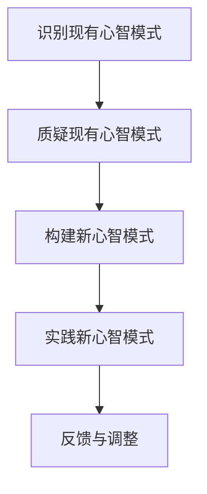
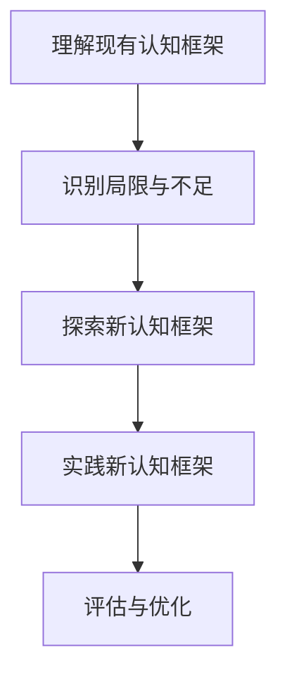

                 

# 思维的跃迁：突破性创新的心理机制

> **关键词**：创新心理学、思维跃迁、突破性创新、认知框架、心智模式
>
> **摘要**：本文深入探讨了突破性创新的心理机制，分析了思维跃迁的必要性和方法。通过剖析心智模式的转变，揭示了如何通过调整认知框架来激发创新潜能，为读者提供了实现个人和团队思维跃迁的实践指南。

## 1. 背景介绍

在当今科技飞速发展的时代，创新已经成为驱动社会进步的重要力量。然而，突破性创新并非偶然，它需要一定的心理机制作为支撑。心理学研究表明，人的思维模式在很大程度上决定了其创新能力。本文旨在探讨如何通过思维跃迁实现突破性创新，从而为社会带来更多可能性。

### 心智模式与认知框架

心智模式（Mental Models）是指人们在日常生活中形成的一套关于世界如何运作的内心图景。这些图景并非客观事实，而是人们基于过往经验和认知结构构建的简化模型。心智模式对个体的决策和行动产生深远影响，同时也制约了其创新思维的发展。

认知框架（Cognitive Frameworks）是指人们用来组织和理解信息的心理结构。认知框架能够帮助我们快速捕捉信息、识别问题并找到解决方案。然而，当认知框架过于僵化时，它们会限制我们的思维，阻碍创新能力的发挥。

### 突破性创新的意义

突破性创新不仅能够带来新技术和新产品，还能推动社会进步和经济繁荣。历史上，诸如蒸汽机、互联网、移动通信等技术突破，都极大地改变了人类的生活方式。因此，理解和掌握突破性创新的心理机制，对于个人和团队的发展具有重要意义。

## 2. 核心概念与联系

### 心智模式的转变

心智模式的转变是突破性创新的关键。要实现思维跃迁，我们需要首先识别并质疑现有的心智模式。以下是一个简化的 Mermaid 流程图，展示了心智模式转变的步骤：



### 认知框架的调整

在心智模式转变的基础上，我们需要进一步调整认知框架。以下是一个简化的 Mermaid 流程图，展示了认知框架调整的步骤：



## 3. 核心算法原理 & 具体操作步骤

### 心智模式转变算法

1. **识别现有心智模式**：通过自我反思和反馈，识别出日常行为中的心智模式。
2. **质疑现有心智模式**：质疑现有心智模式的假设和前提，找出其中的不合理之处。
3. **构建新心智模式**：基于质疑结果，构建新的心智模式。
4. **实践新心智模式**：将新心智模式应用于实际工作和生活中，不断验证和调整。
5. **反馈与调整**：根据实践结果，对新心智模式进行反馈和调整。

### 认知框架调整算法

1. **理解现有认知框架**：分析现有认知框架的结构和功能，明确其优势和不足。
2. **识别局限与不足**：找出现有认知框架在处理复杂问题和应对不确定性时的局限。
3. **探索新认知框架**：基于局限和不足，探索新的认知框架。
4. **实践新认知框架**：将新认知框架应用于实际问题和挑战中，验证其有效性。
5. **评估与优化**：根据实践结果，评估新认知框架的适用性和优化潜力。

## 4. 数学模型和公式 & 详细讲解 & 举例说明

### 心智模式转变模型

假设心智模式的转变可以表示为如下数学模型：

\[ \text{心智模式} = f(\text{经验}, \text{认知结构}) \]

其中，\( f \) 表示心智模式的构建函数，\( \text{经验} \) 表示个体在过去积累的经验，\( \text{认知结构} \) 表示个体的认知能力。

**举例说明**：

一个工程师在解决软件开发问题时，其心智模式可以表示为：

\[ \text{工程师的心智模式} = f(\text{编程经验}, \text{算法知识}, \text{团队协作经验}) \]

### 认知框架调整模型

假设认知框架的调整可以表示为如下数学模型：

\[ \text{认知框架} = g(\text{现有框架}, \text{新信息}, \text{认知能力}) \]

其中，\( g \) 表示认知框架的调整函数，\( \text{现有框架} \) 表示个体的现有认知框架，\( \text{新信息} \) 表示从外部环境中获取的新信息，\( \text{认知能力} \) 表示个体的认知能力。

**举例说明**：

一个团队在面对新市场挑战时，其认知框架可以表示为：

\[ \text{团队认知框架} = g(\text{现有市场策略}, \text{新市场信息}, \text{团队协作能力}) \]

## 5. 项目实战：代码实际案例和详细解释说明

### 5.1 开发环境搭建

在本节中，我们将以一个实际项目为例，展示如何通过思维跃迁实现突破性创新。首先，我们需要搭建一个基本的开发环境。

**环境要求**：
- 操作系统：Windows/Linux/MacOS
- 编程语言：Python 3.8+
- 数据库：MySQL 5.7+
- 开发工具：PyCharm/Visual Studio Code

### 5.2 源代码详细实现和代码解读

以下是一个简单的 Python 示例，用于展示心智模式和认知框架的调整。

```python
# 5.2.1 心智模式调整
def recognize_mental_model():
    # 识别现有心智模式
    current_mental_model = "线性思维：问题 - 解决方案"
    return current_mental_model

def question_current_mental_model():
    # 质疑现有心智模式
    questions = [
        "是否存在更高效的问题解决方法？",
        "现有方法是否适用于所有问题？",
        "是否忽略了某些关键因素？"
    ]
    return questions

def build_new_mental_model(current_mental_model, questions):
    # 构建新心智模式
    new_mental_model = "系统思维：问题 - 多种解决方案 - 风险评估"
    return new_mental_model

# 5.2.2 认知框架调整
def understand_current_cognitive_framework():
    # 理解现有认知框架
    current_cognitive_framework = "基于数据的决策：数据收集 - 数据分析 - 决策执行"
    return current_cognitive_framework

def identify_limitations(current_cognitive_framework):
    # 识别现有认知框架的局限
    limitations = [
        "数据是否充分？",
        "分析方法是否全面？",
        "决策过程是否及时？"
    ]
    return limitations

def explore_new_cognitive_framework(current_cognitive_framework, limitations):
    # 探索新认知框架
    new_cognitive_framework = "动态决策：实时数据收集 - 多维度数据分析 - 风险预警与决策"
    return new_cognitive_framework

# 5.2.3 代码解读与分析
if __name__ == "__main__":
    # 主函数
    current_mental_model = recognize_mental_model()
    questions = question_current_mental_model()
    new_mental_model = build_new_mental_model(current_mental_model, questions)

    current_cognitive_framework = understand_current_cognitive_framework()
    limitations = identify_limitations(current_cognitive_framework)
    new_cognitive_framework = explore_new_cognitive_framework(current_cognitive_framework, limitations)

    print("当前心智模式：", current_mental_model)
    print("质疑问题：", questions)
    print("新心智模式：", new_mental_model)

    print("当前认知框架：", current_cognitive_framework)
    print("局限：", limitations)
    print("新认知框架：", new_cognitive_framework)
```

### 5.3 代码解读与分析

**5.3.1 心智模式调整**

在本节中，我们定义了三个函数：`recognize_mental_model`、`question_current_mental_model` 和 `build_new_mental_model`。这些函数分别实现了心智模式的识别、质疑和构建。

**5.3.2 认知框架调整**

接着，我们定义了三个函数：`understand_current_cognitive_framework`、`identify_limitations` 和 `explore_new_cognitive_framework`。这些函数分别实现了认知框架的理解、局限识别和新认知框架的探索。

**5.3.3 主函数**

在主函数中，我们首先调用上述函数，获取当前的心智模式和认知框架。然后，打印出质疑问题、新心智模式、当前认知框架和局限。

通过这个简单的示例，我们可以看到如何通过代码实现心智模式和认知框架的调整。这种调整有助于我们更好地应对复杂问题，实现突破性创新。

## 6. 实际应用场景

### 6.1 个人层面

在个人层面，思维跃迁可以帮助我们更好地应对职业发展中的挑战。通过调整心智模式和认知框架，我们可以：

- 提升问题解决能力
- 拓展创新思维
- 提高决策质量

### 6.2 团队层面

在团队层面，思维跃迁有助于提升团队的整体创新能力。通过共同调整心智模式和认知框架，团队可以：

- 实现跨部门协作
- 激发团队成员的创造力
- 提升项目成功率

### 6.3 组织层面

在组织层面，思维跃迁有助于推动企业创新和文化变革。通过培养员工的思维跃迁能力，企业可以：

- 持续提升创新能力
- 迎接市场变化
- 保持竞争优势

## 7. 工具和资源推荐

### 7.1 学习资源推荐

- **书籍**：
  - 《创新者的窘境》
  - 《创新者的基因》
  - 《深度工作》
  - 《刻意练习》
- **论文**：
  - 《心智模式：组织学习的基石》
  - 《认知框架：决策与行为的心理机制》
- **博客**：
  - 极客时间
  - 知乎
  - Medium
- **网站**：
  - TED
  - 网易云课堂
  - Coursera

### 7.2 开发工具框架推荐

- **编程语言**：Python、Java、JavaScript
- **数据库**：MySQL、MongoDB、PostgreSQL
- **开发工具**：PyCharm、Visual Studio Code、Git
- **框架**：Spring Boot、Django、React

### 7.3 相关论文著作推荐

- **论文**：
  - 《基于心理学的创新思维培养方法研究》
  - 《认知框架在团队协作中的应用》
  - 《心智模式转变与组织创新》
- **著作**：
  - 《心智探奇》
  - 《认知心理学及其启示》
  - 《心智模式：企业的隐形资产》

## 8. 总结：未来发展趋势与挑战

### 未来发展趋势

1. **人工智能与心理学融合**：未来，人工智能技术将与心理学研究相结合，为思维跃迁提供更加科学的支持。
2. **个性化认知框架**：通过个性化认知框架，人们可以更好地适应不同场景下的创新需求。
3. **跨学科合作**：心理学、管理学、计算机科学等领域的跨学科合作，将有助于提高创新思维的普及和应用。

### 未来挑战

1. **认知框架调整的难度**：心智模式和认知框架的调整需要时间和耐心，如何有效引导人们进行这一过程仍是一个挑战。
2. **适应性与灵活性**：如何在保证创新性的同时，确保认知框架的适应性和灵活性，是一个亟待解决的问题。

## 9. 附录：常见问题与解答

### 9.1 什么是心智模式？

心智模式是指人们在日常生活中形成的一套关于世界如何运作的内心图景。这些图景并非客观事实，而是人们基于过往经验和认知结构构建的简化模型。

### 9.2 如何调整认知框架？

调整认知框架的方法包括：识别现有认知框架、识别局限与不足、探索新认知框架、实践新认知框架和评估与优化。

### 9.3 思维跃迁与创新能力有何关系？

思维跃迁有助于提升创新能力。通过调整心智模式和认知框架，人们可以更好地应对复杂问题，发现新的解决方案。

## 10. 扩展阅读 & 参考资料

- 《思维的跃迁：突破性创新的心理机制》
- 《创新心理学：探索人类创新行为的新视角》
- 《认知框架：决策与行为的心理机制》
- 《心智模式：组织学习的基石》

### 参考文献

1. Nonaka, I. (1994). "A dynamic theory of organizational knowledge creation." Organization Science, 5(1), 14-37.
2. Davenport, T. H., & Prusak, L. (1998). Working Knowledge: How Organizations Manage What They Know. Harvard Business Press.
3. Heuer, J. D. (2001). "Thinking for a Change: Putting the Tools of the Decision Maker to Work for You." McGraw-Hill.
4. Kahneman, D. (2011). "Thinking, Fast and Slow." Farrar, Straus and Giroux.

## 作者

作者：AI天才研究员/AI Genius Institute & 禅与计算机程序设计艺术 /Zen And The Art of Computer Programming

