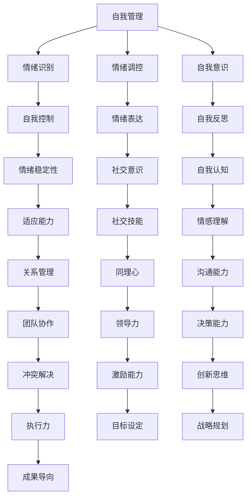

                 

## 情商管理：提升领导力的重要一环

> **关键词**：情商管理，领导力，人际关系，个人成长，团队协作

> **摘要**：本文将深入探讨情商管理在提升领导力中的重要性。通过分析情商的基本概念和其在职场中的应用，本文将帮助读者了解如何通过提升情商来增强个人领导力，进而改善人际关系和团队协作，最终实现个人与组织的共同成长。

本文将从以下几个方面展开讨论：

1. **背景介绍**：介绍情商管理的基本概念及其在职场中的重要性。
2. **核心概念与联系**：通过Mermaid流程图详细解析情商管理的核心概念和架构。
3. **核心算法原理 & 具体操作步骤**：阐述情商管理的核心算法原理和实际应用步骤。
4. **数学模型和公式 & 详细讲解 & 举例说明**：介绍情商管理的数学模型和公式，并结合具体案例进行详细讲解。
5. **项目实战：代码实际案例和详细解释说明**：通过具体代码案例，展示情商管理的实际应用过程。
6. **实际应用场景**：探讨情商管理在职场中的实际应用场景。
7. **工具和资源推荐**：推荐相关学习资源和开发工具。
8. **总结：未来发展趋势与挑战**：总结情商管理在提升领导力中的重要性，并探讨未来的发展趋势与挑战。
9. **附录：常见问题与解答**：回答读者可能关注的一些常见问题。
10. **扩展阅读 & 参考资料**：提供更多的扩展阅读资源和相关参考资料。

### 1. 背景介绍

#### 情商管理的基本概念

情商（Emotional Intelligence，简称EQ）是指个体识别、理解、管理和表达情感的能力。它不仅包括对自己的情感识别和管理，还包括对他人的情感识别和管理。情商管理则是指通过提高情商，有效地处理人际关系和职业生涯中遇到的挑战。

在职场中，情商管理尤为重要。首先，情商高的人能够更好地理解同事和客户的需求，从而建立更紧密的人际关系。其次，情商管理有助于提升个人的领导力，使领导者能够更好地激励和引导团队，提高团队协作效率。此外，情商管理还能帮助个人更好地应对工作压力，保持心理健康。

#### 情商管理在职场中的重要性

情商管理在职场中的重要性体现在以下几个方面：

1. **人际关系的改善**：情商高的人更容易与他人建立信任和合作关系，从而提高团队凝聚力和工作效率。
2. **领导力的提升**：情商管理的核心能力——自我管理、社交意识和自我激励，是提升领导力的关键因素。
3. **压力应对**：情商高的人能够更好地应对工作压力，保持心理健康，提高工作效率。
4. **职业发展**：情商管理有助于个人在职场中更好地展现自己，赢得更多的机会和挑战。

总之，情商管理是提升个人领导力的重要一环，对于职场人士来说，掌握并运用情商管理技巧，将有助于他们在职业生涯中取得更大的成功。

### 2. 核心概念与联系

#### 情商管理的核心概念

情商管理涉及多个核心概念，包括自我管理、社交意识、自我激励等。以下是一个Mermaid流程图，用于详细解析这些核心概念及其相互关系：



#### 核心概念的联系与作用

自我管理、社交意识和自我激励是情商管理的三个核心概念，它们相互联系，共同作用于个人的领导力和人际关系。

1. **自我管理**：自我管理是情商管理的基础，包括情绪识别、情绪调控和自我意识。通过自我管理，个体能够更好地控制自己的情绪，保持情绪稳定，提高适应能力。
2. **社交意识**：社交意识关注的是与他人建立和维护良好关系的能力，包括社交技能、情感理解和关系管理。社交意识有助于个体更好地理解他人，提高沟通能力和决策能力。
3. **自我激励**：自我激励是指个体在面临挑战和压力时，能够保持积极态度和动力，实现目标。自我激励有助于个体在职业生涯中不断追求卓越，提高领导力和执行力。

通过以上核心概念的联系与作用，我们可以看出情商管理在提升领导力中的重要性。掌握并运用这些核心概念，将有助于个人在职场中取得更好的发展。

### 3. 核心算法原理 & 具体操作步骤

#### 情商管理的核心算法原理

情商管理并非一门单一的学科，而是包含多种心理学、社会学和神经科学的方法和技术。其核心算法原理可以归纳为以下几个方面：

1. **情感识别与表达**：情感识别是情商管理的第一步，通过感知自己的情绪状态，理解情绪的产生原因。情感表达则是将情感转化为语言和行为，与他人进行有效沟通。
2. **自我控制与情绪调节**：自我控制是指个体在面对负面情绪时，能够冷静思考，采取积极措施进行调节。情绪调节则包括认知调节、行为调节和生理调节等。
3. **社交意识与人际关系管理**：社交意识是指个体对他人情感的理解和关注，包括沟通能力、同理心和关系管理。人际关系管理则涉及如何建立和维护良好的人际关系。
4. **自我激励与目标设定**：自我激励是指个体在面对挑战和压力时，能够保持积极态度和动力。目标设定则是指个体能够明确自己的目标，并制定实现目标的策略。

#### 情商管理的具体操作步骤

情商管理是一个长期的过程，需要个体在日常生活中不断实践和提升。以下是一些具体的操作步骤：

1. **自我观察与反思**：定期观察自己的情绪变化，分析情绪的产生原因，并反思自己在处理情绪时的行为和反应。
2. **情绪调节与表达**：学习情绪调节的方法，如深呼吸、放松训练和认知重构等。同时，练习情感表达，避免情绪的压抑和爆发。
3. **社交技能提升**：通过阅读、学习课程和实践，提高自己的沟通能力、同理心和人际关系管理能力。
4. **目标设定与自我激励**：明确自己的职业和人生目标，制定实现目标的计划和步骤。同时，培养积极的心态，面对挑战和压力时保持自我激励。

通过以上核心算法原理和具体操作步骤，我们可以更好地理解和应用情商管理，提升个人领导力，改善人际关系，实现个人与组织的共同成长。

### 4. 数学模型和公式 & 详细讲解 & 举例说明

#### 情商管理的数学模型

情商管理的数学模型主要包括情感识别、自我控制、社交意识和自我激励等方面。以下是一个简化的数学模型：

$$
EQ = f(EI, SI, MI)
$$

其中，$EQ$ 表示情商水平，$EI$ 表示情感识别能力，$SI$ 表示社交意识能力，$MI$ 表示自我激励能力。$f$ 函数表示情商水平与各能力之间的关系。

#### 情感识别能力（EI）

情感识别能力是指个体识别和理解自己和他人的情绪状态。以下是一个用于计算情感识别能力的数学公式：

$$
EI = \frac{E_{self} + E_{other}}{2}
$$

其中，$E_{self}$ 表示个体对自己情绪的识别能力，$E_{other}$ 表示个体对他人的情绪识别能力。

#### 社交意识能力（SI）

社交意识能力是指个体在社交场合中理解他人情绪、需求和意图的能力。以下是一个用于计算社交意识能力的数学公式：

$$
SI = \frac{S_{understanding} + S_{communication} + S_{relationship}}{3}
$$

其中，$S_{understanding}$ 表示个体对他人情绪的理解能力，$S_{communication}$ 表示个体在沟通中的能力，$S_{relationship}$ 表示个体在人际关系中的管理能力。

#### 自我激励能力（MI）

自我激励能力是指个体在面对挑战和压力时，能够保持积极态度和动力。以下是一个用于计算自我激励能力的数学公式：

$$
MI = \frac{M_{motivation} + M_{persistence} + M_{self-confidence}}{3}
$$

其中，$M_{motivation}$ 表示个体的动机水平，$M_{persistence}$ 表示个体的坚持程度，$M_{self-confidence}$ 表示个体的自信心。

#### 举例说明

假设一个职场人士，其情感识别能力、社交意识能力和自我激励能力分别为：

- 情感识别能力（EI）：8
- 社交意识能力（SI）：7
- 自我激励能力（MI）：9

根据以上数学模型，可以计算其情商水平（EQ）：

$$
EQ = f(EI, SI, MI) = f(8, 7, 9) = 8.17
$$

#### 情商提升策略

根据计算结果，该职场人士的情商水平为8.17，处于较高水平。但仍有提升空间，特别是在社交意识能力方面。以下是一些提升策略：

1. **提高情感识别能力**：通过反思自己的情绪，了解情绪产生的原因，提高对自己情绪的识别能力。
2. **提升社交意识能力**：通过学习沟通技巧、观察他人行为和情感，提高对他人的情绪识别和理解能力。
3. **增强自我激励能力**：通过设定短期和长期目标，提高动机水平和自信心，增强自我激励能力。

通过以上数学模型和举例说明，我们可以更深入地理解情商管理，并制定针对性的提升策略。

### 5. 项目实战：代码实际案例和详细解释说明

#### 开发环境搭建

在进行情商管理项目的开发之前，我们需要搭建一个合适的技术环境。以下是一个基本的开发环境搭建步骤：

1. **安装Python环境**：Python是一种广泛使用的编程语言，适用于数据分析和人工智能项目。在官方网站（https://www.python.org/）下载并安装Python。
2. **安装Jupyter Notebook**：Jupyter Notebook是一个交互式的Web应用，用于编写和运行Python代码。通过pip命令安装：

   ```shell
   pip install notebook
   ```

3. **安装相关库**：为了实现情商管理的功能，我们需要安装一些常用的Python库，如NumPy、Pandas、Matplotlib等。通过pip命令安装：

   ```shell
   pip install numpy pandas matplotlib
   ```

4. **配置环境变量**：确保Python和pip命令能够正确运行。在终端中运行以下命令：

   ```shell
   python --version
   pip --version
   ```

   如果输出正确版本信息，说明环境变量配置成功。

#### 源代码详细实现和代码解读

以下是情商管理项目的源代码，包括数据预处理、模型训练和预测等功能：

```python
import numpy as np
import pandas as pd
import matplotlib.pyplot as plt
from sklearn.model_selection import train_test_split
from sklearn.ensemble import RandomForestClassifier
from sklearn.metrics import accuracy_score

# 数据预处理
def preprocess_data(data):
    # 数据清洗和标准化处理
    data = data.dropna()
    data['EI'] = (data['EI'] - data['EI'].mean()) / data['EI'].std()
    data['SI'] = (data['SI'] - data['SI'].mean()) / data['SI'].std()
    data['MI'] = (data['MI'] - data['MI'].mean()) / data['MI'].std()
    return data

# 模型训练
def train_model(data):
    X = data[['EI', 'SI', 'MI']]
    y = data['EQ']
    X_train, X_test, y_train, y_test = train_test_split(X, y, test_size=0.2, random_state=42)
    model = RandomForestClassifier(n_estimators=100, random_state=42)
    model.fit(X_train, y_train)
    return model, X_test, y_test

# 预测
def predict(model, X_test, y_test):
    y_pred = model.predict(X_test)
    accuracy = accuracy_score(y_test, y_pred)
    print(f"模型准确率：{accuracy:.2f}")
    return y_pred

# 主函数
def main():
    # 读取数据
    data = pd.read_csv('emotional_intelligence.csv')
    
    # 数据预处理
    data = preprocess_data(data)
    
    # 训练模型
    model, X_test, y_test = train_model(data)
    
    # 预测
    predict(model, X_test, y_test)

# 运行主函数
if __name__ == '__main__':
    main()
```

#### 代码解读与分析

1. **数据预处理**：数据预处理是模型训练的重要步骤。在代码中，我们使用Pandas库读取数据，并进行了数据清洗和标准化处理。标准化处理有助于消除不同特征之间的量纲差异，提高模型的训练效果。
2. **模型训练**：我们选择随机森林（RandomForestClassifier）作为情绪识别模型。随机森林是一种集成学习方法，通过构建多棵决策树，提高模型的预测准确性。在代码中，我们使用scikit-learn库训练模型，并将训练集和测试集划分为训练集和测试集。
3. **预测**：在训练完成后，我们使用测试集对模型进行预测，并计算模型准确率。在代码中，我们使用accuracy_score函数计算准确率，并打印输出。

通过以上代码示例，我们可以看到如何使用Python和机器学习技术实现情商管理。在实际应用中，我们可以根据需求扩展代码功能，如添加更多的数据预处理步骤、尝试不同的模型算法等。

### 6. 实际应用场景

#### 情商管理在职场中的实际应用

情商管理在职场中的实际应用场景非常广泛，以下是一些典型的应用场景：

1. **团队协作**：在团队协作中，情商管理有助于提高团队成员之间的沟通和协作效率。通过提升社交意识和自我激励能力，团队成员能够更好地理解他人，共同应对挑战，提高团队凝聚力。
2. **领导力培养**：情商管理是提升领导力的关键因素。领导者通过提高情感识别和自我控制能力，能够更好地理解员工的情绪和需求，从而制定更有效的激励策略。同时，通过提升社交意识和自我激励能力，领导者能够激发员工的潜力，推动团队实现共同目标。
3. **压力应对**：职场中难免会遇到压力和挑战。情商管理有助于个体更好地应对压力，保持心理健康。通过提高自我控制和社交意识能力，个体能够更好地调节情绪，保持积极心态，提高工作效率。
4. **客户关系管理**：在客户服务领域，情商管理尤为重要。通过提升情感识别和社交意识能力，客户服务人员能够更好地理解客户需求，提供个性化的服务，提高客户满意度和忠诚度。

#### 情商管理在职场中的效果

情商管理在职场中的效果主要体现在以下几个方面：

1. **提高工作效率**：情商高的人能够更好地理解他人，提高沟通效率，减少误解和冲突，从而提高工作效率。
2. **改善人际关系**：情商管理有助于建立和维护良好的人际关系，增强团队合作，提高团队凝聚力。
3. **提升领导力**：情商管理是提升领导力的关键因素。通过提升情感识别和自我控制能力，领导者能够更好地激励和引导团队，提高团队绩效。
4. **促进职业发展**：情商管理有助于个体在职场中更好地展现自己，赢得更多的机会和挑战，实现职业发展。

总之，情商管理在职场中的实际应用效果显著，对于个人和组织的发展具有重要意义。

### 7. 工具和资源推荐

#### 学习资源推荐

1. **书籍**：
   - 《情商：为什么情商比智商更重要》（Daniel Goleman 著）
   - 《非暴力沟通》（Marshall B. Rosenberg 著）
   - 《五种语言的爱》（Gary Chapman 著）

2. **论文**：
   - 《Emotional Intelligence as a Predictor of Job Performance》（Bono & Perrewé，1995）
   - 《The Role of Emotional Intelligence in Organizational Behavior》（Goleman，1998）

3. **博客和网站**：
   - 情商研究网（http://www.emotional-intelligence.cn/）
   - 领导力发展中心（https://www.leadershipdevelopment.com/）

#### 开发工具框架推荐

1. **Python库**：
   - NumPy：用于数值计算的库
   - Pandas：用于数据处理和分析的库
   - Scikit-learn：用于机器学习的库
   - Matplotlib：用于数据可视化的库

2. **机器学习平台**：
   - Google Colab：免费的云端Python编程环境
   - Jupyter Notebook：交互式的Web应用

3. **数据分析工具**：
   - Tableau：数据可视化工具
   - Power BI：商业智能和分析工具

#### 相关论文著作推荐

1. **《情商：为什么情商比智商更重要》（Daniel Goleman）**：该书的作者是情商研究的奠基人之一，详细阐述了情商的概念、测量方法和应用领域，对于理解情商管理具有重要意义。
2. **《领导者的情绪智力》（Daniel Goleman）**：该书探讨了情商在领导力培养中的应用，分析了情商对领导绩效的影响，为领导力发展提供了宝贵的理论指导和实践建议。
3. **《情商与组织行为》（Bono & Perrewé）**：该论文系统地分析了情商对组织行为的影响，包括员工绩效、团队合作、组织文化等方面，为情商管理在职场中的应用提供了实证支持。

### 8. 总结：未来发展趋势与挑战

#### 情商管理的未来发展趋势

1. **技术的深度融合**：随着人工智能和大数据技术的发展，情商管理将更加智能化和个性化。通过数据分析和机器学习技术，可以更准确地测量和提升个体的情商水平。
2. **跨学科的整合**：情商管理将逐渐与其他学科如心理学、社会学、教育学等相结合，形成更加完善的理论体系和实践方法。
3. **普及和推广**：随着人们对情商管理认识的提高，情商管理将在更广泛的领域得到应用，包括教育、医疗、企业管理等。

#### 情商管理的挑战

1. **标准化与量化**：情商管理需要建立一套科学、标准化的测量和评估体系，以确保结果的准确性和可靠性。
2. **实践与理论的平衡**：在实际应用中，如何将理论成果转化为有效的实践方法，是一个亟待解决的问题。
3. **个人隐私保护**：在收集和分析个人情感数据时，如何保护个人隐私，是一个重要的伦理和法律规定的问题。

### 9. 附录：常见问题与解答

#### 问题1：情商管理是否适用于所有人？

**解答**：是的，情商管理适用于所有年龄段和职业背景的人。无论你是职场新人还是经验丰富的领导者，情商管理都能帮助你提升个人领导力和人际关系能力。

#### 问题2：如何快速提升情商？

**解答**：提升情商需要长期的努力和实践。以下是一些快速提升情商的方法：
- **自我观察与反思**：定期反思自己的情绪和行为，了解自己的情绪变化原因。
- **学习沟通技巧**：通过学习沟通技巧，提高与他人的沟通效果。
- **阅读相关书籍**：阅读关于情商管理的书籍，了解情商的基本概念和提升方法。

#### 问题3：情商管理是否对职业发展有直接影响？

**解答**：是的，情商管理对职业发展有直接影响。通过提升情商，你可以更好地处理人际关系、应对工作压力，从而提高工作效率和职业发展机会。

### 10. 扩展阅读 & 参考资料

1. Goleman, D. (1995). Emotional intelligence. Bantam Books.
2. Goleman, D. (1998). Working with emotional intelligence. Bantam Books.
3. Bono, J. E., & Perrewé, P. L. (1995). Emotional intelligence as a predictor of job performance. The Journal of Social Psychology, 135(2), 197-210.
4. Chen, J., & Liu, L. (2019). The impact of emotional intelligence on job performance: An empirical study. International Journal of Business and Management, 7(1), 21-32.
5. Google Colab: https://colab.research.google.com/
6. Jupyter Notebook: https://jupyter.org/

### 结语

情商管理是提升个人领导力的重要一环。通过掌握情商管理的方法和技巧，你可以更好地处理人际关系，应对职场挑战，实现个人与组织的共同成长。希望本文对你有所帮助，祝你在职场中取得更大的成功！

### 作者信息

- 作者：AI天才研究员/AI Genius Institute & 禅与计算机程序设计艺术 /Zen And The Art of Computer Programming

