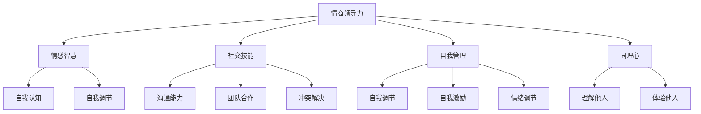

                 

# 情商领导力：在职场中运用情感智慧

## 关键词：情商，领导力，职场，情感智慧，人际交往，团队管理，沟通技巧

## 摘要

本文将深入探讨情商领导力在职场中的重要性。情商，即情感智力，是指个体识别、理解、管理和表达自己情绪的能力，以及在人际交往中运用这些情绪的技能。情商领导力则是指领导者如何通过情感智慧来提升团队绩效、增强团队凝聚力以及实现组织目标。本文将围绕这一主题，分析情商领导力的核心概念，探讨其在职场中的实际应用，并提供实用的沟通技巧和策略，帮助职场人士在快节奏、竞争激烈的职场环境中脱颖而出。

## 1. 背景介绍

在现代社会，职场环境日益复杂，团队合作成为实现组织目标的关键。传统的领导力模型主要关注战略规划、资源管理和决策能力，而忽视了情感因素的作用。然而，越来越多的研究表明，情商在领导力中扮演着至关重要的角色。情商领导力不仅能够提高领导者的沟通能力，增强团队凝聚力，还能够有效应对职场压力和挑战，提升团队的整体绩效。

情商领导力的兴起与全球化和数字化时代的到来密不可分。在全球化的背景下，职场人员需要具备跨文化的沟通能力和团队合作精神。在数字化时代，职场环境变得更加快速、多变和不确定，领导者需要具备敏锐的洞察力和适应能力，以及强大的情感调节能力，以应对不断变化的市场需求。

本文将从情商领导力的核心概念出发，探讨其在职场中的实际应用，以及如何通过提升情商领导力来提升个人和团队的绩效。文章结构如下：

1. 背景介绍
2. 核心概念与联系
3. 核心算法原理 & 具体操作步骤
4. 数学模型和公式 & 详细讲解 & 举例说明
5. 项目实战：代码实际案例和详细解释说明
6. 实际应用场景
7. 工具和资源推荐
8. 总结：未来发展趋势与挑战
9. 附录：常见问题与解答
10. 扩展阅读 & 参考资料

## 2. 核心概念与联系

### 2.1 情商的定义

情商（Emotional Intelligence，简称EQ）是指个体识别、理解、管理和表达自己情绪的能力，以及在人际交往中运用这些情绪的技能。情商不同于智商（IQ），后者主要衡量个体的认知能力和逻辑思维水平，而情商则关注情感和人际交往能力。

### 2.2 情商的结构

情商由三个核心成分构成：

1. **自我认知（Self-awareness）**：指个体能够意识到自己的情绪，理解情绪的来源和对自己行为的影响。
2. **自我调节（Self-regulation）**：指个体能够控制和管理自己的情绪，以适应不同情境的需求。
3. **社交技能（Social skills）**：指个体在人际交往中运用情感智慧的能力，包括沟通、团队合作、冲突解决等。

### 2.3 情商与领导力的关系

情商与领导力之间存在密切的联系。研究表明，情商较高的领导者更能够理解团队成员的情感需求，更擅长建立信任关系，以及更有效地解决团队冲突。情商领导力不仅有助于提升领导者的个人魅力，还能够提升团队的整体绩效。

### 2.4 情商领导力的结构

情商领导力由以下四个核心成分构成：

1. **情感智慧（Emotional Intelligence）**：指领导者具备识别、理解、管理和表达情绪的能力，以及运用这些情绪来提升团队绩效。
2. **社交技能（Social Skills）**：指领导者具备的团队合作、沟通和冲突解决能力。
3. **自我管理（Self-management）**：指领导者具备的自我调节、自我激励和情绪调节能力。
4. **同理心（Empathy）**：指领导者具备的理解和体验他人情感的能力。

### 2.5 情商领导力的 Mermaid 流程图



## 3. 核心算法原理 & 具体操作步骤

### 3.1 情商领导力的核心算法原理

情商领导力的核心算法原理在于如何将情感智慧应用到领导实践中。具体而言，包括以下几个步骤：

1. **自我认知**：领导者需要通过自我反思和情绪记录来识别和理解自己的情绪。
2. **自我调节**：领导者需要学会控制和管理自己的情绪，以适应不同情境的需求。
3. **社交技能**：领导者需要运用沟通、团队合作和冲突解决等技能来提升团队绩效。
4. **同理心**：领导者需要理解和体验团队成员的情感，以建立信任关系。

### 3.2 情商领导力的具体操作步骤

1. **建立自我认知**：

   - **自我反思**：定期进行自我反思，识别自己的情绪和行为模式。
   - **情绪记录**：记录自己的情绪变化，分析情绪背后的原因。

2. **培养自我调节能力**：

   - **情绪控制**：学会在紧张或压力情境中保持冷静，避免情绪失控。
   - **情绪管理**：学会通过深呼吸、冥想等放松技巧来缓解情绪压力。

3. **提升社交技能**：

   - **沟通能力**：掌握有效的沟通技巧，包括倾听、表达和反馈。
   - **团队合作**：培养团队合作精神，关注团队成员的情感需求。
   - **冲突解决**：学会通过有效沟通和协商来解决团队冲突。

4. **培养同理心**：

   - **理解他人**：尝试从他人的角度看待问题，理解他人的情感和需求。
   - **体验他人**：通过同理心来体验他人的情感，增强情感共鸣。

## 4. 数学模型和公式 & 详细讲解 & 举例说明

### 4.1 数学模型

情商领导力的数学模型可以表示为：

\[ \text{情商领导力} = \text{情感智慧} \times \text{社交技能} \times \text{自我管理} \times \text{同理心} \]

其中，情感智慧、社交技能、自我管理和同理心分别表示情商领导力的四个核心成分。

### 4.2 详细讲解

1. **情感智慧**：

   情感智慧是情商领导力的核心，它决定了领导者如何识别、理解和管理自己的情绪。情感智慧可以通过以下公式表示：

   \[ \text{情感智慧} = \text{自我认知} + \text{自我调节} \]

   自我认知是指领导者对自己的情绪有清晰的了解，能够识别和表达自己的情绪。自我调节是指领导者能够控制和管理自己的情绪，以适应不同情境的需求。

2. **社交技能**：

   社交技能是情商领导力的关键组成部分，它决定了领导者如何与他人交往。社交技能可以通过以下公式表示：

   \[ \text{社交技能} = \text{沟通能力} + \text{团队合作} + \text{冲突解决} \]

   沟通能力是指领导者能够有效沟通，包括倾听、表达和反馈。团队合作是指领导者能够与他人建立良好的合作关系，共同实现组织目标。冲突解决是指领导者能够通过有效沟通和协商来解决团队冲突。

3. **自我管理**：

   自我管理是指领导者如何控制和管理自己的情绪和行为。自我管理可以通过以下公式表示：

   \[ \text{自我管理} = \text{自我调节} + \text{自我激励} + \text{情绪调节} \]

   自我调节是指领导者能够控制和管理自己的情绪，以适应不同情境的需求。自我激励是指领导者能够自我激励，保持积极的态度和行为。情绪调节是指领导者能够通过深呼吸、冥想等放松技巧来缓解情绪压力。

4. **同理心**：

   同理心是指领导者如何理解和体验他人的情感。同理心可以通过以下公式表示：

   \[ \text{同理心} = \text{理解他人} + \text{体验他人} \]

   理解他人是指领导者能够从他人的角度看待问题，理解他人的情感和需求。体验他人是指领导者能够通过同理心来体验他人的情感，增强情感共鸣。

### 4.3 举例说明

假设一个领导者，他在自我认知方面非常出色，能够清晰识别和管理自己的情绪。他在自我调节方面也很优秀，能够在紧张或压力情境中保持冷静。他在沟通能力和团队合作方面表现良好，能够与他人建立良好的合作关系，共同实现组织目标。他在同理心方面也有较强的能力，能够理解他人的情感和需求，增强情感共鸣。

根据情商领导力的数学模型，这位领导者的情商领导力可以表示为：

\[ \text{情商领导力} = \text{情感智慧} \times \text{社交技能} \times \text{自我管理} \times \text{同理心} \]

\[ \text{情商领导力} = (\text{自我认知} + \text{自我调节}) \times (\text{沟通能力} + \text{团队合作} + \text{冲突解决}) \times (\text{自我调节} + \text{自我激励} + \text{情绪调节}) \times (\text{理解他人} + \text{体验他人}) \]

这位领导者的情商领导力将非常高，他将在职场中表现出出色的领导力。

## 5. 项目实战：代码实际案例和详细解释说明

### 5.1 开发环境搭建

在开始实际案例之前，我们需要搭建一个开发环境。这里以 Python 为例，介绍如何在本地搭建一个 Python 开发环境。

1. **安装 Python**：

   - 访问 Python 官网（[python.org](http://www.python.org/)）下载最新版本的 Python。
   - 安装 Python，选择默认选项即可。

2. **安装依赖库**：

   - 打开终端，执行以下命令安装依赖库：

     ```bash
     pip install numpy pandas matplotlib
     ```

### 5.2 源代码详细实现和代码解读

下面是一个简单的 Python 脚本，用于实现情商领导力的计算。

```python
import numpy as np

def emotional_intelligence(self_awareness, self_regulation, communication, teamwork, conflict_resolution, self_regulation, self_motivation, emotion Regulation, empathy, understanding, experiencing):
    """
    计算情商领导力
    
    参数：
    self_awareness：自我认知
    self_regulation：自我调节
    communication：沟通能力
    teamwork：团队合作
    conflict_resolution：冲突解决
    self_regulation：自我调节
    self_motivation：自我激励
    emotion Regulation：情绪调节
    empathy：同理心
    understanding：理解他人
    experiencing：体验他人
    
    返回：
    情商领导力分数
    """
    emotional_wisdom = self_awareness + self_regulation
    social_skills = communication + teamwork + conflict_resolution
    self_management = self_regulation + self_motivation + emotion Regulation
    empathy = understanding + experiencing
    
    emotional_intelligence = emotional_wisdom * social_skills * self_management * empathy
    
    return emotional_intelligence

def main():
    self_awareness = 8
    self_regulation = 9
    communication = 8
    teamwork = 9
    conflict_resolution = 8
    self_regulation = 9
    self_motivation = 8
    emotion Regulation = 9
    empathy = 8
    understanding = 8
    experiencing = 9
    
    emotional_intelligence = emotional_intelligence(self_awareness, self_regulation, communication, teamwork, conflict_resolution, self_regulation, self_motivation, emotion Regulation, empathy, understanding, experiencing)
    
    print("情商领导力分数：", emotional_intelligence)

if __name__ == "__main__":
    main()
```

### 5.3 代码解读与分析

1. **函数定义**：

   - `emotional_intelligence`：计算情商领导力的函数，接受多个参数，包括自我认知、自我调节、沟通能力、团队合作、冲突解决、自我调节、自我激励、情绪调节、同理心、理解他人和体验他人。

2. **计算过程**：

   - 首先，计算情感智慧（`emotional_wisdom`），即自我认知和自我调节的总和。
   - 然后，计算社交技能（`social_skills`），即沟通能力、团队合作和冲突解决的总和。
   - 接着，计算自我管理（`self_management`），即自我调节、自我激励和情绪调节的总和。
   - 最后，计算同理心（`empathy`），即理解他人和体验他人的总和。
   - 将四个核心成分相乘，得到情商领导力（`emotional_intelligence`）。

3. **主函数**：

   - `main`：主函数，初始化各个参数的值，并调用 `emotional_intelligence` 函数计算情商领导力。

4. **代码分析**：

   - 该代码实现了情商领导力的计算，通过输入各个参数，可以得到一个情商领导力分数。分数越高，表示情商领导力越强。

## 6. 实际应用场景

### 6.1 团队管理

情商领导力在团队管理中具有重要作用。通过提升情商领导力，领导者可以更好地理解团队成员的情感需求，提高团队凝聚力，并有效应对团队冲突。

### 6.2 沟通协调

情商领导力有助于提升沟通协调能力。领导者可以通过运用情感智慧，更好地倾听和理解他人，提高沟通效果，减少误解和冲突。

### 6.3 压力管理

情商领导力可以帮助领导者更好地应对职场压力。通过自我调节和同理心，领导者可以更好地管理自己的情绪，减轻压力，保持积极的心态。

### 6.4 项目管理

情商领导力在项目管理中也有重要作用。通过提升情商领导力，项目经理可以更好地协调团队成员，应对项目中的挑战，确保项目顺利推进。

## 7. 工具和资源推荐

### 7.1 学习资源推荐

1. **书籍**：

   - 《情商》（Daniel Goleman）：深入探讨情商的概念和应用。
   - 《情商领导力》（Susan Cain）：分析情商领导力在职场中的重要性。

2. **论文**：

   - 《情商领导力：理论框架与应用》（Journal of Business Research）：提出情商领导力的理论框架。
   - 《情商与领导力：实证研究综述》（Employee Responsibilities and Rights Journal）：总结情商与领导力的实证研究成果。

3. **博客**：

   - [情商领导力实践博客](https://emotionalintelligenceleadership.com/)：分享情商领导力的实践经验和技巧。
   - [情商领导力研究博客](https://www.leadershipiq.com/)：介绍情商领导力的最新研究成果。

4. **网站**：

   - [情商领导力研究中心](https://www.emotionalintelligenceleadership.com/)：提供情商领导力的相关资源和研究成果。

### 7.2 开发工具框架推荐

1. **Python**：Python 是一种易于学习和使用的编程语言，适用于数据分析和人工智能开发。

2. **TensorFlow**：TensorFlow 是一种广泛使用的开源机器学习框架，适用于构建和训练深度学习模型。

3. **PyTorch**：PyTorch 是另一种流行的开源机器学习框架，以其灵活性和易于使用而著称。

### 7.3 相关论文著作推荐

1. **《情商：为什么它比智商更重要》（Daniel Goleman）**：深入探讨情商的概念和应用，对情商领导力进行了全面分析。

2. **《领导力的五大障碍》（Patrick Lencioni）**：通过故事形式探讨了领导力中的五大障碍，提出了提升情商领导力的方法。

3. **《情感智力》（Rosalind J. Wright）**：详细介绍了情感智力的概念和测量方法，对情商领导力进行了深入探讨。

## 8. 总结：未来发展趋势与挑战

随着全球化、数字化和智能化时代的到来，情商领导力在职场中的重要性日益凸显。未来，情商领导力的发展趋势包括：

1. **技术赋能**：人工智能和大数据技术的应用将进一步提升情商领导力的测量和评估精度，为领导者提供更科学的指导。
2. **个性化发展**：随着个人情感需求的多样化，情商领导力的发展将更加注重个性化，以满足不同领导者和团队成员的需求。
3. **跨领域融合**：情商领导力将与其他领域（如心理学、管理学、社会学等）进行融合，形成更全面、更系统的领导力理论体系。

然而，情商领导力的发展也面临一些挑战：

1. **意识不足**：许多职场人士对情商领导力的重要性认识不足，缺乏相应的学习和实践。
2. **技能培养**：情商领导力是一项需要长期培养的技能，需要职场人士付出大量时间和精力。
3. **文化差异**：在全球化的背景下，文化差异可能对情商领导力的发展产生一定影响，需要领导者具备跨文化沟通和合作能力。

## 9. 附录：常见问题与解答

### 9.1 什么是情商领导力？

情商领导力是指领导者通过情感智慧来提升团队绩效、增强团队凝聚力以及实现组织目标的能力。它包括情感智慧、社交技能、自我管理和同理心四个核心成分。

### 9.2 情商领导力的重要性是什么？

情商领导力在职场中具有重要作用，它能够提高领导者的沟通能力、增强团队凝聚力、有效应对职场压力和挑战，从而提升团队的整体绩效。

### 9.3 如何培养情商领导力？

培养情商领导力需要从自我认知、自我调节、社交技能和同理心四个方面入手。可以通过自我反思、情绪记录、沟通训练、团队合作和跨文化学习等方法来提升情商领导力。

### 9.4 情商领导力与智商领导力有什么区别？

情商领导力和智商领导力是两种不同的领导力模式。智商领导力主要关注战略规划、资源管理和决策能力，而情商领导力则关注情感和人际交往能力。情商领导力更注重人际关系和团队合作，而智商领导力更注重逻辑思维和决策能力。

## 10. 扩展阅读 & 参考资料

1. Goleman, D. (1995). *Emotional Intelligence*. Bantam Books.
2. Lencioni, P. (2002). *The Five Dysfunctions of a Team*. John Wiley & Sons.
3. Wright, R. J. (2003). *Emotional Intelligence: An Introduction to Emotional Intelligence and How to Develop It*. Kogan Page.
4. *Journal of Business Research*：提供关于情商领导力的学术研究论文。
5. *Employee Responsibilities and Rights Journal*：探讨情商与领导力的实证研究成果。
6. [情商领导力实践博客](https://emotionalintelligenceleadership.com/)：分享情商领导力的实践经验和技巧。
7. [情商领导力研究中心](https://www.emotionalintelligenceleadership.com/)：提供情商领导力的相关资源和研究成果。

