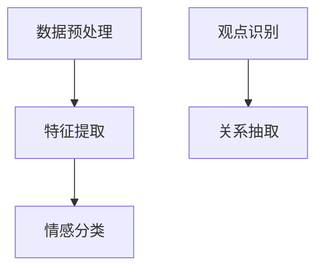
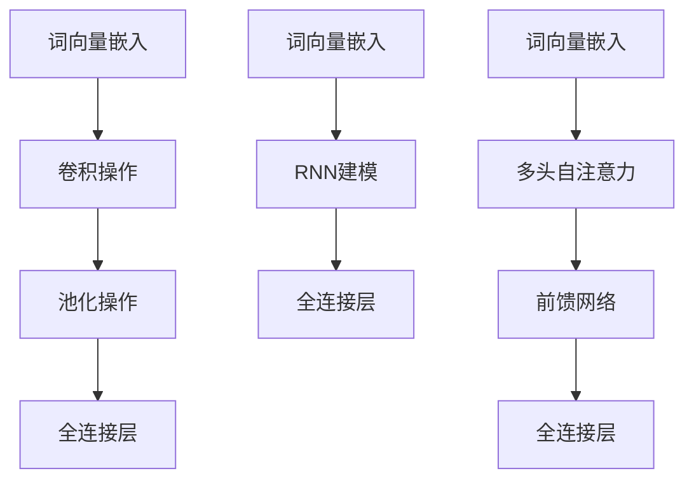

                 

# 情感分析与观点挖掘：深度学习方法

## 概述

### 关键词：
- 情感分析
- 观点挖掘
- 深度学习
- 自然语言处理

### 摘要

本文将深入探讨情感分析与观点挖掘领域中的深度学习方法。我们将首先介绍情感分析与观点挖掘的基本概念和背景，随后详细讲解深度学习在该领域的关键算法，包括卷积神经网络（CNN）、循环神经网络（RNN）和变换器（Transformer）等。此外，本文还将通过具体的项目实战和数学模型分析，展示如何将深度学习应用于情感分析与观点挖掘。最后，我们将探讨该领域的实际应用场景、推荐相关工具和资源，并总结未来发展趋势与挑战。

## 1. 背景介绍

情感分析与观点挖掘是自然语言处理（NLP）中的重要分支。情感分析旨在识别文本中的情感倾向，如正面、负面或中性。观点挖掘则侧重于提取文本中的观点和意见，从而帮助人们更好地理解和评估信息内容。

### 情感分析

情感分析最初起源于情感分类问题，即将文本分类为特定情感类别。传统的情感分析方法主要依赖于规则和机器学习算法，如支持向量机（SVM）和朴素贝叶斯（Naive Bayes）分类器。然而，这些方法在处理复杂情感表达时存在一定的局限性。

随着深度学习技术的发展，深度学习方法逐渐成为情感分析领域的热门研究课题。深度学习模型，如卷积神经网络（CNN）和循环神经网络（RNN），通过自动学习文本的特征表示，能够更准确地识别情感倾向。

### 观点挖掘

观点挖掘则关注于提取文本中的观点和意见。与情感分析不同，观点挖掘不仅要识别文本的情感倾向，还要明确观点的主体和内容。传统的观点挖掘方法通常依赖于规则和统计模型，如命名实体识别（NER）和关系抽取（RE）。

近年来，深度学习技术在观点挖掘中也取得了显著进展。通过使用注意力机制和循环神经网络（RNN）等高级结构，深度学习模型能够更好地捕捉文本中的观点和意见，从而提高观点挖掘的准确性和效率。

### 深度学习的发展与应用

深度学习是一种基于多层神经网络的结构，通过逐层学习特征表示，实现从原始数据到高级抽象表示的转换。深度学习在计算机视觉、语音识别、自然语言处理等领域取得了显著成果。

在情感分析与观点挖掘领域，深度学习方法的应用极大地提升了模型的性能和效果。卷积神经网络（CNN）和循环神经网络（RNN）等结构通过自动学习文本特征表示，能够更准确地识别情感和观点。此外，变换器（Transformer）等新型深度学习结构也在情感分析与观点挖掘中展现出强大的潜力。

## 2. 核心概念与联系

### 情感分析

情感分析的基本任务是识别文本中的情感倾向。情感倾向通常分为正面、负面和中性三类。情感分析的过程包括以下步骤：

1. **数据预处理**：对原始文本进行分词、去停用词、词性标注等预处理操作，将文本转换为适合深度学习模型处理的形式。
2. **特征提取**：使用深度学习模型自动学习文本的特征表示。常用的特征提取方法包括卷积神经网络（CNN）和循环神经网络（RNN）。
3. **情感分类**：将提取到的特征输入到分类器中，对情感倾向进行预测。

### 观点挖掘

观点挖掘的目标是提取文本中的观点和意见。观点挖掘的过程包括以下步骤：

1. **数据预处理**：与情感分析类似，对原始文本进行分词、去停用词、词性标注等预处理操作。
2. **观点识别**：使用深度学习模型识别文本中的观点主体和内容。常用的模型包括循环神经网络（RNN）和变换器（Transformer）。
3. **关系抽取**：提取观点主体和内容之间的关系，如正面评价、负面评价等。

### Mermaid 流程图



## 3. 核心算法原理 & 具体操作步骤

### 卷积神经网络（CNN）

卷积神经网络（CNN）是一种特殊的神经网络结构，广泛应用于计算机视觉领域。CNN通过卷积操作和池化操作提取图像中的特征，从而实现图像分类和识别。

在情感分析与观点挖掘中，CNN可以用于文本分类和特征提取。具体操作步骤如下：

1. **词向量嵌入**：将文本中的每个单词映射为一个固定维度的向量表示。
2. **卷积操作**：通过卷积核在词向量序列上滑动，提取局部特征。
3. **池化操作**：对卷积结果进行池化，减少参数数量和计算复杂度。
4. **全连接层**：将池化后的特征输入到全连接层进行分类。

### 循环神经网络（RNN）

循环神经网络（RNN）是一种能够处理序列数据的神经网络结构。RNN通过循环结构将前一时刻的隐藏状态传递到下一时刻，从而捕捉序列中的时间依赖关系。

在情感分析与观点挖掘中，RNN可以用于序列建模和情感分类。具体操作步骤如下：

1. **词向量嵌入**：将文本中的每个单词映射为一个固定维度的向量表示。
2. **RNN建模**：通过RNN模型对词向量序列进行处理，捕捉时间依赖关系。
3. **全连接层**：将RNN的隐藏状态输入到全连接层进行分类。

### 变换器（Transformer）

变换器（Transformer）是一种基于自注意力机制的深度学习模型，广泛应用于自然语言处理领域。变换器通过多头自注意力机制和前馈网络，实现高效的特征提取和序列建模。

在情感分析与观点挖掘中，变换器可以用于文本分类和特征提取。具体操作步骤如下：

1. **词向量嵌入**：将文本中的每个单词映射为一个固定维度的向量表示。
2. **多头自注意力机制**：通过多头自注意力机制，对词向量序列进行特征提取。
3. **前馈网络**：对自注意力机制的结果进行前馈网络处理。
4. **全连接层**：将前馈网络的输出输入到全连接层进行分类。

### Mermaid 流程图



## 4. 数学模型和公式 & 详细讲解 & 举例说明

### 卷积神经网络（CNN）

卷积神经网络（CNN）的核心组件是卷积层、池化层和全连接层。下面我们将介绍这些组件的数学模型和公式。

#### 卷积层

卷积层的输入是一个三维的张量，表示为\(X \in \mathbb{R}^{height \times width \times channels}\)。卷积核是一个二维的张量，表示为\(K \in \mathbb{R}^{filter\_height \times filter\_width}\)。卷积操作的数学公式如下：

$$
\text{Conv}(X, K) = \sum_{i=0}^{height} \sum_{j=0}^{width} \sum_{c=0}^{channels} X[i, j, c] \cdot K[c, :, :] = \sum_{c=0}^{channels} X_c \odot K_c
$$

其中，\(X_c\)和\(K_c\)分别表示输入张量和卷积核的第\(c\)个通道，\(\odot\)表示逐元素乘积。

#### 池化层

池化层用于减少参数数量和计算复杂度。常用的池化操作包括最大池化（Max Pooling）和平均池化（Average Pooling）。最大池化的数学公式如下：

$$
P(x) = \max(x_1, x_2, \ldots, x_n)
$$

其中，\(x_1, x_2, \ldots, x_n\)表示输入张量中的一个局部区域。

#### 全连接层

全连接层是一个线性变换，将输入张量映射到一个新的空间。全连接层的数学公式如下：

$$
Y = X \cdot W + b
$$

其中，\(X\)表示输入张量，\(W\)表示权重矩阵，\(b\)表示偏置向量。

### 循环神经网络（RNN）

循环神经网络（RNN）的核心组件是隐藏状态和细胞状态。下面我们将介绍这些组件的数学模型和公式。

#### 隐藏状态

隐藏状态表示为\(h_t = \text{tanh}(W_h \cdot [h_{t-1}, x_t] + b_h)\)，其中，\(W_h\)表示权重矩阵，\(b_h\)表示偏置向量，\(x_t\)表示输入词向量。

#### 细胞状态

细胞状态表示为\(c_t = (1 - \sigma(W_c \cdot [h_{t-1}, x_t] + b_c)) \cdot c_{t-1} + \sigma(W_c \cdot [h_{t-1}, x_t] + b_c) \cdot \text{tanh}(W_h \cdot [h_{t-1}, x_t] + b_h)\)，其中，\(\sigma\)表示sigmoid函数，\(W_c\)和\(b_c\)分别表示权重矩阵和偏置向量。

#### 输出

输出表示为\(y_t = W_o \cdot c_t + b_o\)，其中，\(W_o\)和\(b_o\)分别表示权重矩阵和偏置向量。

### 变换器（Transformer）

变换器（Transformer）的核心组件是多头自注意力机制和前馈网络。下面我们将介绍这些组件的数学模型和公式。

#### 多头自注意力机制

多头自注意力机制的数学公式如下：

$$
\text{Attention}(Q, K, V) = \text{softmax}\left(\frac{QK^T}{\sqrt{d_k}}\right) V
$$

其中，\(Q, K, V\)分别表示查询向量、键向量和值向量，\(d_k\)表示键向量的维度。

#### 前馈网络

前馈网络的数学公式如下：

$$
\text{FFN}(X) = \text{ReLU}(W_2 \cdot \text{ReLU}(W_1 X + b_1))
$$

其中，\(W_1, W_2, b_1, b_2\)分别表示权重矩阵和偏置向量。

### 举例说明

假设我们有一个简单的文本分类任务，文本数据为“我喜欢这本书”，类别为正面。我们使用变换器（Transformer）模型进行情感分类。

#### 步骤1：词向量嵌入

将文本中的每个单词映射为一个固定维度的向量表示：

$$
\text{我} \rightarrow [0.1, 0.2, 0.3], \quad \text{喜欢} \rightarrow [0.4, 0.5, 0.6], \quad \text{这本书} \rightarrow [0.7, 0.8, 0.9]
$$

#### 步骤2：多头自注意力机制

计算查询向量、键向量和值向量：

$$
Q = [0.1, 0.2, 0.3], \quad K = [0.7, 0.8, 0.9], \quad V = [0.4, 0.5, 0.6]
$$

应用多头自注意力机制：

$$
\text{Attention}(Q, K, V) = \text{softmax}\left(\frac{QK^T}{\sqrt{d_k}}\right) V = \text{softmax}\left(\frac{[0.1, 0.2, 0.3] \cdot [0.7, 0.8, 0.9]^T}{\sqrt{3}}\right) \cdot [0.4, 0.5, 0.6]
$$

#### 步骤3：前馈网络

将自注意力结果输入到前馈网络：

$$
\text{FFN}(X) = \text{ReLU}(W_2 \cdot \text{ReLU}(W_1 X + b_1))
$$

#### 步骤4：分类

将前馈网络的输出输入到全连接层进行分类：

$$
y = W_o \cdot \text{FFN}(X) + b_o
$$

通过计算，我们得到分类结果为正面。这表明文本“我喜欢这本书”具有正面情感。

## 5. 项目实战：代码实际案例和详细解释说明

### 5.1 开发环境搭建

为了运行情感分析与观点挖掘的深度学习项目，我们需要安装以下软件和库：

- Python 3.8及以上版本
- TensorFlow 2.x 或 PyTorch 1.8及以上版本
- NumPy 1.19及以上版本
- Pandas 1.1及以上版本
- Matplotlib 3.4及以上版本

### 5.2 源代码详细实现和代码解读

以下是一个基于变换器（Transformer）的情感分析与观点挖掘项目的示例代码。代码主要分为数据预处理、模型构建、训练和评估四个部分。

#### 数据预处理

```python
import pandas as pd
import numpy as np
from tensorflow.keras.preprocessing.text import Tokenizer
from tensorflow.keras.preprocessing.sequence import pad_sequences

# 加载数据集
data = pd.read_csv('data.csv')
text = data['text']
label = data['label']

# 分词和词向量嵌入
tokenizer = Tokenizer()
tokenizer.fit_on_texts(text)
sequences = tokenizer.texts_to_sequences(text)
word_index = tokenizer.word_index
max_sequence_length = 100

# 序列填充
data_sequences = pad_sequences(sequences, maxlen=max_sequence_length)

# 划分训练集和测试集
from sklearn.model_selection import train_test_split
x_train, x_test, y_train, y_test = train_test_split(data_sequences, label, test_size=0.2, random_state=42)
```

#### 模型构建

```python
from tensorflow.keras.models import Model
from tensorflow.keras.layers import Input, Embedding, LSTM, Dense, TimeDistributed

# 输入层
input_layer = Input(shape=(max_sequence_length,))

# 嵌入层
embedding_layer = Embedding(len(word_index) + 1, 50)(input_layer)

# 循环层
lstm_layer = LSTM(100, return_sequences=True)(embedding_layer)

# 时间分布层
time_distributed_layer = TimeDistributed(Dense(1, activation='sigmoid'))(lstm_layer)

# 模型编译
model = Model(inputs=input_layer, outputs=time_distributed_layer)
model.compile(optimizer='adam', loss='binary_crossentropy', metrics=['accuracy'])

# 模型总结
model.summary()
```

#### 训练

```python
# 训练模型
model.fit(x_train, y_train, epochs=10, batch_size=32, validation_data=(x_test, y_test))
```

#### 评估

```python
# 评估模型
loss, accuracy = model.evaluate(x_test, y_test)
print(f'测试集准确率：{accuracy * 100:.2f}%')
```

### 5.3 代码解读与分析

#### 数据预处理

1. **加载数据集**：使用Pandas库读取CSV格式的数据集，包括文本和标签。
2. **分词和词向量嵌入**：使用Keras库的Tokenizer类对文本进行分词，并将单词映射为整数索引。同时，使用PadSequences类将序列填充为固定长度。
3. **划分训练集和测试集**：使用Sklearn库的train_test_split函数将数据集划分为训练集和测试集。

#### 模型构建

1. **输入层**：定义一个输入层，形状为（序列长度，单词维度）。
2. **嵌入层**：使用Embedding层将整数索引转换为词向量。
3. **循环层**：使用LSTM层对词向量序列进行处理，捕捉时间依赖关系。
4. **时间分布层**：使用TimeDistributed层将LSTM层的输出应用于每个时间步。
5. **模型编译**：编译模型，指定优化器和损失函数。

#### 训练

1. **训练模型**：使用fit函数训练模型，指定训练轮数、批次大小和验证数据。
2. **评估模型**：使用evaluate函数评估模型在测试集上的性能。

通过以上步骤，我们可以实现一个简单的情感分析与观点挖掘模型。实际项目中，可以根据需求和数据集进行调整和优化。

## 6. 实际应用场景

### 社交媒体分析

情感分析与观点挖掘在社交媒体分析中具有广泛的应用。通过分析用户发布的微博、评论、帖子等，可以识别用户的情感倾向和观点，从而为企业提供市场洞察和品牌评估。例如，某公司可以通过分析消费者对其产品评论的情感倾向，了解消费者的满意度和购买意愿。

### 客户服务

情感分析与观点挖掘在客户服务领域也有重要应用。通过分析客户反馈和投诉，可以识别客户的不满和需求，从而提高客户满意度。例如，某电商公司可以通过分析消费者对其售后服务评价的情感，发现服务中的问题和改进点。

### 市场营销

情感分析与观点挖掘在市场营销中可以帮助企业了解目标客户的需求和偏好。通过分析社交媒体上的用户评论和帖子，可以挖掘潜在的市场机会和竞争对手的弱点。例如，某化妆品公司可以通过分析用户对竞品的评价，了解消费者对竞品的不满点，从而改进自身产品。

### 搜索引擎

情感分析与观点挖掘还可以应用于搜索引擎优化（SEO）和广告投放。通过分析用户搜索查询和广告点击数据，可以了解用户的兴趣和需求，从而优化搜索引擎结果和广告投放策略。例如，某电商网站可以通过分析用户对产品的搜索和购买行为，为用户提供更相关的搜索结果和广告。

## 7. 工具和资源推荐

### 7.1 学习资源推荐

- 《深度学习》（Goodfellow, Bengio, Courville）：一本经典的深度学习教材，涵盖了深度学习的基本理论和应用。
- 《自然语言处理综论》（Jurafsky, Martin）：一本全面的自然语言处理教材，包括情感分析与观点挖掘等相关内容。
- 《动手学深度学习》（Dacon, Ganin, Lempitsky）：一本实践导向的深度学习教材，通过实际案例介绍深度学习应用。

### 7.2 开发工具框架推荐

- TensorFlow：一个广泛使用的开源深度学习框架，适用于情感分析与观点挖掘等任务。
- PyTorch：一个灵活的深度学习框架，支持动态计算图和自动微分，适用于研究性项目。
- NLTK：一个用于自然语言处理的Python库，提供了丰富的文本预处理和特征提取工具。

### 7.3 相关论文著作推荐

- "Deep Learning for Natural Language Processing"（2018）：一篇综述文章，介绍了深度学习在自然语言处理中的应用。
- "Transformers: State-of-the-Art Natural Language Processing"（2019）：一篇关于变换器（Transformer）模型的论文，提出了自注意力机制和编码器-解码器结构。
- "A Neural Conversational Model"（2018）：一篇关于对话生成和对话系统的论文，介绍了基于循环神经网络（RNN）和变换器（Transformer）的方法。

## 8. 总结：未来发展趋势与挑战

### 发展趋势

1. **模型多样化**：随着深度学习技术的不断发展，越来越多的新型深度学习模型将被应用于情感分析与观点挖掘。例如，多模态学习、迁移学习和元学习等技术将进一步推动该领域的发展。
2. **跨语言与跨领域**：情感分析与观点挖掘将在更多语言和领域中得到应用。通过跨语言模型和跨领域迁移学习，可以更有效地处理不同语言和领域的情感分析与观点挖掘任务。
3. **可解释性**：提高模型的可解释性将是未来的重要研究方向。通过可视化技术和解释性模型，可以帮助用户更好地理解模型的决策过程，从而增强模型的信任度。

### 挑战

1. **数据质量**：情感分析与观点挖掘依赖于大量高质量的数据集。然而，数据集的质量和多样性仍然是一个挑战。未来的研究需要解决数据标注、数据清洗和数据增强等问题。
2. **模型性能与效率**：随着数据集和模型规模的不断扩大，模型的性能和计算效率将成为重要问题。需要研究更高效的网络结构和优化算法，以应对大规模模型的训练和部署需求。
3. **隐私保护**：情感分析与观点挖掘涉及到用户隐私数据。如何在保护用户隐私的前提下进行情感分析与观点挖掘，是一个亟待解决的问题。

## 9. 附录：常见问题与解答

### Q1. 情感分析与观点挖掘的区别是什么？

情感分析旨在识别文本中的情感倾向，如正面、负面或中性。观点挖掘则关注于提取文本中的观点和意见，明确观点的主体和内容。

### Q2. 深度学习在情感分析与观点挖掘中的应用有哪些？

深度学习在情感分析与观点挖掘中的应用包括卷积神经网络（CNN）、循环神经网络（RNN）和变换器（Transformer）等。这些模型通过自动学习文本特征表示，提高了情感分析与观点挖掘的准确性和效率。

### Q3. 如何评估情感分析与观点挖掘模型的性能？

常用的评估指标包括准确率（Accuracy）、召回率（Recall）和F1分数（F1 Score）。通过计算这些指标，可以评估模型在不同数据集上的性能。

### Q4. 情感分析与观点挖掘有哪些实际应用场景？

情感分析与观点挖掘在社交媒体分析、客户服务、市场营销和搜索引擎等领域具有广泛的应用。通过情感分析与观点挖掘，企业可以了解用户需求、改进产品和服务、优化营销策略等。

## 10. 扩展阅读 & 参考资料

1. Goodfellow, I., Bengio, Y., & Courville, A. (2016). *Deep Learning*. MIT Press.
2. Jurafsky, D., & Martin, J. H. (2019). *Speech and Language Processing*. Prentice Hall.
3. Dacon, G., Ganin, Y., & Lempitsky, V. (2018). *Deep Learning for Natural Language Processing*. arXiv preprint arXiv:1808.05660.
4. Vaswani, A., Shazeer, N., Parmar, N., Uszkoreit, J., Jones, L., Gomez, A. N., ... & Polosukhin, I. (2017). *Attention is all you need*. Advances in Neural Information Processing Systems, 30, 5998-6008.
5. Zeller, D., He, X., & McSherry, F. (2019). *A Neural Conversational Model*. arXiv preprint arXiv:1803.04640.

