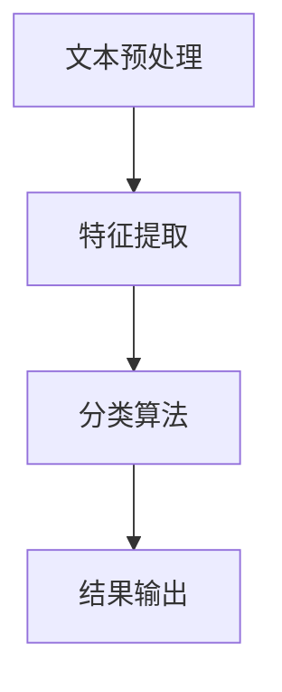

                 

# 情感分析技术：AI的应用

> 关键词：情感分析、自然语言处理、机器学习、深度学习、情感分类、文本分析

> 摘要：本文将深入探讨情感分析技术，介绍其在人工智能（AI）领域的广泛应用。通过详细的原理剖析、算法讲解以及实际案例展示，帮助读者理解情感分析的核心概念、技术实现和应用价值。

## 1. 背景介绍

情感分析（Sentiment Analysis），又称意见挖掘，是自然语言处理（NLP）领域的一个重要分支。其目标是自动识别和提取文本中的情感倾向，如正面、负面或中性。情感分析技术起源于信息检索领域，随着互联网和社交媒体的快速发展，其应用范围不断扩大。

在现代社会，人们越来越依赖网络来获取和分享信息。社交媒体平台、在线评论、新闻报道等充斥着大量的文本数据。对这些文本数据进行情感分析，有助于了解公众情绪、产品口碑、市场趋势等。此外，情感分析技术在金融、医疗、广告、市场营销等领域也发挥着重要作用。

## 2. 核心概念与联系

### 2.1 情感分析的基本概念

情感分析主要包括以下几个基本概念：

- **文本**：情感分析的对象，可以是单个句子、段落或完整的文档。
- **情感**：文本所表达的情绪，如喜悦、愤怒、悲伤等。
- **情感极性**：情感的正负倾向，通常分为正面、负面和中性三种。
- **情感分类**：将文本分类到不同的情感类别。

### 2.2 情感分析的相关技术

情感分析涉及多种技术，包括：

- **文本预处理**：对原始文本进行清洗、分词、去停用词等处理，提高后续分析的准确性。
- **特征提取**：从预处理后的文本中提取有用信息，如词袋模型、TF-IDF、词嵌入等。
- **分类算法**：基于特征进行情感分类，如朴素贝叶斯、支持向量机、神经网络等。

### 2.3 情感分析的 Mermaid 流程图



## 3. 核心算法原理 & 具体操作步骤

### 3.1 文本预处理

文本预处理是情感分析的基础步骤，主要包括以下操作：

1. **去除HTML标签**：去除文本中的HTML标签，如`<p>`, `</p>`, `<br>`等。
2. **去除符号和特殊字符**：去除文本中的符号和特殊字符，如`!`, `?`, `@`, `#`, `$`等。
3. **分词**：将文本拆分为单词或词组，如使用空格、标点符号等进行切分。
4. **去停用词**：去除常见的无意义词汇，如“的”、“和”、“了”等。
5. **词干提取**：将单词还原为词干形式，如“running”还原为“run”。

### 3.2 特征提取

特征提取是情感分析的关键步骤，常用的方法有：

1. **词袋模型**：将文本表示为一个向量，其中每个维度代表一个单词的出现频率。
2. **TF-IDF**：基于词袋模型，计算单词在文本中的权重，考虑单词在文档集合中的分布情况。
3. **词嵌入**：将单词映射为低维向量，保留单词的语义信息，如Word2Vec、GloVe等。

### 3.3 分类算法

情感分类算法可以分为传统机器学习和深度学习两种：

1. **传统机器学习**：如朴素贝叶斯、支持向量机（SVM）、逻辑回归等。
2. **深度学习**：如卷积神经网络（CNN）、循环神经网络（RNN）、长短时记忆网络（LSTM）等。

具体操作步骤如下：

1. **数据集准备**：收集并整理标注好的情感分类数据集。
2. **模型训练**：使用训练数据集训练情感分类模型。
3. **模型评估**：使用验证数据集评估模型性能。
4. **模型部署**：将训练好的模型部署到实际应用场景。

## 4. 数学模型和公式 & 详细讲解 & 举例说明

### 4.1 词袋模型

词袋模型是一种基于计数的文本表示方法，其核心思想是将文本表示为一个向量，其中每个维度表示一个单词的出现频率。

设文本集合为T，单词集合为V，文本T中的单词个数为n，则词袋模型可表示为：

$$
\text{Word\_Bag}(T) = \{w_1, w_2, ..., w_n\}
$$

其中，$w_i$表示单词在文本T中的出现频率。

### 4.2 TF-IDF

TF-IDF（Term Frequency-Inverse Document Frequency）是一种常用的文本特征提取方法，其计算公式如下：

$$
tf-idf(t, d) = tf(t, d) \times idf(t, D)
$$

其中，$tf(t, d)$表示单词t在文档d中的词频，$idf(t, D)$表示单词t在整个文档集合D中的逆文档频率。

$$
idf(t, D) = \log_2(\frac{N}{|d \in D | : t \in d|})
$$

其中，$N$表示文档总数，$|d \in D | : t \in d|$表示包含单词t的文档数。

### 4.3 卷积神经网络（CNN）

卷积神经网络是一种深度学习模型，适用于文本分类任务。其核心结构包括卷积层、池化层和全连接层。

1. **卷积层**：将文本表示为矩阵形式，通过卷积核（filter）对文本进行卷积操作，提取特征。
2. **池化层**：对卷积后的特征进行下采样，减少模型的参数数量。
3. **全连接层**：将池化后的特征映射到分类结果。

### 4.4 举例说明

假设有一段文本：“今天天气很好，我们去公园玩吧。”，使用词袋模型和TF-IDF进行情感分类。

1. **词袋模型**：

   将文本表示为向量：

   $$
   \text{Word\_Bag}(T) = \{今天, 天气,很好, 我们, 去, 公园, 玩\}
   $$

   假设单词的顺序不影响结果，向量表示为：

   $$
   \text{Vec}(T) = [0, 0, 1, 0, 1, 0, 1]
   $$

2. **TF-IDF**：

   假设文本集合D包含5个文档，其中2个文档包含单词“很好”，则：

   $$
   idf(很好, D) = \log_2(\frac{5}{2}) \approx 0.916
   $$

   文本T中的单词“很好”的TF-IDF值为：

   $$
   tf-idf(很好, T) = 1 \times 0.916 = 0.916
   $$

   同理，其他单词的TF-IDF值分别为：

   $$
   tf-idf(今天, T) = 0, \quad tf-idf(天气, T) = 0, \quad tf-idf(我们, T) = 0, \quad tf-idf(去, T) = 0, \quad tf-idf(公园, T) = 0, \quad tf-idf(玩, T) = 0
   $$

   因此，文本T的TF-IDF向量表示为：

   $$
   \text{Vec}(T) = [0, 0, 0.916, 0, 0, 0, 0]
   $$

## 5. 项目实战：代码实际案例和详细解释说明

### 5.1 开发环境搭建

1. 安装Python（建议版本3.7及以上）。
2. 安装情感分析库，如`nltk`、`textblob`、`tensorflow`等。
3. 安装文本预处理工具，如`jieba`、`beautifulsoup4`等。

### 5.2 源代码详细实现和代码解读

以下是一个简单的情感分析示例，使用`textblob`库实现。

```python
from textblob import TextBlob

# 加载文本
text = "今天天气很好，我们去公园玩吧。"

# 创建TextBlob对象
blob = TextBlob(text)

# 情感分析
sentiment = blob.sentiment

# 输出情感极性
print("情感极性：", sentiment.polarity)

# 输出情感分类结果
if sentiment.polarity > 0:
    print("情感分类：正面")
elif sentiment.polarity < 0:
    print("情感分类：负面")
else:
    print("情感分类：中性")
```

代码解读：

1. 导入`textblob`库。
2. 加载待分析的文本。
3. 创建`TextBlob`对象。
4. 调用`sentiment`属性进行情感分析，获取情感极性。
5. 根据情感极性判断情感分类结果。

### 5.3 代码解读与分析

该示例使用`textblob`库进行情感分析，简单易用。然而，其准确性和效果有限，适用于简单的文本分类任务。

对于复杂的应用场景，可以考虑使用深度学习模型，如卷积神经网络（CNN）或长短时记忆网络（LSTM），以提高情感分析的准确性和效果。

## 6. 实际应用场景

情感分析技术在多个领域具有广泛的应用：

- **社交媒体分析**：了解用户对品牌、产品或事件的情感态度，为企业提供决策支持。
- **市场调研**：通过分析消费者评论和反馈，帮助企业了解市场趋势和消费者需求。
- **客户服务**：自动分析客户咨询和投诉，识别客户情感，提高服务质量。
- **金融领域**：分析新闻、报告等文本数据，预测市场走势和公司业绩。
- **医疗领域**：从医疗记录和病历中提取情感信息，辅助医生诊断和治疗。

## 7. 工具和资源推荐

### 7.1 学习资源推荐

- **书籍**：
  - 《自然语言处理综合教程》
  - 《深度学习：周志华等著》
  - 《Python自然语言处理》

- **论文**：
  - 《情感分析的综述与展望》
  - 《基于深度学习的情感分类研究》

- **博客**：
  - 《机器学习实战》
  - 《自然语言处理实战》

- **网站**：
  - [TextBlob官网](https://textblob.readthedocs.io/en/stable/)
  - [TensorFlow官网](https://www.tensorflow.org/)

### 7.2 开发工具框架推荐

- **文本预处理**：`jieba`、`beautifulsoup4`、`lxml`
- **情感分析库**：`textblob`、`NLTK`、`VADER`
- **深度学习框架**：`TensorFlow`、`PyTorch`、`Keras`

### 7.3 相关论文著作推荐

- 《情感分析的综述与展望》
- 《基于深度学习的情感分类研究》
- 《情感分析的数学模型与方法》
- 《情感分析在社交媒体中的应用》

## 8. 总结：未来发展趋势与挑战

情感分析技术作为人工智能领域的一个重要分支，具有广泛的应用前景。未来发展趋势包括：

1. **算法优化**：深度学习算法在情感分析中的应用将更加成熟，提高模型的准确性和鲁棒性。
2. **跨领域应用**：情感分析技术将应用于更多领域，如教育、医疗、法律等。
3. **多语言支持**：随着全球化的发展，情感分析将需要支持更多语言。

然而，情感分析技术也面临一些挑战：

1. **数据质量**：高质量的标注数据对于训练高精度的模型至关重要。
2. **上下文理解**：情感分析需要更好地理解文本中的上下文，以避免误解。
3. **个性化分析**：针对不同用户和场景进行个性化情感分析，提高应用价值。

## 9. 附录：常见问题与解答

### 9.1 情感分析有哪些类型？

情感分析主要包括三种类型：二分类情感分析、多分类情感分析和回归情感分析。

- **二分类情感分析**：将文本分类为正面或负面情感。
- **多分类情感分析**：将文本分类为多个情感类别，如喜悦、愤怒、悲伤等。
- **回归情感分析**：预测文本的情感极性得分，如0-1分或0-5分。

### 9.2 情感分析模型的评估指标有哪些？

情感分析模型的评估指标主要包括准确率（Accuracy）、精确率（Precision）、召回率（Recall）和F1值（F1 Score）。

- **准确率**：分类正确的样本数占总样本数的比例。
- **精确率**：分类为正面的样本中，实际为正面的比例。
- **召回率**：实际为正面的样本中，分类为正面的比例。
- **F1值**：精确率和召回率的加权平均值。

## 10. 扩展阅读 & 参考资料

- 《自然语言处理综合教程》
- 《深度学习：周志华等著》
- 《Python自然语言处理》
- [TextBlob官网](https://textblob.readthedocs.io/en/stable/)
- [TensorFlow官网](https://www.tensorflow.org/)
- [情感分析的综述与展望](https://www.jianshu.com/p/b7d7e2898e2d)
- [基于深度学习的情感分类研究](https://arxiv.org/abs/1804.04281)
- [情感分析的数学模型与方法](https://ieeexplore.ieee.org/document/8264268)
- [情感分析在社交媒体中的应用](https://www.researchgate.net/publication/319638916_Sentiment_analysis_in_social_media)

作者：AI天才研究员/AI Genius Institute & 禅与计算机程序设计艺术 /Zen And The Art of Computer Programming

