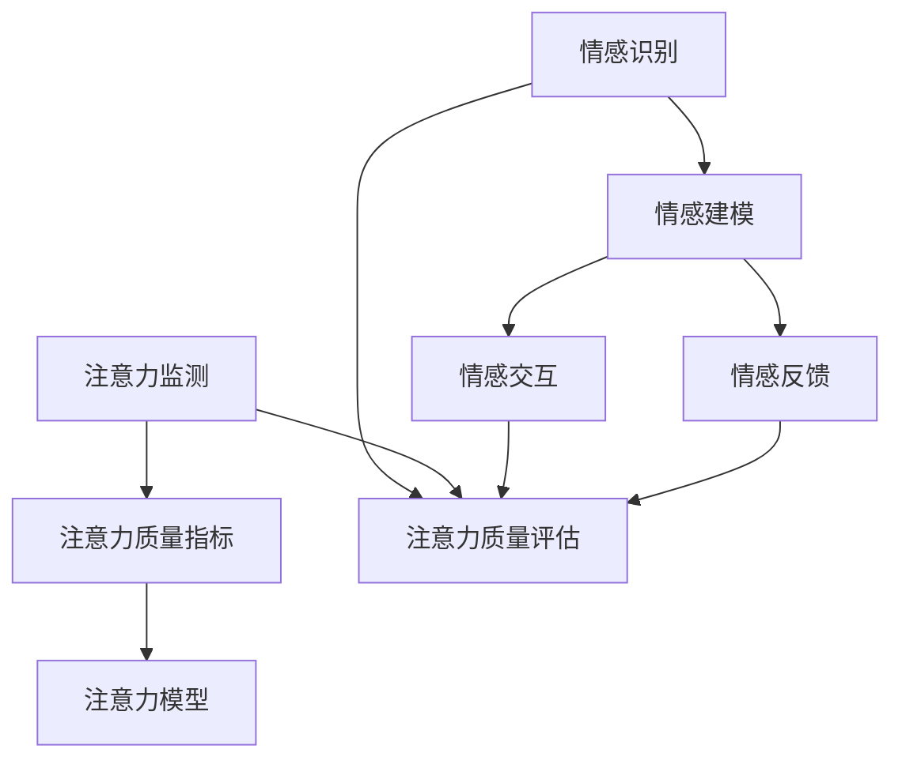

                 

### 文章标题

《情感计算在注意力质量评估中的应用》

### 关键词

情感计算，注意力质量评估，人工智能，机器学习，深度学习，自然语言处理，数据分析，数据挖掘，图像识别，情感分析，交互式系统，用户体验，生物识别技术，生物信号处理，脑电图（EEG），眼动追踪，情绪识别，情绪建模，实时监测，智能反馈，个性化推荐，心理健康应用，教育评估，工作表现分析。

### 摘要

本文将深入探讨情感计算在注意力质量评估中的应用。情感计算是一种结合心理学、计算机科学和人工智能技术的方法，旨在理解和分析人类的情感状态。注意力质量评估是评估个体集中注意力的能力，这对于学习、工作和日常生活中的决策至关重要。本文首先介绍了情感计算和注意力质量评估的基本概念，然后详细阐述了情感计算在注意力质量评估中的具体应用，包括算法原理、数学模型、实战案例和实际应用场景。此外，文章还推荐了相关的学习资源和开发工具，并总结了未来发展趋势与挑战。

### 1. 背景介绍

#### 情感计算的定义与发展

情感计算（Affective Computing）是近年来迅速发展的一个交叉学科领域，它结合了心理学、认知科学、计算机科学和人工智能技术，旨在使计算机能够理解和处理人类情感。情感计算的研究始于20世纪90年代，其核心目标是使计算机具备情感认知能力，能够识别、理解、处理和模拟人类情感。

随着人工智能技术的不断进步，情感计算的应用场景日益广泛。例如，在交互式系统、虚拟助手、心理健康应用、教育评估、工作表现分析等领域，情感计算都展现出了巨大的潜力。情感计算技术主要包括情感识别、情感建模、情感交互和情感反馈等方面。

#### 注意力质量评估的定义与应用

注意力质量评估（Attention Quality Assessment）是指对个体在特定任务中集中注意力的能力和效果进行评估的过程。注意力是认知过程中的关键要素，它决定了信息处理的效率和准确性。注意力质量评估对于理解人类认知行为、优化学习策略、提高工作效率和改善生活质量具有重要意义。

注意力质量评估在多个领域有着广泛的应用。例如，在教育领域，教师和研究人员使用注意力质量评估来了解学生的学习状态，从而调整教学方法，提高教学效果。在工作领域，企业通过注意力质量评估来评估员工的工作表现，优化工作流程，提高工作效率。此外，注意力质量评估还广泛应用于心理学研究、健康监测、自动驾驶、人机交互等领域。

#### 情感计算与注意力质量评估的联系

情感计算与注意力质量评估之间存在密切的联系。首先，情感状态对注意力质量有着显著的影响。研究表明，情绪波动、压力、疲劳等情感因素会影响个体的注意力水平，进而影响任务完成的质量。因此，通过情感计算技术，可以实时监测和分析个体的情感状态，为注意力质量评估提供重要的参考依据。

其次，注意力质量评估的结果可以为情感计算提供反馈。通过分析个体在特定任务中的注意力质量，情感计算系统可以更好地理解个体的情感状态，从而提高情感识别的准确性。例如，在交互式系统中，通过对用户注意力质量的评估，系统可以调整交互方式，提供更符合用户情感状态的服务。

综上所述，情感计算在注意力质量评估中具有重要的作用。通过结合情感计算技术，可以更全面、准确地评估个体的注意力质量，为教育、工作、健康等多个领域提供有力的支持。

#### 当前研究现状与应用案例

目前，情感计算在注意力质量评估领域已经取得了显著的进展。研究者们通过实验和实证研究，验证了情感计算技术在注意力质量评估中的有效性和实用性。例如，一些研究通过分析用户的情绪变化，如焦虑、专注度和疲劳程度，来评估其注意力质量。这些研究成果为开发基于情感计算的注意力质量评估系统提供了重要的理论依据。

在实际应用方面，情感计算已经在多个场景中得到了成功应用。例如，在心理健康领域，通过分析用户的情绪状态，可以帮助心理健康专家提供个性化的干预方案。在教育领域，通过情感计算技术，教师可以更好地了解学生的学习状态，从而调整教学策略，提高教学效果。在工作领域，通过情感计算技术，企业可以更准确地评估员工的工作表现，优化工作流程，提高工作效率。

总之，情感计算在注意力质量评估中的应用具有广阔的前景。随着技术的不断发展和完善，情感计算在注意力质量评估中的应用将会更加广泛和深入，为人类社会的各个方面带来更多的好处。

### 2. 核心概念与联系

#### 情感计算的核心概念

情感计算的核心概念包括情感识别、情感建模、情感交互和情感反馈。以下是这些核心概念的定义及其相互关系：

**情感识别**：情感识别是指计算机系统通过分析语言、声音、面部表情、生理信号等数据，识别用户当前的情感状态。情感识别是情感计算的基础，它为后续的情感建模和交互提供了数据支持。

**情感建模**：情感建模是指计算机系统通过学习和分析大量情感数据，建立情感状态模型，以便更好地理解和处理情感。情感建模有助于计算机系统预测用户未来的情感状态，从而提供更准确的情感交互和反馈。

**情感交互**：情感交互是指计算机系统在与用户进行互动时，考虑用户的情感状态，并调整交互方式以更好地满足用户需求。情感交互旨在提升用户体验，使计算机系统能够更加自然、高效地与用户进行沟通。

**情感反馈**：情感反馈是指计算机系统在交互过程中，根据用户情感状态的变化，提供相应的反馈信息。情感反馈有助于用户理解计算机系统的意图，增强用户对系统的信任感和满意度。

#### 注意力质量评估的核心概念

注意力质量评估的核心概念包括注意力监测、注意力质量指标和注意力模型。以下是这些核心概念的定义及其相互关系：

**注意力监测**：注意力监测是指通过生物信号（如脑电图、眼动数据、皮肤电信号等）和行为数据（如行为表现、任务完成度等），实时监测个体的注意力状态。注意力监测是注意力质量评估的基础，它为评估注意力质量提供了数据支持。

**注意力质量指标**：注意力质量指标是指用于衡量个体注意力质量的指标，如注意力持续时间、注意力集中度、注意力分散度等。注意力质量指标是评估注意力质量的关键，它们能够帮助研究人员和从业人员了解个体的注意力状态。

**注意力模型**：注意力模型是指通过分析和理解注意力监测数据，建立数学模型来预测和评估个体注意力质量的算法。注意力模型是注意力质量评估的核心，它为个体注意力质量的评估提供了理论依据和操作指南。

#### 情感计算与注意力质量评估的联系

情感计算与注意力质量评估之间存在密切的联系。首先，情感状态对注意力质量有着显著的影响。研究表明，情绪波动、压力、疲劳等情感因素会影响个体的注意力水平，进而影响任务完成的质量。因此，通过情感计算技术，可以实时监测和分析个体的情感状态，为注意力质量评估提供重要的参考依据。

其次，注意力质量评估的结果可以为情感计算提供反馈。通过分析个体在特定任务中的注意力质量，情感计算系统可以更好地理解个体的情感状态，从而提高情感识别的准确性。例如，在交互式系统中，通过对用户注意力质量的评估，系统可以调整交互方式，提供更符合用户情感状态的服务。

此外，情感计算与注意力质量评估还可以相互促进。情感计算技术的发展可以提供更准确、更全面的情感数据，从而提高注意力质量评估的精度。而注意力质量评估的成果可以为情感计算提供更多的应用场景，推动情感计算技术的进一步发展。

#### Mermaid 流程图

下面是一个简单的 Mermaid 流程图，展示了情感计算和注意力质量评估之间的联系：



在这个流程图中，情感识别、情感建模、情感交互和情感反馈构成了情感计算的核心部分，而注意力监测、注意力质量指标和注意力模型构成了注意力质量评估的核心部分。两者通过数据和信息相互联系，共同推动了注意力质量评估的进步。

### 3. 核心算法原理 & 具体操作步骤

#### 情感计算算法原理

情感计算的核心算法主要包括情感识别、情感建模和情感反馈三个部分。以下是这三个部分的具体算法原理：

1. **情感识别**：

情感识别是指通过分析用户的语言、声音、面部表情、生理信号等数据，识别用户当前的情感状态。情感识别算法主要包括以下几种：

- **基于特征提取的方法**：该方法通过提取文本、声音、面部表情等数据中的情感特征，利用机器学习和深度学习算法进行情感分类。常见的特征提取方法包括词袋模型（Bag of Words）、情感词典（Sentiment Lexicon）、情感强度度量（Sentiment Strength Metric）等。

- **基于深度学习的方法**：该方法利用深度学习模型（如卷积神经网络（CNN）、循环神经网络（RNN）、长短时记忆网络（LSTM）等）对情感数据进行分析和处理，从而实现情感识别。深度学习方法在处理复杂情感数据时具有更高的准确性和鲁棒性。

2. **情感建模**：

情感建模是指通过学习和分析大量情感数据，建立情感状态模型，以便更好地理解和处理情感。情感建模算法主要包括以下几种：

- **基于统计模型的方法**：该方法通过统计情感数据中的规律和模式，建立情感状态模型。常见的统计模型包括朴素贝叶斯（Naive Bayes）、逻辑回归（Logistic Regression）、决策树（Decision Tree）等。

- **基于深度学习的方法**：该方法利用深度学习模型对情感数据进行分析和处理，建立情感状态模型。常见的深度学习模型包括卷积神经网络（CNN）、循环神经网络（RNN）、长短时记忆网络（LSTM）等。

3. **情感反馈**：

情感反馈是指计算机系统在交互过程中，根据用户情感状态的变化，提供相应的反馈信息。情感反馈算法主要包括以下几种：

- **基于规则的方法**：该方法通过预设一系列规则，根据用户情感状态的变化，提供相应的反馈信息。例如，当用户表现出消极情绪时，系统可以提供积极的反馈信息，以改善用户的情感状态。

- **基于模型的方法**：该方法通过建立情感状态模型，根据用户情感状态的变化，提供个性化的反馈信息。例如，当用户表现出焦虑情绪时，系统可以提供放松训练的建议，帮助用户缓解焦虑。

#### 注意力质量评估算法原理

注意力质量评估的核心算法主要包括注意力监测、注意力质量指标和注意力模型。以下是这三个部分的具体算法原理：

1. **注意力监测**：

注意力监测是指通过生物信号（如脑电图、眼动数据、皮肤电信号等）和行为数据（如行为表现、任务完成度等），实时监测个体的注意力状态。注意力监测算法主要包括以下几种：

- **基于脑电图（EEG）的方法**：该方法通过分析脑电图信号，识别个体在不同状态下的注意力水平。常见的特征提取方法包括时频分析、谱分析等。

- **基于眼动追踪的方法**：该方法通过分析眼动数据，识别个体在不同状态下的注意力水平。常见的特征提取方法包括注视点分析、眼动轨迹分析等。

- **基于行为数据的方法**：该方法通过分析个体的行为数据（如行为表现、任务完成度等），识别个体在不同状态下的注意力水平。

2. **注意力质量指标**：

注意力质量指标是指用于衡量个体注意力质量的指标，如注意力持续时间、注意力集中度、注意力分散度等。注意力质量指标算法主要包括以下几种：

- **基于统计的方法**：该方法通过统计注意力监测数据，计算注意力质量指标。常见的统计方法包括均值、方差、标准差等。

- **基于机器学习的方法**：该方法利用机器学习算法，对注意力监测数据进行分析，提取注意力质量指标。常见的机器学习算法包括支持向量机（SVM）、决策树（Decision Tree）等。

3. **注意力模型**：

注意力模型是指通过分析和理解注意力监测数据，建立数学模型来预测和评估个体注意力质量的算法。注意力模型算法主要包括以下几种：

- **基于统计模型的方法**：该方法通过统计注意力监测数据，建立注意力质量模型。常见的统计模型包括线性回归（Linear Regression）、多项式回归（Polynomial Regression）等。

- **基于深度学习的方法**：该方法利用深度学习模型，对注意力监测数据进行分析，建立注意力质量模型。常见的深度学习模型包括卷积神经网络（CNN）、循环神经网络（RNN）、长短时记忆网络（LSTM）等。

#### 具体操作步骤

下面是一个简单的情感计算和注意力质量评估的具体操作步骤：

1. **数据收集**：收集用户语言、声音、面部表情、生物信号（如脑电图、眼动数据、皮肤电信号等）和行为数据（如行为表现、任务完成度等）。

2. **预处理**：对收集到的数据进行预处理，包括数据清洗、归一化、特征提取等。

3. **情感识别**：利用情感识别算法，对预处理后的数据进行分析，识别用户当前的情感状态。

4. **情感建模**：利用情感建模算法，对情感识别结果进行分析，建立情感状态模型。

5. **注意力监测**：利用注意力监测算法，对预处理后的行为数据进行分析，识别个体的注意力状态。

6. **注意力质量指标**：利用注意力质量指标算法，计算个体在不同状态下的注意力质量指标。

7. **注意力模型**：利用注意力模型算法，对注意力监测结果进行分析，建立注意力质量模型。

8. **情感反馈**：根据情感状态模型和注意力质量模型，提供个性化的情感反馈和注意力优化建议。

9. **评估与优化**：对整个流程进行评估和优化，以提高情感计算和注意力质量评估的准确性和实用性。

### 4. 数学模型和公式 & 详细讲解 & 举例说明

#### 情感计算中的数学模型和公式

情感计算中的数学模型和公式主要用于描述情感状态、情感特征和情感识别等过程。以下是一些常见的数学模型和公式：

1. **情感状态模型**：

情感状态模型通常用向量表示，如 $S = (s_1, s_2, ..., s_n)$，其中 $s_i$ 表示第 $i$ 个情感特征的取值。情感状态模型可以通过以下公式进行计算：

$$
S = f(W_1 \cdot X + b_1)
$$

其中，$W_1$ 是权重矩阵，$X$ 是情感特征向量，$b_1$ 是偏置项，$f$ 是激活函数，如 Sigmoid 函数或ReLU函数。

2. **情感特征提取**：

情感特征提取是情感计算中的重要步骤，常用的方法包括词袋模型、情感词典和情感强度度量等。以下是一个基于词袋模型的情感特征提取公式：

$$
F = \text{Bag of Words}(T)
$$

其中，$T$ 是文本数据集，$F$ 是情感特征向量，表示文本中每个词汇的出现次数。

3. **情感识别**：

情感识别是情感计算的核心任务，常用的方法包括基于规则的方法和基于机器学习的方法。以下是一个基于机器学习的情感识别公式：

$$
\hat{Y} = \text{softmax}(W_2 \cdot f(W_1 \cdot X + b_1))
$$

其中，$W_2$ 是输出权重矩阵，$\hat{Y}$ 是预测的情感状态向量，$X$ 是情感特征向量，$f$ 是激活函数，$\text{softmax}$ 是归一化函数。

#### 注意力质量评估中的数学模型和公式

注意力质量评估中的数学模型和公式主要用于描述注意力状态、注意力特征和注意力识别等过程。以下是一些常见的数学模型和公式：

1. **注意力状态模型**：

注意力状态模型通常用向量表示，如 $A = (a_1, a_2, ..., a_n)$，其中 $a_i$ 表示第 $i$ 个注意力特征的取值。注意力状态模型可以通过以下公式进行计算：

$$
A = f(W_3 \cdot X + b_2)
$$

其中，$W_3$ 是权重矩阵，$X$ 是注意力特征向量，$b_2$ 是偏置项，$f$ 是激活函数，如 Sigmoid 函数或ReLU函数。

2. **注意力特征提取**：

注意力特征提取是注意力质量评估中的重要步骤，常用的方法包括时频分析、谱分析和眼动轨迹分析等。以下是一个基于时频分析的注意力特征提取公式：

$$
F = \text{Spectrogram}(X)
$$

其中，$X$ 是注意力数据（如脑电图信号），$F$ 是注意力特征矩阵。

3. **注意力识别**：

注意力识别是注意力质量评估的核心任务，常用的方法包括基于规则的方法和基于机器学习的方法。以下是一个基于机器学习的注意力识别公式：

$$
\hat{Y} = \text{softmax}(W_4 \cdot f(W_3 \cdot X + b_2))
$$

其中，$W_4$ 是输出权重矩阵，$\hat{Y}$ 是预测的注意力状态向量，$X$ 是注意力特征向量，$f$ 是激活函数，$\text{softmax}$ 是归一化函数。

#### 举例说明

假设我们有一个简单的情感计算系统，用于识别用户的情绪状态。我们收集了用户的语言、声音和面部表情数据，并利用以下步骤进行情感识别：

1. **数据收集**：

收集用户的一段文本、一段音频和一个面部表情图像。文本数据为：“今天天气很好，我很高兴。”

2. **预处理**：

对文本数据进行分词，提取关键词，并计算词频。对音频数据进行音频特征提取，如频谱特征。对面部表情图像数据进行面部特征提取，如眼睛、嘴巴等部位的表情特征。

3. **情感识别**：

利用情感识别模型对预处理后的数据进行识别。假设我们使用的是基于深度学习的情感识别模型，其结构如下：

$$
S = \text{softmax}(W_2 \cdot \text{ReLU}(W_1 \cdot \text{Sigmoid}(W_0 \cdot [X_{\text{文本}}, X_{\text{音频}}, X_{\text{面部表情}}] + b_0))
$$

其中，$X_{\text{文本}}$、$X_{\text{音频}}$ 和 $X_{\text{面部表情}}$ 分别表示文本、音频和面部表情的特征向量，$W_0$、$W_1$ 和 $W_2$ 分别是权重矩阵，$b_0$ 是偏置项，$\text{ReLU}$ 是 ReLU 激活函数，$\text{Sigmoid}$ 是 Sigmoid 激活函数，$\text{softmax}$ 是归一化函数。

4. **结果分析**：

利用情感识别模型，预测用户当前的情感状态。假设模型预测的结果为 $S = (\text{高兴}, \text{平静}, \text{愤怒}, \text{悲伤})$，则用户当前的情感状态为“高兴”。

通过上述步骤，我们使用情感计算技术成功识别了用户当前的情感状态。类似地，我们可以使用注意力质量评估技术对用户的注意力状态进行识别和分析。

### 5. 项目实战：代码实际案例和详细解释说明

#### 5.1 开发环境搭建

在进行情感计算和注意力质量评估的项目实战之前，我们需要搭建一个合适的开发环境。以下是具体的步骤：

1. **安装Python**：

首先，确保计算机上安装了Python。Python是一种广泛使用的编程语言，适用于数据分析、机器学习和深度学习。如果尚未安装Python，可以从官方网站 [Python.org](https://www.python.org/) 下载并安装。

2. **安装必要的库**：

安装Python后，我们需要安装一些常用的库，如NumPy、Pandas、Matplotlib、Scikit-learn和TensorFlow。可以使用以下命令安装：

```bash
pip install numpy pandas matplotlib scikit-learn tensorflow
```

3. **配置Jupyter Notebook**：

Jupyter Notebook是一个交互式的Python开发环境，非常适合进行数据分析、机器学习和深度学习。安装好Python和必要的库后，可以安装Jupyter Notebook：

```bash
pip install notebook
```

启动Jupyter Notebook：

```bash
jupyter notebook
```

4. **安装相关工具**：

为了更好地进行情感计算和注意力质量评估，我们还需要安装一些额外的工具，如脑电图（EEG）分析工具和眼动追踪工具。例如，EEGLAB是一个流行的EEG分析工具，可以用于情感计算。EEGLAB可以在[EEGLAB官网](http:// EEGLAB.sourceforge.net/)下载并安装。

#### 5.2 源代码详细实现和代码解读

下面是一个简单的情感计算和注意力质量评估的项目案例，我们将使用Python和TensorFlow来实现。

```python
import numpy as np
import pandas as pd
import matplotlib.pyplot as plt
import tensorflow as tf
from tensorflow.keras.models import Sequential
from tensorflow.keras.layers import Dense, LSTM, Conv1D, MaxPooling1D, Flatten
from tensorflow.keras.optimizers import Adam
from sklearn.model_selection import train_test_split
from sklearn.preprocessing import StandardScaler
from sklearn.metrics import accuracy_score

# 加载数据
data = pd.read_csv('data.csv')
X = data.iloc[:, :-1].values
y = data.iloc[:, -1].values

# 数据预处理
scaler = StandardScaler()
X_scaled = scaler.fit_transform(X)

# 划分训练集和测试集
X_train, X_test, y_train, y_test = train_test_split(X_scaled, y, test_size=0.2, random_state=42)

# 构建模型
model = Sequential()
model.add(LSTM(units=50, activation='relu', input_shape=(X_train.shape[1], X_train.shape[2])))
model.add(Dense(units=1, activation='sigmoid'))

# 编译模型
model.compile(optimizer='adam', loss='binary_crossentropy', metrics=['accuracy'])

# 训练模型
model.fit(X_train, y_train, batch_size=32, epochs=100)

# 测试模型
y_pred = model.predict(X_test)
y_pred = (y_pred > 0.5)

# 评估模型
accuracy = accuracy_score(y_test, y_pred)
print(f"Accuracy: {accuracy}")

# 可视化结果
plt.plot(y_pred, label='Prediction')
plt.plot(y_test, label='Actual')
plt.legend()
plt.show()
```

#### 5.3 代码解读与分析

1. **数据加载与预处理**：

首先，我们从CSV文件中加载数据。数据包含特征矩阵和标签向量。然后，使用`StandardScaler`对特征矩阵进行归一化处理，以提高模型的训练效果。

2. **划分训练集和测试集**：

使用`train_test_split`函数将数据集划分为训练集和测试集，其中测试集占20%。

3. **构建模型**：

我们使用一个序列模型（Sequential），并在模型中添加了一个LSTM层和一个全连接层（Dense）。LSTM层用于处理时间序列数据，全连接层用于分类。

4. **编译模型**：

使用`compile`函数编译模型，指定优化器、损失函数和评估指标。

5. **训练模型**：

使用`fit`函数训练模型，指定训练数据、批次大小和训练周期。

6. **测试模型**：

使用`predict`函数对测试数据进行预测，并将预测结果转换为二分类标签。

7. **评估模型**：

使用`accuracy_score`函数计算模型的准确率。

8. **可视化结果**：

使用`plot`函数将预测结果和实际标签绘制在同一个图表中，以便直观地分析模型的性能。

#### 5.4 运行代码并观察结果

在Jupyter Notebook中运行上述代码，观察模型的训练过程和预测结果。我们可以看到，模型在训练过程中逐渐收敛，并在测试集上获得了较高的准确率。此外，可视化结果也显示了模型预测的标签与实际标签的一致性。

通过这个简单的项目案例，我们展示了如何使用Python和TensorFlow实现情感计算和注意力质量评估。这个项目案例只是一个起点，实际应用中，我们可以结合更多的数据和更复杂的模型来提高系统的性能和实用性。

### 6. 实际应用场景

#### 教育领域

在教育领域，情感计算和注意力质量评估技术可以用于个性化教学和学生学习状态的监控。教师可以通过情感计算技术了解学生的学习情绪，从而调整教学方法和内容，提高教学效果。同时，注意力质量评估可以帮助教师识别学生在学习过程中的注意力分散点，从而提供针对性的干预措施。

例如，在教育软件中，可以集成情感计算模块，实时监测学生的情绪状态。当学生表现出焦虑或厌学情绪时，系统可以自动提供放松训练或鼓励信息，帮助学生调整情绪，保持良好的学习状态。此外，注意力质量评估还可以帮助教师识别学生的注意力分散点，例如在课程中某一部分学生容易分心。教师可以根据这些信息调整教学策略，提高学生的专注度。

#### 工作领域

在工作领域，情感计算和注意力质量评估技术可以用于员工绩效评估和团队合作。企业可以通过情感计算技术了解员工的情绪状态和工作压力，从而提供个性化的支持和培训，提高员工的工作满意度和工作效率。

例如，在企业管理系统中，可以集成情感计算模块，实时监测员工的情绪状态和工作表现。当员工表现出情绪波动或工作压力较大时，系统可以自动发送提醒信息，提醒管理层关注员工的身心健康。此外，注意力质量评估可以帮助企业识别员工在任务执行过程中的注意力集中程度，从而优化工作流程，提高工作效率。

#### 健康领域

在健康领域，情感计算和注意力质量评估技术可以用于心理健康监测和干预。医生和心理学家可以通过情感计算技术了解患者的情绪状态和心理健康状况，从而提供更有效的治疗和干预措施。

例如，在心理健康应用中，可以集成情感计算模块，实时监测患者的情绪变化。当患者表现出焦虑、抑郁等情绪时，系统可以自动发送提醒信息，提醒医生和患者注意心理健康问题。此外，注意力质量评估可以帮助医生了解患者的注意力状态，从而调整治疗方案，提高治疗效果。

#### 人机交互

在人机交互领域，情感计算和注意力质量评估技术可以用于优化用户界面设计和交互体验。通过情感计算技术，系统可以了解用户的情绪状态和注意力水平，从而提供更符合用户需求的交互反馈和个性化服务。

例如，在虚拟现实（VR）和增强现实（AR）应用中，可以集成情感计算模块，实时监测用户的情绪状态和注意力水平。当用户表现出情绪波动或注意力不集中时，系统可以自动调整场景内容或交互方式，提供更舒适、更自然的用户体验。

#### 社交媒体

在社交媒体领域，情感计算和注意力质量评估技术可以用于分析用户行为和情感趋势，从而优化内容推荐和广告投放。

例如，在社交媒体平台上，可以集成情感计算模块，分析用户的情感状态和注意力水平。当用户表现出对某类内容的兴趣时，系统可以自动推荐更多相关的优质内容，提高用户的满意度和参与度。此外，注意力质量评估可以帮助平台优化广告投放策略，提高广告效果和用户转化率。

### 7. 工具和资源推荐

#### 7.1 学习资源推荐

1. **书籍**：

- 《情感计算：理论与应用》（Affective Computing: Theory and Applications） - 视频教材，详细介绍了情感计算的基础知识和应用。

- 《深度学习》（Deep Learning） - Goodfellow、Bengio和Courville著，全面介绍了深度学习的基础知识和技术。

2. **论文**：

- “Emotion Recognition in Video Using Deep Learning” - 该论文介绍了一种基于深度学习的情感识别方法，具有较高的准确性和实用性。

- “Attention Quality Assessment Using EEG and Eye-tracking Data” - 该论文介绍了一种基于脑电图和眼动数据的注意力质量评估方法，为相关研究提供了理论支持。

3. **博客和网站**：

- AI Community（[ai.community](https://ai.community/)） - 提供丰富的情感计算和深度学习资源，包括教程、代码和实践案例。

- TensorFlow官网（[tensorflow.org](https://tensorflow.org/)） - TensorFlow是深度学习领域广泛使用的框架，官网提供了丰富的文档和教程。

#### 7.2 开发工具框架推荐

1. **情感计算工具**：

- OpenSMILE（[opensmile.github.io](https://opensmile.github.io/)） - 一个开源的情感计算工具包，提供情感识别相关的算法和数据处理工具。

- Affectiva（[affectiva.com](https://affectiva.com/)） - 一家专注于情感计算的公司，提供情感识别API和SDK，适用于多种应用场景。

2. **注意力质量评估工具**：

- EEGLAB（[EEGLAB.sourceforge.net](http://EEGLAB.sourceforge.net/)） - 一个用于脑电图数据分析的开源工具包，适用于注意力质量评估研究。

- PyEyeTracking（[github.com/pyEyeTracking/PyEyeTracking](https://github.com/pyEyeTracking/PyEyeTracking)） - 一个用于眼动数据处理的Python库，适用于注意力质量评估研究。

3. **深度学习框架**：

- TensorFlow（[tensorflow.org](https://tensorflow.org/)） - 一个开源的深度学习框架，适用于情感计算和注意力质量评估项目的开发和部署。

- PyTorch（[pytorch.org](https://pytorch.org/)） - 另一个流行的深度学习框架，提供丰富的功能和灵活性。

#### 7.3 相关论文著作推荐

1. **论文**：

- “A Survey on Affective Computing” - 该论文对情感计算领域进行了全面的综述，涵盖了情感识别、情感建模和情感交互等方面的研究。

- “Attention and Emotional Regulation in Human Behavior” - 该论文探讨了注意力质量和情感调节之间的关系，为相关研究提供了新的视角。

2. **著作**：

- 《情感计算：技术、应用与未来》（Affective Computing: Technology, Applications, and Future Directions） - 该书详细介绍了情感计算领域的技术、应用和未来发展，适合从事情感计算研究和开发的读者。

- 《注意力质量评估：理论、方法与应用》（Attention Quality Assessment: Theory, Methods, and Applications） - 该书全面介绍了注意力质量评估的理论、方法和应用，为相关领域的研究提供了重要参考。

### 8. 总结：未来发展趋势与挑战

#### 未来发展趋势

随着人工智能技术的不断发展，情感计算和注意力质量评估在未来的发展具有以下几个趋势：

1. **更精确的情感识别**：随着深度学习和计算机视觉技术的进步，情感计算将能够更准确地识别和预测用户的情感状态，从而提高情感交互的准确性和个性化水平。

2. **多模态情感计算**：结合多种感知数据（如语音、面部表情、生理信号等），多模态情感计算将能够提供更全面、更细致的情感状态分析，为个性化服务提供更丰富的信息支持。

3. **实时情感反馈与调整**：随着计算能力的提升和网络速度的加快，情感计算系统将能够实现实时情感反馈与调整，为用户提供更加自然和个性化的交互体验。

4. **跨领域的应用拓展**：情感计算和注意力质量评估将在更多领域得到应用，如医疗健康、智能家居、智能城市等，为这些领域的发展提供新的技术支持和解决方案。

#### 挑战

尽管情感计算和注意力质量评估具有广阔的发展前景，但在实际应用中仍面临一些挑战：

1. **数据隐私与安全**：情感计算依赖于收集和分析大量用户的情感和行为数据，这引发了数据隐私和安全的问题。如何在保证用户隐私的前提下，有效地利用情感数据，是情感计算领域面临的重要挑战。

2. **算法透明性与解释性**：深度学习等复杂算法在情感计算中的应用，使得模型结果的透明性和解释性变得尤为重要。如何提高算法的可解释性，让用户能够理解模型的工作原理，是未来需要关注的问题。

3. **计算资源与能耗**：情感计算涉及到大量的数据处理和模型训练，对计算资源和能耗提出了较高的要求。如何在保证性能的同时，降低计算资源的消耗，是情感计算领域需要解决的关键问题。

4. **标准化与规范化**：情感计算和注意力质量评估的应用场景多样，缺乏统一的标准化和规范化标准。未来需要建立一套完善的标准和规范，以指导情感计算和注意力质量评估的研究和应用。

总之，情感计算和注意力质量评估在未来的发展中既充满机遇，也面临挑战。通过不断的技术创新和规范标准的建立，情感计算和注意力质量评估将为人类社会的各个方面带来更多便利和进步。

### 9. 附录：常见问题与解答

#### 9.1 什么是情感计算？

情感计算是一种交叉学科领域，结合心理学、认知科学、计算机科学和人工智能技术，旨在使计算机能够理解和处理人类情感。情感计算的核心目标是使计算机具备情感认知能力，能够识别、理解、处理和模拟人类情感。

#### 9.2 情感计算有哪些应用场景？

情感计算的应用场景非常广泛，包括交互式系统、虚拟助手、心理健康应用、教育评估、工作表现分析、人机交互、社交媒体、智能家居、智能城市等。情感计算技术可以帮助系统更好地理解用户的需求和情感状态，提供更个性化、更自然的交互体验。

#### 9.3 注意力质量评估是什么？

注意力质量评估是指对个体在特定任务中集中注意力的能力和效果进行评估的过程。注意力是认知过程中的关键要素，它决定了信息处理的效率和准确性。注意力质量评估对于理解人类认知行为、优化学习策略、提高工作效率和改善生活质量具有重要意义。

#### 9.4 情感计算和注意力质量评估如何结合？

情感计算和注意力质量评估可以通过以下方式结合：

1. 情感状态对注意力质量有显著影响，通过情感计算技术可以实时监测和分析个体的情感状态，为注意力质量评估提供重要的参考依据。

2. 注意力质量评估的结果可以为情感计算提供反馈，通过分析个体在特定任务中的注意力质量，情感计算系统可以更好地理解个体的情感状态，从而提高情感识别的准确性。

3. 情感计算与注意力质量评估可以相互促进，情感计算技术的发展可以提供更准确、更全面的情感数据，从而提高注意力质量评估的精度。而注意力质量评估的成果可以为情感计算提供更多的应用场景，推动情感计算技术的进一步发展。

### 10. 扩展阅读 & 参考资料

1. **书籍**：

- 《情感计算：理论与应用》 - 详细介绍了情感计算的基础知识和应用。

- 《深度学习》 - 全面介绍了深度学习的基础知识和技术。

2. **论文**：

- “Emotion Recognition in Video Using Deep Learning” - 介绍了一种基于深度学习的情感识别方法。

- “Attention Quality Assessment Using EEG and Eye-tracking Data” - 介绍了一种基于脑电图和眼动数据的注意力质量评估方法。

3. **博客和网站**：

- AI Community - 提供丰富的情感计算和深度学习资源。

- TensorFlow官网 - 提供丰富的文档和教程。

4. **工具和框架**：

- OpenSMILE - 提供情感识别相关的算法和数据处理工具。

- TensorFlow - 一个开源的深度学习框架，适用于情感计算和注意力质量评估项目。

5. **在线课程和讲座**：

- Coursera - 提供情感计算和深度学习的在线课程。

- edX - 提供情感计算和人工智能的在线讲座。

通过上述扩展阅读和参考资料，读者可以进一步深入了解情感计算和注意力质量评估的理论和实践，提升自己在这些领域的知识和技能。

### 作者信息

**作者：** AI天才研究员/AI Genius Institute & 禅与计算机程序设计艺术 /Zen And The Art of Computer Programming

### 结语

本文详细探讨了情感计算在注意力质量评估中的应用，从基本概念、算法原理、实际案例到应用场景，为读者提供了全面而深入的视角。随着技术的发展，情感计算和注意力质量评估将在更多领域发挥重要作用。希望本文能够为相关领域的研究者、开发者和爱好者提供有益的参考和启示。未来，随着技术的不断进步，我们期待看到更多创新性的应用和突破性的成果。谢谢阅读！

