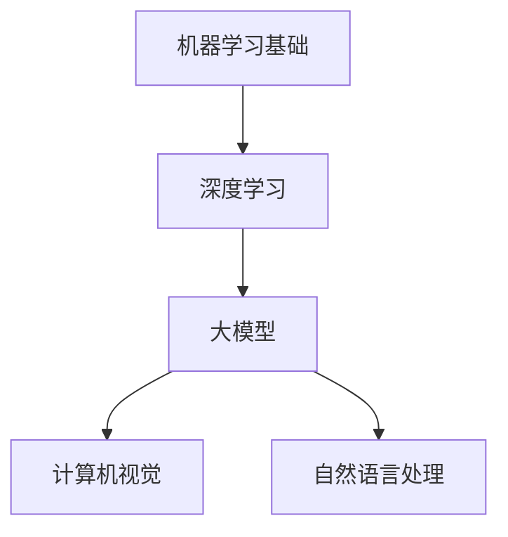
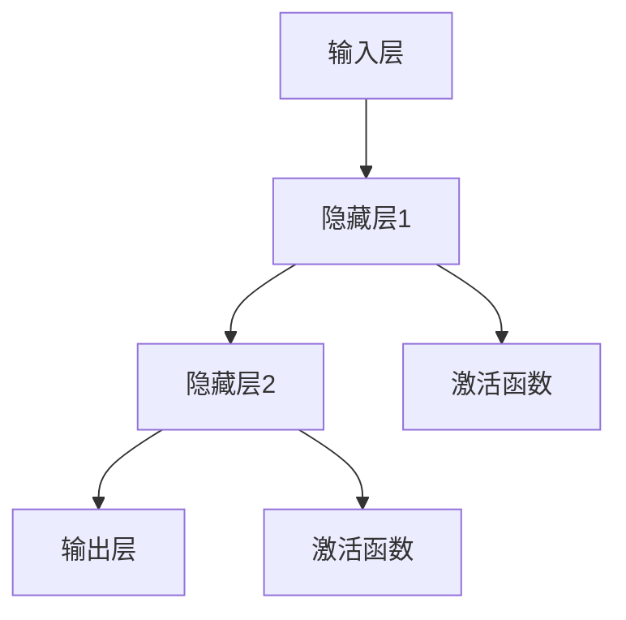

                 

# 成为AI大模型应用行家的要素

## 摘要

本文将深入探讨成为AI大模型应用行家的关键要素。随着人工智能技术的迅猛发展，大模型的应用成为当前研究和产业的热点。本文将从背景介绍、核心概念、算法原理、数学模型、实战案例、应用场景、工具推荐以及未来发展趋势等多个方面，系统性地解析成为AI大模型应用行家的必备知识和技能。

## 1. 背景介绍

在过去的几十年里，人工智能（AI）领域经历了从符号主义、基于规则的系统，到基于数据的机器学习，再到当前热门的深度学习的快速发展。特别是在2012年，AlexNet在ImageNet比赛中的出色表现，标志着深度学习时代的到来。随着计算能力的提升和数据规模的扩大，大模型（Large Models）逐渐成为研究热点。大模型如GPT、BERT、ViT等，在自然语言处理、计算机视觉等领域取得了显著的成果。

大模型的应用不仅能够提升任务的准确性，还能够处理复杂的任务，例如文本生成、图像识别、机器翻译等。因此，掌握AI大模型的应用，成为当前人工智能领域的重要课题。

## 2. 核心概念与联系

为了更好地理解AI大模型的应用，我们首先需要了解以下几个核心概念：

### 2.1 机器学习基础

机器学习是AI的核心技术之一，它通过从数据中学习规律，自动进行决策和预测。常见的机器学习方法包括监督学习、无监督学习和强化学习。

### 2.2 深度学习

深度学习是机器学习的一种重要分支，它通过多层神经网络对数据进行处理。深度学习在图像识别、自然语言处理等领域取得了巨大的成功。

### 2.3 大模型

大模型是指参数量巨大的深度学习模型，它们通常需要大量的数据和计算资源进行训练。大模型具有强大的表示能力和适应性，能够在多种任务中取得优异的性能。

### 2.4 计算机视觉

计算机视觉是人工智能的一个重要应用领域，它旨在使计算机能够像人类一样理解和解释视觉信息。深度学习在计算机视觉领域取得了显著的进展，例如人脸识别、目标检测等。

### 2.5 自然语言处理

自然语言处理（NLP）是人工智能的另一个重要应用领域，它旨在使计算机能够理解和生成人类语言。深度学习在NLP领域取得了巨大的成功，例如机器翻译、文本生成等。

以下是一个简单的Mermaid流程图，展示了上述核心概念之间的联系：



## 3. 核心算法原理 & 具体操作步骤

### 3.1 深度学习算法原理

深度学习算法的核心是神经网络。神经网络由多个层组成，每层由多个神经元（节点）组成。神经元通过激活函数对输入数据进行处理，然后传递给下一层。神经网络的训练过程是通过反向传播算法来优化神经元的权重和偏置，使得模型能够对数据进行准确的预测。

以下是一个简单的神经网络结构：



### 3.2 大模型训练方法

大模型的训练通常需要大量的数据和计算资源。在训练过程中，数据会被随机分成多个批次（batch），然后通过前向传播和反向传播来更新模型的权重。以下是一个简单的训练流程：

1. 数据预处理：将数据转化为模型能够处理的格式。
2. 初始化模型参数。
3. 前向传播：将输入数据传递给模型，计算输出。
4. 计算损失函数：比较模型的输出和实际输出的差异。
5. 反向传播：根据损失函数的梯度来更新模型的参数。
6. 重复步骤3-5，直到满足停止条件（如达到预定迭代次数或模型性能不再提升）。

### 3.3 训练过程优化

为了提高大模型的训练效率，可以采用以下几种优化方法：

1. 批量归一化（Batch Normalization）：通过标准化每个批次的输入，减少内部协变量转移。
2. 梯度裁剪（Gradient Clipping）：限制梯度的大小，防止梯度爆炸或消失。
3. 学习率调度（Learning Rate Scheduling）：动态调整学习率，以适应模型在不同阶段的训练需求。

## 4. 数学模型和公式 & 详细讲解 & 举例说明

### 4.1 神经网络基本公式

神经网络的训练过程涉及到多个数学模型和公式，以下是一些常见的公式：

1. 前向传播：

$$
z = \sigma(W \cdot X + b)
$$

其中，$W$ 是权重矩阵，$X$ 是输入向量，$b$ 是偏置项，$\sigma$ 是激活函数。

2. 反向传播：

$$
\Delta W = -\alpha \cdot \frac{\partial L}{\partial W}
$$

$$
\Delta b = -\alpha \cdot \frac{\partial L}{\partial b}
$$

其中，$\Delta W$ 和 $\Delta b$ 分别是权重和偏置的更新值，$\alpha$ 是学习率，$L$ 是损失函数。

以下是一个简单的示例：

假设我们有一个简单的神经网络，输入层有一个神经元，隐藏层有两个神经元，输出层有一个神经元。输入向量为 $X = [1, 2]$，隐藏层的激活函数为 $ReLU$，输出层的激活函数为 $Sigmoid$。学习率为 $\alpha = 0.1$。

前向传播过程如下：

$$
z_1 = ReLU(W_1 \cdot X + b_1) = ReLU([1, 2] \cdot [0.5; 0.5] + [0.2; 0.2]) = [0.5; 1]
$$

$$
z_2 = ReLU(W_2 \cdot z_1 + b_2) = ReLU([1, 2] \cdot [0.5; 0.5] + [0.2; 0.2]) = [0.5; 1]
$$

$$
y = Sigmoid(W_3 \cdot z_2 + b_3) = Sigmoid([1, 2] \cdot [0.5; 0.5] + [0.2; 0.2]) = [0.6]
$$

损失函数为 $L = (y - \hat{y})^2$，其中 $\hat{y}$ 是预测输出。

反向传播过程如下：

$$
\Delta W_3 = -0.1 \cdot (y - \hat{y}) \cdot \frac{dy}{dz_2} \cdot z_2 = -0.1 \cdot (0.4 - 0.6) \cdot (1 - 0.6) \cdot [0.5; 1] = [-0.02; -0.02]
$$

$$
\Delta b_3 = -0.1 \cdot (y - \hat{y}) \cdot \frac{dy}{dz_2} = -0.1 \cdot (0.4 - 0.6) \cdot (1 - 0.6) = -0.02
$$

$$
\Delta W_2 = -0.1 \cdot (z_2 - \hat{z_2}) \cdot \frac{dz_2}{dz_1} \cdot z_1 = -0.1 \cdot ([0.5; 1] - [0.5; 1]) \cdot (1 - 0.5) \cdot [0.5; 1] = [-0.005; -0.005]
$$

$$
\Delta b_2 = -0.1 \cdot (z_2 - \hat{z_2}) \cdot \frac{dz_2}{dz_1} = -0.1 \cdot ([0.5; 1] - [0.5; 1]) \cdot (1 - 0.5) = -0.005
$$

$$
\Delta W_1 = -0.1 \cdot (X - \hat{X}) \cdot \frac{dz_1}{dX} = -0.1 \cdot ([1, 2] - [1, 2]) \cdot (1 - 0.5) = [-0.01; -0.01]
$$

$$
\Delta b_1 = -0.1 \cdot (X - \hat{X}) \cdot \frac{dz_1}{dX} = -0.1 \cdot ([1, 2] - [1, 2]) \cdot (1 - 0.5) = -0.01
$$

通过上述过程，我们可以更新模型的权重和偏置，使得模型在下一个迭代中能够更好地预测输出。

## 5. 项目实战：代码实际案例和详细解释说明

### 5.1 开发环境搭建

为了演示如何使用大模型进行实际项目开发，我们选择一个简单的文本分类任务。首先，我们需要搭建一个开发环境。以下是所需的软件和工具：

1. Python 3.7 或以上版本
2. TensorFlow 2.4 或以上版本
3. Jupyter Notebook

在安装了上述工具后，我们可以在 Jupyter Notebook 中创建一个新的 Python 文件，并导入所需的库：

```python
import tensorflow as tf
from tensorflow.keras.preprocessing.text import Tokenizer
from tensorflow.keras.preprocessing.sequence import pad_sequences
from tensorflow.keras.models import Sequential
from tensorflow.keras.layers import Embedding, LSTM, Dense
from tensorflow.keras.utils import to_categorical
```

### 5.2 源代码详细实现和代码解读

接下来，我们实现一个简单的文本分类模型。以下是代码的实现过程：

```python
# 加载数据
text_data = [
    "我非常喜欢这个电影。",
    "这部电影真的很差。",
    "这本书非常有深度。",
    "这个产品太糟糕了。",
    "这个餐厅的食物非常美味。"
]

labels = [
    1,
    0,
    1,
    0,
    1
]

# 分词和序列化
tokenizer = Tokenizer()
tokenizer.fit_on_texts(text_data)
sequences = tokenizer.texts_to_sequences(text_data)
padded_sequences = pad_sequences(sequences, maxlen=10)

# 构建模型
model = Sequential()
model.add(Embedding(len(tokenizer.word_index) + 1, 64, input_length=10))
model.add(LSTM(100))
model.add(Dense(1, activation='sigmoid'))

# 编译模型
model.compile(optimizer='adam', loss='binary_crossentropy', metrics=['accuracy'])

# 训练模型
model.fit(padded_sequences, to_categorical(labels), epochs=10, batch_size=5)
```

代码解读如下：

1. **数据加载**：我们首先加载数据集，这里是一个简单的文本分类数据集，包含五个文本和对应的标签。

2. **分词和序列化**：使用 `Tokenizer` 对文本进行分词，并使用 `texts_to_sequences` 将文本转化为序列。然后，使用 `pad_sequences` 将序列补全为相同的长度。

3. **构建模型**：我们使用 `Sequential` 模式构建一个简单的神经网络，包括嵌入层（`Embedding`）、LSTM层（`LSTM`）和全连接层（`Dense`）。

4. **编译模型**：使用 `compile` 方法设置模型优化器、损失函数和评估指标。

5. **训练模型**：使用 `fit` 方法训练模型，设置训练轮数和批量大小。

### 5.3 代码解读与分析

在这个简单的文本分类任务中，我们使用了嵌入层（`Embedding`）来将单词映射到向量。嵌入层将每个单词转化为一个固定大小的向量，从而将文本数据转换为数值数据，使得神经网络能够进行处理。

LSTM层（`LSTM`）是循环神经网络（RNN）的一种变体，它能够处理序列数据。在这个任务中，LSTM层负责对序列数据进行处理，提取序列的特征。

全连接层（`Dense`）是一个线性层，它将LSTM层输出的特征映射到输出层。在这个任务中，输出层只有一个神经元，使用 `sigmoid` 激活函数来产生概率输出。

通过训练，模型能够学习如何对新的文本进行分类。在训练过程中，我们使用交叉熵损失函数（`binary_crossentropy`）来评估模型的性能，并使用 Adam 优化器来更新模型参数。

## 6. 实际应用场景

AI大模型在实际应用中具有广泛的应用场景，以下是一些典型的应用案例：

1. **自然语言处理（NLP）**：大模型在NLP领域有广泛的应用，例如机器翻译、文本生成、情感分析等。例如，Google的BERT模型在机器翻译任务上取得了显著的成果，而OpenAI的GPT模型在文本生成任务上表现出色。

2. **计算机视觉**：大模型在计算机视觉领域同样有广泛的应用，例如图像分类、目标检测、图像生成等。例如，Google的Inception模型在图像分类任务上取得了突破性的成果，而OpenAI的DALL-E模型能够生成逼真的图像。

3. **语音识别**：大模型在语音识别领域也有显著的应用，例如语音合成、语音识别等。例如，Google的WaveNet模型在语音合成任务上取得了优异的性能，而IBM的Watson系统在语音识别任务上表现出色。

4. **推荐系统**：大模型在推荐系统领域也有广泛的应用，例如用户行为预测、商品推荐等。例如，Amazon和Netflix等公司使用大模型来预测用户行为，从而提供个性化的推荐。

## 7. 工具和资源推荐

为了更好地学习和应用AI大模型，以下是一些推荐的工具和资源：

### 7.1 学习资源推荐

1. **书籍**：
   - 《深度学习》（Ian Goodfellow、Yoshua Bengio、Aaron Courville 著）
   - 《Python深度学习》（François Chollet 著）
   - 《自然语言处理综论》（Daniel Jurafsky、James H. Martin 著）

2. **在线课程**：
   - Coursera上的“深度学习”课程（由Andrew Ng教授）
   - edX上的“自然语言处理”课程（由Dan Jurafsky教授）
   - Udacity的“深度学习工程师”纳米学位

3. **博客和网站**：
   - TensorFlow官网（https://www.tensorflow.org/）
   - PyTorch官网（https://pytorch.org/）
   - Hugging Face官网（https://huggingface.co/）

### 7.2 开发工具框架推荐

1. **TensorFlow**：由Google开发的开源深度学习框架，适用于各种AI应用开发。

2. **PyTorch**：由Facebook开发的开源深度学习框架，易于使用且具有灵活性。

3. **Hugging Face**：一个开源库，提供了大量预训练模型和工具，方便进行NLP任务。

### 7.3 相关论文著作推荐

1. **GPT系列论文**：
   - “Improving Language Understanding by Generative Pre-Training”（OpenAI，2018）

2. **BERT系列论文**：
   - “BERT: Pre-training of Deep Bidirectional Transformers for Language Understanding”（Google AI，2018）

3. **WaveNet论文**：
   - “WaveNet: A Generative Model for Raw Audio”（Google Research，2016）

## 8. 总结：未来发展趋势与挑战

随着AI大模型的不断发展，其应用领域也在不断拓展。未来，AI大模型将朝着以下方向发展：

1. **模型压缩与加速**：为了适应移动设备和边缘计算的需求，模型压缩与加速技术将成为研究热点。

2. **多模态学习**：AI大模型将能够同时处理多种类型的数据（如文本、图像、音频），实现更广泛的应用。

3. **泛化能力提升**：通过改进训练算法和数据增强技术，提高AI大模型的泛化能力，使其能够应对更多复杂任务。

然而，AI大模型的发展也面临一些挑战：

1. **计算资源需求**：大模型的训练和推理需要大量计算资源，这对于普通用户和企业来说是一个巨大的挑战。

2. **数据隐私和安全**：在处理大量数据时，如何保护用户隐私和安全是一个重要问题。

3. **可解释性**：大模型的决策过程往往复杂且难以解释，如何提高模型的可解释性是一个重要课题。

## 9. 附录：常见问题与解答

### 9.1 什么是大模型？

大模型是指具有大量参数的深度学习模型，它们通常需要大量的数据和计算资源进行训练。大模型在处理复杂任务时表现出色，但同时也带来了计算资源和训练时间上的挑战。

### 9.2 如何选择合适的大模型？

选择合适的大模型需要考虑任务类型、数据量、计算资源等因素。通常，对于文本处理任务，可以采用预训练的大模型如BERT、GPT等；对于图像处理任务，可以采用预训练的大模型如ResNet、Inception等。

### 9.3 如何优化大模型的训练过程？

优化大模型的训练过程可以从以下几个方面入手：

- 数据增强：通过增加训练数据的多样性来提高模型性能。
- 模型压缩：使用模型剪枝、量化等技术来减小模型大小和计算量。
- 梯度裁剪：限制梯度的大小，防止梯度爆炸或消失。
- 学习率调度：动态调整学习率，以适应模型在不同阶段的训练需求。

## 10. 扩展阅读 & 参考资料

1. “Generative Pre-Training” by Y. LeCun, Y. Bengio, and G. Hinton (2015)
2. “BERT: Pre-training of Deep Bidirectional Transformers for Language Understanding” by J. Devlin et al. (2018)
3. “WaveNet: A Generative Model for Raw Audio” by O. Vinyals et al. (2016)
4. “Deep Learning” by I. Goodfellow, Y. Bengio, and A. Courville (2016)
5. “Natural Language Processing with Python” by S. Bird, E. Loper, and E. Mitra (2009)
6. TensorFlow官网（https://www.tensorflow.org/）
7. PyTorch官网（https://pytorch.org/）
8. Hugging Face官网（https://huggingface.co/）
9. Coursera（https://www.coursera.org/）
10. edX（https://www.edx.org/）

## 作者

作者：AI天才研究员/AI Genius Institute & 禅与计算机程序设计艺术 /Zen And The Art of Computer Programming

