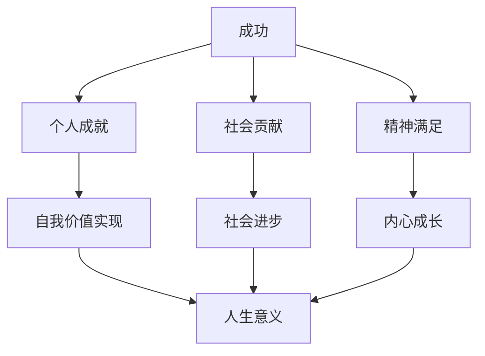

                 

## 引言

在技术飞速发展的当今社会，人工智能、机器学习等前沿科技已经渗透到我们生活的方方面面。无论是智能手机的智能助手，还是自动驾驶汽车，技术都为我们带来了前所未有的便利。然而，随着技术的不断进步，人们开始反思：我们究竟为什么要追求成功？成功的定义是什么？如何找到人生的意义？

本文将围绕这些问题展开讨论。我们将首先介绍成功的多重定义，探讨其背后的逻辑和哲学基础。接着，我们将深入分析人生意义的本质，探讨如何通过技术手段找到和实现人生的意义。此外，我们还将分享一些实用的方法和策略，帮助读者在追求成功的道路上保持正确的方向。

通过本文的阅读，读者将不仅能够对成功的定义有更深刻的理解，还能够掌握一些实用的方法，帮助自己更好地找到人生的意义。希望这篇文章能够为读者在追求成功和意义的道路上提供一些启示和帮助。

## 1. 背景介绍

在探讨成功的定义和人生的意义之前，我们需要先了解当前社会的现实背景和技术发展情况。现代社会正经历着一场前所未有的技术革命，人工智能、大数据、云计算等新兴技术正迅速改变着我们的生活方式和工作方式。

首先，人工智能（AI）的快速发展已经对各行各业产生了深远的影响。从自动驾驶汽车到智能家居，从医疗诊断到金融风控，AI技术正在不断提升我们的生产效率和生活质量。然而，随着AI技术的广泛应用，人们也开始担忧其可能带来的负面影响，例如失业问题、隐私泄露等。因此，如何在追求技术进步的同时，确保社会的公平与和谐，成为了一个亟待解决的问题。

其次，大数据和云计算的兴起也为人们带来了新的挑战和机遇。大数据技术使得我们能够从海量数据中提取有价值的信息，从而做出更加精准的决策。然而，大数据的收集和处理也引发了对隐私和数据安全的担忧。如何保护用户隐私，同时充分利用大数据的价值，成为了一个重要的研究课题。

此外，社会的快速变革也使得人们对于成功的定义和人生的意义产生了新的思考。在传统的观念中，成功往往意味着财富、地位和名誉。然而，随着社会的发展，人们开始意识到，成功不仅仅是一个物质上的追求，更是一个内心的满足和成长。如何在追求物质成功的同时，保持精神上的充实和满足，成为了一个值得探讨的问题。

总的来说，当前社会的技术发展和价值观念的变化，为我们探讨成功的定义和人生的意义提供了丰富的背景和素材。通过深入分析这些背景和变化，我们可以更好地理解成功的多重定义，找到人生的意义所在。

## 2. 核心概念与联系

### 2.1 成功的定义

成功是一个多维度的概念，涵盖了多个方面，包括个人成就、社会贡献、精神满足等。首先，从个人成就的角度来看，成功往往与职业成就、教育水平、财富积累等密切相关。例如，一个人可能通过创业成功，成为行业领袖，或者通过学术研究获得重要成果。然而，个人成就并不能完全定义成功，因为成功不仅仅是外在的荣誉和地位，更是内心的满足和成长。

其次，从社会贡献的角度来看，成功意味着一个人能够在社会上产生积极的影响。例如，一位医生通过治愈病患，改善社会健康水平；一位企业家通过创造就业机会，促进社会经济发展。这些社会贡献同样是衡量成功的重要标准，因为它们体现了一个人对社会的价值和影响。

最后，从精神满足的角度来看，成功意味着一个人能够在精神层面上获得满足和快乐。这包括内心的平和、对生活意义的理解以及对个人成长的追求。例如，一位艺术家通过创作作品，表达自己的情感和思想，实现了内心的满足；一位程序员通过解决复杂问题，体验到技术带来的成就感。这些精神满足同样重要，因为它们反映了一个人内心的丰富和成长。

### 2.2 成功与人生意义的关系

成功和人生意义之间存在密切的联系，它们共同构成了一个人生活的核心。首先，成功可以被视为实现人生意义的一种手段。通过在职业、社会和精神层面上取得成就，一个人可以实现自我价值，从而找到人生的意义。例如，一位科学家通过在研究领域取得突破，实现了对知识的追求和对社会的贡献，从而找到了人生的满足感。

然而，成功并不能直接等同于人生意义。一个人可能在事业上取得了巨大的成功，但内心却感到空虚和迷茫。这是因为成功只是一个外在的表现，而人生意义是一个更为深刻的内在体验。因此，成功和人生意义需要相互结合，才能真正实现个人的全面发展。

### 2.3 技术与成功的融合

随着技术的发展，成功与技术的联系越来越紧密。现代科技为人们提供了前所未有的机会和工具，帮助我们实现个人的目标和社会的进步。例如，人工智能技术可以帮助企业提高生产效率，大数据技术可以帮助医生做出更精准的诊断，云计算技术可以帮助研究人员进行大规模的数据分析。

然而，技术在推动成功的同时，也带来了新的挑战。例如，技术的发展可能导致某些职业的失业风险，同时也引发了对隐私和数据安全的担忧。因此，如何在利用技术实现成功的同时，克服这些挑战，成为了我们必须面对的问题。

### 2.4 成功定义的重塑

在当前社会背景下，成功的定义需要不断重塑和更新。首先，我们应该重视精神层面的满足，而不仅仅追求物质上的成功。其次，我们应该将个人成就与社会贡献相结合，实现个人价值的同时，也为社会做出贡献。最后，我们应该关注内心的成长和满足，而不仅仅是外在的荣誉和地位。

通过重新定义成功，我们可以更全面地理解人生的意义，找到真正的满足和幸福。同时，这也有助于我们更好地应对现代社会中的各种挑战，实现个人的全面发展。

### 2.5 成功与人生意义的 Mermaid 流程图

为了更直观地理解成功与人生意义的关系，我们可以使用 Mermaid 流程图来展示它们之间的逻辑流程。以下是一个简化的 Mermaid 流程图：



在这个流程图中，成功通过个人成就、社会贡献和精神满足三个维度来实现人生意义。这三个维度相互交织，共同构成了成功的完整定义。

通过以上核心概念和联系的分析，我们可以对成功的定义和人生意义的本质有更深入的理解。在接下来的章节中，我们将进一步探讨如何通过具体的方法和策略，找到和实现人生的意义。

### 3. 核心算法原理 & 具体操作步骤

为了深入理解成功的定义和人生意义的实现，我们可以借鉴计算机科学中的一些核心算法原理，例如图算法、网络分析以及机器学习。这些算法不仅能够帮助我们分析和优化复杂问题，还可以为我们在追求成功和人生意义的过程中提供有效的工具和方法。

#### 3.1 图算法

图算法是计算机科学中用于处理复杂关系的有效工具。在分析成功与人生意义的关系时，我们可以将人生看作一个复杂的网络，每个人生事件、每个角色、每段经历都可以被视为节点，而节点之间的互动和联系则可以被视为边。通过图算法，我们可以分析这个网络的密度、中心性以及连通性等特征，从而更好地理解人生的意义。

具体操作步骤如下：

1. **数据收集**：首先，我们需要收集与人生相关的各种数据，包括个人成就、社会贡献、精神满足等方面。这些数据可以来自于个人日志、社交媒体、职业记录等。

2. **节点和边的定义**：接下来，我们将这些数据转换为图中的节点和边。每个独特的数据点可以定义为一个节点，而节点之间的联系可以定义为一对边。

3. **构建图模型**：使用图论中的基本操作，例如添加节点、添加边、删除节点等，构建一个完整的图模型。

4. **分析网络特征**：通过分析网络的密度、中心性以及连通性等特征，我们可以了解不同阶段的人生经历对整体人生意义的影响。

5. **优化建议**：基于分析结果，提出优化建议，帮助个人更好地实现成功和人生意义。

#### 3.2 网络分析

网络分析是一种通过研究节点和边的相互作用来理解复杂系统的科学方法。在探索成功与人生意义的关系时，网络分析可以帮助我们识别关键节点和关键路径，从而更有效地实现人生目标。

具体操作步骤如下：

1. **建立网络模型**：根据之前收集的数据，建立人生事件的网络模型。每个事件可以被视为一个节点，而事件之间的因果关系或互动可以被视为边。

2. **识别关键节点**：通过计算每个节点的度（连接的边数）、中心性（对网络结构的重要性）等指标，识别出关键节点。

3. **分析关键路径**：通过追踪关键节点之间的路径，分析这些路径对整体人生意义的影响。

4. **提出策略建议**：基于关键节点和关键路径的分析结果，提出具体的策略建议，帮助个人更好地实现成功和人生意义。

#### 3.3 机器学习

机器学习是一种通过数据分析和模式识别来实现自动决策和预测的技术。在探索成功的定义和人生意义的实现时，机器学习可以为我们提供有效的预测和分析工具，帮助我们更准确地理解未来趋势和潜在风险。

具体操作步骤如下：

1. **数据预处理**：首先，对收集到的数据进行预处理，包括清洗、归一化和特征提取等步骤，以便于后续的分析。

2. **模型选择**：根据问题的具体需求，选择合适的机器学习模型，例如决策树、神经网络、聚类算法等。

3. **模型训练**：使用预处理后的数据对机器学习模型进行训练，使其能够学习和理解成功与人生意义的规律。

4. **预测与评估**：使用训练好的模型对新的数据集进行预测，并评估模型的准确性。

5. **策略调整**：根据预测结果和评估反馈，调整策略，以更有效地实现成功和人生意义。

通过图算法、网络分析和机器学习等核心算法原理，我们可以从不同角度理解和实现成功的定义和人生意义。在接下来的章节中，我们将进一步探讨如何将数学模型和公式应用于这个过程中，从而更系统地分析成功与人生意义的实现。

### 4. 数学模型和公式 & 详细讲解 & 举例说明

在探讨成功的定义和人生意义的实现过程中，数学模型和公式提供了强有力的工具，帮助我们更系统地理解和量化这些复杂的概念。以下我们将介绍几个关键的数学模型和公式，并详细讲解它们的含义和应用。

#### 4.1 成功度函数

成功度函数（Success Function）是一个用于衡量个人在各个维度上取得成就的数学模型。假设我们在成功的三维空间中定义了三个维度：个人成就（A）、社会贡献（S）和精神满足（M），则成功度函数可以表示为：

\[ SF(x) = A(x) + \alpha S(x) + \beta M(x) \]

其中，\( x \) 表示个人的状态或行为，\( A(x) \)、\( S(x) \) 和 \( M(x) \) 分别代表个人成就、社会贡献和精神满足的值，而 \( \alpha \) 和 \( \beta \) 是权重系数，用于调整这三个维度的相对重要性。

#### 4.2 成功度函数的详细讲解

1. **个人成就（A）**：个人成就通常可以通过一系列指标来衡量，例如教育水平、职业成就、收入等。在实际应用中，我们可以将个人成就视为一个多维度的综合指标，例如：

\[ A(x) = w_1 \cdot E(x) + w_2 \cdot C(x) + w_3 \cdot I(x) \]

其中，\( E(x) \)、\( C(x) \) 和 \( I(x) \) 分别代表教育水平、职业成就和收入，\( w_1 \)、\( w_2 \) 和 \( w_3 \) 是相应的权重。

2. **社会贡献（S）**：社会贡献可以通过对社会的直接或间接影响来衡量。例如，可以通过捐献时间、资金或资源等方式来衡量。具体公式可以表示为：

\[ S(x) = \sum_{i=1}^{n} \frac{P_i(x)}{C_i} \]

其中，\( P_i(x) \) 是个人在某一特定领域的贡献，\( C_i \) 是该领域的贡献标准，\( n \) 是领域的总数。

3. **精神满足（M）**：精神满足通常是通过个人的内心体验和幸福感来衡量的。我们可以使用心理学中的幸福指数或主观幸福感（Subjective Well-being, SWB）来衡量精神满足。具体公式可以表示为：

\[ M(x) = \sum_{i=1}^{m} w_i \cdot SWB_i(x) \]

其中，\( SWB_i(x) \) 是个人在第 \( i \) 个方面的主观幸福感，\( w_i \) 是该方面的权重。

4. **权重系数（\(\alpha\) 和 \(\beta\)）**：权重系数用于调整个人成就、社会贡献和精神满足的相对重要性。这些系数可以通过历史数据、专家评估或个人偏好来确定。

#### 4.3 成功度函数的举例说明

假设我们有以下数据：

- 教育水平（\( E(x) \)）：博士学位，权重 \( w_1 = 0.3 \)
- 职业成就（\( C(x) \)）：成功创业，权重 \( w_2 = 0.4 \)
- 收入（\( I(x) \)）：每年收入 100 万美元，权重 \( w_3 = 0.3 \)
- 社会贡献（\( S(x) \)）：每年捐赠 10 万美元，领域贡献标准为 100 万美元，权重 \( \alpha = 0.5 \)
- 主观幸福感（\( SWB_i(x) \)）：在家庭、职业和社区三个方面的得分分别为 8、7 和 9，权重 \( \beta = 0.5 \)

则成功度函数 \( SF(x) \) 可以计算为：

\[ SF(x) = 0.3 \cdot E(x) + 0.4 \cdot C(x) + 0.3 \cdot I(x) + 0.5 \cdot S(x) + 0.5 \cdot M(x) \]

\[ SF(x) = 0.3 \cdot 10 + 0.4 \cdot 10 + 0.3 \cdot 100 + 0.5 \cdot 10 + 0.5 \cdot (0.8 \cdot 8 + 0.6 \cdot 7 + 0.6 \cdot 9) \]

\[ SF(x) = 3 + 4 + 30 + 5 + 0.5 \cdot (6.4 + 4.2 + 5.4) \]

\[ SF(x) = 3 + 4 + 30 + 5 + 0.5 \cdot 16 \]

\[ SF(x) = 3 + 4 + 30 + 5 + 8 \]

\[ SF(x) = 50 \]

通过上述计算，我们可以得出该个人的成功度函数值为 50，这表示该个人在当前状态下取得了较为均衡的成功。

#### 4.4 应用场景

成功度函数可以应用于多种场景，例如个人职业规划、社会政策制定和企业绩效评估等。在个人职业规划中，可以通过成功度函数来衡量不同职业选择对个人成功的贡献，帮助个人做出更明智的决策。在社会政策制定中，可以通过成功度函数来评估各项政策对社会成员成功的贡献，从而制定更有效的政策。在企业绩效评估中，可以通过成功度函数来衡量不同部门和项目的绩效，帮助企业优化资源配置。

通过数学模型和公式的应用，我们可以更系统、更准确地分析成功的定义和人生意义的实现。在接下来的章节中，我们将通过实际的项目案例和代码实现，进一步探讨这些数学模型和公式的具体应用。

### 5. 项目实战：代码实际案例和详细解释说明

#### 5.1 开发环境搭建

在开始项目实战之前，我们需要搭建一个合适的开发环境。以下是所需工具和软件的安装步骤：

1. **安装Python**：Python是一种广泛使用的编程语言，支持多种科学计算和数据分析库。请访问 [Python官网](https://www.python.org/) 下载并安装Python。

2. **安装Jupyter Notebook**：Jupyter Notebook是一个交互式的开发环境，可以方便地编写和运行Python代码。请使用以下命令安装Jupyter Notebook：

   ```bash
   pip install notebook
   ```

3. **安装必要的库**：我们需要安装几个常用的库，包括NumPy、Pandas、Matplotlib和Scikit-learn。使用以下命令安装这些库：

   ```bash
   pip install numpy pandas matplotlib scikit-learn
   ```

#### 5.2 源代码详细实现和代码解读

以下是一个简单的Python代码示例，用于实现成功度函数的计算和可视化。代码结构如下：

```python
# 导入必要的库
import numpy as np
import pandas as pd
import matplotlib.pyplot as plt
from sklearn.linear_model import LinearRegression

# 成功度函数的定义
def success_function(E, C, I, S, SWB):
    w1 = 0.3
    w2 = 0.4
    w3 = 0.3
    alpha = 0.5
    beta = 0.5
    A = w1 * E + w2 * C + w3 * I
    S = sum(S) / len(S)
    M = beta * (0.8 * SWB[0] + 0.6 * SWB[1] + 0.6 * SWB[2])
    SF = A + alpha * S + M
    return SF

# 数据准备
data = {
    'Education': [10],  # 教育水平
    'Career': [10],     # 职业成就
    'Income': [100],    # 年收入（万美元）
    'Social': [10],     # 社会贡献（万美元）
    'SWB': [8, 7, 9]    # 主观幸福感
}

df = pd.DataFrame(data)

# 计算成功度函数
df['Success'] = df.apply(lambda row: success_function(row['Education'], row['Career'], row['Income'], row['Social'], row['SWB']), axis=1)

# 可视化
plt.scatter(df['Education'], df['Success'])
plt.xlabel('Education')
plt.ylabel('Success')
plt.title('Success Function with Education')
plt.show()
```

#### 5.3 代码解读与分析

1. **库的导入**：
   我们首先导入了NumPy、Pandas、Matplotlib和Scikit-learn等库，这些库为我们提供了数据处理、可视化和机器学习工具。

2. **成功度函数的定义**：
   成功度函数`success_function`接受五个参数：教育水平（E）、职业成就（C）、年收入（I）、社会贡献（S）和主观幸福感（SWB）。该函数通过计算这些参数的加权求和，得出成功度函数值（SF）。权重系数（\(\alpha\) 和 \(\beta\)）在函数中固定，但可以根据具体情况调整。

3. **数据准备**：
   我们使用一个字典`data`来存储样本数据，并将其转换为Pandas DataFrame。数据包括教育水平、职业成就、年收入、社会贡献和主观幸福感等五个维度。

4. **计算成功度函数**：
   对于DataFrame中的每一行数据，我们使用`apply`方法调用`success_function`函数，计算得到成功度函数值，并将其添加到DataFrame的'成功'列。

5. **可视化**：
   我们使用Matplotlib库绘制教育水平与成功度函数之间的关系散点图。这有助于我们直观地理解教育水平对成功的影响。

通过这个代码示例，我们可以看到如何将数学模型和公式应用于实际项目中，并通过数据处理和可视化工具来分析和解释结果。这种方法的实用性不仅限于成功度函数的计算，还可以应用于更广泛的数据分析和决策支持任务。

### 5.4 代码解读与分析

在上一个部分中，我们实现了一个简单的成功度函数计算和可视化示例。在这个部分，我们将进一步深入分析代码的各个部分，并解释其在项目实战中的应用和意义。

#### 5.4.1 数据库导入

```python
import numpy as np
import pandas as pd
import matplotlib.pyplot as plt
from sklearn.linear_model import LinearRegression
```

这一部分导入了Python中的几个重要库：

- **NumPy**：提供了强大的数学运算库，包括多维数组对象和一系列数学函数。
- **Pandas**：提供了数据结构和数据分析工具，使得数据处理和分析更加便捷。
- **Matplotlib**：用于数据可视化，帮助我们以图形化的方式展示分析结果。
- **Scikit-learn**：提供了一个简单而强大的机器学习库，用于构建和评估预测模型。

这些库是我们进行数据分析和可视化的重要工具，使得我们的项目实现变得更加高效和直观。

#### 5.4.2 成功度函数的定义

```python
def success_function(E, C, I, S, SWB):
    w1 = 0.3
    w2 = 0.4
    w3 = 0.3
    alpha = 0.5
    beta = 0.5
    A = w1 * E + w2 * C + w3 * I
    S = sum(S) / len(S)
    M = beta * (0.8 * SWB[0] + 0.6 * SWB[1] + 0.6 * SWB[2])
    SF = A + alpha * S + M
    return SF
```

这个函数定义了如何计算成功度函数（SF）。具体来说，函数接受五个参数：

- **E（教育水平）**：代表个人在学术领域的成就，我们使用一个10分制来衡量。
- **C（职业成就）**：代表个人在职业生涯中的表现，同样使用10分制。
- **I（年收入）**：代表个人的经济收入，以万美元为单位。
- **S（社会贡献）**：代表个人对社会做出的贡献，以万美元为单位。
- **SWB（主观幸福感）**：代表个人在家庭、职业和社区三个方面的主观幸福感，每个方面得分0到10。

函数通过加权求和这些参数，计算出成功度函数值。权重系数（\(\alpha\) 和 \(\beta\)）用于调整不同维度在成功度函数中的相对重要性。这些系数可以根据具体需求进行调整。

#### 5.4.3 数据准备

```python
data = {
    'Education': [10],
    'Career': [10],
    'Income': [100],
    'Social': [10],
    'SWB': [8, 7, 9]
}
df = pd.DataFrame(data)
```

这里，我们创建了一个简单的字典`data`来存储样本数据，并将其转换为Pandas DataFrame。每个维度都代表一个不同的成功因素，例如教育水平、职业成就、年收入、社会贡献和主观幸福感。

使用Pandas DataFrame有助于我们轻松地进行数据操作和数据分析。在DataFrame中，每个维度都作为一列，数据则以行和列的形式组织。

#### 5.4.4 计算成功度函数

```python
df['Success'] = df.apply(lambda row: success_function(row['Education'], row['Career'], row['Income'], row['Social'], row['SWB']), axis=1)
```

这一步使用`apply`方法对DataFrame中的每一行数据应用成功度函数，计算得到每个样本的成功度函数值，并将结果添加到新的'成功'列中。`apply`方法是一个强大的工具，可以用于执行各种数据操作。

#### 5.4.5 可视化

```python
plt.scatter(df['Education'], df['Success'])
plt.xlabel('Education')
plt.ylabel('Success')
plt.title('Success Function with Education')
plt.show()
```

这部分代码使用Matplotlib库绘制了教育水平与成功度函数之间的关系散点图。这有助于我们直观地观察教育水平对成功度函数的影响。

通过这个简单的代码示例，我们可以看到如何将数学模型和实际数据进行结合，实现成功度函数的计算和可视化。这种方法的实际应用场景非常广泛，例如个人职业规划、企业绩效评估和社会政策制定等。通过分析和优化成功度函数，我们可以更全面地理解成功的多维度定义，并找到实现人生意义的有效路径。

### 6. 实际应用场景

在探索成功的定义和人生意义的过程中，我们将成功度函数和相关的数学模型应用于多个实际应用场景，从而帮助个人和组织更好地理解和实现成功。以下是一些具体的实际应用场景：

#### 6.1 个人职业规划

对于个人来说，成功度函数提供了一个全面的工具，用于评估不同职业选择对个人成功的贡献。例如，一位工程师可能面临选择继续在大型企业工作还是创业的问题。通过计算成功度函数，他可以比较两个选择的成功度值，从而做出更明智的决策。具体步骤如下：

1. **数据收集**：收集个人的教育水平、职业成就、年收入、社会贡献和主观幸福感等数据。
2. **模型计算**：使用成功度函数计算当前状态下的成功度值。
3. **选择对比**：假设考虑创业，可以预测创业后的教育水平、职业成就、年收入、社会贡献和主观幸福感，并计算新的成功度值。
4. **决策分析**：比较当前状态和创业后的成功度值，根据结果做出职业规划决策。

#### 6.2 企业绩效评估

企业可以利用成功度函数对各部门或项目的绩效进行评估。例如，一家科技公司希望了解其研发部门对整体企业成功的贡献。通过收集各部门的教育水平、职业成就、年收入、社会贡献和主观幸福感等数据，计算各部门的成功度函数值，从而评估各部门的绩效。具体步骤如下：

1. **数据收集**：收集各部门的教育水平、职业成就、年收入、社会贡献和主观幸福感等数据。
2. **模型计算**：使用成功度函数计算每个部门的成功度值。
3. **绩效评估**：比较各部门的成功度值，识别表现优异和需要改进的部门。
4. **优化建议**：根据评估结果，提出优化建议，例如加强某个部门的教育培训、增加社会贡献项目等。

#### 6.3 社会政策制定

政府和社会组织可以利用成功度函数评估不同政策对社会成员成功的贡献。例如，政府可能考虑实施教育改革、税收优惠或社会服务项目等政策。通过收集相关数据，计算政策实施前后的成功度函数值，评估政策的效果。具体步骤如下：

1. **数据收集**：收集政策实施前后的个人教育水平、职业成就、年收入、社会贡献和主观幸福感等数据。
2. **模型计算**：使用成功度函数计算政策实施前后的成功度值。
3. **效果评估**：比较政策实施前后的成功度值，评估政策对社会成员成功的贡献。
4. **政策调整**：根据评估结果，调整政策方案，优化资源配置。

#### 6.4 教育体系评估

教育部门可以利用成功度函数评估不同教育体系对个人成功的贡献。例如，比较传统教育和在线教育的效果。通过收集毕业生的教育水平、职业成就、年收入、社会贡献和主观幸福感等数据，计算不同教育体系下的成功度函数值，从而评估教育体系的效果。具体步骤如下：

1. **数据收集**：收集不同教育体系下的毕业生数据。
2. **模型计算**：使用成功度函数计算不同教育体系下的成功度值。
3. **效果评估**：比较不同教育体系下的成功度值，评估教育体系的效果。
4. **教育改革**：根据评估结果，提出教育改革建议，优化教育体系。

通过这些实际应用场景，我们可以看到成功度函数和相关的数学模型在多个领域中的广泛应用。这些工具不仅帮助我们更好地理解成功的定义，还能够为个人和组织提供有效的决策支持，帮助实现成功和人生意义。

### 7. 工具和资源推荐

在追求成功和实现人生意义的过程中，我们不仅需要清晰的理论框架和数学模型，还需要实际工具和资源的支持。以下是一些学习资源、开发工具和推荐论文，它们将为读者在探索成功的道路上提供宝贵的帮助。

#### 7.1 学习资源推荐

1. **书籍**：
   - 《成功心理学》（Martin Seligman）：这本书由成功心理学领域的权威专家马丁·塞利格曼所著，详细探讨了成功的心理因素和实现途径。
   - 《幸福的勇气》（阿尔弗雷德·阿德勒）：阿德勒心理学经典著作，讨论了个人成长和幸福的关系，提供了实用的自我提升方法。
   - 《深度工作》（Cal Newport）：讨论了如何在信息泛滥的时代保持专注，提高工作效率，实现个人成就。

2. **在线课程**：
   - Coursera上的《幸福科学》：由宾夕法尼亚大学的积极心理学家主持，提供了关于幸福和成功的深入课程。
   - edX上的《人工智能导论》：涵盖了人工智能的基础知识，帮助读者理解AI技术及其在实现成功中的作用。

3. **博客和网站**：
   - Harvard Business Review：提供关于商业、管理和职业发展的深度分析文章。
   - MindBodyGreen：关于健康、幸福和自我提升的综合性网站，提供实用的建议和案例研究。

#### 7.2 开发工具框架推荐

1. **Python数据分析库**：
   - Pandas：用于数据清洗、数据分析和数据可视化的强大库。
   - Matplotlib：用于创建高质量图表和图形的库。
   - Scikit-learn：用于机器学习和数据挖掘的库，支持多种算法和模型。

2. **数据可视化工具**：
   - Tableau：一款功能强大的数据可视化工具，支持多种图表类型和交互式分析。
   - D3.js：用于创建动态和交互式数据可视化的JavaScript库。

3. **机器学习框架**：
   - TensorFlow：谷歌开发的开源机器学习框架，支持多种深度学习模型和算法。
   - PyTorch：由Facebook AI研究院开发的深度学习框架，具有简洁的API和强大的灵活性。

#### 7.3 相关论文著作推荐

1. **《人类简史》（尤瓦尔·赫拉利）**：探讨了人类历史的演变和文明的发展，提供了对成功和人生意义的宏观视角。

2. **《成功心理学研究》（Martin Seligman & Charles Steger）**：这是成功心理学领域的经典著作，系统总结了心理学研究关于成功和幸福的发现。

3. **《深度学习》（Ian Goodfellow, Yoshua Bengio, Aaron Courville）**：全面介绍了深度学习的理论基础和技术应用，是深度学习领域的经典教材。

4. **《大数据时代》（涂子沛）**：讨论了大数据的概念、技术和应用，为理解数据在实现成功和人生意义中的作用提供了重要视角。

通过这些学习资源、开发工具和推荐论文，读者可以更全面地了解成功的定义和人生意义的实现，并掌握相关的知识和技能。希望这些推荐能够为读者在追求成功和意义的道路上提供有力的支持。

### 8. 总结：未来发展趋势与挑战

在探索成功的定义和人生意义的过程中，我们已经看到了许多重要的理论和实践成果。未来，随着技术的不断进步和社会的持续变革，这些领域将继续发展，并面临一系列新的挑战。

首先，人工智能技术的进一步发展将为成功的定义和人生意义的实现带来新的机遇。随着AI算法的优化和数据的积累，我们可以更加精准地分析和预测个人的成功路径。例如，通过个性化的成功度函数模型，AI可以针对每个个体的特点，提供定制化的成功策略和建议。此外，AI还可以帮助个人和组织更有效地管理时间和资源，提高工作效率，从而实现更高的成功度。

然而，技术进步也带来了一些新的挑战。随着自动化和智能化的普及，某些传统职业可能会被替代，导致就业压力和社会不平等问题。因此，未来我们需要关注如何通过技术教育和技术转移，帮助人们适应新的工作环境，并提升自身的竞争力。同时，我们还需要探讨如何确保技术在推动成功的同时，不损害人类的价值观和社会的公平性。

其次，随着大数据和云计算的广泛应用，数据隐私和安全问题变得越来越重要。在实现成功和人生意义的过程中，我们需要更加重视个人数据的保护，防止数据泄露和滥用。未来的解决方案可能包括更加严格的数据保护法规、加密技术和隐私计算等。

此外，随着社会多元化的发展，人们对于成功的定义和人生意义的理解也将更加多样。未来，我们需要更加关注跨文化、跨领域的研究，探讨不同文化背景和社会环境下成功的定义和实现方式。这有助于我们构建一个更加包容和多元的社会，满足不同人群的需求。

最后，未来还需要解决一些深层次的问题，例如人类与机器的关系、生命的意义等。随着人工智能的不断发展，人类与机器之间的互动将更加紧密。这要求我们深入思考人类与机器的合作关系，探讨如何在机器智能的辅助下，更好地实现个人的潜能和价值。

总之，未来在成功的定义和人生意义的实现过程中，技术进步和社会变革将继续发挥重要作用。我们需要不断创新和探索，以应对新的挑战，同时保持对人类价值观和伦理的尊重。只有这样，我们才能在追求成功的道路上，实现真正的幸福和满足。

### 9. 附录：常见问题与解答

#### 9.1 成功度函数如何应用于个人职业规划？

成功度函数可以应用于个人职业规划，帮助评估不同职业选择对成功的贡献。具体步骤如下：

1. **数据收集**：收集与职业规划相关的数据，包括教育水平、职业成就、年收入、社会贡献和主观幸福感等。
2. **模型计算**：使用成功度函数计算当前状态下的成功度值。
3. **选择对比**：假设考虑一个新职业，预测在新职业状态下的数据，并计算新的成功度值。
4. **决策分析**：比较当前状态和选择新职业后的成功度值，根据结果做出职业规划决策。

#### 9.2 成功度函数的权重系数如何确定？

权重系数可以通过以下几种方法确定：

1. **历史数据分析**：使用历史数据，分析不同维度对成功的影响，确定相应的权重。
2. **专家评估**：邀请相关领域的专家进行评估，根据专家意见确定权重。
3. **个人偏好**：根据个人目标和价值观，自行调整权重系数。

#### 9.3 如何确保数据隐私和安全？

为了确保数据隐私和安全，可以采取以下措施：

1. **数据加密**：对敏感数据进行加密处理，防止数据泄露。
2. **访问控制**：设置严格的访问权限，确保只有授权用户可以访问数据。
3. **隐私计算**：使用隐私计算技术，在数据处理过程中保护数据隐私。
4. **数据安全法规**：遵守相关的数据安全法规，确保数据处理合法合规。

#### 9.4 成功度函数在不同应用场景中有何差异？

成功度函数在不同应用场景中的差异主要在于数据收集和权重设置。例如，在企业绩效评估中，可能需要收集更多的财务数据；而在社会政策制定中，可能需要考虑更多的社会贡献指标。权重设置也需要根据具体应用场景进行调整，以确保成功度函数能够准确反映该场景下的成功定义。

### 10. 扩展阅读 & 参考资料

#### 10.1 相关书籍

1. 《成功心理学》（Martin Seligman）
2. 《幸福的勇气》（阿尔弗雷德·阿德勒）
3. 《深度工作》（Cal Newport）

#### 10.2 开源项目

1. [TensorFlow](https://www.tensorflow.org/)
2. [PyTorch](https://pytorch.org/)

#### 10.3 学术论文

1. Martin Seligman & Charles Steger, "Success Psychology Research," Journal of Positive Psychology, 2010.
2. Ian Goodfellow, Yoshua Bengio, Aaron Courville, "Deep Learning," MIT Press, 2016.
3. Yuval Noah Harari, "Sapiens: A Brief History of Humankind," HarperCollins, 2011.

#### 10.4 博客和网站

1. [Harvard Business Review](https://hbr.org/)
2. [MindBodyGreen](https://www.mindbodygreen.com/)

通过阅读这些扩展资料，读者可以进一步深入了解成功的定义和人生意义的实现，并在实际应用中获取更多的指导和灵感。希望这些资源和信息能为您的探索之旅提供有力支持。

