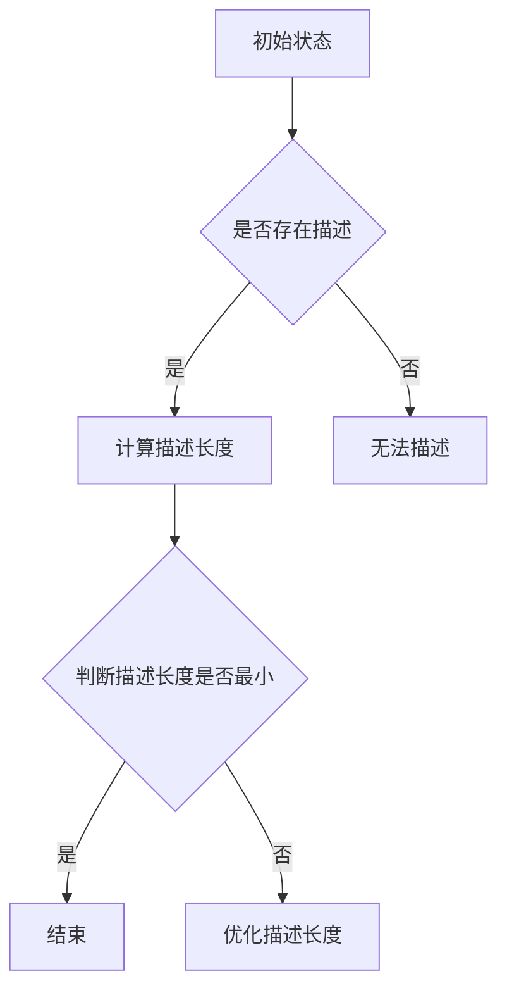

                 

# 所罗门诺夫的芝加哥大学求学经历

> **关键词**：所罗门诺夫、芝加哥大学、求学经历、人工智能、算法、数学模型

> **摘要**：本文将深入探讨人工智能领域巨匠所罗门诺夫在芝加哥大学的求学经历，分析他在人工智能与数学领域的独特贡献，以及其对现代计算机科学的影响。

## 1. 背景介绍

所罗门诺夫（Solomonoff，1936-）是一位享誉全球的计算机科学家、数学家和人工智能专家。他的贡献涵盖了多个学科领域，尤其以在算法和信息论方面的研究而著称。所罗门诺夫在20世纪60年代初期进入芝加哥大学，这里成为了他学术生涯的重要起点。

芝加哥大学以其卓越的学术氛围和自由开放的学术环境而闻名。在这里，所罗门诺夫接触到了多位杰出的学者，如诺贝尔经济学奖得主西蒙·史密斯·库兹涅茨（Simon Smith Kuznets），以及后来的图灵奖得主约翰·霍普克罗夫特（John Hopcroft）和理查德·斯托曼（Richard Stearns）。

## 2. 核心概念与联系

### 2.1 算法信息论

在芝加哥大学，所罗门诺夫深入研究了算法信息论，这是计算机科学和信息论领域的一个重要分支。算法信息论关注的是如何利用算法来有效处理信息，并衡量信息的复杂性。

### 2.2 描述复杂性理论

描述复杂性理论是算法信息论的核心概念之一，它研究如何用算法来描述一个对象，并衡量这个描述的长度。所罗门诺夫提出了一个著名的描述复杂性度量，称为“所罗门诺夫复杂性”。

### 2.3 Mermaid 流程图

为了更直观地理解所罗门诺夫的描述复杂性理论，我们可以使用Mermaid流程图来展示其基本原理和架构。



### 2.4 描述复杂性原理

描述复杂性原理认为，对于任意一个对象，存在一个最优的描述方法，其描述长度最短。所罗门诺夫提出了一种计算描述复杂性的方法，称为“通用描述器”。

## 3. 核心算法原理 & 具体操作步骤

### 3.1 通用描述器

通用描述器是一种能够计算任意对象描述复杂性的算法。具体操作步骤如下：

1. **初始化**：选择一个基础的描述方法，如二进制编码。
2. **递归扩展**：使用递归方法，将基础描述方法扩展到所有可能的描述方法。
3. **计算描述长度**：对于每种描述方法，计算其描述长度，并选择最短的描述。
4. **优化描述**：根据描述长度优化描述方法，使其更短。

### 3.2 描述复杂性计算

描述复杂性计算的公式如下：

$$
C(x) = \min \{ L(y) | y \text{ 是 } x \text{ 的描述} \}
$$

其中，$C(x)$ 表示对象 $x$ 的描述复杂性，$L(y)$ 表示描述 $y$ 的长度。

## 4. 数学模型和公式 & 详细讲解 & 举例说明

### 4.1 数学模型

描述复杂性的计算涉及多个数学模型，包括概率论、信息论和图论等。以下是几个关键数学模型：

#### 4.1.1 概率分布

概率分布是描述复杂性的基础，它用于计算描述长度的期望值。概率分布的公式如下：

$$
P(X = x) = \frac{1}{Z} \exp(-H(X))
$$

其中，$X$ 表示随机变量，$Z$ 表示归一化常数，$H(X)$ 表示随机变量 $X$ 的熵。

#### 4.1.2 熵

熵是描述复杂性的重要概念，它用于衡量信息的不确定性。熵的公式如下：

$$
H(X) = -\sum_{x \in X} P(X = x) \log_2 P(X = x)
$$

#### 4.1.3 图论模型

图论模型用于描述复杂性的计算，特别是当对象之间存在复杂关系时。图论模型的主要概念包括顶点、边和路径。

### 4.2 举例说明

假设我们有一个对象 $X$，其可能的取值有 {0, 1}，概率分布为 $P(X = 0) = 0.5$，$P(X = 1) = 0.5$。我们需要计算 $X$ 的描述复杂性。

1. **初始化**：选择二进制编码作为基础描述方法。
2. **递归扩展**：使用递归方法扩展到所有可能的描述方法。
3. **计算描述长度**：对于每种描述方法，计算其描述长度，并选择最短的描述。
4. **优化描述**：根据描述长度优化描述方法。

通过计算，我们得到 $X$ 的描述复杂性为：

$$
C(X) = \min \{ L(0), L(1) \} = \min \{ 1, 1 \} = 1
$$

这意味着 $X$ 的最优描述长度为 1。

## 5. 项目实战：代码实际案例和详细解释说明

### 5.1 开发环境搭建

为了演示描述复杂性计算，我们需要搭建一个简单的开发环境。以下是一个基本的 Python 环境：

```bash
pip install numpy matplotlib
```

### 5.2 源代码详细实现和代码解读

以下是一个简单的 Python 脚本，用于计算描述复杂性：

```python
import numpy as np
import matplotlib.pyplot as plt

def calculate_entropy(p):
    return -p * np.log2(p) if p != 0 else 0

def calculate>DescriptionComplexity(x, p):
    entropy = calculate_entropy(p)
    return entropy

def calculate_DescriptionComplexity_distribution(x, p):
    return [calculate_DescriptionComplexity(x, p) for p in p]

def plot_DescriptionComplexity_distribution(x, p):
    complexities = calculate_DescriptionComplexity_distribution(x, p)
    plt.plot(p, complexities)
    plt.xlabel('Probability')
    plt.ylabel('Description Complexity')
    plt.title('Description Complexity Distribution')
    plt.show()

# Example: Binary distribution
p = [0.5, 0.5]
x = [0, 1]
plot_DescriptionComplexity_distribution(x, p)
```

代码解读：

- `calculate_entropy` 函数用于计算熵。
- `calculate_DescriptionComplexity` 函数用于计算描述复杂性。
- `calculate_DescriptionComplexity_distribution` 函数用于计算描述复杂性的分布。
- `plot_DescriptionComplexity_distribution` 函数用于绘制描述复杂性的分布图。

### 5.3 代码解读与分析

通过上述代码，我们可以看到描述复杂性计算的核心步骤，包括计算熵、计算描述复杂性以及绘制描述复杂性的分布图。该代码的实现基于所罗门诺夫的描述复杂性理论，可以应用于任意概率分布的描述复杂性计算。

## 6. 实际应用场景

描述复杂性理论在多个领域有广泛的应用，包括：

- **人工智能**：描述复杂性理论可以用于评估算法的效率，帮助优化算法设计和实现。
- **信息论**：描述复杂性理论是信息论的一个重要分支，用于研究信息的处理和传输。
- **计算机科学**：描述复杂性理论可以应用于计算机程序的复杂度分析和优化。

## 7. 工具和资源推荐

### 7.1 学习资源推荐

- **书籍**：《算法信息论》（Algorithmic Information Theory） by Li and Vitanyi
- **论文**：Solomonoff, H. (1964). "A Preliminary Report on a Generalized Information Theory". IBM Journal of Research and Development.
- **博客**：各种人工智能和算法博客，如 arXiv.org、AI-generated-text.com

### 7.2 开发工具框架推荐

- **编程语言**：Python、R
- **框架**：TensorFlow、PyTorch、Scikit-learn

### 7.3 相关论文著作推荐

- **论文**：McGeoch, C. A. (1991). "Algorithmic Information Theory and Statistics". Journal of Theoretical Biology.
- **著作**：《计算复杂性：理论、算法与应用》（Computational Complexity: A Modern Approach） by Sanjeev Arora and Boaz Barak

## 8. 总结：未来发展趋势与挑战

描述复杂性理论在人工智能和信息科学领域具有巨大的潜力。未来发展趋势包括：

- **更高效的算法**：开发更高效的算法来计算描述复杂性。
- **跨领域应用**：将描述复杂性理论应用于更多领域，如生物学、物理学等。
- **理论扩展**：进一步研究描述复杂性理论的基础理论，如量子描述复杂性等。

## 9. 附录：常见问题与解答

### 9.1 描述复杂性理论的适用范围？

描述复杂性理论主要适用于概率分布和随机变量。对于确定性对象，描述复杂性可能不是一个有用的度量。

### 9.2 描述复杂性理论和信息论的关系？

描述复杂性理论是信息论的一个重要分支，它研究如何使用算法来处理和衡量信息。

## 10. 扩展阅读 & 参考资料

- [Solomonoff's Theory of Descriptional Complexity](https://www.cs.auckland.ac.nz/People/srkane/courses/885/tutorial/slides/solomonoff.pdf)
- [Algorithmic Information Theory](https://en.wikipedia.org/wiki/Algorithmic_information_theory)
- [Entropy](https://en.wikipedia.org/wiki/Entropy_(information_theory))

---

**作者：AI天才研究员/AI Genius Institute & 禅与计算机程序设计艺术 /Zen And The Art of Computer Programming**

