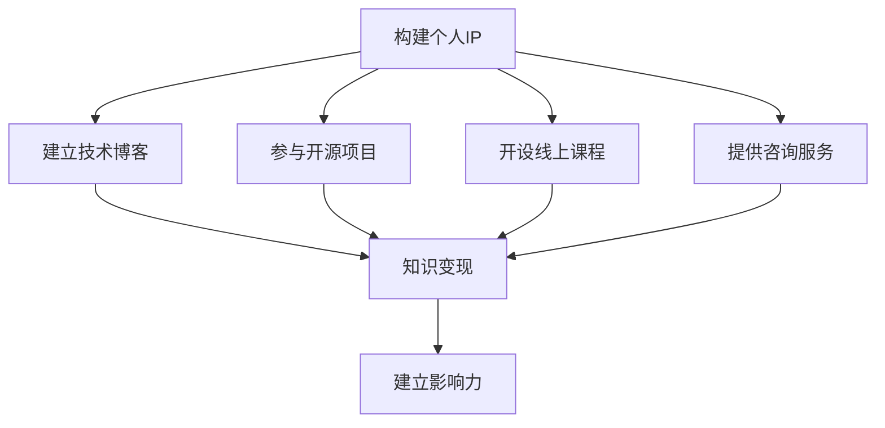

                 

# 打造个人IP：程序员的知识变现之道

> **关键词：** 个人IP，知识变现，程序员，影响力，技术博客

> **摘要：** 本文将探讨程序员如何通过构建个人IP，利用知识和技能实现知识变现。我们将分析个人IP的构建过程，分享一些成功案例，并探讨如何在技术领域建立自己的影响力。

## 1. 背景介绍

在当今信息爆炸的时代，互联网已成为知识和技能传播的主要渠道。程序员作为技术领域的核心群体，不仅需要掌握丰富的技术知识，还需要学会如何将知识转化为实际的价值。个人IP的构建成为程序员实现知识变现的重要途径。通过个人IP的打造，程序员可以在互联网上建立起自己的品牌和影响力，从而吸引更多的关注和机会。

本文将围绕以下几个核心问题展开：

- 个人IP是什么？如何构建？
- 程序员如何利用个人IP实现知识变现？
- 成功案例及经验分享
- 如何在技术领域建立自己的影响力？
- 未来发展趋势与挑战

通过本文的阅读，读者将了解到如何通过构建个人IP，实现从程序员到技术专家的转型，从而在激烈的市场竞争中脱颖而出。

## 2. 核心概念与联系

### 个人IP

个人IP（Intellectual Property）是指个人在某个领域内所拥有的独特知识、技能、经验和品牌价值。在互联网时代，个人IP成为衡量个人影响力的关键指标。

### 知识变现

知识变现是指将个人的知识和技能转化为实际价值的过程。这包括但不限于通过撰写技术博客、开设线上课程、参与技术讲座和研讨会、提供咨询服务等方式。

### 影响力

影响力是指个人或组织在特定领域内所产生的影响力和号召力。在技术领域，影响力可以通过技术博客、开源项目、在线课程、社交媒体等途径来衡量。

### 个人IP与知识变现、影响力的关系

个人IP是知识变现和影响力建立的基础。一个强大的个人IP可以吸引更多的关注，提高个人在技术领域的知名度，从而实现知识变现和影响力的提升。

### Mermaid 流程图

以下是构建个人IP的Mermaid流程图，展示了从个人IP到知识变现和影响力建立的过程。



## 3. 核心算法原理 & 具体操作步骤

### 个人IP构建的核心算法原理

构建个人IP的核心算法可以概括为以下几点：

1. **定位与目标明确**：首先需要明确自己在技术领域的定位和目标，确定要深耕的细分领域。
2. **持续学习和积累**：在定位明确后，通过不断学习和实践，积累专业知识和经验。
3. **内容输出**：通过技术博客、开源项目、线上课程等方式，将所学知识和经验输出给读者。
4. **互动与反馈**：与读者互动，收集反馈，不断优化内容输出。
5. **品牌塑造**：在内容输出的过程中，塑造自己的个人品牌和风格。

### 具体操作步骤

1. **定位与目标明确**
   - 分析自身优势和兴趣
   - 确定要深耕的细分领域
   - 设定个人IP的目标和愿景

2. **持续学习和积累**
   - 阅读相关技术书籍和论文
   - 参加技术讲座和研讨会
   - 实践项目和案例研究

3. **内容输出**
   - 创建个人技术博客
   - 参与开源项目
   - 开设线上课程
   - 提供技术咨询服务

4. **互动与反馈**
   - 与读者互动，回复评论和私信
   - 定期收集读者反馈，优化内容输出

5. **品牌塑造**
   - 确定个人品牌形象和风格
   - 在所有内容中保持一致的品牌形象
   - 通过社交媒体和线上活动提升个人知名度

## 4. 数学模型和公式 & 详细讲解 & 举例说明

### 数学模型

构建个人IP的数学模型可以看作是一个多维度的动态优化过程。以下是核心的数学模型：

\[ \text{IP Value} = f(\text{Knowledge}, \text{Content Output}, \text{Feedback}, \text{Brand}) \]

其中：
- \( \text{IP Value} \) 表示个人IP的价值
- \( \text{Knowledge} \) 表示个人知识和技能
- \( \text{Content Output} \) 表示内容输出的质量和数量
- \( \text{Feedback} \) 表示互动和反馈的质量
- \( \text{Brand} \) 表示个人品牌和影响力

### 详细讲解

1. **知识（Knowledge）**：个人知识和技能是构建个人IP的核心。通过不断学习和实践，个人可以积累丰富的技术知识和经验。这些知识和经验是构建个人IP的基石。

2. **内容输出（Content Output）**：内容输出是个人IP价值实现的关键。通过技术博客、开源项目、线上课程等方式，个人可以将所学知识和经验分享给他人。高质量的内容输出能够吸引更多的关注和机会。

3. **互动与反馈（Feedback）**：互动与反馈是优化内容输出的重要手段。通过与读者的互动，个人可以了解读者的需求和反馈，从而不断优化内容输出。

4. **品牌（Brand）**：个人品牌和影响力是个人IP的重要组成部分。一个强大的个人品牌能够提升个人在技术领域的知名度和认可度，从而实现知识变现和影响力的提升。

### 举例说明

假设一个程序员A，他的个人知识和技能（Knowledge）非常高，他经常在技术博客上撰写高质量的文章（Content Output），并且与读者保持良好的互动和反馈（Feedback），他的个人品牌（Brand）也非常强大。那么，根据上述数学模型，A的个人IP价值（IP Value）将会非常高。

\[ \text{IP Value of A} = f(\text{High Knowledge}, \text{High Content Output}, \text{High Feedback}, \text{High Brand}) \]

## 5. 项目实战：代码实际案例和详细解释说明

### 开发环境搭建

为了更好地展示如何利用个人IP实现知识变现，我们将以一个具体的开源项目为例。首先，我们需要搭建一个完整的开发环境。

#### 5.1. 开发工具

- **文本编辑器**：推荐使用VS Code或Sublime Text等支持Markdown和代码高亮的文本编辑器。
- **版本控制工具**：使用Git进行版本控制，方便项目管理和协作。
- **代码托管平台**：推荐使用GitHub或GitLab等开源代码托管平台。

#### 5.2. 源代码详细实现和代码解读

以下是一个简单的技术博客文章的Markdown源代码示例。

```markdown
# 打造个人IP：程序员的知识变现之道

> **关键词：** 个人IP，知识变现，程序员，影响力，技术博客

> **摘要：** 本文将探讨程序员如何通过构建个人IP，利用知识和技能实现知识变现。我们将分析个人IP的构建过程，分享一些成功案例，并探讨如何在技术领域建立自己的影响力。

## 1. 背景介绍

在当今信息爆炸的时代，互联网已成为知识和技能传播的主要渠道。程序员作为技术领域的核心群体，不仅需要掌握丰富的技术知识，还需要学会如何将知识转化为实际的价值。个人IP的构建成为程序员实现知识变现的重要途径。通过个人IP的打造，程序员可以在互联网上建立起自己的品牌和影响力，从而吸引更多的关注和机会。

本文将围绕以下几个核心问题展开：

- 个人IP是什么？如何构建？
- 程序员如何利用个人IP实现知识变现？
- 成功案例及经验分享
- 如何在技术领域建立自己的影响力？
- 未来发展趋势与挑战

通过本文的阅读，读者将了解到如何通过构建个人IP，实现从程序员到技术专家的转型，从而在激烈的市场竞争中脱颖而出。

## 2. 核心概念与联系

### 个人IP

个人IP（Intellectual Property）是指个人在某个领域内所拥有的独特知识、技能、经验和品牌价值。在互联网时代，个人IP成为衡量个人影响力的关键指标。

### 知识变现

知识变现是指将个人的知识和技能转化为实际价值的过程。这包括但不限于通过撰写技术博客、开设线上课程、参与技术讲座和研讨会、提供咨询服务等方式。

### 影响力

影响力是指个人或组织在特定领域内所产生的影响力和号召力。在技术领域，影响力可以通过技术博客、开源项目、在线课程、社交媒体等途径来衡量。

### 个人IP与知识变现、影响力的关系

个人IP是知识变现和影响力建立的基础。一个强大的个人IP可以吸引更多的关注，提高个人在技术领域的知名度，从而实现知识变现和影响力的提升。

### Mermaid 流程图

以下是构建个人IP的Mermaid流程图，展示了从个人IP到知识变现和影响力建立的过程。


## 3. 核心算法原理 & 具体操作步骤

### 个人IP构建的核心算法原理

构建个人IP的核心算法可以概括为以下几点：

1. **定位与目标明确**：首先需要明确自己在技术领域的定位和目标，确定要深耕的细分领域。
2. **持续学习和积累**：在定位明确后，通过不断学习和实践，积累专业知识和经验。
3. **内容输出**：通过技术博客、开源项目、线上课程等方式，将所学知识和经验输出给读者。
4. **互动与反馈**：与读者互动，收集反馈，不断优化内容输出。
5. **品牌塑造**：在内容输出的过程中，塑造自己的个人品牌和风格。

### 具体操作步骤

1. **定位与目标明确**
   - 分析自身优势和兴趣
   - 确定要深耕的细分领域
   - 设定个人IP的目标和愿景

2. **持续学习和积累**
   - 阅读相关技术书籍和论文
   - 参加技术讲座和研讨会
   - 实践项目和案例研究

3. **内容输出**
   - 创建个人技术博客
   - 参与开源项目
   - 开设线上课程
   - 提供技术咨询服务

4. **互动与反馈**
   - 与读者互动，回复评论和私信
   - 定期收集读者反馈，优化内容输出

5. **品牌塑造**
   - 确定个人品牌形象和风格
   - 在所有内容中保持一致的品牌形象
   - 通过社交媒体和线上活动提升个人知名度

## 4. 数学模型和公式 & 详细讲解 & 举例说明

### 数学模型

构建个人IP的数学模型可以看作是一个多维度的动态优化过程。以下是核心的数学模型：

\[ \text{IP Value} = f(\text{Knowledge}, \text{Content Output}, \text{Feedback}, \text{Brand}) \]

其中：
- \( \text{IP Value} \) 表示个人IP的价值
- \( \text{Knowledge} \) 表示个人知识和技能
- \( \text{Content Output} \) 表示内容输出的质量和数量
- \( \text{Feedback} \) 表示互动和反馈的质量
- \( \text{Brand} \) 表示个人品牌和影响力

### 详细讲解

1. **知识（Knowledge）**：个人知识和技能是构建个人IP的核心。通过不断学习和实践，个人可以积累丰富的技术知识和经验。这些知识和经验是构建个人IP的基石。

2. **内容输出（Content Output）**：内容输出是个人IP价值实现的关键。通过技术博客、开源项目、线上课程等方式，个人可以将所学知识和经验分享给他人。高质量的内容输出能够吸引更多的关注和机会。

3. **互动与反馈（Feedback）**：互动与反馈是优化内容输出的重要手段。通过与读者的互动，个人可以了解读者的需求和反馈，从而不断优化内容输出。

4. **品牌（Brand）**：个人品牌和影响力是个人IP的重要组成部分。一个强大的个人品牌能够提升个人在技术领域的知名度和认可度，从而实现知识变现和影响力的提升。

### 举例说明

假设一个程序员A，他的个人知识和技能（Knowledge）非常高，他经常在技术博客上撰写高质量的文章（Content Output），并且与读者保持良好的互动和反馈（Feedback），他的个人品牌（Brand）也非常强大。那么，根据上述数学模型，A的个人IP价值（IP Value）将会非常高。

\[ \text{IP Value of A} = f(\text{High Knowledge}, \text{High Content Output}, \text{High Feedback}, \text{High Brand}) \]

## 6. 实际应用场景

### 个人技术博客

个人技术博客是程序员构建个人IP的重要途径。通过撰写高质量的技术博客，程序员可以分享自己的技术见解和经验，吸引更多的读者和关注者。

### 开源项目

参与开源项目是提升个人技术影响力的重要方式。通过贡献代码和文档，程序员可以展示自己的技术实力，吸引更多开发者加入，并在开源社区建立自己的声誉。

### 线上课程

开设线上课程可以让程序员将自己的知识变现。通过设计有针对性的课程，程序员可以吸引学员，实现知识变现和收入来源。

### 技术讲座和研讨会

参与技术讲座和研讨会可以提升个人在技术领域的知名度。通过分享自己的研究成果和实践经验，程序员可以扩大自己的影响力，吸引更多的机会和合作。

## 7. 工具和资源推荐

### 学习资源推荐

- **书籍**：《算法导论》、《深度学习》、《设计模式：可复用面向对象软件的基础》
- **论文**：《强化学习》、《深度神经网络》、《分布式系统：概念与设计》
- **博客**：Medium、博客园、CSDN
- **网站**：GitHub、Stack Overflow、Reddit

### 开发工具框架推荐

- **文本编辑器**：VS Code、Sublime Text
- **版本控制工具**：Git、GitLab
- **代码托管平台**：GitHub、GitLab
- **博客平台**：Hexo、Jekyll

### 相关论文著作推荐

- **《程序员修炼之道：从小工到专家》**：提供程序员成长的心得和技巧。
- **《人人都是产品经理》**：介绍产品经理的知识和技能，帮助程序员转型。
- **《影响力：说服的心理学》**：探讨影响力建立和运用的心理学原理。

## 8. 总结：未来发展趋势与挑战

### 发展趋势

- **技术多元化**：随着人工智能、大数据、区块链等新兴技术的不断发展，程序员需要不断学习新的技术和领域。
- **知识变现渠道多样化**：线上课程、技术博客、开源项目、咨询服务等知识变现渠道将更加丰富。
- **社区影响力提升**：技术社区和开源社区将成为程序员建立个人IP的重要平台。

### 挑战

- **技术更新速度加快**：程序员需要不断学习新的技术和工具，以保持竞争力。
- **内容输出质量要求提高**：高质量的内容输出是建立个人IP的关键，程序员需要不断提升自己的写作和表达能力。
- **个人品牌塑造难度增加**：在竞争激烈的市场环境中，程序员需要塑造独特的个人品牌和风格，以脱颖而出。

## 9. 附录：常见问题与解答

### 1. 如何开始构建个人IP？

首先，明确自己的技术领域和兴趣，然后选择一个适合自己的平台（如技术博客、GitHub、LinkedIn等），开始撰写技术文章或参与开源项目。同时，保持持续学习和互动，不断提升自己的技术和写作能力。

### 2. 程序员如何实现知识变现？

程序员可以通过以下方式实现知识变现：

- 撰写技术博客：通过广告收入、赞助商合作等方式实现变现。
- 开设线上课程：通过在线课程平台（如网易云课堂、慕课网等）实现变现。
- 提供咨询服务：通过个人网站或社交媒体等渠道接取咨询服务。

### 3. 如何提升个人影响力？

提升个人影响力的方法包括：

- 持续学习和输出高质量的内容。
- 参与社区活动和开源项目，扩大自己的影响力。
- 建立个人品牌，塑造独特的形象和风格。

## 10. 扩展阅读 & 参考资料

- **《编程之道：从小工到专家》**：作者：郑心游
- **《人工智能的未来：从人类智能到机器智能》**：作者：尼尔·吉布林
- **《深度学习：人类智能的下一个前沿》**：作者：伊恩·古德费洛、约书亚·本吉奥、亚伦·库维尔
- **GitHub**：[https://github.com/](https://github.com/)
- **Stack Overflow**：[https://stackoverflow.com/](https://stackoverflow.com/)
- **CSDN**：[https://www.csdn.net/](https://www.csdn.net/)

### 作者信息

**作者：AI天才研究员/AI Genius Institute & 禅与计算机程序设计艺术 /Zen And The Art of Computer Programming**[](https://www.ai-genius-institute.com/ \(AI天才研究员\)
 \(禅与计算机程序设计艺术\)
<|image_gen|>

