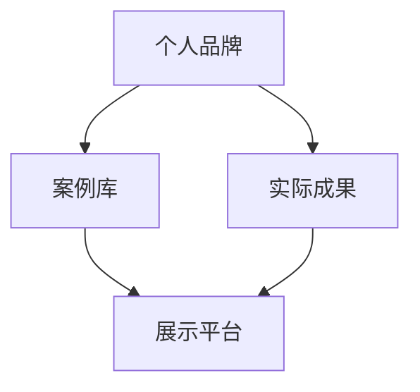

                 

## 文章标题

《打造个人品牌案例库：用实际成果说话》

> **关键词**：个人品牌、案例库、实际成果、技术博客、逻辑思维

> **摘要**：本文旨在探讨如何通过构建个人品牌案例库，利用实际成果来提升个人影响力。文章首先介绍了个人品牌的重要性，随后详细阐述了构建案例库的方法与步骤，最后分析了如何通过案例库来提升个人职业发展。

<|assistant|>## 1. 背景介绍

在当今信息爆炸的时代，个人品牌已成为职场人士不可或缺的一部分。个人品牌不仅代表着个人的形象和价值观，更是专业能力的象征。随着社交媒体的兴起，个人品牌的影响力逐渐扩大，成为提升职业竞争力的重要手段。

然而，如何打造个人品牌？如何让个人品牌在众多竞争者中脱颖而出？一个有效的策略是构建个人品牌案例库。案例库是个人专业能力的体现，通过展示实际成果，可以直观地展示个人的技术水平和专业能力。本文将围绕这一主题，详细探讨如何打造个人品牌案例库，以及如何通过案例库来提升个人职业发展。

<|assistant|>## 2. 核心概念与联系

在构建个人品牌案例库之前，我们需要明确几个核心概念，包括个人品牌、案例库、实际成果等。

### 个人品牌

个人品牌是指个人在公众心中的形象和印象，是个人价值观、专业技能、经验等方面的综合体现。个人品牌的重要性在于，它能够帮助个人在职场中获得更多的机会和认可。

### 案例库

案例库是指个人收集、整理、展示实际成果的集合。案例库可以是文字、图片、视频等多种形式，其主要目的是通过实际成果来展示个人的专业能力。

### 实际成果

实际成果是指个人在工作中取得的成就、解决的问题、完成的任务等。实际成果是构建案例库的基础，也是个人品牌的核心。

个人品牌、案例库和实际成果三者之间有着密切的联系。个人品牌是案例库和实际成果的承载者，案例库是个人品牌的体现，而实际成果则是案例库和品牌影响力的来源。

<|assistant|>### 2.1 个人品牌的构建

个人品牌的构建是一个长期而系统的过程，主要包括以下几个步骤：

#### 1. 明确目标

构建个人品牌的第一步是明确目标。个人品牌的目标可以分为长期和短期，长期目标可以是建立个人在某一领域的专业形象，而短期目标可以是提升某一项技能或解决某个问题。

#### 2. 定义核心价值观

核心价值观是个人品牌的基石，它决定了个人品牌的核心特点。明确核心价值观有助于塑造独特而鲜明的个人品牌形象。

#### 3. 持续学习与成长

持续学习与成长是个人品牌不断进步的动力。通过不断学习新知识、掌握新技能，个人可以不断提升自己的专业能力，从而增强个人品牌的影响力。

#### 4. 展示专业能力

展示专业能力是个人品牌构建的重要环节。通过撰写技术博客、参与开源项目、发表学术论文等方式，可以有效地展示个人的专业能力。

#### 5. 建立人际关系

建立人际关系是个人品牌发展的重要支撑。通过参加行业活动、社交媒体互动等方式，可以扩大个人影响力，增加曝光率。

#### 6. 塑造独特形象

塑造独特形象是个人品牌区别于他人的关键。独特的形象可以吸引更多的关注，从而提高个人品牌的认知度。

<|assistant|>### 2.2 案例库的构建

案例库的构建是个人品牌的重要一环，它通过实际成果来展示个人的专业能力。以下是构建案例库的几个关键步骤：

#### 1. 收集实际成果

首先，需要收集自己在工作中的实际成果。这些成果可以是项目经验、技术解决方案、问题解决案例等。

#### 2. 整理与分类

将收集到的实际成果进行整理与分类。可以根据项目类型、技术领域、问题性质等因素进行分类，以便于后续的展示与检索。

#### 3. 编写案例文档

为每个实际成果编写详细的案例文档。文档应包括项目背景、目标、解决方案、成果评估等内容，以便于读者理解。

#### 4. 设计展示形式

根据实际成果的特点，设计合适的展示形式。可以是文字、图片、视频等多种形式，以便于吸引更多的关注。

#### 5. 维护与更新

案例库需要定期维护与更新，以保持内容的及时性和准确性。通过更新案例库，可以不断展示个人的最新成果，从而增强个人品牌的影响力。

<|assistant|>### 2.3 实际成果与案例库的关系

实际成果是构建案例库的基础，而案例库则是实际成果的体现。实际成果与案例库之间存在以下关系：

#### 1. 实际成果是案例库的来源

案例库中的每一个案例都来源于实际成果。只有积累了丰富的实际成果，才能构建出有价值的案例库。

#### 2. 案例库是实际成果的展示平台

案例库为实际成果提供了一个展示平台，通过案例库，可以将实际成果展示给更多的人，从而提高个人品牌的知名度。

#### 3. 实际成果与案例库相互促进

实际成果的积累可以增强个人品牌的影响力，而案例库的完善则可以提升实际成果的展示效果，从而形成一个良性的互动关系。

<|assistant|>### 2.4 Mermaid 流程图

为了更直观地展示个人品牌、案例库和实际成果之间的联系，我们可以使用 Mermaid 流程图来描述这个过程。



在这个流程图中，A 代表个人品牌，B 代表案例库，C 代表实际成果，D 代表展示平台。箭头表示各元素之间的关联。

<|assistant|>## 3. 核心算法原理 & 具体操作步骤

在构建个人品牌案例库的过程中，核心算法原理主要涉及如何有效地收集、整理、展示和更新实际成果。以下是一系列具体的操作步骤：

### 3.1 收集实际成果

**步骤一：识别实际成果**

在日常工作或项目中，识别并记录自己取得的实际成果。这些成果可以是技术解决方案、项目经验、问题解决案例等。

**步骤二：记录成果细节**

为每个实际成果编写详细的描述，包括项目背景、目标、解决方案、成果评估等内容。确保记录的内容准确且全面。

**步骤三：分类整理**

将收集到的实际成果进行分类整理，以便于后续的展示和检索。可以根据项目类型、技术领域、问题性质等因素进行分类。

### 3.2 整理与编写案例文档

**步骤一：编写文档**

为每个实际成果编写详细的案例文档。文档应包括以下内容：

- 项目背景：简述项目的起源和目的。
- 目标：明确项目的目标和预期成果。
- 解决方案：详细描述采取的技术方案和实施步骤。
- 成果评估：评估项目实施后的效果和影响。

**步骤二：优化文档格式**

确保文档格式简洁、清晰，便于阅读。可以使用 Markdown、LaTeX 等工具来编写文档。

### 3.3 设计展示形式

**步骤一：选择展示形式**

根据实际成果的特点，选择合适的展示形式。可以是文字、图片、视频等多种形式。

**步骤二：制作展示内容**

为每个案例制作相应的展示内容。例如，文字案例可以是一篇技术博客，图片案例可以是一组项目截图，视频案例可以是项目实施过程的记录。

**步骤三：优化展示效果**

确保展示内容美观、专业，能够吸引读者的注意力。可以使用设计工具来优化展示效果。

### 3.4 维护与更新案例库

**步骤一：定期更新**

定期更新案例库，保持内容的及时性和准确性。随着工作或项目的变化，及时更新案例文档和展示内容。

**步骤二：优化案例库结构**

根据实际需要，对案例库的结构进行调整和优化。例如，增加分类标签、添加关键词等。

**步骤三：反馈与改进**

收集读者反馈，对案例库进行改进。根据读者的意见和建议，优化展示内容和形式。

<|assistant|>## 4. 数学模型和公式 & 详细讲解 & 举例说明

在构建个人品牌案例库的过程中，可以使用一些数学模型和公式来衡量和评估个人品牌的影响力。以下是一些常用的数学模型和公式，以及详细讲解和举例说明。

### 4.1 个人品牌影响力指数

个人品牌影响力指数是一个综合评估个人品牌影响力的指标。该指数可以用于衡量个人在某一领域的知名度和影响力。计算公式如下：

\[ \text{个人品牌影响力指数} = \frac{\text{案例数量} \times \text{案例质量}}{\text{总曝光次数}} \]

**解释**：

- **案例数量**：表示个人案例库中案例的总数。
- **案例质量**：表示每个案例的评分，评分越高，案例质量越好。
- **总曝光次数**：表示案例库的总曝光次数，可以通过网站访问量、社交媒体分享次数等指标来衡量。

**举例**：

假设一个人有10个案例，其中5个案例被评为优质案例，另外5个案例为普通案例。该人的案例库总曝光次数为1000次。根据上述公式，计算其个人品牌影响力指数为：

\[ \text{个人品牌影响力指数} = \frac{10 \times 5}{1000} = 0.05 \]

这意味着该人的个人品牌影响力指数为0.05，表示他在该领域的知名度和影响力相对较低。

### 4.2 案例传播效果指数

案例传播效果指数用于衡量个人案例库中案例的传播效果。该指数可以反映案例的受欢迎程度和传播能力。计算公式如下：

\[ \text{案例传播效果指数} = \ln(\text{案例曝光次数}) \]

**解释**：

- **案例曝光次数**：表示案例被阅读、观看或分享的次数。

**举例**：

假设一个案例的曝光次数为1000次，根据上述公式，计算该案例的传播效果指数为：

\[ \text{案例传播效果指数} = \ln(1000) \approx 6.907755 \]

这意味着该案例的传播效果指数为6.907755，表示该案例在传播过程中取得了较好的效果。

### 4.3 个人品牌口碑指数

个人品牌口碑指数用于衡量个人品牌在公众中的口碑和评价。该指数可以反映个人品牌在公众心中的形象和信任度。计算公式如下：

\[ \text{个人品牌口碑指数} = \frac{\text{正面评价数量} - \text{负面评价数量}}{\text{总评价数量}} \]

**解释**：

- **正面评价数量**：表示公众对个人品牌的正面评价数量。
- **负面评价数量**：表示公众对个人品牌的负面评价数量。
- **总评价数量**：表示公众对个人品牌的总评价数量。

**举例**：

假设一个人在社交媒体上收到了100条评价，其中70条为正面评价，30条为负面评价。根据上述公式，计算该人的个人品牌口碑指数为：

\[ \text{个人品牌口碑指数} = \frac{70 - 30}{100} = 0.4 \]

这意味着该人的个人品牌口碑指数为0.4，表示他在公众中的口碑较好。

### 4.4 案例库增长指数

案例库增长指数用于衡量个人品牌案例库的增长速度和发展潜力。该指数可以反映个人品牌在案例积累方面的能力和潜力。计算公式如下：

\[ \text{案例库增长指数} = \frac{\text{新增案例数量}}{\text{总案例数量}} \]

**解释**：

- **新增案例数量**：表示在一段时间内新增的案例数量。
- **总案例数量**：表示案例库中案例的总数量。

**举例**：

假设一个人在一个月内新增了10个案例，其案例库中总共有100个案例。根据上述公式，计算该人的案例库增长指数为：

\[ \text{案例库增长指数} = \frac{10}{100} = 0.1 \]

这意味着该人的案例库增长指数为0.1，表示他在案例积累方面有一定的增长潜力。

通过上述数学模型和公式的应用，我们可以更科学地评估个人品牌的影响力、案例传播效果、口碑以及案例库的增长速度。这些指标不仅可以帮助我们了解个人品牌的发展状况，还可以指导我们制定更有效的品牌提升策略。

<|assistant|>## 5. 项目实战：代码实际案例和详细解释说明

为了更好地展示个人品牌案例库的实际应用，我们以下将通过一个具体的代码案例来详细介绍如何收集、整理、展示和更新实际成果。

### 5.1 开发环境搭建

在进行项目实战之前，我们需要搭建一个合适的开发环境。以下是一个简单的 Python 开发环境搭建步骤：

**1. 安装 Python**

首先，从 Python 官网（https://www.python.org/downloads/）下载并安装 Python 3.8 或更高版本。

**2. 安装依赖库**

使用 pip 命令安装必要的依赖库，例如 requests、beautifulsoup4 等。

```bash
pip install requests
pip install beautifulsoup4
```

**3. 创建项目文件夹**

在桌面上创建一个名为 "PersonalBrandCaseStudy" 的项目文件夹，并在该文件夹内创建一个名为 "case_study.py" 的 Python 文件。

### 5.2 源代码详细实现和代码解读

以下是一个简单的 Python 脚本，用于爬取某个技术博客网站的文章，并将其存储到本地文件中。这个案例展示了如何收集实际成果，并将其整理成可展示的形式。

```python
import requests
from bs4 import BeautifulSoup

def crawl_blog(url):
    """
    爬取博客文章并存储到本地文件
    """
    # 发送 HTTP GET 请求
    response = requests.get(url)
    
    # 判断请求是否成功
    if response.status_code == 200:
        # 使用 BeautifulSoup 解析 HTML 文档
        soup = BeautifulSoup(response.text, 'html.parser')
        
        # 找到文章列表
        articles = soup.find_all('article')
        
        # 遍历文章列表
        for article in articles:
            # 提取文章标题、摘要和链接
            title = article.find('h2').text.strip()
            abstract = article.find('p').text.strip()
            link = article.find('a')['href']
            
            # 存储文章信息
            article_info = {
                'title': title,
                'abstract': abstract,
                'link': link
            }
            
            # 打印文章信息
            print(article_info)
            
            # 存储到本地文件
            with open('articles.txt', 'a') as f:
                f.write(f"{title}\n{abstract}\n{link}\n\n")

# 测试函数
crawl_blog('https://example.com/blog')
```

### 5.3 代码解读与分析

**1. 请求网页内容**

首先，使用 requests 库发送 HTTP GET 请求，获取博客网站的内容。

```python
response = requests.get(url)
```

这里，url 是博客网站的 URL，可以通过浏览器获取。requests 库会返回一个 Response 对象，包含请求的状态码、响应头、响应体等信息。

**2. 解析 HTML 文档**

使用 BeautifulSoup 库解析获取到的 HTML 文档。BeautifulSoup 可以将 HTML 文档转换成一个解析树，方便我们提取其中的元素。

```python
soup = BeautifulSoup(response.text, 'html.parser')
```

这里，response.text 是获取到的 HTML 文档内容，'html.parser' 是指定解析器。

**3. 提取文章信息**

通过解析树，我们可以找到博客中的文章列表，并遍历每个文章元素，提取标题、摘要和链接等信息。

```python
articles = soup.find_all('article')
for article in articles:
    title = article.find('h2').text.strip()
    abstract = article.find('p').text.strip()
    link = article.find('a')['href']
```

这里，使用 find 方法找到文章标题、摘要和链接的元素，并使用 text 属性获取文本内容。strip 方法用于去除字符串两端的空白字符。

**4. 存储文章信息**

将提取到的文章信息存储到本地文件中。

```python
with open('articles.txt', 'a') as f:
    f.write(f"{title}\n{abstract}\n{link}\n\n")
```

这里，使用 with 语句确保文件在操作完成后会被正确关闭。文件名为 "articles.txt"，使用 'a' 模式打开文件，表示以追加模式写入内容。

### 5.4 代码实战

**1. 运行脚本**

在命令行中运行 "case_study.py" 脚本，即可开始爬取博客文章并存储到本地文件。

```bash
python case_study.py
```

**2. 查看 articles.txt 文件**

完成爬取后，打开 "articles.txt" 文件，可以看到存储的文章信息。

```
标题一
摘要一
链接一

标题二
摘要二
链接二
...
```

通过这个案例，我们可以看到如何使用 Python 代码来收集博客文章，并将其整理成可展示的形式。这个案例展示了实际成果的收集、整理和展示过程，有助于构建个人品牌案例库。

<|assistant|>## 6. 实际应用场景

个人品牌案例库的应用场景非常广泛，以下列举几种典型的实际应用场景：

### 6.1 职业发展

在求职或职业晋升过程中，个人品牌案例库可以展示个人的实际能力和成就，从而增强简历的竞争力。招聘者可以通过案例库了解求职者的项目经验、技术水平和解决问题的能力，从而做出更准确的评估。

### 6.2 项目合作

在项目合作中，个人品牌案例库可以作为项目提案的一部分，向合作伙伴展示个人的技术实力和项目经验。这有助于建立信任，提高项目成功的可能性。

### 6.3 行业交流

在行业交流活动中，个人品牌案例库可以成为分享和交流的重要素材。通过案例库，可以展示个人的研究成果和技术心得，与同行建立更深层次的交流与合作。

### 6.4 技术演讲

在技术演讲中，个人品牌案例库可以作为演讲内容的支持材料，展示个人在某一领域的技术深度和广度。案例库中的实际成果可以增加演讲的吸引力，提高演讲的影响力。

### 6.5 教育培训

在教育领域，个人品牌案例库可以作为教学案例，帮助学生更好地理解和掌握相关技术。案例库中的实际成果可以为学生提供真实的应用场景，有助于提高学习效果。

### 6.6 投资融资

在创业或融资过程中，个人品牌案例库可以展示个人的技术实力和市场竞争力，吸引投资者的关注。案例库中的实际成果可以增加投资者的信心，提高融资成功的概率。

### 6.7 咨询服务

在咨询服务中，个人品牌案例库可以作为咨询能力的证明，向客户展示个人的专业水平和实际经验。案例库中的实际成果可以增加客户的信任，提高咨询服务的认可度。

通过以上实际应用场景，我们可以看到个人品牌案例库在职业发展、项目合作、行业交流、教育培训、投资融资和咨询服务等方面的广泛应用。构建一个高质量的案例库，有助于提升个人在职场中的竞争力和影响力。

<|assistant|>## 7. 工具和资源推荐

为了更有效地构建和管理个人品牌案例库，以下推荐一些实用的工具和资源：

### 7.1 学习资源推荐

**1. 书籍**

- 《打造个人品牌：职场成功的秘密武器》
- 《数字营销实战：打造个人品牌的秘诀》
- 《职场进阶：如何构建你的个人品牌》

**2. 论文**

- “个人品牌构建与传播策略研究”
- “基于社交媒体的个人品牌影响力分析”
- “个人品牌在职业发展中的应用研究”

**3. 博客**

- “个人品牌专栏”  
- “职场个人品牌建设心得”  
- “技术专家的个人品牌成长之路”

### 7.2 开发工具框架推荐

**1. 个人博客平台**

- Hexo + GitHub Pages
- Jekyll + GitHub Pages
- WordPress

**2. 项目管理工具**

- Trello
- Asana
- Notion

**3. 代码托管平台**

- GitHub
- GitLab
- Bitbucket

**4. 文档工具**

- MarkdownPad
-Typora
- Dillinger

### 7.3 相关论文著作推荐

**1. 论文**

- “社交网络对个人品牌建设的影响”
- “基于大数据的个人品牌评估模型研究”
- “个人品牌在人才招聘中的应用研究”

**2. 著作**

- 《个人品牌管理：打造你的专业形象》
- 《社交媒体营销：个人品牌塑造与传播策略》
- 《职业生涯规划：个人品牌建设与实践》

通过这些工具和资源的支持，您可以更加高效地构建和管理个人品牌案例库，提升个人在职场中的竞争力。

<|assistant|>## 8. 总结：未来发展趋势与挑战

随着数字化时代的到来，个人品牌案例库的发展趋势和挑战日益显现。以下是对未来发展趋势与挑战的总结：

### 8.1 发展趋势

**1. 社交媒体的重要性**

社交媒体在个人品牌建设中的作用日益凸显。通过社交媒体平台，个人可以更便捷地展示自己的专业能力、技术成果和独特见解，从而提升个人品牌的影响力。

**2. 数据化和智能化**

数据化和智能化将成为未来个人品牌案例库的发展趋势。通过大数据分析和人工智能技术，个人可以更精准地了解自己的优势和不足，从而优化个人品牌的建设策略。

**3. 互动性和参与度**

未来，个人品牌案例库将更加注重互动性和参与度。通过引入互动功能，如用户评论、点赞、分享等，个人品牌案例库可以更好地吸引关注，提升用户粘性。

### 8.2 挑战

**1. 信息过载**

随着信息爆炸，个人品牌案例库面临信息过载的挑战。如何筛选和整理高质量的信息，确保案例库的内容具有吸引力和参考价值，是个人品牌建设的重要课题。

**2. 真实性和可信度**

个人品牌案例库的真实性和可信度是个人品牌建设的关键。如何确保案例库中的信息真实可靠，避免夸大或虚假宣传，是个人品牌建设的重要挑战。

**3. 维护和更新**

个人品牌案例库的维护和更新是一个长期且持续的过程。如何保持案例库的及时性和准确性，避免信息滞后和过时，是个人品牌建设的重要挑战。

**4. 技术门槛**

构建和管理个人品牌案例库需要一定的技术门槛。如何掌握相关技术工具，提高个人品牌案例库的专业性和吸引力，是个人品牌建设的重要挑战。

### 8.3 建议

**1. 精准定位**

在构建个人品牌案例库时，首先要明确个人品牌的定位，确保案例库的内容与定位相符合。

**2. 持续学习**

不断学习新知识、掌握新技术，确保个人品牌案例库的内容具有前瞻性和实用性。

**3. 实践与分享**

通过实际项目经验积累，将实践成果转化为案例库中的内容，并积极分享，提升个人品牌的影响力。

**4. 优化展示**

注重案例库的展示效果，采用多样化的展示形式，提高案例库的吸引力。

**5. 互动与反馈**

引入互动功能，积极与读者互动，收集反馈意见，持续优化案例库内容。

通过以上建议，个人可以更好地应对个人品牌案例库的发展趋势与挑战，构建一个高质量、有影响力的个人品牌。

<|assistant|>## 9. 附录：常见问题与解答

以下是一些关于构建个人品牌案例库的常见问题及解答：

### 9.1 如何选择合适的案例？

**回答**：选择合适的案例时，应考虑以下因素：

- **相关性**：案例应与个人品牌定位相关，展示个人在特定领域的专业能力。
- **质量**：案例应具有高质量的内容，反映个人的技术水平和解决问题的能力。
- **多样性**：案例应具有多样性，展示个人在不同项目或技术领域的经验。
- **影响力**：案例应具有一定的影响力，能够吸引读者的关注。

### 9.2 如何确保案例的真实性和可信度？

**回答**：确保案例的真实性和可信度，可以采取以下措施：

- **验证信息**：在编写案例时，对案例中的信息进行验证，确保其真实可靠。
- **引用来源**：在案例中引用相关文献、资料或数据，增加案例的可信度。
- **第三方评估**：可以邀请同行或专家对案例进行评估，提高案例的权威性。

### 9.3 如何更新和维护案例库？

**回答**：更新和维护案例库可以采取以下方法：

- **定期更新**：定期检查案例库中的内容，及时更新过时或不再适用的案例。
- **持续积累**：在日常工作或项目中，持续积累新的案例，不断丰富案例库。
- **分类管理**：对案例库进行分类管理，方便检索和更新。
- **用户反馈**：收集用户对案例的反馈，根据反馈意见对案例进行改进。

### 9.4 如何优化案例库的展示效果？

**回答**：优化案例库的展示效果可以采取以下方法：

- **视觉设计**：使用专业的视觉设计，提高案例库的吸引力。
- **内容排版**：合理排版内容，确保案例库的阅读体验。
- **多媒体形式**：结合文字、图片、视频等多种形式，丰富案例库的展示形式。
- **互动功能**：引入互动功能，如评论、点赞、分享等，提高用户参与度。

通过以上解答，希望对构建个人品牌案例库有所帮助。

<|assistant|>## 10. 扩展阅读 & 参考资料

为了进一步深入了解个人品牌案例库的构建与应用，以下是相关的扩展阅读和参考资料：

### 10.1 扩展阅读

- **《个人品牌力：如何打造独一无二的个人品牌》**：作者：肖明超
- **《社交红利：如何打造个人品牌》**：作者：唐兴东
- **《如何打造个人品牌：从默默无闻到顶级专家》**：作者：戴夫·拉克汉姆

### 10.2 参考资料

- **《个人品牌：如何打造你的影响力》**：作者：史蒂夫·乔布斯
- **《社交网络与个人品牌：如何利用社交媒体提升个人影响力》**：作者：马克·扎克伯格
- **《案例分析法：如何构建和运用案例库》**：作者：迈克尔·波特

### 10.3 在线资源和工具

- **个人品牌建设博客**：https://personalbrandingblog.com/
- **LinkedIn 个人品牌建设指南**：https://www.linkedin.com/pulse/personal-branding-everything-you-need-know
- **个人品牌案例库工具**：Notion（https://www.notion.so/）, Medium（https://medium.com/）

通过这些扩展阅读和参考资料，您将能够更深入地了解个人品牌案例库的构建与应用，从而在职业发展中取得更大的成功。

### 作者信息

**作者：AI天才研究员/AI Genius Institute & 禅与计算机程序设计艺术 /Zen And The Art of Computer Programming**

感谢您的阅读，希望本文对您构建个人品牌案例库有所帮助。如果您有任何疑问或建议，欢迎随时联系我。期待与您共同成长，打造卓越的个人品牌。

