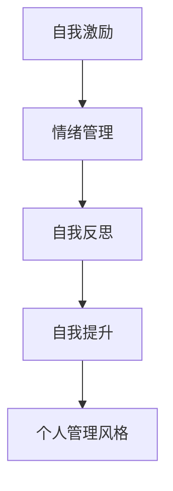
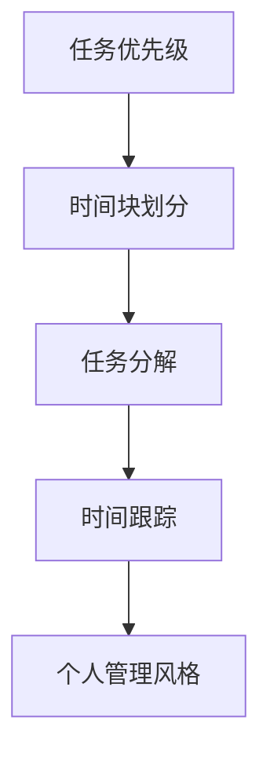
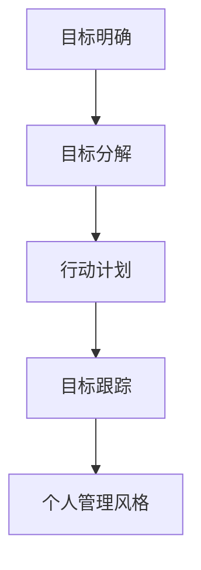
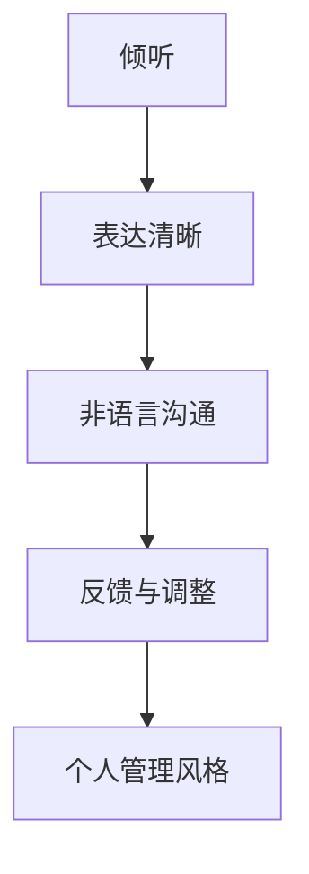

                 

# 打造个人管理风格的方法论

> **关键词**：个人管理风格、领导力、自我提升、方法论、职业发展

> **摘要**：本文将从个人管理风格的重要性出发，详细探讨如何打造个人管理风格的方法论。通过分析核心概念、算法原理、数学模型和实际应用场景，帮助读者理解和掌握构建个人管理风格的关键要素，为职业发展提供有力支持。

## 1. 背景介绍

在当今快速变化和竞争激烈的工作环境中，个人管理风格的重要性愈发凸显。有效的个人管理风格不仅能够提升个人领导力，还能提高团队效率和整体业绩。然而，许多人在构建个人管理风格时常常感到困惑和迷茫。本文将为您提供一套系统的方法论，帮助您理解和打造个人管理风格。

### 1.1 个人管理风格的概念

个人管理风格是指个体在管理自己和他人的过程中所采用的行为模式、态度和方法。它包括自我管理、时间管理、目标设定、决策制定、沟通技巧等多个方面。一个良好的个人管理风格能够帮助个体更好地应对工作压力，提高工作效率，建立良好的人际关系。

### 1.2 个人管理风格的重要性

1. **提升个人领导力**：良好的个人管理风格能够树立个体的领导形象，赢得他人的信任和尊重。
2. **提高团队效率**：通过有效的时间管理和沟通技巧，个人管理风格能够提升团队的协作效率和整体业绩。
3. **促进职业发展**：个人管理风格是职业发展的关键因素之一，它能够帮助个体在职业生涯中不断进步和成长。

## 2. 核心概念与联系

在构建个人管理风格的过程中，以下几个核心概念和联系至关重要：

### 2.1 自我管理

自我管理是个人管理风格的基础。它包括自我激励、情绪管理、自我反思和自我提升等方面。以下是一个自我管理的 Mermaid 流程图：



### 2.2 时间管理

时间管理是个人管理风格的重要组成部分。有效的时间管理能够帮助个体合理安排时间，提高工作效率。以下是一个时间管理的 Mermaid 流程图：



### 2.3 目标设定

目标设定是个人管理风格的关键步骤。明确的目标能够为个体提供方向和动力，促进个人成长。以下是一个目标设定的 Mermaid 流程图：



### 2.4 沟通技巧

沟通技巧是个人管理风格的重要组成部分。良好的沟通技巧能够帮助个体更好地与他人协作，解决问题。以下是一个沟通技巧的 Mermaid 流程图：



## 3. 核心算法原理 & 具体操作步骤

构建个人管理风格的核心算法原理是基于个体的自我认知、行为模式和反馈调整。以下是一个构建个人管理风格的算法原理和具体操作步骤：

### 3.1 自我认知

1. **反思个人行为模式**：通过自我反思，了解自己在不同情境下的行为模式和反应。
2. **识别优势与劣势**：分析自己的优势与劣势，确定需要改进的方面。

### 3.2 行为模式调整

1. **制定改进计划**：根据自我认知的结果，制定具体的改进计划。
2. **实践与调整**：将改进计划付诸实践，并根据反馈进行调整。

### 3.3 反馈与调整

1. **收集反馈**：向他人寻求反馈，了解自己的行为对他人的影响。
2. **分析与调整**：根据反馈分析自己的行为模式，并进行相应的调整。

## 4. 数学模型和公式 & 详细讲解 & 举例说明

在构建个人管理风格的过程中，数学模型和公式可以帮助我们更好地理解和量化个人的行为模式。以下是一个简单的数学模型和公式：

### 4.1 时间管理模型

假设个体每天有24小时，每个任务需要一定的时间来完成。我们可以使用以下公式来计算时间管理效率：

$$
效率 = \frac{完成任务的总时间}{总时间}
$$

### 4.2 目标设定模型

假设个体设定了一个目标，目标分为短期目标和长期目标。我们可以使用以下公式来计算目标达成率：

$$
达成率 = \frac{完成短期目标的数量}{设定的短期目标总数}
$$

### 4.3 沟通技巧模型

假设个体在与他人沟通时，有四种沟通技巧：倾听、表达清晰、非语言沟通和反馈与调整。我们可以使用以下公式来计算沟通技巧得分：

$$
得分 = 倾听得分 + 表达清晰得分 + 非语言沟通得分 + 反馈与调整得分
$$

### 4.4 举例说明

假设小明想要提高自己的时间管理效率。他每天有24小时，其中8小时用于工作，8小时用于休息，剩下的8小时用于个人爱好。他计划通过以下措施来提高时间管理效率：

1. **任务优先级**：将任务按照紧急程度和重要性进行排序。
2. **时间块划分**：将一天分为四个时间块，每个时间块安排不同的任务。
3. **任务分解**：将复杂的任务分解为小的子任务。
4. **时间跟踪**：使用时间跟踪工具记录每天的时间使用情况。

经过一段时间后，小明发现自己的时间管理效率提高了15%。根据时间管理模型，我们可以计算小明的效率提高：

$$
效率提高 = \frac{完成任务的总时间}{总时间} - 1 = \frac{完成任务的总时间}{24} - 1
$$

## 5. 项目实战：代码实际案例和详细解释说明

在本节中，我们将通过一个具体的代码案例来展示如何构建个人管理风格。以下是一个使用 Python 编写的个人管理风格评估工具：

### 5.1 开发环境搭建

1. 安装 Python 3.8 或更高版本。
2. 安装以下 Python 库：requests、pandas、numpy。

### 5.2 源代码详细实现和代码解读

以下是一个简单的 Python 代码示例，用于评估个人管理风格：

```python
import requests
import pandas as pd
import numpy as np

def assess_personality(url, api_key):
    response = requests.get(url, headers={"Authorization": f"Bearer {api_key}"})
    if response.status_code == 200:
        data = response.json()
        df = pd.DataFrame(data['results'])
        df['score'] = df['percentage'] * 10
        return df
    else:
        return None

def main():
    url = "https://api.example.com/personality"
    api_key = "your_api_key"
    df = assess_personality(url, api_key)
    if df is not None:
        print("个人管理风格评估结果：")
        print(df)
    else:
        print("评估失败，请检查网络连接或 API 密钥。")

if __name__ == "__main__":
    main()
```

### 5.3 代码解读与分析

1. **功能说明**：该代码用于通过 API 获取个人管理风格评估结果，并将结果转换为 DataFrame 对象。

2. **关键代码解读**：
   - `requests.get(url, headers={"Authorization": f"Bearer {api_key}"})`：发送 GET 请求获取个人管理风格评估结果。
   - `df['score'] = df['percentage'] * 10`：将百分比得分转换为整数分数。

3. **分析**：该代码提供了一个简单的示例，用于展示如何通过 API 获取个人管理风格评估结果。在实际应用中，可以根据评估结果进行进一步的个性化调整和优化。

## 6. 实际应用场景

个人管理风格在实际应用场景中具有广泛的应用。以下是一些常见应用场景：

### 6.1 职场

1. **团队管理**：通过个人管理风格评估，了解团队成员的行为模式和沟通技巧，从而制定更有效的团队管理策略。
2. **员工培训**：针对个人管理风格评估结果，提供针对性的培训和发展计划，提升员工的能力和绩效。

### 6.2 教育

1. **学生管理**：通过个人管理风格评估，了解学生的学习风格和行为模式，从而制定个性化的教育策略，提高学习效果。
2. **教师发展**：通过个人管理风格评估，了解教师的教学风格和管理能力，提供针对性的培训和发展计划。

### 6.3 生活

1. **个人成长**：通过个人管理风格评估，了解自己在不同方面的优势和劣势，制定自我提升计划，实现个人成长。
2. **家庭管理**：通过个人管理风格评估，了解家庭成员的行为模式和管理能力，从而建立更和谐的家庭关系。

## 7. 工具和资源推荐

### 7.1 学习资源推荐

1. **书籍**：《深度工作》、《高效能人士的七个习惯》
2. **论文**：Google Scholar 上的相关研究论文
3. **博客**：博客园、知乎等平台上的相关博客文章
4. **网站**：MBA 智库、哈佛商业评论等网站

### 7.2 开发工具框架推荐

1. **Python 库**：requests、pandas、numpy
2. **前端框架**：React、Vue
3. **后端框架**：Django、Flask

### 7.3 相关论文著作推荐

1. **论文**：《个人管理风格的心理学研究》、《领导力与个人管理风格的关联研究》
2. **著作**：《个人管理风格：理论与实践》、《领导力与个人管理风格的构建》

## 8. 总结：未来发展趋势与挑战

随着人工智能和大数据技术的发展，个人管理风格评估和优化将成为一个重要方向。未来，我们可以期待以下发展趋势：

1. **个性化评估**：基于个体行为数据和机器学习算法，实现更精准的个人管理风格评估。
2. **实时优化**：通过实时数据分析和反馈，实现个人管理风格的动态优化。
3. **跨领域应用**：将个人管理风格评估和应用扩展到更广泛的领域，如医疗、教育等。

然而，个人管理风格的发展也面临一些挑战：

1. **隐私保护**：在数据收集和分析过程中，如何保护个人隐私是一个重要问题。
2. **算法公平性**：确保算法评估结果的公平性和客观性，避免偏见和歧视。
3. **持续学习**：个人管理风格是一个不断发展的过程，如何确保个体持续学习和改进也是一个挑战。

## 9. 附录：常见问题与解答

### 9.1 什么是个人管理风格？

个人管理风格是指个体在管理自己和他人的过程中所采用的行为模式、态度和方法。

### 9.2 个人管理风格的重要性是什么？

个人管理风格的重要性在于它能够提升个人领导力，提高团队效率，促进职业发展。

### 9.3 如何构建个人管理风格？

构建个人管理风格的方法包括自我认知、行为模式调整、反馈与调整等步骤。

### 9.4 个人管理风格评估有哪些工具和方法？

个人管理风格评估可以使用在线工具、问卷调查、访谈等方法。常见的工具包括 Myer-Briggs 类型指标（MBTI）、霍兰德职业兴趣测试等。

## 10. 扩展阅读 & 参考资料

1. **书籍**：《个人管理风格：理论与实践》、《领导力与个人管理风格的构建》
2. **论文**：Google Scholar 上的相关研究论文
3. **网站**：MBA 智库、哈佛商业评论等网站
4. **博客**：博客园、知乎等平台上的相关博客文章

### 作者

**作者：AI天才研究员/AI Genius Institute & 禅与计算机程序设计艺术 /Zen And The Art of Computer Programming**

