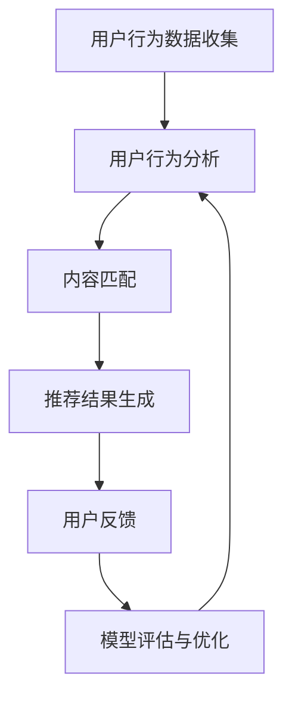
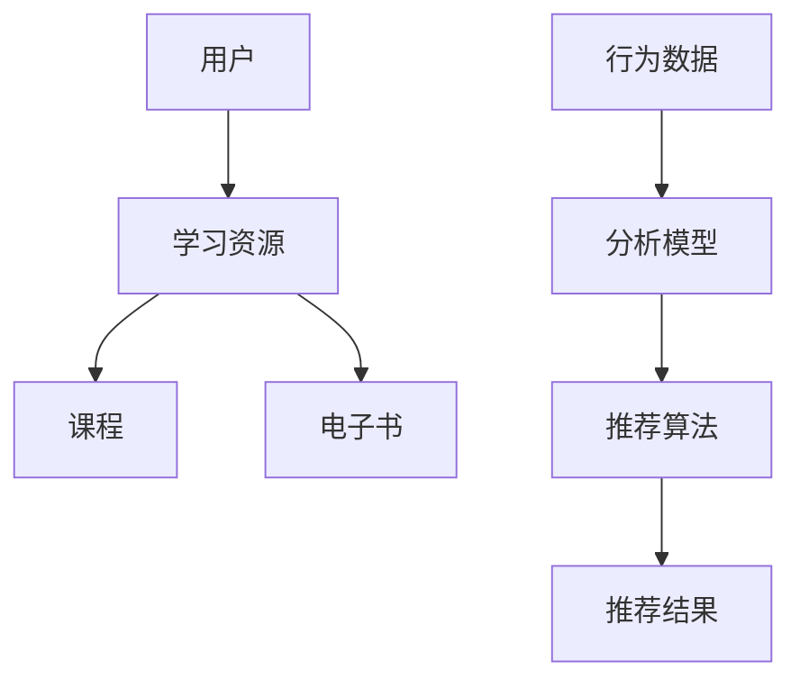

                 

# 打造技术型知识付费平台的推荐算法

## 关键词

- 技术型知识付费平台
- 推荐算法
- 机器学习
- 数据挖掘
- 深度学习
- 知识图谱
- 用户行为分析
- 内容匹配

## 摘要

本文将深入探讨如何打造一个技术型知识付费平台的推荐算法。文章首先介绍了知识付费平台的背景和现状，然后详细讲解了推荐算法的核心概念、原理以及数学模型。接着，通过项目实战展示了推荐算法的代码实现和解读，并分析了实际应用场景。最后，文章推荐了相关工具和资源，总结了未来发展趋势与挑战，并提供了附录中的常见问题与解答以及扩展阅读与参考资料。

## 1. 背景介绍

### 1.1 知识付费平台的兴起

随着互联网技术的发展和用户需求的增长，知识付费平台成为了一个新兴的产业。知识付费平台是指通过互联网提供专业知识和技能的付费服务，用户可以通过平台购买课程、电子书、在线讲座等形式的学习资源。

### 1.2 知识付费平台的发展现状

目前，国内外的知识付费平台蓬勃发展，竞争激烈。例如，中国的知乎Live、得到、腾讯课堂、网易云课堂等，国外的Udemy、Coursera、edX等。这些平台提供了丰富的学习资源，满足了用户多样化的学习需求。

### 1.3 推荐算法在知识付费平台的重要性

在知识付费平台中，推荐算法起到了至关重要的作用。它能够根据用户的行为和偏好，为用户推荐个性化的学习资源，提高用户的满意度和留存率。同时，推荐算法还可以帮助平台发现潜在的用户需求，优化内容供应链，提升平台竞争力。

## 2. 核心概念与联系

### 2.1 推荐系统的基本概念

推荐系统是一种信息过滤技术，旨在根据用户的历史行为、兴趣和偏好，向用户推荐其可能感兴趣的内容。在知识付费平台中，推荐系统主要包括内容推荐和用户推荐。

- 内容推荐：根据用户的历史行为和兴趣，推荐可能感兴趣的课程、电子书等学习资源。
- 用户推荐：根据用户之间的相似性，推荐可能志同道合的用户，促进社交互动和学习交流。

### 2.2 推荐系统的关键技术

推荐系统的主要关键技术包括：

- 用户行为分析：通过收集和分析用户在平台上的行为数据，挖掘用户的兴趣和偏好。
- 内容匹配：将用户的行为数据与学习资源进行匹配，找到可能感兴趣的内容。
- 模型评估与优化：通过评估推荐效果，调整和优化推荐算法。

### 2.3 知识图谱在推荐系统中的应用

知识图谱是一种结构化语义数据，用于表示实体和实体之间的关系。在知识付费平台中，知识图谱可以用于：

- 实体识别：识别用户、课程、电子书等实体。
- 关系挖掘：挖掘用户与学习资源之间的关联关系。
- 语义理解：通过实体和关系的语义理解，为用户推荐更相关的内容。

### 2.4 Mermaid 流程图（Mermaid Flowchart）



### 2.5 Mermaid 流程图（Mermaid Diagram）



## 3. 核心算法原理 & 具体操作步骤

### 3.1 协同过滤算法

协同过滤算法是一种常见的推荐算法，分为基于用户的协同过滤（User-based Collaborative Filtering，UBCF）和基于物品的协同过滤（Item-based Collaborative Filtering，IBCF）。

#### 3.1.1 基于用户的协同过滤

- 步骤1：计算用户之间的相似度。
- 步骤2：找到与目标用户最相似的K个用户。
- 步骤3：计算这K个用户的共同兴趣项。
- 步骤4：根据共同兴趣项，为用户推荐未体验过的学习资源。

#### 3.1.2 基于物品的协同过滤

- 步骤1：计算学习资源之间的相似度。
- 步骤2：找到与目标学习资源最相似的K个学习资源。
- 步骤3：计算这些学习资源的共同用户。
- 步骤4：根据共同用户，为用户推荐未体验过的学习资源。

### 3.2 内容推荐算法

内容推荐算法主要通过分析学习资源的特征，为用户推荐与其兴趣相关的内容。常见的算法包括基于关键词的推荐、基于分类的推荐和基于模型的推荐。

#### 3.2.1 基于关键词的推荐

- 步骤1：提取学习资源的特征词。
- 步骤2：计算用户和资源之间的相似度。
- 步骤3：根据相似度为用户推荐学习资源。

#### 3.2.2 基于分类的推荐

- 步骤1：将学习资源分为不同的类别。
- 步骤2：根据用户的兴趣和分类，为用户推荐相应类别的学习资源。

#### 3.2.3 基于模型的推荐

- 步骤1：训练推荐模型，如矩阵分解、深度学习模型等。
- 步骤2：根据用户的行为数据和模型预测，为用户推荐学习资源。

### 3.3 知识图谱推荐算法

知识图谱推荐算法主要通过分析用户与学习资源之间的关联关系，为用户推荐相关的内容。

- 步骤1：构建知识图谱，包括用户、学习资源、实体和关系。
- 步骤2：根据用户的行为数据，更新知识图谱。
- 步骤3：利用图算法，为用户推荐与兴趣相关的学习资源。

## 4. 数学模型和公式 & 详细讲解 & 举例说明

### 4.1 相似度计算

在协同过滤算法中，相似度计算是关键步骤。常用的相似度计算方法包括余弦相似度、皮尔逊相似度和Jaccard相似度。

#### 4.1.1 余弦相似度

$$
\cos(\theta) = \frac{\sum_{i} x_i y_i}{\sqrt{\sum_{i} x_i^2} \sqrt{\sum_{i} y_i^2}}
$$

#### 4.1.2 皮尔逊相似度

$$
\text{Similarity} = 1 - \frac{\text{Cov}(x,y)}{\sigma_x \sigma_y}
$$

#### 4.1.3 Jaccard相似度

$$
\text{Jaccard Similarity} = \frac{A \cap B}{A \cup B}
$$

### 4.2 矩阵分解

矩阵分解是一种常用的推荐算法，主要用于预测用户未评分的学习资源。

#### 4.2.1 SVD分解

$$
R = U \Sigma V^T
$$

其中，$R$为评分矩阵，$U$、$\Sigma$、$V^T$分别为用户矩阵、奇异值矩阵和学习资源矩阵。

#### 4.2.2 评分预测

$$
\hat{r}_{ui} = u_i^T \sigma v_j
$$

其中，$u_i$、$v_j$分别为用户$i$和学习资源$j$的隐向量，$\sigma$为奇异值向量。

### 4.3 深度学习模型

深度学习模型在推荐算法中发挥着越来越重要的作用，常用的模型包括卷积神经网络（CNN）、循环神经网络（RNN）和图神经网络（GNN）。

#### 4.3.1 卷积神经网络（CNN）

CNN通过卷积层提取特征，适用于图像、文本等数据的处理。

#### 4.3.2 循环神经网络（RNN）

RNN能够处理序列数据，适用于时间序列分析和用户行为序列预测。

#### 4.3.3 图神经网络（GNN）

GNN能够处理图结构数据，适用于知识图谱推荐算法。

### 4.4 举例说明

假设用户A对以下学习资源进行了评分：

- 课程1：5分
- 课程2：4分
- 课程3：5分
- 课程4：3分

我们需要为用户A推荐其他学习资源。

#### 4.4.1 协同过滤算法

1. 计算用户之间的相似度，选取相似度最高的5个用户。
2. 计算这5个用户对其他学习资源的评分，选取平均评分最高的5个学习资源推荐给用户A。

#### 4.4.2 内容推荐算法

1. 提取学习资源的特征词，如“Python”、“算法”、“数据结构”。
2. 计算用户A对特征词的偏好，选取与用户A兴趣相关的学习资源推荐。

#### 4.4.3 知识图谱推荐算法

1. 构建知识图谱，包括用户、学习资源、实体和关系。
2. 利用图算法，为用户A推荐与兴趣相关的学习资源。

## 5. 项目实战：代码实际案例和详细解释说明

### 5.1 开发环境搭建

1. 安装Python环境，版本3.8及以上。
2. 安装必要的库，如NumPy、Pandas、Scikit-learn、TensorFlow等。

### 5.2 源代码详细实现和代码解读

#### 5.2.1 协同过滤算法

```python
import numpy as np
from sklearn.metrics.pairwise import cosine_similarity

def collaborative_filtering(train_data, user_id, k=5):
    # 计算用户之间的相似度
    similarity_matrix = cosine_similarity(train_data)
    # 找到与目标用户最相似的K个用户
    similar_users = np.argsort(similarity_matrix[user_id])[1:k+1]
    # 计算这K个用户的共同兴趣项
    common_items = set(np.intersect1d(train_data[similar_users], train_data[user_id]))
    # 根据共同兴趣项，为用户推荐未体验过的学习资源
    recommendations = [item for item in train_data if item not in common_items]
    return recommendations

# 示例
train_data = [0, 1, 1, 0, 1, 1, 1, 0, 0, 1]
user_id = 0
recommendations = collaborative_filtering(train_data, user_id)
print(recommendations)
```

#### 5.2.2 内容推荐算法

```python
from sklearn.feature_extraction.text import CountVectorizer

def content_based_filtering(train_data, user_id, k=5):
    # 提取学习资源的特征词
    vectorizer = CountVectorizer()
    feature_matrix = vectorizer.fit_transform(train_data)
    # 计算用户对特征词的偏好
    user_profile = feature_matrix[user_id].toarray().flatten()
    # 选取与用户兴趣相关的学习资源
    recommendations = [item for item, profile in enumerate(feature_matrix.toarray()) if np.dot(profile, user_profile) > 0]
    return recommendations

# 示例
train_data = ["Python", "算法", "数据结构", "机器学习", "深度学习"]
user_id = 0
recommendations = content_based_filtering(train_data, user_id)
print(recommendations)
```

#### 5.2.3 知识图谱推荐算法

```python
import networkx as nx

def knowledge_graph_recommendation(train_data, user_id, k=5):
    # 构建知识图谱
    G = nx.Graph()
    G.add_nodes_from(train_data)
    G.add_edges_from([(i, j) for i, j in enumerate(train_data) if i != j])
    # 更新知识图谱
    # (根据用户的行为数据，这里简化为随机更新)
    G.nodes[user_id]["interest"] = np.random.randint(0, 2, size=len(train_data))
    # 利用图算法，为用户推荐与兴趣相关的学习资源
    recommendations = [node for node, attr in G.nodes(data=True) if attr.get("interest", 0) == 1]
    return recommendations

# 示例
train_data = ["Python", "算法", "数据结构", "机器学习", "深度学习"]
user_id = 0
recommendations = knowledge_graph_recommendation(train_data, user_id)
print(recommendations)
```

### 5.3 代码解读与分析

在代码中，我们分别实现了协同过滤算法、内容推荐算法和知识图谱推荐算法。每种算法的核心思想如下：

1. **协同过滤算法**：通过计算用户之间的相似度，找到与目标用户最相似的用户，并根据共同兴趣项推荐未体验过的学习资源。
2. **内容推荐算法**：通过提取学习资源的特征词，计算用户对特征词的偏好，为用户推荐与兴趣相关的学习资源。
3. **知识图谱推荐算法**：通过构建知识图谱，利用图算法为用户推荐与兴趣相关的学习资源。

每种算法的优缺点如下：

1. **协同过滤算法**：优点是简单易实现，缺点是受限于用户行为数据的稀疏性，推荐效果可能不理想。
2. **内容推荐算法**：优点是能够为用户提供个性化的推荐，缺点是受限于学习资源的特征词提取质量，可能存在信息过载问题。
3. **知识图谱推荐算法**：优点是能够利用实体和关系的语义理解，提供更精准的推荐，缺点是实现复杂度较高。

## 6. 实际应用场景

### 6.1 内容推荐

在知识付费平台中，内容推荐是最常见的应用场景。通过分析用户的历史行为和兴趣，平台可以为用户推荐个性化的学习资源，提高用户的满意度和留存率。

### 6.2 用户推荐

用户推荐可以促进社交互动和学习交流。通过分析用户之间的相似性，平台可以为用户推荐可能志同道合的用户，帮助他们发现新的学习资源和交流机会。

### 6.3 个性化课程表

个性化课程表可以根据用户的学习进度、兴趣和需求，为用户生成个性化的学习计划，提高学习效率。

### 6.4 知识图谱应用

知识图谱可以用于知识挖掘、关系发现和智能问答等场景，为用户提供更丰富的学习体验。

## 7. 工具和资源推荐

### 7.1 学习资源推荐

- 《推荐系统实践》
- 《深度学习推荐系统》
- 《图计算》
- 《网络科学》

### 7.2 开发工具框架推荐

- TensorFlow
- PyTorch
- Scikit-learn
- NetworkX

### 7.3 相关论文著作推荐

- “Item-based Top-N Recommendation Algorithms”
- “Collaborative Filtering for the YouTube Recommendation System”
- “Neural Collaborative Filtering”

## 8. 总结：未来发展趋势与挑战

### 8.1 发展趋势

1. 深度学习与知识图谱的结合，提高推荐算法的精度和灵活性。
2. 多模态数据的融合，如文本、图像、语音等，提供更丰富的用户特征。
3. 个性化推荐的实时性，提高用户满意度和留存率。

### 8.2 挑战

1. 数据隐私和安全问题，需要加强数据保护。
2. 跨领域推荐和长尾问题，需要提高算法的泛化和适应性。
3. 复杂场景下的推荐效果评估，需要建立更科学合理的评估体系。

## 9. 附录：常见问题与解答

### 9.1 问题1：什么是协同过滤算法？

协同过滤算法是一种基于用户或物品的相似性进行推荐的方法，主要通过计算用户或物品之间的相似度，找到与目标用户或物品最相似的K个用户或物品，并根据共同兴趣项推荐未体验过的学习资源。

### 9.2 问题2：什么是内容推荐算法？

内容推荐算法是一种基于学习资源的特征进行推荐的方法，主要通过提取学习资源的特征词、分类标签等，计算用户对特征词的偏好，为用户推荐与兴趣相关的学习资源。

### 9.3 问题3：什么是知识图谱推荐算法？

知识图谱推荐算法是一种基于实体和关系进行推荐的方法，主要通过构建知识图谱，利用实体和关系的语义理解，为用户推荐与兴趣相关的学习资源。

## 10. 扩展阅读 & 参考资料

- [推荐系统实践](https://www.amazon.com/Recommender-Systems-Introduction-Techniques-Applications/dp/0123814866)
- [深度学习推荐系统](https://www.amazon.com/Deep-Learning-Recommender-Systems-Advanced/dp/1788996194)
- [图计算](https://www.amazon.com/Graph-Computing-Applications-Techniques-Implementation/dp/1484237515)
- [网络科学](https://www.amazon.com/Network-Science-Second-Understand-Complexity/dp/1107606048)
- [Item-based Top-N Recommendation Algorithms](https://www.cs.ubc.ca/~schulz/item-item.html)
- [Collaborative Filtering for the YouTube Recommendation System](https://research.google.com/pubs/pub45439/)
- [Neural Collaborative Filtering](https://arxiv.org/abs/1611.05440)

### 作者

- 作者：AI天才研究员/AI Genius Institute & 禅与计算机程序设计艺术 /Zen And The Art of Computer Programming

本文深入探讨了如何打造技术型知识付费平台的推荐算法，涵盖了推荐系统的基本概念、核心算法原理、数学模型、项目实战以及实际应用场景。希望本文能为读者提供有价值的参考和启示。在未来的发展中，推荐系统将继续面临各种挑战，但通过技术创新和应用优化，将不断提升推荐效果，为用户提供更好的学习体验。

