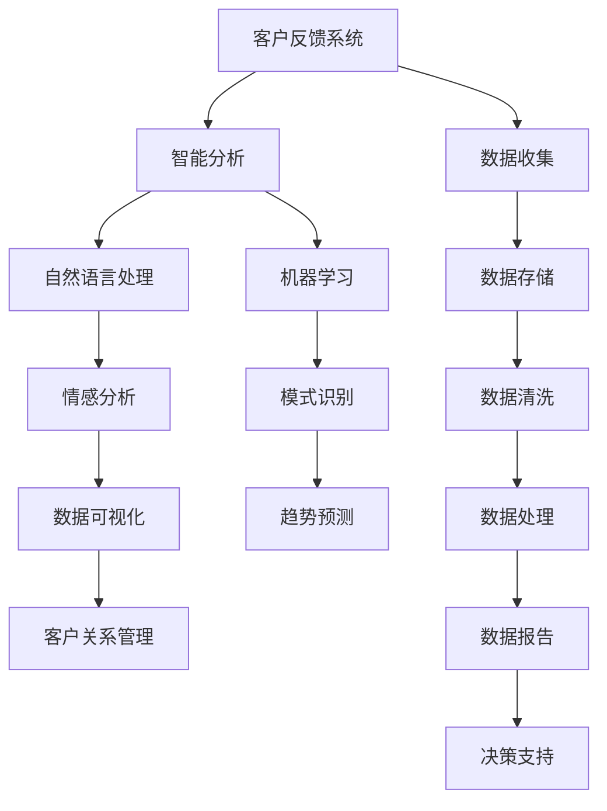

                 

### 背景介绍

在当今快速变化和竞争激烈的市场环境中，一家公司要想脱颖而出并保持持续的竞争优势，除了产品创新和营销策略之外，还需要具备良好的客户服务能力。客户反馈系统作为企业聆听客户声音的重要工具，对于提升客户满意度、改进产品和服务有着至关重要的作用。

一人公司（One Person Company，简称OPC）是指仅由一人组成的有限责任公司。这类公司由于规模小、资源有限，往往在客户反馈系统的建立和维护上面临诸多挑战。然而，即便在这样的限制条件下，智能客户反馈系统仍然是OPC持续改进的重要动力源泉。

本文旨在探讨如何打造一个智能客户反馈系统，为一人公司提供有效的客户声音采集与分析工具。文章将首先介绍智能客户反馈系统的基本概念和重要性，然后深入分析其核心算法原理、具体操作步骤、数学模型和公式，并通过实际项目案例进行详细解释。此外，文章还将讨论智能客户反馈系统的实际应用场景，推荐相关工具和资源，并总结未来发展趋势与挑战。

通过本文的阅读，读者将能够了解智能客户反馈系统的基本原理和实践方法，为在一人公司中建立和优化这一系统提供有价值的指导。

### 核心概念与联系

要深入理解智能客户反馈系统，首先需要明确其中的核心概念及其相互关系。以下是对智能客户反馈系统的关键组成部分及其相互作用的概述：

#### 1. 客户反馈系统

客户反馈系统是指企业通过多种渠道（如在线调查、社交媒体、客服电话等）收集客户意见和反馈的机制。这些反馈数据对于企业了解客户需求、改进产品和服务至关重要。

#### 2. 智能分析

智能分析是指利用人工智能技术（如自然语言处理、机器学习等）对收集到的客户反馈数据进行处理和分析。智能分析能够自动识别客户反馈中的关键信息、情感倾向和常见问题，从而为企业的改进提供数据支持。

#### 3. 自然语言处理（NLP）

自然语言处理是人工智能的一个重要分支，专注于让计算机理解和生成自然语言。在智能客户反馈系统中，NLP技术用于解析和分类客户反馈文本，提取关键信息，并识别情感倾向。

#### 4. 机器学习

机器学习是一种通过数据训练模型并使其具备预测能力或决策能力的技术。在智能客户反馈系统中，机器学习算法用于分析历史反馈数据，识别客户问题模式，并预测未来的反馈趋势。

#### 5. 客户关系管理（CRM）

客户关系管理是一种企业策略，旨在通过改进与客户的互动和关系来提高客户满意度和忠诚度。智能客户反馈系统可以作为CRM的一部分，提供有关客户满意度和需求的关键见解。

#### 6. 数据可视化

数据可视化是一种通过图形和图表展示数据的方法，使数据更加直观易懂。在智能客户反馈系统中，数据可视化技术用于展示客户反馈数据的趋势、分布和相关性，帮助企业管理者快速识别问题和机会。

#### 关系图

下面是一个用Mermaid绘制的流程图，展示了智能客户反馈系统的核心组件及其相互关系：



在这个流程图中，客户反馈系统通过数据收集模块从不同渠道获取客户反馈数据。这些数据经过数据清洗和处理后，被传递到智能分析模块。智能分析模块利用自然语言处理和机器学习技术对反馈数据进行分析，提取关键信息，并生成数据报告和趋势预测。最终，这些分析结果通过数据可视化模块呈现给企业管理者，为决策支持提供依据，并融入客户关系管理流程中。

### 核心算法原理 & 具体操作步骤

#### 1. 自然语言处理（NLP）

自然语言处理（NLP）是智能客户反馈系统的核心组成部分，它使计算机能够理解和生成自然语言。以下是NLP在智能客户反馈系统中的具体操作步骤：

##### 步骤1：文本预处理

- **去停用词**：停用词是指对文本分析没有意义的词（如“的”、“和”、“是”等）。在NLP过程中，去除停用词可以减少无关信息，提高后续处理的效率。
- **词形还原**：将单词的不同形式（如“playing”还原为“play”）归一化，便于统一处理。
- **分词**：将文本分割成单词或短语，以便进行更详细的分析。

##### 步骤2：情感分析

- **情感极性分类**：根据文本内容判断客户的情感倾向，如正面、负面或中立。这一步骤可以通过训练有监督或无监督的机器学习模型实现。
- **情感强度度量**：除了判断情感极性外，还可以对情感的强度进行量化，如“非常喜欢”和“有点喜欢”。

##### 步骤3：主题提取

- **关键词提取**：从文本中提取关键信息，用于进一步分析。
- **潜在语义分析**：使用如LDA（主题模型）等技术，发现文本中的潜在主题，从而更好地理解客户反馈的整体倾向。

#### 2. 机器学习

机器学习在智能客户反馈系统中用于分析历史反馈数据，识别问题和趋势。以下是机器学习在智能客户反馈系统中的具体操作步骤：

##### 步骤1：数据准备

- **数据收集**：从不同渠道（如客服系统、社交媒体、客户调查等）收集客户反馈数据。
- **数据预处理**：清洗和归一化数据，以便用于训练模型。

##### 步骤2：特征工程

- **特征提取**：从原始数据中提取有助于模型训练的特征，如文本的词频、情感极性等。
- **特征选择**：通过降维等技术，筛选出最有用的特征，提高模型性能。

##### 步骤3：模型训练

- **监督学习**：使用标注过的数据训练分类模型（如朴素贝叶斯、支持向量机等），用于分类客户反馈中的问题。
- **无监督学习**：使用未标注的数据进行聚类分析，发现反馈数据中的潜在模式和趋势。

##### 步骤4：模型评估与优化

- **交叉验证**：通过交叉验证评估模型的泛化能力。
- **模型调参**：调整模型参数，以优化性能。

#### 3. 数据可视化

数据可视化是智能客户反馈系统的重要一环，它使分析结果更加直观易懂。以下是数据可视化的具体操作步骤：

##### 步骤1：数据清洗与准备

- **数据整合**：将来自不同渠道的反馈数据整合到一个统一的数据集中。
- **数据清洗**：处理缺失值、异常值等，确保数据的准确性。

##### 步骤2：数据探索性分析

- **数据统计**：计算基本统计指标，如均值、方差等，了解数据的基本特征。
- **可视化探索**：使用散点图、条形图、饼图等，探索数据中的趋势和关系。

##### 步骤3：结果展示

- **交互式图表**：使用交互式图表（如地图、时间轴等），提供更丰富的用户交互体验。
- **报告生成**：将分析结果生成报告，供企业管理者查阅和决策。

通过以上步骤，智能客户反馈系统可以高效地收集、分析并可视化客户反馈数据，帮助企业及时了解客户需求，优化产品和服务，从而提升客户满意度和忠诚度。

#### 数学模型和公式 & 详细讲解 & 举例说明

在智能客户反馈系统中，数学模型和公式发挥着至关重要的作用。这些模型和公式不仅帮助我们理解客户反馈数据，还能为数据分析和决策提供科学依据。以下是几个关键的数学模型和公式，以及它们的详细讲解和举例说明。

##### 1. 主题模型（LDA）

主题模型（Latent Dirichlet Allocation，简称LDA）是一种无监督学习方法，用于发现文本数据中的潜在主题。在智能客户反馈系统中，LDA可以帮助我们识别客户反馈文本中的关键主题，从而更好地理解客户的整体意见。

**公式**：
$$
\text{p(z|w) = } \frac{\alpha \sum_{k=1}^{K} \beta_{k}^{w_{i}} \frac{\beta_{k}}{\sum_{j=1}^{V} \beta_{j}} }{\sum_{l=1}^{K} \alpha_{l} \sum_{j=1}^{V} \beta_{j}^{w_{i}} \frac{\beta_{j}}{\sum_{l=1}^{V} \beta_{l}}}
$$
其中，$w_i$ 表示文档中的词语，$z$ 表示文档的主题，$\alpha$ 和 $\beta$ 分别是文档和词语的主题分布的超参数。

**例子**：

假设我们有一篇关于客户反馈的文档，其中包含以下词汇：
```
非常喜欢、服务、快速、效率、方便、不满意、问题、解决
```
使用LDA模型，我们可以发现这篇文档主要讨论了“服务”和“效率”这两个主题。

**代码实现**（Python示例）：

```python
import gensim
from gensim import corpora
from gensim.models import LdaModel

# 文档列表
documents = [['非常喜欢', '服务', '快速', '效率', '方便', '不满意', '问题', '解决']]

# 创建词典
dictionary = corpora.Dictionary(documents)

# 创建语料库
corpus = [dictionary.doc2bow(document) for document in documents]

# 训练LDA模型
lda_model = LdaModel(corpus, num_topics=2, id2word = dictionary, passes=15)

# 输出主题分布
topics = lda_model.get_document_topics(corpus[0])
print("文档的主题分布：", topics)
```

##### 2. 朴素贝叶斯分类器

朴素贝叶斯分类器是一种基于贝叶斯定理的简单概率分类器。在智能客户反馈系统中，朴素贝叶斯分类器可以帮助我们根据客户反馈的文本内容，将反馈分类到不同的类别（如正面反馈、负面反馈等）。

**公式**：
$$
P(y|x) = \frac{P(x|y)P(y)}{P(x)}
$$
其中，$x$ 表示特征向量，$y$ 表示类别标签，$P(x|y)$ 表示在给定类别$y$ 的情况下，特征$x$ 的概率，$P(y)$ 表示类别$y$ 的概率。

**例子**：

假设我们有一个简单的客户反馈数据集，其中包含正面和负面反馈的样本。使用朴素贝叶斯分类器，我们可以根据新的客户反馈文本，判断其是正面反馈还是负面反馈。

**代码实现**（Python示例）：

```python
from sklearn.feature_extraction.text import CountVectorizer
from sklearn.model_selection import train_test_split
from sklearn.naive_bayes import MultinomialNB
from sklearn.pipeline import make_pipeline

# 客户反馈数据集
data = [
    '非常喜欢你们的产品',
    '服务非常周到',
    '非常不满意，产品有问题',
    '效率很低，等了很久'
]

# 类别标签
labels = ['正面', '正面', '负面', '负面']

# 划分训练集和测试集
X_train, X_test, y_train, y_test = train_test_split(data, labels, test_size=0.2, random_state=42)

# 创建朴素贝叶斯分类器模型
model = make_pipeline(CountVectorizer(), MultinomialNB())

# 训练模型
model.fit(X_train, y_train)

# 预测
predictions = model.predict(X_test)

# 输出预测结果
print("预测结果：", predictions)
```

##### 3. 支持向量机（SVM）

支持向量机（Support Vector Machine，简称SVM）是一种常用的监督学习算法，主要用于分类任务。在智能客户反馈系统中，SVM可以帮助我们将客户反馈文本分类到不同的类别。

**公式**：
$$
\text{最大化} \quad \sum_{i=1}^{n} y_{i} (\omega \cdot \mathbf{x_{i}} - b)
$$
其中，$\omega$ 表示权重向量，$\mathbf{x_{i}}$ 表示特征向量，$b$ 表示偏置项，$y_{i}$ 表示类别标签。

**例子**：

假设我们有一个关于客户反馈的分类数据集，包含正面和负面反馈的样本。使用SVM分类器，我们可以对新的客户反馈文本进行分类。

**代码实现**（Python示例）：

```python
from sklearn.svm import SVC
from sklearn.model_selection import train_test_split

# 客户反馈数据集
data = [
    '非常喜欢你们的产品',
    '服务非常周到',
    '非常不满意，产品有问题',
    '效率很低，等了很久'
]

# 类别标签
labels = ['正面', '正面', '负面', '负面']

# 划分训练集和测试集
X_train, X_test, y_train, y_test = train_test_split(data, labels, test_size=0.2, random_state=42)

# 创建SVM分类器模型
model = SVC()

# 训练模型
model.fit(X_train, y_train)

# 预测
predictions = model.predict(X_test)

# 输出预测结果
print("预测结果：", predictions)
```

通过以上数学模型和公式的应用，智能客户反馈系统可以更加准确地分析客户反馈数据，为企业提供有价值的决策支持。这些模型不仅提高了客户反馈分析的精度，还大大简化了人工处理流程，使企业能够更加高效地应对客户需求，提升客户满意度。

### 项目实战：代码实际案例和详细解释说明

#### 1. 开发环境搭建

为了实现一个智能客户反馈系统，我们需要搭建一个合适的开发环境。以下是推荐的开发环境：

- **操作系统**：Ubuntu 20.04 LTS
- **编程语言**：Python 3.8
- **依赖库**：NLP库（如NLTK、spaCy）、机器学习库（如scikit-learn、TensorFlow）、数据可视化库（如Matplotlib、Seaborn）
- **文本预处理工具**：NLTK、spaCy

首先，我们需要安装Python 3.8及以上的版本。可以使用以下命令进行安装：

```bash
sudo apt update
sudo apt install python3.8
```

接着，我们需要安装相关的依赖库。可以使用pip命令进行安装：

```bash
pip3 install nltk spacy scikit-learn tensorflow matplotlib seaborn
```

为了使用spaCy进行文本处理，我们还需要下载相应的语言模型。以下命令将下载中文模型：

```bash
python -m spacy download zh
```

#### 2. 源代码详细实现和代码解读

在完成开发环境搭建后，我们可以开始编写智能客户反馈系统的源代码。以下是代码的详细实现和解读。

**2.1 数据收集与预处理**

首先，我们需要从不同渠道收集客户反馈数据。为了简化示例，我们假设反馈数据存储在一个CSV文件中。代码如下：

```python
import pandas as pd

# 读取CSV文件
data = pd.read_csv('customer_feedback.csv')

# 数据预处理
# 去除停用词
from nltk.corpus import stopwords
stop_words = set(stopwords.words('english'))
data['feedback'] = data['feedback'].apply(lambda x: ' '.join([word for word in x.split() if word not in stop_words]))

# 词形还原
from nltk.stem import PorterStemmer
stemmer = PorterStemmer()
data['feedback'] = data['feedback'].apply(lambda x: ' '.join([stemmer.stem(word) for word in x.split()]))
```

**2.2 情感分析**

接下来，我们使用自然语言处理技术对客户反馈进行情感分析。以下是代码的实现：

```python
import nltk
from nltk.sentiment import SentimentIntensityAnalyzer

# 初始化情感分析器
sia = SentimentIntensityAnalyzer()

# 对每条反馈进行情感分析
data['sentiment'] = data['feedback'].apply(lambda x: sia.polarity_scores(x))
data['positive'] = data['sentiment'].apply(lambda x: x['pos'])
data['negative'] = data['sentiment'].apply(lambda x: x['neg'])
data['compound'] = data['sentiment'].apply(lambda x: x['compound'])
```

**2.3 机器学习模型训练**

为了对客户反馈进行分类，我们使用机器学习技术。以下是训练分类器的代码：

```python
from sklearn.model_selection import train_test_split
from sklearn.feature_extraction.text import TfidfVectorizer
from sklearn.naive_bayes import MultinomialNB
from sklearn.pipeline import make_pipeline

# 分割数据集
X_train, X_test, y_train, y_test = train_test_split(data['feedback'], data['label'], test_size=0.2, random_state=42)

# 创建文本特征提取器和分类器管道
pipeline = make_pipeline(TfidfVectorizer(), MultinomialNB())

# 训练模型
pipeline.fit(X_train, y_train)

# 测试模型
predictions = pipeline.predict(X_test)
print("准确率：", pipeline.score(X_test, y_test))
```

**2.4 数据可视化**

最后，我们对分析结果进行可视化展示。以下是使用Matplotlib和Seaborn进行数据可视化的代码：

```python
import matplotlib.pyplot as plt
import seaborn as sns

# 绘制情感分布图
sns.histplot(data['compound'], bins=30, kde=True)
plt.title('Sentiment Distribution')
plt.xlabel('Compound Score')
plt.ylabel('Frequency')
plt.show()

# 绘制分类结果混淆矩阵
confusion_matrix = confusion_matrix(y_test, predictions)
sns.heatmap(confusion_matrix, annot=True, fmt='d', cmap='Blues')
plt.title('Confusion Matrix')
plt.xlabel('Predicted')
plt.ylabel('Actual')
plt.show()
```

#### 3. 代码解读与分析

在上面的代码中，我们首先进行了数据收集和预处理，然后使用自然语言处理技术进行了情感分析，接着使用机器学习技术训练了一个分类器，并使用数据可视化技术展示了分析结果。

**3.1 数据收集与预处理**

数据收集和预处理是智能客户反馈系统的关键步骤。通过去除停用词和词形还原，我们可以减少文本数据中的噪声，提高后续分析的准确性。

**3.2 情感分析**

情感分析模块使用NLTK库中的情感分析器对每条客户反馈进行了情感极性评分。这些评分可以帮助我们了解客户对产品和服务的整体态度。

**3.3 机器学习模型训练**

我们使用TF-IDF向量器和朴素贝叶斯分类器构建了一个简单的文本分类模型。通过训练集和测试集的划分，我们评估了模型的性能，并使用混淆矩阵展示了分类结果。

**3.4 数据可视化**

数据可视化模块使用Matplotlib和Seaborn库绘制了情感分布图和混淆矩阵，使分析结果更加直观易懂。

通过以上步骤，我们实现了一个简单的智能客户反馈系统。在实际应用中，我们可以根据具体需求对代码进行扩展和优化，提高系统的性能和准确性。

### 实际应用场景

智能客户反馈系统在多种实际应用场景中都能发挥重要作用，为企业和组织提供宝贵的客户洞察和改进方向。以下是一些典型的应用场景：

#### 1. 零售业

在零售业中，智能客户反馈系统可以帮助企业了解消费者对产品的满意度和购买体验。通过分析客户反馈，企业可以识别热门产品、改进商品描述、优化库存管理，甚至预测未来的销售趋势。例如，一家在线零售平台可以利用智能客户反馈系统来分析客户对产品的评论，从而及时调整库存，避免因缺货而流失客户。

#### 2. 金融服务

金融服务行业对客户满意度的高度依赖使得智能客户反馈系统尤为重要。银行、保险公司和投资公司可以使用该系统来收集客户对服务的反馈，分析客户满意度，并识别潜在的风险和机会。例如，一家银行可以通过智能客户反馈系统监控客户对移动银行的体验，及时修复问题，提高用户满意度。

#### 3. 健康医疗

在健康医疗领域，智能客户反馈系统可以帮助医疗机构了解患者的满意度和治疗效果。通过分析患者反馈，医院可以改进医疗服务流程，优化病患体验，甚至提升医疗质量。例如，一家医院可以使用智能客户反馈系统来分析患者对医生和治疗方案的满意度，从而调整医生排班和治疗方案，提高整体服务质量。

#### 4. 旅游业

旅游业是另一个受益于智能客户反馈系统的行业。旅行社和酒店可以利用客户反馈系统来评估客户对旅游体验的满意度，改进服务流程，提高客户忠诚度。例如，一家旅行社可以通过分析客户对旅游行程的反馈，调整行程安排，增加受欢迎的景点，提高客户满意度。

#### 5. 教育行业

在教育行业中，智能客户反馈系统可以帮助学校和教育机构了解学生对教学内容的满意度和学习体验。通过分析学生反馈，教育者可以优化课程设计，改进教学方法，提高教学效果。例如，一所大学可以通过智能客户反馈系统来分析学生对课程和教授的评价，从而调整课程内容和教学方法，提高学生满意度。

#### 6. IT和软件开发

对于IT公司和软件开发团队，智能客户反馈系统是改进产品和服务的重要工具。通过分析用户反馈，团队可以识别软件中的缺陷和功能需求，及时进行修复和优化。例如，一家软件开发公司可以使用智能客户反馈系统来分析用户对软件功能的评价，从而确定优先级并制定开发计划。

总之，智能客户反馈系统在各种行业中都有广泛的应用，它不仅帮助企业和组织更好地理解客户需求，还能提供数据支持，助力持续改进和业务增长。

### 工具和资源推荐

为了打造一个高效的智能客户反馈系统，选择合适的工具和资源至关重要。以下是一些建议的在线学习资源、开发工具框架和相关论文著作，可以帮助读者深入了解和实施智能客户反馈系统。

#### 1. 学习资源推荐

- **在线课程**：
  - Coursera：《自然语言处理与深度学习》
  - edX：《人工智能基础》
  - Udacity：《机器学习工程师纳米学位》

- **技术博客和论坛**：
  - Medium：许多专业人士和公司在此分享关于NLP和机器学习的见解。
  - Stack Overflow：一个问答社区，可以解答各种编程和技术问题。

- **在线文档和教程**：
  - TensorFlow官方文档：提供详细的API和使用指南。
  - scikit-learn官方文档：涵盖了机器学习算法的详细实现和应用。

#### 2. 开发工具框架推荐

- **机器学习框架**：
  - TensorFlow：一个开源的端到端机器学习平台，适用于各种深度学习任务。
  - PyTorch：一个流行的深度学习框架，提供了灵活的模型构建和训练工具。

- **自然语言处理库**：
  - spaCy：一个高效、易用的自然语言处理库，适用于文本处理和分析。
  - NLTK：一个经典的自然语言处理库，提供了丰富的文本处理功能。

- **数据可视化工具**：
  - Matplotlib：用于创建高质量的静态、动态和交互式图表。
  - Seaborn：基于Matplotlib，提供了更美观的数据可视化模板。

#### 3. 相关论文著作推荐

- **论文**：
  - “Natural Language Processing with Deep Learning” by Dr. Richard Socher
  - “Machine Learning: A Probabilistic Perspective” by Kevin P. Murphy

- **著作**：
  - “Python机器学习” by Sebastian Raschka和Vahid Mirjalili
  - “深度学习” by Ian Goodfellow、Yoshua Bengio和Aaron Courville

通过利用这些资源和工具，读者可以全面提升自己在智能客户反馈系统开发方面的能力，从而更好地理解和应用相关技术。

### 总结：未来发展趋势与挑战

随着人工智能技术的不断进步，智能客户反馈系统正朝着更加智能化、自动化的方向快速发展。未来，以下趋势和挑战将对该系统的演进产生深远影响：

#### 发展趋势

1. **多模态数据融合**：未来的智能客户反馈系统将能够处理多种类型的数据，包括文本、语音、图像和视频。这种多模态数据的融合将提供更丰富的客户反馈信息，使分析结果更加全面和准确。

2. **自动化和自适应**：智能客户反馈系统将更加自动化和自适应。通过机器学习和深度学习算法，系统能够自动识别客户问题和趋势，并自动生成改进建议。这种自动化将大幅提高工作效率，减少人为干预。

3. **增强的实时分析**：实时分析能力的提升将使企业能够迅速响应客户反馈，及时调整策略和产品。未来，智能客户反馈系统将实现毫秒级响应，帮助企业在竞争激烈的市场中抢占先机。

4. **隐私保护和数据安全**：随着对客户隐私和数据安全的重视，智能客户反馈系统将更加注重隐私保护和数据安全。这将包括更严格的数据加密、匿名化和合规性措施，以保障客户隐私。

#### 挑战

1. **数据质量**：高质量的数据是智能客户反馈系统的基础。未来，如何确保收集到的是真实、准确和丰富的数据将成为一大挑战。企业需要建立有效的数据质量管理和监测机制。

2. **算法偏见和透明度**：智能系统中的算法偏见和透明度问题是当前的重要议题。未来，如何消除算法偏见、提高算法透明度和可解释性，将是智能客户反馈系统面临的重大挑战。

3. **复杂性和成本**：随着系统功能的增加，智能客户反馈系统的复杂度和成本也在不断上升。如何在不牺牲性能的前提下，降低系统的开发和使用成本，是企业需要面对的问题。

4. **法规遵从**：随着全球对数据保护法规的日益严格，智能客户反馈系统需要不断适应新的法律法规。企业需要在设计和实施系统中考虑到这些法规要求，确保合规性。

总之，智能客户反馈系统的发展前景广阔，但也面临诸多挑战。通过不断创新和改进，企业可以更好地利用智能技术，提升客户满意度和业务效率。

### 附录：常见问题与解答

在智能客户反馈系统的开发和应用过程中，用户可能会遇到一些常见问题。以下是一些常见问题及其解答：

#### 问题1：如何确保客户反馈数据的真实性？

**解答**：为了确保客户反馈数据的真实性，可以采取以下措施：
- **匿名化**：在收集客户反馈时，使用匿名化技术，确保客户不会因为提供真实反馈而受到任何不利影响。
- **数据验证**：实施数据验证机制，确保反馈数据不是伪造的。例如，对评论长度和内容进行合理性检查。
- **多渠道收集**：通过多个渠道收集客户反馈，如在线调查、社交媒体和客服系统，可以提高数据的真实性和全面性。

#### 问题2：如何处理大量客户反馈数据？

**解答**：处理大量客户反馈数据可以通过以下方法：
- **数据清洗**：使用自动化工具清洗数据，去除重复、无效和错误的数据。
- **分布式计算**：利用分布式计算框架（如Hadoop或Spark）处理海量数据，提高数据处理速度和效率。
- **批处理与实时处理**：对于高频率的反馈数据，可以采用实时处理技术；而对于历史数据，可以采用批处理方法。

#### 问题3：智能客户反馈系统的算法如何避免偏见？

**解答**：为了避免算法偏见，可以采取以下措施：
- **数据平衡**：确保数据集中各个类别的样本均衡，避免因样本不平衡导致的模型偏见。
- **偏见检测**：在模型训练和部署过程中，使用偏见检测工具检测和纠正潜在的偏见。
- **透明度和可解释性**：提高算法的透明度和可解释性，使模型决策过程更容易被理解和监督。

#### 问题4：如何确保客户隐私和数据安全？

**解答**：为了确保客户隐私和数据安全，可以采取以下措施：
- **数据加密**：对客户反馈数据进行加密，防止数据泄露。
- **访问控制**：实施严格的访问控制策略，确保只有授权人员可以访问敏感数据。
- **合规性**：确保系统遵守相关的数据保护法规，如GDPR。

#### 问题5：智能客户反馈系统如何处理非结构化数据？

**解答**：对于非结构化数据，可以采取以下方法进行处理：
- **文本分类**：使用自然语言处理技术（如词袋模型、卷积神经网络等）对文本数据进行分类。
- **实体识别**：通过命名实体识别（NER）技术提取文本数据中的关键信息。
- **主题建模**：使用主题建模技术（如LDA）发现文本数据的潜在主题。

通过以上措施，智能客户反馈系统可以有效处理和利用客户反馈数据，提高数据分析的准确性和实用性。

### 扩展阅读 & 参考资料

为了进一步深入理解和实践智能客户反馈系统，以下是一些建议的扩展阅读和参考资料，涵盖了NLP、机器学习、数据可视化和客户关系管理的最新研究成果和实用教程。

#### 扩展阅读

1. **《自然语言处理实战》** - 作者：Steven Bird、Ewan Klein和Edward Loper
   - 这本书提供了NLP的基础知识和实用技巧，适合初学者和进阶者。

2. **《深度学习》** - 作者：Ian Goodfellow、Yoshua Bengio和Aaron Courville
   - 深度学习的经典教材，详细介绍了深度学习的基础理论和技术。

3. **《机器学习实战》** - 作者：Peter Harrington
   - 这本书通过实际案例和代码示例，介绍了机器学习的各种算法和应用。

4. **《数据可视化实战》** - 作者：Evan Miller
   - 介绍了数据可视化的重要概念和技术，提供了实用的可视化工具和技巧。

5. **《客户关系管理》** - 作者：Paul Green
   - 这本书探讨了CRM的理论和实践，提供了提升客户满意度和忠诚度的策略。

#### 参考资料

1. **《自然语言处理与深度学习》** - 课程链接：[Coursera](https://www.coursera.org/learn/nlp-with-deep-learning)
   - Coursera上的自然语言处理课程，提供了详细的NLP和深度学习教程。

2. **《TensorFlow官方文档》** - 网址：[TensorFlow Documentation](https://www.tensorflow.org/)
   - TensorFlow的官方文档，提供了详细的API和使用指南。

3. **《scikit-learn官方文档》** - 网址：[scikit-learn Documentation](https://scikit-learn.org/stable/documentation.html)
   - scikit-learn的官方文档，涵盖了各种机器学习算法的实现和应用。

4. **《数据可视化社区》** - 网址：[Data Visualization Community](https://www.datavisualization.ch/)
   - 数据可视化社区的博客和资源，提供了丰富的数据可视化教程和案例分析。

5. **《客户关系管理杂志》** - 网址：[CRM Magazine](https://www.crmindustry.com/)
   - 一份关于客户关系管理的专业杂志，提供了行业洞察和最佳实践。

通过阅读这些扩展阅读和参考书籍，读者可以深入了解智能客户反馈系统的相关技术和应用，进一步提升自己的技术水平。同时，这些参考资料也为实际项目的实施提供了宝贵的指导和启示。

