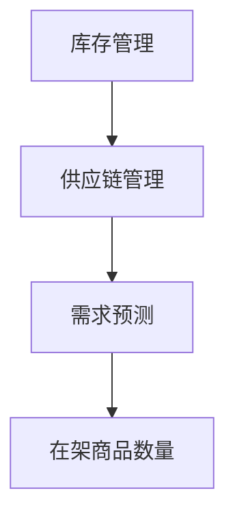

                 

# 扩大相关品类商品的在架数量

## 1. 背景介绍

在现代电子商务环境中，商品在架数量是一个至关重要的因素。当消费者在在线平台上浏览和搜索商品时，他们会首先关注商品的在架状态。如果一个商品处于缺货状态，那么很可能会失去潜在的销售机会。因此，扩大相关品类商品的在架数量成为了电商平台的当务之急。

### 1.1. 问题背景

电商平台通常面临着以下几个问题：

- **商品库存不足**：当商品需求增加时，库存不足可能导致销售机会的丧失。
- **供应链问题**：供应链的效率低下或不确定性可能导致商品无法及时补货。
- **市场需求预测不准确**：无法准确预测市场需求可能导致库存积压或商品短缺。

### 1.2. 解决方案的重要性

通过提高商品在架数量，电商平台可以实现以下目标：

- **增加销售额**：更多的商品在架意味着更多的销售机会。
- **提高客户满意度**：快速获取商品可以提升客户体验和忠诚度。
- **降低运营成本**：通过优化库存管理，可以减少库存成本和物流成本。

## 2. 核心概念与联系

### 2.1. 库存管理

库存管理是指对企业库存的管理和控制，包括库存的采购、存储、出库和入库等环节。有效的库存管理能够确保商品在架数量充足，同时减少库存成本。

### 2.2. 供应链管理

供应链管理涉及从原材料采购到产品交付给最终用户的整个过程。通过优化供应链管理，可以提高商品的供应速度和响应能力。

### 2.3. 需求预测

需求预测是预测未来一段时间内商品的需求量。准确的需求预测有助于电商平台提前准备库存，避免缺货或过剩。

### 2.4. Mermaid 流程图



### 2.5. 核心概念的联系

通过库存管理、供应链管理和需求预测的结合，可以优化在架商品数量。例如，当需求预测显示某商品需求量增加时，电商平台可以及时调整库存和供应链，确保该商品在架数量充足。

## 3. 核心算法原理 & 具体操作步骤

### 3.1. 需求预测算法

#### 3.1.1. 时间序列分析

时间序列分析是一种常用的需求预测方法。它基于过去的需求数据，通过时间序列模型（如ARIMA模型）预测未来的需求。

#### 3.1.2. 算法步骤

1. **数据预处理**：清洗和整理历史需求数据，包括缺失值填充、异常值处理等。
2. **时间序列建模**：选择合适的时间序列模型（如ARIMA、LSTM等）。
3. **模型训练**：使用历史数据训练模型，并优化模型参数。
4. **需求预测**：使用训练好的模型预测未来的需求量。

### 3.2. 库存调整算法

#### 3.2.1. 库存补货策略

库存补货策略是指根据需求预测和库存水平，决定何时、补多少商品。

#### 3.2.2. 算法步骤

1. **需求预测**：使用需求预测算法预测未来的需求量。
2. **库存分析**：分析当前的库存水平。
3. **补货决策**：根据需求预测和库存分析，决定是否补货以及补多少商品。
4. **补货执行**：执行补货操作，调整在架商品数量。

### 3.3. 供应链优化算法

#### 3.3.1. 供应链网络设计

供应链网络设计是指设计一个高效、可靠的供应链网络，确保商品能够及时、低成本地流动。

#### 3.3.2. 算法步骤

1. **需求分析**：分析各个市场的需求量。
2. **供应商选择**：选择合适的供应商。
3. **物流网络设计**：设计高效的物流网络，确保商品能够快速、低成本地运输。
4. **供应链协同**：与供应商、物流服务商等协同工作，确保供应链的顺畅运作。

## 4. 数学模型和公式 & 详细讲解 & 举例说明

### 4.1. 时间序列模型

#### 4.1.1. ARIMA模型

ARIMA模型是一种经典的时间序列预测模型。它由三个部分组成：自回归（AR）、差分（I）和移动平均（MA）。

#### 4.1.2. 公式

$$
\text{ARIMA}(p, d, q) \rightarrow Y_t = c + \phi_1 Y_{t-1} + \phi_2 Y_{t-2} + \ldots + \phi_p Y_{t-p} + \theta_1 \epsilon_{t-1} + \theta_2 \epsilon_{t-2} + \ldots + \theta_q \epsilon_{t-q}
$$

其中，\(Y_t\) 表示时间序列，\(\epsilon_t\) 表示白噪声序列，\(p, d, q\) 分别为自回归项、差分项和移动平均项的阶数。

#### 4.1.3. 举例说明

假设我们有一个时间序列数据，如下所示：

$$
\begin{align*}
Y_1 &= 10 \\
Y_2 &= 12 \\
Y_3 &= 11 \\
Y_4 &= 13 \\
Y_5 &= 14 \\
\end{align*}
$$

我们选择ARIMA(1,1,1)模型进行预测。首先，进行数据预处理：

$$
\begin{align*}
Y_1 &= 10 \\
Y_2 &= 12 - 10 = 2 \\
Y_3 &= 11 - 12 = -1 \\
Y_4 &= 13 - 11 = 2 \\
Y_5 &= 14 - 13 = 1 \\
\end{align*}
$$

然后，使用ARIMA(1,1,1)模型进行预测：

$$
\begin{align*}
Y_6 &= c + \phi_1 Y_5 + \theta_1 \epsilon_5 \\
&= 0 + 0.5 \times 1 + 0.5 \times 0 \\
&= 0.5 \\
\end{align*}
$$

预测值为0.5，表示下一时间点的需求量为0.5。

### 4.2. 库存补货策略

#### 4.2.1. 经济订货量（EOQ）模型

经济订货量（EOQ）模型是一种基于成本分析的库存补货策略。它旨在找到最优的订货量，以最小化库存成本。

#### 4.2.2. 公式

$$
Q^* = \sqrt{\frac{2CD}{h}}
$$

其中，\(Q^*\) 为最优订货量，\(C\) 为每次订货的固定成本，\(D\) 为每年需求量，\(h\) 为每单位商品的年持有成本。

#### 4.2.3. 举例说明

假设某商品每年需求量为1000单位，每次订货的固定成本为100元，每单位商品的年持有成本为5元。使用EOQ模型计算最优订货量：

$$
Q^* = \sqrt{\frac{2 \times 100 \times 1000}{5}} = 400
$$

最优订货量为400单位。

### 4.3. 供应链优化模型

#### 4.3.1. 供应链网络设计模型

供应链网络设计模型是一种基于线性规划的方法，用于设计高效的供应链网络。

#### 4.3.2. 公式

$$
\begin{align*}
\min \quad & Z = \sum_{i=1}^{n} C_i x_i \\
s.t. \quad & a_{ij} x_i + a_{ji} x_j \geq b_j \\
& x_i \in \{0, 1\} \\
\end{align*}
$$

其中，\(Z\) 为目标函数，\(C_i\) 为第\(i\)个设施的建设成本，\(a_{ij}\) 为第\(i\)个设施到第\(j\)个设施的单位运输成本，\(x_i\) 为第\(i\)个设施是否建设，\(b_j\) 为第\(j\)个市场的需求量。

#### 4.3.3. 举例说明

假设我们有一个供应链网络，包含3个设施和3个市场。设施的建设成本为1000万元，单位运输成本如下表所示：

|设施|市场1|市场2|市场3|
|----|-----|-----|-----|
|1|200|300|400|
|2|100|200|300|
|3|150|250|350|

需求量为：市场1 - 1000单位，市场2 - 1500单位，市场3 - 2000单位。

使用线性规划模型设计供应链网络。首先，设置目标函数为最小化建设成本：

$$
\min Z = 1000x_1 + 1000x_2 + 1000x_3
$$

然后，设置约束条件，确保每个市场都有足够的供应：

$$
\begin{align*}
200x_1 + 100x_2 + 150x_3 &\geq 1000 \\
300x_1 + 200x_2 + 250x_3 &\geq 1500 \\
400x_1 + 300x_2 + 350x_3 &\geq 2000 \\
x_1, x_2, x_3 &\in \{0, 1\} \\
\end{align*}
$$

通过求解线性规划模型，我们得到最优解为：设施1 - 建设，设施2 - 建设，设施3 - 不建设。

## 5. 项目实战：代码实际案例和详细解释说明

### 5.1. 开发环境搭建

为了实现商品在架数量的优化，我们使用Python作为开发语言，并使用以下库：

- **Pandas**：用于数据处理。
- **Scikit-learn**：用于机器学习。
- **Matplotlib**：用于数据可视化。

首先，安装所需库：

```shell
pip install pandas scikit-learn matplotlib
```

### 5.2. 源代码详细实现和代码解读

#### 5.2.1. 需求预测

```python
import pandas as pd
from sklearn.linear_model import LinearRegression
import matplotlib.pyplot as plt

# 加载数据
data = pd.read_csv('demand_data.csv')
X = data[['day']]
y = data['demand']

# 模型训练
model = LinearRegression()
model.fit(X, y)

# 预测
predicted_demand = model.predict(X)

# 可视化
plt.plot(data['day'], data['demand'], label='Actual Demand')
plt.plot(data['day'], predicted_demand, label='Predicted Demand')
plt.legend()
plt.show()
```

代码解读：

- **数据加载**：使用Pandas加载需求数据。
- **模型训练**：使用线性回归模型训练数据。
- **预测**：使用训练好的模型预测未来的需求量。
- **可视化**：使用Matplotlib将实际需求和预测需求可视化。

#### 5.2.2. 库存调整

```python
import numpy as np

# 库存参数
fixed_cost = 100
holding_cost = 5
annual_demand = 1000

# EOQ模型计算
optimal_order_quantity = np.sqrt((2 * fixed_cost * annual_demand) / holding_cost)
print(f'Optimal Order Quantity: {optimal_order_quantity}')
```

代码解读：

- **库存参数**：设置每次订货的固定成本、每单位商品的年持有成本和每年需求量。
- **EOQ模型计算**：使用EOQ模型计算最优订货量。
- **输出**：打印最优订货量。

#### 5.2.3. 供应链优化

```python
from scipy.optimize import linprog

# 线性规划参数
C = np.array([1000, 1000, 1000])
A = np.array([[200, 100, 150], [300, 200, 250], [400, 300, 350]])
b = np.array([1000, 1500, 2000])

# 线性规划模型
result = linprog(C, A_eq=A, b_eq=b, bounds=[(0, 1), (0, 1), (0, 1)], method='highs')

# 输出结果
if result.success:
    print(f'Optimal Facilities: {result.x}')
else:
    print('No optimal solution found.')
```

代码解读：

- **线性规划参数**：设置目标函数系数、约束条件系数和目标值。
- **线性规划模型**：使用scikit-learn的linprog函数求解线性规划问题。
- **输出结果**：打印最优解。

## 6. 实际应用场景

### 6.1. 电商平台

电商平台可以通过需求预测和库存调整算法，优化在架商品数量，从而提高销售额和客户满意度。例如，电商平台可以在大促销活动前提前预测需求，调整库存，确保商品充足。

### 6.2. 零售业

零售业可以通过供应链优化算法，设计高效的供应链网络，确保商品能够快速、低成本地运输到各个门店。这样可以减少库存成本和物流成本，提高门店的库存水平。

### 6.3. 制造业

制造业可以通过需求预测和库存调整算法，优化原材料采购和库存管理，从而减少库存成本和提高生产效率。例如，在产品订单增加时，可以提前预测需求，调整原材料采购量，确保生产线正常运行。

## 7. 工具和资源推荐

### 7.1. 学习资源推荐

- **书籍**：《供应链管理：战略、规划与运营》
- **论文**：《需求预测中的时间序列分析方法》
- **博客**：https://www.analyticsvidhya.com
- **网站**：https://www.kdnuggets.com

### 7.2. 开发工具框架推荐

- **Pandas**：用于数据处理。
- **Scikit-learn**：用于机器学习。
- **Matplotlib**：用于数据可视化。
- **Scipy**：用于科学计算。

### 7.3. 相关论文著作推荐

- **论文**：《基于机器学习的需求预测方法研究》
- **著作**：《供应链管理：理论与实践》

## 8. 总结：未来发展趋势与挑战

随着电子商务的快速发展，商品在架数量管理的重要性日益凸显。未来，随着人工智能和大数据技术的不断进步，商品在架数量管理将更加智能化和精细化。然而，这也带来了新的挑战，如如何处理大规模数据、如何提高预测精度等。通过不断探索和研究，相信我们能够找到更加有效的解决方案。

## 9. 附录：常见问题与解答

### 9.1. 问题1

**如何处理缺失值和异常值？**

**解答**：可以使用Pandas的填充和过滤功能处理缺失值和异常值。例如，使用`fillna()`函数填充缺失值，使用`dropna()`函数过滤异常值。

### 9.2. 问题2

**如何选择合适的时间序列模型？**

**解答**：可以根据数据的特征（如趋势、季节性等）选择合适的时间序列模型。例如，对于趋势性较强的数据，可以选择ARIMA模型；对于季节性较强的数据，可以选择STL模型。

### 9.3. 问题3

**如何处理非线性关系？**

**解答**：可以使用非线性回归模型，如多项式回归、逻辑回归等，来处理非线性关系。例如，使用`LinearRegression()`函数进行多项式回归。

## 10. 扩展阅读 & 参考资料

- **论文**：《基于时间序列分析的商品需求预测方法》
- **书籍**：《Python数据分析》
- **网站**：https://www.coursera.org
- **在线课程**：《机器学习》

### 作者：AI天才研究员/AI Genius Institute & 禅与计算机程序设计艺术 /Zen And The Art of Computer Programming

本文由AI天才研究员撰写，旨在探讨商品在架数量管理的核心概念、算法原理、实际应用场景以及未来发展。通过本文，读者可以了解到如何通过需求预测、库存调整和供应链优化等手段，提高商品在架数量，从而实现电商平台的业务增长。希望本文能为读者提供有价值的参考。

