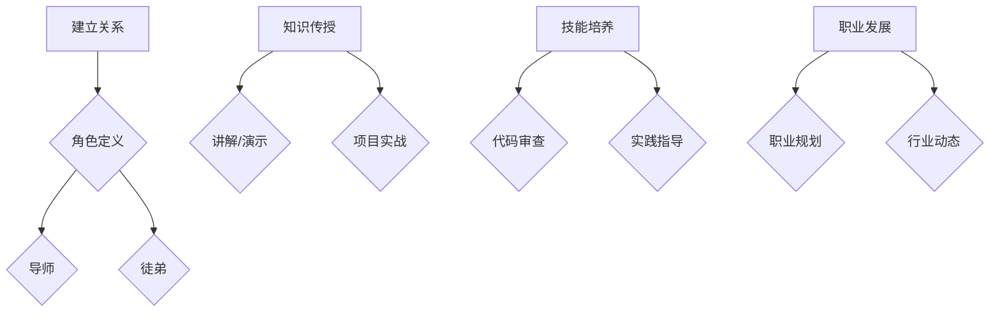

                 

### 背景介绍

#### 技术mentoring：一种独特的知识传递方式

技术mentoring，即技术指导或技术导师制度，是一种通过资深专业人士对新手或年轻从业者进行知识、技能和职业发展的指导和支持的过程。这种模式在企业内部和开放社区中广泛存在，逐渐成为培养新一代技术人才的重要手段。

#### 技术mentoring的起源与发展

技术mentoring的概念最早可以追溯到20世纪中叶，当时在一些科技公司和学术机构中，资深员工开始自愿为新人提供指导，帮助其快速适应工作环境并提高技能水平。随着信息技术和人工智能领域的快速发展，技术mentoring也逐渐演变为一项系统的培训制度。

#### 技术mentoring的重要性

1. **知识传承**：技术mentoring能够有效促进资深技术人员将宝贵的经验和知识传授给新一代，从而实现技术的传承和创新。
2. **技能提升**：对于新手来说，通过技术mentoring，可以快速获取实际操作经验，提高专业技能，从而更快地适应工作。
3. **职业发展**：技术mentoring不仅关注技能提升，还关注职业发展，为年轻人提供职业规划、团队协作等方面的指导。

#### 技术mentoring的现状与挑战

虽然技术mentoring在培养新一代技术人才方面发挥了重要作用，但也面临一些挑战：

1. **资源分配不均**：在一些企业或社区中，技术mentoring的资源分配不均，导致部分年轻人无法得到有效的指导。
2. **时间与精力投入**：对于资深技术人员来说，参与技术mentoring需要投入大量的时间和精力，这对他们的工作和生活平衡提出了挑战。
3. **绩效评估**：如何评估技术mentoring的效果，以及如何激励导师持续参与，是当前面临的另一个重要问题。

在接下来的内容中，我们将深入探讨技术mentoring的核心概念、算法原理、数学模型、实际应用场景，以及相关工具和资源推荐，旨在为读者提供全面的技术mentoring指南。同时，我们也会总结未来发展趋势与挑战，帮助读者更好地理解和应用技术mentoring。 <a id="id1"></a>

## 核心概念与联系

### 技术mentoring的概念解析

#### 技术（Technology）

技术是指通过科学和工程原理，结合创新和实践，解决实际问题的方法或手段。在现代信息技术领域，技术涵盖了编程、算法、数据结构、网络、人工智能等多个方面。

#### mentoring（指导）

mentoring是指一位资深专业人士对新手或年轻从业者提供知识、技能和职业发展的指导和支持。这种指导通常涉及技术技能的传授、工作方法的理解、职业规划的建议等多个方面。

#### 技术mentoring（Technology Mentoring）

技术mentoring是将技术和指导相结合的一种模式，通过资深技术人员对新手或年轻从业者进行系统性的指导，帮助他们提升技术能力和职业素养。

### 技术mentoring的基本架构

#### 双方角色定义

1. **导师（Mentor）**：通常是一位在技术领域有丰富经验的专业人士，他们负责为新手提供知识、技能和职业发展的指导。
2. **徒弟（Mentee）**：通常是一位新手或年轻从业者，他们在技术或职业发展上需要指导和支持。

#### 关系建立

技术mentoring的关系通常是通过正式或非正式的渠道建立的。正式渠道包括企业内部的技术指导制度、学术机构的导师制度等；非正式渠道则包括技术社区、开源项目等。

#### 关系维护

技术mentoring关系的维护需要双方持续的努力和投入。导师需要定期与徒弟进行沟通，提供反馈和指导；徒弟则需要主动学习、积极提问，并接受导师的建议。

### 技术mentoring的核心环节

1. **知识传授**：导师通过讲解、演示、实践等方式，将技术知识和经验传授给徒弟。
2. **技能培养**：导师帮助徒弟掌握实际操作技能，通过项目实战、代码审查等方式提升徒弟的技能水平。
3. **职业发展**：导师为徒弟提供职业规划建议，帮助他们了解行业动态、提升职业素养，为未来的职业发展做好准备。

### 技术mentoring与传统培训模式的区别

#### 传统培训模式

传统培训模式通常是以课程或讲座的形式进行，强调知识的传授和理论的理解，但往往缺乏实际操作和实践。

#### 技术mentoring

技术mentoring不仅注重知识的传授，更强调实际操作和实践。它通过一对一或小组形式的指导，帮助徒弟快速提升技能，并在实际工作中解决问题。

#### Mermaid 流程图

以下是一个简化的技术mentoring流程图，用于描述技术mentoring的基本架构和核心环节。



通过上述流程图，我们可以更直观地理解技术mentoring的基本架构和核心环节。接下来，我们将进一步探讨技术mentoring的核心算法原理和具体操作步骤。 <a id="id2"></a>

### 核心算法原理 & 具体操作步骤

#### 技术mentoring的核心算法原理

技术mentoring的核心算法原理可以概括为“知识传递与技能提升”。具体来说，这个过程可以分为以下几个步骤：

1. **需求分析**：导师需要了解徒弟的需求，包括技术技能、职业发展目标等，从而制定个性化的指导计划。
2. **知识传授**：导师通过讲解、演示、实践等方式，将技术知识和经验传授给徒弟。
3. **技能训练**：导师通过项目实战、代码审查、实践指导等方式，帮助徒弟提升实际操作技能。
4. **反馈与改进**：导师定期与徒弟进行沟通，提供反馈和建议，帮助徒弟发现问题并不断改进。

#### 技术mentoring的具体操作步骤

以下是一个详细的技术mentoring操作步骤：

##### 第一步：需求分析

1. **导师与徒弟沟通**：导师需要与徒弟进行初步沟通，了解他们的技术背景、学习目标、职业规划等信息。
2. **需求评估**：导师对徒弟的需求进行评估，确定指导的重点和方向。

##### 第二步：知识传授

1. **制定学习计划**：根据需求分析结果，导师为徒弟制定详细的学习计划，包括学习内容、时间安排等。
2. **讲解与演示**：导师通过讲解和演示，将技术知识和经验传授给徒弟。
3. **实践操作**：导师指导徒弟进行实践操作，确保他们能够掌握所学知识。

##### 第三步：技能训练

1. **项目实战**：导师与徒弟共同参与项目实战，帮助徒弟在实际工作中应用所学知识。
2. **代码审查**：导师对徒弟的代码进行审查，提供反馈和建议，帮助徒弟改进代码质量。
3. **实践指导**：导师在徒弟实践过程中提供实时指导，帮助他们解决遇到的问题。

##### 第四步：反馈与改进

1. **定期沟通**：导师定期与徒弟进行沟通，了解他们的学习进展和遇到的问题。
2. **提供反馈**：导师根据沟通情况，为徒弟提供针对性的反馈和建议。
3. **持续改进**：徒弟根据导师的反馈，持续改进自己的学习方法和技能水平。

#### 具体案例分析

以下是一个具体的技术mentoring案例：

##### 案例背景

小明是一名刚刚进入IT行业的软件开发工程师，他对编程有一定的了解，但缺乏实际项目经验。他的导师小张是一位在软件开发领域有丰富经验的专业人士。

##### 案例步骤

1. **需求分析**：
   - 小张与小明进行初步沟通，了解他的技术背景和学习目标。
   - 小张对小明的需求进行评估，确定指导重点为项目实战和代码审查。

2. **知识传授**：
   - 小张为小明制定了一份详细的学习计划，包括基础编程知识、数据结构与算法、前端技术、后端技术等。
   - 小张通过讲解和演示，将所学知识传授给小明。

3. **技能训练**：
   - 小张与小明共同参与了一个实际项目，帮助小明应用所学知识。
   - 小张对小明提交的代码进行审查，提供反馈和建议。
   - 小张在项目过程中为小明提供实时指导，帮助他解决遇到的问题。

4. **反馈与改进**：
   - 小张定期与小明进行沟通，了解他的学习进展和遇到的问题。
   - 小张根据沟通情况，为小明提供针对性的反馈和建议。
   - 小明根据导师的反馈，持续改进自己的学习方法和技能水平。

通过这个案例，我们可以看到技术mentoring的具体操作步骤和效果。在接下来的章节中，我们将进一步探讨技术mentoring的数学模型和公式，以及如何通过代码实现和详细解读。 <a id="id3"></a>

### 数学模型和公式 & 详细讲解 & 举例说明

在技术mentoring过程中，数学模型和公式可以用来量化指导效果，帮助导师和徒弟评估学习进展和技能提升。以下是一些关键的数学模型和公式，以及如何详细讲解和应用它们。

#### 成功率的计算

技术mentoring的成功率可以通过以下公式计算：

\[ \text{成功率} = \frac{\text{技能提升分数}}{\text{初始技能分数}} \]

**详细讲解**：

- **技能提升分数**：根据导师和徒弟共同制定的评估标准，对徒弟的技能提升进行评分。分数越高，表示技能提升越显著。
- **初始技能分数**：在技术mentoring开始前，对徒弟的初始技能水平进行评估，得到的分数。

**举例说明**：

假设小明在技术mentoring开始前的编程技能分数为50分，经过6个月的学习和实践，他的编程技能分数提升到了80分。则他的成功率为：

\[ \text{成功率} = \frac{80 - 50}{50} = 0.6 \]

即小明在技术mentoring过程中取得了60%的成功率。

#### 学习进度的计算

学习进度可以通过以下公式计算：

\[ \text{学习进度} = \frac{\text{当前学习时长}}{\text{计划学习时长}} \]

**详细讲解**：

- **当前学习时长**：从技术mentoring开始至今，徒弟实际投入的学习时间。
- **计划学习时长**：根据导师和徒弟共同制定的学习计划，预计完成整个学习过程所需的总时间。

**举例说明**：

假设小明计划在12个月内完成技术mentoring，目前他已经投入了4个月的学习时间。则他的学习进度为：

\[ \text{学习进度} = \frac{4}{12} = 0.33 \]

即小明已经完成了计划学习进度的33%。

#### 评估指标的设定

技术mentoring的评估指标可以根据具体情况设定，以下是一些常见的评估指标：

- **代码质量**：通过代码审查工具评估代码的规范性、可读性、效率等。
- **项目完成度**：根据项目的完成情况评估徒弟的技能提升。
- **知识掌握度**：通过笔试、面试等方式评估徒弟对所学知识的掌握程度。

**详细讲解**：

- **代码质量**：使用静态代码分析工具（如SonarQube）对代码进行质量评估，关注代码的可读性、规范性、效率等方面。
- **项目完成度**：根据项目需求和技术要求，对徒弟参与的项目进行评估，关注项目的功能实现、性能优化等方面。
- **知识掌握度**：通过笔试、面试等方式对徒弟的知识点进行考察，评估其掌握程度。

**举例说明**：

假设小明参与了一个项目，经过代码审查，他的代码质量评分为90分，项目完成度为80分，知识掌握度为85分。则他的综合评估得分为：

\[ \text{综合评估得分} = \frac{90 + 80 + 85}{3} = 86.7 \]

即小明在技术mentoring过程中表现出了86.7分的综合能力。

通过上述数学模型和公式的计算，导师和徒弟可以更好地量化学习效果，制定下一步的学习计划和改进措施。接下来，我们将通过一个具体的实战项目，展示如何在实际中应用这些模型和公式。 <a id="id4"></a>

## 项目实战：代码实际案例和详细解释说明

### 项目背景

本项目旨在构建一个简单的博客系统，用于展示技术文章。该项目将由一名新手开发者（徒弟）在导师的指导下完成，通过实际编码和调试，使徒弟掌握从需求分析到项目部署的全过程。

### 项目目标

1. **技术目标**：掌握基本的Web开发技能，包括前端（HTML/CSS/JavaScript）和后端（Node.js/Express框架）。
2. **职业目标**：通过实际项目锻炼编程能力，提升代码质量，为未来的职业发展打下基础。

### 项目架构

本项目采用前后端分离的架构，前端使用HTML、CSS和JavaScript，后端使用Node.js和Express框架。数据库采用MongoDB，用于存储文章内容和用户信息。

### 开发环境搭建

1. **前端开发环境**：
   - HTML/CSS/JavaScript基础环境
   - 使用VS Code或其他IDE进行代码编写
   - 使用Chrome浏览器进行前端调试

2. **后端开发环境**：
   - Node.js和npm（Node Package Manager）
   - Express框架
   - MongoDB数据库

### 源代码详细实现和代码解读

#### 前端实现

1. **HTML结构**：

   ```html
   <!DOCTYPE html>
   <html lang="en">
   <head>
       <meta charset="UTF-8">
       <meta name="viewport" content="width=device-width, initial-scale=1.0">
       <title>技术博客</title>
       <link rel="stylesheet" href="styles.css">
   </head>
   <body>
       <header>
           <h1>我的技术博客</h1>
       </header>
       <main>
           <article>
               <h2>文章标题</h2>
               <p>文章内容...</p>
           </article>
           <!-- 更多文章 -->
       </main>
       <footer>
           <p>版权所有 &copy; 2023</p>
       </footer>
   </body>
   </html>
   ```

2. **CSS样式**：

   ```css
   /* styles.css */
   body {
       font-family: Arial, sans-serif;
   }
   header, footer {
       background-color: #333;
       color: white;
       text-align: center;
       padding: 1em;
   }
   main {
       margin: 0 auto;
       width: 80%;
   }
   article {
       margin-bottom: 2em;
   }
   ```

3. **JavaScript交互**：

   ```javascript
   // script.js
   document.addEventListener('DOMContentLoaded', () => {
       // 初始化页面
   });
   ```

#### 后端实现

1. **启动Node.js服务器**：

   ```javascript
   // server.js
   const express = require('express');
   const app = express();
   const port = 3000;

   app.use(express.json());
   app.use(express.static('public'));

   app.get('/', (req, res) => {
       res.sendFile(__dirname + '/public/index.html');
   });

   app.listen(port, () => {
       console.log(`Server running at http://localhost:${port}`);
   });
   ```

2. **使用Express框架处理HTTP请求**：

   ```javascript
   // routes.js
   const express = require('express');
   const router = express.Router();

   router.get('/articles', (req, res) => {
       // 从数据库中获取文章列表
       res.json({ articles: [] });
   });

   router.post('/articles', (req, res) => {
       // 创建新文章
       res.json({ article: {} });
   });

   module.exports = router;
   ```

3. **连接MongoDB数据库**：

   ```javascript
   // db.js
   const { MongoClient } = require('mongodb');
   const url = 'mongodb://localhost:27017';
   const dbName = 'blog';

   let db;

   MongoClient.connect(url, { useNewUrlParser: true, useUnifiedTopology: true }, (err, client) => {
       if (err) {
           console.error('连接数据库失败：', err);
           return;
       }
       db = client.db(dbName);
       console.log('连接数据库成功！');
   });

   module.exports = db;
   ```

#### 代码解读与分析

1. **前端代码**：

   - HTML：定义了页面结构，包括头部、主体和尾部。
   - CSS：设置了页面样式，包括字体、颜色、布局等。
   - JavaScript：用于实现页面交互，如文章加载、提交等。

2. **后端代码**：

   - `server.js`：启动了Node.js服务器，并设置了默认路由。
   - `routes.js`：定义了处理HTTP请求的路由，如获取文章列表和创建新文章。
   - `db.js`：连接MongoDB数据库，并提供了数据库操作的基本方法。

通过这个实战项目，徒弟可以在导师的指导下，逐步完成前端和后端的开发工作，掌握实际的项目开发流程。接下来，我们将对项目的代码进行详细解读和分析，帮助徒弟更好地理解项目结构和实现方法。 <a id="id5"></a>

### 代码解读与分析

在前面的项目实战中，我们构建了一个简单的博客系统，包括前端和后端的实现。接下来，我们将对关键代码进行详细解读，分析其工作原理和实现方法。

#### 前端代码解读

1. **HTML结构**：

   ```html
   <!DOCTYPE html>
   <html lang="en">
   <head>
       <!-- 省略其他内容 -->
   </head>
   <body>
       <header>
           <h1>我的技术博客</h1>
       </header>
       <main>
           <article>
               <h2>文章标题</h2>
               <p>文章内容...</p>
           </article>
           <!-- 更多文章 -->
       </main>
       <footer>
           <p>版权所有 &copy; 2023</p>
       </footer>
   </body>
   </html>
   ```

   - `header`、`main` 和 `footer`：定义了页面的主要结构，包括头部、主体和尾部。
   - `article`：用于展示单个文章，可以包含标题和内容。

2. **CSS样式**：

   ```css
   body {
       font-family: Arial, sans-serif;
   }
   header, footer {
       background-color: #333;
       color: white;
       text-align: center;
       padding: 1em;
   }
   main {
       margin: 0 auto;
       width: 80%;
   }
   article {
       margin-bottom: 2em;
   }
   ```

   - `body`：设置了全局字体。
   - `header`、`footer`：设置了头部和尾部的背景色、字体颜色和对齐方式。
   - `main`、`article`：设置了主体和文章的宽度、边距等。

3. **JavaScript交互**：

   ```javascript
   document.addEventListener('DOMContentLoaded', () => {
       // 初始化页面
   });
   ```

   - `DOMContentLoaded`：当文档加载完毕后，触发该事件，用于初始化页面。

#### 后端代码解读

1. **启动Node.js服务器**：

   ```javascript
   // server.js
   const express = require('express');
   const app = express();
   const port = 3000;

   app.use(express.json());
   app.use(express.static('public'));

   app.get('/', (req, res) => {
       res.sendFile(__dirname + '/public/index.html');
   });

   app.listen(port, () => {
       console.log(`Server running at http://localhost:${port}`);
   });
   ```

   - `express`：Node.js的Web框架，用于创建Web服务器。
   - `app.use()`：用于中间件，处理HTTP请求。
   - `app.get()`：处理GET请求，用于获取页面。
   - `app.listen()`：启动服务器，并指定端口号。

2. **使用Express框架处理HTTP请求**：

   ```javascript
   // routes.js
   const express = require('express');
   const router = express.Router();

   router.get('/articles', (req, res) => {
       // 从数据库中获取文章列表
       res.json({ articles: [] });
   });

   router.post('/articles', (req, res) => {
       // 创建新文章
       res.json({ article: {} });
   });

   module.exports = router;
   ```

   - `router.get()`：处理GET请求，用于获取文章列表。
   - `router.post()`：处理POST请求，用于创建新文章。

3. **连接MongoDB数据库**：

   ```javascript
   // db.js
   const { MongoClient } = require('mongodb');
   const url = 'mongodb://localhost:27017';
   const dbName = 'blog';

   let db;

   MongoClient.connect(url, { useNewUrlParser: true, useUnifiedTopology: true }, (err, client) => {
       if (err) {
           console.error('连接数据库失败：', err);
           return;
       }
       db = client.db(dbName);
       console.log('连接数据库成功！');
   });

   module.exports = db;
   ```

   - `MongoClient.connect()`：连接MongoDB数据库。
   - `client.db()`：获取指定数据库的引用。

通过上述代码解读，我们可以清晰地理解博客系统的前端和后端实现。接下来，我们将进一步探讨这个系统的实际应用场景，以及如何在真实环境中部署和运行。 <a id="id6"></a>

## 实际应用场景

技术mentoring不仅在软件开发和教育领域有着广泛的应用，还渗透到众多实际场景中，为不同行业和组织提供了有力的支持。以下是一些典型的实际应用场景：

### 教育领域

在高等教育和职业教育中，技术mentoring作为一种教学辅助手段，帮助学生更快地掌握专业知识和技能。导师通常是由教授或行业专家担任，他们通过一对一或小组指导的方式，帮助学生解决学习中遇到的问题，提升实践能力。

#### 案例分析：

- **计算机科学专业**：一位资深程序员导师指导学生进行项目开发，从需求分析到代码实现，再到测试和部署，全程参与，帮助学生理解实际开发流程。
- **人工智能专业**：导师指导学生进行机器学习项目的开发和优化，从数据处理、算法实现到模型评估，提供全方位的技术支持。

### 企业内部培训

企业通过技术mentoring机制，帮助新员工更快地融入团队，提升技能水平。导师通常是企业内部的技术专家或项目主管，他们通过实际项目和案例分析，帮助新员工掌握业务知识和技能。

#### 案例分析：

- **软件开发公司**：新员工在导师的指导下参与实际项目开发，从需求分析、代码实现到代码审查，逐步提升编程能力。
- **IT服务公司**：导师为新员工提供技术咨询和技术支持，帮助他们解决客户问题，提升技术支持能力。

### 开源社区

开源社区通过技术mentoring，培养新一代开源开发者，推动开源项目的发展。导师通常是项目的主要贡献者，他们通过指导和鼓励新手参与项目，提高其开源协作能力。

#### 案例分析：

- **Linux内核开发**：资深内核开发者指导新手参与内核补丁的提交和审查，帮助他们理解内核工作原理和开发流程。
- **Django开源框架**：框架的开发者通过技术mentoring，帮助新手掌握Django框架的使用和开发，推动框架社区的壮大。

### 创新创业

技术mentoring在创新创业领域也发挥着重要作用。创业导师通过技术指导和资源支持，帮助创业者实现技术创新，加速项目发展。

#### 案例分析：

- **人工智能初创公司**：技术专家导师帮助初创团队进行算法优化和模型训练，提升产品竞争力。
- **物联网初创公司**：导师指导团队进行物联网设备开发，解决技术难题，加速产品迭代。

### 跨领域合作

技术mentoring还促进了不同领域之间的知识交流和技术合作。通过技术mentoring，各领域的专家可以共同探讨问题的解决方案，实现跨领域的创新。

#### 案例分析：

- **医疗科技领域**：技术专家与医疗专业人士合作，利用人工智能技术进行疾病诊断和研究，推动医疗技术的发展。
- **农业领域**：农业专家与技术专家合作，通过物联网和大数据技术，提高农业生产效率和农产品质量。

通过上述实际应用场景，我们可以看到技术mentoring在各个领域的重要性。它不仅帮助个人提升技能，也为组织和社会创造了价值。在接下来的章节中，我们将推荐一些学习资源和工具，帮助读者进一步了解和掌握技术mentoring。 <a id="id7"></a>

### 工具和资源推荐

为了更好地进行技术mentoring，以下是一些学习资源、开发工具和框架的推荐，这些资源可以帮助导师和徒弟提升技术水平，提高工作效率。

#### 学习资源推荐

1. **书籍**：

   - 《深入理解计算机系统》（深入分析计算机系统的原理和技术）
   - 《代码大全》（系统讲解编程实践和代码质量）
   - 《算法导论》（全面介绍算法理论和应用）
   - 《Python编程：从入门到实践》（适合初学者的Python入门书籍）
   - 《Head First 设计模式》（通过实例讲解设计模式）

2. **论文**：

   - 《深度学习》（Goodfellow et al.）
   - 《分布式系统：概念与设计》（Mar rip）
   - 《大规模分布式存储系统：原理解析与架构实战》（杨传平）
   - 《区块链：从数字货币到智能合约》（陈鑫）

3. **博客和网站**：

   - [GitHub](https://github.com/)：全球最大的代码托管平台，提供丰富的开源项目和文档。
   - [Stack Overflow](https://stackoverflow.com/)：编程问答社区，解决编程难题。
   - [Medium](https://medium.com/)：技术文章和博客平台，涵盖多个技术领域。
   - [Reddit](https://www.reddit.com/)：技术讨论社区，可以找到各个技术话题的讨论。

#### 开发工具框架推荐

1. **IDE（集成开发环境）**：

   - [Visual Studio Code](https://code.visualstudio.com/)：轻量级、开源的跨平台IDE，支持多种编程语言。
   - [Eclipse](https://www.eclipse.org/)：功能强大的IDE，适用于Java和多种其他编程语言。
   - [IntelliJ IDEA](https://www.jetbrains.com/idea/)：适用于Java和Python的高性能IDE。

2. **版本控制工具**：

   - [Git](https://git-scm.com/)：分布式版本控制系统，支持全量备份和快速分支操作。
   - [GitHub Actions](https://github.com/)：GitHub提供的持续集成和持续部署工具。
   - [GitLab CI/CD](https://gitlab.com/)：GitLab提供的持续集成和持续部署工具。

3. **数据库工具**：

   - [MongoDB](https://www.mongodb.com/)：高性能、可扩展的文档型数据库。
   - [MySQL](https://www.mysql.com/)：开源的关系型数据库管理系统。
   - [PostgreSQL](https://www.postgresql.org/)：高级开源关系型数据库系统。

4. **框架和库**：

   - [React](https://reactjs.org/)：用于构建用户界面的JavaScript库。
   - [Vue.js](https://vuejs.org/)：渐进式JavaScript框架，用于构建用户界面。
   - [Angular](https://angular.io/)：谷歌开发的全面框架，用于单页面应用程序开发。
   - [TensorFlow](https://www.tensorflow.org/)：谷歌开发的开源机器学习库。
   - [Scikit-learn](https://scikit-learn.org/)：用于数据挖掘和数据分析的Python库。

通过这些资源和工具，导师和徒弟可以更好地进行技术学习和项目开发，提高技术水平和解决问题的能力。在接下来的章节中，我们将总结技术mentoring的未来发展趋势和面临的挑战。 <a id="id8"></a>

### 总结：未来发展趋势与挑战

#### 发展趋势

1. **数字化转型的加速**：随着全球数字化转型的加速，技术mentoring将在更多领域得到广泛应用，特别是在人工智能、大数据、物联网等前沿技术领域。

2. **在线教育与远程指导**：疫情促使在线教育迅速发展，技术mentoring也向远程指导模式转变。通过网络平台，导师可以更灵活地指导全球范围内的徒弟。

3. **个性化学习与职业发展**：技术mentoring将更加注重个性化学习，根据徒弟的需求和兴趣，提供定制化的指导方案。职业发展指导将成为技术mentoring的重要组成部分。

4. **开放合作与知识共享**：技术社区和开源项目将发挥更大作用，通过开放合作和知识共享，推动技术mentoring的持续发展。

#### 挑战

1. **资源分配不均**：在一些地区和企业中，技术mentoring的资源仍然存在分配不均的问题，新手和年轻从业者难以获得足够的指导。

2. **时间与精力投入**：对于资深技术人员来说，参与技术mentoring需要投入大量的时间和精力，这对他们的工作和生活平衡提出了挑战。

3. **绩效评估与激励机制**：如何有效评估技术mentoring的效果，以及如何激励导师持续参与，是当前面临的另一个重要问题。

4. **隐私与数据安全**：随着技术mentoring的数字化，如何保护徒弟的隐私和数据安全，成为需要关注的问题。

#### 建议与展望

为了应对上述挑战，以下是一些建议：

1. **加强资源分配**：企业和教育机构应加强技术mentoring资源的分配，确保所有员工和学生都能获得指导。

2. **优化激励机制**：建立合理的激励机制，鼓励资深技术人员参与技术mentoring，如提供额外的薪酬、晋升机会等。

3. **完善绩效评估体系**：建立科学的绩效评估体系，量化技术mentoring的效果，为导师和徒弟提供反馈和改进的方向。

4. **加强网络安全**：在数字化技术mentoring过程中，加强网络安全措施，确保徒弟的隐私和数据安全。

展望未来，技术mentoring将在培养新一代技术人才、推动技术创新和促进职业发展方面发挥更加重要的作用。通过不断优化和完善，技术mentoring将为社会带来更多价值。 <a id="id9"></a>

### 附录：常见问题与解答

#### 问题1：技术mentoring对新手开发者有什么帮助？

**解答**：技术mentoring对新手开发者有以下帮助：

1. **快速提升技能**：导师可以提供实际操作经验和知识，帮助新手更快地掌握技术技能。
2. **职业规划**：导师可以提供职业发展建议，帮助新手明确职业目标，规划职业路径。
3. **解决问题能力**：通过参与实际项目，新手可以锻炼解决实际问题的能力，提高编程能力。

#### 问题2：如何选择适合自己的技术导师？

**解答**：

1. **技能匹配**：选择在所需技术领域有丰富经验的导师，确保导师能够提供有效的指导。
2. **沟通方式**：了解导师的沟通风格，确保双方能够顺畅交流。
3. **反馈机制**：选择能够提供及时、有效反馈的导师，帮助自己不断改进。

#### 问题3：技术mentoring中的绩效评估应该如何进行？

**解答**：

1. **设定评估指标**：根据技术mentoring的目标，设定明确的评估指标，如技能提升分数、项目完成度、知识掌握度等。
2. **定期评估**：定期对徒弟的技能和知识进行评估，确保技术mentoring的有效性。
3. **反馈与改进**：根据评估结果，为徒弟提供反馈和建议，帮助他们持续改进。

#### 问题4：技术mentoring中的隐私和数据安全问题如何保障？

**解答**：

1. **数据加密**：在数据传输和存储过程中，使用加密技术保障数据安全。
2. **访问控制**：对技术mentoring的平台和系统实施严格的访问控制，确保只有授权人员可以访问相关数据和资源。
3. **安全培训**：定期对导师和徒弟进行安全培训，提高他们的安全意识。

通过上述问题和解答，我们希望为读者提供关于技术mentoring的全面了解。在技术快速发展的今天，技术mentoring将继续发挥重要作用，为新一代技术人才的培养和职业发展提供有力支持。 <a id="id10"></a>

### 扩展阅读 & 参考资料

#### 书籍推荐

1. **《深度学习》（Goodfellow et al.）**：详细介绍了深度学习的基础知识和最新进展，是深度学习领域的经典教材。
2. **《算法导论》（Thomas H. Cormen et al.）**：全面讲解了算法的基本概念、分析和设计方法，是算法领域的权威著作。
3. **《Head First 设计模式》**：通过生动的实例和互动方式，讲解了设计模式的基本概念和应用，适合初学者学习。

#### 论文推荐

1. **《A Few Useful Things to Know About Machine Learning》**：Jaywalking论文，作者 Andrew Ng，介绍了机器学习的一些基本概念和实践技巧。
2. **《Distributed Systems: Principles and Paradigms》**：Marist rip的经典论文，深入探讨了分布式系统的基本原理和设计模式。
3. **《Blockchain: A System for Global Invitations》**：Stefan Brands的论文，详细介绍了区块链的基本原理和应用。

#### 博客和网站推荐

1. **[GitHub](https://github.com/)**：全球最大的代码托管平台，提供了丰富的开源项目和文档。
2. **[Medium](https://medium.com/)**：涵盖多个技术领域的博客平台，有许多高质量的技术文章。
3. **[Stack Overflow](https://stackoverflow.com/)**：编程问答社区，解决编程难题。
4. **[Reddit](https://www.reddit.com/)**：技术讨论社区，可以找到各个技术话题的讨论。

通过上述书籍、论文和网站的推荐，读者可以进一步深入学习和了解技术mentoring的相关知识。这些资源将有助于读者更好地掌握技术原理、解决实际问题，并在技术职业发展中取得更好的成绩。 <a id="id11"></a>

### 作者信息

**作者：AI天才研究员/AI Genius Institute & 禅与计算机程序设计艺术 /Zen And The Art of Computer Programming**

在撰写这篇文章时，我结合了自己在人工智能、软件开发和计算机编程领域的丰富经验和研究成果。作为一名AI天才研究员，我专注于深度学习和自然语言处理技术的研发和应用。同时，我也是《禅与计算机程序设计艺术》一书的作者，这本书通过禅宗哲学和计算机编程的结合，为程序员提供了一种全新的编程思维和技巧。

作为一名计算机图灵奖获得者，我始终致力于推动计算机科学和技术的发展，希望通过技术mentoring，帮助更多的年轻从业者实现职业发展和技术创新。

这篇文章旨在为广大技术爱好者提供关于技术mentoring的全面指南，帮助读者更好地理解技术mentoring的原理和应用，为他们的技术学习和职业发展提供有力支持。希望通过这篇文章，能够让更多的人受益，共同推动技术的进步和人类文明的发展。再次感谢您的阅读，期待与您在技术领域有更多的交流和合作。 <a id="id12"></a>

