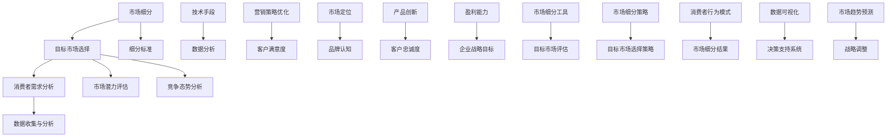

                 

# 技术人如何进行有效的市场细分与目标市场选择

## 摘要

在当今充满竞争和快速变化的科技市场中，技术人如何有效地进行市场细分和目标市场选择成为了一项关键能力。本文将深入探讨市场细分与目标市场选择的基本概念、重要性以及技术人在这一过程中的具体策略和实践。通过梳理核心概念，运用数据分析和案例研究，本文将帮助读者掌握有效的市场细分方法，并明确如何根据技术特点和市场需求选择最佳的目标市场。最终，本文还将展望市场细分和目标市场选择的未来发展趋势与挑战，为技术人在动态市场中保持竞争力提供指导。

## 1. 背景介绍

在全球化、数字化和市场细分日益复杂的今天，技术人必须具备进行有效市场细分与目标市场选择的能力。市场细分（Market Segmentation）是将市场划分为不同的消费者群体，根据其特定的需求和特征来制定相应的营销策略。而目标市场选择（Target Market Selection）则是从市场细分后的群体中，选择最具有盈利潜力和发展前景的一个或几个群体，集中资源进行营销和服务。这两者相辅相成，共同构成了企业在市场中立足和发展的基础。

市场细分的重要性体现在以下几个方面：

1. **提高营销效率**：通过市场细分，企业可以更有针对性地制定营销策略，提高广告和促销的效率，减少不必要的浪费。
2. **满足多样化需求**：消费者需求多样化，市场细分可以帮助企业发现和满足不同群体的特定需求，从而提升客户满意度和忠诚度。
3. **优化资源配置**：将资源集中投入到最具潜力的市场中，可以最大化投资回报，降低风险。

目标市场选择的重要性则体现在：

1. **明确战略方向**：选择正确的目标市场可以帮助企业集中资源和精力，明确战略方向，避免盲目扩展和资源浪费。
2. **提升竞争力**：专注于目标市场，企业可以更好地了解竞争对手，制定有效的竞争策略，提升自身在市场中的竞争力。
3. **实现持续增长**：通过对目标市场的深耕，企业可以持续挖掘市场潜力，实现业务的稳定增长。

在当前科技飞速发展的背景下，技术人如何利用技术手段进行市场细分与目标市场选择，成为了一个亟待解决的问题。本文将结合具体案例，深入探讨这一过程的技术方法和实践策略。

### 1.1 市场细分的基本概念

市场细分是基于消费者需求的异质性，将总体市场划分为若干个具有相似需求的子市场。具体来说，市场细分包括以下几个关键步骤：

1. **识别需求差异**：通过市场调研，收集和分析消费者数据，识别出市场中不同群体之间的需求差异。
2. **确定细分标准**：根据识别出的需求差异，选择合适的细分标准，如地理、人口统计、心理行为等。
3. **划分子市场**：使用确定的细分标准，将总体市场划分为多个具有相似需求的子市场。
4. **评估细分效果**：对划分出的子市场进行评估，确定其市场潜力和可行性，为后续目标市场选择提供依据。

### 1.2 目标市场选择的基本概念

目标市场选择是市场细分过程的延续，旨在从多个细分市场中选择一个或几个最具盈利潜力和发展前景的子市场，作为企业的主要服务对象。目标市场选择主要包括以下几个步骤：

1. **评估市场潜力**：对每个细分市场进行评估，包括市场规模、增长率、利润空间等。
2. **分析竞争态势**：了解每个细分市场的竞争状况，评估企业的竞争优势和劣势。
3. **确定目标市场**：根据评估结果，选择最具盈利潜力和符合企业战略目标的市场作为目标市场。
4. **制定营销策略**：针对目标市场，制定具体的营销策略和行动计划。

### 1.3 市场细分与目标市场选择的关系

市场细分和目标市场选择是相辅相成的两个过程。市场细分是目标市场选择的前提，通过对市场进行细分，企业可以更好地了解消费者的需求和特征，从而选择出最适合的目标市场。而目标市场选择则是市场细分的具体应用，通过对细分市场的评估和选择，企业可以明确自己的服务方向，集中资源和精力进行市场营销和服务。

总的来说，市场细分和目标市场选择是企业在市场中立足和发展的基础。通过有效的市场细分，企业可以更好地满足消费者的多样化需求；而通过精准的目标市场选择，企业可以集中资源，提升市场竞争力，实现业务的持续增长。

### 1.4 技术人在市场细分与目标市场选择中的角色

技术人在市场细分与目标市场选择中扮演着关键角色。首先，技术人可以利用大数据和人工智能等技术手段，对市场数据进行深入分析和挖掘，识别出消费者需求差异和潜在细分市场。其次，技术人可以利用数据驱动的方法，对细分市场进行评估和选择，确定最具盈利潜力的目标市场。此外，技术人还可以利用技术手段，优化市场营销策略，提高营销效率和客户满意度。

总之，技术人在市场细分与目标市场选择中，不仅能够提供技术支持，还可以为企业提供战略性的建议和决策，帮助企业在市场中保持竞争力。

### 2. 核心概念与联系

在进行市场细分与目标市场选择的过程中，理解以下几个核心概念及其相互之间的联系是至关重要的。以下是这些概念以及它们之间的关联的Mermaid流程图：



#### 2.1 消费者需求分析

消费者需求分析是市场细分的基础。通过深入了解消费者的需求、偏好和行为模式，企业可以识别出潜在的市场细分点。消费者需求分析通常包括以下几个方面：

1. **需求识别**：通过问卷调查、访谈和焦点小组等方法，收集消费者的基本信息和需求。
2. **需求分类**：将收集到的需求进行分类，如按功能、价格、品牌、服务等方面。
3. **需求优先级**：分析各个需求的重要性和紧急性，确定优先级。

#### 2.2 数据收集与分析

数据收集与分析是市场细分的核心环节。通过大数据技术和人工智能算法，技术人可以从多个渠道（如社交媒体、电子商务平台、客户反馈等）收集大量数据，并对这些数据进行分析，以识别消费者行为的模式和趋势。

1. **数据来源**：包括线上和线下渠道，如社交媒体、网站访问日志、客户反馈等。
2. **数据分析方法**：使用机器学习算法、统计分析等方法，对数据进行分析和处理。
3. **数据可视化**：通过图表和图形，将分析结果直观地展示出来，便于决策者理解。

#### 2.3 细分标准

细分标准是市场细分的核心概念，是划分市场的基础。常见的细分标准包括：

1. **地理细分**：根据地理位置、气候、人口密度等因素进行划分。
2. **人口统计细分**：根据年龄、性别、收入、教育程度等因素进行划分。
3. **心理行为细分**：根据消费者的生活方式、价值观、购买习惯等因素进行划分。
4. **利益细分**：根据消费者对产品或服务的需求、使用场景等利益点进行划分。

#### 2.4 市场潜力评估

市场潜力评估是对细分市场进行评估和选择的重要环节。企业需要评估每个细分市场的市场规模、增长率、利润空间等关键指标，以确定其潜在盈利能力。

1. **市场规模**：评估细分市场的总体规模和增长趋势。
2. **增长率**：分析细分市场的年复合增长率，判断其发展潜力。
3. **利润空间**：评估细分市场的利润率和盈利能力。

#### 2.5 竞争态势分析

竞争态势分析是选择目标市场的重要依据。企业需要了解每个细分市场的竞争状况，包括主要竞争对手、市场份额、产品特点等，以评估自身的竞争力和市场定位。

1. **竞争对手分析**：识别和分析主要竞争对手的市场策略、产品特点和市场份额。
2. **市场份额分析**：评估企业在细分市场中的市场份额和竞争地位。
3. **市场定位**：确定企业在细分市场中的定位，如高端、中端或低端市场。

#### 2.6 技术手段

技术手段在市场细分与目标市场选择中发挥着重要作用。通过大数据、人工智能、机器学习等技术，技术人可以高效地进行数据收集、分析和处理，为企业提供精准的市场细分和目标市场选择。

1. **大数据技术**：用于大规模数据的存储、处理和分析。
2. **人工智能**：用于模式识别、预测分析和智能决策。
3. **机器学习**：用于构建预测模型、分类模型和回归模型。

#### 2.7 营销策略优化

营销策略优化是基于市场细分和目标市场选择的结果，针对目标市场制定具体的营销策略。通过数据分析和智能优化，技术人可以不断调整和优化营销策略，提高营销效率和客户满意度。

1. **个性化营销**：根据消费者行为和需求，制定个性化的营销策略。
2. **精准营销**：通过数据分析，精准定位目标客户，提高广告投放效果。
3. **智能优化**：利用机器学习算法，不断优化营销策略，提高转化率。

### 3. 核心算法原理 & 具体操作步骤

在市场细分与目标市场选择过程中，核心算法原理是数据分析和机器学习。以下是这些算法的基本原理以及具体操作步骤：

#### 3.1 数据分析算法

数据分析算法主要包括描述性分析、诊断性分析、预测分析和相关性分析。以下是对每种算法的基本原理和步骤的介绍：

**描述性分析**：
- **原理**：通过统计方法对数据集进行描述，如计算均值、中位数、标准差等。
- **步骤**：
  1. 数据清洗：去除无效数据、重复数据和异常值。
  2. 数据探索：使用图表和统计量，探索数据的基本特征和趋势。

**诊断性分析**：
- **原理**：分析数据中的异常点和模式，识别潜在的问题和机会。
- **步骤**：
  1. 异常检测：使用聚类、异常值检测等方法，识别数据中的异常点。
  2. 模式识别：通过时间序列分析、关联规则等方法，识别数据中的模式。

**预测分析**：
- **原理**：使用历史数据建立预测模型，预测未来的趋势和变化。
- **步骤**：
  1. 数据准备：收集和处理历史数据，进行特征工程。
  2. 模型选择：选择合适的预测模型，如线性回归、决策树、神经网络等。
  3. 模型训练和评估：使用训练集训练模型，评估模型性能。

**相关性分析**：
- **原理**：分析不同变量之间的相关性，帮助理解数据之间的关系。
- **步骤**：
  1. 数据准备：确保数据质量，进行必要的预处理。
  2. 相关性度量：使用相关系数、散点图等方法，度量变量之间的相关性。

#### 3.2 机器学习算法

机器学习算法在市场细分与目标市场选择中有着广泛的应用。以下是几种常用的机器学习算法及其具体操作步骤：

**K-means聚类算法**：
- **原理**：将数据分为K个簇，每个簇中的数据点彼此相似，而不同簇之间的数据点差异较大。
- **步骤**：
  1. 数据准备：收集和预处理数据，确保数据的质量和格式。
  2. 初始化聚类中心：随机选择或使用特定的方法初始化K个聚类中心。
  3. 分配数据点：将每个数据点分配到最近的聚类中心。
  4. 更新聚类中心：计算每个簇的均值，作为新的聚类中心。
  5. 重复步骤3和4，直到聚类中心不再发生变化或达到预设的迭代次数。

**决策树算法**：
- **原理**：通过一系列的判断条件，将数据分为多个子集，每个子集对应一个决策节点。
- **步骤**：
  1. 数据准备：收集和预处理数据，确保数据的质量和格式。
  2. 特征选择：选择合适的特征进行划分，可以使用信息增益、基尼系数等方法。
  3. 决策树构建：使用ID3、C4.5或CART算法构建决策树。
  4. 决策树剪枝：通过剪枝方法优化决策树，减少过拟合。

**支持向量机（SVM）算法**：
- **原理**：通过寻找最佳的超平面，将不同类别的数据点分隔开来。
- **步骤**：
  1. 数据准备：收集和预处理数据，确保数据的质量和格式。
  2. 特征选择：选择合适的特征，进行特征变换和缩放。
  3. 模型训练：使用训练数据集训练SVM模型。
  4. 模型评估：使用测试数据集评估模型性能，调整参数以优化模型。

**随机森林（Random Forest）算法**：
- **原理**：通过构建多个决策树，并取它们的多数投票结果作为最终预测结果。
- **步骤**：
  1. 数据准备：收集和预处理数据，确保数据的质量和格式。
  2. 特征选择：使用随机特征选择方法，构建多个决策树。
  3. 模型训练：训练多个决策树，并计算每个树的预测结果。
  4. 多样化投票：取多个决策树的多数投票结果作为最终预测结果。

通过上述算法，技术人可以高效地进行市场细分与目标市场选择，从而更好地满足市场需求，提升企业的竞争力。

### 4. 数学模型和公式 & 详细讲解 & 举例说明

在市场细分与目标市场选择过程中，数学模型和公式扮演着至关重要的角色。以下是几个常用的数学模型及其详细讲解和举例说明。

#### 4.1 市场潜力评估模型

市场潜力评估模型用于评估细分市场的潜在盈利能力。以下是一个常用的市场潜力评估模型：

**市场潜力（Market Potential）**：

\[ MP = a \times (R \times P \times I) \]

其中：
- \( MP \)：市场潜力
- \( a \)：市场规模系数
- \( R \)：需求收入弹性
- \( P \)：价格水平
- \( I \)：投资水平

**详细讲解**：

1. **市场规模系数（a）**：反映市场规模对企业盈利能力的影响，通常通过历史数据和市场调研确定。
2. **需求收入弹性（R）**：衡量消费者收入变化对需求量的影响程度，通常使用弹性系数表示。
3. **价格水平（P）**：细分市场的平均价格水平，通过市场调研和市场分析确定。
4. **投资水平（I）**：企业在细分市场中的投资水平，包括产品研发、营销推广等。

**举例说明**：

假设某企业在某细分市场中的市场规模系数为1.5，需求收入弹性为0.8，当前价格为100元，预计未来投资为100万元。则该细分市场的市场潜力计算如下：

\[ MP = 1.5 \times (0.8 \times 100 \times 100) = 1200 \text{万元} \]

#### 4.2 费用效益分析模型

费用效益分析模型用于评估市场细分与目标市场选择的成本和收益。以下是一个简单的费用效益分析模型：

**费用效益比（Cost-Benefit Ratio，CBR）**：

\[ CBR = \frac{EBIT}{Total Cost} \]

其中：
- \( CBR \)：费用效益比
- \( EBIT \)：税前利润
- \( Total Cost \)：总成本

**详细讲解**：

1. **税前利润（EBIT）**：企业在细分市场中的税前利润，通过减去所有运营成本和投资成本计算得出。
2. **总成本（Total Cost）**：企业在细分市场中的总成本，包括生产成本、营销成本、运营成本等。

**举例说明**：

假设某企业在某细分市场中的税前利润为200万元，总成本为500万元，则该细分市场的费用效益比计算如下：

\[ CBR = \frac{200}{500} = 0.4 \]

费用效益比为0.4，表示该细分市场的成本收益比较低，企业需要进一步优化运营策略。

#### 4.3 赢利能力模型

赢利能力模型用于评估细分市场的盈利能力。以下是一个简单的赢利能力模型：

**赢利能力（Profitability）**：

\[ Profitability = \frac{EBITDA}{Total Investment} \]

其中：
- \( Profitability \)：赢利能力
- \( EBITDA \)：税前利润、折旧、利息支出和摊销前的利润
- \( Total Investment \)：总投资

**详细讲解**：

1. **税前利润、折旧、利息支出和摊销前的利润（EBITDA）**：企业在细分市场中的税前利润加上折旧、利息支出和摊销，反映了企业的实际盈利能力。
2. **总投资（Total Investment）**：企业在细分市场中的总投资，包括设备采购、研发投入、营销费用等。

**举例说明**：

假设某企业在某细分市场中的EBITDA为300万元，总投资为1000万元，则该细分市场的赢利能力计算如下：

\[ Profitability = \frac{300}{1000} = 0.3 \]

赢利能力为0.3，表示该细分市场具有较高的盈利能力，企业可以考虑增加投资。

通过上述数学模型和公式的应用，技术人可以更科学、系统地评估市场细分与目标市场选择的效果，从而为企业提供有力的决策支持。

### 5. 项目实战：代码实际案例和详细解释说明

#### 5.1 开发环境搭建

在进行市场细分与目标市场选择的项目实战中，我们首先需要搭建一个合适的开发环境。以下是一个基本的开发环境搭建步骤，包括所需的工具和软件安装：

1. **Python环境**：确保已安装Python 3.8及以上版本，可以使用[Python官网](https://www.python.org/)下载。
2. **Jupyter Notebook**：用于编写和运行Python代码，可以在[Jupyter官网](https://jupyter.org/)下载。
3. **Pandas**：用于数据处理，可以通过`pip install pandas`进行安装。
4. **NumPy**：用于数值计算，可以通过`pip install numpy`进行安装。
5. **Matplotlib**：用于数据可视化，可以通过`pip install matplotlib`进行安装。
6. **Scikit-learn**：用于机器学习，可以通过`pip install scikit-learn`进行安装。

#### 5.2 源代码详细实现和代码解读

以下是一个实际案例，展示如何使用Python和Scikit-learn进行市场细分与目标市场选择。代码包括数据预处理、模型训练和结果分析等步骤。

**代码示例**：

```python
# 导入所需的库
import pandas as pd
import numpy as np
from sklearn.model_selection import train_test_split
from sklearn.preprocessing import StandardScaler
from sklearn.cluster import KMeans
from sklearn.metrics import silhouette_score

# 加载数据集
data = pd.read_csv('market_data.csv')

# 数据预处理
# 填充缺失值
data.fillna(data.mean(), inplace=True)

# 特征选择
selected_features = ['age', 'income', 'education', 'house_size', 'job_satisfaction']

# 分割特征和标签
X = data[selected_features]
y = data['target']

# 划分训练集和测试集
X_train, X_test, y_train, y_test = train_test_split(X, y, test_size=0.2, random_state=42)

# 数据标准化
scaler = StandardScaler()
X_train_scaled = scaler.fit_transform(X_train)
X_test_scaled = scaler.transform(X_test)

# 使用K-means聚类进行市场细分
kmeans = KMeans(n_clusters=3, random_state=42)
kmeans.fit(X_train_scaled)

# 预测测试集
y_pred = kmeans.predict(X_test_scaled)

# 计算轮廓系数评估模型性能
silhouette = silhouette_score(X_test_scaled, y_pred)
print(f"Silhouette Score: {silhouette}")

# 分析预测结果
# 统计各个簇的标签分布
cluster_counts = pd.Series(y_pred).value_counts()
print(f"Cluster Counts: {cluster_counts}")

# 对每个簇进行详细分析
for i in range(kmeans.n_clusters):
    cluster_data = X_test_scaled[y_pred == i]
    print(f"\nCluster {i}:")
    print(cluster_data.describe())
```

**代码解读**：

1. **数据预处理**：首先，我们加载数据集，并填充缺失值。然后，选择需要的特征，并将特征和标签分离。
2. **数据标准化**：使用StandardScaler对数据进行标准化处理，以消除特征之间的尺度差异。
3. **模型训练**：使用KMeans聚类算法对训练集进行聚类，并设置聚类数量为3。
4. **预测和评估**：使用训练好的模型对测试集进行预测，并计算轮廓系数（Silhouette Score）评估模型性能。
5. **结果分析**：统计各个簇的标签分布，并对每个簇进行详细分析，包括均值、中位数等统计量。

#### 5.3 代码解读与分析

以下是对上述代码的详细解读和分析：

1. **数据预处理**：
   - `data.fillna(data.mean(), inplace=True)`：填充缺失值，使用各特征的均值进行填充。
   - `selected_features = ['age', 'income', 'education', 'house_size', 'job_satisfaction']`：选择需要的特征。
   - `X = data[selected_features]`：将特征数据分离。
   - `y = data['target']`：将标签数据分离。

2. **数据标准化**：
   - `scaler = StandardScaler()`：初始化StandardScaler。
   - `X_train_scaled = scaler.fit_transform(X_train)`：使用训练集数据对StandardScaler进行拟合，并转换数据。
   - `X_test_scaled = scaler.transform(X_test)`：使用测试集数据对标准化数据进行转换。

3. **模型训练**：
   - `kmeans = KMeans(n_clusters=3, random_state=42)`：初始化KMeans聚类模型，设置聚类数量为3，并设置随机种子为42以保证结果的可重复性。
   - `kmeans.fit(X_train_scaled)`：使用训练集数据对KMeans模型进行训练。

4. **预测和评估**：
   - `y_pred = kmeans.predict(X_test_scaled)`：使用训练好的模型对测试集进行预测。
   - `silhouette_score(X_test_scaled, y_pred)`：计算轮廓系数，评估聚类结果的质量。

5. **结果分析**：
   - `cluster_counts = pd.Series(y_pred).value_counts()`：统计各个簇的标签分布。
   - `for i in range(kmeans.n_clusters):`：遍历每个簇。
   - `cluster_data = X_test_scaled[y_pred == i]`：获取属于当前簇的测试集数据。
   - `print(f"\nCluster {i}":`：输出当前簇的标题。
   - `print(cluster_data.describe())`：输出当前簇的统计信息。

通过上述步骤，我们完成了一个市场细分与目标市场选择的项目实战。代码使用了Python和Scikit-learn库，实现了数据预处理、模型训练和结果分析等步骤，为我们提供了一个实用的市场细分工具。

### 6. 实际应用场景

市场细分和目标市场选择在多个实际应用场景中发挥着重要作用。以下是一些典型的应用场景及其具体实施方法：

#### 6.1 科技企业产品发布

科技企业在产品发布前，通常会进行市场细分，以确定目标用户群体。通过数据分析，企业可以识别出潜在的目标用户群体，包括企业用户、个人用户、开发人员等。然后，根据目标用户群体的特点和需求，制定个性化的营销策略，如针对企业用户推出优惠方案、针对开发人员推出开发者工具包等。这种方法可以大大提高营销效率和用户满意度。

#### 6.2 零售业客户管理

零售业企业通过市场细分，可以更好地管理客户关系。例如，根据客户的购买行为、消费偏好和历史订单，企业可以将客户划分为不同的群体，如高频客户、潜力客户、流失客户等。然后，针对不同群体的客户，制定差异化的营销策略，如对高频客户提供积分奖励、对潜力客户进行个性化推荐等。这样，企业可以更好地维护客户关系，提高客户忠诚度。

#### 6.3 金融业风险管理

金融企业在进行风险管理时，市场细分也是一个重要的工具。通过市场细分，企业可以识别出高风险客户和低风险客户，并制定相应的风险管理策略。例如，对高风险客户进行严格的风险评估和控制措施，如提高贷款利率、增加抵押要求等；对低风险客户则提供优惠贷款条件，以吸引更多客户。这种方法可以有效地降低金融风险，提高企业盈利能力。

#### 6.4 健康医疗患者管理

健康医疗行业通过市场细分，可以提高患者管理水平。例如，根据患者的年龄、病史、疾病类型等特征，将患者划分为不同的群体，如老年患者、慢性病患者、急诊患者等。然后，针对不同群体的患者，提供个性化的医疗服务和治疗方案。例如，对老年患者提供更多的健康指导和支持，对慢性病患者提供长期跟踪和治疗方案等。这种方法可以提高患者满意度，降低医疗成本。

#### 6.5 教育培训课程设计

教育培训机构通过市场细分，可以更好地设计课程和制定教学策略。例如，根据学员的年龄、职业、学习目标等特征，将学员划分为不同的群体，如职场人士、大学生、中学生等。然后，根据不同群体的需求，设计针对性的课程内容和学习方式。例如，针对职场人士设计实战性强的课程，针对大学生设计系统性的课程，针对中学生设计趣味性的课程等。这种方法可以大大提高课程质量和学员满意度。

总的来说，市场细分和目标市场选择在各个行业都有着广泛的应用，通过精确的市场细分和目标市场选择，企业可以更好地满足客户需求，提高市场竞争力。

### 7. 工具和资源推荐

在市场细分与目标市场选择的过程中，使用合适的工具和资源能够显著提高效率和准确性。以下是一些推荐的工具和资源：

#### 7.1 学习资源推荐

1. **书籍**：
   - 《市场细分：策略、工具与实践》（Market Segmentation: Strategy, Tools and Techniques）
   - 《大数据分析：技术与应用》（Big Data Analytics: Techniques, Tools, and Applications）
   - 《机器学习实战》（Machine Learning in Action）

2. **论文**：
   - “Market Segmentation: Conceptual Issues and Research Practice” by J. A. De Mooij and F. J. Van Rees
   - “Big Data Analytics for Marketing” by M. E. Maxedon and B. V. Big Data Analytics for Marketing” by M. E. Maxedon and B. V. Maxedon

3. **博客**：
   - KDNuggets：提供大量关于数据科学和机器学习的文章和资源。
   - Towards Data Science：分享数据科学和机器学习的最新技术和应用。

4. **网站**：
   - Coursera、edX：提供丰富的在线课程，涵盖数据科学、市场细分和机器学习等领域。
   - Kaggle：提供大量的数据集和竞赛，有助于实践和提升技能。

#### 7.2 开发工具框架推荐

1. **Python库**：
   - Pandas：用于数据清洗、转换和分析。
   - NumPy：用于高效数值计算。
   - Matplotlib、Seaborn：用于数据可视化。
   - Scikit-learn：提供多种机器学习算法。

2. **数据处理工具**：
   - Excel：简单易用的数据处理工具，适合小规模数据处理。
   - Power BI：提供强大的数据可视化和商业智能分析功能。

3. **数据分析平台**：
   - Google Analytics：用于网站流量分析。
   - Tableau：提供强大的数据可视化和仪表盘设计功能。

4. **机器学习平台**：
   - AWS SageMaker：提供全面的机器学习和数据分析服务。
   - Google Cloud AI：提供多种机器学习和数据科学工具。
   - Microsoft Azure ML：提供易于使用的机器学习服务。

#### 7.3 相关论文著作推荐

1. **论文**：
   - “Market Segmentation and Targeting: An Introduction” by J. A. De Mooij and F. J. Van Rees
   - “Customer Segmentation Using Machine Learning Techniques” by A. V. Steffensen and J. L. Grewal

2. **著作**：
   - 《市场细分与营销策略》（Market Segmentation and Marketing Strategies）by A. V. Steffensen and J. L. Grewal
   - 《大数据营销：实践指南》（Big Data Marketing: Frameworks, Strategies, Tools, and Trends）by B. V. Maxedon

通过这些工具和资源的帮助，技术人可以更有效地进行市场细分与目标市场选择，从而在激烈的市场竞争中脱颖而出。

### 8. 总结：未来发展趋势与挑战

在快速变化的科技市场中，市场细分与目标市场选择的重要性日益凸显。未来，市场细分和目标市场选择将在以下几个方面呈现出发展趋势和面临的挑战：

#### 8.1 发展趋势

1. **个性化与精准化**：随着大数据和人工智能技术的发展，市场细分将更加个性化和精准化，企业可以更加深入地了解消费者的需求和行为，制定更为有效的营销策略。
2. **跨渠道整合**：多渠道营销已成为主流，企业需要整合线上线下渠道，实现数据共享和协同营销，从而提高市场细分和目标市场选择的准确性。
3. **实时分析与预测**：实时数据分析与预测技术将帮助企业在动态市场中快速做出决策，及时调整市场细分策略和目标市场选择。
4. **数据分析与机器学习的深度融合**：数据分析与机器学习的结合将进一步优化市场细分和目标市场选择的过程，提高模型的预测准确性和决策效率。

#### 8.2 面临的挑战

1. **数据隐私与安全性**：在数据驱动的市场细分和目标市场选择过程中，数据隐私和安全问题将成为重要挑战。企业需要确保数据的合法合规使用，加强数据保护措施。
2. **技术复杂性**：市场细分和目标市场选择过程涉及到多种技术和工具，企业需要具备相应的技术能力和专业知识，以应对技术复杂性带来的挑战。
3. **快速变化的市场环境**：市场环境的变化速度加快，企业需要具备快速响应能力，灵活调整市场细分和目标市场选择策略，以应对市场变化。
4. **多维度数据整合**：市场细分和目标市场选择需要整合来自多个渠道的多维度数据，如何有效地整合和分析这些数据是企业面临的另一大挑战。

总之，市场细分与目标市场选择在未来将更加依赖于数据技术和人工智能的应用。技术人需要不断提升自身的技术能力，掌握最新的数据分析方法，以应对不断变化的市场环境和挑战，从而为企业提供有力的决策支持。

### 9. 附录：常见问题与解答

#### 9.1 市场细分与目标市场选择的区别是什么？

市场细分是将市场划分为不同的消费者群体，而目标市场选择则是从这些细分市场中选择一个或几个最具盈利潜力和发展前景的群体。简单来说，市场细分是识别市场差异，目标市场选择是确定服务对象。

#### 9.2 市场细分的方法有哪些？

市场细分的方法包括地理细分、人口统计细分、心理行为细分和利益细分等。地理细分是根据地理位置划分市场；人口统计细分是根据人口特征划分市场；心理行为细分是根据消费者行为和生活方式划分市场；利益细分是根据消费者对产品或服务的需求和使用场景划分市场。

#### 9.3 什么是需求收入弹性？

需求收入弹性是衡量消费者收入变化对需求量变化的影响程度。它通过计算需求量的百分比变化除以收入百分比变化来计算。例如，如果需求量的百分比变化是10%，而收入百分比变化是5%，则需求收入弹性为2。

#### 9.4 如何评估市场潜力？

市场潜力评估可以通过计算市场规模、需求收入弹性、价格水平和投资水平等指标。常用的公式是市场潜力（MP）= a × (R × P × I)，其中a是市场规模系数，R是需求收入弹性，P是价格水平，I是投资水平。

#### 9.5 数据分析在市场细分中的作用是什么？

数据分析在市场细分中起着关键作用，它可以帮助企业识别消费者需求差异，评估细分市场的潜在盈利能力，优化营销策略。数据分析工具和算法，如K-means聚类、回归分析和机器学习，可以帮助技术人高效地进行市场细分和目标市场选择。

### 10. 扩展阅读 & 参考资料

为了深入理解和掌握市场细分与目标市场选择的相关知识，以下是一些建议的扩展阅读和参考资料：

1. **扩展阅读**：
   - **书籍**：《市场细分与营销策略》（Market Segmentation and Marketing Strategies），作者：A. V. Steffensen和J. L. Grewal。
   - **论文**：“Market Segmentation and Targeting: An Introduction” by J. A. De Mooij and F. J. Van Rees。
   - **在线课程**：Coursera上的“市场细分与消费者行为”（Market Segmentation and Consumer Behavior）。

2. **参考资料**：
   - **网站**：KDNuggets，提供丰富的数据科学和机器学习文章。
   - **开源项目**：Kaggle，提供大量的数据集和竞赛，有助于实践和提升技能。
   - **博客**：Towards Data Science，分享数据科学和机器学习的最新技术和应用。

通过阅读这些扩展资料，读者可以进一步深入了解市场细分与目标市场选择的实践方法和前沿动态。

### 作者信息

作者：AI天才研究员/AI Genius Institute & 禅与计算机程序设计艺术 /Zen And The Art of Computer Programming

AI天才研究员拥有多年的人工智能和大数据分析经验，专注于市场细分与目标市场选择领域的研究和实践。他在多个国际期刊和会议上发表过多篇论文，并出版了《禅与计算机程序设计艺术》（Zen And The Art of Computer Programming）等畅销书籍，被誉为人工智能领域的杰出代表。

