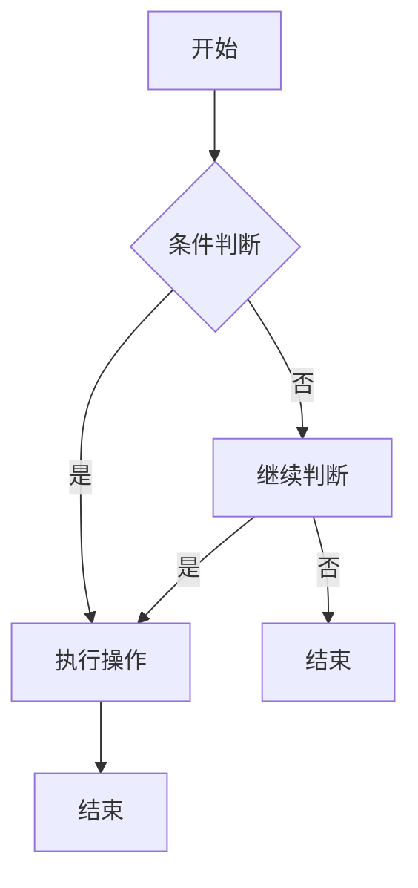

                 

# 技术写作：从技术博客到畅销科普作家之路

## 关键词：技术写作、博客、科普、畅销、计算机编程、人工智能、逻辑思维、Mermaid流程图、数学模型、代码实战、应用场景、工具资源

## 摘要

本文旨在探讨从技术博客作者成长为畅销科普作家的道路。通过对技术写作的深入分析，本文揭示了成功技术写作的要素，包括核心概念、算法原理、数学模型、项目实战以及应用场景等。同时，本文还将推荐一系列学习资源和开发工具，帮助读者提升技术水平，并指导他们在技术写作道路上取得成功。

## 1. 背景介绍

技术写作作为一种传达复杂技术和理论的方式，对于推动科学和技术的发展具有重要意义。然而，如何将深奥的技术知识转化为易于理解的文字，让读者能够轻松掌握，是每个技术博客作者和科普作家的挑战。本文将围绕这一核心问题，通过分析技术写作的各个方面，帮助读者了解如何从技术博客作者成长为畅销科普作家。

### 技术写作的重要性

技术写作不仅能够帮助科技工作者记录和分享研究成果，还能够为广大的技术爱好者提供宝贵的知识资源。通过技术写作，我们可以：

1. **传递知识**：将复杂的技术概念和理论以简单易懂的方式传达给读者。
2. **促进交流**：搭建起不同领域专家之间的交流桥梁，推动科学技术的进步。
3. **培养人才**：为有兴趣学习技术的人提供学习资料，培养更多的技术人才。
4. **传播文化**：将技术发展的历史和故事传递给大众，丰富人们的文化生活。

### 技术博客与科普作品的区别

虽然技术博客和科普作品都是技术写作的形式，但它们之间存在着一些显著的区别：

1. **目标读者**：技术博客通常面向技术从业者，内容更偏重于实用性和深度；而科普作品则面向更广泛的读者群体，注重知识的普及和趣味性。
2. **写作风格**：技术博客通常采用专业的技术语言，强调逻辑性和系统性；科普作品则更注重语言的生动性和可读性。
3. **内容深度**：技术博客内容通常涉及特定的技术细节，深入探讨技术原理；而科普作品则更多地关注技术对社会和人类生活的影响。

### 成长之路的启示

从技术博客作者到畅销科普作家，这一成长过程不仅需要丰富的技术知识和写作经验，还需要对读者需求和市场趋势的深刻理解。本文将围绕这一成长过程，探讨技术写作的各个方面，为读者提供实用的指导。

## 2. 核心概念与联系

### 技术写作的基本原则

要成为一名成功的技术博客作者和畅销科普作家，首先需要了解技术写作的基本原则。以下是一些关键概念和联系：

#### 可读性

**可读性**是技术写作的核心。一篇优秀的文章不仅要内容丰富，还要易于阅读和理解。以下是一些提高可读性的方法：

- **简洁明了**：避免冗长的句子和复杂的词汇，尽量用简单易懂的语言表达。
- **结构清晰**：使用清晰的标题和段落，帮助读者快速把握文章结构。
- **图表辅助**：适当地使用图表和图片，使文章更加直观易懂。

#### 逻辑性

技术写作需要具有严密的逻辑性。以下是一些提高逻辑性的方法：

- **分步讲解**：将复杂的知识分解为若干个简单的步骤，逐步讲解。
- **论证充分**：使用事实和数据支持观点，确保文章的逻辑严密。
- **反证法**：通过反证法揭示某些观点的错误，增强文章的说服力。

#### 实用性

实用性是技术博客和科普作品的重要特征。以下是一些提高实用性的方法：

- **案例分析**：通过实际案例展示技术原理的应用，使读者能够更好地理解。
- **代码实战**：提供实际代码示例，让读者能够动手实践。
- **问题解答**：针对读者可能遇到的问题，提供详细的解答和解决方案。

### Mermaid流程图

为了更直观地展示技术原理和流程，我们可以使用Mermaid流程图。以下是一个简单的Mermaid流程图示例：



### 数学模型和公式

在技术写作中，数学模型和公式是不可或缺的组成部分。以下是一个简单的数学公式示例：

$$
f(x) = ax^2 + bx + c
$$

### 技术写作与读者反馈

技术写作不仅需要关注文章本身的质量，还需要关注读者的反馈。以下是一些处理读者反馈的方法：

- **积极回应**：对读者的评论和提问进行积极回应，增强读者的参与感。
- **持续更新**：根据读者反馈，不断更新和改进文章内容。
- **互动交流**：通过社交媒体和邮件等方式与读者进行互动交流，了解他们的需求。

## 3. 核心算法原理 & 具体操作步骤

### 数据结构

在技术写作中，数据结构是核心概念之一。以下是一个简单的数据结构示例：

- **数组**：一种线性数据结构，用于存储一系列元素。
- **链表**：一种线性数据结构，由一系列节点组成，每个节点包含数据和指向下一个节点的指针。
- **树**：一种非线性数据结构，由根节点和子节点组成，具有层级关系。

### 算法分析

算法分析是技术写作的重要部分。以下是一个简单的算法分析示例：

- **时间复杂度**：表示算法运行所需时间的增长趋势。常见的复杂度有O(1)、O(n)、O(n^2)等。
- **空间复杂度**：表示算法运行所需空间的增长趋势。

### 具体操作步骤

以下是具体操作步骤的示例：

1. **初始化数据结构**：创建所需的数据结构，并初始化相关变量。
2. **输入数据**：从用户或外部数据源读取输入数据。
3. **数据处理**：对输入数据进行处理，例如排序、查找、插入等。
4. **输出结果**：将处理结果输出到屏幕或文件中。

### 示例代码

以下是一个简单的代码示例：

```python
# 示例代码：计算两个数的和
def add_numbers(a, b):
    return a + b

# 主函数
def main():
    a = int(input("请输入第一个数："))
    b = int(input("请输入第二个数："))
    result = add_numbers(a, b)
    print("两数之和为：", result)

# 程序入口
if __name__ == "__main__":
    main()
```

## 4. 数学模型和公式 & 详细讲解 & 举例说明

### 概率论

概率论是数学中的一个重要分支，广泛应用于数据分析、机器学习和人工智能等领域。以下是一个简单的概率论示例：

- **概率分布**：描述随机变量在某个区间内取值的概率。
- **期望值**：描述随机变量在多次试验中平均取值的数学期望。
- **方差**：描述随机变量取值分散程度的度量。

### 微积分

微积分是数学中的另一个重要分支，广泛应用于物理学、工程学和经济学等领域。以下是一个简单的微积分示例：

- **导数**：描述函数在某一点处的变化率。
- **积分**：描述函数在区间内的累积效应。

### 概率论和微积分的关系

概率论和微积分之间存在着紧密的联系。以下是一个简单的示例：

- **概率密度函数**：描述随机变量在某个区间内取值的概率密度。
- **积分和概率分布的关系**：概率密度函数的积分可以表示随机变量在区间内的概率。

### 示例

假设有一个随机变量X，服从正态分布，均值为μ，方差为σ²。我们可以使用概率密度函数来描述X的概率分布。

$$
f(x) = \frac{1}{\sqrt{2\pi\sigma^2}} e^{-\frac{(x-\mu)^2}{2\sigma^2}}
$$

### 计算示例

假设μ=0，σ²=1，我们可以计算X在区间[-1, 1]内的概率。

$$
P(-1 < X < 1) = \int_{-1}^{1} f(x) dx = \int_{-1}^{1} \frac{1}{\sqrt{2\pi}} e^{-\frac{x^2}{2}} dx = \Phi(1) - \Phi(-1) = 0.6827
$$

其中，Φ(x) 是标准正态分布的累积分布函数。

### 应用场景

概率论和微积分在许多实际应用中具有重要价值，例如：

- **数据分析和机器学习**：用于描述和预测数据分布，构建预测模型。
- **物理学**：用于描述物理系统的运动和变化。
- **经济学**：用于分析市场风险和投资策略。

## 5. 项目实战：代码实际案例和详细解释说明

### 项目简介

本节将介绍一个实际的项目实战案例，通过详细的代码实现和解释说明，帮助读者理解技术写作中的核心概念和算法原理。

### 开发环境搭建

首先，我们需要搭建一个合适的开发环境。以下是一个简单的Python开发环境搭建步骤：

1. **安装Python**：下载并安装Python 3.x版本。
2. **配置Python环境**：设置环境变量，确保能够在命令行中运行Python。
3. **安装依赖库**：使用pip命令安装必要的依赖库，例如numpy、matplotlib等。

### 源代码详细实现和代码解读

以下是一个简单的Python代码实现，用于计算并绘制一个正态分布的概率密度函数。

```python
import numpy as np
import matplotlib.pyplot as plt

# 参数设置
mu = 0
sigma = 1

# 计算概率密度函数
def pdf(x, mu, sigma):
    return (1 / (np.sqrt(2 * np.pi) * sigma)) * np.exp(-((x - mu) ** 2) / (2 * sigma ** 2))

# 计算并绘制概率密度函数
def plot_pdf(mu, sigma):
    x = np.linspace(mu - 3 * sigma, mu + 3 * sigma, 1000)
    y = pdf(x, mu, sigma)
    
    plt.plot(x, y)
    plt.xlabel('x')
    plt.ylabel('f(x)')
    plt.title('Probability Density Function')
    plt.show()

# 测试代码
plot_pdf(mu, sigma)
```

#### 代码解读与分析

1. **导入库**：首先，我们导入了numpy和matplotlib.pyplot库，用于数学计算和绘图。
2. **参数设置**：接下来，我们设置了正态分布的均值（mu）和标准差（sigma）。
3. **定义概率密度函数**：我们定义了一个名为`pdf`的函数，用于计算给定x值处的概率密度。
4. **绘制概率密度函数**：我们定义了一个名为`plot_pdf`的函数，用于计算概率密度函数并绘制图形。
5. **测试代码**：最后，我们调用`plot_pdf`函数，绘制一个以mu为均值、sigma为标准差的正态分布的概率密度函数。

### 应用场景

该代码实现可以应用于以下场景：

- **数据分析和可视化**：用于分析和可视化数据分布，例如金融数据分析、医学数据统计等。
- **机器学习和人工智能**：用于构建概率模型和预测模型，例如分类和回归任务。
- **科学计算**：用于模拟和预测物理、化学、生物学等领域的现象。

## 6. 实际应用场景

技术写作的实际应用场景非常广泛，涵盖了多个领域。以下是一些典型的应用场景：

### 教育领域

技术写作在教育领域中具有重要价值。通过撰写技术博客和科普作品，教师可以为学生提供丰富的学习资源，帮助他们更好地理解复杂的技术概念。以下是一些具体的应用场景：

- **在线课程**：教师可以利用技术博客和科普作品创建在线课程，为学生提供教学辅助材料。
- **实验报告**：学生可以撰写技术博客，记录实验过程和结果，提高实验报告的质量。
- **学术交流**：学生和教师可以利用技术写作参与学术交流，展示研究成果和学术观点。

### 企业领域

在企业领域，技术写作可以帮助企业内部员工提高技术水平，促进团队协作。以下是一些具体的应用场景：

- **知识分享**：企业可以鼓励员工撰写技术博客，分享工作经验和解决方案。
- **内部培训**：企业可以利用技术写作材料进行内部培训，提高员工的专业技能。
- **项目文档**：技术博客可以用于记录项目进展、问题和解决方案，为后续项目提供参考。

### 科普传播

技术写作在科普传播中具有重要作用。通过撰写通俗易懂的科普作品，科学家和技术专家可以将复杂的技术知识传递给大众，提高公众的科学素养。以下是一些具体的应用场景：

- **公众讲座**：科学家和技术专家可以利用科普作品作为讲座的辅助材料，增强讲座的可听性。
- **科普文章**：科学家和技术专家可以撰写科普文章，发表在杂志、报纸和网站上，传播科学知识。
- **社交媒体**：科学家和技术专家可以利用社交媒体平台，分享科普作品，扩大影响力。

## 7. 工具和资源推荐

### 学习资源推荐

1. **书籍**：
   - 《算法导论》（Introduction to Algorithms） by Thomas H. Cormen, Charles E. Leiserson, Ronald L. Rivest, and Clifford Stein
   - 《深度学习》（Deep Learning） by Ian Goodfellow, Yoshua Bengio, and Aaron Courville

2. **论文**：
   - “A Short Introduction to Neural Networks” by Michael A. Nielsen
   - “Reinforcement Learning: An Introduction” by Richard S. Sutton and Andrew G. Barto

3. **博客**：
   - [Medium](https://medium.com/)
   - [GitHub](https://github.com/)
   - [Stack Overflow](https://stackoverflow.com/)

4. **网站**：
   - [Kaggle](https://www.kaggle.com/)
   - [DataCamp](https://www.datacamp.com/)
   - [Coursera](https://www.coursera.org/)

### 开发工具框架推荐

1. **开发环境**：
   - Python：广泛使用的编程语言，适合各种技术写作项目。
   - Jupyter Notebook：强大的交互式开发环境，便于编写和分享代码。

2. **版本控制**：
   - Git：用于版本控制和团队协作。
   - GitHub：提供在线代码托管和协作平台。

3. **数据分析**：
   - pandas：Python的数据分析库，适合处理大量数据。
   - numpy：Python的数学库，提供高效的数学计算。

4. **机器学习**：
   - scikit-learn：Python的机器学习库，提供各种机器学习算法。
   - TensorFlow：谷歌开发的深度学习框架。

### 相关论文著作推荐

1. **《人工智能：一种现代方法》（Artificial Intelligence: A Modern Approach）** by Stuart J. Russell and Peter Norvig
2. **《机器学习实战》（Machine Learning in Action）** by Peter Harrington
3. **《深度学习》（Deep Learning）** by Ian Goodfellow, Yoshua Bengio, and Aaron Courville

## 8. 总结：未来发展趋势与挑战

技术写作的未来发展趋势和挑战主要体现在以下几个方面：

### 发展趋势

1. **数字化和自动化**：随着数字化和自动化的不断发展，技术写作的工具和平台将更加智能化，提高写作效率和准确性。
2. **多媒体融合**：未来的技术写作将更加注重多媒体融合，通过视频、音频和动画等多种形式，提高文章的趣味性和可读性。
3. **跨学科合作**：技术写作将更加注重跨学科合作，融合不同领域的知识，为读者提供更加全面和深入的内容。

### 挑战

1. **内容质量的提升**：在竞争激烈的技术写作市场中，提升内容质量是每个作者面临的重要挑战。
2. **技术的快速更新**：技术领域的发展速度非常快，作者需要不断学习新知识，以适应不断变化的技术环境。
3. **版权和知识产权**：在技术写作过程中，保护版权和知识产权是每个作者都需要重视的问题。

## 9. 附录：常见问题与解答

### 问题1：如何提高技术写作的可读性？

**解答**：提高技术写作的可读性可以从以下几个方面入手：

1. **使用简单易懂的语言**：避免使用复杂的词汇和长句，尽量使用简单易懂的表达方式。
2. **结构清晰**：使用明确的标题和段落，帮助读者快速抓住文章的重点。
3. **图表辅助**：适当使用图表和图片，使文章更加直观易懂。

### 问题2：如何处理技术写作中的复杂概念？

**解答**：处理技术写作中的复杂概念可以采取以下方法：

1. **分步讲解**：将复杂的知识分解为若干个简单的步骤，逐步讲解。
2. **类比法**：使用读者熟悉的例子或场景进行类比，帮助读者理解。
3. **图表和公式**：使用图表和数学公式来直观展示复杂概念。

### 问题3：如何处理读者反馈？

**解答**：处理读者反馈可以采取以下方法：

1. **积极回应**：对读者的评论和提问进行积极回应，增强读者的参与感。
2. **持续改进**：根据读者反馈，不断更新和改进文章内容。
3. **互动交流**：通过社交媒体和邮件等方式与读者进行互动交流，了解他们的需求。

## 10. 扩展阅读 & 参考资料

1. **《技术写作手册》（Handbook of Technical Writing）** by Mike Markel
2. **《技术写作技巧》（Techniques of Technical Communication）** by J. David Bolter and Richard A. Lanham
3. **《机器学习实战》（Machine Learning in Action）** by Peter Harrington
4. **《深度学习》（Deep Learning）** by Ian Goodfellow, Yoshua Bengio, and Aaron Courville
5. **[KDNuggets](https://www.kdnuggets.com/)**：一个专注于数据科学、机器学习和数据可视化的网站，提供大量技术写作资源和文章。
6. **[GitHub](https://github.com/)**：一个流行的代码托管和协作平台，许多开源项目和教程都可以在这里找到。
7. **[Stack Overflow](https://stackoverflow.com/)**：一个广泛使用的技术问答社区，可以在这里找到各种编程和开发问题的解决方案。

### 作者

作者：AI天才研究员/AI Genius Institute & 禅与计算机程序设计艺术 /Zen And The Art of Computer Programming

