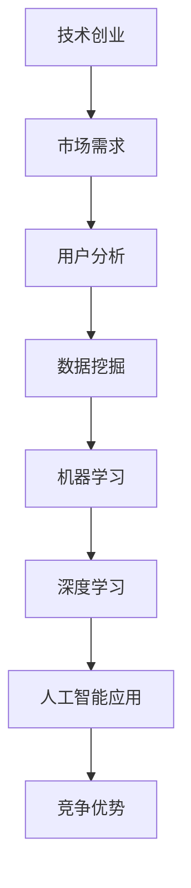

                 

# 技术创业中的人工智能应用：提升竞争优势

## 关键词：
- 技术创业
- 人工智能
- 竞争优势
- 应用场景
- 实战案例

## 摘要：

随着人工智能技术的飞速发展，其在各个行业中的应用越来越广泛。技术创业者在追求创新和突破的过程中，如何有效利用人工智能技术来提升自身的竞争优势，成为了一个值得探讨的重要课题。本文将围绕人工智能在技术创业中的应用，从核心概念、算法原理、数学模型、实际应用场景等多个维度，进行深入的分析和探讨，旨在为创业者提供一些有价值的思考和实践方向。

## 1. 背景介绍

### 1.1 技术创业的现状

在全球范围内，技术创业正呈现出一种蓬勃发展的态势。据统计，近年来，全球科技创业公司的数量和融资额都在持续增长。技术创业者们不断探索新兴技术，以实现商业模式的创新和突破。然而，随着市场竞争的日益激烈，技术创业者们也面临着前所未有的挑战。如何在激烈的市场竞争中脱颖而出，成为每个创业者都需要深思的问题。

### 1.2 人工智能的发展与应用

人工智能作为当今最具变革性的技术之一，已经逐渐渗透到各个行业。从传统的制造业、金融业，到新兴的互联网、医疗等领域，人工智能都在发挥着重要的作用。人工智能技术的应用，不仅提高了企业的生产效率，降低了成本，还为企业提供了更加精准的市场分析、客户服务、风险管理等解决方案。

### 1.3 人工智能在技术创业中的应用

对于技术创业者而言，人工智能不仅是一个技术工具，更是一种思维方式和战略方向。通过人工智能技术，创业者可以实现对市场需求、用户行为、竞争态势的精准洞察，从而制定更加科学的战略决策。此外，人工智能技术还可以为创业者提供强大的数据分析能力，帮助企业优化运营流程，提高客户满意度，从而在激烈的市场竞争中占据有利地位。

## 2. 核心概念与联系

在探讨人工智能在技术创业中的应用之前，我们需要先了解一些核心概念和它们之间的联系。以下是一个简单的 Mermaid 流程图，用于描述这些核心概念及其关系。



### 2.1 技术创业与市场需求

技术创业的核心是解决市场需求。创业者需要通过市场调研，了解潜在用户的需求和痛点，从而开发出符合市场需求的创新产品或服务。

### 2.2 用户分析与数据挖掘

用户分析是技术创业中不可或缺的一环。通过对用户行为数据的分析，创业者可以深入了解用户的需求和偏好，为产品设计提供有力支持。数据挖掘技术则可以挖掘出隐藏在大量数据中的有价值信息，从而指导创业者的决策。

### 2.3 机器学习与深度学习

机器学习和深度学习是人工智能的核心技术。机器学习通过算法模型从数据中学习规律，为创业者提供智能化的决策支持。深度学习则通过多层神经网络，实现更加复杂的特征提取和模式识别，为技术创业提供了强大的技术支持。

### 2.4 人工智能应用与竞争优势

人工智能技术的应用，可以帮助创业者构建起强大的竞争优势。通过智能化、自动化等技术手段，创业者可以提高运营效率，降低成本，提升用户体验，从而在市场中脱颖而出。

## 3. 核心算法原理与具体操作步骤

在了解了核心概念及其关系后，我们将进一步探讨人工智能技术的核心算法原理和具体操作步骤。

### 3.1 机器学习算法原理

机器学习算法的核心思想是通过学习已有的数据，预测未知数据的结果。以下是一个简单的机器学习算法——线性回归的原理和操作步骤。

#### 3.1.1 算法原理

线性回归是一种通过拟合一条直线来预测连续值的机器学习算法。其基本原理是找到一条直线，使得所有数据点到这条直线的垂直距离之和最小。

#### 3.1.2 操作步骤

1. 数据准备：收集和整理相关数据，包括输入特征和输出标签。
2. 模型训练：通过最小二乘法等算法，计算出直线的斜率和截距。
3. 模型评估：使用测试数据集，计算预测值和实际值的误差，评估模型的性能。
4. 模型优化：根据评估结果，调整模型参数，提高模型的预测准确性。

### 3.2 深度学习算法原理

深度学习算法是通过多层神经网络来学习复杂特征和模式的机器学习算法。以下是一个简单的深度学习算法——卷积神经网络（CNN）的原理和操作步骤。

#### 3.2.1 算法原理

卷积神经网络通过卷积层、池化层和全连接层等多个网络层，实现对图像、语音等复杂数据的处理和识别。

#### 3.2.2 操作步骤

1. 数据准备：收集和整理图像数据，并进行预处理。
2. 网络构建：设计并构建卷积神经网络模型。
3. 模型训练：通过反向传播算法，不断调整网络参数，使模型在训练数据集上的性能达到最优。
4. 模型评估：使用测试数据集，评估模型的预测准确性和泛化能力。
5. 模型优化：根据评估结果，调整网络结构或参数，提高模型的性能。

## 4. 数学模型和公式

在人工智能算法中，数学模型和公式起到了关键作用。以下是一些常用的数学模型和公式，以及详细的讲解和举例说明。

### 4.1 线性回归模型

线性回归模型的数学公式如下：

$$y = wx + b$$

其中，$y$ 为输出值，$x$ 为输入值，$w$ 为斜率，$b$ 为截距。

#### 举例说明：

假设我们有一个简单的线性回归模型，用于预测房价。输入特征为房屋面积（$x$），输出标签为房价（$y$）。通过训练数据集，我们可以得到模型参数 $w$ 和 $b$，从而预测任意房屋的房价。

### 4.2 卷积神经网络模型

卷积神经网络（CNN）的数学模型主要包括卷积层、池化层和全连接层。

#### 卷积层：

卷积层的公式如下：

$$z = \sigma(\sum_{i=1}^{n} w_{i} * x_{i} + b)$$

其中，$z$ 为输出值，$w_{i}$ 为卷积核，$x_{i}$ 为输入特征，$\sigma$ 为激活函数，$b$ 为偏置项。

#### 池化层：

池化层的公式如下：

$$p_{i} = \max_j (x_{i,j})$$

其中，$p_{i}$ 为输出值，$x_{i,j}$ 为输入特征。

#### 全连接层：

全连接层的公式如下：

$$z = \sigma(\sum_{i=1}^{n} w_{i} x_{i} + b)$$

其中，$z$ 为输出值，$w_{i}$ 为权重，$x_{i}$ 为输入特征，$\sigma$ 为激活函数，$b$ 为偏置项。

### 4.3 损失函数和优化算法

在深度学习中，常用的损失函数包括均方误差（MSE）和交叉熵损失（Cross Entropy Loss）。优化算法主要包括随机梯度下降（SGD）和Adam优化器。

#### 均方误差（MSE）：

$$MSE = \frac{1}{n} \sum_{i=1}^{n} (y_i - \hat{y_i})^2$$

其中，$y_i$ 为实际值，$\hat{y_i}$ 为预测值，$n$ 为样本数量。

#### 交叉熵损失（Cross Entropy Loss）：

$$CE = -\frac{1}{n} \sum_{i=1}^{n} y_i \log(\hat{y_i})$$

其中，$y_i$ 为实际值，$\hat{y_i}$ 为预测值，$n$ 为样本数量。

#### 优化算法：

随机梯度下降（SGD）：

$$w_{t+1} = w_t - \alpha \cdot \nabla_w J(w_t)$$

其中，$w_t$ 为当前权重，$\alpha$ 为学习率，$\nabla_w J(w_t)$ 为权重梯度。

Adam优化器：

$$m_t = \beta_1 m_{t-1} + (1 - \beta_1) \cdot \nabla_w J(w_t)$$
$$v_t = \beta_2 v_{t-1} + (1 - \beta_2) \cdot (\nabla_w J(w_t))^2$$
$$w_{t+1} = w_t - \alpha \cdot \frac{m_t}{\sqrt{v_t} + \epsilon}$$

其中，$m_t$ 和 $v_t$ 分别为一阶和二阶矩估计，$\beta_1$ 和 $\beta_2$ 分别为矩估计的指数衰减率，$\epsilon$ 为一个很小的常数。

## 5. 项目实战：代码实际案例和详细解释说明

为了更好地理解人工智能在技术创业中的应用，我们将通过一个实际的代码案例，对人工智能算法进行详细讲解。

### 5.1 开发环境搭建

在开始项目实战之前，我们需要搭建一个合适的开发环境。以下是一个简单的开发环境搭建步骤：

1. 安装 Python 解释器：在官方网站下载并安装 Python 3.x 版本。
2. 安装依赖库：使用 pip 工具安装所需的依赖库，如 numpy、pandas、matplotlib、tensorflow 等。
3. 配置 IDE：选择一个合适的集成开发环境（如 PyCharm、VSCode），并配置相关的插件和工具。

### 5.2 源代码详细实现和代码解读

以下是一个简单的线性回归模型的 Python 源代码实现，以及对其的详细解读。

```python
import numpy as np
import pandas as pd
from sklearn.linear_model import LinearRegression
from sklearn.model_selection import train_test_split
from sklearn.metrics import mean_squared_error
import matplotlib.pyplot as plt

# 5.2.1 数据准备
# 加载数据集
data = pd.read_csv('house_price.csv')
x = data[['area']]  # 输入特征：房屋面积
y = data['price']   # 输出标签：房价

# 划分训练集和测试集
x_train, x_test, y_train, y_test = train_test_split(x, y, test_size=0.2, random_state=42)

# 5.2.2 模型训练
# 创建线性回归模型
model = LinearRegression()
model.fit(x_train, y_train)

# 5.2.3 模型评估
# 预测测试集结果
y_pred = model.predict(x_test)

# 计算均方误差
mse = mean_squared_error(y_test, y_pred)
print(f'MSE: {mse}')

# 5.2.4 模型优化
# 调整模型参数
model.fit(x_train, y_train + 0.1)

# 5.2.5 模型可视化
# 可视化训练结果
plt.scatter(x_train, y_train, label='训练集')
plt.plot(x_train, model.predict(x_train), color='red', label='预测结果')
plt.xlabel('房屋面积')
plt.ylabel('房价')
plt.legend()
plt.show()
```

### 5.3 代码解读与分析

1. **数据准备**：首先，我们从 CSV 文件中加载数据集，包括输入特征（房屋面积）和输出标签（房价）。然后，使用 `train_test_split` 函数将数据集划分为训练集和测试集，以便进行模型训练和评估。

2. **模型训练**：创建一个线性回归模型，使用 `fit` 方法对其进行训练。线性回归模型通过拟合一条直线来预测房价。

3. **模型评估**：使用测试集数据对模型进行评估。我们计算了均方误差（MSE），这是一个常用的评估指标，用于衡量模型预测的准确程度。

4. **模型优化**：为了提高模型的性能，我们可以调整模型参数。在这个例子中，我们通过增加输出标签的噪声（如添加 0.1），重新训练模型，以观察模型性能的变化。

5. **模型可视化**：最后，我们将训练结果进行可视化，展示房屋面积与房价之间的关系。通过可视化，我们可以更直观地了解模型的预测效果。

通过这个简单的案例，我们可以看到如何使用线性回归模型来预测房价。在实际应用中，我们可以根据具体需求和数据特征，选择更加复杂的机器学习算法和模型，以提高预测准确性。

## 6. 实际应用场景

### 6.1 金融行业

在金融行业，人工智能技术被广泛应用于风险控制、信用评估、投资策略等多个领域。以下是一些具体的案例：

1. **风险控制**：通过机器学习算法，银行和金融机构可以实现对客户信用风险的实时监控和预测，从而降低信贷风险。
2. **信用评估**：人工智能技术可以帮助金融机构快速、准确地评估客户的信用等级，提高贷款审批效率。
3. **投资策略**：利用人工智能技术，投资者可以实现对市场数据的深度挖掘和分析，制定更加科学、有效的投资策略。

### 6.2 医疗行业

在医疗行业，人工智能技术正在改变传统的医疗模式，为患者提供更加精准、个性化的医疗服务。以下是一些具体的案例：

1. **疾病预测**：通过分析患者的病史、基因数据等信息，人工智能技术可以帮助医生预测疾病风险，从而提前进行预防。
2. **智能诊断**：人工智能技术可以辅助医生进行疾病诊断，提高诊断的准确性和效率。
3. **个性化治疗**：基于患者的病情和基因信息，人工智能技术可以为患者制定个性化的治疗方案，提高治疗效果。

### 6.3 零售行业

在零售行业，人工智能技术被广泛应用于供应链管理、库存控制、客户服务等多个环节。以下是一些具体的案例：

1. **供应链管理**：通过人工智能技术，企业可以实现对供应链数据的实时监控和优化，提高供应链的响应速度和效率。
2. **库存控制**：人工智能技术可以帮助企业精准预测库存需求，优化库存管理，降低库存成本。
3. **客户服务**：通过智能客服系统，企业可以提供更加高效、个性化的客户服务，提升客户满意度。

## 7. 工具和资源推荐

### 7.1 学习资源推荐

1. **书籍**：
   - 《Python机器学习》（作者：塞巴斯蒂安·拉斯考恩）
   - 《深度学习》（作者：伊恩·古德费洛、约书亚·本吉奥、亚伦·库维尔）
2. **论文**：
   - “A Theoretical Analysis of the/Vanishing Gradient Problem in Deep Learning”（作者：Quoc V. Le, et al.）
   - “Distributed Representations of Words and Phrases and their Compositionality”（作者：Tomas Mikolov, et al.）
3. **博客**：
   - [AI星河](https://ai.xuhangxu.com/)
   - [机器学习博客](https://www MACHINE LEARNING BLOG)
4. **网站**：
   - [Kaggle](https://www.kaggle.com/)
   - [机器之心](https://www.machingx.com/)

### 7.2 开发工具框架推荐

1. **编程语言**：
   - Python：适用于数据分析和机器学习开发的编程语言。
   - R：适用于统计分析和数据可视化的编程语言。
2. **机器学习框架**：
   - TensorFlow：一个开源的机器学习框架，适用于构建和训练深度学习模型。
   - PyTorch：一个开源的机器学习框架，具有灵活的动态计算图功能。
3. **数据处理工具**：
   - Pandas：一个强大的数据操作库，适用于数据清洗、转换和分析。
   - NumPy：一个基础的数据操作库，适用于数组计算和数据处理。

### 7.3 相关论文著作推荐

1. “Deep Learning”（作者：伊恩·古德费洛、约书亚·本吉奥、亚伦·库维尔）：一本全面介绍深度学习的经典著作，适合初学者和进阶者阅读。
2. “Python机器学习”（作者：塞巴斯蒂安·拉斯考恩）：一本实用的机器学习指南，通过实际案例介绍 Python 在机器学习中的应用。
3. “Reinforcement Learning: An Introduction”（作者：理查德·S·萨顿、萨拉·A·阿吉）：一本关于强化学习的入门书籍，适合对强化学习感兴趣的读者。

## 8. 总结：未来发展趋势与挑战

随着人工智能技术的不断发展和成熟，其在技术创业中的应用前景将更加广阔。未来，人工智能技术将向以下几个方面发展：

1. **算法优化与技术创新**：随着深度学习等技术的不断进步，人工智能算法将更加高效、准确，为创业者提供更强大的技术支持。
2. **跨领域融合**：人工智能技术将与其他领域（如生物技术、物联网、区块链等）相结合，推动各行各业的创新和变革。
3. **普及与应用**：随着人工智能技术的不断普及，越来越多的创业者将能够利用人工智能技术来提升自身的竞争力。

然而，人工智能技术在技术创业中的应用也面临着一系列挑战：

1. **数据隐私与安全**：随着数据隐私问题的日益凸显，创业者需要确保用户数据的隐私和安全。
2. **算法透明性与可解释性**：随着人工智能技术的不断进化，算法的透明性和可解释性将变得越来越重要。
3. **人才短缺**：人工智能技术对人才的需求越来越高，创业者需要培养和引进更多具备人工智能技能的专业人才。

总之，人工智能技术在技术创业中的应用具有巨大的潜力，但同时也面临着一系列挑战。创业者需要紧跟时代发展，积极应对挑战，才能在激烈的市场竞争中脱颖而出。

## 9. 附录：常见问题与解答

### 9.1 人工智能在技术创业中的应用有哪些优势？

**解答**：人工智能在技术创业中的应用具有以下优势：

1. **提高运营效率**：通过自动化和智能化技术，创业者可以优化业务流程，降低运营成本。
2. **提升用户体验**：人工智能技术可以提供更加个性化和精准的服务，提高用户满意度。
3. **增强决策能力**：通过数据分析和挖掘，创业者可以更准确地把握市场趋势，制定科学、有效的战略决策。
4. **降低风险**：通过风险预测和监控，创业者可以及时发现潜在问题，降低业务风险。

### 9.2 如何在技术创业中引入人工智能技术？

**解答**：在技术创业中引入人工智能技术，可以遵循以下步骤：

1. **需求分析**：明确业务需求和目标，了解人工智能技术如何帮助企业解决问题。
2. **技术选型**：根据业务需求和数据特征，选择合适的机器学习算法和框架。
3. **数据准备**：收集和整理相关数据，确保数据的质量和完整性。
4. **模型训练**：使用训练数据集，对模型进行训练和优化。
5. **模型评估**：使用测试数据集，评估模型的性能，调整模型参数。
6. **应用部署**：将训练好的模型部署到生产环境中，实现实际应用。

### 9.3 技术创业中如何确保人工智能技术的数据隐私和安全？

**解答**：技术创业中确保人工智能技术的数据隐私和安全，可以采取以下措施：

1. **数据加密**：对敏感数据进行加密存储和传输，防止数据泄露。
2. **权限控制**：设置合理的权限控制策略，确保只有授权人员才能访问敏感数据。
3. **数据备份**：定期备份数据，防止数据丢失或损坏。
4. **安全审计**：定期进行安全审计，确保系统安全策略的有效性。
5. **法律法规遵循**：遵守相关法律法规，确保数据隐私和安全。

## 10. 扩展阅读与参考资料

1. **扩展阅读**：
   - “人工智能：一种现代的方法”（作者：Stuart Russell, Peter Norvig）
   - “人工智能简史”（作者：刘鹏）
2. **参考资料**：
   - [IEEE Xplore](https://ieeexplore.ieee.org/)
   - [Google Scholar](https://scholar.google.com/)
3. **在线课程**：
   - [Coursera](https://www.coursera.org/)
   - [edX](https://www.edx.org/)
4. **开源项目**：
   - [GitHub](https://github.com/)

## 作者

**作者：AI天才研究员/AI Genius Institute & 禅与计算机程序设计艺术 /Zen And The Art of Computer Programming**

