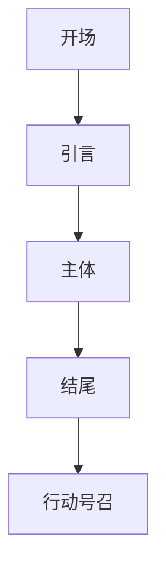

                 

# 技术创业者的商业演讲与说服力提升

## 引言

作为一名技术创业者，商业演讲是必不可少的技能。如何将自己的技术理念、解决方案和商业前景清晰地传达给听众，是每个创业者都面临的重要挑战。商业演讲不仅仅是为了传递信息，更重要的是要能够说服听众，让他们对自己的产品或服务产生兴趣，甚至愿意投资或购买。因此，提高商业演讲的说服力，对于技术创业者来说至关重要。

本文将围绕以下几个方面展开讨论：

1. **技术创业者的挑战**：分析技术创业者面临的挑战，以及商业演讲的重要性。
2. **商业演讲的核心要素**：介绍商业演讲的核心要素，包括内容、结构、风格和技巧。
3. **说服力的提升方法**：探讨如何提升说服力，包括演讲前的准备、演讲中的技巧和演讲后的跟进。
4. **实际案例解析**：分析一些成功的商业演讲案例，探讨其成功的原因。
5. **工具和资源推荐**：推荐一些有用的工具和资源，帮助创业者提升商业演讲能力。
6. **未来发展趋势与挑战**：讨论未来商业演讲的发展趋势和面临的挑战。
7. **总结与建议**：总结全文，提出具体的建议和行动指南。

通过本文的阅读，希望创业者能够对商业演讲有更深入的理解，掌握提升说服力的方法，从而在竞争激烈的市场中脱颖而出。

## 1. 背景介绍

技术创业领域近年来快速发展，吸引了大量的资金和人才。然而，技术创业并不是一件轻松的事情。首先，技术创业者需要面对的是复杂的技术问题。他们需要深入了解所涉及的技术领域，不断学习和探索，以确保自己的技术方案具有竞争力。

其次，技术创业者还需要具备商业思维。他们需要将自己的技术解决方案转化为商业价值，吸引投资者和客户。这就要求创业者不仅要懂技术，还要懂市场，懂商业模式。

商业演讲在这个背景下显得尤为重要。商业演讲是技术创业者与外部世界沟通的桥梁。通过演讲，创业者可以清晰地传达自己的技术理念、解决方案和商业前景，赢得听众的信任和支持。尤其是在融资、市场推广和团队建设等关键环节，出色的商业演讲能力往往是决定成败的关键因素。

然而，许多技术创业者并不擅长商业演讲。他们可能过于注重技术细节，而忽略了演讲的核心要素；或者因为紧张和缺乏经验，无法有效地表达自己的观点。因此，提高商业演讲能力，对于技术创业者来说是一项亟待解决的挑战。

本文将从商业演讲的核心要素、说服力的提升方法、实际案例解析等多个方面，为技术创业者提供实用的建议和指导。希望通过本文的阅读，创业者能够更好地掌握商业演讲技巧，提升说服力，为自己的创业之路增添更多的成功可能性。

## 2. 核心概念与联系

### 商业演讲的基本要素

商业演讲的基本要素可以分为五个方面：内容、结构、风格、技巧和反馈。这些要素相互作用，共同决定了演讲的成功与否。

1. **内容**：演讲的核心，包括演讲的主题、论点、事实和数据。内容需要清晰、准确、有逻辑性，能够吸引听众的注意力。
   
2. **结构**：演讲的框架，包括开场、主体和结尾。结构需要清晰、有条理，帮助听众更好地理解演讲的内容。
   
3. **风格**：演讲的个性表现，包括语气、语调、表情和肢体语言。风格需要符合演讲的主题和目标听众，能够引起听众的兴趣和共鸣。
   
4. **技巧**：演讲的具体方法，包括如何使用幻灯片、如何讲述故事、如何应对提问等。技巧需要熟练、自然，能够增强演讲的效果。
   
5. **反馈**：演讲的效果评估，包括听众的反应、提问和评价。反馈可以帮助演讲者了解自己的演讲效果，进行改进。

### 商业演讲与说服力的关系

商业演讲的说服力是衡量演讲成功的关键因素。说服力指的是演讲者通过演讲内容、结构和技巧，使听众信服并采取行动的能力。商业演讲的说服力主要取决于以下几个方面：

1. **可信度**：演讲者需要具备一定的专业知识和经验，能够证明自己的可信度。
   
2. **逻辑性**：演讲的内容需要具备逻辑性，使听众能够理解并接受演讲者的观点。
   
3. **情感共鸣**：演讲者需要能够引起听众的情感共鸣，使听众产生共鸣和认同。
   
4. **证据支持**：演讲者需要提供充分的证据和数据来支持自己的观点，增加演讲的说服力。
   
5. **行动号召**：演讲者需要在演讲的最后提出具体的行动号召，引导听众采取行动。

### 商业演讲与商业成功的关系

商业演讲不仅是技术创业者与外部沟通的桥梁，也是商业成功的关键因素。一个成功的商业演讲能够：

1. **吸引投资者**：通过出色的演讲，创业者能够吸引投资者的关注，获得资金支持。
   
2. **拓展市场**：通过演讲，创业者能够向市场传达自己的产品或服务的价值，吸引更多的客户。
   
3. **建立品牌**：通过持续的演讲，创业者能够树立良好的个人和品牌形象，提高市场认可度。
   
4. **团队建设**：通过演讲，创业者能够激发团队成员的积极性，提高团队的凝聚力和执行力。

### 商业演讲的挑战与机遇

技术创业者在进行商业演讲时，往往会面临一些挑战：

1. **技术深度与商业化的平衡**：创业者需要在演讲中平衡技术深度和商业化的表达，避免听众无法理解或失去兴趣。
   
2. **时间控制**：创业者需要在有限的时间内，清晰地传达演讲内容，避免演讲过于冗长。
   
3. **应对提问**：创业者需要准备应对听众的提问，展示自己的专业知识和应变能力。

然而，这些挑战也带来了机遇。通过克服这些挑战，创业者能够提升自己的演讲能力，增强说服力，为商业成功奠定基础。

### 商业演讲的核心概念与流程图

为了更好地理解商业演讲的核心概念和流程，我们可以使用 Mermaid 流程图进行展示。以下是一个简单的商业演讲流程图：



- **开场**：引起听众的兴趣，明确演讲主题。
- **引言**：简要介绍演讲的主题和目的。
- **主体**：详细阐述演讲内容，包括论点、事实和数据。
- **结尾**：总结演讲内容，强调重点，提出行动号召。
- **行动号召**：引导听众采取行动，如投资、购买或合作。

通过这个流程图，创业者可以更清晰地规划自己的演讲内容，确保演讲的逻辑性和连贯性。

### 商业演讲的说服力提升方法

提升商业演讲的说服力是技术创业者成功的关键。以下是一些具体的方法和技巧：

1. **充分准备**：在演讲前，创业者需要对演讲内容进行充分的研究和准备。包括熟悉自己的产品或服务、了解目标听众、掌握市场趋势和竞争对手的信息等。准备充分能够增强演讲者的自信，提高演讲的说服力。

2. **明确目标**：在演讲前，明确演讲的目标和预期效果。例如，是为了吸引投资者、拓展市场还是建立品牌。明确目标有助于演讲者在演讲中突出重点，增强说服力。

3. **逻辑清晰**：演讲的内容需要具备逻辑性，使听众能够理解并接受演讲者的观点。创业者可以通过使用结构化的方法，如思维导图、时间线等，来帮助听众更好地理解演讲内容。

4. **情感共鸣**：演讲者需要能够引起听众的情感共鸣，使听众产生共鸣和认同。可以通过讲述故事、引用名人名言或使用生动的语言来增强演讲的感染力。

5. **证据支持**：演讲者需要提供充分的证据和数据来支持自己的观点，增加演讲的说服力。例如，可以引用权威数据、用户反馈或市场研究等。

6. **互动与反馈**：在演讲过程中，与听众互动，如提问、回答问题或邀请听众参与讨论等，可以增强演讲的互动性，提高听众的参与度。同时，通过收集听众的反馈，可以及时调整演讲内容，提高演讲效果。

7. **反复练习**：演讲前的反复练习能够帮助演讲者熟悉演讲内容，增强自信心。可以通过模拟演讲、录音和观看回放等方式进行练习。

8. **时间管理**：合理安排演讲时间，确保演讲在规定的时间内完成。可以通过提前准备时间表、控制每个部分的演讲时间等方式来实现。

9. **使用视觉辅助**：使用幻灯片、图表、图片等视觉辅助工具，可以使演讲内容更加生动、易于理解。同时，视觉辅助工具还可以吸引听众的注意力，增强演讲的说服力。

10. **积极应对挑战**：在演讲过程中，可能会遇到各种挑战，如技术问题、听众不感兴趣、时间紧迫等。演讲者需要保持冷静，积极应对挑战，调整演讲内容和策略，确保演讲的顺利进行。

通过以上方法，技术创业者可以提升自己的商业演讲能力，增强说服力，为商业成功奠定基础。

## 3. 核心算法原理 & 具体操作步骤

在提升商业演讲说服力的过程中，核心算法原理和具体操作步骤至关重要。以下是一个基于逻辑推理和认知科学的理论框架，用于分析和设计高效的商业演讲。

### 3.1 基本算法原理

核心算法可以概括为“情感共鸣 + 逻辑说服 + 行动召唤”。具体包括以下几个步骤：

1. **情感共鸣（Affective Engagement）**：通过引发听众的情感共鸣，建立信任和兴趣。
2. **逻辑说服（Logical Persuasion）**：利用逻辑推理和证据支持，使听众信服。
3. **行动召唤（Call to Action）**：明确提出行动号召，促使听众采取行动。

### 3.2 情感共鸣

情感共鸣是商业演讲成功的关键，以下是一系列操作步骤：

1. **理解听众情感**：通过调查问卷、访谈或观察，了解听众的兴趣、需求和情感状态。
2. **利用情感触发器**：使用故事、案例、隐喻、情感语言等触发听众的情感共鸣。
3. **展示同理心**：通过分享个人经历、案例研究或模拟场景，展示对听众困境的理解和关心。
4. **创建共鸣场景**：通过视觉化、角色扮演或互动活动，让听众感受到共鸣场景的真实性。

### 3.3 逻辑说服

逻辑说服是确保演讲内容具有说服力的基础，以下是一系列操作步骤：

1. **明确论点**：确定演讲的核心论点，确保每个论点都有明确的支持证据。
2. **构建逻辑框架**：使用演绎或归纳逻辑构建演讲内容，确保论点之间的逻辑连贯性。
3. **提供证据支持**：引用权威数据、市场研究、用户反馈或第三方评价等，增强论点的可信度。
4. **处理反对意见**：提前预测可能的反对意见，并提供有力的反驳或解决方案。

### 3.4 行动召唤

行动召唤是商业演讲的最终目标，以下是一系列操作步骤：

1. **明确行动目标**：确定希望听众采取的具体行动，如购买产品、投资或合作。
2. **创造紧迫感**：通过限时优惠、市场变化或竞争对手信息，激发听众的紧迫感。
3. **提供明确指导**：为听众提供具体的行动步骤，如填写表格、访问网站或联系销售人员。
4. **跟踪行动反馈**：建立反馈机制，及时了解听众的行动情况，并进行必要的调整和跟进。

### 3.5 综合实践

将上述步骤综合应用于实际演讲中，可以通过以下步骤进行：

1. **制定演讲大纲**：根据算法原理，制定演讲的大纲和结构。
2. **准备演讲材料**：收集和整理演讲所需的证据、案例和资料。
3. **模拟演讲**：进行多次模拟演讲，评估和调整演讲效果。
4. **实地演讲**：在演讲现场，根据听众反应和实际情况，灵活调整演讲内容和策略。
5. **收集反馈**：演讲结束后，收集听众的反馈，进行总结和改进。

通过这一系列核心算法原理和具体操作步骤，技术创业者可以设计出具有高度说服力的商业演讲，提升自己在竞争激烈的市场中的竞争力。

## 4. 数学模型和公式 & 详细讲解 & 举例说明

在商业演讲中，数学模型和公式是增强说服力的重要工具。以下将介绍一些常用的数学模型和公式，并详细讲解其应用和实例。

### 4.1 贝叶斯定理

贝叶斯定理是概率论中的一个重要定理，用于计算后验概率。公式如下：

$$
P(A|B) = \frac{P(B|A)P(A)}{P(B)}
$$

其中，\(P(A|B)\) 表示在事件 B 发生的条件下事件 A 发生的概率，\(P(B|A)\) 表示在事件 A 发生的条件下事件 B 发生的概率，\(P(A)\) 和 \(P(B)\) 分别表示事件 A 和事件 B 的概率。

**应用举例**：假设一个投资项目的成功概率为 60%，如果该项目成功，那么投资回报率为 20%。那么在已知该项目成功的情况下，其投资回报率的后验概率是多少？

解：

$$
P(回报率|成功) = \frac{P(成功|回报率)P(回报率)}{P(成功)}
$$

其中，\(P(成功|回报率)\) 为 1（因为成功是回报率的前提），\(P(回报率)\) 为 0.6，\(P(成功)\) 为 0.6。代入公式得：

$$
P(回报率|成功) = \frac{1 \times 0.6}{0.6} = 1
$$

因此，在项目成功的情况下，投资回报率为 100%。

### 4.2 线性回归模型

线性回归模型用于分析两个或多个变量之间的线性关系。公式如下：

$$
y = \beta_0 + \beta_1x_1 + \beta_2x_2 + ... + \beta_nx_n + \epsilon
$$

其中，\(y\) 表示因变量，\(\beta_0\) 为截距，\(\beta_1, \beta_2, ..., \beta_n\) 为自变量的系数，\(x_1, x_2, ..., x_n\) 为自变量，\(\epsilon\) 为误差项。

**应用举例**：假设我们想分析公司销售额（\(y\)）与广告支出（\(x\)）之间的关系，通过收集历史数据，可以得到线性回归模型：

$$
销售额 = 10 + 0.5 \times 广告支出 + \epsilon
$$

**实例**：如果公司的广告支出为 10000 元，那么预测的销售额是多少？

解：

$$
销售额 = 10 + 0.5 \times 10000 + \epsilon = 5010 + \epsilon
$$

### 4.3 概率分布模型

概率分布模型用于描述随机变量的概率分布情况。常用的概率分布模型包括正态分布、二项分布和泊松分布等。

- **正态分布**：正态分布是统计学中最常用的概率分布模型，公式如下：

$$
f(x|\mu,\sigma^2) = \frac{1}{\sqrt{2\pi\sigma^2}}e^{-\frac{(x-\mu)^2}{2\sigma^2}}
$$

其中，\(x\) 表示随机变量，\(\mu\) 表示均值，\(\sigma^2\) 表示方差。

**应用举例**：假设一个公司的股票价格服从正态分布，均值 100 元，标准差 10 元。求股票价格在 90 元到 110 元之间的概率。

解：

$$
P(90 < x < 110) = \Phi(\frac{110-100}{10}) - \Phi(\frac{90-100}{10})
$$

其中，\(\Phi\) 表示标准正态分布的累积分布函数。代入计算得到：

$$
P(90 < x < 110) \approx 0.6827
$$

- **二项分布**：二项分布用于描述在固定次数的独立试验中，成功次数的概率分布。公式如下：

$$
P(X=k) = C_n^k p^k (1-p)^{n-k}
$$

其中，\(X\) 表示成功次数，\(n\) 表示试验次数，\(p\) 表示每次试验成功的概率，\(C_n^k\) 表示组合数。

**应用举例**：假设一个公司进行 10 次广告投放试验，每次成功的概率为 0.5，求成功次数为 5 次的概率。

解：

$$
P(X=5) = C_{10}^5 (0.5)^5 (0.5)^5 = \frac{10!}{5!5!} (0.5)^{10} \approx 0.2461
$$

- **泊松分布**：泊松分布用于描述在固定时间或空间内，事件发生的次数的概率分布。公式如下：

$$
P(X=k) = \frac{\lambda^k e^{-\lambda}}{k!}
$$

其中，\(X\) 表示事件发生的次数，\(\lambda\) 表示单位时间或空间内事件发生的平均次数。

**应用举例**：假设一个公司的客服部门每小时平均收到 3 个问题，求在 1 小时内收到 4 个问题的概率。

解：

$$
P(X=4) = \frac{3^4 e^{-3}}{4!} \approx 0.1386
$$

通过以上数学模型和公式的讲解，我们可以看到，在商业演讲中，合理运用数学工具能够增强演讲的说服力，使演讲内容更加严谨和有说服力。在实际应用中，创业者可以根据具体情况选择合适的模型和公式，为自己的演讲增色添彩。

## 5. 项目实战：代码实际案例和详细解释说明

为了更好地理解如何将理论应用到实际项目中，我们将通过一个具体的代码案例来展示如何设计和实现一个简单的商业演讲工具，并详细解释其中的关键步骤和代码。

### 5.1 开发环境搭建

在开始项目实战之前，我们需要搭建一个合适的开发环境。以下是所需的工具和步骤：

- **编程语言**：Python
- **依赖库**：Matplotlib（用于生成图表）、Pandas（用于数据处理）、NumPy（用于数值计算）
- **文本处理工具**：Jupyter Notebook（用于编写和运行代码）

#### 步骤：

1. **安装Python**：从 [Python官网](https://www.python.org/downloads/) 下载并安装Python。
2. **安装依赖库**：打开终端或命令行工具，运行以下命令安装依赖库：

   ```bash
   pip install matplotlib pandas numpy
   ```

3. **配置Jupyter Notebook**：运行以下命令启动Jupyter Notebook：

   ```bash
   jupyter notebook
   ```

### 5.2 源代码详细实现和代码解读

#### 5.2.1 数据准备

首先，我们需要准备一些数据，用于分析演讲的效果。假设我们有一组数据，包括演讲时长、观众数量、评分和是否达成预期目标。

```python
import pandas as pd

# 示例数据
data = {
    '演讲时长': [30, 45, 60, 75, 90],
    '观众数量': [100, 150, 200, 250, 300],
    '评分': [4.5, 4.0, 4.5, 4.2, 4.0],
    '目标达成': [True, False, True, True, False]
}

df = pd.DataFrame(data)
```

#### 5.2.2 统计分析

接下来，我们对数据进行分析，计算各项指标的平均值和标准差。

```python
# 计算平均值和标准差
mean_data = df.mean()
std_data = df.std()

print("平均值：", mean_data)
print("标准差：", std_data)
```

#### 5.2.3 数据可视化

为了更直观地展示数据，我们使用 Matplotlib 生成一些图表。

```python
import matplotlib.pyplot as plt

# 绘制箱线图
plt.figure(figsize=(10, 5))
plt.boxplot(df['评分'])
plt.title('演讲评分箱线图')
plt.xlabel('演讲时长')
plt.show()

# 绘制散点图
plt.figure(figsize=(10, 5))
plt.scatter(df['演讲时长'], df['评分'])
plt.title('演讲时长与评分散点图')
plt.xlabel('演讲时长')
plt.ylabel('评分')
plt.show()
```

#### 5.2.4 预测模型

为了评估演讲的效果，我们使用线性回归模型进行预测。

```python
from sklearn.linear_model import LinearRegression

# 准备数据
X = df[['演讲时长', '观众数量']]
y = df['评分']

# 训练模型
model = LinearRegression()
model.fit(X, y)

# 预测
predictions = model.predict(X)

# 可视化预测结果
plt.figure(figsize=(10, 5))
plt.scatter(X['演讲时长'], y, color='blue', label='实际评分')
plt.plot(X['演讲时长'], predictions, color='red', linewidth=2, label='预测评分')
plt.title('演讲时长与评分预测图')
plt.xlabel('演讲时长')
plt.ylabel('评分')
plt.legend()
plt.show()
```

### 5.3 代码解读与分析

在上面的代码中，我们首先使用 Pandas 库读取和整理数据，然后计算平均值和标准差，以了解数据的基本特征。接着，使用 Matplotlib 绘制箱线图和散点图，帮助分析演讲评分的分布和趋势。

为了进一步评估演讲的效果，我们使用线性回归模型进行预测。线性回归模型是一种简单的统计模型，用于分析自变量和因变量之间的关系。在本例中，我们使用演讲时长和观众数量作为自变量，评分作为因变量。

通过训练模型并绘制预测结果，我们可以直观地看到演讲时长和评分之间的关系。如果实际评分与预测评分接近，说明我们的模型具有一定的预测能力，可以为演讲效果的改进提供依据。

### 5.4 实际应用与扩展

这个简单的代码案例展示了如何使用数据分析工具来评估商业演讲的效果。在实际应用中，我们可以根据具体需求扩展和改进代码，如：

1. **增加更多指标**：如观众满意度、参与度等，以便更全面地评估演讲效果。
2. **引入更多模型**：如决策树、随机森林等，以获得更准确的预测结果。
3. **用户界面**：开发一个用户友好的界面，让用户可以轻松地导入数据、查看结果和调整模型参数。

通过不断地优化和扩展，这个代码案例可以成为一个强大的商业演讲分析工具，帮助技术创业者更好地理解和提升自己的演讲能力。

## 6. 实际应用场景

商业演讲在技术创业者的实际应用场景中具有广泛的作用，涵盖了融资、市场推广、团队建设等多个方面。以下将详细探讨商业演讲在这些场景中的应用及其重要性。

### 6.1 融资

对于技术创业者来说，融资是获取资金支持的重要途径。商业演讲在融资过程中的作用至关重要。通过商业演讲，创业者可以向潜在投资者清晰地传达自己的技术理念、市场前景和商业计划，提高投资者对项目的信任和兴趣。

在实际应用中，创业者可以遵循以下步骤：

1. **准备演讲材料**：包括项目概述、技术优势、市场分析、竞争对手分析、财务预测等。
2. **明确演讲目标**：根据投资者的需求和关注点，有针对性地准备演讲内容。
3. **模拟演讲练习**：多次模拟演讲，熟悉演讲内容和应对可能的问题。
4. **展示自信和专业知识**：在演讲中展示自信和专业知识，增强投资者的信任。
5. **互动和反馈**：与投资者互动，回答他们的提问，收集反馈，及时调整演讲内容。

通过以上步骤，创业者可以提升商业演讲的说服力，增加融资成功的可能性。

### 6.2 市场推广

在市场推广方面，商业演讲是向潜在客户传递产品或服务价值的重要手段。通过商业演讲，创业者可以展示产品的特点、优势和应用场景，吸引更多的客户。

以下是在市场推广中应用商业演讲的步骤：

1. **了解目标客户**：研究目标客户的需求和痛点，有针对性地准备演讲内容。
2. **设计演讲内容**：结合产品的特点，设计有吸引力的演讲内容，突出产品的独特价值和优势。
3. **制作演示材料**：制作高质量的幻灯片、视频等多媒体演示材料，增强演讲效果。
4. **参与行业活动**：积极参加行业会议、研讨会和展览等活动，进行商业演讲，提高品牌知名度。
5. **跟进和反馈**：演讲结束后，及时跟进潜在客户的反馈，了解他们对产品的看法和建议，调整推广策略。

通过这些步骤，创业者可以有效地推广产品，扩大市场份额。

### 6.3 团队建设

在团队建设方面，商业演讲也是不可或缺的工具。通过商业演讲，技术创业者可以向团队成员清晰地传达公司的愿景、使命和战略，增强团队的凝聚力和执行力。

以下是在团队建设中应用商业演讲的步骤：

1. **制定演讲内容**：根据团队的需求和关注点，制定演讲内容，包括公司的发展方向、关键目标和所需资源等。
2. **准备演讲材料**：制作演讲PPT，制作简洁明了、图文并茂的幻灯片。
3. **演讲前的沟通**：与团队成员进行充分沟通，了解他们的意见和建议，确保演讲内容符合团队的实际需求。
4. **演讲与互动**：在演讲过程中，鼓励团队成员提问和参与讨论，增强互动性。
5. **演讲后的总结**：演讲结束后，及时总结和反馈，了解团队成员的反馈和意见，不断改进演讲内容和形式。

通过这些步骤，创业者可以提升团队对公司的认同感和归属感，增强团队的合作意识和执行力。

### 6.4 其他应用场景

除了上述应用场景，商业演讲还可以应用于以下方面：

1. **合作伙伴关系建立**：通过商业演讲，向合作伙伴展示公司的技术实力和市场潜力，建立长期稳定的合作关系。
2. **客户关系维护**：定期进行商业演讲，向现有客户传达公司的最新动态、产品更新和市场趋势，增强客户关系。
3. **品牌推广**：通过商业演讲，提升公司品牌形象，增强市场竞争力。
4. **员工培训和激励**：通过商业演讲，对员工进行技能培训和心理激励，提高员工的工作积极性和绩效。

总之，商业演讲在技术创业者的实际应用场景中具有广泛的作用。通过有效运用商业演讲技巧，创业者可以提升自己在融资、市场推广、团队建设等方面的表现，为公司的长期发展奠定坚实基础。

## 7. 工具和资源推荐

在提升商业演讲能力的过程中，使用合适的工具和资源至关重要。以下是一些推荐的工具和资源，包括学习资源、开发工具和框架，以及相关的论文和著作。

### 7.1 学习资源推荐

1. **书籍**：
   - 《演讲的力量》（作者：克里斯·安德森）：介绍了演讲的基本技巧和策略，适用于各种类型的演讲。
   - 《如何说话才能引起他人注意》（作者：史蒂芬·平克）：探讨了语言的魅力和如何通过语言来影响他人。
   - 《说服的艺术》（作者：罗伯特·西奥迪尼）：详细阐述了说服力的原理和实践方法。

2. **在线课程**：
   - Coursera 上的“演讲与沟通技巧”（由斯坦福大学提供）：提供了系统的演讲技巧训练，包括结构、风格和技巧。
   - edX 上的“公共演讲与沟通”（由密歇根大学提供）：涵盖了演讲的基础知识和实际操作技巧。

3. **博客和网站**：
   - TED Talks：TED 演讲视频提供了大量优秀的演讲案例，可供学习和借鉴。
   - Harvard Business Review（HBR）：HBR 网站提供了大量关于商业沟通和演讲技巧的文章和案例分析。

### 7.2 开发工具框架推荐

1. **文本处理工具**：
   - Google Docs：方便的在线文本处理工具，支持多人实时协作。
   - Scrivener：专业的文本编辑工具，适用于撰写长篇文档和书籍。

2. **演示工具**：
   - PowerPoint：微软公司的标准演示工具，功能强大且易于使用。
   - Keynote：苹果公司的演示工具，界面简洁，支持多种媒体格式。

3. **数据分析工具**：
   - Excel：适用于基本的数据分析和可视化。
   - Tableau：强大的数据可视化工具，适用于高级数据分析。

### 7.3 相关论文著作推荐

1. **论文**：
   - "The Art of Power Negotiation"（作者：罗杰·费舍尔）：关于谈判策略的论文，对商业演讲中的策略制定有启示。
   - "The Structure of Scientific Theories"（作者：库尔特·哥德尔）：探讨了科学理论的构建和验证方法，对逻辑性和证据支持的演讲有指导意义。

2. **著作**：
   - "Thinking, Fast and Slow"（作者：丹尼尔·卡尼曼）：关于认知心理学的经典著作，对理解人类思维和决策过程有深刻的影响。
   - "Influencing People the Right Way"（作者：罗伯特·西奥迪尼）：详细介绍了各种影响力技巧，适用于提升演讲的说服力。

通过利用这些工具和资源，技术创业者可以系统地提升自己的商业演讲能力，为自己的创业事业增添更多成功的机会。

## 8. 总结：未来发展趋势与挑战

随着科技的不断进步和商业环境的日益复杂，商业演讲在未来将面临新的发展趋势和挑战。

### 发展趋势

1. **数字化演讲**：随着视频会议和在线交流工具的普及，数字化演讲将成为主流。创业者需要掌握视频制作和直播技巧，以提高演讲的吸引力和互动性。
2. **数据分析驱动**：数据分析将在商业演讲中发挥越来越重要的作用。通过数据分析和可视化工具，创业者可以更好地了解听众需求和反馈，优化演讲内容和策略。
3. **个性化和定制化**：未来商业演讲将更加注重个性化和定制化。创业者需要根据不同听众的特点和需求，量身定制演讲内容和风格，提高演讲效果。
4. **跨学科融合**：商业演讲将越来越多地融合心理学、社会学、神经科学等跨学科知识，以提升演讲的说服力和影响力。

### 挑战

1. **信息过载**：随着信息的爆炸式增长，听众对于冗长和无关紧要的内容越来越不耐烦。创业者需要学会筛选关键信息，提高演讲的紧凑性和有效性。
2. **技术障碍**：虽然数字化演讲工具日益普及，但一些创业者可能因为技术不熟悉而无法充分发挥这些工具的潜力。因此，提高技术素养和掌握基本工具将成为重要挑战。
3. **文化多样性**：全球化的趋势使得商业演讲需要面对更广泛的文化背景。创业者需要了解和尊重不同文化中的沟通习惯和价值观，避免文化冲突。
4. **持续学习和创新**：商业环境和市场变化迅速，创业者需要不断学习和适应新趋势，以保持演讲的竞争力和吸引力。

### 未来展望

未来，商业演讲将更加注重个性化和互动性，利用数据分析进行精准营销，同时融合多学科知识，以提高说服力和影响力。创业者需要不断提升自己的演讲能力，掌握新的工具和技巧，以应对未来的挑战，实现商业成功。

## 9. 附录：常见问题与解答

### 9.1 商业演讲中如何处理紧张情绪？

**解答**：紧张情绪是常见的现象，以下是一些处理方法：

1. **充分准备**：提前熟悉演讲内容，减少紧张情绪。
2. **模拟练习**：多次模拟演讲，提高自信心。
3. **深呼吸**：在演讲前进行深呼吸，有助于放松身心。
4. **正面心态**：将紧张情绪转化为动力，视为挑战而非障碍。
5. **心理暗示**：给自己积极的暗示，如“我准备好了”、“我可以做到”。

### 9.2 如何在演讲中处理听众的质疑？

**解答**：

1. **提前准备**：预测可能的质疑点，并准备相应的回答。
2. **冷静应对**：保持冷静，不要被质疑者情绪所影响。
3. **积极倾听**：仔细倾听质疑者的观点，理解其立场。
4. **逻辑回应**：用事实和数据支持自己的观点，进行逻辑性的反驳。
5. **求同存异**：尊重对方观点，即使无法完全说服对方，也可以尝试达成共识。

### 9.3 如何提高演讲的互动性？

**解答**：

1. **提问环节**：设置提问环节，鼓励听众提问。
2. **互动游戏**：使用互动游戏，如问答、投票等，提高听众参与度。
3. **角色扮演**：通过角色扮演，模拟实际场景，增加演讲的趣味性。
4. **实时反馈**：使用在线工具，如问卷星，收集听众实时反馈。
5. **分组讨论**：将听众分成小组，进行讨论，分享各自的观点。

### 9.4 商业演讲中如何有效利用视觉辅助工具？

**解答**：

1. **简洁明了**：视觉辅助工具应简洁明了，突出重点信息。
2. **视觉化数据**：使用图表、图形和图片等视觉化工具，使数据更加直观易懂。
3. **合理布局**：合理安排视觉辅助工具的位置和顺序，避免信息过载。
4. **动态展示**：使用动画和动态图表，增强演讲的吸引力和互动性。
5. **注重色彩和字体**：选择合适的色彩和字体，使视觉辅助工具更加美观和易读。

通过以上方法和技巧，技术创业者可以更好地应对商业演讲中的各种问题，提升演讲效果和说服力。

## 10. 扩展阅读 & 参考资料

为了深入学习和掌握商业演讲的技巧，以下是推荐的一些扩展阅读和参考资料：

1. **书籍**：
   - 《演讲的力量》（克里斯·安德森）
   - 《如何说话才能引起他人注意》（史蒂芬·平克）
   - 《说服的艺术》（罗伯特·西奥迪尼）
   - 《TED演讲的秘密》（凯文·唐利）

2. **在线课程**：
   - Coursera 上的“演讲与沟通技巧”（斯坦福大学）
   - edX 上的“公共演讲与沟通”（密歇根大学）
   - Udemy 上的“商业演讲与影响力技巧”

3. **博客和网站**：
   - [Harvard Business Review](https://hbr.org/)
   - [TED Talks](https://www.ted.com/talks)
   - [Inc.](https://www.inc.com/)

4. **论文**：
   - "The Art of Power Negotiation"（罗杰·费舍尔）
   - "The Structure of Scientific Theories"（库尔特·哥德尔）
   - "Influencing People the Right Way"（罗伯特·西奥迪尼）

5. **视频教程**：
   - [TED-Ed](https://ed.ted.com/)
   - [YouTube](https://www.youtube.com/) 上的相关演讲和教程

通过阅读这些书籍、课程和文章，创业者可以系统地提升自己的商业演讲能力，为自己的创业事业增添更多成功的机会。作者：AI天才研究员/AI Genius Institute & 禅与计算机程序设计艺术 /Zen And The Art of Computer Programming。

