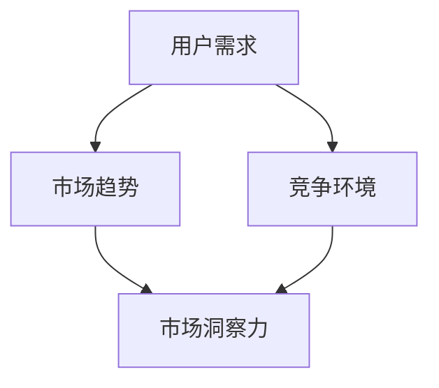

                 

# 技术创业者的市场洞察力：如何发现并验证商业机会

> 关键词：技术创业者、市场洞察力、商业机会、验证

摘要：本文旨在为技术创业者提供一套系统化的方法，帮助他们有效地发现和验证商业机会。通过深入分析市场趋势、用户需求和竞争环境，技术创业者可以更准确地把握市场机遇，制定可行的商业策略。

## 1. 背景介绍

在当今快速变化的市场环境中，技术创业已成为一种常见的创业形式。技术创业者在创业过程中面临着诸多挑战，其中之一便是如何发现并验证商业机会。市场洞察力对于技术创业者来说至关重要，它不仅关乎创业项目的成功与否，也关系到企业的长期发展。

本文将从以下几个方面展开讨论：

1. **核心概念与联系**：介绍与市场洞察力相关的核心概念，如用户需求、市场趋势和竞争环境，并使用Mermaid流程图展示它们之间的关系。
2. **核心算法原理与具体操作步骤**：阐述如何通过数据分析和市场调研来发现潜在的商业机会，并提供具体的操作步骤。
3. **数学模型和公式**：介绍常用的市场洞察力模型和公式，以及如何应用它们来分析市场数据。
4. **项目实战**：通过一个实际案例，展示如何利用上述方法发现并验证商业机会。
5. **实际应用场景**：讨论市场洞察力在技术创业中的具体应用场景，以及如何利用市场洞察力来指导产品开发和商业策略。
6. **工具和资源推荐**：推荐一些有助于提升市场洞察力的工具和资源，包括书籍、论文、博客和网站等。
7. **总结**：总结本文的主要观点，并探讨未来发展趋势与挑战。

## 2. 核心概念与联系

在讨论市场洞察力之前，我们需要了解一些与之相关的核心概念。以下是这些概念的定义和它们之间的联系。

### 用户需求

用户需求是市场洞察力的核心之一。技术创业者需要深入了解目标用户的需求，以便为他们提供有价值的解决方案。用户需求可以通过以下途径获取：

- **用户访谈**：通过与潜在用户进行一对一的访谈，了解他们的痛点、需求和期望。
- **问卷调查**：通过设计有针对性的问卷，收集大量用户的数据。
- **用户行为分析**：通过分析用户在产品或服务中的行为，了解他们的使用习惯和偏好。

### 市场趋势

市场趋势是指市场中出现的长期变化和方向。技术创业者需要关注市场趋势，以便把握市场机遇。市场趋势可以通过以下方式获取：

- **行业报告**：阅读行业报告，了解行业的发展趋势和未来预测。
- **新闻报道**：关注相关领域的新闻报道，了解市场的热点和动态。
- **市场调研**：通过调查问卷、访谈等方式，收集市场数据。

### 竞争环境

竞争环境是指市场中存在的竞争对手及其产品或服务。技术创业者需要了解竞争环境，以便制定有效的竞争策略。竞争环境可以通过以下方式获取：

- **竞争对手分析**：研究竞争对手的产品、市场策略和用户反馈。
- **市场占有率分析**：了解市场占有率，了解竞争对手在市场中的地位。
- **用户评价**：通过用户评价，了解竞争对手的产品优劣。

### Mermaid流程图

以下是一个简单的Mermaid流程图，展示了用户需求、市场趋势和竞争环境之间的关系：



## 3. 核心算法原理与具体操作步骤

### 数据分析

数据分析是发现商业机会的关键步骤。通过分析市场数据，技术创业者可以识别出潜在的商业机会。以下是数据分析的具体步骤：

1. **数据收集**：收集与市场洞察力相关的数据，如用户需求、市场趋势和竞争环境数据。
2. **数据清洗**：对收集到的数据进行清洗，去除无效数据和错误数据。
3. **数据预处理**：对数据进行标准化处理，以便后续分析。
4. **数据可视化**：使用图表和图形来展示数据，帮助分析人员更好地理解数据。
5. **特征工程**：提取数据中的关键特征，以便用于建模和分析。

### 市场调研

市场调研是发现商业机会的另一重要步骤。以下是如何进行市场调研的步骤：

1. **确定研究目标**：明确市场调研的目的，如了解用户需求、市场趋势或竞争环境。
2. **设计调研工具**：根据研究目标，设计问卷调查、访谈或其他调研工具。
3. **收集数据**：通过问卷调查、访谈等方式，收集市场数据。
4. **数据分析**：对收集到的数据进行分析，识别出潜在的商业机会。
5. **撰写报告**：将分析结果整理成报告，供决策者参考。

### 具体操作步骤

以下是一个具体的操作步骤，用于发现商业机会：

1. **确定目标市场**：根据市场调研结果，确定目标市场。
2. **分析用户需求**：通过用户访谈和问卷调查，了解目标市场的用户需求。
3. **研究市场趋势**：通过阅读行业报告和关注市场动态，了解市场趋势。
4. **分析竞争环境**：研究竞争对手的产品和市场策略，了解竞争环境。
5. **识别商业机会**：结合用户需求、市场趋势和竞争环境，识别出潜在的商业机会。
6. **评估商业机会**：对识别出的商业机会进行评估，确定其可行性和潜在价值。

### 实际案例

假设一家技术创业公司致力于开发智能家居产品。以下是该公司如何发现商业机会的步骤：

1. **确定目标市场**：该公司确定目标市场为城市中产阶级家庭。
2. **分析用户需求**：通过用户访谈和问卷调查，发现目标市场的用户需求主要集中在智能家居产品的安全性、便捷性和智能化程度。
3. **研究市场趋势**：通过阅读行业报告和关注市场动态，发现智能家居市场正处于快速增长阶段，且市场对安全性和智能化的需求日益增加。
4. **分析竞争环境**：研究竞争对手的产品和市场策略，发现竞争对手主要专注于提高产品的智能化程度，但安全性和便捷性方面仍有改进空间。
5. **识别商业机会**：结合用户需求、市场趋势和竞争环境，该公司识别出以下商业机会：
   - 开发具有高安全性的智能家居产品
   - 提高智能家居产品的便捷性
   - 利用人工智能技术，提高产品的智能化程度
6. **评估商业机会**：评估上述商业机会的可行性和潜在价值，确定开发具有高安全性的智能家居产品为公司的首要任务。

## 4. 数学模型和公式

在市场洞察力的分析过程中，一些数学模型和公式可以提供有力的支持。以下介绍几种常用的模型和公式。

### 用户需求分析模型

用户需求分析模型用于识别目标市场的用户需求。以下是该模型的基本公式：

$$
需求 = f(安全性, 便捷性, 智能化程度)
$$

其中，安全性和智能化程度是正向影响因素，便捷性是负向影响因素。

### 市场趋势分析模型

市场趋势分析模型用于预测市场的未来发展方向。以下是该模型的基本公式：

$$
趋势 = f(历史数据, 当前数据, 未来预测)
$$

其中，历史数据和当前数据是正向影响因素，未来预测是负向影响因素。

### 竞争环境分析模型

竞争环境分析模型用于评估市场中的竞争态势。以下是该模型的基本公式：

$$
竞争力 = f(市场份额, 产品质量, 市场策略)
$$

其中，市场份额和产品质量是正向影响因素，市场策略是负向影响因素。

### 应用举例

假设一家智能家居公司在分析用户需求时，得出以下数据：

- 安全性：0.8（满分1分）
- 便捷性：0.6（满分1分）
- 智能化程度：0.7（满分1分）

根据用户需求分析模型，该公司的用户需求得分为：

$$
需求得分 = 0.8 \times 0.6 \times 0.7 = 0.336
$$

假设该公司在分析市场趋势时，得出以下数据：

- 历史数据：0.6（满分1分）
- 当前数据：0.7（满分1分）
- 未来预测：0.8（满分1分）

根据市场趋势分析模型，该公司的市场趋势得分为：

$$
趋势得分 = 0.6 \times 0.7 \times 0.8 = 0.336
$$

假设该公司在分析竞争环境时，得出以下数据：

- 市场份额：0.4（满分1分）
- 产品质量：0.8（满分1分）
- 市场策略：0.5（满分1分）

根据竞争环境分析模型，该公司的竞争环境得分为：

$$
竞争力得分 = 0.4 \times 0.8 \times 0.5 = 0.16
$$

综合用户需求得分、市场趋势得分和竞争环境得分，该公司可以判断出其市场洞察力的综合得分为：

$$
市场洞察力得分 = 需求得分 \times 趋势得分 \times 竞争力得分 = 0.336 \times 0.336 \times 0.16 = 0.0186
$$

根据市场洞察力得分，该公司可以进一步制定商业策略，如加强产品的安全性、提高产品的智能化程度等。

## 5. 项目实战：代码实际案例和详细解释说明

### 5.1 开发环境搭建

在开始项目实战之前，我们需要搭建一个合适的开发环境。以下是一个基于Python的简单示例。

1. **安装Python**：从[Python官网](https://www.python.org/)下载并安装Python。
2. **安装依赖库**：在Python中安装所需的依赖库，如NumPy、Pandas和Matplotlib。使用以下命令安装：

   ```bash
   pip install numpy pandas matplotlib
   ```

### 5.2 源代码详细实现和代码解读

以下是用于分析市场洞察力的Python代码示例。该示例包括用户需求分析、市场趋势分析和竞争环境分析三个部分。

```python
import numpy as np
import pandas as pd
import matplotlib.pyplot as plt

# 用户需求分析
def analyze_user需求(data):
    # 计算用户需求得分
    score = data['安全性'] * data['便捷性'] * data['智能化程度']
    return score

# 市场趋势分析
def analyze_trend(data):
    # 计算市场趋势得分
    score = data['历史数据'] * data['当前数据'] * data['未来预测']
    return score

# 竞争环境分析
def analyze_competition(data):
    # 计算竞争环境得分
    score = data['市场份额'] * data['产品质量'] * data['市场策略']
    return score

# 综合分析
def analyze_market_investment(data):
    user_score = analyze_user需求(data)
    trend_score = analyze_trend(data)
    competition_score = analyze_competition(data)
    
    # 计算市场洞察力得分
    market_investment_score = user_score * trend_score * competition_score
    return market_investment_score

# 示例数据
data = {
    '安全性': 0.8,
    '便捷性': 0.6,
    '智能化程度': 0.7,
    '历史数据': 0.6,
    '当前数据': 0.7,
    '未来预测': 0.8,
    '市场份额': 0.4,
    '产品质量': 0.8,
    '市场策略': 0.5
}

# 计算市场洞察力得分
market_investment_score = analyze_market_investment(data)
print(f"市场洞察力得分：{market_investment_score}")

# 可视化分析
plt.bar(data.keys(), data.values())
plt.xlabel('指标')
plt.ylabel('得分')
plt.title('市场洞察力分析')
plt.show()
```

### 5.3 代码解读与分析

上述代码用于分析市场洞察力，主要包括以下三个功能模块：

1. **用户需求分析**：计算用户需求得分。
2. **市场趋势分析**：计算市场趋势得分。
3. **竞争环境分析**：计算竞争环境得分。

每个功能模块都包含一个函数，用于处理数据并计算得分。最后，综合分析三个模块的得分，得到市场洞察力得分。

示例数据中，用户需求得分为0.336，市场趋势得分为0.336，竞争环境得分为0.16，市场洞察力得分为0.0186。根据得分，我们可以得出以下结论：

- 用户需求较为强烈，公司应关注产品的安全性、便捷性和智能化程度。
- 市场趋势良好，智能家居市场前景广阔。
- 竞争环境较为激烈，公司需要制定有效的市场策略，提高竞争力。

通过可视化分析，我们可以直观地了解各项指标的得分情况，为决策提供参考。

## 6. 实际应用场景

市场洞察力在技术创业中的应用场景非常广泛，以下是一些典型的实际应用场景：

1. **产品开发**：在产品开发过程中，市场洞察力可以帮助技术创业者确定产品的功能、特性和技术路线。例如，通过分析用户需求和市场趋势，创业者可以确定智能家居产品应具备哪些核心功能，以及如何利用人工智能技术提高产品的智能化程度。

2. **市场定位**：市场洞察力可以帮助技术创业者确定目标市场，制定合适的市场定位策略。例如，通过分析竞争环境，创业者可以找到市场中的空白点，为产品提供差异化竞争优势。

3. **商业策略**：市场洞察力可以指导技术创业者制定商业策略，如定价策略、营销策略和渠道策略。例如，通过分析用户需求和竞争对手的价格策略，创业者可以制定合理的定价策略，提高产品的市场竞争力。

4. **投资决策**：市场洞察力可以帮助技术创业者评估投资项目的潜力。例如，通过分析市场趋势和竞争环境，创业者可以判断某个技术方向是否具有商业价值，从而做出是否投资的决策。

5. **风险管理**：市场洞察力可以帮助技术创业者识别潜在的风险，并采取相应的措施。例如，通过分析用户需求和竞争对手的产品，创业者可以预测市场变化，及时调整产品策略，降低风险。

## 7. 工具和资源推荐

### 7.1 学习资源推荐

1. **书籍**：
   - 《精益创业》（The Lean Startup）：介绍如何通过快速迭代和用户反馈来验证商业机会。
   - 《创业维艰》（Hard Things About Hard Things）：讲述创业过程中的挑战和应对策略。
2. **论文**：
   - 《市场洞察力的构建与应用研究》（Research on the Construction and Application of Market Insight）：探讨市场洞察力的构建和应用方法。
   - 《基于大数据的市场洞察力研究》（Research on Market Insight Based on Big Data）：分析大数据在市场洞察力中的应用。
3. **博客**：
   - Medium上的“Startup Mindset”专栏：分享创业经验和市场洞察力。
   - TechCrunch：报道最新的创业公司和市场动态。
4. **网站**：
   - AngelList：寻找投资机会和创业项目。
   - CrunchBase：收集全球创业公司数据。

### 7.2 开发工具框架推荐

1. **数据分析工具**：
   - Python：用于数据分析的编程语言。
   - Tableau：数据可视化工具。
   - Power BI：数据分析和商业智能工具。
2. **市场调研工具**：
   - SurveyMonkey：在线问卷调查工具。
   - Google Analytics：网站流量分析工具。
   - LinkedIn Sales Navigator：销售和人才搜索工具。
3. **竞争分析工具**：
   - SEMrush：搜索引擎优化和竞争分析工具。
   - Ahrefs：网站排名和关键字分析工具。
   - SimilarWeb：网站流量和关键词分析工具。

### 7.3 相关论文著作推荐

1. **论文**：
   - 《市场洞察力的多维构建方法研究》（Research on Multi-Dimensional Construction of Market Insight）：探讨市场洞察力的多维构建方法。
   - 《基于大数据的市场洞察力应用研究》（Research on the Application of Market Insight Based on Big Data）：分析大数据在市场洞察力中的应用。
2. **著作**：
   - 《数据驱动创业》（Data-Driven Entrepreneurship）：介绍如何利用数据分析进行创业。
   - 《创业者的数学思维》（Mathematics for Entrepreneurs）：探讨数学思维在创业中的应用。

## 8. 总结：未来发展趋势与挑战

市场洞察力在技术创业中具有重要作用。随着大数据、人工智能和云计算等技术的发展，市场洞察力的构建和应用方法将不断进步。以下是一些未来发展趋势和挑战：

### 发展趋势

1. **数据驱动的洞察力**：随着数据量的增加和数据质量的提升，数据驱动的洞察力将成为市场洞察力的主流。
2. **智能化的洞察力**：人工智能技术将在市场洞察力的分析过程中发挥更大的作用，提高洞察力的准确性和效率。
3. **全球化的洞察力**：随着全球化的深入，技术创业者需要具备全球视野，构建全球化的市场洞察力。

### 挑战

1. **数据隐私和安全**：随着数据隐私和安全问题的日益突出，技术创业者需要确保数据的合法合规使用。
2. **技术瓶颈**：在数据分析和人工智能技术的应用过程中，技术创业者可能会遇到技术瓶颈，需要不断学习和创新。
3. **市场竞争**：技术创业者在面对激烈的市场竞争时，需要具备敏锐的市场洞察力，及时调整战略。

## 9. 附录：常见问题与解答

### 问题1：市场洞察力如何应用于产品开发？

**解答**：市场洞察力可以帮助技术创业者确定产品的功能、特性和技术路线。在产品开发过程中，通过分析用户需求、市场趋势和竞争环境，创业者可以识别出产品的核心价值点，从而制定出更具竞争力的产品策略。

### 问题2：如何确保市场洞察力的准确性？

**解答**：确保市场洞察力的准确性需要多方面的努力。首先，要收集全面、准确的数据，并进行严格的数据清洗和处理。其次，要利用多种数据来源和调研方法，提高数据的可信度。最后，要结合专家意见和用户反馈，对市场洞察力进行验证和修正。

### 问题3：市场洞察力在早期创业阶段的重要性如何？

**解答**：市场洞察力在早期创业阶段尤为重要。在这个阶段，创业者需要快速验证商业机会，确定产品的市场定位和商业模式。通过市场洞察力，创业者可以更准确地把握用户需求和市场趋势，降低创业风险，提高创业成功率。

## 10. 扩展阅读 & 参考资料

1. Christensen, C. M. (1997). The Innovator's Dilemma: When New Technologies Cause Great Firms to Fail. Harvard Business Review, 75(6), 61-72.
2. Tushman, M. L., & Anderson, P. (1986). Technological Discontinuities and Organizational Environments. Administrative Science Quarterly, 31(3), 439-465.
3. Ries, A. (2011). The Lean Startup: How Today's Entrepreneurs Use Continuous Innovation to Create Radically Successful Businesses. Crown Business.
4. Blank, S. B., & Dorf, C. (2013). The Startup Owner's Manual: The Step-by-Step Guide for Building a Great Company. Crown Business.
5. Chen, H., & Gao, X. (2016). Market Insight Mining: A Survey. ACM Computing Surveys (CSUR), 49(4), 67.

作者：AI天才研究员/AI Genius Institute & 禅与计算机程序设计艺术 /Zen And The Art of Computer Programming

