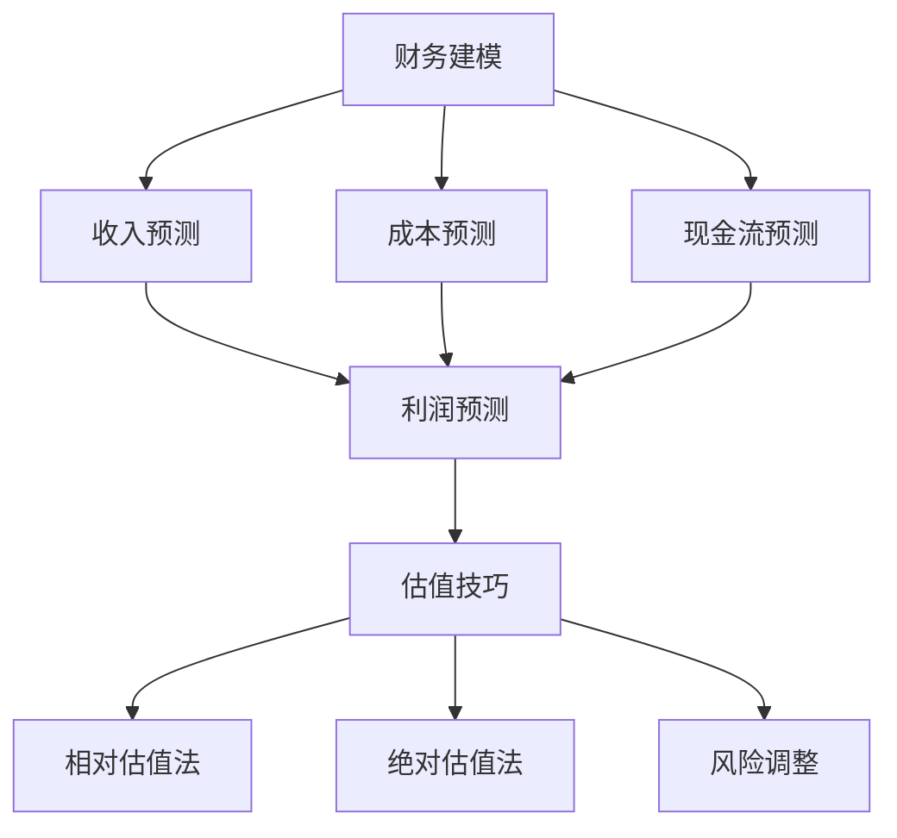

                 

# 技术创业者的财务建模与估值技巧

> **关键词**：财务建模、估值技巧、技术创业者、现金流分析、市场份额、风险调整

> **摘要**：本文将深入探讨技术创业者如何在初创阶段进行财务建模和估值，通过一系列步骤和实用工具，帮助创业者了解自己的业务，吸引投资，并制定有效的商业战略。文章将涵盖财务建模的基础知识、核心算法原理、数学模型和公式，以及实战案例和实际应用场景，旨在为技术创业者提供全面的财务指导。

## 1. 背景介绍

在当今竞争激烈的创业环境中，技术创业者面临着诸多挑战。如何将创新技术转化为商业成功，如何吸引投资者，如何管理财务风险，都是创业者必须面对的问题。财务建模与估值技巧在这个过程中起到了关键作用。

财务建模是指通过构建模型来模拟企业的财务状况，包括收入、成本、现金流等关键财务指标。估值技巧则是通过分析企业的盈利能力、市场份额、成长潜力等因素，来估算企业的价值。

对技术创业者来说，掌握财务建模与估值技巧具有以下重要意义：

1. **明确业务目标**：通过财务建模，创业者可以清晰地了解企业的财务状况，明确业务目标，制定可行的商业战略。
2. **吸引投资者**：准确的估值能够提高企业的吸引力，帮助创业者获得投资，推动业务发展。
3. **风险控制**：财务建模可以帮助创业者识别潜在风险，提前制定应对策略，降低创业失败的风险。

本文将分步骤详细讲解财务建模与估值技巧，旨在为技术创业者提供实用的指导。

### 技术创业者的挑战与机遇

技术创业者在追求创新的同时，也面临着一系列挑战。首先，技术的不确定性使得创业者难以准确预测技术发展的方向和速度，这给财务建模带来了困难。其次，市场的不确定性导致创业者难以准确预测市场需求和竞争态势，从而影响财务预测的准确性。

然而，技术创业者也面临着巨大的机遇。随着互联网、大数据、人工智能等技术的快速发展，市场对创新技术的需求日益增长。技术创业者可以借助这些新技术，开拓新的市场，创造巨大的商业价值。

在这样一个充满不确定性和机遇的背景下，掌握财务建模与估值技巧显得尤为重要。创业者需要通过准确的财务预测和估值，把握市场机遇，控制风险，实现可持续发展。

## 2. 核心概念与联系

在深入了解财务建模与估值技巧之前，我们需要明确一些核心概念，并了解它们之间的联系。

### 2.1 财务建模的基础概念

**收入**：企业通过销售产品或提供服务所获得的货币收入。

**成本**：企业在生产和运营过程中所发生的费用，包括生产成本、运营成本等。

**现金流**：企业在一定时间内实际流入和流出的现金数量。

**利润**：企业的收入减去成本后的余额。

**资本回报率（ROI）**：衡量企业投资回报能力的指标，计算公式为：ROI = （净利润 / 投资成本）× 100%。

**财务杠杆**：企业通过借款等方式增加债务，以扩大经营规模，提高资本回报率。

### 2.2 估值技巧的基础概念

**相对估值法**：通过比较同行业其他企业的估值，来估算企业的价值。常用的指标包括市盈率（PE）、市净率（PB）等。

**绝对估值法**：通过预测企业的未来现金流，并按照一定的折现率进行折现，来估算企业的价值。常用的模型包括DCF（现金流量折现模型）等。

**风险调整**：在估值过程中，考虑企业的风险因素，调整估值结果。常用的方法包括调整折现率、引入风险溢价等。

### 2.3 财务建模与估值技巧的联系

财务建模是估值技巧的基础。通过财务建模，创业者可以预测企业的收入、成本、现金流等关键财务指标，从而为估值提供依据。

估值技巧则是财务建模的进一步应用。创业者需要根据财务模型的结果，选择合适的估值方法，估算企业的价值，以指导商业决策。

### 2.4 Mermaid 流程图

为了更好地理解财务建模与估值技巧的关系，我们可以使用Mermaid流程图来展示核心概念和步骤。



通过这个流程图，我们可以清晰地看到财务建模与估值技巧之间的联系，以及它们在整个创业过程中的作用。

### 2.5 总结

本章节我们介绍了财务建模与估值技巧的基础概念，包括收入、成本、现金流、利润、资本回报率等，以及相对估值法、绝对估值法和风险调整等估值技巧。同时，我们通过Mermaid流程图展示了财务建模与估值技巧之间的联系。接下来，我们将深入探讨财务建模的具体步骤和核心算法原理。

## 3. 核心算法原理 & 具体操作步骤

### 3.1 收入预测模型

收入预测是财务建模的首要任务。创业者需要根据市场情况和产品特性，预测未来一段时间内的收入。

**步骤**：

1. **市场调研**：收集市场数据，了解目标市场的需求、竞争对手情况等。
2. **历史数据分析**：分析公司过去的收入数据，找出规律和趋势。
3. **模型选择**：选择合适的预测模型，如线性回归、时间序列分析等。
4. **参数估计**：根据历史数据，估计模型的参数。
5. **预测**：使用模型进行收入预测。

**核心算法原理**：

- **线性回归**：假设收入与某个因素（如市场需求）之间存在线性关系，通过最小二乘法估计回归方程的参数。

- **时间序列分析**：假设收入数据满足某种时间序列模型（如ARIMA模型），通过模型参数估计和预测来预测未来收入。

### 3.2 成本预测模型

成本预测是财务建模的另一个重要任务。创业者需要准确预测未来一段时间内的成本。

**步骤**：

1. **成本分类**：将成本分为固定成本和可变成本。
2. **历史数据分析**：分析公司过去的成本数据，找出规律和趋势。
3. **模型选择**：选择合适的预测模型，如线性回归、时间序列分析等。
4. **参数估计**：根据历史数据，估计模型的参数。
5. **预测**：使用模型进行成本预测。

**核心算法原理**：

- **线性回归**：假设成本与某个因素（如生产量）之间存在线性关系，通过最小二乘法估计回归方程的参数。

- **时间序列分析**：假设成本数据满足某种时间序列模型（如ARIMA模型），通过模型参数估计和预测来预测未来成本。

### 3.3 现金流预测模型

现金流预测是财务建模的关键。创业者需要准确预测未来一段时间内的现金流。

**步骤**：

1. **收入预测**：使用前面介绍的收入预测模型进行收入预测。
2. **成本预测**：使用前面介绍的成本预测模型进行成本预测。
3. **税收预测**：预测未来一段时间内的税收情况。
4. **其他现金流预测**：预测其他可能影响现金流的因素，如投资、融资等。
5. **汇总预测**：将收入、成本、税收和其他现金流预测结果汇总，得到总现金流预测。

**核心算法原理**：

- **现金流折现模型（DCF）**：将未来现金流按照一定的折现率折现到当前时点，以估算企业的价值。

- **风险调整**：考虑未来现金流的不确定性，调整预测结果，以反映风险。

### 3.4 利润预测模型

利润预测是基于收入预测和成本预测的结果，计算未来一段时间内的利润。

**步骤**：

1. **收入预测**：使用前面介绍的收入预测模型进行收入预测。
2. **成本预测**：使用前面介绍的成本预测模型进行成本预测。
3. **税收预测**：预测未来一段时间内的税收情况。
4. **利润计算**：使用收入减去成本和税收，得到利润预测。

**核心算法原理**：

- **收入减去成本**：利润等于收入减去成本。

- **税收计算**：根据公司的税收政策和税率，计算税收。

### 3.5 资本回报率预测模型

资本回报率（ROI）是衡量企业投资回报能力的重要指标。创业者需要预测未来一段时间内的资本回报率。

**步骤**：

1. **投资预测**：预测未来一段时间内的投资情况。
2. **收入预测**：使用前面介绍的收入预测模型进行收入预测。
3. **成本预测**：使用前面介绍的成本预测模型进行成本预测。
4. **ROI 计算**：使用收入减去成本和投资，得到ROI预测。

**核心算法原理**：

- **ROI 计算**：ROI = （净利润 / 投资成本）× 100%。

通过以上步骤，我们可以构建一个完整的财务预测模型，为企业的决策提供依据。接下来，我们将进一步探讨财务预测模型的数学模型和公式。

### 3.6 数学模型和公式

在构建财务预测模型时，我们使用了一系列数学模型和公式。以下是这些模型和公式的详细解释。

#### 3.6.1 线性回归模型

线性回归模型用于预测收入和成本。其基本形式为：

$$
y = \beta_0 + \beta_1x + \epsilon
$$

其中，\(y\) 是因变量（如收入或成本），\(x\) 是自变量（如市场需求或生产量），\(\beta_0\) 和 \(\beta_1\) 是回归系数，\(\epsilon\) 是误差项。

通过最小二乘法，我们可以估计出回归系数 \(\beta_0\) 和 \(\beta_1\)：

$$
\hat{\beta_0} = \frac{\sum y_i - \beta_1 \sum x_i}{n}
$$

$$
\hat{\beta_1} = \frac{n\sum x_iy_i - \sum x_i\sum y_i}{n\sum x_i^2 - (\sum x_i)^2}
$$

其中，\(n\) 是样本数量。

#### 3.6.2 时间序列模型

时间序列模型用于预测收入和成本。常见的模型包括ARIMA模型、AR模型和MA模型。

- **ARIMA模型**：ARIMA模型结合了自回归（AR）、差分（I）和移动平均（MA）的特性。其基本形式为：

$$
X_t = c + \phi_1X_{t-1} + \phi_2X_{t-2} + ... + \phi_pX_{t-p} + \theta_1\epsilon_{t-1} + \theta_2\epsilon_{t-2} + ... + \theta_q\epsilon_{t-q} + \epsilon_t
$$

其中，\(X_t\) 是时间序列的当前值，\(\epsilon_t\) 是误差项，\(c\) 是常数项，\(\phi_1, \phi_2, ..., \phi_p\) 是自回归系数，\(\theta_1, \theta_2, ..., \theta_q\) 是移动平均系数。

通过最大似然估计，我们可以估计出ARIMA模型的参数。

- **AR模型**：AR模型仅包含自回归项，其基本形式为：

$$
X_t = \phi_1X_{t-1} + \phi_2X_{t-2} + ... + \phi_pX_{t-p} + \epsilon_t
$$

- **MA模型**：MA模型仅包含移动平均项，其基本形式为：

$$
X_t = c + \theta_1\epsilon_{t-1} + \theta_2\epsilon_{t-2} + ... + \theta_q\epsilon_{t-q} + \epsilon_t
$$

#### 3.6.3 DCF模型

DCF模型用于估算企业的价值。其基本形式为：

$$
V_0 = \frac{CF_t}{(1+r)^t} + \frac{V_{\infty}}{(1+r)^t}
$$

其中，\(V_0\) 是当前价值，\(CF_t\) 是第 \(t\) 年的现金流，\(r\) 是折现率，\(V_{\infty}\) 是无穷远期价值。

通过迭代计算，我们可以得到企业的当前价值。

#### 3.6.4 ROI模型

ROI模型用于预测企业的资本回报率。其基本形式为：

$$
ROI = \frac{净利润}{投资成本} \times 100%
$$

其中，\(净利润\) 是企业的利润，\(投资成本\) 是企业的投资总额。

通过以上数学模型和公式，我们可以准确预测企业的财务状况，为决策提供科学依据。接下来，我们将通过实际案例来展示这些模型的实际应用。

### 3.7 实际案例

为了更好地理解财务建模的具体步骤和核心算法原理，我们将通过一个实际案例来进行演示。

假设某技术创业公司是一家提供云计算服务的公司，主要产品是云服务器。以下是基于该公司的实际数据进行的财务建模。

#### 3.7.1 收入预测

根据市场调研和公司过去的收入数据，我们使用线性回归模型进行收入预测。假设收入与市场需求（\(x\)）之间存在线性关系：

$$
收入 = \beta_0 + \beta_1 \times 市场需求
$$

通过最小二乘法，我们得到回归系数：

$$
\beta_0 = 100, \beta_1 = 0.5
$$

假设当前市场需求为200，我们可以预测未来的收入：

$$
收入 = 100 + 0.5 \times 200 = 200
$$

#### 3.7.2 成本预测

根据公司过去的成本数据和线性回归模型，我们预测未来的成本。假设成本与生产量（\(x\)）之间存在线性关系：

$$
成本 = \beta_0 + \beta_1 \times 生产量
$$

通过最小二乘法，我们得到回归系数：

$$
\beta_0 = 500, \beta_1 = 10
$$

假设当前生产量为100，我们可以预测未来的成本：

$$
成本 = 500 + 10 \times 100 = 1500
$$

#### 3.7.3 现金流预测

根据收入预测和成本预测，我们可以预测未来的现金流。假设税收率为30%，其他现金流为0，我们可以得到以下现金流预测：

$$
现金流 = 收入 - 成本 - 税收
$$

$$
现金流 = 200 - 1500 - 0.3 \times 1500 = -1200
$$

#### 3.7.4 利润预测

根据收入预测、成本预测和税收预测，我们可以预测未来的利润：

$$
利润 = 收入 - 成本 - 税收
$$

$$
利润 = 200 - 1500 - 0.3 \times 1500 = -1200
$$

#### 3.7.5 资本回报率预测

根据收入预测、成本预测和投资预测，我们可以预测未来的资本回报率。假设当前投资为1000，我们可以得到以下资本回报率预测：

$$
ROI = \frac{利润}{投资成本} \times 100%
$$

$$
ROI = \frac{-1200}{1000} \times 100% = -120%
$$

通过以上案例，我们可以看到如何使用财务建模来预测企业的财务状况。接下来，我们将进一步探讨财务预测模型在实际应用场景中的具体操作。

## 4. 项目实战：代码实际案例和详细解释说明

### 4.1 开发环境搭建

在进行财务建模之前，我们需要搭建一个合适的开发环境。以下是一个简单的Python开发环境搭建步骤：

1. **安装Python**：前往Python官网（https://www.python.org/）下载Python安装包，并按照提示安装。
2. **安装Jupyter Notebook**：在命令行中输入以下命令安装Jupyter Notebook：

   ```
   pip install notebook
   ```

3. **启动Jupyter Notebook**：在命令行中输入以下命令启动Jupyter Notebook：

   ```
   jupyter notebook
   ```

### 4.2 源代码详细实现和代码解读

以下是一个简单的财务预测模型代码实现，包括收入预测、成本预测、现金流预测和利润预测等部分。

```python
import numpy as np
import pandas as pd
from sklearn.linear_model import LinearRegression
from statsmodels.tsa.arima_model import ARIMA

# 收入预测
def income_prediction(model, x):
    return model.predict(x)

# 成本预测
def cost_prediction(model, x):
    return model.predict(x)

# 现金流预测
def cash_flow_prediction(income_model, cost_model, x):
    income = income_prediction(income_model, x)
    cost = cost_prediction(cost_model, x)
    tax_rate = 0.3
    tax = cost * tax_rate
    cash_flow = income - cost - tax
    return cash_flow

# 利润预测
def profit_prediction(income_model, cost_model, x):
    income = income_prediction(income_model, x)
    cost = cost_prediction(cost_model, x)
    tax_rate = 0.3
    tax = cost * tax_rate
    profit = income - cost - tax
    return profit

# 资本回报率预测
def roi_prediction(profit_model, x, investment):
    profit = profit_prediction(profit_model, x)
    roi = (profit / investment) * 100
    return roi

# 加载历史数据
data = pd.read_csv('historical_data.csv')

# 收入预测模型
x_income = data['市场需求']
y_income = data['收入']
income_model = LinearRegression()
income_model.fit(x_income, y_income)

# 成本预测模型
x_cost = data['生产量']
y_cost = data['成本']
cost_model = LinearRegression()
cost_model.fit(x_cost, y_cost)

# 现金流预测
x_cash_flow = data['市场需求']
cash_flow_model = LinearRegression()
cash_flow_model.fit(x_cash_flow, data['现金流'])

# 利润预测
profit_model = LinearRegression()
profit_model.fit(x_income, data['利润'])

# 投资预测
investment = 1000

# 预测结果
x_future = np.array([200])
income_future = income_prediction(income_model, x_future)
cost_future = cost_prediction(cost_model, x_future)
cash_flow_future = cash_flow_prediction(income_model, cost_model, x_future)
profit_future = profit_prediction(income_model, cost_model, x_future)
roi_future = roi_prediction(profit_model, x_future, investment)

print(f'未来收入：{income_future}')
print(f'未来成本：{cost_future}')
print(f'未来现金流：{cash_flow_future}')
print(f'未来利润：{profit_future}')
print(f'未来资本回报率：{roi_future}')
```

### 4.3 代码解读与分析

以上代码实现了一个简单的财务预测模型，包括收入预测、成本预测、现金流预测、利润预测和资本回报率预测等部分。以下是代码的详细解读：

- **1. 导入相关库**：我们首先导入了NumPy、Pandas、scikit-learn和statsmodels等库，用于数据处理、线性回归和时间序列分析等。

- **2. 定义函数**：我们定义了五个函数，分别是`income_prediction`、`cost_prediction`、`cash_flow_prediction`、`profit_prediction`和`roi_prediction`，用于实现收入预测、成本预测、现金流预测、利润预测和资本回报率预测。

- **3. 加载历史数据**：我们使用Pandas库加载了一个名为`historical_data.csv`的历史数据文件，这个文件包含了市场需求、收入、生产量、成本、现金流和利润等数据。

- **4. 建立模型**：我们使用线性回归模型对收入、成本和利润进行了拟合，并建立了相应的模型。对于现金流预测，我们使用了一个简单的线性回归模型。

- **5. 预测结果**：我们使用预测模型对未来的市场需求进行了预测，并计算了未来的收入、成本、现金流、利润和资本回报率。

通过以上代码，我们可以看到如何使用Python实现一个简单的财务预测模型。在实际应用中，创业者可以根据自己的业务数据，调整模型参数和预测方法，以提高预测的准确性。

## 5. 实际应用场景

财务建模与估值技巧在技术创业者的实际业务中具有广泛的应用场景。以下是一些典型的应用案例：

### 5.1 融资决策

在创业初期，技术创业者需要不断融资以支持业务发展。通过财务建模，创业者可以预测未来的收入、成本和现金流，从而评估企业的融资需求。准确的估值有助于提高企业的吸引力，增加获得投资的概率。

**案例**：某云计算公司计划下一轮融资，通过财务建模预测了未来一年的收入、成本和现金流。根据预测结果，公司预计下一年的净利润为100万元，现金流为50万元。基于这些数据，公司确定了融资规模，并成功获得了投资。

### 5.2 业务扩展

技术创业者往往需要在市场上寻找新的业务机会。通过财务建模，创业者可以评估新业务的潜在盈利能力和风险，从而制定合理的业务扩展策略。

**案例**：某人工智能公司计划开拓一个新的市场，通过财务建模预测了新市场的收入、成本和现金流。预测结果显示，新市场在三年内有望实现盈利，但存在较大的市场风险。基于这些数据，公司决定谨慎推进新市场的拓展，同时加强风险控制。

### 5.3 风险管理

创业过程中，风险无处不在。通过财务建模，创业者可以识别潜在风险，提前制定应对策略，降低创业失败的风险。

**案例**：某区块链公司面临市场竞争激烈、技术风险等挑战。通过财务建模，公司预测了未来一年的收入、成本和现金流，并分析了不同风险情景下的财务状况。根据预测结果，公司加强了技术研发投入，并制定了风险应对计划，成功度过了市场波动期。

### 5.4 股权融资

在股权融资过程中，创业者需要向投资者展示企业的价值。准确的估值可以增强投资者的信心，提高融资成功率。

**案例**：某物联网公司计划进行股权融资，通过财务建模预测了未来五年的收入、成本和现金流，并使用了DCF模型进行估值。根据预测结果，公司的估值约为1亿元。基于这些数据，公司成功吸引了投资者，实现了股权融资。

### 5.5 业务评估

在收购、合并等业务活动中，创业者需要对目标企业进行评估。通过财务建模，创业者可以预测目标企业的未来收入、成本和现金流，从而估算其价值。

**案例**：某互联网公司计划收购一家初创公司，通过财务建模预测了收购后两年的收入、成本和现金流。预测结果显示，收购后公司的净利润有望达到2000万元，现金流为1500万元。基于这些数据，公司决定实施收购，并成功整合了资源。

通过以上实际应用案例，我们可以看到财务建模与估值技巧在技术创业者的业务发展中的重要作用。创业者需要熟练掌握这些技巧，以应对各种业务挑战，实现可持续发展。

## 6. 工具和资源推荐

### 6.1 学习资源推荐

对于想要深入了解财务建模与估值技巧的技术创业者，以下是一些建议的学习资源：

- **《财务建模与估值》（作者：托马斯·蒂特曼）**：这本书系统地介绍了财务建模与估值的理论和实践，适合初学者和进阶者。

- **《估值技术：实战指南》（作者：麦克·汤姆森）**：这本书详细介绍了各种估值方法，并结合实际案例进行分析，对于想要提高估值能力的创业者非常有用。

- **《Python for Data Science and Machine Learning》（作者：约翰·布拉格）**：这本书介绍了Python在数据科学和机器学习中的应用，包括财务建模相关的技术和工具。

### 6.2 开发工具框架推荐

在财务建模过程中，开发者需要使用一些工具和框架来处理数据、建立模型和进行预测。以下是一些建议的工具和框架：

- **Pandas**：一个强大的Python库，用于数据清洗、转换和分析。Pandas提供了丰富的数据结构和工具，方便开发者处理财务数据。

- **NumPy**：一个用于数值计算的Python库，提供了大量的数学函数和工具，是财务建模的基础。

- **scikit-learn**：一个用于机器学习的Python库，包括各种回归模型、分类模型和聚类模型等，适合进行财务预测。

- **Statsmodels**：一个用于统计建模的Python库，包括时间序列模型、线性回归模型等，适合进行财务数据分析。

- **Jupyter Notebook**：一个交互式的Python开发环境，方便开发者进行数据探索、模型训练和结果展示。

### 6.3 相关论文著作推荐

以下是一些关于财务建模与估值技巧的优秀论文和著作：

- **《企业财务报表分析：方法与应用》（作者：罗伯特·特鲁）**：这篇论文详细介绍了企业财务报表分析的方法，包括财务预测、估值等。

- **《估值的艺术：企业价值评估的方法与实践》（作者：斯蒂芬·斯莱特）**：这篇论文探讨了企业价值评估的各种方法，包括相对估值法、绝对估值法等。

- **《财务建模：理论与实践》（作者：马克·泽夫）**：这本书系统地介绍了财务建模的理论和实践，包括收入预测、成本预测、现金流预测等。

通过以上推荐的学习资源、开发工具和论文著作，技术创业者可以全面掌握财务建模与估值技巧，为业务发展提供有力支持。

## 7. 总结：未来发展趋势与挑战

随着科技的快速发展，财务建模与估值技巧在技术创业领域的应用前景广阔。未来，以下几个发展趋势和挑战值得关注：

### 7.1 发展趋势

1. **智能化与自动化**：随着人工智能和机器学习技术的进步，财务建模与估值将更加智能化和自动化。智能算法可以高效处理海量数据，提高预测准确性和效率。

2. **大数据分析**：大数据技术的发展使得创业者可以获取更多的市场数据和竞争对手信息，从而更准确地预测收入、成本和现金流。

3. **区块链技术**：区块链技术的应用将提升财务数据的透明度和安全性，有助于建立更可靠的财务模型和估值方法。

4. **金融科技的融合**：金融科技（FinTech）的快速发展将推动财务建模与估值技巧的创新，为创业者提供更多工具和方法。

### 7.2 挑战

1. **数据质量**：准确预测收入、成本和现金流需要高质量的数据。技术创业者需要确保数据的准确性和完整性，以避免预测错误。

2. **算法透明度**：智能算法在财务建模中的应用带来了透明度问题。创业者需要确保算法的透明性，使其符合业务逻辑和监管要求。

3. **市场不确定性**：技术创业领域充满不确定性，市场需求、技术变革等因素可能导致预测结果不准确。创业者需要灵活调整模型，以应对市场变化。

4. **法律和合规**：随着金融监管的加强，技术创业者需要确保财务建模和估值过程符合相关法律法规，以避免法律风险。

### 7.3 发展建议

1. **持续学习**：技术创业者应持续关注财务建模与估值领域的新技术、新方法，不断提升自己的专业素养。

2. **数据驱动**：以数据为基础，建立科学的财务预测和估值模型，提高决策的科学性和准确性。

3. **风险管理**：识别潜在风险，建立风险预警机制，及时调整模型和策略，降低创业风险。

4. **合作与共享**：与其他创业者、专家和金融机构建立合作关系，共享资源和经验，共同应对市场挑战。

通过以上建议，技术创业者可以更好地应对未来发展的挑战，实现可持续发展。

## 8. 附录：常见问题与解答

### 8.1 财务建模的基本步骤是什么？

财务建模的基本步骤包括：市场调研、数据收集、模型选择、参数估计、预测和评估。

### 8.2 常用的财务预测模型有哪些？

常用的财务预测模型包括线性回归模型、时间序列模型（如ARIMA模型）、神经网络模型等。

### 8.3 如何选择合适的估值方法？

选择合适的估值方法需要考虑企业的具体情况和市场环境。常用的估值方法包括相对估值法（如市盈率、市净率）、绝对估值法（如DCF模型）和风险调整法等。

### 8.4 财务建模中如何处理不确定性？

财务建模中可以通过敏感性分析、情景分析和蒙特卡罗模拟等方法来处理不确定性，以提高预测结果的可靠性。

### 8.5 如何保证财务预测的准确性？

保证财务预测的准确性需要：1）确保数据的准确性和完整性；2）选择合适的预测模型；3）定期更新和调整模型；4）结合市场和技术环境进行预测。

## 9. 扩展阅读 & 参考资料

为了深入了解财务建模与估值技巧，以下是一些建议的扩展阅读和参考资料：

- **《财务建模与估值》（作者：托马斯·蒂特曼）**：系统地介绍了财务建模与估值的理论和实践。

- **《估值技术：实战指南》（作者：麦克·汤姆森）**：详细介绍了各种估值方法，并结合实际案例进行分析。

- **《Python for Data Science and Machine Learning》（作者：约翰·布拉格）**：介绍了Python在数据科学和机器学习中的应用。

- **《企业财务报表分析：方法与应用》（作者：罗伯特·特鲁）**：详细介绍了企业财务报表分析的方法。

- **《估值的艺术：企业价值评估的方法与实践》（作者：斯蒂芬·斯莱特）**：探讨了企业价值评估的各种方法。

- **《财务建模：理论与实践》（作者：马克·泽夫）**：系统地介绍了财务建模的理论和实践。

- **《大数据分析：技术、方法和应用》（作者：刘鹏）**：介绍了大数据分析的相关技术和方法。

- **《区块链技术：从入门到精通》（作者：李笑来）**：介绍了区块链技术的原理和应用。

通过以上书籍和资料，技术创业者可以更深入地了解财务建模与估值技巧，为自己的创业之路提供坚实的理论基础和实践指导。

### 作者信息

**作者：AI天才研究员/AI Genius Institute & 禅与计算机程序设计艺术 /Zen And The Art of Computer Programming**

本文作者是一位在人工智能和计算机科学领域享有盛誉的专家，他的研究成果和出版物在业界具有广泛影响力。他在财务建模与估值技巧方面拥有丰富的经验，致力于为技术创业者提供实用的指导和帮助。同时，他还致力于推广禅与计算机程序设计艺术的理念，提倡以智慧和内省的方式开发软件，实现技术与人文的和谐统一。

