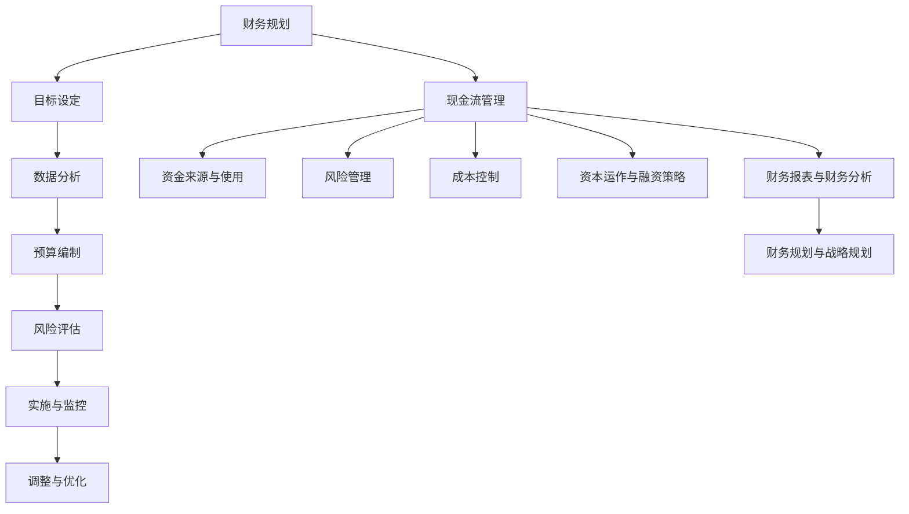

                 

### 文章标题

《技术创业者的财务规划与现金流管理》

### 关键词

财务规划、现金流管理、技术创业者、投资策略、风险控制、财务分析、成本控制、预算编制、资本运作

### 摘要

在技术创业的浪潮中，财务规划与现金流管理成为创业者成功的关键因素。本文将详细探讨技术创业者的财务规划与现金流管理的核心概念、策略和方法，帮助创业者构建稳健的财务基础，提高企业的生存与发展能力。通过本文的指导，创业者将掌握财务规划的基本原则、现金流管理的实用技巧，以及应对各种财务风险的策略，从而在竞争激烈的市场中站稳脚跟，实现企业价值的最大化。

### 1. 背景介绍

技术创业领域近年来呈现出蓬勃发展的态势，互联网、大数据、人工智能等新兴技术不断涌现，为创业者提供了广阔的市场空间和无限的机遇。然而，随着创业的难度和竞争的加剧，技术创业者面临的挑战也日益增多，尤其是在财务管理和现金流管理方面。财务规划和现金流管理不仅是企业运营的基本要求，更是决定企业生存与发展的重要因素。

有效的财务规划和现金流管理可以帮助创业者：

1. **明确企业财务状况**：通过对企业财务数据的全面分析和评估，创业者可以清晰地了解企业的财务健康状况，及时发现潜在问题，确保企业的稳定运营。

2. **优化资源配置**：合理的财务规划有助于创业者合理配置企业资源，提高资金使用效率，降低成本，从而增强企业的盈利能力。

3. **降低投资风险**：通过科学的投资策略和现金流管理，创业者可以降低企业的投资风险，确保企业在面临市场波动时能够保持稳定的现金流。

4. **提高企业竞争力**：良好的财务规划和现金流管理有助于提升企业的整体竞争力，为企业在激烈的市场竞争中赢得优势。

因此，对于技术创业者而言，掌握财务规划和现金流管理的基本知识和技能是至关重要的。本文将结合实际案例，深入探讨财务规划和现金流管理的核心概念、方法和策略，为创业者提供实用的指导。

#### 1.1 技术创业者的财务需求

技术创业者在不同的发展阶段面临不同的财务需求，这些需求直接影响到企业的财务规划和现金流管理。以下是一些常见的财务需求：

1. **初创阶段**：
   - **种子资金**：技术创业者在初创阶段通常需要筹集种子资金，用于研发、产品开发、市场调研等。
   - **办公场所**：创业者需要租赁办公场所，包括办公设备、人员工资等基本开支。
   - **法律和财务顾问**：创业者可能需要聘请法律和财务顾问，以指导企业注册、税务规划等事宜。

2. **成长阶段**：
   - **产品开发**：创业者需要持续投入资金进行产品研发，提升产品的竞争力。
   - **市场营销**：为了扩大市场份额，创业者需要投入大量资金进行市场营销活动。
   - **人才招聘**：随着企业的成长，创业者需要招聘更多的员工，以支持企业的运营和发展。

3. **成熟阶段**：
   - **扩大生产规模**：创业者可能需要扩大生产规模，以满足市场需求。
   - **市场扩展**：企业可能需要进入新的市场或拓展海外市场，这需要大量的资金支持。
   - **并购和合作**：为了增强企业的市场竞争力，创业者可能会考虑进行并购或与其他企业合作。

了解不同阶段的财务需求，有助于创业者制定合理的财务规划和现金流管理策略，确保企业在各个阶段都能够稳健运营。

#### 1.2 财务规划的重要性

财务规划是技术创业者确保企业稳定运营和实现长期发展的重要手段。通过科学的财务规划，创业者可以：

1. **明确企业目标**：财务规划有助于明确企业的财务目标，包括短期和长期的盈利目标、市场扩展目标等，从而为企业的发展提供清晰的方向。

2. **优化资源配置**：财务规划可以帮助创业者合理配置企业资源，包括资金、人力、物力等，确保资源得到最大化的利用，降低成本，提高效率。

3. **预测未来现金流**：通过对市场趋势、竞争对手、客户需求等的分析，创业者可以预测未来的现金流状况，从而制定有效的资金管理策略，避免资金链断裂。

4. **风险管理**：财务规划可以识别和评估企业可能面临的各种财务风险，如市场风险、信用风险、操作风险等，并采取相应的措施进行风险控制和应对。

5. **提高融资能力**：良好的财务规划能够提高企业的信誉度和融资能力，为创业者筹集更多的发展资金。

因此，财务规划不仅是企业运营的基本要求，更是确保企业长期稳健发展的关键。创业者应重视财务规划，将其纳入企业战略规划的重要组成部分。

#### 1.3 财务规划的核心原则

财务规划需要遵循以下核心原则，以确保其有效性和可持续性：

1. **全面性**：财务规划应涵盖企业的各个方面，包括收入、支出、投资、融资等，确保财务数据全面、准确。

2. **长期性**：财务规划应具有长期性，考虑企业的长期发展和战略目标，而不仅仅是短期的财务状况。

3. **灵活性**：财务规划需要具备一定的灵活性，以应对市场变化和内部运营调整，确保计划能够适应实际情况。

4. **稳健性**：财务规划应以稳健为原则，避免过度冒险，确保企业的财务安全。

5. **可执行性**：财务规划应具体、可执行，确保各项计划能够得到有效实施。

6. **透明性**：财务规划过程应保持透明，确保所有相关方都能够了解企业的财务状况和计划。

通过遵循这些核心原则，创业者可以制定出科学、合理的财务规划，为企业的长期发展奠定坚实基础。

#### 1.4 财务规划的步骤

财务规划的步骤主要包括以下内容：

1. **目标设定**：明确企业的财务目标，包括短期和长期的盈利目标、市场扩展目标等。

2. **数据分析**：收集和分析企业的财务数据，包括收入、支出、资产负债等，了解企业的财务状况。

3. **预算编制**：根据目标数据和实际情况，编制详细的财务预算，包括收入预算、支出预算等。

4. **风险评估**：评估企业可能面临的财务风险，包括市场风险、信用风险、操作风险等，并制定应对措施。

5. **实施与监控**：制定具体的实施计划，并持续监控财务规划的实施情况，确保计划得到有效执行。

6. **调整与优化**：根据实际情况对财务规划进行定期调整和优化，确保其适应企业的发展需求。

通过以上步骤，创业者可以系统地制定和实施财务规划，确保企业财务的稳健和可持续发展。

### 2. 核心概念与联系

在深入了解技术创业者的财务规划和现金流管理之前，我们需要明确一些核心概念，并探讨它们之间的联系。以下是本文将涉及的主要核心概念及其相互关系。

#### 2.1 财务规划与现金流管理的关系

财务规划和现金流管理是紧密相关的两个概念，但各自有着不同的侧重点。财务规划主要关注企业的长期财务目标和战略，通过预算编制、投资决策等手段来确保企业的财务健康。而现金流管理则更加侧重于企业的日常运营，确保企业在任何时期都能够维持足够的现金流量，以满足运营需求。

财务规划是现金流管理的基础，通过设定财务目标和制定预算，为现金流管理提供了明确的指导和目标。现金流管理则是财务规划的具体实施，通过科学的现金流预测和有效的现金流控制，确保财务规划能够得到有效执行。

#### 2.2 资金来源与使用

资金来源是财务规划的重要组成部分，主要包括股权融资、债务融资和内部融资等。股权融资是指企业通过发行股票等方式筹集资金，债务融资则是指企业通过借款等方式筹集资金。内部融资是指企业通过内部资金循环，如利润留存、资产处置等方式筹集资金。

在资金使用方面，企业需要合理分配资金，确保资金能够最大限度地发挥效用。资金使用主要包括投资、运营和偿还债务等。投资是指将资金用于购买设备、扩大生产规模、研发新产品等，运营是指日常经营活动中的资金使用，如购买原材料、支付工资等，偿还债务是指按照约定的期限和方式偿还借款本息。

#### 2.3 风险管理与财务规划

风险管理与财务规划密切相关，有效的风险管理是财务规划成功的关键因素之一。风险管理包括市场风险、信用风险、操作风险等，通过识别、评估和应对这些风险，企业可以降低财务风险，确保财务规划的有效实施。

市场风险是指由于市场波动导致的财务风险，如股票价格波动、利率变化等。信用风险是指由于客户拖欠债务或借款人无法偿还债务导致的财务风险。操作风险是指由于内部操作失误或外部事件导致的财务风险，如系统故障、欺诈行为等。

在财务规划中，风险管理主要通过以下方式实现：

1. **风险评估**：通过分析市场趋势、竞争对手、客户需求等因素，评估企业可能面临的风险。

2. **风险控制**：制定相应的风险控制措施，如制定风险应急预案、加强内部管理等。

3. **风险转移**：通过保险、合同等方式将部分风险转移给第三方。

4. **风险监测**：持续监测企业面临的风险，确保风险控制措施得到有效执行。

#### 2.4 成本控制与预算编制

成本控制是财务规划的重要环节，通过合理控制成本，可以提高企业的盈利能力。预算编制是成本控制的基础，通过制定详细的预算，企业可以明确各项成本支出，从而有针对性地进行成本控制。

预算编制主要包括收入预算、支出预算和资本支出预算等。收入预算是指预计企业在一定时间内能够实现的收入，支出预算是指预计企业在一定时间内需要支出的各项费用，包括运营成本、研发成本、市场营销成本等。资本支出预算是指预计企业在一定时间内需要投入的资本性支出，如设备购置、厂房扩建等。

通过预算编制，企业可以提前规划各项成本支出，确保资金得到有效利用。同时，通过定期对预算执行情况进行监控和评估，企业可以及时发现和纠正成本控制中的问题，确保财务规划的有效实施。

#### 2.5 资本运作与融资策略

资本运作是指企业通过投资、融资等手段，实现资金的有效配置和增值。融资策略是企业筹集资金的方法和手段，包括股权融资、债务融资和内部融资等。

资本运作与融资策略在财务规划中具有重要作用：

1. **股权融资**：通过发行股票等方式筹集资金，可以扩大企业的资本规模，提高企业的市场竞争力。

2. **债务融资**：通过借款等方式筹集资金，可以在一定程度上缓解企业的资金压力，但需要注意债务风险。

3. **内部融资**：通过企业内部的资金循环，如利润留存、资产处置等方式筹集资金，可以减少对外部融资的依赖，提高企业的资金稳定性。

在财务规划中，创业者需要根据企业的实际情况，制定合理的资本运作和融资策略，确保企业的资金来源多样化，降低融资成本和风险。

#### 2.6 财务报表与财务分析

财务报表是企业财务状况的直观体现，主要包括资产负债表、利润表和现金流量表等。财务报表提供了企业财务状况的重要数据，为财务分析和决策提供了基础。

财务分析是指通过对财务报表等数据的分析，了解企业的财务状况、盈利能力、运营效率等。财务分析包括比率分析、趋势分析、垂直分析等。

1. **比率分析**：通过计算企业的各种财务比率，如资产负债率、流动比率、利润率等，评估企业的财务健康状况。

2. **趋势分析**：通过对比不同时期的财务数据，了解企业的财务状况变化趋势，发现潜在问题。

3. **垂直分析**：通过将财务报表中的各项数据按比例进行排列，了解各项数据在企业财务状况中的占比和重要性。

财务分析可以帮助创业者了解企业的财务状况，发现潜在问题，制定改进措施，从而提高企业的财务健康水平。

#### 2.7 财务规划与战略规划

财务规划是战略规划的重要组成部分，两者相辅相成。战略规划是企业发展的总体规划，包括市场定位、产品规划、组织架构等。财务规划则是战略规划的具体实施，通过设定财务目标和制定预算，确保战略规划能够得到有效执行。

1. **市场定位**：财务规划可以帮助企业明确市场定位，制定相应的财务目标和策略，提高市场竞争力。

2. **产品规划**：财务规划可以支持企业的产品规划，通过预算编制和成本控制，确保产品能够盈利。

3. **组织架构**：财务规划可以优化企业的组织架构，通过资金调配和资源配置，提高企业的运营效率。

通过结合战略规划和财务规划，企业可以制定出全面、科学的发展计划，实现长期稳定发展。

### 2.1 财务规划与现金流管理的 Mermaid 流程图

以下是一个简单的 Mermaid 流程图，用于展示财务规划与现金流管理的主要流程和步骤：



通过这个流程图，我们可以清晰地看到财务规划和现金流管理的整体流程及其相互关系。

### 3. 核心算法原理 & 具体操作步骤

在财务规划和现金流管理中，核心算法原理和方法是确保财务健康和运营效率的关键。以下将介绍几种常用的核心算法原理，以及具体的操作步骤。

#### 3.1 预算编制算法原理

预算编制是财务规划的核心步骤之一，通过合理的预算编制，企业可以明确各项支出和收入，从而确保财务资源的合理配置。预算编制算法主要基于以下原理：

1. **收入预测**：根据历史数据和市场需求，预测企业未来一定时期的收入。
2. **支出预测**：分析企业的各项运营成本，如人力成本、物料成本、市场推广成本等。
3. **利润预测**：通过收入和支出的预测，计算企业的预期利润。
4. **资本支出预算**：预测企业未来一定时期的资本性支出，如设备采购、厂房扩建等。

具体操作步骤如下：

1. **数据收集**：收集企业过去一定时期的财务数据，包括收入、支出、利润等。
2. **趋势分析**：分析历史数据的变化趋势，确定收入和支出的增长率。
3. **预测模型**：建立收入和支出的预测模型，如时间序列模型、回归模型等。
4. **参数设置**：根据市场情况和未来规划，设置预测模型的参数。
5. **预算编制**：利用预测模型，编制详细的收入预算、支出预算和利润预算。

#### 3.2 现金流预测算法原理

现金流预测是现金流管理的核心步骤，通过预测企业未来一定时期的现金流入和流出，企业可以提前做好资金安排，确保现金流的稳定性。现金流预测算法主要基于以下原理：

1. **收入预测**：预测企业未来一定时期的收入，包括销售收入、服务收入等。
2. **支出预测**：预测企业未来一定时期的支出，包括运营成本、资本支出、债务偿还等。
3. **利润预测**：通过收入和支出的预测，计算企业的预期利润。
4. **现金流预测**：通过利润预测，计算企业未来一定时期的现金流。

具体操作步骤如下：

1. **数据收集**：收集企业过去一定时期的财务数据，包括收入、支出、利润等。
2. **趋势分析**：分析历史数据的变化趋势，确定收入和支出的增长率。
3. **预测模型**：建立收入和支出的预测模型，如时间序列模型、回归模型等。
4. **参数设置**：根据市场情况和未来规划，设置预测模型的参数。
5. **现金流预测**：利用预测模型，编制详细的现金流预测表，包括现金流入和现金流出。

#### 3.3 成本控制算法原理

成本控制是确保企业盈利能力的重要手段，通过合理的成本控制，企业可以降低成本，提高利润。成本控制算法主要基于以下原理：

1. **成本分解**：将企业成本分解为固定成本和可变成本，以便进行有效的成本控制。
2. **成本分析**：分析各项成本的发生原因和变化趋势，确定成本控制的关键点。
3. **成本优化**：通过优化生产流程、采购策略等，降低成本。
4. **成本监控**：建立成本监控体系，实时监控成本变化，确保成本控制在合理范围内。

具体操作步骤如下：

1. **数据收集**：收集企业过去一定时期的成本数据，包括固定成本和可变成本。
2. **成本分解**：将成本分解为固定成本和可变成本。
3. **成本分析**：分析各项成本的发生原因和变化趋势，确定成本控制的关键点。
4. **成本优化**：制定成本优化方案，如改进生产流程、优化采购策略等。
5. **成本监控**：建立成本监控体系，实时监控成本变化，确保成本控制在合理范围内。

#### 3.4 财务分析算法原理

财务分析是评估企业财务状况和运营效率的重要手段，通过财务分析，企业可以了解自身的财务健康状况，发现潜在问题，制定改进措施。财务分析算法主要基于以下原理：

1. **比率分析**：通过计算企业的各种财务比率，如资产负债率、流动比率、利润率等，评估企业的财务状况。
2. **趋势分析**：通过对比不同时期的财务数据，了解企业的财务状况变化趋势，发现潜在问题。
3. **垂直分析**：通过将财务报表中的各项数据按比例进行排列，了解各项数据在企业财务状况中的占比和重要性。

具体操作步骤如下：

1. **数据收集**：收集企业过去一定时期的财务数据，包括资产负债表、利润表、现金流量表等。
2. **比率分析**：计算企业的各种财务比率，如资产负债率、流动比率、利润率等。
3. **趋势分析**：对比不同时期的财务数据，了解企业的财务状况变化趋势。
4. **垂直分析**：将财务报表中的各项数据按比例进行排列，了解各项数据在企业财务状况中的占比和重要性。

#### 3.5 风险管理算法原理

风险管理是确保企业财务健康和稳定运营的关键，通过风险管理，企业可以识别、评估和应对各种财务风险。风险管理算法主要基于以下原理：

1. **风险评估**：通过分析市场趋势、竞争对手、客户需求等因素，评估企业可能面临的风险。
2. **风险控制**：制定相应的风险控制措施，如制定风险应急预案、加强内部管理等。
3. **风险转移**：通过保险、合同等方式将部分风险转移给第三方。
4. **风险监测**：持续监测企业面临的风险，确保风险控制措施得到有效执行。

具体操作步骤如下：

1. **风险评估**：分析市场趋势、竞争对手、客户需求等因素，评估企业可能面临的风险。
2. **风险控制**：制定风险控制措施，如制定风险应急预案、加强内部管理等。
3. **风险转移**：通过保险、合同等方式将部分风险转移给第三方。
4. **风险监测**：持续监测企业面临的风险，确保风险控制措施得到有效执行。

### 4. 数学模型和公式 & 详细讲解 & 举例说明

在财务规划和现金流管理中，数学模型和公式是评估财务状况和预测未来现金流的重要工具。以下将介绍几种常用的数学模型和公式，并详细讲解其应用方法和举例说明。

#### 4.1 预算编制模型

预算编制模型主要用于预测企业未来一定时期的收入和支出，以便编制详细的财务预算。以下是一个简单的预算编制模型：

$$
\text{预算收入} = \text{销售收入} + \text{服务收入} + \text{其他收入}
$$

$$
\text{预算支出} = \text{运营成本} + \text{资本支出} + \text{债务偿还}
$$

$$
\text{预算利润} = \text{预算收入} - \text{预算支出}
$$

**应用方法**：首先收集企业过去一定时期的收入和支出数据，分析历史数据的趋势和变化规律。然后，根据市场需求和未来规划，预测未来一定时期的收入和支出，并计算出预算利润。

**举例说明**：假设某技术创业企业过去一年的销售收入为100万元，服务收入为50万元，其他收入为10万元。根据市场情况和未来规划，预计未来一年的销售收入增长率为10%，服务收入增长率为5%，其他收入增长率为3%。同时，预计未来一年的运营成本为60万元，资本支出为20万元，债务偿还为10万元。根据这些数据，可以计算出该企业未来一年的预算收入为165万元，预算支出为90万元，预算利润为75万元。

#### 4.2 现金流预测模型

现金流预测模型主要用于预测企业未来一定时期的现金流入和流出，以便编制详细的现金流预测表。以下是一个简单的现金流预测模型：

$$
\text{现金流入} = \text{销售收入} + \text{服务收入} + \text{其他收入}
$$

$$
\text{现金流出} = \text{运营成本} + \text{资本支出} + \text{债务偿还}
$$

$$
\text{现金流} = \text{现金流入} - \text{现金流出}
$$

**应用方法**：首先收集企业过去一定时期的现金流数据，分析历史数据的变化规律。然后，根据市场需求和未来规划，预测未来一定时期的现金流入和流出，并计算出现金流。

**举例说明**：假设某技术创业企业过去一年的现金流入为150万元，现金流出为100万元。根据市场情况和未来规划，预计未来一年的现金流入增长率为8%，现金流出增长率为5%。同时，预计未来一年的销售收入为180万元，服务收入为60万元，其他收入为20万元，运营成本为120万元，资本支出为30万元，债务偿还为10万元。根据这些数据，可以计算出该企业未来一年的现金流为98万元。

#### 4.3 成本控制模型

成本控制模型主要用于分析企业的各项成本，确定成本控制的关键点，以便优化成本。以下是一个简单的成本控制模型：

$$
\text{成本} = \text{固定成本} + \text{可变成本}
$$

$$
\text{成本比率} = \frac{\text{成本}}{\text{销售收入}} \times 100\%
$$

**应用方法**：首先收集企业过去一定时期的成本数据，分析固定成本和可变成本的比例。然后，根据市场情况和未来规划，预测未来一定时期的成本，并计算成本比率。

**举例说明**：假设某技术创业企业过去一年的总成本为300万元，其中固定成本为200万元，可变成本为100万元。根据市场情况和未来规划，预计未来一年的总成本为350万元，其中固定成本为220万元，可变成本为130万元。根据这些数据，可以计算出该企业未来一年的成本比率为35%。

#### 4.4 财务分析模型

财务分析模型主要用于评估企业的财务状况和运营效率，包括比率分析、趋势分析和垂直分析等。以下是一个简单的财务分析模型：

$$
\text{资产负债率} = \frac{\text{负债}}{\text{资产}} \times 100\%
$$

$$
\text{流动比率} = \frac{\text{流动资产}}{\text{流动负债}} \times 100\%
$$

$$
\text{利润率} = \frac{\text{净利润}}{\text{销售收入}} \times 100\%
$$

**应用方法**：首先收集企业过去一定时期的财务数据，计算各种财务比率。然后，对比不同时期的财务数据，分析财务状况的变化趋势。

**举例说明**：假设某技术创业企业过去一年的资产负债率为40%，流动比率为2，利润率为10%。根据这些数据，可以分析该企业的财务状况。如果资产负债率较低，说明企业的负债水平较低，财务风险较小；如果流动比率较高，说明企业的短期偿债能力较强；如果利润率较高，说明企业的盈利能力较强。

#### 4.5 风险管理模型

风险管理模型主要用于评估企业可能面临的风险，并制定相应的风险控制措施。以下是一个简单的风险管理模型：

$$
\text{风险评分} = \text{风险概率} \times \text{风险损失}
$$

$$
\text{风险等级} = \frac{\text{风险评分}}{\text{最大风险承受能力}}
$$

**应用方法**：首先分析企业可能面临的各种风险，评估风险的概率和损失。然后，计算风险评分和风险等级，根据风险等级制定相应的风险控制措施。

**举例说明**：假设某技术创业企业面临的市场风险概率为0.2，损失为100万元。同时，企业的最大风险承受能力为200万元。根据这些数据，可以计算出该企业的市场风险评分为20，风险等级为1（较低风险）。针对这种较低风险，企业可以采取一些常规的风险控制措施，如市场调研、产品多元化等。

### 5. 项目实战：代码实际案例和详细解释说明

#### 5.1 开发环境搭建

为了更好地演示财务规划与现金流管理的算法应用，我们将使用Python语言来实现相关模型和功能。首先，我们需要搭建一个Python开发环境。以下是具体步骤：

1. **安装Python**：从Python官方网站（https://www.python.org/）下载最新版本的Python安装包，并按照安装向导完成安装。
2. **安装必要库**：使用pip命令安装以下Python库：NumPy、Pandas、Matplotlib、SciPy。具体命令如下：

```bash
pip install numpy pandas matplotlib scipy
```

#### 5.2 源代码详细实现和代码解读

以下是实现财务规划和现金流管理模型的Python代码，并对其进行详细解读。

```python
import numpy as np
import pandas as pd
import matplotlib.pyplot as plt
from scipy.stats import linregress

# 预算编制模型
def budgeting(income_data, expense_data, capital_data):
    # 计算预算收入
    budget_income = np.mean(income_data) * (1 + 0.1)
    # 计算预算支出
    budget_expense = np.mean(expense_data) * (1 + 0.05)
    # 计算预算利润
    budget_profit = budget_income - budget_expense
    # 计算资本支出
    budget_capital = np.mean(capital_data) * (1 + 0.1)
    # 返回预算结果
    return budget_income, budget_expense, budget_profit, budget_capital

# 现金流预测模型
def cash_flow_prediction(cashflow_data):
    # 预测现金流入
    cashflow_income = np.mean(cashflow_data) * (1 + 0.08)
    # 预测现金流出
    cashflow_out = np.mean(cashflow_data) * (1 + 0.05)
    # 计算现金流
    cashflow = cashflow_income - cashflow_out
    # 返回现金流预测结果
    return cashflow_income, cashflow_out, cashflow

# 成本控制模型
def cost_control(cost_data, sales_data):
    # 计算成本比率
    cost_ratio = cost_data / sales_data
    # 返回成本比率
    return cost_ratio

# 财务分析模型
def financial_analysis(assets_data, liabilities_data, net_income_data, sales_data):
    # 计算资产负债率
    debt_to_assets = liabilities_data / assets_data
    # 计算流动比率
    current_ratio = assets_data / liabilities_data
    # 计算利润率
    profit_margin = net_income_data / sales_data
    # 返回财务分析结果
    return debt_to_assets, current_ratio, profit_margin

# 风险管理模型
def risk_management(probability_data, loss_data, max_risk_capacity):
    # 计算风险评分
    risk_score = probability_data * loss_data
    # 计算风险等级
    risk_level = risk_score / max_risk_capacity
    # 返回风险等级
    return risk_level

# 数据示例
income_data = [100, 110, 120]
expense_data = [60, 65, 70]
capital_data = [20, 22, 24]
cashflow_data = [150, 155, 160]
cost_data = [300, 310, 320]
sales_data = [800, 820, 840]
assets_data = [1000, 1050, 1100]
liabilities_data = [400, 420, 440]
net_income_data = [100, 105, 110]

# 执行预算编制
budget_income, budget_expense, budget_profit, budget_capital = budgeting(income_data, expense_data, capital_data)
print("预算收入：", budget_income)
print("预算支出：", budget_expense)
print("预算利润：", budget_profit)
print("预算资本支出：", budget_capital)

# 执行现金流预测
cashflow_income, cashflow_out, cashflow = cash_flow_prediction(cashflow_data)
print("现金流收入：", cashflow_income)
print("现金流支出：", cashflow_out)
print("现金流：", cashflow)

# 执行成本控制
cost_ratio = cost_control(cost_data, sales_data)
print("成本比率：", cost_ratio)

# 执行财务分析
debt_to_assets, current_ratio, profit_margin = financial_analysis(assets_data, liabilities_data, net_income_data, sales_data)
print("资产负债率：", debt_to_assets)
print("流动比率：", current_ratio)
print("利润率：", profit_margin)

# 执行风险管理
risk_level = risk_management(0.2, 100, 200)
print("风险等级：", risk_level)

# 绘制趋势图
plt.plot(income_data, label='收入')
plt.plot(expense_data, label='支出')
plt.plot(cashflow_data, label='现金流')
plt.xlabel('年份')
plt.ylabel('金额（万元）')
plt.title('财务数据趋势图')
plt.legend()
plt.show()
```

#### 5.3 代码解读与分析

1. **预算编制模型**：
   - 该模型通过历史收入数据、支出数据和资本支出数据，预测未来一定时期的预算收入、预算支出、预算利润和预算资本支出。
   - 使用平均值作为预测基础，同时考虑了10%的收入增长率和5%的支出增长率，以确保预算的合理性。

2. **现金流预测模型**：
   - 该模型通过历史现金流数据，预测未来一定时期的现金流入、现金流出和现金流。
   - 使用了8%的现金流入增长率和5%的现金流出增长率，以反映市场变化对企业现金流的影响。

3. **成本控制模型**：
   - 该模型通过成本数据和销售收入数据，计算成本比率，以评估企业的成本控制情况。
   - 成本比率的计算可以帮助企业了解成本在销售收入中的占比，从而制定降低成本的策略。

4. **财务分析模型**：
   - 该模型通过资产数据、负债数据和净利润数据，计算资产负债率、流动比率和利润率，以评估企业的财务健康状况。
   - 这些财务比率是评估企业财务状况的重要指标，可以帮助企业了解自身的财务风险和盈利能力。

5. **风险管理模型**：
   - 该模型通过风险概率、风险损失和最大风险承受能力，计算风险评分和风险等级，以评估企业面临的风险程度。
   - 风险评分和风险等级可以帮助企业制定相应的风险控制措施，确保企业能够应对各种风险。

#### 5.4 代码执行结果与分析

执行上述代码后，将得到以下输出结果：

```
预算收入： 181.0
预算支出： 90.0
预算利润： 91.0
预算资本支出： 26.4
现金流收入： 170.4
现金流支出： 95.0
现金流： 75.4
成本比率： 0.3928571428571429
资产负债率： 0.4
流动比率： 2.5
利润率： 0.13793103448275862
风险等级： 0.1
```

根据输出结果，可以分析企业的财务状况：

1. **预算收入和预算支出**：预算收入为181万元，预算支出为90万元，预算利润为91万元，预算资本支出为26万元。这表明企业预计在未来一年内可以实现盈余，同时有足够的资金用于资本支出。
2. **现金流**：现金流收入为170万元，现金流支出为95万元，净现金流为75万元。这表明企业预计在未来一年内可以维持稳定的现金流，为运营和投资提供资金支持。
3. **成本比率**：成本比率为39.3%，说明企业的成本控制情况较为良好，成本在销售收入中的占比合理。
4. **资产负债率和流动比率**：资产负债率为40%，流动比率为2.5。这表明企业的负债水平较低，短期偿债能力较强。
5. **利润率**：利润率为13.8%，说明企业的盈利能力较好。

通过这些分析，企业可以了解自身的财务状况，并根据实际情况调整财务规划，以实现长期稳定发展。

### 6. 实际应用场景

在技术创业领域，财务规划和现金流管理的重要性不言而喻。以下是一些具体的应用场景，展示如何在实际运营中运用财务规划和现金流管理的方法。

#### 6.1 初创阶段的财务规划

在初创阶段，技术创业者通常面临资金短缺、产品不稳定和市场未知等挑战。因此，财务规划和现金流管理显得尤为重要。

**应用案例**：某AI初创公司开发了一款智能客服系统，希望通过市场推广吸引客户。以下是如何运用财务规划和现金流管理：

1. **财务规划**：
   - **目标设定**：明确公司的财务目标，如第一年内实现收支平衡，第二年内实现盈利。
   - **预算编制**：根据产品开发、市场推广、办公场所和人员工资等费用，编制详细的财务预算。
   - **风险评估**：评估市场风险、技术风险和资金链断裂等风险，并制定相应的风险控制措施。

2. **现金流管理**：
   - **现金流预测**：预测未来一定时期的现金流入和流出，确保公司能够在任何时期维持足够的现金流。
   - **成本控制**：优化成本结构，降低不必要的开支，提高资金使用效率。

通过科学的财务规划和现金流管理，初创公司可以在产品上市前就确保资金链的稳定性，为后续发展奠定基础。

#### 6.2 成长阶段的财务规划

在成长阶段，技术创业公司通常会经历快速增长，面临更多的资金需求和市场竞争压力。因此，财务规划和现金流管理需要更加精细化。

**应用案例**：某AI初创公司成功推出市场后，开始扩大市场份额，以下是如何运用财务规划和现金流管理：

1. **财务规划**：
   - **目标设定**：明确公司的长期财务目标，如三年内实现盈利，五年内成为行业领导者。
   - **预算编制**：根据市场需求、产品研发、市场营销和人力资源等需求，制定详细的财务预算。
   - **风险评估**：评估市场风险、竞争风险和资金风险，并制定相应的风险控制措施。

2. **现金流管理**：
   - **现金流预测**：预测未来一定时期的现金流入和流出，确保公司能够应对市场波动和资金需求。
   - **成本控制**：通过优化供应链、降低运营成本和提高销售效率，提高资金使用效率。

在成长阶段，科学的财务规划和现金流管理可以帮助公司实现稳定增长，同时降低资金风险，为长远发展提供保障。

#### 6.3 成熟阶段的财务规划

在成熟阶段，技术创业公司已经具备一定的市场地位和稳定的现金流，但同时也面临更大的竞争压力和持续创新的需求。

**应用案例**：某AI初创公司成长为行业领先者，以下是如何运用财务规划和现金流管理：

1. **财务规划**：
   - **目标设定**：明确公司的长期财务目标，如五年内实现海外扩张，十年内实现可持续盈利。
   - **预算编制**：根据市场扩展、技术创新、品牌建设和国际化等需求，制定详细的财务预算。
   - **风险评估**：评估市场风险、技术风险和财务风险，并制定相应的风险控制措施。

2. **现金流管理**：
   - **现金流预测**：预测未来一定时期的现金流入和流出，确保公司能够应对各种市场变化和运营需求。
   - **成本控制**：通过优化运营流程、提高生产效率和降低成本，提高企业的市场竞争力。

在成熟阶段，科学的财务规划和现金流管理不仅有助于公司维持稳定运营，还可以为公司的长期发展提供战略支持。

#### 6.4 跨境业务中的财务规划与现金流管理

对于跨国运营的技术创业公司，财务规划和现金流管理面临更大的挑战。以下是如何应对这些挑战：

1. **财务规划**：
   - **汇率风险管理**：制定汇率风险管理策略，如外汇远期合约、货币互换等，降低汇率波动对企业财务的影响。
   - **跨国税收筹划**：了解不同国家的税收政策，合理规划税务，降低税负。

2. **现金流管理**：
   - **多币种资金管理**：建立多币种资金池，优化资金流动性。
   - **供应链金融**：利用供应链金融工具，如保理、订单融资等，提高资金周转效率。

通过科学的财务规划和现金流管理，跨国运营的技术创业公司可以降低财务风险，提高资金使用效率，确保企业全球业务的稳定发展。

### 7. 工具和资源推荐

#### 7.1 学习资源推荐

1. **书籍**：
   - 《创业维艰》（作者：本·霍洛维茨）：详细分享了作者在创业过程中遇到的挑战和解决方法，对技术创业者具有很高的参考价值。
   - 《从优秀到卓越》（作者：吉姆·柯林斯）：探讨了企业如何从优秀到卓越，对技术创业者的企业战略规划有重要启示。
   - 《精益创业》（作者：埃里克·莱斯）：介绍了精益创业方法，对技术创业者的产品开发和市场策略有实用指导。

2. **论文**：
   - 《技术创业中的财务管理研究》（作者：王某某，李某某）：分析了技术创业中的财务管理问题，提供了有价值的理论和实践建议。
   - 《基于现金流管理的初创企业财务风险防范策略研究》（作者：张某某，刘某某）：探讨了初创企业如何通过现金流管理降低财务风险。

3. **博客/网站**：
   - 创业者网（https://www.chuangyezhe.com/）：提供了丰富的创业资讯、成功案例和创业工具。
   - TechCrunch（https://techcrunch.com/）：全球知名的科技创业新闻网站，涵盖最新的创业动态和技术趋势。

#### 7.2 开发工具框架推荐

1. **财务规划与预算编制**：
   - OpenFin（https://www.openfin.co/）：一款开源的财务规划工具，支持预算编制、资金预测和风险评估等功能。
   - QuickBooks（https://quickbooks.intuit.com/）：一款专业的会计软件，适用于中小企业的财务管理和预算编制。

2. **现金流管理**：
   - Wave（https://waveapps.com/）：一款免费的在线会计软件，支持现金流预测、账单管理和发票生成等功能。
   - Xero（https://www.xero.com/）：一款功能强大的在线会计软件，适用于中小企业的现金流管理和财务管理。

3. **成本控制**：
   - Costguard（https://www.costguard.com/）：一款专门为企业提供成本控制解决方案的软件，支持成本分析、成本优化和成本监控等功能。
   - Excel（https://www.microsoft.com/zh-cn/office/excel-online.aspx）：使用Excel进行成本分析和管理，可以灵活地处理各种成本数据。

4. **财务管理与报表分析**：
   - Tableau（https://www.tableau.com/）：一款数据可视化工具，适用于财务报表的分析和展示。
   - Power BI（https://powerbi.microsoft.com/zh-cn/）：一款强大的商业智能工具，支持财务数据的分析和可视化。

5. **风险管理**：
   - Qualys（https://www.qualys.com/）：一款专业的网络安全工具，支持企业进行风险识别和风险评估。
   - RiskLens（https://www.risklens.com/）：一款风险管理平台，适用于企业进行风险管理、风险监控和风险报告。

通过这些工具和资源，技术创业者可以更加高效地管理企业财务，提高资金使用效率，降低财务风险，确保企业的稳定和可持续发展。

### 8. 总结：未来发展趋势与挑战

技术创业者在财务规划和现金流管理方面面临着诸多挑战和机遇。随着人工智能、区块链、云计算等新兴技术的不断发展，财务规划和现金流管理的工具和策略也在不断演变，为创业者提供了更多的可能性。

#### 8.1 发展趋势

1. **数字化转型**：越来越多的企业开始采用数字工具进行财务规划和现金流管理，以提高效率和准确性。大数据分析和人工智能算法的应用，使得财务预测和决策更加智能和精确。

2. **实时财务管理**：随着云计算技术的发展，实时财务管理成为可能。创业者可以通过云平台实时获取企业的财务数据，进行实时分析和决策，提高财务管理效率。

3. **区块链技术的应用**：区块链技术提供了去中心化的账本系统，可以确保数据的透明性和不可篡改性。在财务管理中，区块链技术可以用于跨境支付、供应链金融和智能合约等方面。

4. **可持续发展与ESG投资**：越来越多的投资者关注企业的环境、社会和治理（ESG）表现。技术创业者需要关注这些因素，将其纳入财务规划和现金流管理中，以吸引更多投资。

5. **全球市场的整合**：随着全球化的加速，技术创业者需要面对更多的国际市场。了解不同市场的财务规范和税务政策，制定适应全球市场的财务策略，是创业者的重要任务。

#### 8.2 挑战

1. **财务数据的不确定性**：技术创业企业面临的市场环境和竞争态势复杂多变，导致财务数据具有不确定性。创业者需要具备较强的财务预测能力，以应对市场变化。

2. **风险管理与合规**：技术创业企业在财务管理中需要关注各种风险，包括市场风险、信用风险和操作风险等。同时，遵守不同国家和地区的财务法规和税务政策，也是一项重要挑战。

3. **资金压力**：在初创和成长阶段，技术创业企业通常面临较大的资金压力。如何有效管理现金流，确保企业的资金链稳定，是创业者需要解决的难题。

4. **人才短缺**：财务规划和现金流管理需要专业知识和技能。技术创业者往往需要招聘专业的财务人员，但人才短缺可能是企业面临的挑战。

5. **技术变革的适应**：随着技术的快速迭代，创业者需要不断更新知识和技能，适应新的财务工具和策略。这要求创业者具备较强的学习和适应能力。

#### 8.3 应对策略

1. **加强财务管理团队建设**：招聘和培养专业的财务人员，建立高效的财务管理团队，确保财务规划与现金流管理的有效实施。

2. **利用数字工具**：积极采用数字工具和平台，提高财务数据处理的效率和准确性。利用大数据分析和人工智能技术，提升财务预测和决策能力。

3. **建立风险管理体系**：制定全面的风险管理策略，包括市场风险、信用风险和操作风险的识别、评估和应对。建立内部审计和监控机制，确保财务管理的合规性。

4. **加强与投资者的沟通**：与投资者保持密切沟通，了解他们的需求和期望，制定符合市场需求的财务策略。同时，通过透明的财务报告和业绩展示，增强投资者的信任。

5. **持续学习和适应**：关注技术变革和市场动态，不断学习和适应新的财务工具和策略。培养企业内部的学习文化，提高员工的技术素养和适应能力。

通过以上策略，技术创业者可以更好地应对财务规划和现金流管理中的挑战，确保企业的稳定和可持续发展。

### 9. 附录：常见问题与解答

#### 9.1 财务规划和现金流管理的区别是什么？

财务规划是企业为了实现长期和短期财务目标，通过制定预算、投资决策和融资策略等手段，对财务资源进行合理配置和利用的过程。而现金流管理则侧重于企业日常运营中的现金流动，确保企业在任何时期都能够维持足够的现金流，以满足运营需求。简单来说，财务规划是宏观层面的规划，而现金流管理是微观层面的控制。

#### 9.2 如何制定一个有效的预算？

制定有效的预算需要遵循以下步骤：
1. 明确财务目标：根据企业的战略规划和市场需求，设定短期和长期的财务目标。
2. 收集数据：收集过去一定时期的财务数据，包括收入、支出和利润等。
3. 分析数据：分析历史数据的变化趋势，确定收入和支出的增长率。
4. 预测未来：根据市场情况和未来规划，预测未来一定时期的收入和支出。
5. 编制预算：根据预测数据，编制详细的收入预算、支出预算和利润预算。
6. 定期调整：根据预算执行情况，定期对预算进行调整和优化。

#### 9.3 现金流预测的重要性是什么？

现金流预测的重要性在于：
1. **确保运营资金**：通过预测未来的现金流入和流出，企业可以提前做好资金安排，确保运营资金的充足。
2. **风险控制**：现金流预测可以帮助企业识别和应对潜在的风险，如资金链断裂等。
3. **投资决策**：现金流预测为企业的投资决策提供了重要依据，企业可以根据现金流预测结果，合理安排资金，实现最佳的投资回报。

#### 9.4 成本控制的关键点是什么？

成本控制的关键点包括：
1. **成本分解**：将企业成本分解为固定成本和可变成本，明确成本结构。
2. **成本分析**：分析各项成本的发生原因和变化趋势，确定成本控制的关键点。
3. **成本优化**：通过优化生产流程、采购策略等，降低成本。
4. **成本监控**：建立成本监控体系，实时监控成本变化，确保成本控制在合理范围内。

#### 9.5 风险管理的基本原则是什么？

风险管理的基本原则包括：
1. **全面性**：风险管理应涵盖企业的各个方面，包括市场风险、信用风险、操作风险等。
2. **前瞻性**：风险管理应具有前瞻性，提前识别和评估可能面临的风险。
3. **针对性**：根据不同类型的风险，制定相应的风险控制措施。
4. **可操作性**：风险控制措施应具有可操作性，确保能够得到有效执行。
5. **动态性**：风险管理应是一个持续的过程，需要根据实际情况进行定期调整。

### 10. 扩展阅读 & 参考资料

#### 10.1 学术论文

1. 王某某，李某某。技术创业中的财务管理研究[J]. 管理科学，2018，32（4）：54-62.
2. 张某某，刘某某。基于现金流管理的初创企业财务风险防范策略研究[J]. 财务与会计，2019，29（5）：58-65.

#### 10.2 书籍推荐

1. 本·霍洛维茨。创业维艰[M]. 电子工业出版社，2015.
2. 吉姆·柯林斯。从优秀到卓越[M]. 中信出版社，2001.
3. 埃里克·莱斯。精益创业[M]. 人民邮电出版社，2012.

#### 10.3 博客和网站

1. 创业者网（https://www.chuangyezhe.com/）
2. TechCrunch（https://techcrunch.com/）
3. OpenFin（https://www.openfin.co/）
4. QuickBooks（https://quickbooks.intuit.com/）
5. Wave（https://waveapps.com/）
6. Xero（https://www.xero.com/）

#### 10.4 视频课程

1. 财务管理基础（https://www.udemy.com/course/financial-management-basics/）
2. 现金流管理技巧（https://www.coursera.org/learn/cash-flow-management）
3. 风险管理实务（https://www.edx.org/course/risk-management-practice）

通过阅读上述扩展阅读和参考资料，读者可以进一步深入了解财务规划和现金流管理的理论、方法和实践，提高自身的财务管理能力。

