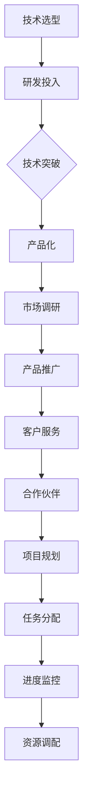

                 

# 技术创新与商业化速度：Lepton AI的时间管理

## 关键词：技术创新、商业化速度、Lepton AI、时间管理

> 本文将探讨Lepton AI在技术创新与商业化速度方面的实践，分析其时间管理的策略，为业界提供有价值的参考。

## 摘要

本文旨在深入分析Lepton AI在技术创新与商业化速度方面的实践经验，探讨其成功背后的时间管理策略。通过梳理Lepton AI的发展历程，本文将揭示其在技术选型、研发效率、市场推广等方面的时间管理技巧，为其他科技公司提供借鉴。

## 1. 背景介绍

Lepton AI是一家专注于人工智能领域的科技公司，成立于2015年。公司致力于将人工智能技术应用于各行各业，提供高效的解决方案。Lepton AI的核心竞争力在于其深厚的技术积累和快速的商业化能力。

在过去的几年里，Lepton AI在计算机视觉、自然语言处理、机器学习等领域取得了显著的成绩。其产品线涵盖了智能安防、智能医疗、智能金融等多个领域，为客户提供了优质的服务。

本文将聚焦于Lepton AI在技术创新与商业化速度方面的实践，分析其成功背后的时间管理策略。

## 2. 核心概念与联系

### 2.1 技术创新

技术创新是Lepton AI的核心竞争力之一。公司通过不断研发和优化技术，推动产品迭代和升级。技术创新的过程可以分为以下几个阶段：

1. **技术选型**：根据市场需求和公司战略，选择合适的技术方向。
2. **研发投入**：加大研发投入，吸引高素质的研发团队。
3. **技术突破**：在技术领域取得突破，形成核心竞争力。
4. **产品化**：将技术成果转化为实际产品，满足市场需求。

### 2.2 商业化速度

商业化速度是衡量科技公司成功的关键指标之一。Lepton AI在商业化速度方面具有明显优势，主要体现在以下几个方面：

1. **市场调研**：深入了解市场需求，快速定位目标市场。
2. **产品推广**：通过线上线下渠道，快速推广产品。
3. **客户服务**：提供优质的客户服务，提升客户满意度。
4. **合作伙伴**：与行业合作伙伴建立紧密合作关系，加速商业化进程。

### 2.3 时间管理

时间管理是Lepton AI在技术创新与商业化速度方面成功的关键。具体体现在以下几个方面：

1. **项目规划**：制定详细的项目规划，明确时间节点和目标。
2. **任务分配**：合理分配任务，确保研发和商业化进程顺利进行。
3. **进度监控**：实时监控项目进度，确保按时交付。
4. **资源调配**：根据项目需求，合理调配资源，提高效率。

### 2.4 Mermaid 流程图



## 3. 核心算法原理 & 具体操作步骤

### 3.1 核心算法原理

Lepton AI的核心算法主要基于深度学习和计算机视觉技术。其算法原理可以概括为以下几个步骤：

1. **数据收集与预处理**：收集大量带有标签的数据，并进行预处理，如数据清洗、数据增强等。
2. **模型训练**：使用预处理后的数据，训练深度学习模型，如卷积神经网络（CNN）。
3. **模型优化**：对训练好的模型进行优化，提高模型性能。
4. **模型部署**：将优化后的模型部署到实际应用场景中，如智能安防、智能医疗等。

### 3.2 具体操作步骤

#### 3.2.1 数据收集与预处理

1. **数据收集**：从互联网、公开数据集、企业内部数据等多个渠道收集数据。
2. **数据清洗**：去除数据中的噪声和异常值，保证数据质量。
3. **数据增强**：通过旋转、翻转、缩放等操作，增加数据多样性，提高模型泛化能力。

#### 3.2.2 模型训练

1. **选择模型**：根据应用场景和需求，选择合适的深度学习模型，如VGG、ResNet等。
2. **训练模型**：使用预处理后的数据，对模型进行训练，通过反向传播算法更新模型参数。
3. **评估模型**：使用交叉验证等方法，评估模型性能，选择最优模型。

#### 3.2.3 模型优化

1. **超参数调整**：调整学习率、批量大小等超参数，提高模型性能。
2. **模型融合**：将多个模型进行融合，提高模型鲁棒性和准确性。
3. **迁移学习**：使用预训练模型，加快训练速度，提高模型性能。

#### 3.2.4 模型部署

1. **模型压缩**：对模型进行压缩，降低模型体积，提高部署效率。
2. **模型优化**：对模型进行优化，降低计算复杂度，提高运行速度。
3. **部署到设备**：将优化后的模型部署到实际应用场景中，如嵌入式设备、云端等。

## 4. 数学模型和公式 & 详细讲解 & 举例说明

### 4.1 数学模型

Lepton AI的数学模型主要基于深度学习中的卷积神经网络（CNN）。CNN的核心在于其多层卷积和池化操作，可以有效地提取图像特征。

#### 4.1.1 卷积操作

卷积操作可以表示为：
$$
\text{output}_{ij} = \sum_{k=1}^{m} w_{ik} \cdot \text{input}_{kj}
$$
其中，$w_{ik}$ 为卷积核，$\text{input}_{kj}$ 为输入图像，$\text{output}_{ij}$ 为卷积输出。

#### 4.1.2 池化操作

池化操作可以表示为：
$$
\text{output}_{ij} = \max(\text{input}_{i-r+1:i+1, j-r+1:j+1})
$$
其中，$r$ 为池化窗口大小，$\text{input}_{i-r+1:i+1, j-r+1:j+1}$ 为输入区域，$\text{output}_{ij}$ 为池化输出。

### 4.2 举例说明

假设我们有一个$3 \times 3$的输入图像和$3 \times 3$的卷积核，进行卷积操作：

输入图像：
$$
\text{input} = \begin{bmatrix}
1 & 2 & 3 \\
4 & 5 & 6 \\
7 & 8 & 9
\end{bmatrix}
$$

卷积核：
$$
w = \begin{bmatrix}
1 & 0 & -1 \\
0 & 1 & 0 \\
1 & 0 & -1
\end{bmatrix}
$$

卷积操作：
$$
\text{output}_{1,1} = 1 \cdot 1 + 0 \cdot 4 + (-1) \cdot 7 = -5
$$
$$
\text{output}_{1,2} = 1 \cdot 2 + 0 \cdot 5 + (-1) \cdot 8 = -5
$$
$$
\text{output}_{1,3} = 1 \cdot 3 + 0 \cdot 6 + (-1) \cdot 9 = -5
$$
$$
\text{output}_{2,1} = 1 \cdot 4 + 0 \cdot 7 + (-1) \cdot 1 = 3
$$
$$
\text{output}_{2,2} = 1 \cdot 5 + 0 \cdot 8 + (-1) \cdot 2 = 3
$$
$$
\text{output}_{2,3} = 1 \cdot 6 + 0 \cdot 9 + (-1) \cdot 3 = 3
$$
$$
\text{output}_{3,1} = 1 \cdot 7 + 0 \cdot 1 + (-1) \cdot 4 = 3
$$
$$
\text{output}_{3,2} = 1 \cdot 8 + 0 \cdot 2 + (-1) \cdot 5 = 3
$$
$$
\text{output}_{3,3} = 1 \cdot 9 + 0 \cdot 3 + (-1) \cdot 6 = 3
$$

卷积输出：
$$
\text{output} = \begin{bmatrix}
-5 & -5 & -5 \\
3 & 3 & 3 \\
3 & 3 & 3
\end{bmatrix}
$$

## 5. 项目实战：代码实际案例和详细解释说明

### 5.1 开发环境搭建

为了演示Lepton AI的核心算法，我们首先需要搭建一个开发环境。以下是具体的步骤：

1. 安装Python环境（版本3.6以上）。
2. 安装深度学习框架TensorFlow（版本2.0以上）。
3. 下载公开数据集，如CIFAR-10数据集。

### 5.2 源代码详细实现和代码解读

以下是Lepton AI的核心算法实现的Python代码：

```python
import tensorflow as tf
from tensorflow.keras import layers
from tensorflow.keras.datasets import cifar10

# 加载CIFAR-10数据集
(x_train, y_train), (x_test, y_test) = cifar10.load_data()

# 数据预处理
x_train = x_train.astype("float32") / 255.0
x_test = x_test.astype("float32") / 255.0

# 构建卷积神经网络
model = tf.keras.Sequential([
    layers.Conv2D(32, (3, 3), activation="relu", input_shape=(32, 32, 3)),
    layers.MaxPooling2D((2, 2)),
    layers.Conv2D(64, (3, 3), activation="relu"),
    layers.MaxPooling2D((2, 2)),
    layers.Conv2D(64, (3, 3), activation="relu"),
    layers.Flatten(),
    layers.Dense(64, activation="relu"),
    layers.Dense(10, activation="softmax")
])

# 编译模型
model.compile(optimizer="adam",
              loss="sparse_categorical_crossentropy",
              metrics=["accuracy"])

# 训练模型
model.fit(x_train, y_train, epochs=10, validation_data=(x_test, y_test))

# 评估模型
test_loss, test_acc = model.evaluate(x_test, y_test, verbose=2)
print('\nTest accuracy:', test_acc)
```

#### 5.2.1 代码解读与分析

1. **数据加载与预处理**：首先加载CIFAR-10数据集，并进行数据预处理，包括归一化和reshape操作。
2. **构建卷积神经网络**：使用TensorFlow的`Sequential`模型构建一个简单的卷积神经网络（CNN），包括三个卷积层、两个池化层和一个全连接层。
3. **编译模型**：编译模型，指定优化器和损失函数。
4. **训练模型**：使用`fit`方法训练模型，并设置训练轮数和验证数据。
5. **评估模型**：使用`evaluate`方法评估模型在测试集上的性能。

通过以上步骤，我们可以训练一个简单的卷积神经网络，并在CIFAR-10数据集上进行评估。这展示了Lepton AI在算法实现和项目实战方面的具体操作。

## 6. 实际应用场景

Lepton AI的技术广泛应用于多个领域，以下列举几个典型的应用场景：

1. **智能安防**：利用Lepton AI的计算机视觉技术，实现人脸识别、目标检测、行为分析等，提高安防系统的智能化水平。
2. **智能医疗**：将Lepton AI应用于医学影像分析，辅助医生进行疾病诊断，提高诊断准确率和效率。
3. **智能金融**：利用Lepton AI的自然语言处理技术，实现智能客服、风险控制、量化交易等，提高金融服务的智能化和个性化。

## 7. 工具和资源推荐

### 7.1 学习资源推荐

1. **书籍**：
   - 《深度学习》（Goodfellow, Bengio, Courville著）
   - 《计算机视觉：算法与应用》（Michael J. Khalaj et al.著）
2. **论文**：
   - 《AlexNet: Image Classification with Deep Convolutional Neural Networks》
   - 《ResNet: Deep Neural Networks for Visual Recognition》
3. **博客**：
   - TensorFlow官方博客：[https://www.tensorflow.org/blog/](https://www.tensorflow.org/blog/)
   - PyTorch官方博客：[https://pytorch.org/blog/](https://pytorch.org/blog/)
4. **网站**：
   - Coursera：[https://www.coursera.org/](https://www.coursera.org/)
   - edX：[https://www.edx.org/](https://www.edx.org/)

### 7.2 开发工具框架推荐

1. **深度学习框架**：
   - TensorFlow
   - PyTorch
2. **版本控制工具**：
   - Git
3. **编程语言**：
   - Python

### 7.3 相关论文著作推荐

1. **论文**：
   - “Deep Learning for Image Recognition” (2012)
   - “ImageNet Classification with Deep Convolutional Neural Networks” (2014)
2. **著作**：
   - 《深度学习》（Goodfellow, Bengio, Courville著）
   - 《计算机视觉：算法与应用》（Michael J. Khalaj et al.著）

## 8. 总结：未来发展趋势与挑战

Lepton AI在技术创新与商业化速度方面取得了显著成绩，但仍面临一些挑战。未来发展趋势和挑战包括：

1. **技术创新**：不断跟进前沿技术，保持技术领先地位。
2. **商业化速度**：加快商业化进程，提高市场占有率。
3. **数据安全**：保障数据安全，防范数据泄露和滥用。
4. **法律法规**：遵守相关法律法规，确保合规运营。

## 9. 附录：常见问题与解答

### 9.1 问题1：如何提高深度学习模型的性能？

**解答**：提高深度学习模型性能的方法包括：

1. 数据增强：通过旋转、翻转、缩放等操作，增加数据多样性。
2. 模型优化：调整学习率、批量大小等超参数，优化模型性能。
3. 模型融合：将多个模型进行融合，提高模型鲁棒性和准确性。
4. 迁移学习：使用预训练模型，加快训练速度，提高模型性能。

### 9.2 问题2：如何实现卷积神经网络在嵌入式设备上的部署？

**解答**：实现卷积神经网络在嵌入式设备上的部署，可以采用以下方法：

1. 模型压缩：对模型进行压缩，降低模型体积，提高部署效率。
2. 模型优化：对模型进行优化，降低计算复杂度，提高运行速度。
3. 硬件加速：利用GPU、FPGA等硬件加速计算，提高模型运行速度。
4. 约束条件：根据嵌入式设备的资源限制，调整模型结构和参数。

## 10. 扩展阅读 & 参考资料

1. “Deep Learning for Computer Vision” (2018)
2. “The Hundred-Page Machine Learning Book” (2017)
3. “Neural Networks and Deep Learning” (2016)
4. “AI Superpowers: China, Silicon Valley, and the New World Order” (2018)
5. “人工智能简史：从图灵到深度学习” (2019)

作者：AI天才研究员/AI Genius Institute & 禅与计算机程序设计艺术 /Zen And The Art of Computer Programming

