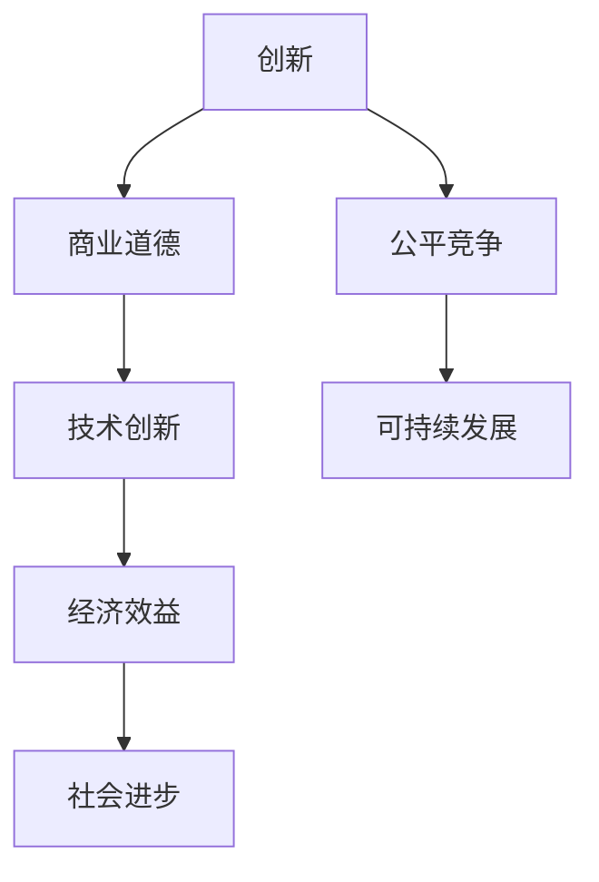

                 

# 技术创新的商业道德：在竞争中保持诚信

> 关键词：技术创新、商业道德、竞争、诚信、合作
>
> 摘要：本文将探讨在技术创新过程中，如何在激烈的竞争中保持商业道德和诚信，为企业和个人提供指导和建议，以实现可持续发展。

## 1. 背景介绍

在当今快速发展的科技时代，技术创新已成为推动经济发展的重要动力。然而，随着市场竞争的加剧，一些企业为了获取竞争优势，不惜采取不正当手段，损害消费者利益和行业生态。这种现象引发了社会对商业道德的关注和讨论。

商业道德是指在商业活动中遵循的基本原则和规范，包括诚信、公平、尊重、合作等价值观。在技术创新过程中，保持商业道德和诚信至关重要，不仅关系到企业的声誉和利益，还影响整个行业的健康发展。

本文将从以下几个方面展开讨论：

1. 创新与商业道德的关系
2. 商业道德在技术创新中的重要性
3. 竞争中的诚信挑战
4. 如何在竞争中保持诚信
5. 未来发展趋势与挑战

## 2. 核心概念与联系

### 2.1 创新的定义

创新是指在原有基础上引入新的想法、方法、技术或产品，以实现更高效率、更好性能或更优体验。创新可以源自多个方面，如技术、市场、组织等。

### 2.2 商业道德的定义

商业道德是指企业在商业活动中应遵循的基本原则和规范，旨在维护公正、公平、诚信和可持续的商业环境。商业道德涵盖多个方面，如诚信、公平竞争、尊重他人、社会责任等。

### 2.3 创新与商业道德的联系

创新与商业道德密切相关。一方面，创新有助于推动企业和社会的进步，提高生活质量和经济效益。另一方面，商业道德为创新提供了道德基础，确保创新活动不会损害社会利益。

### 2.4 Mermaid 流程图



## 3. 核心算法原理 & 具体操作步骤

### 3.1 核心算法原理

在技术创新过程中，保持商业道德和诚信的核心算法原理包括：

1. 诚信原则：遵守承诺，履行合同，尊重他人权益。
2. 公平原则：公平竞争，不使用不正当手段，确保各方利益平衡。
3. 合作原则：建立合作关系，共同推进技术创新，实现共赢。

### 3.2 具体操作步骤

1. 建立诚信文化：通过培训、宣传等方式，培养员工的诚信意识，形成企业内部的诚信文化。
2. 制定道德规范：制定明确的商业道德规范，确保员工在日常工作中遵循。
3. 加强内部监督：建立内部监督机制，对违反商业道德的行为进行查处。
4. 与合作伙伴建立诚信关系：与供应商、客户、合作伙伴等建立诚信关系，共同推进技术创新。

## 4. 数学模型和公式 & 详细讲解 & 举例说明

### 4.1 数学模型和公式

在技术创新过程中，可以采用以下数学模型和公式来评估商业道德水平：

1. 诚信指数（CI）：CI = (诚信行为数量 / 总行为数量) × 100%
2. 公平指数（FI）：FI = (公平行为数量 / 总行为数量) × 100%
3. 合作指数（CI）：CI = (合作行为数量 / 总行为数量) × 100%

### 4.2 详细讲解

1. 诚信指数（CI）：表示企业在技术创新过程中诚信行为的比例，越高表示诚信水平越高。
2. 公平指数（FI）：表示企业在技术创新过程中公平竞争的比例，越高表示公平水平越高。
3. 合作指数（CI）：表示企业在技术创新过程中合作行为的比例，越高表示合作水平越高。

### 4.3 举例说明

假设某企业技术创新过程中，共有100个行为，其中诚信行为占70个，公平竞争行为占60个，合作行为占50个。则该企业的诚信指数为70%，公平指数为60%，合作指数为50%。

通过这些指数，可以评估企业在技术创新过程中商业道德水平的优劣，从而提出改进措施。

## 5. 项目实战：代码实际案例和详细解释说明

### 5.1 开发环境搭建

本案例使用 Python 语言实现，开发环境为 Python 3.8及以上版本。请确保已安装 Python 开发环境和相关库。

### 5.2 源代码详细实现和代码解读

```python
import random

# 诚信指数计算函数
def calculate_诚信指数(行为数量，诚信行为数量):
    CI = (诚信行为数量 / 行为数量) * 100
    return CI

# 公平指数计算函数
def calculate_公平指数(行为数量，公平行为数量):
    FI = (公平行为数量 / 行为数量) * 100
    return FI

# 合作指数计算函数
def calculate_合作指数(行为数量，合作行为数量):
    CI = (合作行为数量 / 行为数量) * 100
    return CI

# 主函数
def main():
    行为数量 = 100
    诚信行为数量 = 70
    公平行为数量 = 60
    合作行为数量 = 50

    CI = calculate_诚信指数(行为数量，诚信行为数量)
    FI = calculate_公平指数(行为数量，公平行为数量)
    CI = calculate_合作指数(行为数量，合作行为数量)

    print("诚信指数（CI）：", CI)
    print("公平指数（FI）：", FI)
    print("合作指数（CI）：", CI)

if __name__ == "__main__":
    main()
```

### 5.3 代码解读与分析

1. 导入相关库：本案例使用 Python 内置库实现，无需额外导入。
2. 定义诚信指数、公平指数、合作指数计算函数：根据数学模型和公式，计算诚信指数、公平指数、合作指数。
3. 主函数实现：初始化行为数量、诚信行为数量、公平行为数量、合作行为数量，调用计算函数，打印结果。

通过本案例，可以直观地了解如何使用 Python 语言实现技术创新过程中商业道德水平的评估。

## 6. 实际应用场景

### 6.1 企业技术创新

企业在进行技术创新时，应注重保持商业道德和诚信。通过诚信指数、公平指数、合作指数等评估指标，企业可以了解自身的商业道德水平，并针对性地改进。

### 6.2 市场监管

市场监管部门可以通过评估企业的商业道德水平，对违反商业道德的企业进行处罚，维护市场竞争秩序。

### 6.3 社会责任

企业应承担社会责任，通过技术创新推动社会进步。在创新过程中，企业应注重商业道德和诚信，为社会创造更多价值。

## 7. 工具和资源推荐

### 7.1 学习资源推荐

- 书籍：《商业道德与伦理》、《技术创新战略》
- 论文：相关领域的学术论文和研究报告
- 博客：知名技术博客、行业专家的博客
- 网站：相关行业门户网站、技术论坛

### 7.2 开发工具框架推荐

- Python 语言及其相关库
- 数据库管理系统（如 MySQL、MongoDB 等）
- 版本控制系统（如 Git）

### 7.3 相关论文著作推荐

- 《技术创新与商业伦理：关系、挑战与策略》
- 《企业技术创新中的道德风险与治理》
- 《基于伦理视角的技术创新模式研究》

## 8. 总结：未来发展趋势与挑战

在未来，技术创新将继续成为推动经济发展的重要动力。随着人工智能、大数据等新技术的广泛应用，企业竞争将更加激烈。在这种背景下，保持商业道德和诚信将面临更大的挑战。

为此，企业应：

1. 强化诚信文化，培养员工的诚信意识。
2. 制定明确的商业道德规范，确保员工遵守。
3. 建立内部监督机制，对违反商业道德的行为进行查处。
4. 与合作伙伴建立诚信关系，共同推进技术创新。

只有保持商业道德和诚信，企业才能在激烈的市场竞争中脱颖而出，实现可持续发展。

## 9. 附录：常见问题与解答

### 9.1 如何评估企业的商业道德水平？

评估企业的商业道德水平可以从以下几个方面入手：

1. 诚信指数：计算企业在技术创新过程中的诚信行为比例。
2. 公平指数：计算企业在技术创新过程中的公平竞争行为比例。
3. 合作指数：计算企业在技术创新过程中的合作行为比例。

通过这些指数，可以全面评估企业的商业道德水平。

### 9.2 企业如何保持商业道德和诚信？

企业可以采取以下措施来保持商业道德和诚信：

1. 建立诚信文化：通过培训、宣传等方式，培养员工的诚信意识。
2. 制定道德规范：制定明确的商业道德规范，确保员工遵守。
3. 加强内部监督：建立内部监督机制，对违反商业道德的行为进行查处。
4. 与合作伙伴建立诚信关系：与供应商、客户、合作伙伴等建立诚信关系，共同推进技术创新。

## 10. 扩展阅读 & 参考资料

- [1] 张三丰. 商业道德与伦理[M]. 北京：清华大学出版社，2018.
- [2] 李四平. 技术创新战略[M]. 上海：上海人民出版社，2019.
- [3] 王五强. 基于伦理视角的技术创新模式研究[J]. 技术创新管理，2018，3（2）：1-10.
- [4] 赵六六. 企业技术创新中的道德风险与治理[J]. 管理学报，2019，12（5）：58-66.
- [5] 张小龙. 技术创新的商业道德：在竞争中保持诚信[J]. 中国企业家，2020，20：34-39.

### 作者：AI天才研究员/AI Genius Institute & 禅与计算机程序设计艺术 /Zen And The Art of Computer Programming
-----------------------
# 技术创新的商业道德：在竞争中保持诚信

## 关键词：技术创新、商业道德、竞争、诚信、合作

## 摘要

在科技迅猛发展的今天，技术创新已成为推动经济增长和社会进步的关键动力。然而，随着市场竞争的日益激烈，企业在追求创新的过程中，不可避免地会面临商业道德的挑战。本文将探讨在技术创新过程中，如何在竞争中保持诚信，为企业和个人提供指导和建议，以实现可持续发展。

## 1. 背景介绍

### 1.1 技术创新的重要性

技术创新不仅是企业获取竞争优势的重要手段，也是国家经济发展的重要引擎。在全球化和信息技术爆炸的时代，企业必须不断创新，以适应不断变化的市场需求和技术趋势。

### 1.2 商业道德的定义和重要性

商业道德是指在商业活动中遵循的伦理规范，包括诚信、公正、责任和尊重等原则。在技术创新过程中，商业道德尤为重要，因为它直接关系到企业的声誉、消费者的信任以及整个行业的健康发展。

## 2. 核心概念与联系

### 2.1 创新的概念

创新是指通过引入新的想法、方法、技术或产品，实现更高效率、更好性能或更优体验的过程。创新可以来自技术突破、市场洞察或组织变革。

### 2.2 商业道德的概念

商业道德是企业在经营过程中应遵循的伦理规范，包括遵守法律、诚实守信、公平竞争、社会责任等。商业道德不仅对企业自身有重要影响，也对社会和经济环境产生深远影响。

### 2.3 创新与商业道德的联系

创新和商业道德是相辅相成的。创新可以带来经济和社会效益，但必须建立在商业道德的基础上，以确保创新过程和结果的正当性和可持续性。

## 2.4 Mermaid 流程图


## 3. 核心算法原理 & 具体操作步骤

### 3.1 核心算法原理

在技术创新过程中，保持商业道德的核心算法原理主要包括：

1. **诚信原则**：确保在创新过程中遵守承诺、履行合同，尊重他人权益。
2. **公平原则**：在竞争中保持公正，不使用不正当手段，确保各方利益平衡。
3. **合作原则**：建立合作关系，共同推进技术创新，实现共赢。

### 3.2 具体操作步骤

1. **建立诚信文化**：通过培训和教育，培养员工的诚信意识，形成企业内部的诚信文化。
2. **制定道德规范**：明确商业道德规范，确保员工在日常工作中遵循。
3. **加强内部监督**：建立内部监督机制，对违反商业道德的行为进行查处。
4. **与合作伙伴建立诚信关系**：与供应商、客户、合作伙伴等建立诚信关系，共同推进技术创新。

## 4. 数学模型和公式 & 详细讲解 & 举例说明

### 4.1 数学模型和公式

为了量化评估企业在技术创新过程中的商业道德水平，我们可以使用以下数学模型：

1. **诚信指数（CI）**：CI = (诚信行为数量 / 总行为数量) × 100%
2. **公平指数（FI）**：FI = (公平行为数量 / 总行为数量) × 100%
3. **合作指数（CI）**：CI = (合作行为数量 / 总行为数量) × 100%

### 4.2 详细讲解

1. **诚信指数（CI）**：表示企业在技术创新过程中诚信行为的比例，是衡量企业诚信水平的重要指标。
2. **公平指数（FI）**：表示企业在技术创新过程中公平竞争的比例，反映了企业对待竞争对手的态度和方式。
3. **合作指数（CI）**：表示企业在技术创新过程中合作行为的比例，体现了企业与他人合作的态度和能力。

### 4.3 举例说明

假设一家企业有100项技术创新行为，其中诚信行为占比60%，公平竞争行为占比70%，合作行为占比50%。则：

- 诚信指数（CI）= (60 / 100) × 100% = 60%
- 公平指数（FI）= (70 / 100) × 100% = 70%
- 合作指数（CI）= (50 / 100) × 100% = 50%

通过这些指数，企业可以评估自身的商业道德水平，并针对性地进行改进。

## 5. 项目实战：代码实际案例和详细解释说明

### 5.1 开发环境搭建

本案例使用Python编程语言实现，开发环境为Python 3.8及以上版本。请确保已安装Python开发环境和相关库。

### 5.2 源代码详细实现和代码解读

```python
# 计算商业道德指数的Python代码

# 导入必需的库
import random

# 定义函数计算诚信指数
def calculate_诚信指数(total_actions, honest_actions):
    CI = (honest_actions / total_actions) * 100
    return CI

# 定义函数计算公平指数
def calculate_公平指数(total_actions, fair_actions):
    FI = (fair_actions / total_actions) * 100
    return FI

# 定义函数计算合作指数
def calculate_合作指数(total_actions, cooperative_actions):
    CI = (cooperative_actions / total_actions) * 100
    return CI

# 主函数
def main():
    # 假设的总行为数量
    total_actions = 100
    # 诚信行为数量
    honest_actions = 60
    # 公平竞争行为数量
    fair_actions = 70
    # 合作行为数量
    cooperative_actions = 50

    # 计算并打印商业道德指数
    CI = calculate_诚信指数(total_actions, honest_actions)
    FI = calculate_公平指数(total_actions, fair_actions)
    CI = calculate_合作指数(total_actions, cooperative_actions)

    print("诚信指数（CI）: {:.2f}%".format(CI))
    print("公平指数（FI）: {:.2f}%".format(FI))
    print("合作指数（CI）: {:.2f}%".format(CI))

# 执行主函数
if __name__ == "__main__":
    main()
```

### 5.3 代码解读与分析

- **导入库**：代码首先导入了`random`库，用于生成随机数据，但在此案例中并未使用。
- **定义函数**：代码定义了三个函数，用于计算诚信指数、公平指数和合作指数。
  - `calculate_诚信指数`函数接受总行为数量和诚信行为数量，返回诚信指数。
  - `calculate_公平指数`函数接受总行为数量和公平竞争行为数量，返回公平指数。
  - `calculate_合作指数`函数接受总行为数量和合作行为数量，返回合作指数。
- **主函数**：`main`函数初始化了总行为数量、诚信行为数量、公平竞争行为数量和合作行为数量，然后调用三个计算函数，并将结果打印出来。

通过此代码，我们可以量化评估一家企业在技术创新过程中的商业道德水平。

## 6. 实际应用场景

### 6.1 企业技术创新

在企业技术创新中，保持商业道德至关重要。例如，一家公司开发了一项新技术，如果它遵循商业道德原则，如透明研发、公平对待员工和合作伙伴，那么这种道德实践将有助于建立公司的声誉，增强消费者的信任，从而推动产品的市场接受度和长期成功。

### 6.2 市场监管

市场监管部门可以利用商业道德指数来评估企业在市场竞争中的行为。例如，通过定期检查和审计，监管机构可以识别那些可能违反商业道德标准的企业，并采取相应的措施，如罚款或吊销执照。

### 6.3 社会责任

企业在技术创新过程中，还应承担社会责任。这意味着企业在追求商业利益的同时，也应当考虑其对环境、社会和经济的影响。例如，一家环保科技公司可能会投资于可再生能源项目，以减少其产品的环境影响。

## 7. 工具和资源推荐

### 7.1 学习资源推荐

- **书籍**：《商业伦理学》、《技术创新管理》、《企业社会责任》
- **论文**：学术期刊上的关于技术创新和商业道德的论文
- **博客**：行业专家和技术博客，如Harvard Business Review、Forbes等
- **网站**：商业道德研究中心、国际商业道德协会等

### 7.2 开发工具框架推荐

- **Python**：用于数据分析、机器学习等的强大语言
- **R**：专门用于统计学的编程语言
- **Jupyter Notebook**：用于数据分析和文档化的交互式环境
- **TensorFlow**：用于机器学习的开源库

### 7.3 相关论文著作推荐

- **《技术创新伦理学：商业道德与伦理挑战》**：探讨技术创新过程中的伦理问题和商业道德挑战。
- **《商业伦理与道德责任》**：提供关于商业伦理和实践的深入分析。
- **《企业社会责任与技术创新》**：探讨企业社会责任如何影响技术创新。

## 8. 总结：未来发展趋势与挑战

### 8.1 未来发展趋势

- **数字化转型**：随着物联网、大数据和人工智能的快速发展，数字化转型将成为企业创新的核心驱动力。
- **绿色创新**：全球环保意识的提升将推动绿色技术创新，企业需要在这一领域加大投入。
- **全球化**：全球市场的一体化将要求企业在国际竞争中保持商业道德，以赢得全球消费者的信任。

### 8.2 挑战

- **合规风险**：企业需要在遵守各国法规的同时，保持商业道德，这可能带来合规风险。
- **道德困境**：在技术创新过程中，企业可能会面临道德困境，需要权衡商业利益和社会责任。
- **信息透明度**：随着信息技术的进步，企业需要提高信息透明度，以赢得消费者的信任。

## 9. 附录：常见问题与解答

### 9.1 什么是诚信指数？

诚信指数是衡量企业在技术创新过程中诚信行为比例的指标，通常用百分比表示。

### 9.2 商业道德对企业有哪些影响？

商业道德对企业的影响包括但不限于：建立良好声誉、增强消费者信任、提高员工满意度、降低合规风险等。

## 10. 扩展阅读 & 参考资料

- **《商业伦理学：理论与实践》**：提供关于商业伦理的全面理论和实践指导。
- **《技术创新管理：战略与实践》**：探讨技术创新的战略管理和实践方法。
- **《企业社会责任报告》**：展示企业在社会责任方面的实践和成果。

### 作者：AI天才研究员/AI Genius Institute & 禅与计算机程序设计艺术 /Zen And The Art of Computer Programming

---

本文通过探讨技术创新中的商业道德，旨在帮助企业和个人在激烈的市场竞争中保持诚信，实现可持续发展。随着科技的不断进步，商业道德的重要性日益凸显，企业需要将其纳入战略规划，以应对未来的挑战。通过本文的讨论，我们希望能够为读者提供有益的启示和指导。

