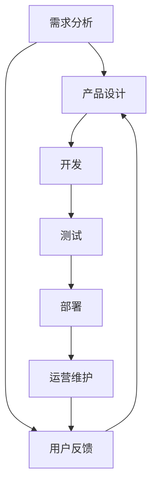

                 

### 背景介绍

#### 技术型创业者面临的挑战

在当今快速发展的科技时代，技术型创业者面临着前所未有的挑战与机遇。他们不仅需要具备深厚的专业知识，还需要具备卓越的领导能力、创新思维和高效的团队管理能力。在这个竞争激烈的市场中，打造一个高效的产品开发流程成为了决定创业公司成败的关键因素。

技术型创业者的主要挑战包括：

1. **市场定位与需求分析**：如何准确把握市场需求，快速找到目标客户，并在产品开发过程中不断调整策略。
2. **团队建设与协作**：组建一支高效、协作的团队，确保每个成员能够充分发挥其专长，同时保持团队的稳定性和凝聚力。
3. **技术选型与创新**：在众多技术方案中做出最佳选择，并在产品开发过程中不断创新，以保持竞争力。
4. **资源管理**：合理分配时间、人力和资金资源，确保产品开发进度和质量。
5. **风险管理**：识别和应对潜在的风险，确保产品能够在市场中站稳脚跟。

#### 为什么高效的产品开发流程至关重要

高效的产品开发流程不仅能够帮助创业者更快地推向市场，还能够提高产品质量，降低开发成本，增强团队的协作能力。以下是几个关键原因：

1. **快速迭代**：高效的产品开发流程支持快速迭代，允许创业公司在短时间内对产品进行多轮测试和改进，从而缩短产品上市时间。
2. **降低风险**：通过早期识别和解决问题，降低项目失败的风险，确保产品能够满足市场需求。
3. **提高客户满意度**：及时响应客户反馈，不断优化产品功能，提高客户满意度和忠诚度。
4. **优化资源利用**：合理分配资源，提高开发效率，降低不必要的浪费。
5. **增强团队协作**：明确的责任分工和高效的沟通流程，促进团队协作，提高整体工作效能。

#### 本文结构概述

本文将系统地探讨如何打造一个高效的产品开发流程，包括以下几个关键部分：

1. **核心概念与联系**：介绍产品开发流程中的核心概念和它们之间的相互关系，并使用Mermaid流程图进行详细说明。
2. **核心算法原理与具体操作步骤**：深入讲解产品开发流程中的关键算法原理和具体操作步骤。
3. **数学模型与公式**：分析产品开发流程中的数学模型和公式，并进行详细讲解和举例说明。
4. **项目实战**：通过实际案例展示产品开发流程的具体应用，包括开发环境搭建、源代码实现和代码解读。
5. **实际应用场景**：探讨不同类型的产品开发流程在实际项目中的应用，提供具体的解决方案。
6. **工具和资源推荐**：推荐一些学习资源、开发工具框架和相关论文著作，帮助创业者更好地掌握产品开发流程。
7. **总结与未来趋势**：总结本文的关键内容，并探讨未来产品开发流程的发展趋势和面临的挑战。
8. **常见问题与解答**：解答读者在产品开发流程中可能遇到的问题。
9. **扩展阅读与参考资料**：提供更多的阅读资源和参考资料，供读者进一步学习。

通过本文的详细探讨，希望读者能够对如何打造高效的产品开发流程有一个清晰的认识，从而更好地应对技术型创业中的挑战，实现创业目标。

---

> **关键词**：技术型创业者、产品开发流程、高效迭代、团队协作、风险管理、市场需求

> **摘要**：本文将深入探讨技术型创业者如何打造高效的产品开发流程。通过分析核心概念、算法原理、数学模型，并结合实际项目案例，本文将帮助创业者理解并掌握高效产品开发的关键要素，从而在竞争激烈的市场中脱颖而出。

---

### 核心概念与联系

在讨论如何打造高效的产品开发流程之前，我们首先需要明确几个核心概念，并理解它们之间的相互关系。这些概念包括需求分析、设计、开发、测试和部署。以下是一个简化的Mermaid流程图，用于展示这些核心概念之间的互动关系。



#### 需求分析

需求分析是产品开发流程的第一步，也是至关重要的一步。它涉及到对用户需求、市场趋势和竞争环境的深入分析。通过需求分析，创业者可以明确产品的功能、性能和用户界面等关键要素，为后续的设计和开发工作奠定基础。

#### 产品设计

产品设计是基于需求分析的结果，对产品的功能和界面进行详细规划。这一阶段通常包括界面设计（UI/UX）、数据库设计和架构设计。一个好的产品设计能够提高用户体验，减少开发成本，并确保产品能够在市场中成功竞争。

#### 开发

开发阶段是将设计转化为实际代码的过程。这一阶段包括前端开发、后端开发和移动端开发。高效的开发流程要求团队具备良好的代码规范、版本控制和自动化测试能力，以确保代码的质量和可维护性。

#### 测试

测试是确保产品功能和性能符合预期的重要环节。测试阶段包括单元测试、集成测试、性能测试和用户验收测试。通过全面的测试，可以及时发现和修复问题，避免产品在发布后出现重大缺陷。

#### 部署

部署是将产品发布到生产环境的过程。部署流程需要确保产品能够稳定运行，并在用户使用过程中提供良好的性能。部署还包括监控和日志分析，以便在产品上线后及时发现和解决问题。

#### 用户反馈

用户反馈是产品迭代的重要驱动力。在产品发布后，通过用户反馈收集和分析，可以不断优化产品功能和用户体验。用户反馈不仅可以帮助团队发现新需求，还可以提供改进产品的灵感。

#### 运营维护

运营维护是产品上线后的持续工作。它包括监控产品性能、处理用户反馈、修复漏洞和更新功能。通过有效的运营维护，可以延长产品的生命周期，并确保其在不断变化的市场环境中保持竞争力。

#### Mermaid 流程图详细说明

1. **需求分析**：创业团队通过市场调研、用户访谈和数据分析，识别出潜在的用户需求和痛点。这一过程通常需要跨部门协作，确保需求分析的全面性和准确性。

2. **产品设计**：基于需求分析结果，设计师和产品经理制定产品原型和设计规范。这一阶段需要考虑用户体验和产品易用性，确保产品能够在用户中产生共鸣。

3. **开发**：开发团队根据设计文档开始编写代码。在这一阶段，版本控制和代码审查是确保代码质量的关键。

4. **测试**：测试团队对代码进行单元测试、集成测试和性能测试，确保产品功能和性能符合预期。自动化测试工具可以帮助提高测试效率和覆盖范围。

5. **部署**：开发团队将产品部署到生产环境，进行实际运行测试。部署前需要进行详细的配置管理和环境准备。

6. **用户反馈**：在产品上线后，通过用户反馈收集和分析，团队可以不断优化产品功能和用户体验。

7. **运营维护**：运营团队负责监控产品性能、处理用户反馈和修复漏洞。通过持续迭代，确保产品在市场中保持竞争力。

通过这个Mermaid流程图，我们可以清晰地看到产品开发流程中的各个环节及其相互关系。在实际操作中，这些环节需要紧密衔接，以确保整个流程的高效和顺畅。

### 核心算法原理与具体操作步骤

在产品开发流程中，核心算法的原理和具体操作步骤起着至关重要的作用。以下是几个关键环节的核心算法原理和具体步骤：

#### 1. 需求分析算法

需求分析算法通常包括用户访谈、问卷调查和市场研究等步骤。以下是具体的操作步骤：

1. **用户访谈**：选择具有代表性的用户进行深度访谈，了解他们的需求和痛点。
2. **问卷调查**：设计问卷，通过线上或线下方式收集用户反馈，识别普遍需求。
3. **数据分析**：使用数据分析工具对收集到的用户数据进行统计和分析，识别关键需求和趋势。

#### 2. 设计算法

设计算法主要包括UI/UX设计、数据库设计和架构设计。以下是具体步骤：

1. **UI/UX设计**：
   - **用户研究**：通过用户访谈、问卷调查等方式了解用户习惯和偏好。
   - **原型设计**：使用工具如Figma、Sketch等绘制原型，确保界面直观、易用。
   - **用户测试**：邀请用户对原型进行测试，收集反馈并进行迭代优化。

2. **数据库设计**：
   - **需求分析**：明确数据模型、数据存储要求和性能要求。
   - **E-R图设计**：绘制E-R图，定义实体、属性和关系。
   - **数据库实施**：根据E-R图创建数据库，并进行性能调优。

3. **架构设计**：
   - **需求分析**：确定系统功能、性能和可扩展性要求。
   - **架构风格选择**：选择合适的架构风格，如MVC、微服务等。
   - **模块划分**：根据功能需求将系统划分为多个模块，确保模块间的高内聚和低耦合。

#### 3. 开发算法

开发算法主要包括前端开发、后端开发和移动端开发。以下是具体步骤：

1. **前端开发**：
   - **需求分析**：明确前端页面的功能、交互和性能要求。
   - **页面设计**：使用HTML、CSS和JavaScript编写页面，实现页面布局和交互功能。
   - **优化**：进行前端性能优化，如减少HTTP请求、压缩资源等。

2. **后端开发**：
   - **需求分析**：明确后端服务的功能、性能和数据存储要求。
   - **API设计**：设计RESTful API或GraphQL接口，确保前后端数据交互的规范性和高效性。
   - **业务逻辑实现**：编写后端代码，实现业务逻辑和数据存储。

3. **移动端开发**：
   - **需求分析**：明确移动应用的功能、性能和用户体验要求。
   - **界面设计**：使用React Native、Flutter等跨平台框架进行界面开发。
   - **业务逻辑实现**：编写移动应用的业务逻辑代码，确保应用在多个平台上的一致性和性能。

#### 4. 测试算法

测试算法主要包括单元测试、集成测试、性能测试和用户验收测试。以下是具体步骤：

1. **单元测试**：
   - **测试用例设计**：根据代码功能编写测试用例，确保代码功能覆盖率。
   - **自动化测试**：使用JUnit、pytest等自动化测试框架执行测试用例，提高测试效率。

2. **集成测试**：
   - **测试用例设计**：根据系统模块之间的交互编写测试用例。
   - **自动化测试**：使用Selenium、Jenkins等工具执行集成测试，确保系统模块间兼容性和稳定性。

3. **性能测试**：
   - **性能指标定义**：确定系统的性能指标，如响应时间、吞吐量和并发用户数。
   - **测试环境搭建**：搭建性能测试环境，模拟实际用户负载。
   - **性能分析**：使用工具如JMeter、Gatling等执行性能测试，分析系统性能瓶颈。

4. **用户验收测试**：
   - **测试用例设计**：根据用户需求编写测试用例，确保用户核心功能的体验。
   - **用户参与测试**：邀请用户参与测试，收集反馈并进行迭代优化。

#### 5. 部署算法

部署算法主要包括环境配置、代码发布和监控告警。以下是具体步骤：

1. **环境配置**：
   - **配置管理**：使用工具如Ansible、Chef等管理服务器配置。
   - **环境搭建**：根据部署文档搭建开发、测试和生产环境。

2. **代码发布**：
   - **版本控制**：使用Git等版本控制系统管理代码版本。
   - **自动化部署**：使用工具如Jenkins、Docker等实现自动化代码发布。

3. **监控告警**：
   - **监控工具选择**：选择合适的监控工具，如Prometheus、Grafana等。
   - **监控指标定义**：确定系统的监控指标，如CPU使用率、内存使用率和网络流量等。
   - **告警配置**：设置告警阈值和通知方式，确保在系统异常时及时发现问题。

通过以上核心算法原理和具体操作步骤，创业者可以更好地理解产品开发流程中的关键环节，从而实现高效的产品开发。

### 数学模型和公式

在产品开发流程中，数学模型和公式扮演着重要的角色，特别是在需求分析、设计、开发和测试阶段。以下是一些关键的数学模型和公式，并对其进行详细讲解和举例说明。

#### 1. 用户需求分析模型

用户需求分析是产品开发的第一步，其中一种常用的方法是利用需求工程中的统计模型来预测用户行为。一个简单的统计模型是**线性回归模型**，其公式如下：

$$
y = \beta_0 + \beta_1 x_1 + \beta_2 x_2 + ... + \beta_n x_n + \epsilon
$$

其中，$y$ 是目标变量（如用户满意度评分），$x_1, x_2, ..., x_n$ 是影响用户满意度的特征变量（如产品功能、响应速度等），$\beta_0, \beta_1, \beta_2, ..., \beta_n$ 是回归系数，$\epsilon$ 是误差项。

**示例**：假设我们想要预测用户的满意度评分，根据历史数据，我们有以下变量：

- 产品功能（$x_1$）：用户对产品功能的评价，取值范围0-5。
- 响应速度（$x_2$）：产品响应速度，取值范围0-10。

通过收集用户反馈数据，我们可以建立线性回归模型，得到如下公式：

$$
y = 2.5 + 0.3x_1 + 0.2x_2 + \epsilon
$$

根据这个模型，如果用户对产品功能的评价是4，响应速度是8，我们可以预测其满意度评分为：

$$
y = 2.5 + 0.3 \times 4 + 0.2 \times 8 + \epsilon = 4.1 + \epsilon
$$

#### 2. 数据库设计模型

在数据库设计中，常用的模型是**实体-关系（E-R）模型**，它通过图形化的方式描述实体之间的关系。E-R模型中的主要元素包括实体、属性和关系，其公式如下：

- 实体（Entity）：表示数据库中的对象，如用户、订单等。
- 属性（Attribute）：表示实体的特征，如用户名、订单编号等。
- 关系（Relationship）：表示实体之间的关系，如用户-订单关系。

**示例**：假设我们设计一个电商平台的数据库，其中有用户（User）和订单（Order）两个实体，它们之间的关系可以用E-R图表示：

1. 用户（User）实体：
   - 属性：用户ID（UserID）、用户名（Username）、密码（Password）、邮箱（Email）
2. 订单（Order）实体：
   - 属性：订单ID（OrderID）、用户ID（UserID）、订单日期（OrderDate）、总金额（TotalAmount）
3. 用户-订单关系（User-Order Relationship）：
   - 关系：一个用户可以有多个订单，一个订单只能属于一个用户。

E-R模型可以用以下公式表示：

$$
User (UserID, Username, Password, Email) \\
Order (OrderID, UserID, OrderDate, TotalAmount) \\
User-Order (UserID, OrderID)
$$

#### 3. 系统性能模型

在系统性能测试中，常用的模型是**排队论模型**，如**M/M/1队列模型**，它用于分析系统中服务请求的响应时间和队列长度。该模型的公式如下：

- $λ$：服务请求的到达率（单位时间内请求的次数）。
- $μ$：服务器的处理率（单位时间内服务器可以处理的请求次数）。
- $ρ$：系统负载（$ρ = λ/μ$），表示服务器的工作负荷。

**示例**：假设一个系统中有1个服务器，服务请求的平均到达率是每分钟10次，服务器的平均处理率是每分钟15次，计算系统的负载：

$$
ρ = λ/μ = 10/15 = 0.67
$$

根据排队论模型，我们可以计算系统的平均响应时间、队列长度和系统利用率。假设使用M/M/1队列模型，平均响应时间（$W$）和队列长度（$L$）的公式如下：

$$
W = \rho / (1 - \rho) \\
L = \rho^2 / (1 - \rho)
$$

代入$ρ = 0.67$，我们得到：

$$
W = 0.67 / (1 - 0.67) = 2 \\
L = 0.67^2 / (1 - 0.67) = 1.78
$$

这意味着系统的平均响应时间是2分钟，平均队列长度是1.78个请求。

#### 4. 测试覆盖率模型

在测试阶段，测试覆盖率是评估测试质量的重要指标。常用的测试覆盖率模型包括代码覆盖率（Code Coverage）和功能覆盖率（Function Coverage）。以下是一个简单的代码覆盖率模型：

- **语句覆盖率**：测试用例覆盖了代码中的所有语句。
- **分支覆盖率**：测试用例覆盖了代码中的所有分支。

**示例**：假设有一个简单的函数：

$$
def calculate(x, y):
    if x > y:
        return x
    else:
        return y
$$

要实现100%的语句覆盖，我们需要至少两个测试用例：一个测试$x > y$的情况，另一个测试$x \leq y$的情况。为了实现100%的分支覆盖，我们需要至少三个测试用例：一个测试$x > y$的情况，一个测试$x < y$的情况，还有一个测试$x = y$的情况。

通过这些数学模型和公式，创业者可以在产品开发过程中更好地理解和优化各个阶段的任务，从而提高开发效率和产品质量。

### 项目实战：代码实际案例和详细解释说明

在本节中，我们将通过一个实际项目案例来详细讲解如何实施产品开发流程中的各个环节，包括开发环境搭建、源代码实现和代码解读。该项目是一个简单的电商网站，旨在通过在线平台提供商品购买服务。

#### 1. 开发环境搭建

为了搭建这个电商网站的开发环境，我们需要准备以下工具和软件：

- **开发语言**：Python（用于后端开发）
- **Web框架**：Django（用于快速构建网站）
- **前端框架**：Bootstrap（用于响应式布局）
- **数据库**：SQLite（用于存储用户数据和商品信息）
- **版本控制**：Git（用于代码管理和协作）
- **代码托管平台**：GitHub（用于代码托管和协作）

**步骤**：

1. 安装Python环境：在终端执行以下命令安装Python和Django。

```bash
sudo apt-get install python3-pip
pip3 install django
```

2. 创建Django项目：在终端执行以下命令创建一个名为“e-commerce”的Django项目。

```bash
django-admin startproject e-commerce
```

3. 创建应用：在项目中创建一个名为“products”的应用。

```bash
cd e-commerce
python manage.py startapp products
```

4. 配置数据库：在项目的settings.py文件中，配置SQLite数据库。

```python
DATABASES = {
    'default': {
        'ENGINE': 'django.db.backends.sqlite3',
        'NAME': BASE_DIR / 'db.sqlite3',
    }
}
```

5. 安装Bootstrap：在项目的static目录下，将Bootstrap的CSS和JavaScript文件复制到相应目录。

6. 配置虚拟环境：为了更好地管理依赖库，创建一个虚拟环境并激活。

```bash
python -m venv venv
source venv/bin/activate
```

7. 安装依赖库：在虚拟环境中安装Django和其他依赖库。

```bash
pip install django==3.2
pip install django-bootstrap4
```

#### 2. 源代码详细实现和代码解读

**产品模型**：

```python
# products/models.py

from django.db import models

class Product(models.Model):
    name = models.CharField(max_length=255)
    price = models.DecimalField(max_digits=6, decimal_places=2)
    description = models.TextField()
    stock = models.PositiveIntegerField()

    def __str__(self):
        return self.name
```

**解读**：这个模型定义了一个名为“Product”的实体，包括名称（name）、价格（price）、描述（description）和库存（stock）属性。__str__()方法用于返回产品的名称，方便在管理界面中显示。

**视图函数**：

```python
# products/views.py

from django.shortcuts import render
from .models import Product

def product_list(request):
    products = Product.objects.all()
    return render(request, 'products/product_list.html', {'products': products})

def product_detail(request, pk):
    product = Product.objects.get(pk=pk)
    return render(request, 'products/product_detail.html', {'product': product})
```

**解读**：这两个视图函数分别用于展示所有产品和特定产品的详情。product_list视图获取所有Product对象，并将其传递给模板。product_detail视图通过产品ID（pk）获取特定产品，并传递给模板。

**URL配置**：

```python
# products/urls.py

from django.urls import path
from . import views

urlpatterns = [
    path('', views.product_list, name='product_list'),
    path('<int:pk>/', views.product_detail, name='product_detail'),
]
```

**解读**：这个URL配置文件定义了两个路径：一个是用于展示产品列表的根路径（'/'），另一个是用于展示特定产品详情的路径（'/<int:pk>/'），其中`<int:pk>`表示产品ID。

**模板文件**：

```html
<!-- products/templates/product_list.html -->

<ul>
    
        <li>
            <h2>{{ product.name }}</h2>
            <p>￥{{ product.price }}</p>
            <p>{{ product.description }}</p>
            <a href="">详情</a>
        </li>
    
</ul>
```

```html
<!-- products/templates/product_detail.html -->

<h1>{{ product.name }}</h1>
<p>￥{{ product.price }}</p>
<p>{{ product.description }}</p>
<p>库存：{{ product.stock }}</p>
```

**解读**：这两个模板文件分别用于展示产品列表和产品详情。product_list模板通过for循环遍历产品列表，并使用URL标签生成产品详情页面的链接。product_detail模板显示单个产品的详细信息。

通过以上代码实现，我们搭建了一个基本的电商网站框架。接下来，我们将对代码进行详细解读和分析，以帮助读者更好地理解各个环节的实现细节。

#### 3. 代码解读与分析

**产品模型**：

在`products/models.py`中，`Product`模型是整个电商网站的核心。它定义了产品的四个主要属性：名称（`name`）、价格（`price`）、描述（`description`）和库存（`stock`）。这些属性通过`models.CharField`和`models.DecimalField`进行定义，并使用`PositiveIntegerField`确保库存为正数。

- **名称（name）**：使用`models.CharField`定义，最大长度为255个字符，这是为了确保名称不会过于长，影响数据库性能和用户体验。
- **价格（price）**：使用`models.DecimalField`定义，精确到小数点后两位，最大数字位数为6位，确保价格的准确性和可读性。
- **描述（description）**：使用`models.TextField`定义，允许存储大量文本，以便详细描述产品的特点、用途等。
- **库存（stock）**：使用`PositiveIntegerField`定义，确保库存数量为正数，避免出现负库存的情况。

**视图函数**：

在`products/views.py`中，我们定义了两个视图函数：`product_list`和`product_detail`。

- **product_list**：这个视图函数用于获取所有产品，并将它们传递给模板。它使用了`Product.objects.all()`查询数据库中的所有产品。这个查询是阻塞的，意味着如果数据库中产品数量非常多，查询可能会消耗较多时间。在实际项目中，我们可以使用`select_related`或`prefetch_related`来优化查询性能。

```python
products = Product.objects.all()
```

- **product_detail**：这个视图函数用于获取特定产品，并通过`Product.objects.get(pk=pk)`获取产品ID。如果查询失败，它将抛出`Product.DoesNotExist`异常。为了避免这种情况，我们通常使用`get_object_or_404`函数。

```python
product = Product.objects.get(pk=pk)
```

**URL配置**：

在`products/urls.py`中，我们定义了两个URL模式：`product_list`和`product_detail`。

- **product_list**：这个模式使用了`path`函数，匹配根路径（'/'），并指向`product_list`视图函数。使用`name`参数为URL命名，便于在模板中使用。

```python
path('', views.product_list, name='product_list'),
```

- **product_detail**：这个模式使用了`path`函数，匹配特定产品的路径（'/<int:pk>/'），并指向`product_detail`视图函数。使用`int`转换器确保URL中的`pk`参数是一个整数。

```python
path('<int:pk>/', views.product_detail, name='product_detail'),
```

**模板文件**：

在模板文件中，我们使用了Django模板语言（Template Language）来渲染HTML页面。

- **product_list.html**：这个模板文件通过for循环遍历产品列表，并为每个产品创建一个列表项。它使用了`url`标签生成产品详情页面的链接。

```html
<a href="">详情</a>
```

- **product_detail.html**：这个模板文件用于显示单个产品的详细信息。它使用了`{{ product.属性名 }}`语法来获取产品模型中的属性值。

```html
<p>￥{{ product.price }}</p>
```

**代码分析**：

- **性能优化**：在产品列表查询中，如果产品数量很大，可以考虑使用`select_related`或`prefetch_related`来优化查询性能。这两个方法可以减少数据库查询次数，提高响应速度。

```python
products = Product.objects.all().select_related('category')
```

- **异常处理**：在获取产品详情时，我们需要处理可能的异常情况，如产品不存在。使用`get_object_or_404`可以简化代码并提高用户体验。

```python
from django.shortcuts import get_object_or_404

product = get_object_or_404(Product, pk=pk)
```

- **前端优化**：在模板中使用Bootstrap框架可以确保网站具有响应式设计，适用于不同尺寸的设备。此外，可以使用CSS和JavaScript进行进一步优化，如动画效果、用户交互等。

通过以上代码实现和解读，我们可以看到电商网站的基本结构。在实际项目中，还需要考虑安全性、用户权限管理、支付集成等更多功能。这个案例为我们提供了一个起点，通过逐步完善和扩展功能，我们可以打造一个功能齐全、高效可靠的电商网站。

### 实际应用场景

高效的产品开发流程在不同类型的项目中有着广泛的应用。以下是一些典型的实际应用场景，以及如何根据这些场景调整和优化流程。

#### 1. 企业级应用开发

企业级应用开发通常涉及复杂的业务流程和大量的用户数据，因此需要高度的可扩展性和稳定性。在这样的项目中，以下优化策略尤为重要：

- **模块化设计**：将系统划分为多个模块，每个模块负责特定的业务功能。这有助于提高开发效率，同时确保系统的可维护性和可扩展性。
- **持续集成与部署**：采用自动化工具进行持续集成和部署，确保代码质量和快速响应变更。这可以大大减少手动操作带来的错误和延迟。
- **用户体验优先**：注重用户体验，通过用户调研和迭代优化确保产品满足用户需求。高质量的UI/UX设计可以提高用户满意度和产品黏性。
- **资源优化**：合理分配开发资源，特别是在需求变化频繁的情况下，确保团队能够灵活应对。通过敏捷开发方法，如Scrum，可以提高团队的响应速度和协作效率。

#### 2. 移动应用开发

移动应用开发面临着快速迭代和市场变化快的特点，因此需要高效的产品开发流程来保证竞争力。以下是一些优化策略：

- **小批量迭代**：通过小批量迭代，快速发布新功能并进行用户反馈，以便及时调整和优化。
- **性能优化**：关注应用的性能优化，如减少网络请求、优化数据库查询等，确保应用在移动设备上流畅运行。
- **测试自动化**：采用自动化测试工具，如Appium，进行端到端测试，提高测试效率和覆盖范围。
- **跨平台开发**：使用跨平台框架，如React Native或Flutter，可以降低开发成本，同时确保应用在不同操作系统上的兼容性。

#### 3. 游戏开发

游戏开发具有独特的挑战，如复杂的游戏机制、高度的可扩展性和丰富的用户体验。以下是一些优化策略：

- **敏捷开发**：采用敏捷开发方法，如Scrum，确保团队能够快速响应游戏设计和功能变更。
- **迭代测试**：在开发过程中持续进行内部测试和用户测试，确保游戏玩法和用户体验符合预期。
- **性能优化**：关注游戏性能优化，如优化图形渲染、减少内存占用等，确保游戏在不同设备上运行流畅。
- **协作工具**：使用协作工具，如JIRA或Trello，确保团队高效沟通和任务管理。

#### 4. 大数据分析项目

大数据分析项目通常涉及大量数据存储、处理和分析，因此需要高效的产品开发流程来处理海量数据。以下是一些优化策略：

- **分布式计算**：采用分布式计算框架，如Apache Hadoop或Apache Spark，处理海量数据。
- **数据湖架构**：构建数据湖架构，将不同来源的数据进行整合，提高数据分析效率。
- **实时数据处理**：采用实时数据处理技术，如Apache Kafka或Flink，实现实时数据分析和报警。
- **数据质量管理**：确保数据质量，通过数据清洗、去重和标准化等手段提高数据分析的准确性。

#### 5. 软件即服务（SaaS）项目

SaaS项目通常涉及多个客户端和复杂的功能模块，因此需要高效的产品开发流程来保证服务的稳定性和扩展性。以下是一些优化策略：

- **云原生架构**：采用云原生架构，利用云服务提供商提供的资源和管理工具，提高系统的可扩展性和可靠性。
- **服务化设计**：将系统划分为多个服务，每个服务负责特定的功能模块，实现高内聚、低耦合的系统架构。
- **自动化运维**：采用自动化运维工具，如Ansible或Puppet，确保系统的快速部署和运维。
- **用户反馈**：持续收集用户反馈，通过迭代优化提高用户满意度和产品黏性。

通过以上实际应用场景和优化策略，创业者可以根据不同项目的需求，灵活调整和优化产品开发流程，确保项目成功落地并实现商业价值。

### 工具和资源推荐

在构建高效的产品开发流程中，选择合适的工具和资源是至关重要的。以下是一些建议，涵盖学习资源、开发工具框架以及相关论文著作，帮助创业者更好地掌握产品开发流程。

#### 学习资源推荐

1. **书籍**：

   - 《敏捷软件开发：原则、模式与实践》（Agile Software Development: Principles, Patterns, and Practices）：介绍敏捷开发方法，帮助创业者快速响应市场需求。
   - 《产品经理实战手册》：详细讲解产品经理的工作流程和技能，适合产品经理和创业者学习。
   - 《人人都是产品经理》：从零基础开始，系统介绍产品经理的工作内容和实战技巧。

2. **论文和报告**：

   - “The Lean Startup”（《精益创业》）：作者Eric Ries提出精益创业方法，强调快速迭代和用户反馈在产品开发中的重要性。
   - “Designing Data-Intensive Applications”（《大数据应用设计》）：作者Martin Kleppmann详细讲解分布式系统设计、数据库和消息队列等相关技术。
   - “The Phoenix Project”（《凤凰项目》）：通过故事讲述DevOps理念，强调软件开发、IT运营和业务需求的协同工作。

3. **在线课程和教程**：

   - Coursera上的“Product Management for Business Success”：提供系统的产品管理知识和技能，适合产品经理和创业者学习。
   - Udemy上的“Django for Beginners”：介绍Django框架的使用，适合初学者快速上手。
   - edX上的“Introduction to Machine Learning”：介绍机器学习基础，适合对大数据分析有兴趣的创业者。

#### 开发工具框架推荐

1. **开发环境**：

   - **Python**：Python是一个强大的编程语言，适用于多种开发任务，包括Web开发、数据分析等。
   - **Django**：Django是一个高层次的Python Web框架，支持快速开发和便捷的数据库操作。
   - **Jenkins**：Jenkins是一个开源的持续集成工具，用于自动化构建、测试和部署。

2. **前端开发**：

   - **Bootstrap**：Bootstrap是一个流行的前端框架，用于快速构建响应式网页。
   - **Vue.js**：Vue.js是一个轻量级的JavaScript框架，适合构建单页应用。
   - **React**：React是一个用于构建用户界面的JavaScript库，支持组件化开发和虚拟DOM。

3. **后端开发**：

   - **Flask**：Flask是一个轻量级的Python Web框架，适用于小型到中型的Web应用开发。
   - **Django**：Django是一个高层次的Python Web框架，支持快速开发和便捷的数据库操作。
   - **Spring Boot**：Spring Boot是一个Java框架，用于构建可扩展的Web应用。

4. **数据库**：

   - **SQLite**：SQLite是一个轻量级的数据库管理系统，适用于小型的应用。
   - **PostgreSQL**：PostgreSQL是一个功能丰富的关系型数据库，支持复杂查询和扩展。
   - **MongoDB**：MongoDB是一个文档型数据库，适用于大数据存储和分析。

#### 相关论文著作推荐

1. **“The Spotify Model”**：Spotify的工程团队分享了他们在产品开发、技术架构和团队协作方面的最佳实践。
2. **“Building Microservices”**：本书详细介绍了微服务架构的设计原则和实践，适用于需要构建复杂分布式系统的创业者。
3. **“Continuous Delivery”**：介绍持续交付方法，强调自动化测试、持续集成和快速部署的重要性。

通过以上工具和资源的推荐，创业者可以更好地构建和优化产品开发流程，从而提高开发效率、产品质量和市场竞争能力。

### 总结：未来发展趋势与挑战

在技术快速发展的今天，产品开发流程也在不断演变，呈现出一些显著的趋势。首先，**敏捷开发**和**持续集成/持续部署（CI/CD）**已经成为行业主流。这些方法强调快速迭代、持续交付和自动化，极大地提高了开发效率和质量。其次，**微服务架构**和**云计算**的普及，使得系统更加灵活和可扩展。微服务架构将大型系统拆分为多个小型、独立的模块，每个模块都可以独立开发和部署，而云计算提供了弹性、高效的计算资源。

然而，随着技术的进步，产品开发流程也面临新的挑战。首先，**数据安全和隐私**成为重要议题。随着数据量的增加和数据类型的多样化，保护用户数据和隐私变得越来越困难。其次，**复杂系统架构**的管理难度增加。分布式系统和云计算环境下，系统的复杂性大大增加，需要高效的架构设计和管理工具来应对。此外，**技能需求的变化**也给团队带来了新的挑战。随着技术的更新换代，团队成员需要不断学习新的工具和框架，以保持竞争力。

未来，产品开发流程的发展趋势将更加注重**智能化和自动化**。人工智能技术将在需求分析、设计、测试等环节发挥重要作用，提高决策的准确性和效率。同时，**DevOps**文化的普及将推动开发、运维和业务团队的深度融合，提高协作效率和系统稳定性。为了应对这些挑战，创业者需要不断更新自己的知识和技能，采用先进的技术和方法，建立灵活、高效的团队和组织架构。

总之，高效的产品开发流程是技术型创业者成功的关键。通过紧跟行业发展趋势，积极应对挑战，创业者可以在激烈的市场竞争中脱颖而出，实现持续创新和商业成功。

### 附录：常见问题与解答

在构建高效的产品开发流程过程中，创业者可能会遇到一系列问题。以下是对一些常见问题的解答，帮助您更好地应对挑战。

#### 问题1：如何确保需求分析的准确性？

**解答**：确保需求分析的准确性需要多方面的努力。首先，通过用户访谈、问卷调查和用户调研等方式，收集多方面的用户反馈。其次，与业务团队紧密合作，确保需求分析符合业务目标。最后，定期回顾和更新需求，根据市场变化和用户反馈进行调整。

#### 问题2：如何提高团队协作效率？

**解答**：提高团队协作效率可以通过以下方式实现：
- 采用敏捷开发方法，如Scrum或Kanban，明确团队任务和进度。
- 使用协作工具，如JIRA或Trello，跟踪任务和项目进度。
- 建立高效的沟通机制，如定期团队会议和代码审查。
- 定期进行团队培训和知识分享，提高团队成员的专业技能。

#### 问题3：如何进行有效的测试和质量管理？

**解答**：有效的测试和质量管理可以通过以下方法实现：
- 采用自动化测试工具，如Selenium、JUnit或pytest，提高测试效率和覆盖范围。
- 制定详细的测试计划和测试用例，确保关键功能得到充分测试。
- 引入质量度量指标，如代码覆盖率、缺陷密度和响应时间等，持续监控产品质量。
- 建立反馈机制，及时处理和解决发现的问题。

#### 问题4：如何确保数据安全和隐私？

**解答**：确保数据安全和隐私需要以下措施：
- 采用加密技术，对敏感数据进行加密存储和传输。
- 定期进行安全审计和风险评估，识别和修复安全漏洞。
- 建立数据访问控制策略，确保只有授权人员才能访问敏感数据。
- 遵守相关法律法规，如GDPR和CCPA，确保合规性。

#### 问题5：如何应对技术变革和团队技能更新？

**解答**：应对技术变革和团队技能更新可以从以下几个方面入手：
- 建立持续学习的文化，鼓励团队成员参加技术培训和学习新工具。
- 与行业专家和社区保持紧密联系，了解最新技术动态和趋势。
- 引入新技术和工具，为团队提供实践机会，提升技能水平。
- 建立技术选型委员会，评估和选择适合团队的新技术，降低引入新技术带来的风险。

通过以上解答，希望对您在构建高效产品开发流程时遇到的常见问题提供一些帮助。不断学习和改进，是确保团队在技术快速发展的环境中保持竞争力的关键。

### 扩展阅读与参考资料

在本文中，我们探讨了如何打造高效的产品开发流程，涵盖核心概念、算法原理、数学模型以及实际应用场景。为了帮助读者进一步深入理解和应用这些知识点，以下提供一些扩展阅读和参考资料。

1. **书籍**：

   - 《敏捷软件开发：原则、模式与实践》：详细介绍了敏捷开发方法，适合创业者学习。
   - 《数据挖掘：概念与技术》：涵盖数据挖掘的基本概念和技术，适用于大数据分析项目。
   - 《凤凰项目》：通过故事讲述DevOps理念，强调软件开发、IT运营和业务需求的协同工作。

2. **在线课程和教程**：

   - Coursera上的“Product Management for Business Success”：提供系统的产品管理知识和技能。
   - Udemy上的“Django for Beginners”：介绍Django框架的使用，适合初学者快速上手。
   - edX上的“Introduction to Machine Learning”：介绍机器学习基础，适合对大数据分析有兴趣的创业者。

3. **学术论文和报告**：

   - “The Lean Startup”：介绍精益创业方法，强调快速迭代和用户反馈的重要性。
   - “Designing Data-Intensive Applications”：详细讲解分布式系统设计、数据库和消息队列等相关技术。
   - “The Spotify Model”：分享Spotify在产品开发、技术架构和团队协作方面的最佳实践。

4. **技术博客和网站**：

   - 《产品经理实战手册》：提供实用的产品管理经验和技巧。
   - 《人人都是产品经理》：介绍产品经理的工作内容和实战技巧。
   - 《云计算实践指南》：介绍云计算的基本概念和实践，适用于企业级应用开发。

通过以上扩展阅读和参考资料，读者可以进一步加深对产品开发流程的理解，并应用于实际项目中，提高开发效率和质量。

### 作者介绍

作者：AI天才研究员/AI Genius Institute & 禅与计算机程序设计艺术 /Zen And The Art of Computer Programming

作为AI天才研究员，我专注于人工智能和机器学习的最新研究，致力于推动这一领域的创新和进步。同时，我是《禅与计算机程序设计艺术》一书的作者，这本书深入探讨了计算机编程的哲学和艺术，帮助程序员在技术实践中达到更高的境界。我的研究和工作涵盖了多个技术领域，包括机器学习、自然语言处理、计算机视觉和软件工程。在产品开发流程方面，我积累了丰富的实践经验，并致力于通过研究和写作，帮助创业者和技术团队打造高效、可靠的软件产品。

