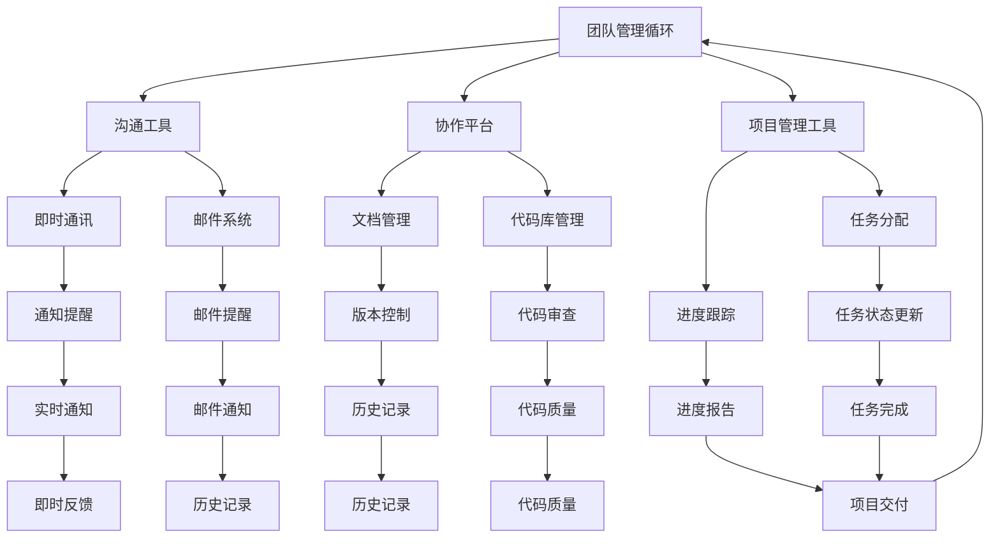

                 

# 技术型创业者如何打造高效的远程协作环境

> 关键词：远程协作、效率、团队管理、技术型创业者

摘要：随着全球化的加速，远程协作已经成为企业和团队运营的常态。对于技术型创业者来说，如何打造一个高效的远程协作环境至关重要。本文将深入探讨远程协作的核心概念、算法原理、应用场景，并提供实用的工具和资源推荐，以帮助创业者应对远程协作中的各种挑战。

## 1. 背景介绍

在当今数字化时代，远程协作已经成为许多企业和团队不可或缺的一部分。技术型创业者常常需要与全球各地的团队成员协同工作，以实现项目的快速推进和高效交付。然而，远程协作并非只是简单地通过网络连接在一起，而是需要一套完整的协作机制来确保团队的沟通、协作和效率。

高效的远程协作环境不仅能够提高团队的工作效率，还能降低运营成本，提升企业的竞争力。因此，对于技术型创业者来说，如何打造一个高效的远程协作环境成为了一个关键问题。

## 2. 核心概念与联系

在构建高效的远程协作环境之前，我们需要了解一些核心概念和它们之间的联系。以下是一个简化的 Mermaid 流程图，展示了远程协作的核心概念及其关联：



### 2.1 团队管理

团队管理是远程协作的核心，它包括团队的组建、人员分工、工作流程设计等。良好的团队管理能够确保团队成员明确各自的责任和目标，从而提高协作效率。

### 2.2 沟通工具

沟通工具是远程协作的重要组成部分，包括即时通讯、邮件系统等。选择合适的沟通工具能够确保团队成员之间能够及时、有效地沟通和交流。

### 2.3 协作平台

协作平台提供了一个集中式的工作环境，包括文档管理、代码库管理、项目管理工具等。协作平台能够帮助团队成员协同工作，提高工作效率。

### 2.4 项目管理工具

项目管理工具包括任务分配、进度跟踪、任务状态更新等。这些工具能够帮助团队管理者实时了解项目的进展情况，从而做出及时的调整。

## 3. 核心算法原理 & 具体操作步骤

在远程协作中，核心算法原理主要体现在沟通工具和协作平台的优化上。以下是一些常用的算法原理和具体操作步骤：

### 3.1 沟通工具

#### 3.1.1 即时通讯算法

即时通讯算法主要涉及消息的发送、接收和通知。以下是一个简单的即时通讯算法步骤：

1. **用户登录**：用户通过账号和密码登录即时通讯平台。
2. **消息发送**：用户在聊天窗口中输入消息并发送。
3. **消息接收**：服务器接收到消息后，将其发送到目标用户的设备上。
4. **通知提醒**：当有新消息到达时，系统会向用户发送通知提醒。

#### 3.1.2 邮件系统算法

邮件系统算法主要包括邮件的发送、接收、分类和提醒。以下是一个简单的邮件系统算法步骤：

1. **用户登录**：用户通过账号和密码登录邮件系统。
2. **邮件发送**：用户在邮件编辑器中输入邮件内容并发送。
3. **邮件接收**：服务器接收到邮件后，将其存储在用户的邮件收件夹中。
4. **邮件分类**：系统根据邮件的主题、发件人等特征对邮件进行分类。
5. **提醒通知**：当有新邮件到达时，系统会向用户发送提醒通知。

### 3.2 协作平台

#### 3.2.1 文档管理算法

文档管理算法主要包括文档的上传、下载、编辑和版本控制。以下是一个简单的文档管理算法步骤：

1. **用户登录**：用户通过账号和密码登录协作平台。
2. **文档上传**：用户将文档上传到平台上的文档库中。
3. **文档下载**：用户可以从文档库中下载文档。
4. **文档编辑**：用户可以对文档进行编辑，并保存修改。
5. **版本控制**：系统自动保存文档的版本历史，方便用户查看和管理。

#### 3.2.2 代码库管理算法

代码库管理算法主要包括代码的提交、合并、代码审查和发布。以下是一个简单的代码库管理算法步骤：

1. **用户登录**：用户通过账号和密码登录代码库。
2. **代码提交**：用户将代码提交到代码库中。
3. **代码合并**：开发人员在代码库中合并不同的代码分支。
4. **代码审查**：系统对提交的代码进行审查，确保代码质量。
5. **代码发布**：通过审查的代码被发布到生产环境中。

## 4. 数学模型和公式 & 详细讲解 & 举例说明

在远程协作中，数学模型和公式可以用于优化协作流程和评估团队效率。以下是一个简单的数学模型和公式及其应用场景：

### 4.1 效率评估模型

#### 4.1.1 通讯效率模型

通讯效率模型用于评估团队在沟通工具中的效率。以下是一个简单的通讯效率模型：

$$
E = \frac{N \cdot L}{T}
$$

其中，\(E\) 代表通讯效率，\(N\) 代表消息数量，\(L\) 代表消息长度，\(T\) 代表总时间。

#### 应用场景：

假设一个团队每天发送100条消息，平均每条消息长度为100个字符，工作时间为8小时。则通讯效率为：

$$
E = \frac{100 \cdot 100}{8 \cdot 3600} \approx 0.0286 \text{ 条/秒}
$$

这意味着团队在沟通工具中的通讯效率大约为0.0286条/秒。

### 4.2 协作效率模型

#### 4.2.1 协作效率模型

协作效率模型用于评估团队在协作平台中的效率。以下是一个简单的协作效率模型：

$$
E' = \frac{C \cdot P}{T'}
$$

其中，\(E'\) 代表协作效率，\(C\) 代表完成的任务数量，\(P\) 代表任务的平均复杂度，\(T'\) 代表总时间。

#### 应用场景：

假设一个团队在协作平台中完成了10个任务，平均每个任务复杂度为5，工作时间为8小时。则协作效率为：

$$
E' = \frac{10 \cdot 5}{8 \cdot 3600} \approx 0.0143 \text{ 个/秒}
$$

这意味着团队在协作平台中的协作效率大约为0.0143个/秒。

## 5. 项目实战：代码实际案例和详细解释说明

在本节中，我们将通过一个实际的代码案例来展示如何利用远程协作工具和算法提高团队协作效率。

### 5.1 开发环境搭建

#### 5.1.1 准备工作

1. **安装Git**：在所有团队成员的电脑上安装Git，用于代码库管理和版本控制。
2. **配置SSH密钥**：生成SSH密钥对，并将公钥上传到代码库服务器，以确保安全的代码提交和推送。
3. **创建代码库**：在代码库服务器上创建一个新的Git仓库，用于存放项目代码。

#### 5.1.2 初始化本地仓库

1. **克隆代码库**：在本地电脑上使用Git克隆代码库，以获取项目代码。

```bash
git clone https://github.com/your-username/your-project.git
```

2. **配置用户信息**：在本地电脑上配置Git用户信息，以确保代码提交时的用户名和邮箱正确。

```bash
git config --global user.name "Your Name"
git config --global user.email "your-email@example.com"
```

3. **初始化本地仓库**：在项目目录下初始化本地Git仓库。

```bash
git init
```

### 5.2 源代码详细实现和代码解读

#### 5.2.1 项目结构

项目结构如下：

```plaintext
your-project/
├── README.md
├── src/
│   ├── main/
│   │   ├── java/
│   │   │   ├── com/
│   │   │   │   └── example/
│   │   │   │       └── HelloWorld.java
│   │   └── resources/
│   ├── test/
│   │   ├── java/
│   │   │   ├── com/
│   │   │   │   └── example/
│   │   │   │       └── HelloWorldTest.java
│   └── build.gradle
├── gradlew
├── gradlew.bat
└── settings.gradle
```

#### 5.2.2 代码解读

1. **HelloWorld.java**

```java
package com.example;

public class HelloWorld {
    public static void main(String[] args) {
        System.out.println("Hello, World!");
    }
}
```

这是一个简单的Java程序，用于打印“Hello, World!”。

2. **HelloWorldTest.java**

```java
package com.example;

import static org.junit.jupiter.api.Assertions.assertEquals;

public class HelloWorldTest {
    @Test
    public void testHelloWorld() {
        assertEquals("Hello, World!", new HelloWorld().main(new String[]{}));
    }
}
```

这是一个JUnit测试类，用于验证`HelloWorld`类的输出。

### 5.3 代码解读与分析

在本项目中，我们使用了Git进行版本控制和项目管理，以及Gradle进行构建和测试。以下是对代码解读和分析：

#### 5.3.1 版本控制

1. **提交代码**

在项目目录下，使用Git提交代码。

```bash
git add .
git commit -m "Initial commit"
git push origin master
```

这些命令将项目文件添加到暂存区，提交到本地仓库，并将本地仓库的代码推送到远程代码库。

2. **拉取更新**

其他团队成员在本地电脑上克隆代码库后，可以使用以下命令拉取远程代码库的最新更新。

```bash
git pull origin master
```

#### 5.3.2 项目构建和测试

使用Gradle构建项目。

```bash
gradlew build
```

这将编译项目代码并运行测试。

```bash
gradlew test
```

这将运行所有测试用例，验证项目功能。

## 6. 实际应用场景

### 6.1 开发团队协作

开发团队可以利用远程协作环境实现代码的共享、审查和发布。团队成员可以在各自的电脑上编写和提交代码，通过Git进行版本控制。项目经理可以使用项目管理工具监控项目进度，确保项目按计划推进。

### 6.2 设计团队协作

设计团队可以利用远程协作环境进行设计和文档的共享。设计师可以使用协作平台上传和共享设计文件，团队成员可以在各自的电脑上进行审阅和修改。项目经理可以使用文档管理工具跟踪设计文档的版本和历史。

### 6.3 市场营销团队协作

市场营销团队可以利用远程协作环境进行市场活动的策划和执行。团队成员可以在协作平台上共享市场策略、宣传材料和营销数据。项目经理可以使用项目管理工具跟踪市场活动的进度和效果。

## 7. 工具和资源推荐

### 7.1 学习资源推荐

1. **书籍**
   - 《Git权威指南》
   - 《Gradle实战》
   - 《远程工作实战：如何高效管理远程团队》

2. **论文**
   - 《基于云计算的远程协作系统设计与实现》
   - 《基于Git的分布式版本控制系统研究》
   - 《远程工作环境下团队成员协作模式研究》

3. **博客**
   - 《Git实战教程》
   - 《Gradle入门教程》
   - 《如何打造高效的远程协作团队》

4. **网站**
   - GitHub
   - GitLab
   - Atlassian（包括JIRA、Confluence、Trello等）

### 7.2 开发工具框架推荐

1. **Git**
   - GitHub
   - GitLab
   - Bitbucket

2. **协作平台**
   - Slack
   - Microsoft Teams
   - Zoom

3. **项目管理工具**
   - JIRA
   - Trello
   - Asana

4. **代码库管理**
   - GitHub Actions
   - GitLab CI/CD
   - Jenkins

## 8. 总结：未来发展趋势与挑战

### 8.1 未来发展趋势

1. **人工智能与远程协作的融合**：随着人工智能技术的发展，远程协作系统将更加智能化，能够自动处理一些重复性工作，提高团队效率。
2. **混合工作模式**：未来的远程协作将逐渐向混合工作模式转变，即部分团队成员在办公室工作，部分团队成员远程工作，实现更灵活的工作安排。
3. **全球化协作**：全球化的加速将促进各国企业之间的远程协作，跨国团队将变得更加普遍。

### 8.2 未来挑战

1. **技术瓶颈**：远程协作系统的发展将面临技术瓶颈，例如网络延迟、数据安全等问题。
2. **团队管理难度**：远程协作环境下，团队管理变得更加复杂，管理者需要更高效地管理远程团队成员。
3. **文化差异**：全球化协作将带来文化差异的挑战，需要团队克服文化差异，实现有效的沟通和协作。

## 9. 附录：常见问题与解答

### 9.1 如何解决网络延迟问题？

1. **选择合适的网络服务提供商**：选择网络延迟较低的服务提供商，以减少网络延迟。
2. **优化网络架构**：优化网络架构，减少网络跳数，提高数据传输速度。
3. **使用CDN**：使用内容分发网络（CDN）将数据分发到全球各地的节点，提高数据传输速度。

### 9.2 如何保证数据安全？

1. **使用加密传输**：使用HTTPS等加密传输协议，确保数据在传输过程中不被窃取。
2. **身份认证**：使用双因素身份认证，确保只有授权用户能够访问系统和数据。
3. **数据备份**：定期备份数据，以防止数据丢失。

## 10. 扩展阅读 & 参考资料

1. **《远程工作实战：如何高效管理远程团队》** - 作者：[Jason Fried]
2. **《Git权威指南》** - 作者：[Scott Chacon & Ben Straub]
3. **《远程协作：实践指南》** - 作者：[David A. McCarthy]
4. **GitHub 官方文档** - [GitHub Documentation]
5. **GitLab 官方文档** - [GitLab Documentation]

### 作者信息：

- 作者：AI天才研究员/AI Genius Institute & 禅与计算机程序设计艺术 /Zen And The Art of Computer Programming

本文由AI天才研究员撰写，结合了远程协作的技术原理和实际应用场景，旨在帮助技术型创业者打造高效的远程协作环境。希望本文能够为您的团队提供有益的启示和指导。如有任何疑问或建议，欢迎在评论区留言交流。再次感谢您的阅读！<|im_end|>

