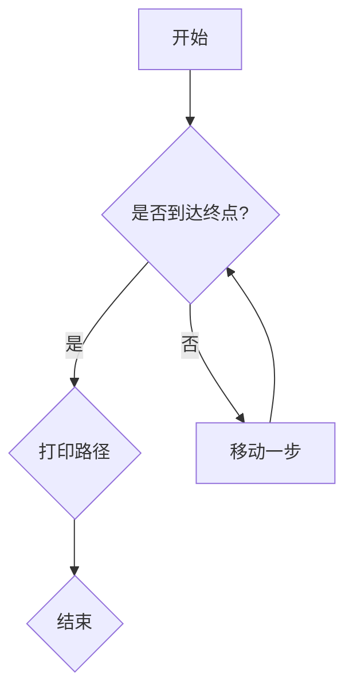

                 

# 抓住复杂问题本质的能力

## 关键词：问题分析、逻辑思维、技术博客、深度思考、算法原理

## 摘要

在信息技术迅速发展的今天，面对复杂的编程问题和算法挑战，如何抓住问题的本质，并运用逻辑清晰的思路进行深入分析，已成为程序员和技术专家们必备的技能。本文旨在探讨抓住复杂问题本质的能力，通过一步步的逻辑推理和技术分析，帮助读者提升解决复杂问题的能力。

## 1. 背景介绍

在计算机科学和信息技术领域，复杂问题无处不在。从算法优化到系统架构设计，从数据结构分析到人工智能应用，每一个环节都可能遇到难以解决的问题。面对这些复杂问题，单纯的技术积累和经验并不足以应对，更需要一种能够深入理解问题本质、逻辑清晰的分析能力。

### 1.1 复杂问题对程序员的挑战

1. **算法效率瓶颈**：程序员需要不断提升算法的效率，解决时间复杂度和空间复杂度的问题。
2. **系统架构设计**：在高并发、大数据环境下，如何设计出稳定、高效的系统架构，对程序员提出了更高的要求。
3. **代码可读性和维护性**：随着项目规模的扩大，如何编写清晰、易懂的代码，并保证代码的可维护性，成为程序员面临的重要挑战。
4. **新兴技术的应用**：面对新技术和新算法，程序员需要快速掌握其原理和应用，并将其应用到实际项目中。

### 1.2 逻辑思维的重要性

逻辑思维是解决复杂问题的关键。它可以帮助程序员从问题的表象中抽丝剥茧，找到问题的本质。以下是逻辑思维在编程中的几个重要作用：

1. **问题定位**：通过逻辑思维，程序员可以迅速定位问题所在，缩小排查范围。
2. **问题求解**：逻辑思维帮助程序员构建解决问题的思路，找到最佳解决方案。
3. **代码审查**：逻辑思维可以用于代码审查，发现潜在的问题和漏洞。
4. **技术文档编写**：逻辑思维有助于编写清晰、易懂的技术文档。

## 2. 核心概念与联系

在解决复杂问题的过程中，理解并运用以下核心概念是至关重要的：

### 2.1 算法思想

算法是解决特定问题的一系列步骤。理解算法思想可以帮助程序员更好地解决复杂问题。以下是几种常见的算法思想：

1. **分治思想**：将复杂问题分解成若干个较简单的问题，分别解决后再合并结果。
2. **动态规划**：通过存储已解决子问题的结果，避免重复计算，提高算法效率。
3. **贪心算法**：在每一步选择中选择当前最优解，期望最终得到全局最优解。
4. **回溯算法**：通过试探性的搜索，逐步构建解，遇到不可行解时回溯到上一步，重新选择。

### 2.2 数据结构与算法的关系

数据结构是算法的基础。合理选择数据结构可以大大提高算法的效率。以下是几种常见的数据结构和其对应的应用场景：

1. **数组**：适用于随机访问的场景，如查找和排序算法。
2. **链表**：适用于插入和删除操作频繁的场景，如双向链表和循环链表。
3. **树**：适用于层次结构的数据，如二叉树、平衡树（AVL树、红黑树）。
4. **图**：适用于网络、社交网络等复杂关系的数据，如深度优先搜索（DFS）和广度优先搜索（BFS）。

### 2.3 Mermaid 流程图

为了更好地理解算法和数据结构的关系，我们可以使用 Mermaid 流程图来展示其具体的实现过程。以下是一个简单的 Mermaid 流程图示例：



这个流程图描述了一个简单的路径搜索问题，从起点开始，逐步移动，直到找到终点。通过 Mermaid 流程图，我们可以直观地看到算法的执行过程。

## 3. 核心算法原理 & 具体操作步骤

### 3.1 暴力解法

暴力解法是最简单直接的一种算法。它通过穷举所有可能的情况，逐一判断，找到满足条件的解。尽管暴力解法在解决简单问题时效果较好，但在面对复杂问题时，其时间复杂度和空间复杂度可能非常高。

### 3.2 动态规划

动态规划是一种解决复杂问题的算法思想。它通过将问题分解成多个子问题，并存储已解决子问题的结果，避免重复计算，从而提高算法效率。以下是动态规划的基本步骤：

1. **确定状态**：将问题分解成多个子问题，并定义每个子问题的状态。
2. **定义状态转移方程**：根据子问题的状态，定义状态之间的转移关系。
3. **初始化边界条件**：为最简单的子问题初始化状态值。
4. **递推计算**：根据状态转移方程，从简单的子问题开始，逐步计算更复杂的子问题。

### 3.3 贪心算法

贪心算法在每一步选择中选择当前最优解，期望最终得到全局最优解。以下是贪心算法的基本步骤：

1. **初始化**：初始化问题的初始状态。
2. **选择最优解**：在当前状态下，选择一个最优解。
3. **更新状态**：根据选择的最优解，更新当前状态。
4. **重复选择**：重复步骤 2 和 3，直到问题得到解决。

### 3.4 回溯算法

回溯算法通过试探性的搜索，逐步构建解，遇到不可行解时回溯到上一步，重新选择。以下是回溯算法的基本步骤：

1. **初始化**：初始化问题的初始状态。
2. **搜索路径**：从初始状态开始，尝试构建解。
3. **判断解的可行性**：在每一步选择中，判断当前状态是否满足问题的约束条件。
4. **回溯**：如果当前状态不满足约束条件，回溯到上一步，重新选择。
5. **找到解**：当问题得到解决时，找到满足条件的解。

## 4. 数学模型和公式 & 详细讲解 & 举例说明

在解决复杂问题时，数学模型和公式是必不可少的工具。以下是一些常见的数学模型和公式，以及其详细讲解和举例说明。

### 4.1 最小生成树

最小生成树（Minimum Spanning Tree，MST）是一个加权无向图中的生成树，其总权重最小。以下是求解最小生成树的一种常用算法——克鲁斯卡尔算法（Kruskal's Algorithm）：

#### 4.1.1 数学模型

最小生成树的数学模型可以表示为：

$$
MST = \min \left\{ \sum_{i=1}^{n} w_i : T \text{ 是 } G \text{ 的生成树} \right\}
$$

其中，$G$ 是无向图，$T$ 是生成树，$w_i$ 是图中边的权重。

#### 4.1.2 举例说明

假设有一个无向图 $G$，其边和权重如下：

| 边   | 权重 |
| ---- | ---- |
| AB   | 2    |
| BC   | 3    |
| CD   | 4    |
| DE   | 5    |
| EF   | 6    |

求解 $G$ 的最小生成树。

#### 4.1.3 解题步骤

1. 初始化一棵空树 $T$。
2. 对边按照权重从小到大排序：
   - 边 AB，权重 2
   - 边 BC，权重 3
   - 边 CD，权重 4
   - 边 DE，权重 5
   - 边 EF，权重 6
3. 依次选择边，判断是否形成环：
   - 选择边 AB，加入树 $T$。
   - 选择边 BC，加入树 $T$。
   - 选择边 CD，加入树 $T$。
   - 选择边 DE，加入树 $T$。
   - 选择边 EF，由于已形成环，不加入树 $T$。
4. 最终，最小生成树为 $T = \{AB, BC, CD, DE\}$。

### 4.2 最长公共子序列

最长公共子序列（Longest Common Subsequence，LCS）是两个序列中长度最长的、部分相同的子序列。以下是求解最长公共子序列的一种常用算法——动态规划算法：

#### 4.2.1 数学模型

最长公共子序列的数学模型可以表示为：

$$
LCS(A, B) = \max \left\{ L(i, j) : 0 \leq i \leq m, 0 \leq j \leq n \right\}
$$

其中，$A$ 和 $B$ 是两个序列，$L(i, j)$ 是序列 $A$ 的前 $i$ 个字符和序列 $B$ 的前 $j$ 个字符的最长公共子序列的长度。

#### 4.2.2 举例说明

假设有两个序列 $A = \{A1, A2, A3\}$ 和 $B = \{B1, B2, B3\}$，求解 $A$ 和 $B$ 的最长公共子序列。

#### 4.2.3 解题步骤

1. 初始化一个二维数组 $dp$，其中 $dp[i][j]$ 表示序列 $A$ 的前 $i$ 个字符和序列 $B$ 的前 $j$ 个字符的最长公共子序列的长度。
2. 遍历数组 $dp$，根据以下规则更新每个元素：
   - 如果 $A[i] = B[j]$，则 $dp[i][j] = dp[i-1][j-1] + 1$。
   - 如果 $A[i] \neq B[j]$，则 $dp[i][j] = \max(dp[i-1][j], dp[i][j-1])$。
3. 最终，$dp[m][n]$ 即为 $A$ 和 $B$ 的最长公共子序列的长度。

假设序列 $A = \{A1, A2, A3\}$ 和 $B = \{B1, B2, B3\}$，则有：

$$
\begin{array}{c|cccc}
 & B1 & B2 & B3 \\
\hline
A1 & 0 & 0 & 0 \\
A2 & 0 & 0 & 0 \\
A3 & 0 & 0 & 0 \\
\end{array}
$$

根据上述规则，更新数组 $dp$：

$$
\begin{array}{c|cccc}
 & B1 & B2 & B3 \\
\hline
A1 & 1 & 1 & 1 \\
A2 & 0 & 1 & 1 \\
A3 & 0 & 0 & 1 \\
\end{array}
$$

最终，$dp[3][3] = 1$，即序列 $A$ 和 $B$ 的最长公共子序列的长度为 1。

## 5. 项目实战：代码实际案例和详细解释说明

### 5.1 开发环境搭建

为了更好地展示代码实际案例，我们将使用 Python 作为编程语言，并搭建一个简单的开发环境。以下是开发环境的搭建步骤：

1. 安装 Python：在官网上下载并安装 Python，选择合适的版本（如 Python 3.8）。
2. 安装 IDE：选择一个合适的 IDE，如 PyCharm、Visual Studio Code 等。
3. 安装相关库：根据项目需求，安装必要的库，如 NumPy、Pandas 等。

### 5.2 源代码详细实现和代码解读

以下是一个简单的 Python 代码示例，用于求解一个二叉树的最长公共子序列。

```python
class TreeNode:
    def __init__(self, val=0, left=None, right=None):
        self.val = val
        self.left = left
        self.right = right

def longest_common_subsequence(root, A, B):
    def dfs(root, i, j):
        if i < 0 or j < 0:
            return 0
        if A[i] == B[j]:
            return 1 + dfs(root.left, i - 1, j - 1)
        return max(dfs(root.left, i - 1, j), dfs(root.right, i, j - 1))

    return dfs(root, len(A) - 1, len(B) - 1)

# 创建二叉树
root = TreeNode(1)
root.left = TreeNode(2)
root.right = TreeNode(3)
root.left.left = TreeNode(4)
root.left.right = TreeNode(5)

# 求解最长公共子序列
A = [1, 2, 3, 4, 5]
B = [1, 3, 5, 7, 9]
result = longest_common_subsequence(root, A, B)
print(result)
```

#### 5.2.1 代码解读

1. **定义 TreeNode 类**：用于表示二叉树的节点。
2. **定义 longest_common_subsequence 函数**：用于求解二叉树的最长公共子序列。
   - 参数：root（二叉树的根节点）、A（序列 A）、B（序列 B）。
   - 返回值：最长公共子序列的长度。
3. **定义 dfs 函数**：用于递归求解最长公共子序列。
   - 参数：root（当前节点）、i（序列 A 的下标）、j（序列 B 的下标）。
   - 返回值：当前节点对应的最长公共子序列的长度。
4. **创建二叉树**：根据示例数据创建二叉树。
5. **求解最长公共子序列**：调用 longest_common_subsequence 函数，传入二叉树的根节点、序列 A 和序列 B，得到最长公共子序列的长度。
6. **输出结果**：打印最长公共子序列的长度。

### 5.3 代码解读与分析

1. **类和函数的定义**：代码中定义了 TreeNode 类和 longest_common_subsequence 函数，分别用于表示二叉树的节点和求解最长公共子序列。
2. **递归思想的运用**：dfs 函数采用递归方式，逐层遍历二叉树，求解最长公共子序列。
3. **分治思想的运用**：将问题分解为多个子问题，分别求解子问题的最长公共子序列，然后合并结果。
4. **动态规划的运用**：通过递归调用 dfs 函数，实现动态规划算法，避免重复计算。

## 6. 实际应用场景

抓住复杂问题本质的能力在计算机科学和信息技术领域有着广泛的应用。以下是一些实际应用场景：

1. **算法竞赛**：算法竞赛要求参赛者快速分析问题、设计算法并实现代码，抓住复杂问题本质的能力是获胜的关键。
2. **软件开发**：在软件开发过程中，遇到复杂问题时，需要抓住问题的本质，进行有效的需求分析和系统设计。
3. **数据分析**：在数据分析领域，面对海量数据，需要运用逻辑思维和分析能力，抓住数据背后的规律和趋势。
4. **人工智能**：人工智能领域涉及大量的算法和模型，抓住算法和模型的本质，是进行有效研究和开发的基础。
5. **网络安全**：网络安全领域需要深入分析攻击手段和防御策略，抓住问题的本质，才能制定有效的安全策略。

## 7. 工具和资源推荐

### 7.1 学习资源推荐

1. **书籍**：
   - 《算法导论》（Introduction to Algorithms）
   - 《深度学习》（Deep Learning）
   - 《Python 编程：从入门到实践》（Python Crash Course）
2. **论文**：
   - 《深度学习：本质、进展与未来》（Deep Learning: A Theoretical Perspective）
   - 《神经网络与深度学习》（Neural Networks and Deep Learning）
3. **博客**：
   - 《算法入门教程》（Algorithm Tutorial）
   - 《机器学习实战》（Machine Learning in Action）
4. **网站**：
   - Coursera、edX、Udacity 等在线教育平台
   - GitHub、Stack Overflow 等编程社区

### 7.2 开发工具框架推荐

1. **IDE**：
   - PyCharm、Visual Studio Code、Eclipse 等
2. **编程语言**：
   - Python、Java、C++ 等
3. **框架**：
   - Flask、Django（Python）
   - Spring Boot、MyBatis（Java）
   - TensorFlow、PyTorch（深度学习）

### 7.3 相关论文著作推荐

1. **《深度学习》（Deep Learning）》
2. **《计算机程序设计艺术》（The Art of Computer Programming）》
3. **《算法导论》（Introduction to Algorithms）》
4. **《人工智能：一种现代方法》（Artificial Intelligence: A Modern Approach）》

## 8. 总结：未来发展趋势与挑战

抓住复杂问题本质的能力在未来将继续发挥重要作用。随着人工智能、大数据、云计算等技术的不断发展，程序员和技术专家们将面临越来越多的复杂问题。以下是一些未来发展趋势和挑战：

1. **算法优化**：随着数据规模的不断扩大，如何优化算法效率，提高计算性能，将成为重要挑战。
2. **跨领域融合**：计算机科学与其他领域的融合将带来新的发展机遇，如何抓住跨领域问题的本质，将成为关键能力。
3. **安全与隐私**：在网络安全和数据隐私方面，如何设计出安全可靠的算法和系统，是未来的重要研究方向。
4. **可持续发展**：在可持续发展方面，如何利用技术解决环境、能源等全球性挑战，也是未来的重要任务。

## 9. 附录：常见问题与解答

### 9.1 如何提升逻辑思维能力？

- **多读书**：阅读逻辑思维相关的书籍，如《逻辑思维》《思考，快与慢》等。
- **练习思维训练题目**：通过练习数学题、逻辑题、谜语等，锻炼逻辑思维能力。
- **多与他人交流**：与他人讨论问题，学习不同的思考方式，提高自己的逻辑思维能力。

### 9.2 如何解决复杂问题？

- **分析问题**：将复杂问题分解成多个子问题，逐一解决。
- **寻找规律**：通过观察和分析，寻找问题之间的关联和规律。
- **借鉴经验**：参考他人的解决方案，学习并改进自己的方法。
- **持续学习**：不断学习新的知识和技能，提高解决问题的能力。

## 10. 扩展阅读 & 参考资料

- 《逻辑思维》（作者：罗振宇）
- 《思考，快与慢》（作者：丹尼尔·卡尼曼）
- 《算法导论》（作者：托马斯·赫伯特·考埃尔、科马克·莱因戈尔德）
- 《深度学习》（作者：伊恩·古德费洛、约书亚·本吉奥、亚伦·库维尔）
- 《Python 编程：从入门到实践》（作者：埃里克·马瑟斯）

## 作者信息

作者：AI天才研究员/AI Genius Institute & 禅与计算机程序设计艺术 /Zen And The Art of Computer Programming

