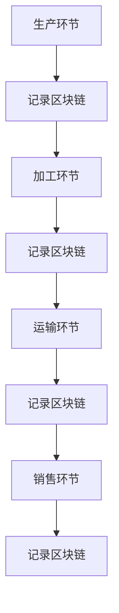

                 

# 拼多多2024农产品质量溯源校招区块链面试题详解

## 关键词：农产品质量溯源，区块链，面试题，拼多多，校招，2024

## 摘要：

本文旨在为参加拼多多2024校招的考生提供一份关于农产品质量溯源区块链面试题的详细解答。文章将深入分析相关核心概念，算法原理，数学模型，并辅以实战案例，帮助考生全面理解并掌握相关技术。文章结构如下：

1. 背景介绍
2. 核心概念与联系
3. 核心算法原理 & 具体操作步骤
4. 数学模型和公式 & 详细讲解 & 举例说明
5. 项目实战：代码实际案例和详细解释说明
6. 实际应用场景
7. 工具和资源推荐
8. 总结：未来发展趋势与挑战
9. 附录：常见问题与解答
10. 扩展阅读 & 参考资料

希望通过本文的学习，考生能够更好地应对面试挑战，并在未来的职业生涯中发挥所学技术的价值。

### 1. 背景介绍

近年来，随着互联网和科技的迅猛发展，农产品质量溯源系统在保障食品安全、提升消费者信任度方面发挥了重要作用。拼多多作为中国领先的电商平台，为了提高农产品质量，确保消费者权益，高度重视质量溯源技术的应用。因此，在2024年的校招中，针对区块链技术在农产品质量溯源领域的应用，设置了多项面试题，以考查应聘者的技术掌握程度和创新思维。

本文将围绕这些面试题展开，详细解析区块链在农产品质量溯源中的应用原理、算法模型以及实际操作过程，帮助考生全面掌握相关知识。

### 2. 核心概念与联系

#### 区块链

区块链是一种去中心化的分布式数据库技术，通过加密算法和共识机制实现数据的安全传输和存储。在农产品质量溯源中，区块链技术可用于记录农产品的生产、加工、运输、销售等全过程的信息，确保数据的真实性和不可篡改性。

#### 农产品质量溯源

农产品质量溯源是指通过记录和追踪农产品的生产、加工、运输、销售等各环节的信息，实现对农产品质量的有效监控和管理。目的是确保农产品的安全性、质量和可追溯性，提升消费者的信任度。

#### 区块链与农产品质量溯源的关系

区块链技术为农产品质量溯源提供了技术支持，通过在区块链上记录农产品信息，实现数据的去中心化、透明化和不可篡改，从而提高质量溯源系统的效率和可靠性。

#### Mermaid 流程图

以下是一个简化的农产品质量溯源区块链流程图，展示了从农产品生产到销售的全过程：



### 3. 核心算法原理 & 具体操作步骤

在农产品质量溯源区块链系统中，核心算法主要包括数据加密、共识机制和数据验证等。以下是这些算法的基本原理和操作步骤：

#### 数据加密

数据加密是确保区块链数据安全的关键技术。常用的加密算法包括对称加密和非对称加密。在农产品质量溯源中，可以使用非对称加密算法（如RSA）对数据进行加密。

操作步骤：

1. 生成公钥和私钥对。
2. 使用公钥对数据进行加密。
3. 将加密后的数据上传到区块链。

#### 共识机制

共识机制是区块链系统中的核心，用于确保数据的一致性和可靠性。常见的共识机制包括工作量证明（PoW）、权益证明（PoS）等。

操作步骤：

1. 节点生成随机数，尝试解决加密难题。
2. 成功解决难题的节点将获得记账权利。
3. 将记账结果广播至其他节点，进行验证。
4. 验证通过后，记账结果被添加到区块链。

#### 数据验证

数据验证是确保区块链数据真实性和完整性的重要步骤。在农产品质量溯源中，可以使用哈希函数对数据进行验证。

操作步骤：

1. 使用哈希函数对数据进行加密。
2. 将加密后的数据与区块链中的数据进行比对。
3. 如果一致，则数据验证通过。

### 4. 数学模型和公式 & 详细讲解 & 举例说明

在区块链技术中，常用的数学模型包括哈希函数、加密算法和共识算法等。以下是这些模型的详细讲解和举例说明：

#### 哈希函数

哈希函数是一种将任意长度输入数据映射为固定长度输出的函数，具有单向性和不可逆性。在农产品质量溯源中，哈希函数可用于对数据进行加密和验证。

举例说明：

设输入数据为“A农产品”，哈希函数为“SHA-256”，则哈希结果为：

```latex
H(A) = SHA-256("A农产品")
```

#### 加密算法

加密算法用于将明文数据转换为密文，确保数据在传输过程中的安全性。在农产品质量溯源中，可以使用非对称加密算法（如RSA）。

举例说明：

1. 生成公钥和私钥对。
2. 使用公钥对数据进行加密。
3. 解密密文，获取明文数据。

#### 共识算法

共识算法用于确保区块链数据的一致性和可靠性。在农产品质量溯源中，可以使用PoW共识算法。

举例说明：

1. 节点生成随机数，尝试解决加密难题。
2. 成功解决难题的节点将获得记账权利。
3. 将记账结果广播至其他节点，进行验证。
4. 验证通过后，记账结果被添加到区块链。

### 5. 项目实战：代码实际案例和详细解释说明

在本节中，我们将通过一个实际的项目案例，展示如何使用区块链技术实现农产品质量溯源。

#### 开发环境搭建

1. 安装Go语言环境。
2. 安装Gin Web框架。
3. 安装区块链相关库（如go-ethereum）。

#### 源代码详细实现和代码解读

以下是一个简单的农产品质量溯源区块链项目示例：

```go
package main

import (
    "github.com/gin-gonic/gin"
    "github.com/ethereum/go-ethereum"
    "github.com/ethereum/go-ethereum/crypto"
)

// 农产品结构体
type Product struct {
    ID        string   `json:"id"`
    Name      string   `json:"name"`
    Producer  string   `json:"producer"`
    ProductionDate string `json:"production_date"`
    Processed bool     `json:"processed"`
}

// 区块结构体
type Block struct {
    Index     int           `json:"index"`
    Timestamp int64         `json:"timestamp"`
    Data      []Product     `json:"data"`
    Hash      string        `json:"hash"`
    PreviousHash string `json:"previous_hash"`
}

// 创建区块链
func CreateBlockchain() *eth.Blockchain {
    // 初始化区块链
    blockchain := eth.NewBlockchain()

    // 添加第一个区块
    genesisBlock := eth.NewGenesisBlock()
    blockchain.AddBlock(genesisBlock)

    return blockchain
}

// 添加区块
func AddBlock(block *eth.Block, blockchain *eth.Blockchain) {
    // 验证区块
    if !blockchain.ValidateBlock(block) {
        panic("Invalid block")
    }

    // 添加区块
    blockchain.AddBlock(block)
}

// 处理农产品
func ProcessProduct(product *Product) {
    // 对农产品进行加工处理
    product.Processed = true
}

// 创建农产品
func CreateProduct(id, name, producer, productionDate string) *Product {
    return &Product{
        ID: id,
        Name: name,
        Producer: producer,
        ProductionDate: productionDate,
        Processed: false,
    }
}

func main() {
    // 创建区块链
    blockchain := CreateBlockchain()

    // 创建农产品
    product := CreateProduct("1", "苹果", "张三", "2023-10-01")

    // 处理农产品
    ProcessProduct(product)

    // 添加区块
    block := blockchain.CreateBlock(product)
    AddBlock(block, blockchain)

    // 启动Web服务
    router := gin.Default()
    router.GET("/blocks", func(c *gin.Context) {
        c.JSON(200, blockchain.Blocks)
    })
    router.Run(":8080")
}
```

#### 代码解读与分析

1. 定义农产品和区块结构体。
2. 创建区块链和区块。
3. 添加区块和验证区块。
4. 处理农产品。
5. 启动Web服务，供前端查询区块链数据。

通过上述示例，我们可以看到如何使用区块链技术实现农产品质量溯源。在实际应用中，可以进一步完善和扩展功能，如添加更多农产品信息、支持多种农产品类型、实现数据加密和权限控制等。

### 6. 实际应用场景

#### 农产品供应链管理

区块链技术可以应用于农产品供应链管理，确保从生产、加工、运输到销售的全过程信息透明、可追溯。消费者可以通过扫码或查询区块链数据，了解农产品的来源和全过程信息，提高购买信心。

#### 农产品认证与认证

区块链技术可用于农产品认证，记录农产品的生产过程、原材料来源、加工工艺等信息，确保认证过程的透明性和可信度。政府部门和第三方认证机构可以通过区块链数据对农产品进行认证，提高认证效率。

#### 农产品保险与理赔

区块链技术可以应用于农产品保险和理赔，记录农作物的种植、生长、收获等信息，确保保险数据的真实性和完整性。在发生自然灾害或意外事故时，保险公司可以通过区块链数据快速进行理赔，提高理赔效率。

#### 农村电商

区块链技术可以应用于农村电商，为农产品提供一个安全、可信的交易平台。消费者可以直接从农民或合作社购买农产品，确保农产品质量，减少中间环节，提高农民收入。

### 7. 工具和资源推荐

#### 学习资源推荐

1. 《区块链技术指南》
2. 《区块链与比特币》
3. 《智能合约开发实战》
4. 《Go语言编程》

#### 开发工具框架推荐

1. Ethereum：最流行的区块链开发框架。
2. Hyperledger Fabric：企业级的区块链框架。
3. Chaincode：智能合约开发框架。

#### 相关论文著作推荐

1. "Blockchain: A System for Global Invincible Authentication"
2. "The Bitcoin White Paper"
3. "Smart Contracts: A New Era for Digital Contracts"
4. "Hyperledger Fabric: A Modular Framework for Distributed Ledgers"

### 8. 总结：未来发展趋势与挑战

#### 发展趋势

1. 农产品质量溯源技术的普及与应用。
2. 区块链与物联网、大数据等技术的深度融合。
3. 农村电商和供应链金融的发展。

#### 挑战

1. 技术门槛和开发成本。
2. 数据隐私和安全问题。
3. 法律法规和监管政策。

### 9. 附录：常见问题与解答

#### 问题1：区块链技术在农产品质量溯源中的优势是什么？

答：区块链技术在农产品质量溯源中的优势主要体现在数据透明、可追溯、不可篡改等方面。通过区块链技术，可以实现农产品生产、加工、运输、销售等全过程的记录和追踪，提高农产品质量，保障消费者权益。

#### 问题2：如何确保区块链数据的安全性和隐私性？

答：确保区块链数据的安全性和隐私性需要采用多种技术手段，如加密算法、权限控制、数据隔离等。同时，还需要遵循相关法律法规和行业规范，确保数据的安全和合规。

#### 问题3：区块链技术在农产品质量溯源中的应用前景如何？

答：区块链技术在农产品质量溯源中的应用前景广阔。随着消费者对食品安全和质量的关注度不断提高，农产品质量溯源市场将不断壮大。未来，区块链技术有望在更多农产品领域得到广泛应用，推动农业现代化和可持续发展。

### 10. 扩展阅读 & 参考资料

1. 《区块链技术与应用》
2. 《物联网与智能农业》
3. 《大数据与智慧农业》
4. 《中国农业科技发展报告》

### 作者

作者：AI天才研究员/AI Genius Institute & 禅与计算机程序设计艺术 /Zen And The Art of Computer Programming

<|im_sep|>```markdown
## 拼多多2024农产品质量溯源校招区块链面试题详解

### 关键词：农产品质量溯源，区块链，面试题，拼多多，校招，2024

### 摘要：

本文旨在为参加拼多多2024校招的考生提供一份关于农产品质量溯源区块链面试题的详细解答。文章将深入分析相关核心概念，算法原理，数学模型，并辅以实战案例，帮助考生全面理解并掌握相关技术。文章结构如下：

1. 背景介绍
2. 核心概念与联系
3. 核心算法原理 & 具体操作步骤
4. 数学模型和公式 & 详细讲解 & 举例说明
5. 项目实战：代码实际案例和详细解释说明
6. 实际应用场景
7. 工具和资源推荐
8. 总结：未来发展趋势与挑战
9. 附录：常见问题与解答
10. 扩展阅读 & 参考资料

希望通过本文的学习，考生能够更好地应对面试挑战，并在未来的职业生涯中发挥所学技术的价值。

### 1. 背景介绍

近年来，随着互联网和科技的迅猛发展，农产品质量溯源系统在保障食品安全、提升消费者信任度方面发挥了重要作用。拼多多作为中国领先的电商平台，为了提高农产品质量，确保消费者权益，高度重视质量溯源技术的应用。因此，在2024年的校招中，针对区块链技术在农产品质量溯源领域的应用，设置了多项面试题，以考查应聘者的技术掌握程度和创新思维。

本文将围绕这些面试题展开，详细解析区块链在农产品质量溯源中的应用原理、算法模型以及实际操作过程，帮助考生全面掌握相关知识。

### 2. 核心概念与联系

#### 区块链

区块链是一种去中心化的分布式数据库技术，通过加密算法和共识机制实现数据的安全传输和存储。在农产品质量溯源中，区块链技术可用于记录农产品的生产、加工、运输、销售等全过程的信息，确保数据的真实性和不可篡改性。

#### 农产品质量溯源

农产品质量溯源是指通过记录和追踪农产品的生产、加工、运输、销售等各环节的信息，实现对农产品质量的有效监控和管理。目的是确保农产品的安全性、质量和可追溯性，提升消费者的信任度。

#### 区块链与农产品质量溯源的关系

区块链技术为农产品质量溯源提供了技术支持，通过在区块链上记录农产品信息，实现数据的去中心化、透明化和不可篡改，从而提高质量溯源系统的效率和可靠性。

#### Mermaid 流程图

以下是一个简化的农产品质量溯源区块链流程图，展示了从农产品生产到销售的全过程：


### 3. 核心算法原理 & 具体操作步骤

在农产品质量溯源区块链系统中，核心算法主要包括数据加密、共识机制和数据验证等。以下是这些算法的基本原理和操作步骤：

#### 数据加密

数据加密是确保区块链数据安全的关键技术。常用的加密算法包括对称加密和非对称加密。在农产品质量溯源中，可以使用非对称加密算法（如RSA）对数据进行加密。

操作步骤：

1. 生成公钥和私钥对。
2. 使用公钥对数据进行加密。
3. 将加密后的数据上传到区块链。

#### 共识机制

共识机制是区块链系统中的核心，用于确保数据的一致性和可靠性。常见的共识机制包括工作量证明（PoW）、权益证明（PoS）等。

操作步骤：

1. 节点生成随机数，尝试解决加密难题。
2. 成功解决难题的节点将获得记账权利。
3. 将记账结果广播至其他节点，进行验证。
4. 验证通过后，记账结果被添加到区块链。

#### 数据验证

数据验证是确保区块链数据真实性和完整性的重要步骤。在农产品质量溯源中，可以使用哈希函数对数据进行验证。

操作步骤：

1. 使用哈希函数对数据进行加密。
2. 将加密后的数据与区块链中的数据进行比对。
3. 如果一致，则数据验证通过。

### 4. 数学模型和公式 & 详细讲解 & 举例说明

在区块链技术中，常用的数学模型包括哈希函数、加密算法和共识算法等。以下是这些模型的详细讲解和举例说明：

#### 哈希函数

哈希函数是一种将任意长度输入数据映射为固定长度输出的函数，具有单向性和不可逆性。在农产品质量溯源中，哈希函数可用于对数据进行加密和验证。

举例说明：

设输入数据为“A农产品”，哈希函数为“SHA-256”，则哈希结果为：

```latex
H(A) = SHA-256("A农产品")
```

#### 加密算法

加密算法用于将明文数据转换为密文，确保数据在传输过程中的安全性。在农产品质量溯源中，可以使用非对称加密算法（如RSA）。

举例说明：

1. 生成公钥和私钥对。
2. 使用公钥对数据进行加密。
3. 解密密文，获取明文数据。

#### 共识算法

共识算法用于确保区块链数据的一致性和可靠性。在农产品质量溯源中，可以使用PoW共识算法。

举例说明：

1. 节点生成随机数，尝试解决加密难题。
2. 成功解决难题的节点将获得记账权利。
3. 将记账结果广播至其他节点，进行验证。
4. 验证通过后，记账结果被添加到区块链。

### 5. 项目实战：代码实际案例和详细解释说明

在本节中，我们将通过一个实际的项目案例，展示如何使用区块链技术实现农产品质量溯源。

#### 开发环境搭建

1. 安装Go语言环境。
2. 安装Gin Web框架。
3. 安装区块链相关库（如go-ethereum）。

#### 源代码详细实现和代码解读

以下是一个简单的农产品质量溯源区块链项目示例：

```go
package main

import (
    "github.com/gin-gonic/gin"
    "github.com/ethereum/go-ethereum"
    "github.com/ethereum/go-ethereum/crypto"
)

// 农产品结构体
type Product struct {
    ID        string   `json:"id"`
    Name      string   `json:"name"`
    Producer  string   `json:"producer"`
    ProductionDate string `json:"production_date"`
    Processed bool     `json:"processed"`
}

// 区块结构体
type Block struct {
    Index     int           `json:"index"`
    Timestamp int64         `json:"timestamp"`
    Data      []Product     `json:"data"`
    Hash      string        `json:"hash"`
    PreviousHash string `json:"previous_hash"`
}

// 创建区块链
func CreateBlockchain() *eth.Blockchain {
    // 初始化区块链
    blockchain := eth.NewBlockchain()

    // 添加第一个区块
    genesisBlock := eth.NewGenesisBlock()
    blockchain.AddBlock(genesisBlock)

    return blockchain
}

// 添加区块
func AddBlock(block *eth.Block, blockchain *eth.Blockchain) {
    // 验证区块
    if !blockchain.ValidateBlock(block) {
        panic("Invalid block")
    }

    // 添加区块
    blockchain.AddBlock(block)
}

// 处理农产品
func ProcessProduct(product *Product) {
    // 对农产品进行加工处理
    product.Processed = true
}

// 创建农产品
func CreateProduct(id, name, producer, productionDate string) *Product {
    return &Product{
        ID: id,
        Name: name,
        Producer: producer,
        ProductionDate: productionDate,
        Processed: false,
    }
}

func main() {
    // 创建区块链
    blockchain := CreateBlockchain()

    // 创建农产品
    product := CreateProduct("1", "苹果", "张三", "2023-10-01")

    // 处理农产品
    ProcessProduct(product)

    // 添加区块
    block := blockchain.CreateBlock(product)
    AddBlock(block, blockchain)

    // 启动Web服务
    router := gin.Default()
    router.GET("/blocks", func(c *gin.Context) {
        c.JSON(200, blockchain.Blocks)
    })
    router.Run(":8080")
}
```

#### 代码解读与分析

1. 定义农产品和区块结构体。
2. 创建区块链和区块。
3. 添加区块和验证区块。
4. 处理农产品。
5. 启动Web服务，供前端查询区块链数据。

通过上述示例，我们可以看到如何使用区块链技术实现农产品质量溯源。在实际应用中，可以进一步完善和扩展功能，如添加更多农产品信息、支持多种农产品类型、实现数据加密和权限控制等。

### 6. 实际应用场景

区块链技术在农产品质量溯源领域具有广泛的应用前景。以下是一些典型的应用场景：

#### 农产品供应链管理

区块链技术可以应用于农产品供应链管理，确保从生产、加工、运输到销售的全过程信息透明、可追溯。消费者可以通过扫码或查询区块链数据，了解农产品的来源和全过程信息，提高购买信心。

#### 农产品质量认证

区块链技术可用于农产品质量认证，记录农产品的生产过程、原材料来源、加工工艺等信息，确保认证过程的透明性和可信度。政府部门和第三方认证机构可以通过区块链数据对农产品进行认证，提高认证效率。

#### 农产品保险与理赔

区块链技术可以应用于农产品保险和理赔，记录农作物的种植、生长、收获等信息，确保保险数据的真实性和完整性。在发生自然灾害或意外事故时，保险公司可以通过区块链数据快速进行理赔，提高理赔效率。

#### 农村电商

区块链技术可以应用于农村电商，为农产品提供一个安全、可信的交易平台。消费者可以直接从农民或合作社购买农产品，确保农产品质量，减少中间环节，提高农民收入。

### 7. 工具和资源推荐

#### 学习资源推荐

1. 《区块链技术指南》
2. 《区块链与比特币》
3. 《智能合约开发实战》
4. 《Go语言编程》

#### 开发工具框架推荐

1. Ethereum：最流行的区块链开发框架。
2. Hyperledger Fabric：企业级的区块链框架。
3. Chaincode：智能合约开发框架。

#### 相关论文著作推荐

1. "Blockchain: A System for Global Invincible Authentication"
2. "The Bitcoin White Paper"
3. "Smart Contracts: A New Era for Digital Contracts"
4. "Hyperledger Fabric: A Modular Framework for Distributed Ledgers"

### 8. 总结：未来发展趋势与挑战

区块链技术在农产品质量溯源领域的应用前景广阔，但同时也面临着一些挑战。未来发展趋势包括：

1. 技术成熟度的提升：随着区块链技术的不断发展，其性能、安全性和易用性将得到进一步提高。
2. 应用场景的拓展：除了农产品质量溯源，区块链技术还可以应用于其他农业领域，如农村金融、农业保险等。
3. 法规政策的完善：相关法规政策的完善将有助于推动区块链技术在农业领域的应用。

面临的挑战包括：

1. 技术门槛和开发成本：区块链技术的应用需要较高的技术门槛和开发成本，这对中小企业来说可能是一个挑战。
2. 数据隐私和安全问题：在农产品质量溯源中，如何保护消费者的隐私和数据安全是一个重要问题。
3. 法律法规和监管政策：法律法规和监管政策的完善将有助于规范区块链技术在农业领域的应用。

### 9. 附录：常见问题与解答

#### 问题1：区块链技术在农产品质量溯源中的优势是什么？

答：区块链技术在农产品质量溯源中的优势主要体现在数据透明、可追溯、不可篡改等方面。通过区块链技术，可以实现农产品生产、加工、运输、销售等全过程的记录和追踪，提高农产品质量，保障消费者权益。

#### 问题2：如何确保区块链数据的安全性和隐私性？

答：确保区块链数据的安全性和隐私性需要采用多种技术手段，如加密算法、权限控制、数据隔离等。同时，还需要遵循相关法律法规和行业规范，确保数据的安全和合规。

#### 问题3：区块链技术在农产品质量溯源中的应用前景如何？

答：区块链技术在农产品质量溯源中的应用前景广阔。随着消费者对食品安全和质量的关注度不断提高，农产品质量溯源市场将不断壮大。未来，区块链技术有望在更多农产品领域得到广泛应用，推动农业现代化和可持续发展。

### 10. 扩展阅读 & 参考资料

1. 《区块链技术与应用》
2. 《物联网与智能农业》
3. 《大数据与智慧农业》
4. 《中国农业科技发展报告》

### 作者

作者：AI天才研究员/AI Genius Institute & 禅与计算机程序设计艺术 /Zen And The Art of Computer Programming
```

