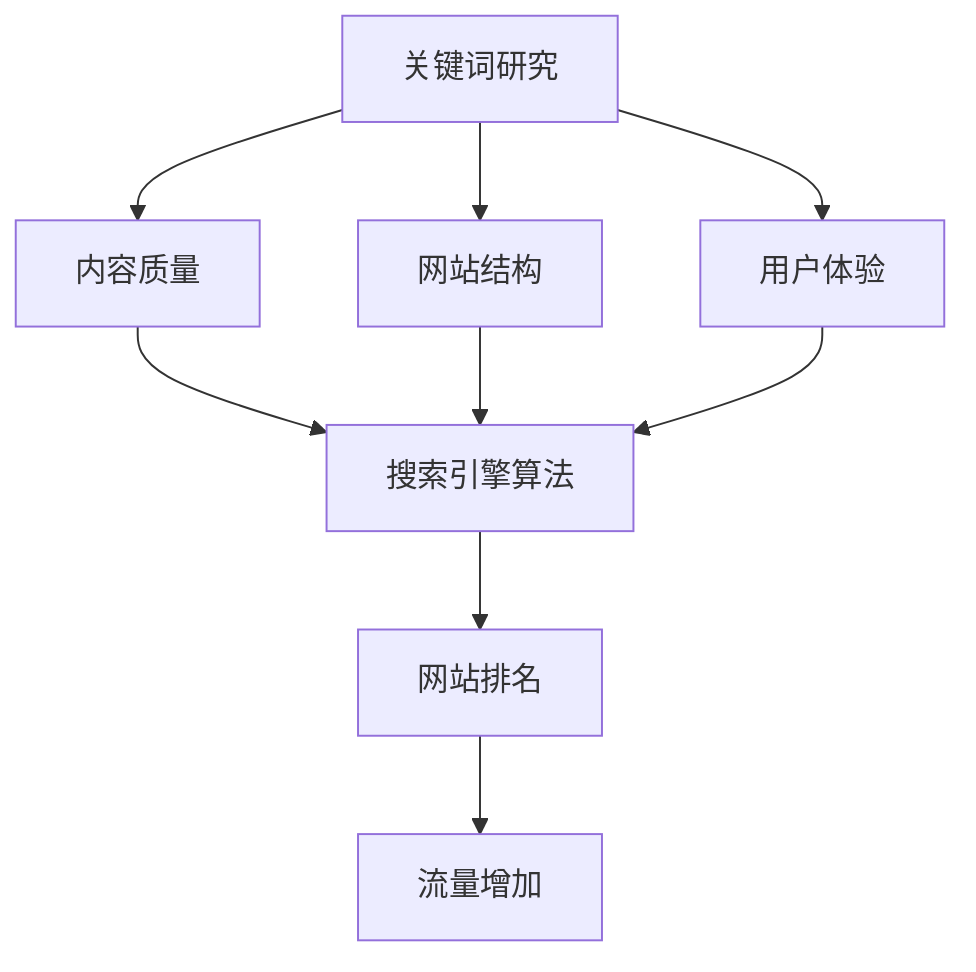

                 

# 拼多多2024校招搜索引擎优化工程师面试指南

## 摘要

本文旨在为参加拼多多2024年校招的搜索引擎优化（SEO）工程师面试者提供全面的面试指南。我们将从背景介绍、核心概念、算法原理、数学模型、项目实战、应用场景、工具资源推荐以及未来发展趋势与挑战等方面进行深入探讨。通过本文，读者将能够全面了解搜索引擎优化工程师的职责和技能要求，掌握相关技术知识，为面试做好充分准备。

## 1. 背景介绍

搜索引擎优化（Search Engine Optimization，简称SEO）是近年来互联网行业中的一个热门领域。随着搜索引擎技术的不断发展和人们对信息获取需求的增长，SEO工程师的岗位需求日益增加。拼多多作为我国领先的电商平台，对SEO工程师的需求尤为明显。SEO工程师的职责主要包括：优化网站结构、提高网站排名、提升用户体验、增加网站流量等。

参加拼多多2024年校招的SEO工程师面试者，需要具备扎实的技术基础、良好的学习能力和沟通能力。本文将从多个方面帮助面试者系统地准备面试，提高面试成功率。

## 2. 核心概念与联系

### 2.1 SEO基本概念

搜索引擎优化（SEO）是指通过改进网站内容、结构、代码和外部链接等因素，提高网站在搜索引擎中的自然排名，从而增加网站流量和曝光度的过程。SEO主要包含两个部分：站内优化（On-Page SEO）和站外优化（Off-Page SEO）。

- **站内优化**：主要包括网站结构、内容质量、代码优化、关键词布局、页面加载速度等方面。
- **站外优化**：主要包括外部链接建设、社交媒体营销、内容分享、品牌推广等方面。

### 2.2 SEO核心原理

搜索引擎优化（SEO）的核心原理是让搜索引擎更好地理解和评估网站的质量，从而提高网站的排名。这主要依赖于以下几个关键因素：

- **关键词研究**：通过分析用户搜索行为，确定适合网站的关键词，并将其合理地布局在网站内容中。
- **内容质量**：提供有价值、独特、相关性强的内容，满足用户需求。
- **网站结构**：设计清晰的网站结构，方便搜索引擎爬取和索引。
- **用户体验**：优化网站页面加载速度、导航结构、响应式设计等，提高用户满意度。

### 2.3 SEO与搜索引擎的关系

搜索引擎（如百度、谷歌等）是SEO的核心驱动力。搜索引擎通过爬取、索引和评估网站内容，为用户提供相关搜索结果。SEO工程师需要了解搜索引擎的算法和工作原理，以便更好地优化网站。

- **搜索引擎算法**：搜索引擎使用复杂的算法对网站进行评估，包括关键词匹配、内容质量、页面权威性等。
- **搜索引擎优化**：通过优化网站结构、内容和外部链接，提高网站在搜索引擎中的排名，从而获得更多流量。

### 2.4 Mermaid流程图

为了更直观地展示SEO的核心概念和原理，我们使用Mermaid流程图进行描述：



## 3. 核心算法原理 & 具体操作步骤

### 3.1 关键词研究

关键词研究是SEO优化的重要一环。首先，我们需要了解用户搜索习惯，确定目标关键词。具体步骤如下：

1. **收集关键词**：使用关键词工具（如百度关键词规划师、Google Keyword Planner等）收集相关关键词。
2. **筛选关键词**：根据关键词搜索量、竞争程度、网站内容相关性等因素，筛选出适合的关键词。
3. **布局关键词**：将筛选出的关键词合理地布局在网站标题、描述、内容等位置。

### 3.2 内容质量

内容质量是SEO的核心。为了提高内容质量，我们需要关注以下几个方面：

1. **原创性**：提供原创、有价值、独特的文章，避免抄袭和复制。
2. **丰富性**：内容要丰富，包括文字、图片、视频等多种形式。
3. **相关性**：内容要与关键词紧密相关，满足用户需求。
4. **更新频率**：定期更新内容，保持网站活跃度。

### 3.3 网站结构

网站结构对SEO至关重要。我们需要设计清晰的网站结构，方便搜索引擎爬取和索引。具体步骤如下：

1. **网站地图**：创建网站地图，帮助搜索引擎快速了解网站结构。
2. **内部链接**：合理设置内部链接，提高网站页面权重。
3. **响应式设计**：优化网站响应式设计，提高用户体验。

### 3.4 用户体验

用户体验是SEO的关键因素。我们需要关注以下几个方面：

1. **页面加载速度**：优化网站代码和资源，提高页面加载速度。
2. **导航结构**：设计清晰、简洁的导航结构，方便用户浏览。
3. **响应式设计**：优化网站响应式设计，适应不同设备。
4. **互动性**：增加互动元素，提高用户参与度。

## 4. 数学模型和公式 & 详细讲解 & 举例说明

### 4.1 相关性分析

在SEO优化中，相关性分析是评估关键词与内容之间匹配程度的重要方法。我们可以使用余弦相似度（Cosine Similarity）来衡量关键词与内容的相关性。余弦相似度公式如下：

$$
\text{相关性} = \frac{\text{关键词向量} \cdot \text{内容向量}}{|\text{关键词向量}| \cdot |\text{内容向量}|}
$$

其中，$\text{关键词向量}$和$\text{内容向量}$分别表示关键词和内容的特征向量。

### 4.2 页面权重计算

页面权重（PageRank）是搜索引擎评估页面重要性的重要指标。我们可以使用PageRank算法来计算页面权重。PageRank算法的基本思想是：一个页面的权重取决于指向该页面的其他页面的权重。页面权重计算公式如下：

$$
PR(A) = (1-d) + d \cdot \sum_{B \in LinksOut} \frac{PR(B)}{out(B)}
$$

其中，$PR(A)$表示页面A的权重，$d$表示阻尼系数（通常取值为0.85），$LinksOut$表示指向页面A的链接集合，$out(B)$表示指向页面B的链接数量。

### 4.3 举例说明

假设我们有两个页面A和B，它们之间的链接关系如下：

- 页面A有10个外部链接，其中5个链接指向页面B。
- 页面B有5个外部链接，其中2个链接指向页面A。

我们可以使用PageRank算法计算页面A和页面B的权重：

1. 初始化：假设初始时页面A和页面B的权重都为1。
2. 计算页面B的权重：$PR(B) = \frac{PR(A)}{2} = \frac{1}{2}$。
3. 计算页面A的权重：$PR(A) = (1-0.85) + 0.85 \cdot \frac{1}{2} = 0.625$。

因此，页面A的权重为0.625，页面B的权重为0.5。

## 5. 项目实战：代码实际案例和详细解释说明

### 5.1 开发环境搭建

在进行SEO项目实战之前，我们需要搭建一个合适的开发环境。以下是开发环境搭建的步骤：

1. 安装Python环境：在官方网站下载Python安装包并安装。
2. 安装SEO相关库：使用pip命令安装相关库，如requests、beautifulsoup4、lxml等。
3. 安装编辑器：推荐使用Visual Studio Code或PyCharm作为Python开发环境。

### 5.2 源代码详细实现和代码解读

以下是一个简单的SEO项目示例，用于分析网站关键词和页面权重。

```python
import requests
from bs4 import BeautifulSoup
from collections import defaultdict

# 获取网页内容
def get_page_content(url):
    response = requests.get(url)
    return response.text

# 分析关键词
def analyze_keywords(content):
    soup = BeautifulSoup(content, 'lxml')
    keywords = []
    for tag in soup.find_all(['title', 'meta', 'h1', 'h2', 'h3', 'a']):
        keywords.extend(tag.get_text().split())
    return keywords

# 计算关键词频率
def calculate_frequency(keywords):
    frequency = defaultdict(int)
    for keyword in keywords:
        frequency[keyword] += 1
    return frequency

# 计算页面权重
def calculate_page_rank(urls, damping_factor=0.85):
    page_rank = defaultdict(float)
    for url in urls:
        page_rank[url] = 1 / len(urls)
    iteration = 0
    while iteration < 10:
        new_page_rank = defaultdict(float)
        for url in urls:
            incoming_links = len(urls) - 1  # 假设每个页面都有到其他页面的链接
            for link in urls:
                if link != url:
                    new_page_rank[url] += damping_factor * (page_rank[link] / incoming_links)
            new_page_rank[url] += (1 - damping_factor)
        page_rank = new_page_rank
        iteration += 1
    return page_rank

# 主函数
def main():
    url = "https://www.example.com"
    content = get_page_content(url)
    keywords = analyze_keywords(content)
    frequency = calculate_frequency(keywords)
    print("关键词频率：", frequency)
    page_rank = calculate_page_rank([url])
    print("页面权重：", page_rank)

if __name__ == "__main__":
    main()
```

### 5.3 代码解读与分析

以上代码实现了一个简单的SEO项目，用于分析网站关键词和页面权重。具体解读如下：

1. **获取网页内容**：使用requests库获取目标网页内容。
2. **分析关键词**：使用BeautifulSoup库解析网页内容，提取关键词。
3. **计算关键词频率**：统计每个关键词在网页中的出现次数。
4. **计算页面权重**：使用PageRank算法计算网页权重。

通过以上代码，我们可以了解SEO项目的基本实现过程，为进一步实战打下基础。

## 6. 实际应用场景

搜索引擎优化（SEO）在实际应用中具有广泛的应用场景。以下是一些常见的应用场景：

1. **电商网站**：通过SEO优化，提高电商网站在搜索引擎中的排名，吸引更多潜在用户，提升销售额。
2. **内容网站**：通过SEO优化，提高网站内容在搜索引擎中的曝光度，增加访问量和用户黏性。
3. **品牌推广**：通过SEO优化，提高品牌在搜索引擎中的知名度，增强品牌影响力。
4. **社交媒体**：通过SEO优化，提高社交媒体平台上的内容曝光度，吸引更多关注和互动。
5. **企业官网**：通过SEO优化，提高企业官网在搜索引擎中的排名，提升企业形象，吸引潜在合作伙伴。

## 7. 工具和资源推荐

### 7.1 学习资源推荐

1. **书籍**：
   - 《SEO实战密码》
   - 《搜索引擎营销》
   - 《网站流量分析与优化》
2. **论文**：
   - 《搜索引擎优化技术研究》
   - 《基于关键词的搜索引擎优化方法》
   - 《网站结构对搜索引擎排名的影响》
3. **博客**：
   - 百度搜索学院
   - 谷歌搜索引擎优化
   - SEMrush博客
4. **网站**：
   - 百度搜索资源平台
   - 谷歌搜索引擎优化指南
   - SEO智库

### 7.2 开发工具框架推荐

1. **开发工具**：
   - Python
   - Visual Studio Code
   - PyCharm
2. **SEO工具**：
   - 百度关键词规划师
   - 谷歌关键词规划师
   - SEMrush
   - Ahrefs

### 7.3 相关论文著作推荐

1. **论文**：
   - 《基于LDA的主题模型在搜索引擎优化中的应用》
   - 《基于深度学习的搜索引擎优化算法研究》
   - 《搜索引擎优化中的机器学习技术》
2. **著作**：
   - 《搜索引擎优化：理论、方法与实践》
   - 《搜索引擎算法与优化》
   - 《搜索引擎优化案例分析》

## 8. 总结：未来发展趋势与挑战

随着搜索引擎技术的不断发展和互联网行业的快速变革，SEO工程师面临着新的机遇和挑战。未来发展趋势如下：

1. **个性化搜索**：搜索引擎将更加注重用户个性化需求，提供更加精准的搜索结果。
2. **移动优化**：随着移动设备普及，移动端SEO将成为重要方向。
3. **人工智能**：人工智能技术将在SEO领域得到广泛应用，提高SEO效果和效率。
4. **用户体验**：用户体验将成为影响SEO效果的关键因素，注重用户体验的网站将更具竞争优势。

与此同时，SEO工程师需要面对以下挑战：

1. **算法更新**：搜索引擎算法不断更新，SEO策略需要及时调整。
2. **竞争加剧**：随着SEO行业的快速发展，市场竞争将越来越激烈。
3. **合规性**：遵守搜索引擎规则，避免违规行为，提高网站安全性。

## 9. 附录：常见问题与解答

### 9.1 什么是SEO？

SEO（搜索引擎优化）是指通过改进网站内容、结构、代码和外部链接等因素，提高网站在搜索引擎中的自然排名，从而增加网站流量和曝光度的过程。

### 9.2 SEO与SEM有什么区别？

SEO（搜索引擎优化）是指通过自然方式提高网站在搜索引擎中的排名，而SEM（搜索引擎营销）是指通过付费广告等方式提高网站在搜索引擎中的排名和曝光度。

### 9.3 如何进行关键词研究？

进行关键词研究的方法包括：使用关键词工具（如百度关键词规划师、Google Keyword Planner等）收集相关关键词；分析用户搜索行为，确定适合的关键词；根据关键词搜索量、竞争程度和网站内容相关性等因素，筛选出适合的关键词。

### 9.4 SEO有哪些核心指标？

SEO的核心指标包括：网站排名、流量、关键词排名、点击率、转化率等。

## 10. 扩展阅读 & 参考资料

1. 《搜索引擎优化技术大全》
2. 《搜索引擎营销实战手册》
3. 《Python SEO实战》
4. 百度搜索学院：https://zhaoyu.baidu.com/
5. 谷歌搜索引擎优化指南：https://support.google.com/websearch/answer/9282321?hl=en
6. SEMrush博客：https://www.semrush.com/blog/
7. Ahrefs博客：https://blog.ahrefs.com/

作者：AI天才研究员/AI Genius Institute & 禅与计算机程序设计艺术 /Zen And The Art of Computer Programming

