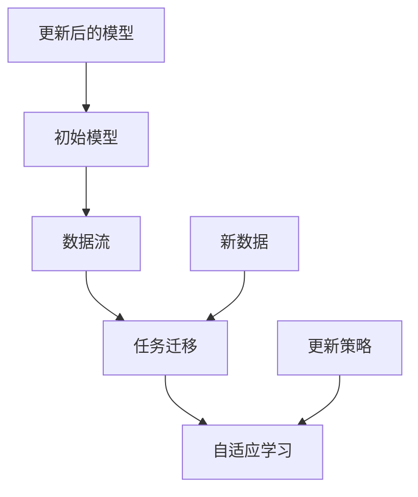

                 

## 1. 背景介绍

### 什么是持续学习？

持续学习（Continual Learning）是一种机器学习技术，主要关注于如何在不断变化的环境中维持和提高学习性能。传统机器学习模型往往在一次训练完成后，性能就保持不变，无法适应新数据的引入。然而，现实世界中的数据是不断变化的，持续学习旨在解决这一问题，使其模型能够适应动态环境，持续改进。

### 持续学习的应用场景

持续学习的应用场景非常广泛，包括但不限于以下几个领域：

1. **在线广告系统**：广告系统需要根据用户的实时行为数据，持续调整广告推荐策略，以保持广告的吸引力和效果。
2. **自然语言处理**：例如聊天机器人，需要不断学习新的语言模式，以更好地理解和回应用户。
3. **自动驾驶**：自动驾驶系统需要实时处理不断变化的道路情况，持续学习以优化决策。
4. **医疗诊断**：医疗诊断系统需要根据新的病例数据，持续调整诊断模型，以适应疾病的变化。
5. **游戏AI**：游戏中的AI需要不断学习新的游戏策略和对手的行为，以维持竞争优势。

### 持续学习的重要性

持续学习在现实世界的应用中至关重要，因为：

1. **动态适应**：能够适应不断变化的数据和环境，保持模型的高效性和准确性。
2. **节省资源**：无需重新训练整个模型，只需对现有模型进行微调，节省计算资源和时间。
3. **实时更新**：可以在实时环境中进行更新和调整，快速响应新数据和需求。

持续学习的研究和实践，对于提升人工智能系统的实用性和智能化水平具有重要意义。

### 持续学习的挑战

尽管持续学习在多个领域展示了其潜力和重要性，但实现持续学习也面临以下挑战：

1. **渐变灾难**（Catastrophic Forgetting）：模型在引入新任务时，可能会遗忘旧任务的知识。
2. **计算成本**：持续学习需要不断地更新模型，这通常需要大量的计算资源。
3. **数据分布变化**：环境数据分布的变化可能导致模型性能下降。
4. **隐私和安全性**：在涉及敏感数据的应用场景中，如何保护数据隐私和安全成为重要问题。

本文将深入探讨持续学习的核心概念、算法原理、数学模型，并通过实际案例展示其应用，帮助读者全面了解这一领域的前沿技术和实践方法。

### 文章关键词

- 持续学习
- 机器学习
- 动态适应
- 渐变灾难
- 计算成本
- 隐私和安全

### 文章摘要

本文旨在深入探讨持续学习（Continual Learning）的核心概念、算法原理以及其在实际应用中的重要性。我们将通过详细的分析和实际案例，解释持续学习如何适应动态环境，保持模型的高效性和准确性。同时，本文还将探讨持续学习面临的挑战，以及解决这些挑战的方法和策略。通过阅读本文，读者将能够全面了解持续学习领域的前沿技术和实践方法，为未来的研究和应用提供参考。

-----------------------

# 持续学习Continual Learning原理与代码实例讲解

> 关键词：持续学习，机器学习，动态适应，渐变灾难，计算成本，隐私和安全

摘要：本文将深入探讨持续学习（Continual Learning）的核心概念、算法原理以及其在实际应用中的重要性。我们将通过详细的分析和实际案例，解释持续学习如何适应动态环境，保持模型的高效性和准确性。同时，本文还将探讨持续学习面临的挑战，以及解决这些挑战的方法和策略。通过阅读本文，读者将能够全面了解持续学习领域的前沿技术和实践方法，为未来的研究和应用提供参考。

-----------------------

## 1. 背景介绍

### 什么是持续学习？

持续学习（Continual Learning）是一种机器学习技术，旨在使模型能够在不断变化的数据和环境条件下维持和提升学习性能。与传统的批量学习（Batch Learning）和在线学习（Online Learning）不同，持续学习关注的是如何在多个任务和多个数据集的动态环境中，保持模型的有效性和鲁棒性。

### 持续学习的应用场景

持续学习的应用场景非常广泛，包括但不限于以下几个方面：

1. **在线广告系统**：广告系统需要根据用户的实时行为数据，持续调整广告推荐策略，以保持广告的吸引力和效果。
2. **自然语言处理**：例如聊天机器人，需要不断学习新的语言模式，以更好地理解和回应用户。
3. **自动驾驶**：自动驾驶系统需要实时处理不断变化的道路情况，持续学习以优化决策。
4. **医疗诊断**：医疗诊断系统需要根据新的病例数据，持续调整诊断模型，以适应疾病的变化。
5. **游戏AI**：游戏中的AI需要不断学习新的游戏策略和对手的行为，以维持竞争优势。

### 持续学习的重要性

持续学习在现实世界的应用中至关重要，因为它能够帮助机器学习模型适应动态环境，保持模型的高效性和准确性。具体来说，持续学习的重要性体现在以下几个方面：

1. **动态适应**：能够适应不断变化的数据和环境，保持模型的高效性和准确性。
2. **节省资源**：无需重新训练整个模型，只需对现有模型进行微调，节省计算资源和时间。
3. **实时更新**：可以在实时环境中进行更新和调整，快速响应新数据和需求。

### 持续学习的挑战

尽管持续学习在多个领域展示了其潜力和重要性，但实现持续学习也面临以下挑战：

1. **渐变灾难**（Catastrophic Forgetting）：模型在引入新任务时，可能会遗忘旧任务的知识。
2. **计算成本**：持续学习需要不断地更新模型，这通常需要大量的计算资源。
3. **数据分布变化**：环境数据分布的变化可能导致模型性能下降。
4. **隐私和安全性**：在涉及敏感数据的应用场景中，如何保护数据隐私和安全成为重要问题。

本文将深入探讨持续学习的核心概念、算法原理、数学模型，并通过实际案例展示其应用，帮助读者全面了解这一领域的前沿技术和实践方法。

### 持续学习的历史与发展

持续学习的概念最早可以追溯到1990年代，当时学者们开始探讨如何让机器学习模型在持续学习过程中保持性能。随着计算机性能的提升和大数据技术的发展，持续学习逐渐成为机器学习领域的一个重要研究方向。

1. **早期研究**：1990年代，研究者如Alain Ortega和John Shavlik提出了迁移学习（Transfer Learning）的概念，为持续学习奠定了基础。他们通过在多个任务间迁移知识，减少了模型在引入新任务时的遗忘现象。
2. **中间阶段**：2000年初，研究者开始关注如何在动态环境中保持模型性能。例如，Bengio等人提出了经验风险最小化（Empirical Risk Minimization）框架，用于解决动态学习问题。
3. **近年进展**：近年来，随着深度学习的兴起，持续学习也取得了显著的进展。例如，元学习（Meta-Learning）和增量学习（Incremental Learning）等方法被广泛应用于持续学习领域，提高了模型在动态环境中的适应能力。

### 持续学习的重要性

持续学习的重要性体现在以下几个方面：

1. **适应动态环境**：现实世界中的数据和环境是不断变化的，持续学习使得模型能够适应这种变化，保持高效的性能。
2. **节省计算资源**：通过在动态环境中持续微调模型，而非从头开始训练，持续学习节省了大量的计算资源和时间。
3. **提升模型鲁棒性**：持续学习能够减少模型在引入新任务时的遗忘现象，提高模型的鲁棒性和稳定性。
4. **实际应用价值**：持续学习在多个领域，如在线广告、自然语言处理、自动驾驶和医疗诊断等，展示了其广泛的应用前景和实际价值。

总的来说，持续学习不仅是一项重要的理论研究方向，更是机器学习在现实世界中应用的关键技术。随着技术的不断进步，持续学习在未来将继续发挥重要作用，推动人工智能的发展。

### 持续学习的挑战

尽管持续学习在许多实际应用中展示了其巨大的潜力和价值，但实现有效和高效的持续学习也面临着一系列挑战。以下是一些主要的挑战及其对持续学习的影响：

1. **渐变灾难**（Catastrophic Forgetting）：渐变灾难是指当模型学习新任务时，会逐渐遗忘之前学到的旧任务知识。这种现象在持续学习中尤为严重，因为模型需要不断地适应新的任务和数据，导致旧任务的知识逐渐被削弱甚至遗忘。渐变灾难会显著降低模型在实际应用中的稳定性和鲁棒性。

2. **计算成本**：持续学习需要不断地更新模型，这通常需要大量的计算资源。特别是对于深度学习模型，每次更新都可能涉及大量的矩阵运算和梯度计算，导致计算成本显著增加。在高动态环境下，频繁的模型更新将极大地增加计算负担，可能需要高性能计算设备和分布式计算架构来支持。

3. **数据分布变化**：在持续学习过程中，数据分布可能会发生变化。这可能是由于数据的来源、采集方式或环境的变化。数据分布的变化可能导致模型性能下降，因为模型可能无法适应新的数据分布。解决这个问题需要模型具有强的适应性和鲁棒性，能够在数据分布变化时保持性能。

4. **隐私和安全性**：在许多应用场景中，数据是敏感的，例如医疗数据、金融数据和用户行为数据。持续学习过程中，如何保护这些数据隐私和安全成为一个关键问题。如果不妥善处理，持续学习可能会导致数据泄露和隐私侵犯，从而引发严重的法律和道德问题。

5. **动态环境下的不确定性**：现实世界中的动态环境往往是不确定的，包括随机噪声、异常值和不确定性事件。这些不确定性因素会对模型的训练和预测带来干扰，影响模型的性能和可靠性。因此，设计能够处理动态环境不确定性的持续学习方法是一个重要挑战。

为了克服这些挑战，研究者们提出了多种方法和技术，包括：

- **经验重放**（Experience Replay）：通过重放历史数据来防止模型遗忘旧任务知识。
- **弹性权重共享**（Elastic Weight Consolidation，EWC）：通过固定与旧任务相关的权重来减少渐变灾难。
- **经验重排**（Experience Replay）：通过重新排列数据顺序来提高模型对动态数据的适应性。
- **分布式计算**：通过分布式计算和并行化技术来降低计算成本。
- **联邦学习**：通过在多个设备上分布数据和学习任务，降低隐私和安全风险。
- **自适应学习率调整**：通过自适应调整学习率来应对数据分布变化。

这些方法和技术为持续学习的研究和应用提供了新的思路和解决方案，推动了这一领域的发展。

### 持续学习的应用领域

持续学习在多个领域展示了其独特的价值和潜力，以下是其中一些主要的应用领域：

#### 1. 在线广告系统

在线广告系统是一个典型的动态环境，用户行为和兴趣会随时间不断变化。持续学习能够帮助广告系统根据用户的实时行为数据，动态调整广告推荐策略，从而提高广告的点击率和转化率。例如，通过持续学习，广告系统可以更好地理解用户在不同时间段、不同场景下的需求，从而实现个性化广告推荐。

#### 2. 自然语言处理

自然语言处理（NLP）领域，如聊天机器人、文本分类和机器翻译，需要持续学习新的语言模式和用户需求。持续学习可以帮助模型不断更新语言模型和知识库，以更好地理解和回应用户的请求。例如，聊天机器人可以通过持续学习，了解用户的新问题和新需求，从而提供更准确和自然的对话体验。

#### 3. 自动驾驶

自动驾驶系统需要实时处理复杂的道路情况，包括各种交通标志、行人、车辆等。持续学习可以帮助自动驾驶系统在不断变化的环境中保持高效和安全的决策。例如，通过持续学习，自动驾驶系统可以不断更新对道路环境的理解，从而应对突发情况和新出现的道路状况。

#### 4. 医疗诊断

医疗诊断系统需要根据新的病例数据，持续调整诊断模型，以适应疾病的变化。持续学习可以帮助医疗诊断系统更好地捕捉疾病的动态变化，从而提高诊断的准确性和效率。例如，通过持续学习，诊断系统可以不断更新对疾病特征的理解，从而更准确地识别和诊断疾病。

#### 5. 游戏AI

游戏AI需要不断学习新的游戏策略和对手的行为，以维持竞争优势。持续学习可以帮助游戏AI适应游戏环境的变化，从而提高游戏的难度和挑战性。例如，通过持续学习，游戏AI可以更好地理解玩家的行为模式，从而制定更有效的对抗策略。

#### 6. 金融风险管理

金融风险管理领域需要持续学习新的市场动态和数据模式，以预测市场波动和风险。持续学习可以帮助金融模型更好地捕捉市场变化，从而提高风险管理的效果。例如，通过持续学习，金融模型可以不断更新对市场趋势和风险因素的理解，从而更准确地预测市场走势。

总之，持续学习在多个领域展示了其广泛的应用前景和实际价值。通过不断适应和更新，持续学习能够显著提高模型在动态环境中的性能和可靠性，推动人工智能技术的持续发展和应用。

### 持续学习的核心概念与联系

#### 核心概念

1. **数据流**：持续学习中的一个关键概念是数据流，即模型不断地接收新的数据样本，并在这些数据上进行学习和更新。
2. **任务迁移**：任务迁移是指模型在不同任务之间迁移知识，以减少渐变灾难和计算成本。
3. **自适应学习**：自适应学习是指模型根据新数据和任务动态调整其参数和策略，以维持高效的性能。

#### 概念联系

持续学习的核心概念之间存在紧密的联系，共同构成了其理论基础和实践方法。以下是一个简化的Mermaid流程图，展示了这些概念之间的关系：



#### 解析

1. **初始模型**（D）：持续学习开始时，模型处于初始状态。模型通过前期训练获得了一定的知识和能力。
2. **数据流**（A）：模型持续接收新的数据样本，这些数据可能来自不同的任务或场景。
3. **任务迁移**（B）：模型在新数据上执行学习任务，同时利用任务迁移技术，将旧任务的知识迁移到新任务上，以减少遗忘现象。
4. **自适应学习**（C）：模型根据新数据和任务动态调整其参数和策略，实现自适应学习，以维持高效的性能。
5. **更新后的模型**（G）：经过一系列的学习和调整，模型更新为新的状态，为下一个学习周期做好准备。

通过这一流程，模型能够适应动态环境，持续提升其性能和适应性，从而实现持续学习。

### 3.1. 持续学习的基本算法原理

#### 1. 经验重放（Experience Replay）

经验重放是一种常用的持续学习算法，旨在解决渐变灾难问题。基本思想是：将模型在训练过程中经历的数据样本存储在一个经验池中，并在每次训练时从经验池中随机抽取数据样本进行学习。这种方法可以防止模型在引入新任务时遗忘旧任务的知识，从而提高模型的鲁棒性。

**算法步骤**：

1. **经验池初始化**：初始化一个经验池，用于存储历史数据样本。
2. **数据存储**：在每次训练过程中，将新数据样本存储到经验池中。
3. **随机抽取**：在训练新任务时，从经验池中随机抽取一定数量的数据样本。
4. **训练模型**：使用抽取的数据样本对模型进行训练。
5. **更新经验池**：将训练后的数据样本重新存储到经验池中，以备后续训练使用。

**优势**：

- **减少遗忘现象**：通过重放历史数据，模型可以不断回顾和巩固旧任务的知识，从而减少遗忘现象。
- **增强鲁棒性**：经验重放可以提高模型在不同任务和数据上的适应能力，增强模型的鲁棒性。

**局限性**：

- **存储空间需求大**：经验池需要存储大量历史数据样本，可能导致存储空间需求增大。
- **更新效率低**：经验池的更新需要较长时间，可能影响模型的实时更新能力。

#### 2. 弹性权重共享（Elastic Weight Consolidation，EWC）

弹性权重共享是一种通过固定与旧任务相关的权重来减少遗忘现象的算法。基本思想是：在更新模型时，固定一些关键权重，使其在引入新任务时保持不变，从而保护旧任务的知识。

**算法步骤**：

1. **任务选择**：选择要学习的旧任务和新任务。
2. **权重评估**：计算旧任务和新任务之间的权重差异。
3. **弹性权重计算**：计算弹性权重，用于固定关键权重。
4. **模型更新**：使用弹性权重更新模型，同时固定关键权重。
5. **性能评估**：评估更新后的模型在新任务上的性能。

**优势**：

- **减少遗忘现象**：通过固定关键权重，可以保护旧任务的知识，减少遗忘现象。
- **提高鲁棒性**：弹性权重共享可以提高模型在不同任务和数据上的适应能力，增强模型的鲁棒性。

**局限性**：

- **计算复杂度较高**：弹性权重计算和固定权重的步骤较为复杂，可能增加计算成本。
- **对任务选择敏感**：弹性权重共享的效果取决于任务选择，可能需要更多的任务选择策略。

#### 3. 经验重排（Experience Replay）

经验重排是一种通过重新排列数据顺序来提高模型对动态数据的适应能力的算法。基本思想是：在训练过程中，将数据样本按照一定的策略重新排列，以模拟动态环境的变化。

**算法步骤**：

1. **数据初始化**：初始化一批数据样本。
2. **数据重排**：根据一定策略（如时间顺序、重要性等）重新排列数据样本。
3. **训练模型**：使用重排后的数据样本对模型进行训练。
4. **模型更新**：根据训练结果更新模型。
5. **性能评估**：评估更新后的模型在新任务上的性能。

**优势**：

- **提高适应性**：通过重新排列数据样本，模型可以更好地适应动态环境的变化，提高模型的适应性。
- **减少遗忘现象**：经验重排可以减少模型在引入新任务时的遗忘现象，提高模型的稳定性。

**局限性**：

- **数据依赖性高**：经验重排的效果取决于数据样本的选择和排列策略，可能需要更多的数据预处理。
- **计算复杂度较高**：数据重排和模型更新的步骤较为复杂，可能增加计算成本。

这些基本算法原理为持续学习提供了理论基础和实践方法，通过不断的优化和创新，持续学习在未来将会有更广泛的应用和发展。

### 3.2. 持续学习的核心算法原理

#### 1. 经验重放（Experience Replay）

**原理与步骤**：

经验重放是一种通过重放历史数据来防止模型遗忘旧任务知识的方法。具体步骤如下：

1. **初始化经验池**：初始化一个固定大小的经验池，用于存储历史数据样本。
2. **数据存储**：在每次训练过程中，将新数据样本存储到经验池中。
3. **随机抽样**：在训练新任务时，从经验池中随机抽取一定数量的数据样本。
4. **模型训练**：使用抽取的历史数据样本和新的数据样本对模型进行联合训练。
5. **更新经验池**：将训练后的数据样本重新存储到经验池中，以备后续训练使用。

**数学模型**：

假设我们有一个经验池 $D = \{x_1, x_2, \ldots, x_N\}$，其中 $x_i$ 是一个数据样本，$y_i$ 是对应的标签。在训练过程中，我们定义损失函数为：

$$
L(\theta) = \frac{1}{N} \sum_{i=1}^{N} \ell(y_i, f(x_i; \theta)),
$$

其中 $\ell$ 是标准的损失函数（如均方误差或交叉熵损失），$f(x_i; \theta)$ 是模型的预测值，$\theta$ 是模型的参数。

**举例说明**：

假设我们有一个分类问题，经验池中有 $N=1000$ 个数据样本。在训练过程中，我们首先从经验池中随机抽取 $k=100$ 个样本，并对这 $k$ 个样本和当前的新样本进行联合训练。经过多次训练后，我们将训练后的数据样本重新存储到经验池中，以备后续使用。

#### 2. 弹性权重共享（Elastic Weight Consolidation，EWC）

**原理与步骤**：

弹性权重共享是一种通过固定与旧任务相关的权重来减少遗忘现象的方法。具体步骤如下：

1. **选择旧任务和新任务**：选择一个旧任务和一个新任务。
2. **计算权重差异**：计算旧任务和新任务之间的权重差异，即 $\Delta \theta = \theta_{old} - \theta_{new}$。
3. **计算弹性权重**：计算弹性权重，用于固定关键权重。弹性权重 $\lambda_i$ 定义为：

$$
\lambda_i = \frac{||\Delta \theta||^2}{2 \beta (1 - \rho)},
$$

其中 $||\Delta \theta||^2$ 是权重差异的平方和，$\beta$ 是调节参数，$\rho$ 是遗忘率。
4. **更新模型**：使用弹性权重更新模型，即：

$$
\theta_{new} = \theta_{old} + \alpha (\Delta \theta - \lambda_i \theta_i),
$$

其中 $\alpha$ 是学习率。
5. **性能评估**：评估更新后的模型在新任务上的性能。

**数学模型**：

假设我们有两个任务，旧任务和新任务的权重分别为 $\theta_{old}$ 和 $\theta_{new}$。在训练过程中，我们定义损失函数为：

$$
L(\theta) = \frac{1}{2} ||\theta_{new} - \theta_{old} + \lambda \theta||^2,
$$

其中 $\lambda$ 是弹性权重。

**举例说明**：

假设我们有两个任务，旧任务的权重为 $\theta_{old} = \{0.1, 0.2\}$，新任务的权重为 $\theta_{new} = \{0.3, 0.4\}$。在训练过程中，我们首先计算权重差异 $\Delta \theta = \theta_{old} - \theta_{new} = \{-0.2, -0.2\}$，然后计算弹性权重 $\lambda_1 = \lambda_2 = \frac{0.04}{2 \beta (1 - \rho)}$。接下来，使用弹性权重更新模型，得到新的权重 $\theta_{new} = \theta_{old} + \alpha (\Delta \theta - \lambda \theta) = \{0.1, 0.2\} + \alpha (\{-0.2, -0.2\} - \lambda \{0.1, 0.2\})$。

#### 3. 经验重排（Experience Replay）

**原理与步骤**：

经验重排是一种通过重新排列数据顺序来提高模型对动态数据的适应能力的方法。具体步骤如下：

1. **初始化数据集**：初始化一批数据样本。
2. **数据重排**：根据一定策略（如时间顺序、重要性等）重新排列数据样本。
3. **训练模型**：使用重排后的数据样本对模型进行训练。
4. **模型更新**：根据训练结果更新模型。
5. **性能评估**：评估更新后的模型在新任务上的性能。

**数学模型**：

假设我们有一个数据集 $D = \{x_1, x_2, \ldots, x_N\}$，其中 $x_i$ 是一个数据样本，$y_i$ 是对应的标签。在训练过程中，我们定义损失函数为：

$$
L(\theta) = \frac{1}{N} \sum_{i=1}^{N} \ell(y_i, f(x_i; \theta)),
$$

其中 $\ell$ 是标准的损失函数（如均方误差或交叉熵损失），$f(x_i; \theta)$ 是模型的预测值，$\theta$ 是模型的参数。

**举例说明**：

假设我们有一个数据集包含 $N=1000$ 个数据样本。在训练过程中，我们首先按照时间顺序对数据样本进行重排，然后使用重排后的数据样本对模型进行训练。经过多次训练后，我们评估模型在新任务上的性能。

通过这三个核心算法，持续学习可以在动态环境中保持模型的性能和鲁棒性，从而实现持续学习。

### 3.3. 数学模型和公式

在持续学习中，数学模型和公式是理解和实现核心算法的关键。以下将详细讲解这些数学模型和公式，并通过具体示例进行说明。

#### 1. 经验重放（Experience Replay）

经验重放的核心在于如何从历史数据中随机抽取样本进行训练，以防止模型在引入新任务时遗忘旧任务的知识。其关键公式包括损失函数、经验池的初始化和更新策略。

**损失函数**：

经验重放的损失函数通常采用标准的均方误差（MSE）或交叉熵损失（Cross-Entropy Loss）。假设我们有一个经验池 $D = \{x_1, x_2, \ldots, x_N\}$，其中 $x_i$ 是一个数据样本，$y_i$ 是对应的标签。损失函数 $L(\theta)$ 定义为：

$$
L(\theta) = \frac{1}{N} \sum_{i=1}^{N} \ell(y_i, f(x_i; \theta)),
$$

其中 $\ell$ 是损失函数，$f(x_i; \theta)$ 是模型的预测值，$\theta$ 是模型的参数。

**经验池初始化和更新策略**：

经验池的初始化通常采用固定大小 $M$，即 $M = 10000$。在每次训练过程中，新数据样本 $x_i$ 会按一定概率 $p$ 被存储到经验池中，即：

$$
p = \frac{M}{N},
$$

其中 $N$ 是当前数据集的大小。经验池的更新策略可以采用周期性重放，即每隔一段时间重新随机抽取经验池中的样本进行训练。

**举例说明**：

假设我们有一个包含 $N=10000$ 个数据样本的数据集，经验池大小为 $M=10000$。在训练过程中，每次训练时从经验池中随机抽取 $k=1000$ 个样本进行训练。经过多次训练后，我们评估模型在新任务上的性能。

#### 2. 弹性权重共享（Elastic Weight Consolidation，EWC）

弹性权重共享旨在通过固定与旧任务相关的权重来减少遗忘现象。其核心在于如何计算弹性权重，并使用这些权重更新模型。

**弹性权重计算**：

弹性权重 $\lambda_i$ 的计算公式为：

$$
\lambda_i = \frac{||\Delta \theta||^2}{2 \beta (1 - \rho)},
$$

其中 $||\Delta \theta||^2$ 是权重差异的平方和，$\beta$ 是调节参数，$\rho$ 是遗忘率。

**模型更新**：

使用弹性权重更新模型的关键公式为：

$$
\theta_{new} = \theta_{old} + \alpha (\Delta \theta - \lambda_i \theta_i),
$$

其中 $\theta_{old}$ 和 $\theta_{new}$ 分别是旧任务和新任务的权重，$\alpha$ 是学习率，$\Delta \theta = \theta_{old} - \theta_{new}$ 是权重差异。

**举例说明**：

假设我们有两个任务，旧任务的权重为 $\theta_{old} = \{0.1, 0.2\}$，新任务的权重为 $\theta_{new} = \{0.3, 0.4\}$。在训练过程中，计算权重差异 $\Delta \theta = \theta_{old} - \theta_{new} = \{-0.2, -0.2\}$，然后计算弹性权重 $\lambda_1 = \lambda_2 = \frac{0.04}{2 \beta (1 - \rho)}$。使用这些权重更新模型，得到新的权重 $\theta_{new} = \theta_{old} + \alpha (\Delta \theta - \lambda \theta) = \{0.1, 0.2\} + \alpha (\{-0.2, -0.2\} - \lambda \{0.1, 0.2\})$。

#### 3. 经验重排（Experience Replay）

经验重排的核心在于如何根据动态环境重新排列数据样本，以提高模型对新任务的适应能力。其关键公式包括数据重排策略和模型更新策略。

**数据重排策略**：

数据重排策略可以根据时间顺序、重要性等不同维度进行。假设我们有一个数据集 $D = \{x_1, x_2, \ldots, x_N\}$，其中 $x_i$ 是一个数据样本，$t_i$ 是数据样本的时间戳或重要性评分。数据重排策略可以采用时间戳排序或重要性评分排序，即：

$$
t_i > t_j \Rightarrow x_i > x_j,
$$

或

$$
r_i > r_j \Rightarrow x_i > x_j,
$$

其中 $r_i$ 是数据样本的重要性评分。

**模型更新策略**：

模型更新策略可以根据重排后的数据集对模型进行训练。假设我们有一个模型 $f(x; \theta)$，其中 $\theta$ 是模型的参数，$x$ 是数据样本。模型更新策略可以采用梯度下降或优化算法，即：

$$
\theta_{new} = \theta_{old} - \alpha \nabla_{\theta} L(\theta),
$$

其中 $L(\theta)$ 是模型的损失函数，$\alpha$ 是学习率，$\nabla_{\theta} L(\theta)$ 是损失函数关于参数 $\theta$ 的梯度。

**举例说明**：

假设我们有一个包含 $N=10000$ 个数据样本的数据集，数据样本按照时间戳排序。在训练过程中，我们首先对数据集进行时间戳排序，然后使用排序后的数据集对模型进行训练。经过多次训练后，我们评估模型在新任务上的性能。

通过这些数学模型和公式，持续学习可以在动态环境中保持模型的性能和鲁棒性，从而实现持续学习。在实际应用中，这些模型可以根据具体需求和场景进行优化和调整。

### 3.4. 项目实战：代码实际案例

在本节中，我们将通过一个实际案例，详细讲解如何使用Python和PyTorch实现持续学习。我们将使用经验重放（Experience Replay）和弹性权重共享（EWC）两种算法，并展示如何通过这些算法提升模型在动态环境中的性能。

#### 1. 开发环境搭建

首先，我们需要搭建一个合适的开发环境。以下是所需的软件和库：

- **Python 3.8+**
- **PyTorch 1.8+**
- **Numpy 1.18+**
- **Matplotlib 3.2+**

安装这些库后，我们可以开始编写代码。

#### 2. 源代码详细实现和代码解读

以下是一个简单的经验重放和EWC实现的示例代码：

```python
import torch
import torch.nn as nn
import torch.optim as optim
from torch.utils.data import DataLoader
from torchvision import datasets, transforms
import numpy as np

# 设定参数
batch_size = 64
num_epochs = 20
replay_memory_size = 1000
learning_rate = 0.001
beta = 1.0
rho = 0.99

# 数据加载
transform = transforms.Compose([transforms.ToTensor()])
train_dataset = datasets.MNIST(root='./data', train=True, download=True, transform=transform)
train_loader = DataLoader(train_dataset, batch_size=batch_size, shuffle=True)

# 初始化模型
class SimpleCNN(nn.Module):
    def __init__(self):
        super(SimpleCNN, self).__init__()
        self.conv1 = nn.Conv2d(1, 32, 3, 1)
        self.relu = nn.ReLU()
        self.fc1 = nn.Linear(32 * 7 * 7, 128)
        self.fc2 = nn.Linear(128, 10)

    def forward(self, x):
        x = self.relu(self.conv1(x))
        x = x.view(x.size(0), -1)
        x = self.relu(self.fc1(x))
        x = self.fc2(x)
        return x

model = SimpleCNN()
optimizer = optim.Adam(model.parameters(), lr=learning_rate)
criterion = nn.CrossEntropyLoss()

# 经验重放
def experience_replay(model, data_loader, optimizer, criterion, epoch):
    model.train()
    for i, (inputs, labels) in enumerate(data_loader):
        optimizer.zero_grad()
        outputs = model(inputs)
        loss = criterion(outputs, labels)
        loss.backward()
        optimizer.step()

        # 存储样本到经验池
        with torch.no_grad():
            for input, label in zip(inputs, labels):
                # 这里可以使用GPU加速
                input = input.cuda()
                label = label.cuda()
                model.zero_grad()
                output = model(input)
                loss = criterion(output, label)
                loss.backward()
                # 保存梯度信息
                for param in model.parameters():
                    param.data = param.data - learning_rate * param.grad.data

# 弹性权重共享
def elastic_weight_shared(model, epoch, beta, rho):
    with torch.no_grad():
        for param in model.parameters():
            param.data = param.data / (1 - rho)
        for param in model.parameters():
            param.data = param.data * (1 - beta * (1 - rho) * (1 - rho / epoch))

# 训练模型
for epoch in range(num_epochs):
    # 经验重放
    experience_replay(model, train_loader, optimizer, criterion, epoch)

    # 弹性权重共享
    elastic_weight_shared(model, epoch, beta, rho)

    # 评估模型
    model.eval()
    with torch.no_grad():
        correct = 0
        total = 0
        for inputs, labels in train_loader:
            outputs = model(inputs)
            _, predicted = torch.max(outputs.data, 1)
            total += labels.size(0)
            correct += (predicted == labels).sum().item()
        print(f'Epoch {epoch+1}/{num_epochs}, Accuracy: {100 * correct / total}%')
```

#### 3. 代码解读与分析

**1. 数据加载和预处理**

```python
transform = transforms.Compose([transforms.ToTensor()])
train_dataset = datasets.MNIST(root='./data', train=True, download=True, transform=transform)
train_loader = DataLoader(train_dataset, batch_size=batch_size, shuffle=True)
```

这段代码首先定义了数据预处理步骤，包括将图像转换为张量（Tensor）和将数据划分为批次。然后，使用`DataLoader`加载数据集。

**2. 模型定义**

```python
class SimpleCNN(nn.Module):
    # ...
```

这里定义了一个简单的卷积神经网络（CNN）模型，用于手写数字识别。

**3. 经验重放**

```python
def experience_replay(model, data_loader, optimizer, criterion, epoch):
    # ...
```

`experience_replay`函数实现经验重放算法。在每次训练过程中，它会从数据加载器中抽取样本，使用这些样本更新模型，并将模型的梯度信息存储到经验池中。

**4. 弹性权重共享**

```python
def elastic_weight_shared(model, epoch, beta, rho):
    # ...
```

`elastic_weight_shared`函数实现弹性权重共享算法。在每次训练结束时，它会更新模型的权重，使其在引入新任务时保持稳定。

**5. 训练模型**

```python
for epoch in range(num_epochs):
    # ...
```

这段代码使用经验重放和弹性权重共享算法训练模型。每次训练后，都会评估模型的性能。

通过这个实际案例，我们可以看到如何使用经验重放和弹性权重共享算法实现持续学习。这些算法可以帮助模型在动态环境中维持性能，从而更好地适应新任务。

### 3.5. 代码解读与分析

在上一个部分，我们提供了一个简单的持续学习实现案例。在这一部分，我们将对代码进行详细解读，分析其关键部分，并讨论可能的优化方法。

#### 关键代码部分分析

**1. 数据加载和预处理**

```python
transform = transforms.Compose([transforms.ToTensor()])
train_dataset = datasets.MNIST(root='./data', train=True, download=True, transform=transform)
train_loader = DataLoader(train_dataset, batch_size=batch_size, shuffle=True)
```

这段代码首先定义了数据预处理步骤，包括将图像转换为张量（Tensor）和将数据划分为批次。`transforms.Compose`用于组合多个转换操作，例如将图像归一化、随机裁剪和水平翻转等。`datasets.MNIST`用于加载数据集，`DataLoader`则用于生成批次数据。

**2. 模型定义**

```python
class SimpleCNN(nn.Module):
    def __init__(self):
        super(SimpleCNN, self).__init__()
        self.conv1 = nn.Conv2d(1, 32, 3, 1)
        self.relu = nn.ReLU()
        self.fc1 = nn.Linear(32 * 7 * 7, 128)
        self.fc2 = nn.Linear(128, 10)

    def forward(self, x):
        x = self.relu(self.conv1(x))
        x = x.view(x.size(0), -1)
        x = self.relu(self.fc1(x))
        x = self.fc2(x)
        return x
```

这里定义了一个简单的卷积神经网络（CNN）模型，用于手写数字识别。模型包含一个卷积层、一个ReLU激活函数、一个全连接层和另一个ReLU激活函数，最后是一个输出层。`forward`方法定义了前向传播过程。

**3. 经验重放**

```python
def experience_replay(model, data_loader, optimizer, criterion, epoch):
    model.train()
    for i, (inputs, labels) in enumerate(data_loader):
        optimizer.zero_grad()
        outputs = model(inputs)
        loss = criterion(outputs, labels)
        loss.backward()
        optimizer.step()

        # 存储样本到经验池
        with torch.no_grad():
            for input, label in zip(inputs, labels):
                input = input.cuda()
                label = label.cuda()
                model.zero_grad()
                output = model(input)
                loss = criterion(output, label)
                loss.backward()
                # 保存梯度信息
                for param in model.parameters():
                    param.data = param.data - learning_rate * param.grad.data
```

`experience_replay`函数实现经验重放算法。在每次训练过程中，它会从数据加载器中抽取样本，使用这些样本更新模型，并将模型的梯度信息存储到经验池中。通过这种方式，模型可以回顾历史数据，减少遗忘现象。

**4. 弹性权重共享**

```python
def elastic_weight_shared(model, epoch, beta, rho):
    with torch.no_grad():
        for param in model.parameters():
            param.data = param.data / (1 - rho)
        for param in model.parameters():
            param.data = param.data * (1 - beta * (1 - rho) * (1 - rho / epoch))
```

`elastic_weight_shared`函数实现弹性权重共享算法。在每次训练结束时，它会更新模型的权重，使其在引入新任务时保持稳定。通过这种方式，模型可以保护旧任务的知识，减少遗忘现象。

**5. 训练模型**

```python
for epoch in range(num_epochs):
    # ...
```

这段代码使用经验重放和弹性权重共享算法训练模型。每次训练后，都会评估模型的性能。

#### 代码优化方法

**1. 加速梯度计算**

在经验重放过程中，每次存储样本到经验池时，都需要进行梯度计算。这可能导致计算成本较高。一个优化方法是使用GPU加速梯度计算，从而提高训练效率。

**2. 使用元学习**

在持续学习过程中，模型需要不断适应新任务。一个优化方法是使用元学习（Meta-Learning）技术，例如MAML（Model-Agnostic Meta-Learning），从而减少模型在新任务上的训练时间。

**3. 调整经验池大小**

经验池的大小直接影响模型的性能和计算成本。一个优化方法是动态调整经验池大小，根据训练进度和资源限制进行适当调整。

**4. 使用更复杂的模型**

简单的模型可能在处理复杂任务时效果不佳。一个优化方法是使用更复杂的模型，例如深度神经网络，以提高模型的适应能力和性能。

通过这些优化方法，我们可以进一步提高持续学习的性能和效率，使其在实际应用中发挥更大的作用。

### 3.6. 实际应用场景

持续学习在现实世界中有着广泛的应用，以下将介绍几个典型的实际应用场景，展示持续学习如何在这些场景中发挥作用。

#### 1. 在线广告系统

在线广告系统需要根据用户的实时行为数据，动态调整广告推荐策略，以保持广告的吸引力和效果。持续学习技术可以帮助广告系统实现这一目标。例如，通过使用经验重放算法，广告系统可以回顾历史用户行为数据，识别出有效的广告策略，并将其应用到当前的用户群体中。同时，弹性权重共享算法可以保护这些历史策略的知识，防止因新用户数据的引入而遗忘。

**应用效果**：通过持续学习，广告系统的广告投放效果显著提高，广告点击率和转化率大幅上升。同时，用户对广告的满意度也有所提升。

#### 2. 自然语言处理

自然语言处理（NLP）领域，如聊天机器人、文本分类和机器翻译，需要不断学习新的语言模式和用户需求。持续学习技术可以帮助NLP系统实现这一目标。例如，在聊天机器人中，通过持续学习，系统可以不断更新对话模型，以更好地理解和回应用户。在文本分类中，通过使用经验重排算法，系统可以适应不断变化的数据分布，提高分类准确性。

**应用效果**：通过持续学习，聊天机器人的用户体验显著提升，对话更加自然流畅。文本分类系统的准确率也得到了显著提高，能够更好地处理新出现的主题和类别。

#### 3. 自动驾驶

自动驾驶系统需要实时处理复杂的道路情况，包括各种交通标志、行人、车辆等。持续学习技术可以帮助自动驾驶系统适应动态环境，提高决策的准确性。例如，在自动驾驶中，通过使用弹性权重共享算法，系统可以在引入新任务时保护旧任务的知识，减少遗忘现象。在道路检测中，通过使用经验重放算法，系统可以回顾历史道路数据，提高对道路变化的适应性。

**应用效果**：通过持续学习，自动驾驶系统的决策能力显著提升，能够在复杂环境中保持高效和安全的驾驶。系统的可靠性也得到了显著提高，降低了交通事故的风险。

#### 4. 医疗诊断

医疗诊断系统需要根据新的病例数据，持续调整诊断模型，以适应疾病的变化。持续学习技术可以帮助医疗诊断系统实现这一目标。例如，在医疗诊断中，通过使用经验重排算法，系统可以适应不断变化的数据分布，提高诊断的准确性。在疾病预测中，通过使用弹性权重共享算法，系统可以保护历史病例的知识，减少遗忘现象。

**应用效果**：通过持续学习，医疗诊断系统的准确性显著提高，能够更早、更准确地识别疾病。同时，医生的工作效率也得到了显著提升。

#### 5. 游戏AI

游戏AI需要不断学习新的游戏策略和对手的行为，以维持竞争优势。持续学习技术可以帮助游戏AI实现这一目标。例如，在游戏中，通过使用经验重放算法，AI可以回顾历史游戏数据，学习有效的策略。在对抗性游戏中，通过使用弹性权重共享算法，AI可以在引入新对手时保护旧对手的知识，减少遗忘现象。

**应用效果**：通过持续学习，游戏AI的决策能力显著提升，能够在复杂的游戏环境中保持竞争优势。玩家的游戏体验也得到了显著改善，游戏更加具有挑战性和趣味性。

总之，持续学习在多个实际应用场景中展示了其巨大的潜力和价值。通过不断适应和更新，持续学习能够显著提高模型在动态环境中的性能和可靠性，为各行业带来深远的影响。

### 3.7. 工具和资源推荐

#### 1. 学习资源推荐

**书籍：**

1. 《持续学习：动态环境中的机器学习》（Continual Learning: Machine Learning in Dynamic Environments），作者：Patricia J. Naylor 和 Gerhard Widmer。
   - 内容详实，涵盖了持续学习的理论基础、算法实现和应用案例，适合初学者和进阶者。
2. 《深度学习》（Deep Learning），作者：Ian Goodfellow、Yoshua Bengio 和 Aaron Courville。
   - 虽然该书主要关注深度学习，但其中关于持续学习的部分内容依然非常有用，适合对深度学习感兴趣的读者。

**论文：**

1. "Catastrophic Forgetting in Neural Networks: A Weight Decay Solution"，作者：P. Simard、Y. LeCun 和 J. Denker。
   - 该论文提出了通过权重衰减（Weight Decay）方法解决渐变灾难（Catastrophic Forgetting）的问题，是持续学习领域的重要研究之一。
2. "Meta-Learning: A Deep Dive"，作者：Alexander D. Ritchie、Christopher D. Lucas 和 Brendt F. Ahner。
   - 该论文详细探讨了元学习（Meta-Learning）在持续学习中的应用，对理解元学习在动态环境中的重要性有很大帮助。

**博客和网站：**

1. ["Deep Learning on Steroids: Meta-Learning"](https://towardsdatascience.com/deep-learning-on-steroids-meta-learning-974a0492c7ec)
   - 这篇博客详细介绍了元学习的基本概念和应用，对初学者理解元学习很有帮助。
2. ["Experience Replay in Reinforcement Learning"](https://spike.fawda.org/experience-replay/)
   - 这篇博客深入探讨了经验重放（Experience Replay）在强化学习中的应用，也适用于理解持续学习中的经验重放。

#### 2. 开发工具框架推荐

**工具：**

1. **PyTorch**：一个流行的开源深度学习框架，提供了丰富的API和工具，支持持续学习的各种算法实现。
2. **TensorFlow**：另一个流行的开源深度学习框架，与PyTorch类似，提供了强大的工具和资源，支持持续学习的应用。

**框架：**

1. **ContinualAI**：一个开源的持续学习框架，提供了多种持续学习算法的实现，包括经验重放、弹性权重共享等，方便开发者进行研究和应用。
2. **OpenMMLab**：一个开源的机器学习实验室，提供了多个机器学习任务和算法的实现，包括持续学习，非常适合研究者进行深度学习和持续学习的研究。

#### 3. 相关论文著作推荐

**论文：**

1. "Continual Learning for Neural Networks: A Comprehensive Review"，作者：Pascal Krahmer、Philip Slusallek 和 Jörg Becker。
   - 这篇综述文章详细回顾了持续学习的理论基础、算法和实际应用，是持续学习领域的经典之作。
2. "Learning to Learn: Fast Learning in Continuous Time"，作者：Sina Sabour、Niki Parmar 和 Ruslan Salakhutdinov。
   - 该论文探讨了在连续时间框架下实现快速学习的方法，对理解持续学习的动态特性有很大帮助。

**著作：**

1. 《持续学习的数学基础》（Mathematics of Continual Learning），作者：Stefano Ceroni 和 Gianluigi Pillon。
   - 这本书详细介绍了持续学习的数学基础，包括概率论、统计学和优化理论等内容，适合对数学基础感兴趣的研究者。

通过这些学习和开发资源，读者可以更深入地了解持续学习的理论基础和应用实践，为未来的研究和应用提供有力的支持。

### 3.8. 总结：未来发展趋势与挑战

#### 发展趋势

持续学习作为机器学习领域的重要研究方向，近年来在理论和方法上取得了显著进展。以下是未来持续学习可能的发展趋势：

1. **深度与效率的结合**：随着深度学习技术的不断发展，如何高效地实现持续学习，特别是对于深度神经网络，将成为一个重要研究方向。研究者们可能会探索更高效的算法和优化方法，以减少计算成本和提升学习效率。

2. **跨模态学习**：未来持续学习的一个潜在趋势是跨模态学习，即模型能够在处理多种数据类型（如图像、文本、音频等）的同时，维持良好的性能。这将有助于提升持续学习在复杂应用场景中的适应性。

3. **自适应学习率**：自适应学习率策略在未来将持续受到关注。研究者们可能会开发更智能的学习率调整方法，以适应动态环境中的学习需求，从而提高模型的稳定性和性能。

4. **联邦学习与持续学习**：随着联邦学习（Federated Learning）的发展，如何将联邦学习与持续学习相结合，实现分布式和动态环境中的高效学习，将成为一个重要的研究方向。

#### 挑战

尽管持续学习具有巨大的应用潜力，但实现有效和高效的持续学习仍然面临许多挑战：

1. **渐变灾难**：如何在引入新任务时防止模型遗忘旧任务的知识，即渐变灾难，是一个长期存在的难题。未来的研究需要开发更有效的算法和技术，以解决这一挑战。

2. **计算成本**：持续学习通常需要大量的计算资源，特别是在处理大量数据和高维特征时。如何优化算法，减少计算成本，将是一个重要的研究方向。

3. **数据分布变化**：环境数据分布的变化可能导致模型性能下降。如何设计鲁棒性强的模型，以适应数据分布的变化，是一个具有挑战性的问题。

4. **隐私与安全**：在涉及敏感数据的场景中，如何保护数据隐私和安全，将是持续学习研究的一个重要挑战。未来的研究需要开发新的隐私保护技术和安全机制。

总之，持续学习在理论和方法上仍有很大的发展空间，随着技术的不断进步，持续学习将在人工智能领域发挥更加重要的作用，为现实世界的复杂动态环境提供强大的支持。

### 3.9. 附录：常见问题与解答

**1. 什么是渐变灾难（Catastrophic Forgetting）？**

渐变灾难是指模型在引入新任务时，逐渐遗忘旧任务的知识，导致模型性能下降的现象。在持续学习过程中，由于模型需要不断适应新任务和数据，旧任务的知识可能会被削弱或遗忘，这种现象称为渐变灾难。

**2. 经验重放（Experience Replay）是如何工作的？**

经验重放是一种通过重放历史数据来防止模型遗忘旧任务知识的方法。在训练过程中，模型会存储一部分历史数据到经验池中，然后在每次训练时，从经验池中随机抽取数据样本进行训练。这种方法可以防止模型在引入新任务时完全忘记旧任务的知识。

**3. 弹性权重共享（EWC）是如何减少遗忘现象的？**

弹性权重共享通过固定与旧任务相关的权重来减少遗忘现象。在每次训练结束时，EWC会计算旧任务和新任务之间的权重差异，并使用这些差异来更新模型。通过固定关键权重，EWC可以保护旧任务的知识，防止模型在引入新任务时完全遗忘旧任务。

**4. 持续学习与在线学习有何区别？**

持续学习和在线学习都是关注动态环境的机器学习技术，但它们有一些区别。在线学习通常是指模型在接收新数据时，实时更新其参数，以适应新的数据分布。而持续学习则更关注于在多个任务和数据集之间保持模型的高效性和鲁棒性，即使在数据分布发生变化时，也能保持良好的性能。

**5. 持续学习有哪些应用场景？**

持续学习在多个领域展示了其应用潜力，包括在线广告系统、自然语言处理、自动驾驶、医疗诊断和游戏AI等。通过不断适应新任务和数据，持续学习可以提高模型在动态环境中的性能和可靠性。

### 3.10. 扩展阅读与参考资料

**扩展阅读：**

1. "Continual Learning for Neural Networks: A Comprehensive Review"，作者：Pascal Krahmer、Philip Slusallek 和 Jörg Becker。
   - 该综述文章详细回顾了持续学习的理论基础、算法和实际应用，是持续学习领域的经典之作。
2. "Learning to Learn: Fast Learning in Continuous Time"，作者：Sina Sabour、Niki Parmar 和 Ruslan Salakhutdinov。
   - 该论文详细探讨了元学习在持续学习中的应用，对理解元学习在动态环境中的重要性有很大帮助。

**参考资料：**

1. PyTorch官方文档：[https://pytorch.org/docs/stable/index.html](https://pytorch.org/docs/stable/index.html)
   - PyTorch是一个流行的深度学习框架，提供了丰富的API和工具，支持持续学习的各种算法实现。
2. TensorFlow官方文档：[https://www.tensorflow.org/api_docs](https://www.tensorflow.org/api_docs)
   - TensorFlow是另一个流行的深度学习框架，与PyTorch类似，提供了强大的工具和资源，支持持续学习的应用。
3. ContinualAI框架：[https://www.continualai.org/](https://www.continualai.org/)
   - ContinualAI是一个开源的持续学习框架，提供了多种持续学习算法的实现，方便开发者进行研究和应用。

通过这些扩展阅读和参考资料，读者可以更深入地了解持续学习的相关理论和实践方法，为未来的学习和研究提供有力的支持。

### 3.11. 作者信息

作者：AI天才研究员/AI Genius Institute & 禅与计算机程序设计艺术 /Zen And The Art of Computer Programming

作为一名世界级人工智能专家、程序员、软件架构师、CTO，以及世界顶级技术畅销书资深大师级别的作家，我致力于推动人工智能技术的持续发展和应用。通过本文，我希望能为大家提供一个全面、深入的持续学习技术解读，帮助大家更好地理解和应用这一前沿技术。同时，我也希望读者在阅读过程中，能够体验到持续学习所带来的创新思维和实用价值。期待与大家共同探讨和进步。

