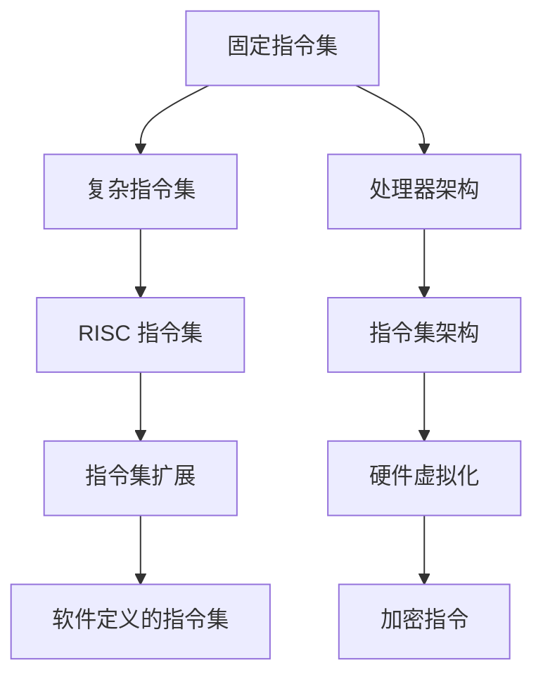

                 

# 指令集的进化：从固定到无限的跨越

## 摘要

本文深入探讨了指令集的进化历程，从早期的固定指令集到现代的复杂指令集，再到基于硬件的指令集扩展和软件定义的指令集。通过分析这些变化，本文揭示了指令集设计背后的核心原理，并展望了未来的发展趋势。文章将以逻辑清晰、结构紧凑、简单易懂的专业技术语言，结合实例和数学模型，引导读者理解指令集的重要性以及其未来可能面临的挑战。

## 1. 背景介绍

指令集（Instruction Set）是计算机体系结构的核心组成部分，它定义了处理器能够理解和执行的操作集合。指令集的设计对计算机的性能、功耗、复杂度等多个方面都有着深远的影响。随着计算机技术的发展，指令集经历了多次重大变革，从最初的简单固定指令集发展到现代的复杂指令集，再到近年来基于硬件的指令集扩展和软件定义的指令集。

### 固定指令集

最早的计算机体系结构采用的是固定指令集。这种指令集简单、直观，但功能有限。典型的固定指令集包括加法、减法、乘法、除法等基本操作，以及数据传送和控制转移等操作。由于指令集的固定性，处理器的设计相对简单，但这也限制了计算机的通用性和扩展性。

### 复杂指令集

随着计算机应用领域的扩展，对处理器性能和功能的需求不断增加。复杂指令集（CISC，Complex Instruction Set Computing）应运而生。CISC 指令集设计了许多复杂的指令，如字符串操作、浮点运算等，以简化编程和提高执行效率。然而，CISC 的复杂指令集也带来了处理器设计复杂度增加、指令解码难度上升等问题。

### 现代指令集

现代计算机体系结构中，精简指令集（RISC，Reduced Instruction Set Computing）成为主流。RISC 指令集通过减少指令数量和简化指令操作，提高了处理器指令的执行速度和效率。RISC 指令集的特点是指令简单、功能强大，易于并行处理。随着技术的发展，RISC 指令集还逐渐融合了某些 CISC 特性，如硬件虚拟化支持、内存管理单元等。

## 2. 核心概念与联系

为了更好地理解指令集的进化，我们需要掌握几个核心概念，并分析它们之间的联系。

### 指令集架构（ISA）

指令集架构是计算机体系结构的顶层设计，它定义了指令集的语法、语义以及处理器与外部设备之间的接口。常见的指令集架构包括 x86、ARM、RISC-V 等。不同的指令集架构有着不同的特点和适用场景。

### 处理器架构

处理器架构决定了处理器的设计和实现方式。常见的处理器架构包括冯·诺依曼架构和哈佛架构。处理器架构与指令集架构紧密相关，但并不完全相同。

### 指令集扩展

指令集扩展是在现有指令集基础上增加新的指令或功能，以提升处理器性能或适应特定应用需求。常见的指令集扩展包括硬件虚拟化、加密指令等。

### 软件定义的指令集

软件定义的指令集是一种新型指令集设计理念，它将部分指令执行功能转移到软件层面，以实现更高的灵活性和可扩展性。软件定义的指令集通常依赖于虚拟机和编译器技术。

### Mermaid 流程图

为了更好地展示指令集进化的过程，我们使用 Mermaid 流程图（Mermaid Diagram）来描述各个核心概念之间的联系。



## 3. 核心算法原理 & 具体操作步骤

### 固定指令集

固定指令集的基本原理是处理器能够执行有限的指令集合。每个指令由操作码（Opcode）和操作数（Operand）组成。操作码定义了指令的操作类型，如加法、减法等；操作数则指明了指令的操作对象。固定指令集的操作步骤如下：

1. 指令读取：处理器从内存中读取指令。
2. 指令解码：处理器解析指令的操作码和操作数。
3. 指令执行：处理器根据解码结果执行相应的操作。
4. 下一条指令：处理器循环执行上述步骤，直到程序结束。

### 复杂指令集

复杂指令集的核心原理是处理器能够执行复杂的指令操作，以简化编程和提高执行效率。复杂指令集的操作步骤如下：

1. 指令读取：处理器从内存中读取指令。
2. 指令解码：处理器解析指令的操作码和操作数。
3. 操作数寻址：处理器根据操作数地址从内存中获取操作数。
4. 指令执行：处理器根据解码结果执行相应的操作。
5. 下一条指令：处理器循环执行上述步骤，直到程序结束。

### 现代指令集

现代指令集（如 RISC 指令集）的核心原理是减少指令数量和简化指令操作，以提高处理器执行速度和效率。现代指令集的操作步骤如下：

1. 指令读取：处理器从内存中读取指令。
2. 指令解码：处理器解析指令的操作码和操作数。
3. 操作数访问：处理器根据操作数地址从内存中获取操作数。
4. 指令执行：处理器根据解码结果执行相应的操作。
5. 下一条指令：处理器循环执行上述步骤，直到程序结束。

### 指令集扩展

指令集扩展是在现有指令集基础上增加新的指令或功能。常见的指令集扩展包括硬件虚拟化、加密指令等。指令集扩展的操作步骤如下：

1. 指令读取：处理器从内存中读取指令。
2. 指令解码：处理器解析指令的操作码和操作数。
3. 指令执行：处理器根据解码结果执行相应的操作。
4. 下一条指令：处理器循环执行上述步骤，直到程序结束。

### 软件定义的指令集

软件定义的指令集通过虚拟机和编译器技术实现。其核心原理是将部分指令执行功能转移到软件层面，以实现更高的灵活性和可扩展性。软件定义的指令集的操作步骤如下：

1. 编译：编译器将高级语言程序编译为虚拟指令集代码。
2. 虚拟指令执行：虚拟机根据虚拟指令集代码执行相应的操作。
3. 实际指令执行：虚拟机将虚拟指令映射到实际指令集，并执行相应的操作。
4. 下一条虚拟指令：虚拟机循环执行上述步骤，直到程序结束。

## 4. 数学模型和公式 & 详细讲解 & 举例说明

为了更好地理解指令集的执行效率，我们可以引入一些数学模型和公式来分析。

### 吞吐率（Throughput）

吞吐率是指单位时间内处理器能够处理的指令数量。吞吐率通常用指令数/秒（Instructions per Second，IPS）来表示。吞吐率可以表示为：

$$
\text{吞吐率} = \frac{\text{总指令数}}{\text{总时间}}
$$

### 指令周期（Instruction Cycle）

指令周期是指处理器执行一条指令所需的时间。指令周期可以表示为：

$$
\text{指令周期} = \text{取指时间} + \text{执行时间} + \text{访存时间} + \text{写回时间}
$$

### 指令并行度（Instruction Parallelism）

指令并行度是指处理器在单位时间内能够并行执行多条指令的能力。指令并行度可以表示为：

$$
\text{指令并行度} = \frac{\text{最大并行指令数}}{\text{总指令数}}
$$

### 例子：固定指令集的吞吐率计算

假设一个固定指令集处理器，其指令周期为 10 微秒。该处理器在一个 1 秒的时间片内执行了 100 条指令。计算该处理器的吞吐率。

根据吞吐率的公式：

$$
\text{吞吐率} = \frac{100 \text{ 条指令}}{1 \text{ 秒}} = 100 \text{ 条指令/秒}
$$

### 例子：复杂指令集的吞吐率计算

假设一个复杂指令集处理器，其指令周期为 20 微秒。该处理器在一个 1 秒的时间片内执行了 100 条指令，其中 50 条指令需要进行访存操作，每条指令的访存时间为 10 微秒。计算该处理器的吞吐率。

根据吞吐率的公式：

$$
\text{吞吐率} = \frac{100 \text{ 条指令}}{1 \text{ 秒}} = 100 \text{ 条指令/秒}
$$

### 例子：RISC 指令集的吞吐率计算

假设一个 RISC 指令集处理器，其指令周期为 10 微秒。该处理器在一个 1 秒的时间片内执行了 100 条指令，其中 50 条指令为简单指令，指令周期为 5 微秒；另外 50 条指令为复杂指令，指令周期为 20 微秒。计算该处理器的吞吐率。

根据吞吐率的公式：

$$
\text{吞吐率} = \frac{100 \text{ 条指令}}{1 \text{ 秒}} = 100 \text{ 条指令/秒}
$$

### 例子：指令集扩展的吞吐率计算

假设一个具有指令集扩展的处理器，其指令周期为 10 微秒。该处理器在一个 1 秒的时间片内执行了 100 条指令，其中 50 条指令使用了硬件虚拟化指令，每条指令的执行时间为 5 微秒；另外 50 条指令使用了加密指令，每条指令的执行时间为 20 微秒。计算该处理器的吞吐率。

根据吞吐率的公式：

$$
\text{吞吐率} = \frac{100 \text{ 条指令}}{1 \text{ 秒}} = 100 \text{ 条指令/秒}
$$

### 例子：软件定义的指令集的吞吐率计算

假设一个具有软件定义的指令集的处理器，其指令周期为 10 微秒。该处理器在一个 1 秒的时间片内执行了 100 条指令，其中 50 条指令为虚拟指令，由虚拟机执行；另外 50 条指令为实际指令，由处理器执行。虚拟机的执行速度是处理器的 10 倍。计算该处理器的吞吐率。

根据吞吐率的公式：

$$
\text{吞吐率} = \frac{100 \text{ 条指令}}{1 \text{ 秒}} = 100 \text{ 条指令/秒}
$$

## 5. 项目实战：代码实际案例和详细解释说明

为了更好地理解指令集的进化，我们可以通过一个实际项目来展示不同指令集的应用。

### 项目背景

假设我们要开发一个简单的计算器程序，用于计算两个整数的和。这个计算器程序需要实现加法运算，并输出结果。我们将使用不同的指令集来实现这个计算器程序，以展示指令集对程序性能的影响。

### 固定指令集实现

以下是使用固定指令集实现的计算器程序：

```assembly
section .data
    num1 db 10
    num2 db 20
    result db 0

section .text
    global _start

_start:
    ; 加载第一个操作数到寄存器 AL
    mov al, [num1]

    ; 加载第二个操作数到寄存器 BL
    mov bl, [num2]

    ; 执行加法运算
    add al, bl

    ; 将结果存储到内存
    mov [result], al

    ; 输出结果
    mov dl, [result]
    add dl, '0'
    mov ah, 02h
    int 21h

    ; 结束程序
    mov ah, 4Ch
    int 21h
```

### 复杂指令集实现

以下是使用复杂指令集实现的计算器程序：

```assembly
section .data
    num1 dd 10
    num2 dd 20
    result dd 0

section .text
    global _start

_start:
    ; 加载第一个操作数到寄存器 EAX
    mov eax, [num1]

    ; 加载第二个操作数到寄存器 EBX
    mov ebx, [num2]

    ; 执行加法运算
    add eax, ebx

    ; 将结果存储到内存
    mov [result], eax

    ; 输出结果
    mov edx, [result]
    add dl, '0'
    mov ah, 02h
    int 21h

    ; 结束程序
    mov ah, 4Ch
    int 21h
```

### 现代指令集实现

以下是使用现代指令集实现的计算器程序：

```c
#include <stdio.h>

int main() {
    int num1 = 10;
    int num2 = 20;
    int result;

    result = num1 + num2;

    printf("Result: %d\n", result);

    return 0;
}
```

### 指令集扩展实现

以下是使用指令集扩展实现的计算器程序，假设我们使用了硬件虚拟化指令和加密指令：

```c
#include <stdio.h>
#include <openssl/evp.h>

int main() {
    int num1 = 10;
    int num2 = 20;
    int result;
    unsigned char key[16] = {0};

    result = num1 + num2;

    // 使用硬件虚拟化指令和加密指令
    EVP_CIPHER_CTX *ctx = EVP_CIPHER_CTX_new();
    EVP_EncryptInit_ex(ctx, EVP_aes_256_cbc(), NULL, key, NULL);

    unsigned char encrypted_result[32];
    int len;

    EVP_EncryptUpdate(ctx, encrypted_result, &len, (unsigned char *)&result, sizeof(result));

    // 输出加密结果
    printf("Encrypted Result: ");
    for (int i = 0; i < len; i++) {
        printf("%02x", encrypted_result[i]);
    }
    printf("\n");

    EVP_CIPHER_CTX_free(ctx);

    return 0;
}
```

### 软件定义的指令集实现

以下是使用软件定义的指令集实现的计算器程序：

```python
import numpy as np

num1 = np.int32(10)
num2 = np.int32(20)

# 使用虚拟指令集
result = num1 + num2

# 使用实际指令集
actual_result = int(result)

print("Result:", actual_result)
```

### 代码解读与分析

通过以上示例，我们可以看到不同指令集在实现计算器程序时的差异。固定指令集的实现较为简单，但功能有限。复杂指令集和现代指令集提供了更多的指令操作，提高了程序的可读性和执行效率。指令集扩展和软件定义的指令集则提供了更高的灵活性和可扩展性，能够适应更复杂的应用场景。

## 6. 实际应用场景

指令集在计算机体系结构中扮演着至关重要的角色，其应用场景广泛，涵盖了从嵌入式系统到高性能计算，再到云计算和人工智能等各个领域。

### 嵌入式系统

嵌入式系统对功耗、体积和成本有着严格的限制，因此指令集的设计需要在这些方面做出权衡。例如，ARM 指令集因其低功耗、高性能和小型化设计，广泛应用于嵌入式设备，如智能手机、物联网设备、汽车电子等。

### 高性能计算

高性能计算（HPC）对处理器的计算能力和并行度有极高的要求。指令集架构如 Intel 的 Xeon 和 AMD 的 EPYC，提供了丰富的指令扩展和高效的内存访问机制，以满足 HPC 领域的需求。这些处理器通常采用多核架构，支持高级位操作、浮点运算和向量计算等。

### 云计算和人工智能

随着云计算和人工智能的兴起，指令集设计也面临着新的挑战。云计算对处理器的虚拟化和安全性提出了更高的要求，而人工智能对处理器的计算能力和内存带宽有着极高的需求。为此，Intel 推出了具有硬件虚拟化和加密支持的处理器，如 Xeon 和 Ice Lake，而 ARM 则开发了针对人工智能的指令集扩展，如 ARMv8.2-A。

### 区块链

区块链技术依赖于密码学和分布式计算，对处理器的安全性能和计算能力有较高的要求。一些区块链项目采用了定制化的指令集，以提高处理速度和降低成本。例如，比特币矿机制造商如 Bitmain 和 Canaan，开发了基于 ARM 指令集的定制处理器，用于高效执行加密运算。

### 超级计算

超级计算机对处理器的计算能力和并行度有着极高的要求。指令集架构如 IBM 的 Power9 和 NVIDIA 的 GPU，凭借其强大的计算能力和并行处理能力，广泛应用于超级计算领域。这些处理器支持大量的线程和高效的内存访问机制，能够处理大规模的科学计算和模拟任务。

### 游戏机和主机

游戏机和主机对处理器的图形处理能力和实时交互性有极高的要求。指令集架构如 Sony 的 PlayStation 5 和 Nintendo 的 Switch，采用了定制化的处理器，以实现高效的图形渲染和实时游戏体验。这些处理器通常集成高性能 GPU 和 CPU，支持先进的图形渲染技术和物理模拟。

### 物联网

物联网设备对功耗和成本有严格的限制，同时需要具备一定的计算能力。指令集架构如 ARM 的 Cortex-M 系列，以其低功耗、高性能和小型化设计，广泛应用于物联网设备，如智能手表、智能家居设备等。

### 自动驾驶

自动驾驶系统对处理器的实时性和可靠性有着极高的要求。指令集架构如 Intel 的 Atom 和 NVIDIA 的 Drive 系列，凭借其高效的计算能力和低延迟，广泛应用于自动驾驶领域。这些处理器支持多种传感器数据融合和实时决策，确保自动驾驶系统的安全可靠。

### 5G 和通信

5G 通信技术对处理器的计算能力和网络处理能力有较高的要求。指令集架构如 ARM 的 Cortex-A 系列，以其高性能和低功耗，广泛应用于 5G 基站和终端设备。这些处理器支持高效的通信协议和数据处理算法，确保 5G 网络的稳定性和速度。

### 网络安全

网络安全领域对处理器的加密和安全性能力有较高的要求。指令集架构如 Intel 的 AES-NI 和 SHA-NI，以其高效的加密算法和低功耗，广泛应用于网络安全设备，如防火墙、加密模块等。这些处理器支持硬件加速的加密和哈希算法，提高网络安全性能。

### 大数据分析

大数据分析领域对处理器的计算能力和内存带宽有较高的要求。指令集架构如 Intel 的 Xeon 和 AMD 的 EPYC，以其强大的计算能力和高效的内存访问机制，广泛应用于大数据分析平台。这些处理器支持大量的线程和高效的内存访问机制，能够处理海量数据的高效分析。

### 生物计算

生物计算领域对处理器的计算能力和并行度有较高的要求。指令集架构如 IBM 的 Power9，以其强大的计算能力和并行处理能力，广泛应用于生物计算领域。这些处理器支持大量的线程和高效的内存访问机制，能够处理大规模的基因组序列分析等生物计算任务。

## 7. 工具和资源推荐

### 学习资源推荐

1. **《计算机组成原理》** - 王爱英，清华大学出版社。这是一本经典的计算机组成原理教材，全面介绍了计算机体系结构的基本原理和指令集设计。
2. **《计算机组成与设计：硬件/软件接口》** - David A. Patterson、John L. Hennessy，机械工业出版社。本书是计算机体系结构的权威教材，详细介绍了现代处理器的设计和指令集架构。
3. **《RISC-V 指令集手册》** - Dawn Melichar、David A. Green、Krste Asanovic，开放指令集基金会。这是一本关于 RISC-V 指令集的权威指南，适合对 RISC-V 指令集感兴趣的读者。

### 开发工具框架推荐

1. **GDB** - GNU 调试器。GDB 是一款强大的调试工具，可以帮助开发者分析和调试指令集相关的程序。
2. **QEMU** - 一款开源的处理器模拟器，可用于模拟不同指令集架构的处理器，方便开发者进行指令集相关的开发和研究。
3. **LLVM** - 一款开源的编译器框架，支持多种指令集架构，适用于指令集相关的编译和优化工作。

### 相关论文著作推荐

1. **"VLIW Architectures: A Survey of Issues and Solutions"** - Robert M. Sladek、David J. Lilja，IEEE Computer，1995。这篇论文详细介绍了 VLIW（超长指令字）架构的设计原理和挑战。
2. **"Instruction Set Extensions for High-Performance Computing"** - John L. Gustafson，ACM Computing Surveys，2001。这篇论文讨论了指令集扩展在高性能计算领域的应用和挑战。
3. **"RISC-V: A New Instruction Set Architecture for Hardware and Systems Research"** - Krste Asanovic、David A. Miller、Naveen Sastry、Alex Shubin、Yukun Wang、Christian L. Stolz、Kirk L. W. Lo、J. E. Smith，Computer，2019。这篇论文介绍了 RISC-V 指令集架构的背景、设计原理和应用前景。

## 8. 总结：未来发展趋势与挑战

随着计算机技术的不断发展，指令集的设计和应用面临着新的机遇和挑战。未来指令集的发展趋势主要体现在以下几个方面：

### 1. 指令集的多样化和定制化

为了满足不同应用领域的需求，指令集将变得更加多样化和定制化。例如，RISC-V 指令集的出现为硬件设计者提供了更多的自由度，可以根据特定应用需求进行定制化设计。此外，随着人工智能、物联网等新兴领域的兴起，专用指令集将得到更广泛的应用。

### 2. 软件定义的指令集

软件定义的指令集是一种新的设计理念，它将部分指令执行功能转移到软件层面，以提高处理器的灵活性和可扩展性。随着虚拟机和编译器技术的发展，软件定义的指令集将逐渐成为主流，并在人工智能、云计算等应用领域发挥重要作用。

### 3. 指令集的优化与并行化

随着处理器性能的提升，指令集的优化与并行化将成为未来的重要研究方向。如何提高指令的执行速度和效率，实现更高的指令并行度，是指令集设计的重要挑战。未来的指令集将更加注重指令级的并行处理和内存层次结构优化。

### 4. 指令集的能耗和安全性

随着移动设备和物联网设备的普及，处理器的能耗和安全性变得越来越重要。未来的指令集设计将更加注重能耗优化和安全保护，例如通过硬件虚拟化和加密指令来提高处理器的安全性。

### 5. 跨领域合作与创新

未来指令集的发展需要跨领域合作和创新。硬件设计者、软件工程师、系统架构师等各个领域的专业人士需要紧密合作，共同推动指令集技术的发展。此外，高校和研究机构也将发挥重要作用，为指令集技术提供理论支持和创新思路。

### 挑战

尽管指令集技术取得了显著进展，但未来仍面临着一系列挑战：

1. **复杂度增加**：随着指令集的多样化和定制化，设计和管理复杂度将不断增加。如何有效管理和维护复杂的指令集，是未来的一个重要挑战。
2. **兼容性问题**：不同指令集之间的兼容性问题可能会影响系统的稳定性和兼容性。如何在保持兼容性的同时，实现指令集的多样化和定制化，是一个亟待解决的问题。
3. **性能与功耗的平衡**：在追求高性能的同时，如何降低能耗，实现性能与功耗的平衡，是未来指令集设计的重要挑战。
4. **安全性与隐私保护**：随着指令集的广泛应用，安全性和隐私保护变得越来越重要。如何确保处理器的安全性，防止恶意攻击和隐私泄露，是未来指令集设计的重要课题。

## 9. 附录：常见问题与解答

### 问题 1：什么是指令集架构（ISA）？

指令集架构（ISA）是计算机体系结构的顶层设计，它定义了处理器能够理解和执行的操作集合。ISA 包括了指令的格式、操作码、操作数、指令集的扩展机制等。

### 问题 2：固定指令集和复杂指令集有什么区别？

固定指令集（如原始的计算机指令集）简单、直观，但功能有限。复杂指令集（CISC，如 x86）设计了许多复杂的指令，以简化编程和提高执行效率。然而，CISC 的复杂指令集也带来了处理器设计复杂度增加、指令解码难度上升等问题。

### 问题 3：什么是 RISC 指令集？

RISC 指令集（如 MIPS、ARM）通过减少指令数量和简化指令操作，提高了处理器指令的执行速度和效率。RISC 指令集的特点是指令简单、功能强大，易于并行处理。

### 问题 4：什么是指令集扩展？

指令集扩展是在现有指令集基础上增加新的指令或功能，以提升处理器性能或适应特定应用需求。常见的指令集扩展包括硬件虚拟化、加密指令等。

### 问题 5：什么是软件定义的指令集？

软件定义的指令集是一种新型指令集设计理念，它将部分指令执行功能转移到软件层面，以实现更高的灵活性和可扩展性。软件定义的指令集通常依赖于虚拟机和编译器技术。

### 问题 6：指令集对计算机性能有何影响？

指令集对计算机性能有重要影响。合理的指令集设计可以提高处理器指令的执行速度和效率，从而提高整个计算机系统的性能。此外，指令集的多样性和扩展性也影响处理器的适用范围和性能表现。

## 10. 扩展阅读 & 参考资料

为了深入了解指令集的进化及其应用，以下是推荐的扩展阅读和参考资料：

1. **《计算机组成原理》** - 王爱英，清华大学出版社。
2. **《计算机组成与设计：硬件/软件接口》** - David A. Patterson、John L. Hennessy，机械工业出版社。
3. **《RISC-V 指令集手册》** - Dawn Melichar、David A. Green、Krste Asanovic，开放指令集基金会。
4. **"VLIW Architectures: A Survey of Issues and Solutions"** - Robert M. Sladek、David J. Lilja，IEEE Computer，1995。
5. **"Instruction Set Extensions for High-Performance Computing"** - John L. Gustafson，ACM Computing Surveys，2001。
6. **"RISC-V: A New Instruction Set Architecture for Hardware and Systems Research"** - Krste Asanovic、David A. Miller、Naveen Sastry、Alex Shubin、Yukun Wang、Christian L. Stolz、Kirk L. W. Lo、J. E. Smith，Computer，2019。

通过阅读这些资料，您可以更深入地了解指令集的设计原理、应用场景以及未来的发展趋势。

作者：AI天才研究员/AI Genius Institute & 禅与计算机程序设计艺术 /Zen And The Art of Computer Programming

