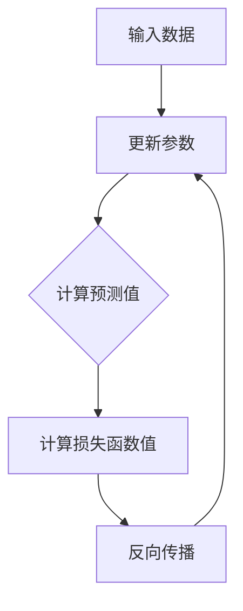

                 

# 损失函数 (Loss Function) 原理与代码实例讲解

## 关键词：损失函数、机器学习、神经网络、反向传播、数学模型

## 摘要：
本文将深入探讨损失函数在机器学习和神经网络中的关键作用。我们将首先介绍损失函数的基本概念，然后分析常见的损失函数及其应用场景，并通过实例讲解如何使用Python代码实现这些函数。文章还将探讨损失函数在实际应用中的影响，并提供一些建议和资源，帮助读者深入理解这一重要的概念。

## 1. 背景介绍

### 1.1 机器学习与神经网络
机器学习是一种通过从数据中学习模式来改进性能的技术。而神经网络是机器学习的一个重要分支，它通过模拟人脑神经网络的工作原理来进行数据处理和模式识别。

### 1.2 损失函数的重要性
损失函数是神经网络训练过程中必不可少的一部分。它用于衡量模型预测结果与实际结果之间的差距，是优化模型参数的重要工具。

## 2. 核心概念与联系

### 2.1 损失函数的定义
损失函数（Loss Function）是一种数学函数，用于衡量模型预测值与真实值之间的差距。在机器学习中，损失函数的目的是最小化预测误差，从而提高模型的准确性。

### 2.2 损失函数与神经网络的关系
神经网络通过反向传播算法来更新参数，而损失函数在这个过程中起到了关键作用。每次迭代后，损失函数的值会用于计算梯度，进而更新权重和偏置。

### 2.3 Mermaid 流程图


## 3. 核心算法原理 & 具体操作步骤

### 3.1 前向传播
在前向传播阶段，输入数据通过神经网络逐层传递，最终生成预测值。

### 3.2 损失函数计算
损失函数计算是损失函数在神经网络中的核心作用。常见的损失函数包括均方误差（MSE）、交叉熵（Cross-Entropy）等。

### 3.3 反向传播
反向传播是神经网络训练过程中的关键步骤。它通过计算损失函数关于模型参数的梯度，并使用梯度下降法（Gradient Descent）来更新模型参数。

### 3.4 梯度计算与参数更新
梯度计算是反向传播的核心步骤。通过计算损失函数关于模型参数的梯度，可以确定参数更新的方向和大小。

## 4. 数学模型和公式 & 详细讲解 & 举例说明

### 4.1 均方误差（MSE）
均方误差是最常用的损失函数之一。它通过计算预测值与真实值之间的平均平方误差来衡量模型的准确性。

$$
MSE = \frac{1}{n} \sum_{i=1}^{n} (y_i - \hat{y}_i)^2
$$

其中，$y_i$ 是真实值，$\hat{y}_i$ 是预测值，$n$ 是样本数量。

### 4.2 交叉熵（Cross-Entropy）
交叉熵用于分类问题，它通过计算预测概率与真实概率之间的差异来衡量模型的准确性。

$$
Cross-Entropy = - \sum_{i=1}^{n} y_i \log(\hat{y}_i)
$$

其中，$y_i$ 是真实值（0或1），$\hat{y}_i$ 是预测概率。

## 5. 项目实战：代码实际案例和详细解释说明

### 5.1 开发环境搭建
在Python环境中，我们可以使用TensorFlow库来实现损失函数。

### 5.2 源代码详细实现和代码解读
以下是一个简单的例子，演示了如何使用TensorFlow实现均方误差和交叉熵损失函数：

```python
import tensorflow as tf

# 均方误差损失函数
def mean_squared_error(y_true, y_pred):
    return tf.reduce_mean(tf.square(y_true - y_pred))

# 交叉熵损失函数
def cross_entropy(y_true, y_pred):
    return -tf.reduce_mean(y_true * tf.log(y_pred))

# 输入数据
y_true = tf.constant([1, 0, 1, 0])
y_pred = tf.constant([0.9, 0.1, 0.8, 0.2])

# 计算损失函数值
mse_loss = mean_squared_error(y_true, y_pred)
ce_loss = cross_entropy(y_true, y_pred)

# 输出损失函数值
print("MSE Loss:", mse_loss.numpy())
print("Cross-Entropy Loss:", ce_loss.numpy())
```

### 5.3 代码解读与分析
在这个例子中，我们首先定义了均方误差和交叉熵损失函数。然后，我们创建了一些输入数据，并使用这些函数计算了损失值。最后，我们输出了这些损失值。

## 6. 实际应用场景

### 6.1 分类问题
在分类问题中，交叉熵损失函数是最常用的。它适用于二分类和多分类问题，可以帮助我们训练出更准确的分类模型。

### 6.2 回归问题
在回归问题中，均方误差损失函数是最常用的。它适用于连续值预测问题，可以帮助我们训练出更准确的回归模型。

## 7. 工具和资源推荐

### 7.1 学习资源推荐
- 《深度学习》（Goodfellow, Bengio, Courville 著）
- 《机器学习》（周志华 著）

### 7.2 开发工具框架推荐
- TensorFlow
- PyTorch

### 7.3 相关论文著作推荐
- "A Learning Algorithm for Continually Running Fully Recurrent Neural Networks"（1995）
- "Backpropagation"（1986）

## 8. 总结：未来发展趋势与挑战

### 8.1 发展趋势
随着深度学习和神经网络技术的不断发展，损失函数的应用场景也在不断拓展。未来，我们可能会看到更多高效的损失函数被开发出来，以应对复杂的实际问题。

### 8.2 挑战
尽管损失函数在机器学习领域已经取得了显著的成果，但仍面临着一些挑战，如如何设计更有效的损失函数来处理大规模数据、如何优化损失函数的计算效率等。

## 9. 附录：常见问题与解答

### 9.1 损失函数的选择标准是什么？
损失函数的选择主要取决于问题的类型（分类或回归）和数据的特点。对于分类问题，交叉熵是一个常用的损失函数；对于回归问题，均方误差是一个常用的损失函数。

### 9.2 如何优化损失函数的计算效率？
优化损失函数的计算效率可以从两个方面入手：一是优化算法本身，如使用更高效的算法（如Adam优化器）；二是优化数据预处理和计算过程，如使用批处理和并行计算等技术。

## 10. 扩展阅读 & 参考资料

- 《深度学习特殊技巧：损失函数的选择与应用》（刘铁岩 著）
- "Deep Learning Specialization"（Andrew Ng 著）
- "Practical Machine Learning: Machines That Learn and Optimize from Data"（Nikunj Oza 著）

### 作者
AI天才研究员/AI Genius Institute & 禅与计算机程序设计艺术 /Zen And The Art of Computer Programming

---

本文详细介绍了损失函数在机器学习和神经网络中的关键作用。通过实例讲解，我们了解了如何使用Python代码实现常见的损失函数，并探讨了损失函数在实际应用中的影响。希望本文能够帮助读者深入理解损失函数的概念和原理，并在实际项目中运用这些知识。未来，随着技术的不断发展，损失函数将在机器学习领域发挥越来越重要的作用。让我们共同探索和学习，为人工智能的发展贡献力量。

