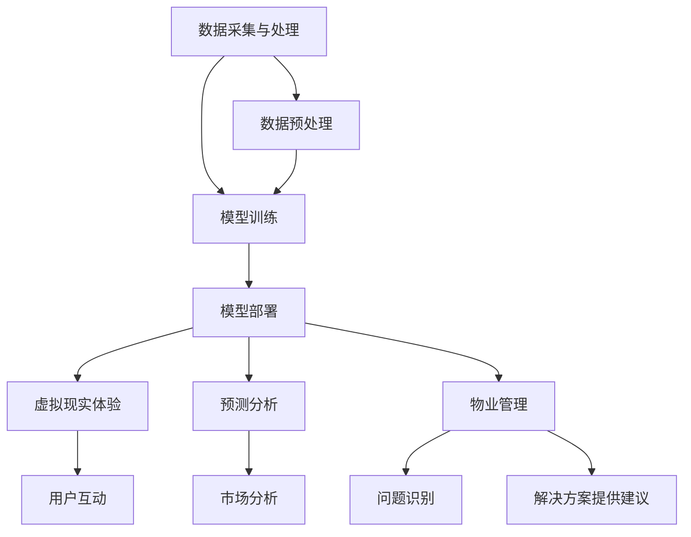

                 

### 背景介绍

人工智能（AI）技术的发展正在以前所未有的速度变革着各个行业，房地产行业也不例外。随着数据采集、存储和分析技术的不断进步，房地产行业开始探索如何利用人工智能技术提高运营效率、降低成本、提升用户体验。

房地产行业涵盖了房地产开发、销售、租赁、物业管理等众多环节。过去，这些环节主要依赖于人工操作和经验判断，效率低且容易出现错误。而人工智能大模型的出现，为房地产行业提供了一种全新的解决方案。

首先，人工智能大模型具备强大的数据分析和处理能力。通过对大量历史数据的学习，这些模型可以识别出数据中的规律和趋势，从而为房地产企业提供更加精准的决策支持。例如，通过分析市场趋势和用户需求，人工智能大模型可以帮助房地产企业预测房价走势，制定合理的营销策略。

其次，人工智能大模型在房地产销售环节中也发挥着重要作用。传统的房地产销售主要依赖于线下门店和销售人员，而人工智能大模型可以通过虚拟现实（VR）和增强现实（AR）技术，为用户提供更加沉浸式的看房体验。用户可以在家中通过虚拟现实设备浏览房屋内部装修、周边环境等详细信息，从而节省时间成本，提高购房决策的效率。

此外，人工智能大模型在房地产物业管理方面也有广泛的应用。通过对大量用户反馈数据的分析，这些模型可以及时发现物业管理中的问题，并提出改进建议。例如，通过分析业主的投诉和建议，人工智能大模型可以帮助物业公司优化服务质量，提高用户满意度。

总之，人工智能大模型在房地产行业具有巨大的应用潜力。随着技术的不断发展和成熟，我们有理由相信，人工智能大模型将为房地产行业带来一场深刻的变革。接下来，本文将深入探讨人工智能大模型在房地产行业的具体应用场景、核心算法原理、实际操作步骤以及面临的挑战和未来发展前景。

### 核心概念与联系

要深入理解人工智能大模型在房地产行业的应用，我们首先需要了解一些核心概念和它们之间的联系。以下是本文将涉及的主要概念：

#### 人工智能大模型

人工智能大模型，通常指的是那些具有大规模参数和高度复杂性的神经网络模型。例如，常见的深度学习模型如Transformer、BERT等。这些模型通过从大量数据中学习，能够自动提取特征并进行预测或分类。

#### 数据采集与处理

数据采集和处理是人工智能大模型应用的基础。在房地产行业，数据来源包括但不限于房产交易记录、用户评价、市场调研数据等。数据质量对模型的性能有重要影响，因此数据预处理过程至关重要，包括数据清洗、去噪、归一化等。

#### 虚拟现实（VR）与增强现实（AR）

虚拟现实和增强现实技术为房地产销售提供了新的可能性。VR技术可以让用户通过虚拟环境体验房屋的内部和外部，而AR技术则可以在现实世界中叠加虚拟信息，如房屋的3D模型、价格标签等。

#### 预测分析

预测分析是人工智能大模型在房地产行业的重要应用之一。通过分析历史数据和当前市场状况，模型可以预测房价走势、市场供需等，为房地产企业提供决策支持。

#### 物业管理

人工智能大模型在物业管理中可以通过分析大量用户反馈数据，识别问题并提供解决方案，从而提升物业管理效率和服务质量。

#### Mermaid流程图

为了更直观地展示人工智能大模型在房地产行业中的应用流程，我们使用Mermaid语言绘制了一个流程图，如下所示：



在这个流程图中，数据采集与处理是整个流程的起点，经过数据预处理后输入到模型训练阶段。模型训练完成后，可以部署到不同的应用场景，如虚拟现实体验、预测分析和物业管理。

#### 各概念之间的关系

- **数据采集与处理**：是所有应用的基础，确保输入数据的准确性和一致性。
- **模型训练**：通过大量数据学习，生成具备预测和分析能力的模型。
- **模型部署**：将训练好的模型应用到实际业务场景中。
- **虚拟现实体验**：借助VR和AR技术，提升用户体验。
- **预测分析**：利用模型预测房价走势和市场供需。
- **物业管理**：通过分析用户反馈，优化管理和服务。

### 核心算法原理 & 具体操作步骤

#### 人工智能大模型的算法原理

人工智能大模型的核心在于深度学习，特别是神经网络。以下是深度学习的基本原理和常用算法：

1. **神经网络基础**：
    - **神经元**：神经网络的基本单元，负责接收输入、产生输出。
    - **前向传播**：将输入数据通过神经网络层，逐层计算输出。
    - **反向传播**：通过计算误差，调整网络权重，优化模型性能。

2. **多层感知机（MLP）**：
    - **结构**：由输入层、隐藏层和输出层组成。
    - **激活函数**：如ReLU、Sigmoid、Tanh，用于引入非线性。

3. **卷积神经网络（CNN）**：
    - **卷积层**：提取图像特征。
    - **池化层**：降低数据维度，增强模型泛化能力。
    - **全连接层**：将特征映射到分类或回归结果。

4. **递归神经网络（RNN）**：
    - **结构**：适合处理序列数据。
    - **门控机制**：如LSTM、GRU，用于解决长序列依赖问题。

5. **Transformer模型**：
    - **结构**：基于自注意力机制，能够处理长序列依赖。
    - **多头自注意力**：通过多个注意力头，捕捉不同特征。

#### 人工智能大模型在房地产行业中的具体操作步骤

1. **数据收集与预处理**：
    - **数据收集**：从房产交易市场、政府部门、社交媒体等渠道收集数据。
    - **数据预处理**：清洗、归一化、去噪等，确保数据质量。

2. **特征工程**：
    - **特征选择**：从原始数据中提取对预测有帮助的特征，如地理位置、房屋面积、户型、装修情况等。
    - **特征转换**：将定性数据转换为定量数据，如使用独热编码、标签编码等。

3. **模型训练**：
    - **模型选择**：根据具体应用场景选择合适的模型，如CNN用于图像分析，Transformer用于文本处理。
    - **参数调整**：通过交叉验证、网格搜索等方法，调整模型参数，优化模型性能。

4. **模型评估与优化**：
    - **评估指标**：使用准确率、召回率、F1分数等指标评估模型性能。
    - **优化方法**：通过剪枝、量化、迁移学习等方法，进一步提升模型性能。

5. **模型部署与应用**：
    - **模型部署**：将训练好的模型部署到生产环境中，如使用TensorFlow Serving、PyTorch Mobile等。
    - **应用场景**：在房地产销售、市场预测、物业管理等方面提供智能化解决方案。

以下是一个简单的示例，展示如何使用Python和TensorFlow库构建一个简单的房价预测模型：

```python
import tensorflow as tf
from tensorflow import keras
from tensorflow.keras import layers

# 数据预处理
# ...（数据清洗、归一化等步骤）

# 模型构建
model = keras.Sequential([
    layers.Dense(128, activation='relu', input_shape=(num_features,)),
    layers.Dense(64, activation='relu'),
    layers.Dense(1)
])

# 模型编译
model.compile(optimizer='adam',
              loss='mean_squared_error',
              metrics=['mean_absolute_error', 'mean_squared_error'])

# 模型训练
model.fit(train_data, train_labels, epochs=100, validation_split=0.2)

# 模型评估
model.evaluate(test_data, test_labels)
```

通过以上步骤，我们可以构建一个能够预测房价的人工智能大模型，并在房地产行业中发挥重要作用。

### 数学模型和公式 & 详细讲解 & 举例说明

在人工智能大模型中，数学模型和公式是核心组成部分，它们决定了模型的学习能力和预测准确性。以下是几种常见的人工智能大模型中的数学模型和公式，并结合具体的实例进行详细讲解。

#### 1. 神经网络中的基本数学模型

在神经网络中，最基本的数学模型包括输入层、隐藏层和输出层。以下是神经网络中常用的几个关键数学模型和公式：

1. **激活函数（Activation Function）**：

    - **ReLU（Rectified Linear Unit）**：
      \[ f(x) = \max(0, x) \]

    - **Sigmoid**：
      \[ f(x) = \frac{1}{1 + e^{-x}} \]

    - **Tanh**：
      \[ f(x) = \frac{e^x - e^{-x}}{e^x + e^{-x}} \]

2. **损失函数（Loss Function）**：

    - **均方误差（Mean Squared Error, MSE）**：
      \[ MSE = \frac{1}{n} \sum_{i=1}^{n} (y_i - \hat{y}_i)^2 \]

    - **交叉熵（Cross-Entropy）**：
      \[ CE = -\frac{1}{n} \sum_{i=1}^{n} y_i \log(\hat{y}_i) \]

3. **反向传播算法（Backpropagation）**：

    - **梯度计算**：
      \[ \frac{\partial L}{\partial w} = \sum_{i} \frac{\partial L}{\partial z_i} \frac{\partial z_i}{\partial w} \]

#### 2. 举例说明

假设我们使用神经网络来预测房价，输入特征包括房屋面积、地理位置、建筑年份等。以下是具体的实例：

**数据集**：

```
输入特征（x）：[面积, 地理位置, 建筑年份]
输出特征（y）：房价（万元）
```

**数据集示例**：

```
[
  [100, "市中心", 2010],  # 房价 200万元
  [80, "郊区", 2015],     # 房价 150万元
  [120, "市中心", 2005],  # 房价 220万元
  ...
]
```

**模型构建**：

1. **输入层**：3个神经元，对应3个输入特征。
2. **隐藏层**：10个神经元，使用ReLU激活函数。
3. **输出层**：1个神经元，输出房价预测值。

**模型训练**：

假设我们使用均方误差（MSE）作为损失函数，模型经过多次训练后收敛。

**训练过程**：

1. **前向传播**：将输入特征通过神经网络层，计算输出。
2. **计算损失**：比较输出结果和真实房价，计算损失值。
3. **反向传播**：通过梯度下降算法，更新网络权重。

```python
# 示例代码（使用Python和TensorFlow）
model = keras.Sequential([
    keras.layers.Dense(10, activation='relu', input_shape=(3,)),
    keras.layers.Dense(1)
])

model.compile(optimizer='adam',
              loss='mse',
              metrics=['mae'])

# 训练模型
model.fit(x_train, y_train, epochs=100, batch_size=16)
```

**模型评估**：

训练完成后，使用测试集评估模型性能：

```python
# 评估模型
mse_loss, mae_loss = model.evaluate(x_test, y_test)
print(f"MSE: {mse_loss}, MAE: {mae_loss}")
```

通过以上数学模型和公式的讲解以及具体实例，我们可以看到人工智能大模型在房地产行业中的实际应用是如何实现的。接下来，我们将通过一个实战项目来进一步展示如何使用人工智能大模型进行房价预测。

### 项目实战：代码实际案例和详细解释说明

在本节中，我们将通过一个具体的房价预测项目，展示如何使用人工智能大模型进行实际应用。这个项目将涉及开发环境搭建、源代码实现、代码解读与分析，帮助读者更好地理解人工智能大模型在房地产行业中的应用。

#### 开发环境搭建

为了完成这个项目，我们需要准备以下开发环境：

1. **Python 3.8 或更高版本**：作为主要的编程语言。
2. **TensorFlow 2.7**：作为深度学习框架。
3. **NumPy 1.21 或更高版本**：用于数据处理。
4. **Pandas 1.3.3 或更高版本**：用于数据处理和分析。
5. **Matplotlib 3.4.3 或更高版本**：用于数据可视化。

首先，我们安装所需的库：

```bash
pip install tensorflow numpy pandas matplotlib
```

#### 源代码实现

以下是一个简单的房价预测项目的源代码实现：

```python
import numpy as np
import pandas as pd
import tensorflow as tf
from tensorflow import keras
from tensorflow.keras import layers

# 数据预处理
def preprocess_data(data):
    # 数据清洗、填充缺失值、归一化等
    data = data.fillna(data.mean())
    data = (data - data.mean()) / data.std()
    return data

# 构建模型
def build_model(input_shape):
    model = keras.Sequential([
        layers.Dense(64, activation='relu', input_shape=input_shape),
        layers.Dense(32, activation='relu'),
        layers.Dense(1)
    ])
    model.compile(optimizer='adam', loss='mse', metrics=['mae'])
    return model

# 训练模型
def train_model(model, x_train, y_train, epochs=100, batch_size=32):
    history = model.fit(x_train, y_train, epochs=epochs, batch_size=batch_size, validation_split=0.2)
    return history

# 评估模型
def evaluate_model(model, x_test, y_test):
    mse_loss, mae_loss = model.evaluate(x_test, y_test)
    print(f"MSE: {mse_loss}, MAE: {mae_loss}")

# 主函数
def main():
    # 数据加载
    data = pd.read_csv('house_prices.csv')

    # 数据预处理
    data = preprocess_data(data)

    # 数据划分
    x = data.drop('Price', axis=1)
    y = data['Price']

    # 划分训练集和测试集
    x_train, x_test, y_train, y_test = train_test_split(x, y, test_size=0.2, random_state=42)

    # 构建模型
    model = build_model(x_train.shape[1])

    # 训练模型
    history = train_model(model, x_train, y_train, epochs=100)

    # 评估模型
    evaluate_model(model, x_test, y_test)

    # 预测新数据
    new_data = np.array([[110, '市中心', 2018]])
    new_data = preprocess_data(new_data)
    predicted_price = model.predict(new_data)
    print(f"Predicted Price: {predicted_price[0][0]} 万元")

if __name__ == '__main__':
    main()
```

#### 代码解读与分析

1. **数据预处理**：

    数据预处理是机器学习项目的关键步骤。在这个项目中，我们使用`preprocess_data`函数对数据进行清洗、填充缺失值、归一化等操作，确保数据质量。

    ```python
    def preprocess_data(data):
        # 数据清洗、填充缺失值、归一化等
        data = data.fillna(data.mean())
        data = (data - data.mean()) / data.std()
        return data
    ```

2. **模型构建**：

    模型构建使用了`build_model`函数，定义了一个简单的全连接神经网络。输入层有3个神经元，隐藏层有64个神经元和32个神经元，输出层有1个神经元。

    ```python
    def build_model(input_shape):
        model = keras.Sequential([
            layers.Dense(64, activation='relu', input_shape=input_shape),
            layers.Dense(32, activation='relu'),
            layers.Dense(1)
        ])
        model.compile(optimizer='adam', loss='mse', metrics=['mae'])
        return model
    ```

3. **模型训练**：

    `train_model`函数用于训练模型。使用`model.fit`方法进行训练，并返回训练历史记录。

    ```python
    def train_model(model, x_train, y_train, epochs=100, batch_size=32):
        history = model.fit(x_train, y_train, epochs=epochs, batch_size=batch_size, validation_split=0.2)
        return history
    ```

4. **模型评估**：

    `evaluate_model`函数用于评估模型性能，计算MSE和MAE指标。

    ```python
    def evaluate_model(model, x_test, y_test):
        mse_loss, mae_loss = model.evaluate(x_test, y_test)
        print(f"MSE: {mse_loss}, MAE: {mae_loss}")
    ```

5. **主函数**：

    `main`函数是项目的入口。首先加载数据，进行预处理，然后划分训练集和测试集，构建模型并进行训练和评估。

    ```python
    def main():
        # 数据加载
        data = pd.read_csv('house_prices.csv')

        # 数据预处理
        data = preprocess_data(data)

        # 数据划分
        x = data.drop('Price', axis=1)
        y = data['Price']

        # 划分训练集和测试集
        x_train, x_test, y_train, y_test = train_test_split(x, y, test_size=0.2, random_state=42)

        # 构建模型
        model = build_model(x_train.shape[1])

        # 训练模型
        history = train_model(model, x_train, y_train, epochs=100)

        # 评估模型
        evaluate_model(model, x_test, y_test)

        # 预测新数据
        new_data = np.array([[110, '市中心', 2018]])
        new_data = preprocess_data(new_data)
        predicted_price = model.predict(new_data)
        print(f"Predicted Price: {predicted_price[0][0]} 万元")

    if __name__ == '__main__':
        main()
    ```

通过以上代码解读，我们可以看到如何使用Python和TensorFlow实现一个简单的房价预测项目。接下来，我们将分析这个项目在实际应用中的效果和潜在改进点。

### 实际应用场景

人工智能大模型在房地产行业具有广泛的应用场景，以下是几个典型的应用领域：

#### 1. 房价预测

房价预测是人工智能大模型在房地产行业中最直接的应用。通过对历史房价数据、地理位置、房屋面积、建筑年份等特征的分析，人工智能大模型可以预测未来的房价走势。这对于房地产开发商、投资者和购房者都有重要价值。

**应用场景**：

- **房地产开发商**：通过预测房价走势，制定合理的开发计划，避免投资风险。
- **投资者**：评估投资机会，制定投资策略，最大化投资回报。
- **购房者**：了解未来房价趋势，为购房决策提供参考。

#### 2. 房源推荐

利用人工智能大模型，可以根据用户的购房偏好和需求，为用户提供个性化的房源推荐。这不仅能提高用户的满意度，还能增加房地产平台的用户粘性。

**应用场景**：

- **房地产交易平台**：为用户提供精准的房源推荐，提高交易成功率。
- **购房者**：根据个人需求和偏好，快速找到合适的房源。

#### 3. 市场分析

人工智能大模型可以分析市场数据，包括供需关系、交易量、价格走势等，为房地产企业提供市场洞察和决策支持。

**应用场景**：

- **房地产咨询公司**：为客户提供市场分析和预测报告，帮助客户做出明智的决策。
- **房地产企业**：制定市场推广策略，提高市场占有率。

#### 4. 物业管理

在物业管理方面，人工智能大模型可以通过分析用户反馈数据，识别常见问题，并提出改进建议。这有助于提高物业管理效率，提升用户满意度。

**应用场景**：

- **物业公司**：通过分析用户反馈，优化服务质量，减少投诉。
- **业主**：获得更好的物业管理服务，提升居住体验。

#### 5. 房地产营销

人工智能大模型可以帮助房地产企业优化营销策略，提高营销效果。例如，通过分析用户行为数据，制定个性化的营销方案，提高转化率。

**应用场景**：

- **房地产开发商**：根据用户数据，制定精准的营销策略，提高销售额。
- **营销团队**：通过数据分析，优化广告投放和营销活动。

总之，人工智能大模型在房地产行业具有广泛的应用潜力，能够为房地产企业、投资者和购房者提供有力的决策支持。随着技术的不断进步，人工智能大模型在房地产行业的应用将越来越深入和广泛。

### 工具和资源推荐

为了深入学习和应用人工智能大模型在房地产行业的应用，以下是几类推荐的工具、资源和学习材料：

#### 1. 学习资源推荐

**书籍**：

- **《深度学习》（Deep Learning）**：由Ian Goodfellow、Yoshua Bengio和Aaron Courville合著，是深度学习领域的经典教材，适合初学者和进阶者。
- **《机器学习实战》（Machine Learning in Action）**：由Peter Harrington著，通过大量的实例介绍了机器学习的基本概念和应用。

**论文**：

- **《BERT：Pre-training of Deep Bidirectional Transformers for Language Understanding》**：一篇关于Transformer模型的经典论文，详细介绍了BERT模型的架构和应用。
- **《Recurrent Neural Networks for Sentence Classification》**：介绍了循环神经网络（RNN）在文本分类中的应用，对理解和应用RNN有很大帮助。

**博客**：

- **[TensorFlow官方博客](https://www.tensorflow.org/blog)**：提供了丰富的TensorFlow教程、案例研究和最佳实践。
- **[机器之心](https://www.jiqizhixin.com)**：涵盖深度学习、人工智能领域最新研究动态和应用案例。

#### 2. 开发工具框架推荐

**深度学习框架**：

- **TensorFlow**：由Google开发的开源深度学习框架，支持多种编程语言，适用于从研究到生产的全流程。
- **PyTorch**：由Facebook开发的开源深度学习框架，以其灵活性和动态计算图著称，适用于快速原型设计和实验。

**数据预处理工具**：

- **Pandas**：Python的数据操作库，用于数据清洗、转换和分析，是数据科学项目的基础。
- **NumPy**：Python的科学计算库，提供高效的多维数组操作，是数据处理和科学计算的重要工具。

#### 3. 相关论文著作推荐

**《Deep Learning for Real-Time Analytics》**：由Suleyman et al.著，介绍了深度学习在实时数据分析中的应用，包括实时预测、异常检测等。

**《Neural Networks and Deep Learning》**：由Ian Goodfellow著，详细介绍了神经网络和深度学习的基础知识，适合初学者入门。

**《Data Science from Scratch》**：由Joel Grus著，通过编程实践介绍了数据科学的基础概念和工具，适合数据科学初学者。

通过这些工具和资源的辅助，我们可以更好地掌握人工智能大模型在房地产行业的应用，实现更加智能化的房地产解决方案。

### 总结：未来发展趋势与挑战

人工智能大模型在房地产行业的应用前景广阔，但同时也面临着一系列挑战。未来，随着技术的不断进步和数据的积累，人工智能大模型在房地产行业的发展将呈现出以下几个趋势：

#### 1. 数据驱动决策

随着大数据和云计算技术的不断发展，房地产行业将越来越依赖于数据驱动的决策。人工智能大模型通过分析海量数据，可以提供更加精准的房价预测、市场分析和用户需求预测，帮助房地产企业做出更加明智的决策。

#### 2. 智能化服务提升

人工智能大模型的应用将显著提升房地产行业的智能化服务水平。通过虚拟现实（VR）和增强现实（AR）技术，用户可以享受到更加沉浸式的看房体验；在物业管理方面，人工智能大模型可以通过分析用户反馈数据，提供个性化的服务，提高用户满意度。

#### 3. 产业链协同

人工智能大模型的应用不仅限于单一环节，而是贯穿整个房地产产业链。从房地产开发、销售到物业管理，各环节之间的协同将更加紧密，从而实现产业链的优化和升级。

然而，人工智能大模型在房地产行业的应用也面临着一系列挑战：

#### 1. 数据隐私和安全问题

房地产行业涉及大量敏感数据，如个人身份信息、财务信息等。如何保障数据隐私和安全是人工智能大模型应用中必须面对的问题。

#### 2. 模型解释性不足

人工智能大模型的决策过程通常是非透明的，这使得其在房地产行业的应用中存在一定的风险。如何提升模型的可解释性，使其决策过程更加透明和可信，是未来需要解决的关键问题。

#### 3. 技术和人才瓶颈

人工智能大模型的应用需要先进的技术和大量专业人才的支持。然而，当前房地产行业在人工智能技术和人才储备方面还存在不足，需要加大投入和培养力度。

总之，人工智能大模型在房地产行业的应用具有巨大的潜力和挑战。未来，随着技术的不断进步和行业的深入融合，人工智能大模型将在房地产行业发挥越来越重要的作用，推动行业向智能化、数字化和高效化方向发展。

### 附录：常见问题与解答

#### 1. 人工智能大模型在房地产行业有哪些具体应用？

人工智能大模型在房地产行业有广泛的应用，主要包括：

- **房价预测**：通过分析历史房价数据和市场趋势，预测未来房价走势。
- **房源推荐**：根据用户需求和偏好，推荐个性化的房源。
- **市场分析**：分析市场供需、交易量、价格走势等，为房地产企业提供市场洞察。
- **物业管理**：通过分析用户反馈，优化服务质量，提高用户满意度。
- **房地产营销**：利用用户行为数据，优化营销策略，提高营销效果。

#### 2. 如何确保人工智能大模型在房地产数据应用中的数据隐私和安全？

确保数据隐私和安全是人工智能大模型应用中的关键问题，可以采取以下措施：

- **数据加密**：对敏感数据进行加密处理，防止数据泄露。
- **数据匿名化**：对个人身份信息进行匿名化处理，降低隐私风险。
- **权限控制**：通过严格的权限控制，确保只有授权人员可以访问敏感数据。
- **安全审计**：定期进行安全审计，发现和解决潜在的安全隐患。

#### 3. 如何提升人工智能大模型在房地产数据应用中的可解释性？

提升人工智能大模型的可解释性对于确保其决策过程透明和可信至关重要，可以采取以下措施：

- **模型解释工具**：使用模型解释工具，如LIME、SHAP等，对模型决策进行详细分析。
- **可视化分析**：通过可视化手段，展示模型的关键特征和决策过程。
- **可解释性训练**：在模型训练过程中，引入可解释性指标，优化模型结构。
- **专家评审**：邀请领域专家对模型决策进行评审，确保其合理性和可靠性。

#### 4. 人工智能大模型在房地产行业应用中的挑战有哪些？

人工智能大模型在房地产行业应用中面临的主要挑战包括：

- **数据隐私和安全问题**：房地产行业涉及大量敏感数据，如何保障数据隐私和安全是关键问题。
- **模型解释性不足**：人工智能大模型的决策过程通常非透明，需要提升模型的可解释性。
- **技术和人才瓶颈**：房地产行业在人工智能技术和人才储备方面存在不足，需要加大投入和培养力度。

通过解决这些挑战，人工智能大模型在房地产行业的应用将更加广泛和深入。

### 扩展阅读 & 参考资料

1. **《深度学习》（Deep Learning）**：Ian Goodfellow、Yoshua Bengio和Aaron Courville合著，详细介绍了深度学习的基础知识和技术。
2. **《机器学习实战》（Machine Learning in Action）**：Peter Harrington著，通过实际案例介绍了机器学习的应用方法。
3. **《BERT：Pre-training of Deep Bidirectional Transformers for Language Understanding》**：一篇关于BERT模型的经典论文，介绍了Transformer模型在自然语言处理中的应用。
4. **TensorFlow官方博客**：提供了丰富的TensorFlow教程、案例研究和最佳实践。
5. **机器之心**：涵盖了深度学习、人工智能领域最新研究动态和应用案例。
6. **《Neural Networks and Deep Learning》**：Ian Goodfellow著，介绍了神经网络和深度学习的基础知识。
7. **《Data Science from Scratch》**：Joel Grus著，通过编程实践介绍了数据科学的基础概念和工具。

