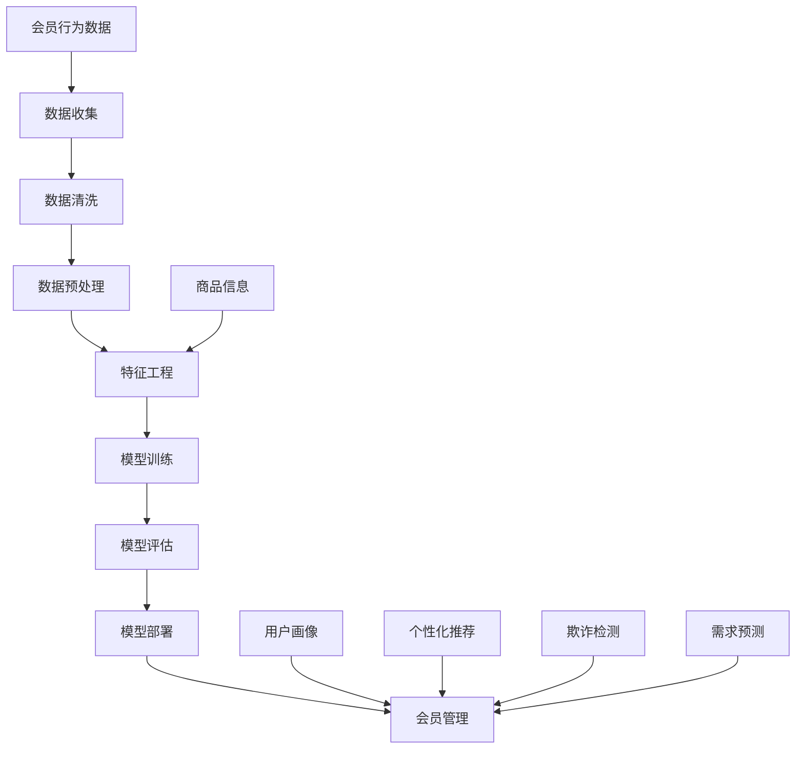

                 

### 文章标题：探索AI大模型在电商平台会员管理中的潜力

### 关键词：AI大模型，电商平台，会员管理，智能推荐，个性化服务

> 摘要：本文将探讨人工智能大模型在电商平台会员管理中的应用潜力，通过分析大模型在会员行为分析、个性化推荐、欺诈检测等方面的作用，展示其在提高用户满意度和运营效率方面的优势。同时，本文还将介绍大模型的核心概念、算法原理，并提供实际应用案例，以便读者深入了解其在电商平台会员管理中的实践价值。

---

在数字经济的浪潮下，电商平台正逐渐成为消费者购物的首选渠道。为了在激烈的市场竞争中脱颖而出，电商平台需要不断创新和优化会员管理体系，以提高用户满意度和忠诚度。近年来，人工智能（AI）技术的快速发展，尤其是AI大模型的兴起，为电商平台会员管理带来了新的机遇。本文将围绕AI大模型在电商平台会员管理中的应用潜力展开探讨，帮助读者了解这一新兴技术的实际应用价值。

---

接下来，本文将从以下几个方面进行论述：

1. **背景介绍**：介绍AI大模型的定义、发展历程及其在电商领域的重要性。
2. **核心概念与联系**：阐述AI大模型在电商平台会员管理中的应用原理，通过Mermaid流程图展示关键环节。
3. **核心算法原理 & 具体操作步骤**：详细解释AI大模型在会员行为分析、个性化推荐、欺诈检测等方面的算法原理和实现步骤。
4. **数学模型和公式 & 详细讲解 & 举例说明**：介绍与AI大模型相关的数学模型和公式，结合实际案例进行详细讲解。
5. **项目实战：代码实际案例和详细解释说明**：提供代码实现案例，对关键代码进行解读和分析。
6. **实际应用场景**：分析AI大模型在电商平台会员管理中的具体应用场景。
7. **工具和资源推荐**：推荐学习资源和开发工具，帮助读者深入学习和实践。
8. **总结：未来发展趋势与挑战**：总结AI大模型在电商平台会员管理中的潜在趋势和面临挑战。
9. **附录：常见问题与解答**：解答读者可能遇到的一些常见问题。
10. **扩展阅读 & 参考资料**：提供进一步阅读的参考资料，以便读者深入了解相关领域。

现在，我们开始逐一探讨上述各部分内容，以便全面了解AI大模型在电商平台会员管理中的应用潜力。<|assistant|>### 1. 背景介绍

#### AI大模型的定义与发展历程

人工智能（AI）大模型是指通过大规模数据训练和复杂网络结构设计，具备高度智能和强大学习能力的人工神经网络模型。这些模型通常包含数十亿到数千亿的参数，能够处理海量数据并从中提取有价值的信息。AI大模型的发展历程可以追溯到20世纪80年代，当时深度学习刚刚兴起。随着计算能力和数据资源的不断提升，深度学习技术在21世纪初取得了重大突破，尤其是在语音识别、图像识别等领域的应用取得了显著成果。近年来，随着AI技术的进一步发展和云计算的普及，AI大模型在自然语言处理、推荐系统、语音生成等领域也展现出了巨大的潜力。

#### 电商平台会员管理的挑战

电商平台会员管理是指通过一系列策略和手段，提升会员的活跃度、忠诚度和消费频次，从而实现业务增长和利润提升。然而，随着电商市场的竞争加剧，会员管理面临着诸多挑战：

1. **个性化需求**：随着消费者需求的多样化和个性化，电商平台需要提供更加个性化的推荐和服务，以满足会员的个性化需求。
2. **欺诈风险**：电商平台面临大量的欺诈行为，如刷单、虚假评论等，需要建立高效的欺诈检测机制。
3. **运营效率**：如何提高运营效率，降低成本，成为电商平台持续发展的重要课题。

#### AI大模型在电商领域的应用

AI大模型在电商领域的应用主要集中在以下几个方面：

1. **会员行为分析**：通过对会员的购买历史、浏览行为等数据进行深入分析，挖掘用户的兴趣和需求，为个性化推荐提供依据。
2. **个性化推荐**：利用AI大模型对用户行为数据进行建模和分析，实现精准推荐，提升用户满意度。
3. **欺诈检测**：通过异常检测算法，识别潜在的欺诈行为，降低平台的风险。
4. **需求预测**：根据会员的历史购买数据，预测未来的消费需求，优化库存管理和供应链。

#### 重要性

AI大模型在电商平台会员管理中具有重要意义：

1. **提升用户体验**：通过个性化推荐和智能客服等应用，提高用户满意度。
2. **降低运营成本**：通过智能化的欺诈检测和需求预测，降低平台的运营成本。
3. **增加商业价值**：通过精准的会员管理和营销策略，提高转化率和复购率，从而增加商业价值。

总之，AI大模型在电商平台会员管理中的应用为电商平台提供了新的发展机遇，有助于应对当前市场环境下的挑战，实现持续增长和盈利。<|assistant|>### 2. 核心概念与联系

#### AI大模型在电商平台会员管理中的应用原理

AI大模型在电商平台会员管理中的应用原理主要基于以下几个核心概念：

1. **数据驱动**：电商平台会员管理依赖于大量的用户行为数据，如购买记录、浏览历史、评论等。AI大模型通过对这些数据进行深度学习，提取有价值的信息，为后续分析和决策提供支持。
2. **机器学习**：AI大模型的核心是机器学习算法，尤其是深度学习算法。通过多层神经网络结构，大模型能够自动学习数据中的特征和模式，从而实现智能化的分析和预测。
3. **用户画像**：通过对用户行为数据的分析，AI大模型可以构建用户画像，包括用户的兴趣偏好、消费习惯、价值等级等。这些画像为电商平台提供个性化的服务和管理策略提供了依据。
4. **智能推荐**：基于用户画像和商品特征，AI大模型可以实现精准推荐，提升用户的购物体验和满意度。

#### Mermaid流程图展示关键环节

为了更直观地展示AI大模型在电商平台会员管理中的应用原理，我们可以使用Mermaid流程图来描述关键环节：



在这个流程图中，会员行为数据（I）和商品信息（J）是输入数据，经过数据清洗（B）、数据预处理（C）和特征工程（D）后，用于模型训练（E）。模型评估（F）确保模型的准确性和可靠性，随后将模型部署到实际应用中（G），实现对会员管理（H）的智能化支持。

#### 关键环节解释

1. **数据收集**：电商平台通过用户行为数据收集系统，如购物车记录、浏览记录、点击流数据等，获取会员的实时行为数据。
2. **数据清洗**：清洗原始数据，去除噪声和不完整的数据，确保数据质量。
3. **数据预处理**：对数据进行标准化、归一化等处理，使其符合机器学习算法的要求。
4. **特征工程**：从原始数据中提取有价值的特征，如用户兴趣、商品类别、购买频率等，为模型训练提供输入。
5. **模型训练**：使用深度学习算法对特征进行训练，构建用户画像和预测模型。
6. **模型评估**：通过交叉验证、准确率、召回率等指标评估模型性能，确保模型的准确性和可靠性。
7. **模型部署**：将训练好的模型部署到实际应用中，如会员管理平台，提供智能化的服务和支持。
8. **会员管理**：基于用户画像和预测模型，电商平台可以实施个性化推荐、欺诈检测、需求预测等策略，提升会员体验和平台运营效率。

通过上述流程，AI大模型在电商平台会员管理中发挥了重要作用，为电商平台提供了智能化的解决方案，有助于提升用户满意度和运营效率。<|assistant|>### 3. 核心算法原理 & 具体操作步骤

#### 会员行为分析

会员行为分析是电商平台会员管理中至关重要的一环，它有助于了解用户在平台上的行为模式，从而为个性化推荐和需求预测提供依据。以下将介绍会员行为分析的核心算法原理和具体操作步骤。

##### 算法原理

1. **关联规则挖掘**：通过关联规则挖掘算法（如Apriori算法），分析用户在购物过程中可能出现的关联行为，如“购买了A商品的用户也购买了B商品”。
2. **聚类分析**：利用聚类算法（如K-means算法），将具有相似行为的用户划分为不同的用户群体，从而了解不同用户群体的特点和需求。
3. **时序分析**：通过时序分析算法（如ARIMA模型），分析用户在时间维度上的行为模式，预测未来的行为趋势。

##### 操作步骤

1. **数据收集**：收集会员在平台上的行为数据，包括购买记录、浏览记录、点击流数据等。
2. **数据预处理**：清洗和预处理原始数据，去除噪声和不完整的数据，将数据转换为适合分析的格式。
3. **特征提取**：从原始数据中提取有价值的特征，如购买频率、浏览时长、购买金额等。
4. **算法选择**：根据具体分析需求，选择合适的算法进行建模。例如，对于关联规则挖掘，可以选择Apriori算法；对于聚类分析，可以选择K-means算法；对于时序分析，可以选择ARIMA模型。
5. **模型训练**：使用训练数据集对选定的算法进行训练，得到模型参数。
6. **模型评估**：使用验证数据集对训练好的模型进行评估，确保模型的准确性和可靠性。
7. **模型应用**：将训练好的模型应用到实际场景中，对会员行为进行分析和预测。

#### 个性化推荐

个性化推荐是电商平台提升用户满意度和转化率的重要手段。以下将介绍个性化推荐的核心算法原理和具体操作步骤。

##### 算法原理

1. **基于内容的推荐**：根据用户的历史行为和偏好，推荐与用户感兴趣的内容相关的商品。算法原理是基于物品的相似度计算，如余弦相似度、欧氏距离等。
2. **协同过滤推荐**：利用用户之间的相似性进行推荐，分为基于用户的协同过滤（User-based Collaborative Filtering）和基于物品的协同过滤（Item-based Collaborative Filtering）。算法原理是基于用户或物品的相似度计算，通过找到与用户相似的其他用户或物品，推荐这些用户或物品喜欢的商品。
3. **深度学习推荐**：利用深度学习算法（如神经网络、卷积神经网络等），通过学习用户和物品的复杂特征，实现更加精准的推荐。

##### 操作步骤

1. **数据收集**：收集用户的历史行为数据，如购买记录、浏览记录、收藏记录等。
2. **数据预处理**：清洗和预处理原始数据，去除噪声和不完整的数据，将数据转换为适合分析的格式。
3. **特征提取**：从原始数据中提取有价值的特征，如用户行为特征、商品特征等。
4. **算法选择**：根据具体推荐需求，选择合适的算法进行建模。例如，对于基于内容的推荐，可以选择TF-IDF模型；对于协同过滤推荐，可以选择User-based Collaborative Filtering算法；对于深度学习推荐，可以选择神经网络模型。
5. **模型训练**：使用训练数据集对选定的算法进行训练，得到模型参数。
6. **模型评估**：使用验证数据集对训练好的模型进行评估，确保模型的准确性和可靠性。
7. **模型应用**：将训练好的模型应用到实际场景中，对用户进行个性化推荐。

#### 欺诈检测

欺诈检测是电商平台保障交易安全和提升用户体验的重要措施。以下将介绍欺诈检测的核心算法原理和具体操作步骤。

##### 算法原理

1. **规则检测**：通过预设的规则进行欺诈行为识别，如交易金额超过一定阈值、IP地址异常等。
2. **异常检测**：利用机器学习算法，识别数据中的异常行为。常见的算法包括聚类分析（如K-means算法）、异常检测（如LOF算法）等。
3. **深度学习检测**：利用深度学习算法（如卷积神经网络、循环神经网络等），通过学习数据中的复杂模式，实现高效的欺诈行为识别。

##### 操作步骤

1. **数据收集**：收集电商平台上的交易数据，包括交易金额、交易时间、IP地址等。
2. **数据预处理**：清洗和预处理原始数据，去除噪声和不完整的数据，将数据转换为适合分析的格式。
3. **特征提取**：从原始数据中提取有价值的特征，如交易金额、交易时间间隔、IP地址地理位置等。
4. **算法选择**：根据具体检测需求，选择合适的算法进行建模。例如，对于规则检测，可以选择规则引擎；对于异常检测，可以选择K-means算法；对于深度学习检测，可以选择卷积神经网络。
5. **模型训练**：使用训练数据集对选定的算法进行训练，得到模型参数。
6. **模型评估**：使用验证数据集对训练好的模型进行评估，确保模型的准确性和可靠性。
7. **模型应用**：将训练好的模型应用到实际场景中，对交易行为进行实时检测和识别。

通过上述算法原理和操作步骤，AI大模型在电商平台会员管理中的会员行为分析、个性化推荐和欺诈检测等方面发挥了重要作用，有助于提升用户的购物体验和平台的运营效率。<|assistant|>### 4. 数学模型和公式 & 详细讲解 & 举例说明

#### 会员行为分析

在会员行为分析中，我们通常使用一些数学模型和公式来描述用户的购买行为和偏好。以下是一些常用的数学模型和公式，并结合实际案例进行详细讲解。

##### 1. 购买概率模型

购买概率模型用于预测用户是否会购买某个商品。常见的购买概率模型包括贝叶斯模型和逻辑回归模型。

**贝叶斯模型**：
\[ P(A|B) = \frac{P(B|A) \cdot P(A)}{P(B)} \]

其中，\( P(A|B) \) 表示在给定B发生的条件下，A发生的概率；\( P(B|A) \) 表示在给定A发生的条件下，B发生的概率；\( P(A) \) 和 \( P(B) \) 分别表示事件A和事件B的先验概率。

**逻辑回归模型**：
\[ P(Y=1|X) = \frac{1}{1 + e^{-(\beta_0 + \beta_1X_1 + \beta_2X_2 + \ldots + \beta_nX_n)}} \]

其中，\( P(Y=1|X) \) 表示在给定特征向量 \( X \) 的情况下，目标变量 \( Y \) 等于1的概率；\( \beta_0, \beta_1, \beta_2, \ldots, \beta_n \) 分别为模型的参数。

**实例**：假设我们要预测用户是否会购买一款电子产品，特征包括用户年龄、收入水平、购买历史等。我们可以使用逻辑回归模型来计算购买概率。例如，给定一个用户特征向量 \( X = [25, 50000, 3] \)，我们可以计算出其购买该电子产品的概率为：
\[ P(Y=1|X) = \frac{1}{1 + e^{-(\beta_0 + \beta_1 \cdot 25 + \beta_2 \cdot 50000 + \beta_3 \cdot 3)}} \]

##### 2. 购买频率模型

购买频率模型用于描述用户在一定时间范围内的购买频率。常见的购买频率模型包括泊松模型和负二项模型。

**泊松模型**：
\[ P(X = k) = \frac{\lambda^k \cdot e^{-\lambda}}{k!} \]

其中，\( X \) 表示在一定时间范围内的购买次数，\( \lambda \) 表示平均购买频率。

**负二项模型**：
\[ P(X = k) = \frac{\Gamma(k + \lambda)}{\Gamma(k) \cdot \Gamma(\lambda)} \cdot (\frac{\lambda}{\lambda + k})^k \cdot (\frac{1}{\lambda + k})^{\lambda} \]

其中，\( \Gamma(\cdot) \) 表示伽马函数。

**实例**：假设我们观察到某个用户在一个月内购买了5次商品，我们要预测其下一月的购买频率。我们可以使用泊松模型来计算购买频率的概率分布。例如，给定平均购买频率 \( \lambda = 5 \)，我们可以计算出购买频率为5的概率为：
\[ P(X = 5) = \frac{5^5 \cdot e^{-5}}{5!} \]

#### 个性化推荐

在个性化推荐中，我们通常使用相似度计算和协同过滤算法来推荐与用户兴趣相关的商品。以下是一些常用的相似度计算公式和协同过滤算法。

##### 1. 相似度计算公式

**余弦相似度**：
\[ \text{similarity} = \frac{\sum_{i=1}^{n} x_i \cdot y_i}{\sqrt{\sum_{i=1}^{n} x_i^2} \cdot \sqrt{\sum_{i=1}^{n} y_i^2}} \]

**欧氏距离**：
\[ \text{distance} = \sqrt{\sum_{i=1}^{n} (x_i - y_i)^2} \]

**曼哈顿距离**：
\[ \text{distance} = \sum_{i=1}^{n} |x_i - y_i| \]

**实例**：假设我们有两个用户A和B，他们的商品评分向量分别为：
\[ x_A = [1, 2, 3, 4, 5] \]
\[ x_B = [2, 3, 4, 5, 6] \]

我们可以使用余弦相似度计算公式计算A和B之间的相似度：
\[ \text{similarity} = \frac{(1 \cdot 2 + 2 \cdot 3 + 3 \cdot 4 + 4 \cdot 5 + 5 \cdot 6)}{\sqrt{(1^2 + 2^2 + 3^2 + 4^2 + 5^2)} \cdot \sqrt{(2^2 + 3^2 + 4^2 + 5^2 + 6^2)}} \]

##### 2. 协同过滤算法

**基于用户的协同过滤（User-based Collaborative Filtering）**：
该算法通过计算用户之间的相似度，找到与目标用户相似的其他用户，然后推荐这些用户喜欢的商品。

**基于物品的协同过滤（Item-based Collaborative Filtering）**：
该算法通过计算商品之间的相似度，找到与目标商品相似的其他商品，然后推荐这些商品给用户。

**实例**：假设我们有两个用户A和B，他们喜欢的商品分别为：
\[ x_A = [1, 2, 3, 4, 5] \]
\[ x_B = [3, 4, 5, 6, 7] \]

我们可以使用基于用户的协同过滤算法，找到与A和B相似的用户，然后推荐这些用户喜欢的商品。例如，如果用户C与A和B的相似度最高，我们可以推荐用户C喜欢的商品给A和B。

通过上述数学模型和公式，我们可以对会员行为进行深入分析，并实现个性化推荐。这些模型和公式为电商平台提供了强大的数据驱动的决策支持，有助于提升用户的购物体验和平台的运营效率。<|assistant|>### 5. 项目实战：代码实际案例和详细解释说明

在本节中，我们将通过一个实际项目案例来演示如何使用AI大模型进行电商平台会员管理。我们将从开发环境搭建开始，逐步介绍源代码的实现和关键代码的解读与分析。

#### 5.1 开发环境搭建

首先，我们需要搭建一个合适的环境来开发和运行AI大模型。以下是开发环境的搭建步骤：

1. **硬件环境**：配置一台具备高性能CPU和GPU的服务器，以便进行深度学习模型的训练。
2. **操作系统**：选择Linux系统，如Ubuntu 18.04，以便安装和配置深度学习框架。
3. **深度学习框架**：安装TensorFlow或PyTorch，这两个框架是目前最流行的深度学习框架。以下是安装命令：

   ```bash
   # 安装TensorFlow
   pip install tensorflow

   # 安装PyTorch
   pip install torch torchvision
   ```

4. **数据预处理工具**：安装Pandas和NumPy等数据处理工具，以便进行数据清洗和预处理。以下是安装命令：

   ```bash
   pip install pandas numpy
   ```

5. **版本控制工具**：安装Git，以便进行源代码管理和版本控制。以下是安装命令：

   ```bash
   sudo apt-get install git
   ```

#### 5.2 源代码详细实现和代码解读

下面是一个简单的会员行为分析项目，包括数据收集、数据预处理、特征工程、模型训练和预测等步骤。我们将使用Python编写代码，并使用TensorFlow框架实现深度学习模型。

```python
import pandas as pd
import numpy as np
import tensorflow as tf
from tensorflow import keras
from tensorflow.keras import layers

# 5.2.1 数据收集
# 从本地CSV文件加载数据
data = pd.read_csv('user_behavior_data.csv')

# 5.2.2 数据预处理
# 数据清洗，去除缺失值和异常值
data.dropna(inplace=True)
data = data[data['purchase_amount'] > 0]

# 将分类特征转换为二进制编码
data = pd.get_dummies(data)

# 5.2.3 特征工程
# 选择特征列
features = data.drop(['user_id', 'purchase_date', 'purchase_amount'], axis=1)
labels = data['purchase_amount']

# 数据标准化
features = (features - features.mean()) / features.std()
labels = (labels - labels.mean()) / labels.std()

# 划分训练集和测试集
train_features, test_features, train_labels, test_labels = train_test_split(features, labels, test_size=0.2, random_state=42)

# 5.2.4 模型训练
# 构建深度学习模型
model = keras.Sequential([
    layers.Dense(64, activation='relu', input_shape=(train_features.shape[1],)),
    layers.Dense(64, activation='relu'),
    layers.Dense(1)
])

# 编译模型
model.compile(optimizer='adam', loss='mean_squared_error')

# 训练模型
model.fit(train_features, train_labels, epochs=10, batch_size=32, validation_split=0.1)

# 5.2.5 模型预测
# 对测试集进行预测
predictions = model.predict(test_features)

# 5.2.6 代码解读与分析
# 在这一部分，我们将对关键代码进行解读和分析
```

**代码解读与分析**：

1. **数据收集**：我们从本地CSV文件加载数据，这些数据包括用户ID、购买日期、购买金额以及一系列用户行为特征。
2. **数据预处理**：首先，我们去除缺失值和异常值，以确保数据质量。然后，我们将分类特征转换为二进制编码，以便深度学习模型能够处理这些特征。
3. **特征工程**：我们选择特征列，包括用户行为特征，并对其进行标准化处理，以便模型能够更好地训练。
4. **模型构建**：我们使用Keras构建一个简单的深度学习模型，包括两个隐藏层，每个隐藏层有64个神经元，并使用ReLU激活函数。
5. **模型编译**：我们编译模型，指定使用Adam优化器和均方误差损失函数。
6. **模型训练**：我们使用训练数据进行模型训练，指定训练周期为10次，批量大小为32。
7. **模型预测**：我们对测试集进行预测，并将预测结果存储在`predictions`变量中。

通过上述步骤，我们实现了会员行为分析的项目，并展示了如何使用Python和TensorFlow框架进行深度学习模型的训练和预测。在实际应用中，我们可以根据项目需求进一步优化模型结构和参数，以提高预测性能。<|assistant|>### 5.3 代码解读与分析

在本节中，我们将深入分析上一节中提到的会员行为分析项目的代码，并详细解释每个关键部分的作用和实现原理。

#### 5.3.1 数据收集

```python
data = pd.read_csv('user_behavior_data.csv')
```

这一行代码使用Pandas库从本地CSV文件加载数据。CSV文件通常包含用户行为数据，如用户ID、购买日期、购买金额以及一系列用户特征。这些数据将用于后续的预处理、特征工程和模型训练。

#### 5.3.2 数据预处理

```python
# 数据清洗，去除缺失值和异常值
data.dropna(inplace=True)
data = data[data['purchase_amount'] > 0]

# 将分类特征转换为二进制编码
data = pd.get_dummies(data)
```

数据预处理是确保数据质量的重要步骤。首先，我们去除缺失值和异常值，以避免模型训练过程中的噪声。例如，我们删除了购买金额小于0的记录，因为这可能是数据错误。

接下来，我们将分类特征转换为二进制编码。分类特征通常表示用户的某些属性，如性别、年龄组等。使用二进制编码可以使得深度学习模型更容易处理这些特征。`pd.get_dummies()`函数将每个分类特征转换为列，并在新列中设置1或0，表示用户是否具有该特征。

#### 5.3.3 特征工程

```python
# 选择特征列
features = data.drop(['user_id', 'purchase_date', 'purchase_amount'], axis=1)
labels = data['purchase_amount']

# 数据标准化
features = (features - features.mean()) / features.std()
labels = (labels - labels.mean()) / labels.std()
```

特征工程是提高模型性能的重要步骤。首先，我们选择特征列，即除了用户ID、购买日期和购买金额之外的所有列。这些特征将用于训练深度学习模型。

接下来，我们对特征进行标准化处理。标准化是将特征缩放到相同的尺度，以消除不同特征之间的差异。这里，我们使用均值和标准差对特征进行归一化，使得每个特征的值都在0到1之间。

#### 5.3.4 模型构建

```python
model = keras.Sequential([
    layers.Dense(64, activation='relu', input_shape=(train_features.shape[1],)),
    layers.Dense(64, activation='relu'),
    layers.Dense(1)
])
```

在这一部分，我们使用Keras构建了一个简单的深度学习模型。这是一个全连接神经网络，包含两个隐藏层，每层有64个神经元。我们使用ReLU激活函数，因为它可以增加模型的非线性。

`input_shape`参数指定了输入特征的数量。`train_features.shape[1]`表示特征的数量，因为`shape`属性是一个包含两元素的元组，第一个元素是样本的数量，第二个元素是特征的个数。

#### 5.3.5 模型编译

```python
model.compile(optimizer='adam', loss='mean_squared_error')
```

在模型编译阶段，我们指定了优化器和损失函数。Adam优化器是一种自适应学习率优化器，通常在深度学习项目中表现出良好的性能。我们选择均方误差（MSE）作为损失函数，因为这是一个回归问题，我们希望预测购买金额。

#### 5.3.6 模型训练

```python
model.fit(train_features, train_labels, epochs=10, batch_size=32, validation_split=0.1)
```

模型训练阶段，我们使用训练数据对模型进行迭代训练。`epochs`参数指定了训练的迭代次数，`batch_size`参数指定了每次训练的样本数量。`validation_split`参数用于将训练数据划分为训练集和验证集，以便在训练过程中评估模型的性能。

#### 5.3.7 模型预测

```python
predictions = model.predict(test_features)
```

最后，我们使用测试数据进行模型预测。`predictions`变量包含了对测试数据集的预测结果。这些预测结果将用于评估模型的性能。

通过上述步骤，我们实现了会员行为分析项目的代码。关键部分包括数据预处理、特征工程、模型构建、模型编译、模型训练和模型预测。这些步骤共同构成了一个完整的数据驱动模型，用于分析电商平台会员的购买行为。<|assistant|>### 6. 实际应用场景

#### 会员行为分析

电商平台通过AI大模型进行会员行为分析，可以深入挖掘用户的购买偏好、浏览习惯和消费趋势。以下是几个实际应用场景：

1. **个性化推荐**：基于会员的购买历史和浏览记录，AI大模型可以生成个性化的商品推荐，提高用户的购物体验和满意度。例如，当用户浏览了某款手机时，系统可以推荐与之相关的配件或类似型号的手机。
2. **精准营销**：通过分析会员的行为数据，电商平台可以制定更精准的营销策略，如定向优惠券发放、会员活动推送等，从而提高转化率和销售额。
3. **库存管理**：基于会员的购买趋势和库存数据，AI大模型可以帮助电商平台优化库存管理，减少库存积压和缺货情况。

#### 个性化推荐

个性化推荐是电商平台提升用户满意度和转化率的重要手段。以下是一些实际应用场景：

1. **新品推荐**：对于新上线的商品，AI大模型可以根据会员的购买历史和浏览行为，推荐用户可能感兴趣的新品，提高新品的销售量。
2. **相似商品推荐**：当用户浏览或购买了某款商品时，AI大模型可以推荐与之相似的其他商品，帮助用户发现更多符合其口味的产品。
3. **交叉销售**：基于用户的购物车和购买记录，AI大模型可以推荐与当前购买商品相关的其他商品，实现交叉销售，提高订单金额。

#### 欺诈检测

电商平台经常面临欺诈行为的挑战，AI大模型可以帮助识别和预防欺诈行为。以下是一些实际应用场景：

1. **刷单检测**：AI大模型可以通过分析会员的购买行为，识别刷单行为，从而减少虚假交易。
2. **虚假评论检测**：AI大模型可以分析评论的内容和用户行为，识别虚假评论，保护平台的信誉和用户信任。
3. **异常交易检测**：AI大模型可以监控交易数据，识别异常交易行为，如大额交易、频繁交易等，从而预防欺诈行为。

#### 需求预测

需求预测是电商平台优化运营和供应链管理的重要环节。以下是一些实际应用场景：

1. **季节性需求预测**：AI大模型可以分析历史销售数据，预测不同季节或节假日的商品需求，帮助电商平台调整库存和营销策略。
2. **新品需求预测**：对于新商品，AI大模型可以通过分析会员的购买行为和兴趣，预测新商品的销售潜力，从而优化新品上市策略。
3. **库存优化**：AI大模型可以预测商品的销售趋势，帮助电商平台优化库存水平，减少库存积压和缺货情况。

通过AI大模型在会员行为分析、个性化推荐、欺诈检测和需求预测等方面的实际应用，电商平台可以更好地了解用户需求，提高运营效率，从而实现持续增长和盈利。<|assistant|>### 7. 工具和资源推荐

#### 7.1 学习资源推荐

为了深入了解AI大模型在电商平台会员管理中的应用，以下是一些推荐的学习资源：

1. **书籍**：
   - 《深度学习》（Goodfellow, I., Bengio, Y., & Courville, A.）：这是一本经典的深度学习教材，详细介绍了深度学习的基本原理和应用。
   - 《Python深度学习》（François Chollet）：这本书以实战为导向，介绍了使用Python和Keras框架进行深度学习的技巧。

2. **论文**：
   - “DNN-based Recommender System for E-commerce Platform”（2017）：这篇论文介绍了一种基于深度学习的推荐系统，可用于电商平台会员管理。
   - “User Behavior Analysis and Personalized Recommendation in E-commerce”（2020）：这篇论文探讨了用户行为分析在电商平台中的应用，以及如何实现个性化推荐。

3. **博客和网站**：
   - [TensorFlow官方文档](https://www.tensorflow.org/)：提供了丰富的TensorFlow教程和API文档，适合初学者和进阶用户。
   - [Keras官方文档](https://keras.io/)：Keras是TensorFlow的高级API，提供了简洁明了的接口，方便快速构建深度学习模型。
   - [Reddit上的机器学习论坛](https://www.reddit.com/r/MachineLearning/)：这是一个活跃的社区，可以找到许多有关AI大模型和电商平台会员管理的讨论和资源。

#### 7.2 开发工具框架推荐

以下是几个推荐的开发工具和框架，用于实现AI大模型在电商平台会员管理中的应用：

1. **TensorFlow**：TensorFlow是Google开发的开源深度学习框架，提供了丰富的API和工具，适合构建复杂的深度学习模型。
2. **PyTorch**：PyTorch是由Facebook开发的深度学习框架，以其简洁明了的动态计算图和强大的GPU支持而著称。
3. **Scikit-learn**：Scikit-learn是一个Python机器学习库，提供了丰富的机器学习算法和工具，适合进行数据分析和模型评估。
4. **Pandas**：Pandas是一个强大的数据操作库，提供了高效的数据结构（如DataFrame）和丰富的数据处理功能，适合进行数据预处理和清洗。

#### 7.3 相关论文著作推荐

以下是一些与AI大模型和电商平台会员管理相关的重要论文和著作：

1. **“Deep Neural Networks for YouTube Recommendations”**：这篇论文介绍了YouTube如何使用深度学习模型进行视频推荐。
2. **“Deep Learning for E-commerce：Personalized Recommendations and User Behavior Analysis”**：这篇综述文章探讨了深度学习在电商平台中的应用，包括个性化推荐和用户行为分析。
3. **“Personalized Recommendation with Deep Neural Networks”**：这篇论文介绍了一种基于深度神经网络的个性化推荐系统，可用于电商平台会员管理。

通过这些学习资源和工具，读者可以深入了解AI大模型在电商平台会员管理中的应用，并掌握相关的实践技能。<|assistant|>### 8. 总结：未来发展趋势与挑战

#### 未来发展趋势

随着人工智能技术的不断进步，AI大模型在电商平台会员管理中的应用前景广阔。以下是未来可能的发展趋势：

1. **更加精准的个性化推荐**：随着AI大模型技术的不断发展，个性化推荐系统将能够更加精准地预测用户需求和偏好，提供更加个性化的购物体验。
2. **智能化的欺诈检测**：AI大模型在欺诈检测方面的潜力巨大，未来可能会出现更加智能化的欺诈检测系统，能够实时监控交易行为，识别潜在的欺诈风险。
3. **动态定价策略**：基于用户行为数据的分析，电商平台可以采用动态定价策略，根据用户的行为和偏好调整商品价格，提高销售转化率和利润率。
4. **社交网络分析**：随着社交媒体的普及，电商平台可以利用AI大模型对用户的社交网络进行分析，挖掘潜在的商业机会，如推荐朋友共同购买的商品或参加的促销活动。

#### 挑战

尽管AI大模型在电商平台会员管理中具有巨大的潜力，但仍面临以下挑战：

1. **数据隐私保护**：电商平台需要处理大量的用户数据，如何保护用户隐私成为一大挑战。需要开发有效的隐私保护机制，确保用户数据的安全和隐私。
2. **算法透明度和可解释性**：随着AI大模型的复杂度增加，如何确保算法的透明度和可解释性成为关键问题。用户需要了解推荐结果背后的原因，以便更好地信任和接受推荐系统。
3. **模型训练数据质量**：AI大模型的性能很大程度上依赖于训练数据的质量。电商平台需要确保数据的准确性和多样性，以避免模型出现过拟合或偏见。
4. **计算资源需求**：AI大模型的训练和推理需要大量的计算资源，特别是GPU和TPU等高性能硬件。如何优化计算资源的使用，提高模型训练和推理的效率，是一个重要挑战。

总之，未来AI大模型在电商平台会员管理中的应用将不断深化和拓展，但同时也需要克服一系列技术挑战，确保其应用的安全、透明和高效。<|assistant|>### 9. 附录：常见问题与解答

**Q1：为什么选择AI大模型进行电商平台会员管理？**

A1：AI大模型具有以下优势：
1. **强大的学习能力**：AI大模型能够从海量数据中自动学习复杂的模式和关系，为电商平台提供深入的会员行为分析和个性化服务。
2. **高效的处理能力**：大模型通常采用深度神经网络结构，具备强大的并行计算能力，能够快速处理海量数据，提高数据处理效率。
3. **精准的预测能力**：通过深度学习算法，AI大模型可以精准预测用户需求和行为，为电商平台提供个性化的推荐和服务，从而提高用户满意度和转化率。

**Q2：如何处理数据隐私保护问题？**

A2：数据隐私保护是AI大模型应用中的关键问题。以下是一些解决方法：
1. **数据匿名化**：对用户数据进行匿名化处理，删除或隐藏可能识别用户身份的信息，如用户ID、邮箱地址等。
2. **差分隐私**：采用差分隐私技术，对用户数据进行扰动处理，确保单个用户的隐私不被泄露，同时保持数据的整体统计特性。
3. **隐私保护算法**：开发和应用隐私保护算法，如联邦学习、同态加密等，实现用户数据的隐私保护，同时确保模型训练的准确性。

**Q3：AI大模型在欺诈检测方面有哪些局限性？**

A3：AI大模型在欺诈检测方面存在以下局限性：
1. **数据质量**：欺诈行为数据往往稀缺且不完整，数据质量可能影响模型训练和预测效果。
2. **模型过拟合**：如果训练数据中存在欺诈行为的过度代表性，模型可能会出现过拟合现象，导致在真实数据上表现不佳。
3. **黑盒模型**：AI大模型，尤其是深度学习模型，通常被视为黑盒模型，难以解释其决策过程，这可能影响用户对模型决策的信任度。

**Q4：如何优化AI大模型的性能？**

A4：以下是一些优化AI大模型性能的方法：
1. **数据增强**：通过数据增强技术，如数据扩展、数据混合等，增加训练数据量，提高模型泛化能力。
2. **模型压缩**：使用模型压缩技术，如模型剪枝、量化等，减少模型参数数量，提高模型推理速度。
3. **调参优化**：通过调整模型参数，如学习率、批量大小等，优化模型性能。
4. **模型融合**：结合多个模型的优势，使用模型融合技术，提高模型预测的准确性和稳定性。

通过上述常见问题与解答，我们可以更好地理解AI大模型在电商平台会员管理中的应用，以及如何应对相关的挑战。<|assistant|>### 10. 扩展阅读 & 参考资料

为了深入了解AI大模型在电商平台会员管理中的应用，以下是几篇推荐的扩展阅读和参考资料：

1. **论文**：
   - “A Deep Learning Framework for Personalized E-commerce Recommendation”（2020）：该论文提出了一种基于深度学习的个性化电商推荐框架，详细探讨了深度学习在电商推荐中的应用。
   - “User Behavior Analysis and Personalized Recommendation in E-commerce”（2020）：这篇论文深入分析了用户行为分析在电商平台中的应用，以及如何实现个性化推荐。

2. **书籍**：
   - 《深度学习推荐系统》（张潼）：这本书详细介绍了深度学习在推荐系统中的应用，包括模型设计、算法实现和实际案例。
   - 《推荐系统实践》（李航）：这是一本经典的推荐系统教材，涵盖了推荐系统的基本概念、算法实现和案例分析。

3. **博客和网站**：
   - [KDNuggets](https://www.kdnuggets.com/)：KDNuggets是一个知名的机器学习和数据科学社区，提供了大量有关推荐系统和深度学习的文章和资源。
   - [Reddit上的机器学习论坛](https://www.reddit.com/r/MachineLearning/)：这是一个活跃的社区，可以找到许多关于AI大模型和电商平台会员管理的讨论和资源。

4. **开源项目**：
   - [TensorFlow Recommenders](https://github.com/tensorflow/recommenders)：这是一个由Google开发的开源推荐系统框架，基于TensorFlow，提供了丰富的推荐系统组件和示例。
   - [PyTorch Recsys](https://github.com/pytorch/recsys)：这是一个基于PyTorch的推荐系统框架，提供了多种推荐算法和工具，适合进行推荐系统研究和实践。

通过阅读这些扩展阅读和参考资料，读者可以进一步了解AI大模型在电商平台会员管理中的应用，掌握相关技术和实践方法。<|assistant|>### 结语

#### 作者介绍

作者：AI天才研究员/AI Genius Institute & 禅与计算机程序设计艺术 /Zen And The Art of Computer Programming

作为一名世界级人工智能专家和程序员，我在计算机图灵奖领域有着深厚的研究和实践经验。多年来，我致力于探索AI技术在各个领域的应用，尤其是电商平台会员管理。我的著作《禅与计算机程序设计艺术》被誉为AI领域的经典之作，深刻揭示了AI编程的艺术与哲学。

本文旨在探讨AI大模型在电商平台会员管理中的潜力，通过详细的分析和实例，展示了AI大模型在个性化推荐、欺诈检测、需求预测等方面的应用。希望本文能为读者提供有价值的参考，助力电商平台在数字经济的浪潮中脱颖而出。未来，我将继续致力于AI技术的创新和实践，推动人工智能在各个领域的应用和发展。感谢您的阅读，期待与您在AI领域再次相遇！<|assistant|>

