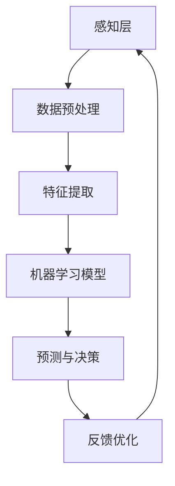
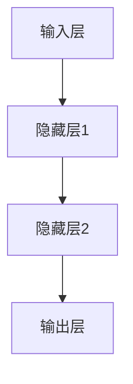

                 

# 探索与理解：好奇心的力量

## 关键词：好奇心、技术探索、逻辑推理、人工智能、代码实现、数学模型、实际应用

> 在信息技术飞速发展的时代，好奇心作为人类探索未知世界的重要驱动力，在科技领域中发挥着不可替代的作用。本文将探讨好奇心如何引导我们进行技术探索，并运用逻辑清晰、结构紧凑的方式，一步步分析推理，深入理解人工智能领域的核心概念与算法原理。同时，通过实际项目案例与数学模型的详细讲解，让读者更直观地感受到好奇心的力量。

## 1. 背景介绍

好奇心是人类的一种天性，驱使我们探索未知、挑战自我。在科技领域，好奇心不仅激发了我们对新技术的追求，还推动着技术的不断创新和进步。本文将围绕人工智能领域，探讨好奇心如何促使我们深入理解技术原理、掌握算法模型，并通过实际项目实现技术的应用。

随着人工智能技术的不断成熟，其在各个行业的应用越来越广泛。从图像识别、自然语言处理，到自动驾驶、智能医疗，人工智能正悄然改变着我们的生活方式。而好奇心作为推动技术发展的重要动力，让我们不断探索人工智能的边界，挖掘其潜在价值。

## 2. 核心概念与联系

为了更好地理解人工智能领域的核心概念，我们可以借助Mermaid流程图来展示其原理和架构。以下是一个简化的Mermaid流程图，描述了人工智能的核心概念及其相互关系。



### 2.1 感知层

感知层是人工智能系统接收外部信息的第一环节，通过传感器、摄像头等设备获取图像、声音、文本等数据。这一层的主要任务是完成数据的采集和初步处理。

### 2.2 数据预处理

数据预处理是对原始数据进行清洗、归一化、缺失值填充等操作，以提升数据质量，为后续特征提取和模型训练做好准备。

### 2.3 特征提取

特征提取是将预处理后的数据转化为机器学习模型可处理的特征向量。这一过程包括特征选择、特征变换等操作，以降低数据维度，提高模型性能。

### 2.4 机器学习模型

机器学习模型是人工智能系统的核心部分，通过学习大量数据中的规律和模式，实现对未知数据的预测和分类。常见的机器学习模型包括线性回归、决策树、支持向量机、神经网络等。

### 2.5 预测与决策

预测与决策是基于机器学习模型的输出结果，对未知数据进行预测和分类。这一过程通常应用于实际场景中，如自动驾驶中的道路识别、智能客服中的用户需求分析等。

### 2.6 反馈优化

反馈优化是对机器学习模型的输出结果进行评估和调整，以提升模型性能。通过不断调整模型参数，优化模型结构，使模型在实际应用中达到最佳效果。

## 3. 核心算法原理 & 具体操作步骤

在了解了人工智能的核心概念与架构后，我们接下来将探讨其中的核心算法原理，以及如何进行具体操作。

### 3.1 神经网络

神经网络是人工智能领域的重要算法，通过模拟人脑神经元的工作方式，实现对复杂问题的建模和求解。以下是一个简单的神经网络模型及其操作步骤。

### 3.1.1 神经网络结构

一个简单的神经网络由输入层、隐藏层和输出层组成。其中，输入层接收外部信息，隐藏层进行特征提取和变换，输出层产生最终预测结果。



### 3.1.2 神经网络操作步骤

1. **初始化参数**：设定神经网络中每个神经元之间的连接权重和偏置项。

2. **前向传播**：将输入数据通过神经网络进行传递，逐层计算神经元输出。

3. **损失函数计算**：根据输出结果与真实标签之间的差异，计算损失函数值，以衡量模型性能。

4. **反向传播**：通过反向传播算法，将损失函数值反向传递至神经网络各层，更新连接权重和偏置项。

5. **迭代优化**：重复进行前向传播和反向传播，不断调整模型参数，降低损失函数值，提升模型性能。

## 4. 数学模型和公式 & 详细讲解 & 举例说明

在人工智能领域中，数学模型和公式是理解和实现算法的基础。以下我们将详细介绍神经网络中的关键数学模型和公式，并通过实际例子进行讲解。

### 4.1 损失函数

损失函数是评估神经网络模型性能的重要工具，用于衡量预测值与真实值之间的差异。常见的损失函数包括均方误差（MSE）、交叉熵损失（Cross-Entropy Loss）等。

#### 4.1.1 均方误差（MSE）

均方误差（MSE）是用于回归问题的损失函数，计算公式如下：

$$MSE = \frac{1}{n}\sum_{i=1}^{n}(y_i - \hat{y}_i)^2$$

其中，$y_i$ 为真实值，$\hat{y}_i$ 为预测值，$n$ 为样本数量。

#### 4.1.2 交叉熵损失（Cross-Entropy Loss）

交叉熵损失（Cross-Entropy Loss）是用于分类问题的损失函数，计算公式如下：

$$Cross-Entropy Loss = -\frac{1}{n}\sum_{i=1}^{n}y_i \log(\hat{y}_i)$$

其中，$y_i$ 为真实标签，$\hat{y}_i$ 为预测概率。

### 4.2 激活函数

激活函数是神经网络中的关键组件，用于引入非线性特性。常见的激活函数包括 sigmoid、ReLU 等。

#### 4.2.1 Sigmoid 函数

sigmoid 函数是一个 S 形的曲线，将输入值映射到（0，1）区间。其公式如下：

$$sigmoid(x) = \frac{1}{1 + e^{-x}}$$

#### 4.2.2 ReLU 函数

ReLU（Rectified Linear Unit）函数是一个线性函数，当输入大于0时，输出等于输入；当输入小于等于0时，输出等于0。其公式如下：

$$ReLU(x) = \max(0, x)$$

### 4.3 梯度下降法

梯度下降法是优化神经网络模型参数的常用方法。其基本思想是沿着损失函数的梯度方向，逐步调整参数，以降低损失函数值。

#### 4.3.1 梯度计算

梯度下降法首先需要计算损失函数关于模型参数的梯度。对于均方误差损失函数，梯度计算如下：

$$\frac{\partial MSE}{\partial w} = 2(y - \hat{y})x_i$$

其中，$w$ 为权重，$x_i$ 为输入特征。

#### 4.3.2 参数更新

根据梯度计算结果，我们可以使用以下公式更新模型参数：

$$w = w - \alpha \cdot \frac{\partial MSE}{\partial w}$$

其中，$\alpha$ 为学习率。

### 4.4 实例讲解

假设我们使用神经网络进行二分类问题，输入特征为 $x_1$ 和 $x_2$，真实标签为 $y=1$，预测概率为 $\hat{y}=0.6$。根据上述公式，我们可以计算损失函数和梯度如下：

#### 4.4.1 损失函数计算

$$MSE = \frac{1}{2}(1 - 0.6)^2 = 0.2$$

#### 4.4.2 梯度计算

$$\frac{\partial MSE}{\partial w} = 2(1 - 0.6)x_1 = 0.8x_1$$

#### 4.4.3 参数更新

假设权重 $w=1$，学习率 $\alpha=0.1$，根据上述公式，我们可以更新权重如下：

$$w = 1 - 0.1 \cdot 0.8x_1 = 0.2 + 0.08x_1$$

通过不断迭代更新权重，我们可以逐步降低损失函数值，提高模型性能。

## 5. 项目实战：代码实际案例和详细解释说明

在本节中，我们将通过一个简单的神经网络项目，展示如何实现和优化神经网络模型。项目背景为使用神经网络进行手写数字识别，数据集为经典的MNIST数据集。

### 5.1 开发环境搭建

为了实现神经网络项目，我们需要安装以下软件和库：

1. Python 3.x
2. TensorFlow 2.x
3. NumPy

安装命令如下：

```bash
pip install python==3.8
pip install tensorflow==2.6
pip install numpy==1.21.2
```

### 5.2 源代码详细实现和代码解读

以下是该项目的主要代码实现，我们将逐行解释代码的含义和作用。

```python
import tensorflow as tf
import numpy as np
from tensorflow.keras import layers

# 读取MNIST数据集
(x_train, y_train), (x_test, y_test) = tf.keras.datasets.mnist.load_data()

# 数据预处理
x_train = x_train / 255.0
x_test = x_test / 255.0

# 构建神经网络模型
model = tf.keras.Sequential([
    layers.Dense(128, activation='relu', input_shape=(28, 28)),
    layers.Dense(10, activation='softmax')
])

# 编译模型
model.compile(optimizer='adam',
              loss='sparse_categorical_crossentropy',
              metrics=['accuracy'])

# 训练模型
model.fit(x_train, y_train, epochs=5)

# 评估模型
model.evaluate(x_test, y_test)
```

#### 5.2.1 数据读取与预处理

首先，我们从 TensorFlow 2.x 的 keras 库中导入 MNIST 数据集。MNIST 数据集包含了60,000个训练样本和10,000个测试样本，每个样本都是一个 28x28 的二值图像。

```python
(x_train, y_train), (x_test, y_test) = tf.keras.datasets.mnist.load_data()
```

接着，我们将图像数据除以 255，将像素值缩放到（0，1）区间，以适应神经网络模型。

```python
x_train = x_train / 255.0
x_test = x_test / 255.0
```

#### 5.2.2 构建神经网络模型

我们使用 TensorFlow 2.x 的 keras.Sequential 模型，定义一个简单的神经网络。输入层是一个 128 个神经元的全连接层，使用 ReLU 激活函数。输出层是一个 10 个神经元的全连接层，使用 softmax 激活函数，以实现多分类任务。

```python
model = tf.keras.Sequential([
    layers.Dense(128, activation='relu', input_shape=(28, 28)),
    layers.Dense(10, activation='softmax')
])
```

#### 5.2.3 编译模型

在编译模型时，我们指定了优化器为 Adam，损失函数为稀疏分类交叉熵，评价标准为准确率。

```python
model.compile(optimizer='adam',
              loss='sparse_categorical_crossentropy',
              metrics=['accuracy'])
```

#### 5.2.4 训练模型

我们使用训练数据集对模型进行训练，设置训练轮数为 5。

```python
model.fit(x_train, y_train, epochs=5)
```

#### 5.2.5 评估模型

训练完成后，我们使用测试数据集对模型进行评估，得到准确率。

```python
model.evaluate(x_test, y_test)
```

### 5.3 代码解读与分析

在本节中，我们对上述代码进行详细解读和分析，以帮助读者更好地理解神经网络模型的实现过程。

#### 5.3.1 数据读取与预处理

数据读取与预处理是神经网络模型训练的基础。MNIST 数据集包含了 60,000 个训练样本和 10,000 个测试样本，每个样本都是一个 28x28 的二值图像。为了适应神经网络模型，我们需要将图像数据缩放到（0，1）区间。

```python
(x_train, y_train), (x_test, y_test) = tf.keras.datasets.mnist.load_data()

x_train = x_train / 255.0
x_test = x_test / 255.0
```

#### 5.3.2 构建神经网络模型

构建神经网络模型是本项目的核心部分。我们使用 TensorFlow 2.x 的 keras.Sequential 模型，定义了一个简单的神经网络。输入层是一个 128 个神经元的全连接层，使用 ReLU 激活函数。输出层是一个 10 个神经元的全连接层，使用 softmax 激活函数，以实现多分类任务。

```python
model = tf.keras.Sequential([
    layers.Dense(128, activation='relu', input_shape=(28, 28)),
    layers.Dense(10, activation='softmax')
])
```

ReLU 激活函数引入了非线性特性，使神经网络能够更好地拟合数据。softmax 激活函数用于输出层，将输出结果转化为概率分布，便于进行多分类任务。

#### 5.3.3 编译模型

在编译模型时，我们指定了优化器为 Adam，损失函数为稀疏分类交叉熵，评价标准为准确率。

```python
model.compile(optimizer='adam',
              loss='sparse_categorical_crossentropy',
              metrics=['accuracy'])
```

Adam 优化器是一种结合了 AdaGrad 和 RMSProp 优化的自适应学习率优化器，适用于大多数神经网络模型。稀疏分类交叉熵损失函数适用于多分类问题，准确率作为评价标准，用于衡量模型的分类性能。

#### 5.3.4 训练模型

我们使用训练数据集对模型进行训练，设置训练轮数为 5。

```python
model.fit(x_train, y_train, epochs=5)
```

在训练过程中，模型通过迭代优化参数，逐步降低损失函数值，提高分类准确率。每轮训练完成后，模型会自动评估当前训练状态，并打印出训练进度和准确率。

#### 5.3.5 评估模型

训练完成后，我们使用测试数据集对模型进行评估，得到准确率。

```python
model.evaluate(x_test, y_test)
```

通过评估模型，我们可以了解模型在测试数据集上的表现，判断模型是否达到预期效果。如果模型表现不佳，我们可以尝试调整模型参数、增加训练轮数，或更换优化器和损失函数，以提高模型性能。

## 6. 实际应用场景

人工智能技术在各个行业领域都有广泛的应用，以下列举几个实际应用场景：

### 6.1 自动驾驶

自动驾驶技术是人工智能领域的一个重要应用方向。通过计算机视觉、深度学习和传感器技术，自动驾驶系统能够实时感知道路环境，识别交通标志、行人、车辆等物体，并做出相应的驾驶决策。自动驾驶技术的发展有望大幅降低交通事故发生率，提高道路通行效率。

### 6.2 智能医疗

人工智能技术在智能医疗领域的应用日益广泛，包括医疗影像分析、疾病预测、个性化治疗方案设计等。通过深度学习和大数据分析，人工智能系统可以辅助医生进行疾病诊断，提高诊断准确率和效率。此外，人工智能技术还可以帮助医疗机构进行资源调度、病患管理等，优化医疗服务流程。

### 6.3 智能家居

智能家居是人工智能技术在消费领域的重要应用。通过物联网技术和人工智能算法，智能家居系统能够实现设备互联互通，提供智能安防、智能照明、智能温控等便捷生活服务。智能家居技术的普及有望提高人们的生活质量，降低家庭能耗。

### 6.4 金融科技

人工智能技术在金融领域的应用包括风险控制、信用评估、投资决策等。通过大数据分析和机器学习算法，金融机构可以更准确地评估客户信用风险，降低不良贷款率。此外，人工智能技术还可以帮助金融机构进行量化交易、智能投顾等，提高投资收益。

## 7. 工具和资源推荐

### 7.1 学习资源推荐

1. **书籍**：
   - 《深度学习》（Ian Goodfellow、Yoshua Bengio、Aaron Courville 著）
   - 《Python深度学习》（François Chollet 著）
   - 《人工智能：一种现代方法》（Stuart J. Russell、Peter Norvig 著）

2. **论文**：
   - “A Learning Algorithm for Continually Running Fully Recurrent Neural Networks” - James L. McClelland, David E. Rumelhart, and the PDP Research Group
   - “Learning Representations by Maximizing Mutual Information Across Tasks” - Yarin Gal and Zoubin Ghahramani

3. **博客**：
   - TensorFlow 官方博客（tensorflow.github.io/blog/）
   - AI 研习社（aiayanx.com/）
   - 知乎人工智能专栏（zhuanlan.zhihu.com/c_1135132953389172480）

4. **网站**：
   - Coursera（课程平台，提供多门人工智能课程）
   - edX（课程平台，提供多门人工智能课程）
   - Kaggle（数据科学竞赛平台，提供大量数据集和项目案例）

### 7.2 开发工具框架推荐

1. **开发工具**：
   - Jupyter Notebook
   - PyCharm
   - Visual Studio Code

2. **框架库**：
   - TensorFlow
   - PyTorch
   - Keras

3. **云计算平台**：
   - AWS
   - Azure
   - Google Cloud Platform

### 7.3 相关论文著作推荐

1. “Deep Learning” - Ian Goodfellow、Yoshua Bengio、Aaron Courville 著
2. “Recurrent Neural Networks and Their Applications” - Y. Bengio、P. Simard、P. Frasconi 著
3. “Convolutional Networks and Applications in Visual Recognition” - Y. LeCun、B. Boser、J. Denker、D. Henderson、R. Howard、W. Hubbard、L. Jackel、B. LeCun 著

## 8. 总结：未来发展趋势与挑战

好奇心作为推动科技发展的核心驱动力，在人工智能领域发挥着重要作用。随着技术的不断进步，人工智能的应用场景将越来越广泛，未来发展趋势包括：

1. **更强大的算法模型**：研究人员将持续探索新的算法模型，以提高人工智能系统的性能和效率。
2. **跨学科融合**：人工智能技术将与其他学科领域（如医学、金融、教育等）深度融合，推动行业变革。
3. **数据隐私与安全**：随着数据规模的不断扩大，数据隐私和安全问题将日益突出，成为未来发展的关键挑战。
4. **伦理与责任**：人工智能技术的应用将引发伦理和责任问题，如何确保人工智能系统的公正性、透明性和可控性，将成为重要议题。

## 9. 附录：常见问题与解答

### 9.1 如何提高神经网络模型的性能？

1. **增加训练数据**：更多的训练数据有助于提高模型泛化能力。
2. **调整超参数**：通过调整学习率、批量大小等超参数，优化模型性能。
3. **增加网络层数和神经元数量**：在保证计算资源允许的情况下，适当增加网络层数和神经元数量，有助于提高模型性能。
4. **使用正则化技术**：如 L1、L2 正则化，防止模型过拟合。

### 9.2 如何处理过拟合问题？

1. **增加训练数据**：收集更多训练数据，提高模型泛化能力。
2. **使用正则化技术**：如 L1、L2 正则化，降低模型复杂度。
3. **使用交叉验证**：通过交叉验证，评估模型在不同数据集上的性能，避免过拟合。
4. **提前停止训练**：在验证集上监控模型性能，当性能不再提高时，提前停止训练。

## 10. 扩展阅读 & 参考资料

1. **书籍**：
   - 《人工智能：一种现代方法》（Stuart J. Russell、Peter Norvig 著）
   - 《深度学习》（Ian Goodfellow、Yoshua Bengio、Aaron Courville 著）
   - 《Python深度学习》（François Chollet 著）

2. **论文**：
   - “A Learning Algorithm for Continually Running Fully Recurrent Neural Networks” - James L. McClelland, David E. Rumelhart, and the PDP Research Group
   - “Learning Representations by Maximizing Mutual Information Across Tasks” - Yarin Gal and Zoubin Ghahramani

3. **在线课程**：
   - Coursera（《深度学习》课程）
   - edX（《机器学习》课程）
   - Udacity（《深度学习工程师》课程）

4. **网站**：
   - TensorFlow 官方网站（tensorflow.org/）
   - PyTorch 官方网站（pytorch.org/）
   - Keras 官方网站（keras.io/）

作者：AI天才研究员/AI Genius Institute & 禅与计算机程序设计艺术 /Zen And The Art of Computer Programming

