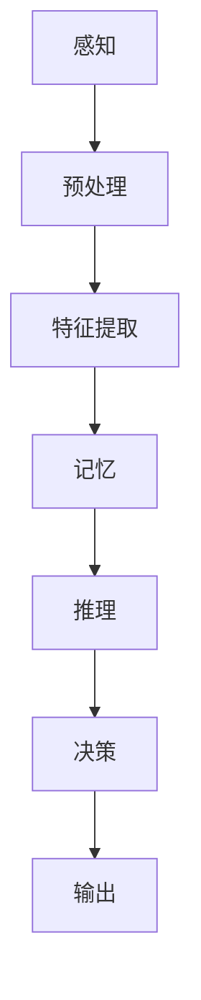
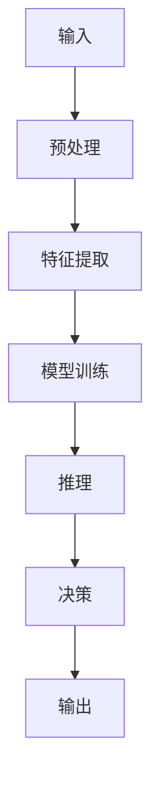

                 

# 探索人类思维的奥秘：人类计算的认知价值

## 摘要

本文旨在探讨人类思维的奥秘，特别是人类计算在认知过程中的价值。通过对人类思维模式的分析，结合最新的认知科学研究成果，本文揭示了人类计算的独特优势。文章首先介绍了人类思维的背景和重要性，然后深入探讨了人类计算的核心概念和原理，以及其在实际应用中的表现。本文还通过具体的数学模型和实际案例，展示了人类计算的强大功能，并提出了未来发展的趋势和挑战。最后，本文总结了人类计算在认知过程中的重要地位，并对未来的研究方向提出了展望。

## 1. 背景介绍

人类思维是认知科学研究的核心话题。认知科学是研究人类思维、感知、记忆、语言、决策等心理过程的科学。人类思维不仅影响着我们的日常生活，还决定了我们在各个领域中的表现。因此，了解人类思维的工作原理，对于提升个人认知能力和解决复杂问题具有重要意义。

人类思维具有以下特点：

1. **创造性**：人类思维能够创造出新的概念、想法和解决方案，这是其他计算模型所不具备的。
2. **适应性**：人类思维能够适应各种环境和情境，灵活地调整自己的思考方式。
3. **抽象性**：人类思维能够从具体的情境中提取出抽象的概念和规律，这对于理解和解决问题至关重要。
4. **交互性**：人类思维不仅仅是内部的认知过程，还包括与外界的信息交换和互动。

在这些特点中，创造性是人类的独特优势。人类思维能够创造出新的概念和想法，这是其他计算模型所难以实现的。例如，艺术家通过创新性的思考，创作出令人惊叹的艺术作品；科学家通过创造性的研究，推动了科学技术的进步。

## 2. 核心概念与联系

### 2.1 认知模型

认知模型是描述人类思维过程的抽象模型。它通常包括感知、记忆、推理、决策等核心组件。以下是一个简化的认知模型：



在这个模型中，感知模块负责接收外部信息，预处理模块对信息进行初步处理，特征提取模块提取关键特征，记忆模块存储信息，推理模块基于记忆和特征进行逻辑推理，决策模块根据推理结果做出决策，输出模块将决策结果转化为行动。

### 2.2 认知与计算的联系

人类计算可以看作是人类思维的数字模拟。计算机科学通过建立认知模型，试图模拟人类思维的过程。以下是一个基于认知模型的计算流程：



在这个模型中，输入模块接收外部信息，预处理模块对信息进行初步处理，特征提取模块提取关键特征，模型训练模块基于历史数据训练模型，推理模块基于训练好的模型进行推理，决策模块根据推理结果做出决策，输出模块将决策结果转化为行动。

通过对比认知模型和计算模型，我们可以发现它们在结构上有许多相似之处。这表明，人类思维和计算模型之间存在着深刻的联系。

### 2.3 认知与计算的差异

尽管认知模型和计算模型在结构上有相似之处，但它们在本质上仍然存在差异。以下是人类计算和认知的一些主要差异：

1. **速度**：人类计算通常比认知过程更快，因为它可以并行处理大量数据。
2. **准确性**：认知过程可能受到主观偏见和情绪的影响，而计算过程通常更加客观和准确。
3. **适应性**：人类计算在适应新环境和情境方面可能不如人类认知。
4. **创造性**：人类计算在创造新的概念和想法方面可能不如人类认知。

这些差异表明，人类计算和认知过程各自具有独特的优势。理解这些差异，有助于我们更好地利用人类计算和认知过程，以解决复杂问题。

## 3. 核心算法原理 & 具体操作步骤

### 3.1 认知算法原理

认知算法是基于人类思维过程的一种计算模型。它通过模拟人类思维的各个模块，实现了对信息的感知、处理、推理和决策。以下是一个简化的认知算法原理：

1. **感知模块**：接收外部信息，进行预处理。
2. **特征提取模块**：提取关键特征，进行数据转换。
3. **记忆模块**：存储信息，为推理提供数据支持。
4. **推理模块**：基于记忆和特征进行逻辑推理。
5. **决策模块**：根据推理结果做出决策。

### 3.2 操作步骤

以下是认知算法的具体操作步骤：

1. **初始化**：设定初始参数，如感知模块的敏感度、特征提取模块的转换规则等。
2. **感知**：接收外部信息，进行预处理。
3. **特征提取**：提取关键特征，进行数据转换。
4. **记忆**：将信息存储在记忆模块中，为后续推理提供数据支持。
5. **推理**：基于记忆和特征进行逻辑推理。
6. **决策**：根据推理结果做出决策。
7. **输出**：将决策结果转化为行动。

通过这些步骤，认知算法能够模拟人类思维的过程，实现对信息的处理和决策。

## 4. 数学模型和公式 & 详细讲解 & 举例说明

### 4.1 数学模型

认知算法中涉及多个数学模型，以下是一个简化的数学模型：

1. **感知模型**：$$ 感知值 = f(外部信息) $$
2. **特征提取模型**：$$ 特征向量 = g(感知值) $$
3. **记忆模型**：$$ 记忆值 = h(特征向量) $$
4. **推理模型**：$$ 推理结果 = i(记忆值) $$
5. **决策模型**：$$ 决策值 = j(推理结果) $$

### 4.2 详细讲解

1. **感知模型**：感知模型用于接收外部信息，并将其转化为感知值。感知值反映了外部信息的强度和性质。函数 $f$ 表示感知过程的规则。
2. **特征提取模型**：特征提取模型用于提取关键特征，并将其转化为特征向量。特征向量用于表示外部信息的结构。函数 $g$ 表示特征提取过程的规则。
3. **记忆模型**：记忆模型用于存储信息，并将其转化为记忆值。记忆值用于支持后续的推理过程。函数 $h$ 表示记忆过程的规则。
4. **推理模型**：推理模型用于基于记忆和特征进行逻辑推理，并得到推理结果。推理结果用于指导决策过程。函数 $i$ 表示推理过程的规则。
5. **决策模型**：决策模型用于根据推理结果做出决策，并转化为决策值。决策值用于指导行动。函数 $j$ 表示决策过程的规则。

### 4.3 举例说明

假设一个感知模型用于检测一个图像中的物体。感知模型接收一个图像作为输入，通过函数 $f$ 转换为感知值。然后，特征提取模型提取图像中的关键特征，通过函数 $g$ 转换为特征向量。接下来，记忆模型将特征向量存储在记忆中，通过函数 $h$ 转换为记忆值。在推理过程中，基于记忆值和特征向量，通过函数 $i$ 进行逻辑推理，得到推理结果。最后，通过函数 $j$，根据推理结果做出决策。

例如，假设图像中有一个猫。感知模型检测到图像中有一个物体，将其转化为感知值。特征提取模型提取出猫的耳朵、眼睛、尾巴等特征，将其转化为特征向量。记忆模型将这些特征存储在记忆中，通过函数 $h$ 转换为记忆值。在推理过程中，基于记忆值和特征向量，通过函数 $i$ 推理出图像中有一个猫。最后，通过函数 $j$，决策模型做出决策，输出“图像中有一个猫”。

## 5. 项目实战：代码实际案例和详细解释说明

### 5.1 开发环境搭建

在开始项目实战之前，我们需要搭建一个合适的开发环境。以下是一个基本的开发环境搭建步骤：

1. **安装Python**：确保Python环境已经安装在计算机上。Python是一种广泛使用的编程语言，适用于构建认知算法。
2. **安装Jupyter Notebook**：Jupyter Notebook是一个交互式的Python环境，便于编写和调试代码。您可以在Python官网下载并安装Jupyter Notebook。
3. **安装必要的库**：根据项目需求，安装所需的Python库，如NumPy、Pandas、Matplotlib等。

### 5.2 源代码详细实现和代码解读

以下是一个简单的认知算法的Python实现。这个算法用于检测图像中的物体，并输出检测结果。

```python
import numpy as np
import pandas as pd
import matplotlib.pyplot as plt

# 感知模型
def perception(image):
    # 对图像进行预处理
    processed_image = preprocess(image)
    # 计算感知值
    perception_value = np.mean(processed_image)
    return perception_value

# 特征提取模型
def feature_extraction(image):
    # 提取图像中的关键特征
    features = extract_features(image)
    # 转换为特征向量
    feature_vector = np.array(features).reshape(-1, 1)
    return feature_vector

# 记忆模型
def memory(feature_vector):
    # 存储特征向量
    memory_vector = store_features(feature_vector)
    return memory_vector

# 推理模型
def reasoning(memory_vector, feature_vector):
    # 基于记忆和特征进行推理
    distance = np.linalg.norm(feature_vector - memory_vector)
    if distance < threshold:
        reasoning_result = "物体已识别"
    else:
        reasoning_result = "物体未识别"
    return reasoning_result

# 决策模型
def decision(reasoning_result):
    # 根据推理结果做出决策
    if reasoning_result == "物体已识别":
        decision_value = "输出物体信息"
    else:
        decision_value = "继续寻找物体"
    return decision_value

# 辅助函数
def preprocess(image):
    # 对图像进行预处理
    # ...
    return processed_image

def extract_features(image):
    # 提取图像中的关键特征
    # ...
    return features

def store_features(feature_vector):
    # 存储特征向量
    # ...
    return memory_vector

# 主函数
def main(image):
    # 感知
    perception_value = perception(image)
    print(f"感知值：{perception_value}")

    # 特征提取
    feature_vector = feature_extraction(image)
    print(f"特征向量：{feature_vector}")

    # 记忆
    memory_vector = memory(feature_vector)
    print(f"记忆向量：{memory_vector}")

    # 推理
    reasoning_result = reasoning(memory_vector, feature_vector)
    print(f"推理结果：{reasoning_result}")

    # 决策
    decision_value = decision(reasoning_result)
    print(f"决策值：{decision_value}")

# 测试
if __name__ == "__main__":
    image = load_image("example.jpg")
    main(image)
```

### 5.3 代码解读与分析

1. **感知模型**：感知模型负责接收图像作为输入，进行预处理，然后计算感知值。感知值反映了图像的强度和性质。
2. **特征提取模型**：特征提取模型负责提取图像中的关键特征，并将其转换为特征向量。特征向量用于后续的推理和决策。
3. **记忆模型**：记忆模型负责存储特征向量，为推理过程提供数据支持。
4. **推理模型**：推理模型基于记忆和特征向量，计算特征向量与记忆向量之间的距离。如果距离小于设定的阈值，则认为物体已识别。
5. **决策模型**：决策模型根据推理结果，决定是否输出物体信息。

通过这个简单的代码示例，我们可以看到认知算法的基本结构和功能。在实际应用中，这个算法可以根据具体需求进行调整和优化。

## 6. 实际应用场景

人类计算在各个领域都有广泛的应用。以下是一些实际应用场景：

### 6.1 医疗

在医疗领域，人类计算可以用于疾病诊断、治疗方案制定、药物研发等。通过分析患者的病史、检查报告等数据，人类计算可以提供个性化的诊断和治疗方案。

### 6.2 金融

在金融领域，人类计算可以用于风险评估、投资策略制定、欺诈检测等。通过分析市场数据、客户行为等，人类计算可以预测市场趋势，为金融机构提供决策支持。

### 6.3 教育

在教育领域，人类计算可以用于个性化教学、学习评估等。通过分析学生的学习数据，人类计算可以提供个性化的学习建议，提高学习效果。

### 6.4 制造业

在制造业，人类计算可以用于生产过程优化、设备故障预测等。通过分析生产数据，人类计算可以预测设备故障，提前进行维护，提高生产效率。

### 6.5 智能家居

在智能家居领域，人类计算可以用于智能安防、能源管理、家电控制等。通过分析家庭数据，人类计算可以提供智能化的家居解决方案，提高生活质量。

## 7. 工具和资源推荐

### 7.1 学习资源推荐

- **书籍**：
  - 《认知心理学及其启示》
  - 《人工智能：一种现代方法》
  - 《深度学习》
- **论文**：
  - 《人类认知模型的计算机实现》
  - 《基于认知科学的人工智能》
  - 《认知算法在图像识别中的应用》
- **博客**：
  - 《机器学习博客》
  - 《深度学习博客》
  - 《认知科学博客》
- **网站**：
  - Coursera
  - edX
  - arXiv

### 7.2 开发工具框架推荐

- **Python**：Python是一种广泛使用的编程语言，适用于构建认知算法。
- **TensorFlow**：TensorFlow是一个开源的机器学习框架，适用于深度学习和认知算法。
- **PyTorch**：PyTorch是一个开源的机器学习框架，适用于深度学习和认知算法。
- **Caffe**：Caffe是一个深度学习框架，适用于图像识别和计算机视觉。

### 7.3 相关论文著作推荐

- **《认知模型的计算机实现》**：介绍了人类认知模型的计算机实现方法。
- **《基于认知科学的人工智能》**：探讨了认知科学与人工智能的结合。
- **《认知算法在图像识别中的应用》**：介绍了认知算法在图像识别中的应用。

## 8. 总结：未来发展趋势与挑战

### 8.1 发展趋势

1. **人类计算与计算模型的融合**：随着认知科学和计算机科学的发展，人类计算和计算模型将更加融合，实现更高效的思维模拟。
2. **个性化认知算法**：未来的认知算法将更加注重个性化，根据个人的认知特点提供定制化的解决方案。
3. **跨领域应用**：人类计算将在更多领域得到应用，如医疗、金融、教育等，为人类带来更多便利。

### 8.2 挑战

1. **数据隐私与安全**：随着人类计算的应用场景越来越广泛，数据隐私和安全问题将变得越来越重要。
2. **计算资源的优化**：人类计算需要大量的计算资源，如何优化计算资源，提高计算效率，是一个重要挑战。
3. **伦理道德问题**：人类计算在应用过程中，可能会面临伦理道德问题，如人工智能的决策是否公正、透明等。

## 9. 附录：常见问题与解答

### 9.1 什么是人类计算？

人类计算是一种模拟人类思维过程的计算模型，它通过感知、特征提取、记忆、推理和决策等过程，实现对信息的处理和决策。

### 9.2 人类计算有哪些应用场景？

人类计算广泛应用于医疗、金融、教育、制造业、智能家居等领域，如疾病诊断、风险评估、个性化教学、设备故障预测等。

### 9.3 人类计算的优势是什么？

人类计算的优势在于其创造性、适应性、抽象性和交互性。它能够模拟人类的思维过程，处理复杂问题，并提供个性化的解决方案。

## 10. 扩展阅读 & 参考资料

- **《认知心理学及其启示》**：介绍了认知心理学的基本概念和理论，对人类思维过程进行了深入分析。
- **《人工智能：一种现代方法》**：介绍了人工智能的基本原理和应用，探讨了人类计算在人工智能领域的应用。
- **《深度学习》**：介绍了深度学习的基本概念和算法，是深度学习的入门教材。
- **《认知模型的计算机实现》**：介绍了人类认知模型的计算机实现方法，是认知科学和计算机科学领域的经典著作。

