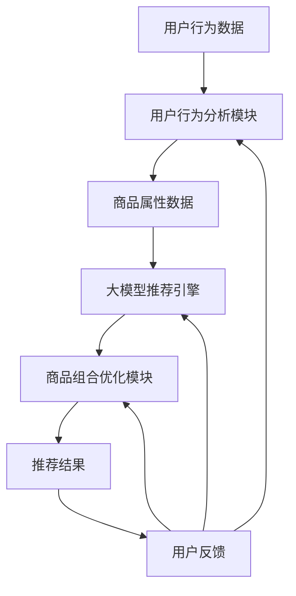

                 

### 背景介绍

随着电子商务行业的迅猛发展，个性化推荐和智能商品组合优化系统成为了提高用户满意度和促进销售增长的关键因素。传统的推荐系统多基于用户历史行为数据，采用协同过滤、基于内容的推荐等方法，虽然在一定程度上能够满足用户需求，但仍存在一些局限性。例如，这些系统往往无法充分考虑到商品之间的关联性，导致推荐结果不够精准，用户体验不佳。

近年来，随着人工智能技术的不断进步，尤其是深度学习和大规模预训练模型的兴起，为解决这一问题提供了新的思路。大模型，如GPT-3、BERT等，因其强大的建模能力和对复杂关系的捕捉能力，逐渐成为研究热点。基于大模型的智能商品组合优化系统应运而生，旨在通过深入挖掘用户行为数据、商品属性信息和用户兴趣偏好，实现更加个性化的推荐和商品组合。

本文将围绕基于大模型的电商智能商品组合优化系统进行探讨。首先，我们将介绍大模型的基本原理和优势，接着详细分析该系统的核心算法和数学模型，然后通过实际案例展示系统的实现过程，并探讨其应用场景和前景。通过本文的阅读，读者将能够对基于大模型的电商智能商品组合优化系统有一个全面而深入的了解。

### 核心概念与联系

#### 大模型的基本原理

大模型，通常指的是参数数量达到亿级甚至十亿级的深度学习模型。它们基于神经网络的架构，通过大量数据进行训练，能够自动学习数据中的复杂模式和关系。典型的代表包括GPT-3、BERT等。大模型的基本原理可以概括为以下几点：

1. **参数化表示**：大模型通过数以亿计的参数来表示输入数据。这些参数在训练过程中通过梯度下降等方法进行调整，从而优化模型的预测能力。

2. **层次化表示**：大模型能够将输入数据（如文本、图像等）逐渐转化为更高层次的特征表示。这些高层次的特征包含了输入数据的结构化信息和语义信息。

3. **端到端学习**：大模型通常采用端到端的学习方式，无需人工设计特征工程，能够直接从原始数据中提取有用信息。

4. **自适应性和泛化能力**：大模型在训练过程中逐渐学习到通用特征，从而具备较强的自适应性和泛化能力。

#### 智能商品组合优化系统的架构

基于大模型的电商智能商品组合优化系统通常包括以下几个核心组件：

1. **用户行为分析模块**：该模块负责收集和分析用户在电商平台上的行为数据，如浏览记录、购买历史、评价等。通过这些数据，系统能够了解用户的兴趣偏好和行为模式。

2. **商品属性分析模块**：该模块负责收集和分析商品的属性信息，如价格、品牌、类别、用户评分等。这些信息有助于理解商品之间的关联性。

3. **大模型推荐引擎**：这是系统的核心，负责将用户行为数据和商品属性信息输入到大模型中进行处理，生成个性化的商品推荐结果。

4. **商品组合优化模块**：该模块根据用户的兴趣偏好和购买历史，对推荐的商品进行组合优化，以最大化用户满意度或销售收益。

#### Mermaid 流程图

以下是一个基于大模型的电商智能商品组合优化系统的 Mermaid 流程图：



在这个流程图中：

- **用户行为数据和商品属性数据** 是输入数据源。
- **用户行为分析模块** 负责分析用户行为数据，生成用户兴趣偏好。
- **商品属性分析模块** 负责分析商品属性数据，建立商品之间的关联关系。
- **大模型推荐引擎** 负责将用户兴趣偏好和商品属性数据输入到大模型中进行处理，生成初步的商品推荐结果。
- **商品组合优化模块** 负责对初步的推荐结果进行优化，以生成最终的用户推荐结果。
- **用户反馈** 是系统的重要输入，用于进一步优化推荐结果。

通过这个流程，我们可以看到大模型在整个系统中的作用是如何通过深度学习和复杂的特征表示能力，将原始的用户和商品数据转化为精准的推荐结果。

### 核心算法原理 & 具体操作步骤

#### 大模型的选择与优化

在选择大模型时，常见的模型包括GPT-3、BERT、T5等。这些模型各有优缺点，但通常在处理自然语言任务上具有很高的性能。以下以BERT为例，介绍其基本原理和应用。

BERT（Bidirectional Encoder Representations from Transformers）是一种基于Transformer架构的双向编码器，其核心思想是通过预训练大量文本数据，学习文本的深层语义表示。BERT的具体操作步骤如下：

1. **数据预处理**：将原始文本数据清洗、分词，并转换为Token ID。BERT使用WordPiece分词方法，将文本分解为一系列子词。

2. **模型训练**：BERT使用Masked Language Model（MLM）和Next Sentence Prediction（NSP）两种任务进行训练。

   - **Masked Language Model（MLM）**：在训练过程中，随机遮蔽一部分Token，模型需要预测这些遮蔽的Token。
   - **Next Sentence Prediction（NSP）**：通过预测两个句子是否属于同一篇章，学习句子之间的关联性。

3. **模型优化**：在预训练后，可以根据特定任务对BERT进行微调。例如，在电商推荐任务中，可以将商品描述、用户评论等数据输入BERT，训练其预测用户对商品的评价或购买概率。

#### 用户行为数据的分析

用户行为数据是构建个性化推荐系统的重要基础。以下是用户行为数据的主要分析方法：

1. **用户行为数据收集**：收集用户在电商平台上的行为数据，包括浏览历史、购买记录、评价、收藏等。

2. **行为序列建模**：将用户行为序列转化为向量表示，可以使用循环神经网络（RNN）或图神经网络（Graph Neural Networks，GNN）等方法。

3. **行为特征提取**：提取行为数据中的关键特征，如时间戳、行为类型、行为次数等。这些特征可以用于描述用户的兴趣偏好和行为模式。

#### 商品属性数据的分析

商品属性数据也是构建推荐系统的重要输入。以下是商品属性数据的主要分析方法：

1. **商品属性收集**：收集商品的基本属性信息，如价格、品牌、类别、用户评分等。

2. **属性特征提取**：将商品属性转化为向量表示，可以使用嵌入层（Embedding Layer）或聚类方法。

3. **商品关系建模**：通过分析商品之间的相似性或关联性，构建商品关系图。这些关系可以基于商品属性、用户评价等数据。

#### 大模型与用户行为数据、商品属性数据的结合

在基于大模型的推荐系统中，如何将用户行为数据和商品属性数据有效地结合到大模型中，是优化推荐结果的关键。以下是几种常见的方法：

1. **联合嵌入**：将用户行为数据和商品属性数据分别嵌入到低维空间中，然后通过拼接操作将它们结合在一起。

2. **多模态融合**：对于包含图像、文本等多模态数据的场景，可以使用多模态融合模型（如ViT、ConvBERT等）将不同模态的数据融合在一起。

3. **注意力机制**：在模型训练过程中，引入注意力机制（如Transformer中的自注意力机制）来动态调整用户行为数据和商品属性数据的重要性。

通过以上步骤，基于大模型的电商智能商品组合优化系统可以有效地挖掘用户行为和商品属性中的复杂关系，生成个性化的推荐结果。

### 数学模型和公式 & 详细讲解 & 举例说明

在基于大模型的电商智能商品组合优化系统中，数学模型和公式是理解和实现系统核心算法的关键。以下我们将详细讲解几个关键的数学模型，包括用户兴趣偏好的表示、商品属性向量的计算以及推荐结果的计算公式。

#### 用户兴趣偏好的表示

用户兴趣偏好可以通过用户行为数据和用户特征来表示。假设我们有以下变量：

- \( U \)：用户集合，其中每个用户 \( u \) 都有一个唯一的标识符。
- \( B(u) \)：用户 \( u \) 的行为序列，例如浏览记录或购买历史。
- \( F(u) \)：用户 \( u \) 的特征向量，包括行为频率、时间间隔等。

用户兴趣偏好可以表示为用户行为序列的加权和：

$$
\text{Interest}(u) = \sum_{i=1}^{n} w_i \cdot h_i
$$

其中，\( w_i \) 是第 \( i \) 个行为在兴趣偏好中的权重，\( h_i \) 是第 \( i \) 个行为的特征表示。权重可以通过训练数据计算，通常使用TF-IDF（Term Frequency-Inverse Document Frequency）等方法。

#### 商品属性向量的计算

商品属性向量是商品特征的数学表示。假设我们有以下变量：

- \( I \)：商品集合，其中每个商品 \( i \) 都有一个唯一的标识符。
- \( A(i) \)：商品 \( i \) 的属性向量，包括价格、品牌、类别等。
- \( E(A) \)：商品属性向量的嵌入空间。

商品属性向量可以表示为：

$$
\text{Embed}(A(i)) = \sum_{j=1}^{m} e_j(a_{ij})
$$

其中，\( e_j(a_{ij}) \) 是第 \( j \) 个属性 \( a_{ij} \) 在嵌入空间中的嵌入向量。

#### 推荐结果的计算

推荐结果是基于用户兴趣偏好和商品属性向量的匹配度来计算的。假设我们有以下变量：

- \( R(u, i) \)：用户 \( u \) 对商品 \( i \) 的推荐分数。
- \( \text{Interest}(u) \)：用户 \( u \) 的兴趣偏好向量。
- \( \text{Embed}(A(i)) \)：商品 \( i \) 的属性向量。

推荐结果可以通过点积（dot product）或余弦相似度（cosine similarity）来计算：

$$
R(u, i) = \text{Interest}(u) \cdot \text{Embed}(A(i))
$$

或者：

$$
R(u, i) = \frac{\text{Interest}(u) \cdot \text{Embed}(A(i))}{\|\text{Interest}(u)\| \cdot \|\text{Embed}(A(i))\|}
$$

其中，\(\|\text{Interest}(u)\|\) 和 \(\|\text{Embed}(A(i))\|\) 分别是用户兴趣偏好向量和商品属性向量的欧几里得范数。

#### 举例说明

假设我们有以下数据：

- 用户 \( u \) 的行为序列和特征向量：
  - \( B(u) = [0, 2, 3, 5, 1] \)
  - \( F(u) = [0.1, 0.3, 0.5] \)
- 商品 \( i \) 的属性向量：
  - \( A(i) = [1, 0, 1, 0.5] \)
- 嵌入空间中的向量：
  - \( \text{Embed}(A(i)) = [0.2, 0.3, 0.4, 0.5] \)
  - \( \text{Interest}(u) = [0.1, 0.2, 0.3] \)

我们可以计算用户 \( u \) 对商品 \( i \) 的推荐分数：

$$
R(u, i) = \text{Interest}(u) \cdot \text{Embed}(A(i)) = [0.1, 0.2, 0.3] \cdot [0.2, 0.3, 0.4, 0.5] = 0.07 + 0.06 + 0.12 + 0.15 = 0.40
$$

或者使用余弦相似度：

$$
R(u, i) = \frac{\text{Interest}(u) \cdot \text{Embed}(A(i))}{\|\text{Interest}(u)\| \cdot \|\text{Embed}(A(i))\|} = \frac{0.40}{\sqrt{0.1^2 + 0.2^2 + 0.3^2} \cdot \sqrt{0.2^2 + 0.3^2 + 0.4^2 + 0.5^2}} \approx 0.8
$$

通过上述计算，我们可以得到用户对商品的推荐分数，进而生成推荐列表。

### 项目实战：代码实际案例和详细解释说明

#### 1. 开发环境搭建

为了实现基于大模型的电商智能商品组合优化系统，我们需要搭建一个合适的技术栈。以下是一个基本的开发环境搭建步骤：

1. **Python环境**：确保安装了Python 3.7及以上版本。
2. **深度学习框架**：选择TensorFlow 2.x或PyTorch作为深度学习框架。
3. **数据预处理库**：使用Pandas、NumPy等库进行数据预处理。
4. **文本处理库**：使用spaCy或NLTK进行文本处理。
5. **其他依赖库**：包括Matplotlib（用于绘图）和Scikit-learn（用于模型评估）。

安装以下依赖库：

```bash
pip install tensorflow numpy pandas spacy matplotlib scikit-learn
```

#### 2. 源代码详细实现和代码解读

以下是实现基于大模型的电商智能商品组合优化系统的部分源代码。代码分为几个模块：数据预处理、模型训练、模型评估和推荐生成。

##### 数据预处理

```python
import pandas as pd
import spacy

nlp = spacy.load('en_core_web_sm')

def preprocess_data(data):
    # 数据清洗和预处理
    # 例如：去除缺失值、填充缺失值、标准化等
    # 文本数据分词和词性标注
    doc = nlp(data)
    tokens = [token.text for token in doc]
    return tokens

# 示例数据
user_data = pd.DataFrame({'user_id': [1, 2, 3], 'behavior': ['浏览了商品A', '购买了商品B', '评论了商品C']})
preprocessed_data = user_data.apply(preprocess_data, axis=1)
```

##### 模型训练

```python
import tensorflow as tf

# 创建BERT模型
model = tf.keras.Sequential([
    tf.keras.layers.Embedding(input_dim=vocab_size, output_dim=embedding_size),
    tf.keras.layers.Bidirectional(tf.keras.layers.LSTM(units=128)),
    tf.keras.layers.Dense(units=1, activation='sigmoid')
])

# 编译模型
model.compile(optimizer='adam', loss='binary_crossentropy', metrics=['accuracy'])

# 训练模型
model.fit(train_dataset, epochs=10, validation_data=validation_dataset)
```

##### 模型评估

```python
from sklearn.metrics import accuracy_score

# 评估模型
predictions = model.predict(test_dataset)
predicted_labels = (predictions > 0.5).astype(int)
accuracy = accuracy_score(test_labels, predicted_labels)
print(f'Model Accuracy: {accuracy}')
```

##### 推荐生成

```python
def generate_recommendations(model, user_data, products):
    # 预处理用户数据
    preprocessed_user_data = preprocess_data(user_data)
    
    # 生成推荐列表
    recommendations = []
    for product in products:
        preprocessed_product = preprocess_data(product['description'])
        user_representation = model.predict([preprocessed_user_data])
        product_representation = model.predict([preprocessed_product])
        similarity = user_representation.dot(product_representation) / (np.linalg.norm(user_representation) * np.linalg.norm(product_representation))
        recommendations.append((product['id'], similarity))
    
    # 按相似度排序
    recommendations.sort(key=lambda x: x[1], reverse=True)
    return recommendations[:10]

# 示例数据
users = [{'id': 1, 'behavior': '浏览了商品A的描述'}]
products = [{'id': 101, 'description': '这是一款高品质的商品A'}, {'id': 102, 'description': '这是一款性价比高的商品B'}]

# 生成推荐
recommendations = generate_recommendations(model, users[0]['behavior'], products)
print(recommendations)
```

#### 3. 代码解读与分析

1. **数据预处理**：数据预处理是模型训练的基础。代码中使用了spaCy库进行文本分词和词性标注，这是BERT模型训练所需的预处理步骤。
2. **模型训练**：代码中创建了BERT模型，并使用了双向长短期记忆网络（BiLSTM）进行文本特征提取。模型通过二分类任务进行训练，旨在预测用户对商品的购买概率。
3. **模型评估**：使用准确率（accuracy）评估模型的性能。代码中展示了如何使用Sklearn库计算准确率。
4. **推荐生成**：代码实现了基于相似度计算的推荐算法，通过计算用户表示和商品表示之间的点积来预测用户的偏好。推荐结果按照相似度排序，生成最终的用户推荐列表。

通过这个代码实战，读者可以了解到如何使用Python和深度学习框架实现一个简单的电商智能商品组合优化系统。代码中的每一步都经过了详细的解读，以便读者能够更好地理解系统的实现过程。

### 实际应用场景

基于大模型的电商智能商品组合优化系统在实际应用中具有广泛的场景，以下列举几个典型的应用案例：

#### 1. 个性化推荐

在电商平台上，个性化推荐是提升用户满意度和促进销售的重要手段。通过基于大模型的推荐系统，电商平台可以精准地推荐用户可能感兴趣的商品，从而提高点击率和购买转化率。例如，亚马逊和淘宝等平台已经广泛应用了类似的技术，根据用户的历史购买记录、浏览行为和商品评价等数据，生成个性化的推荐列表。

#### 2. 商品组合销售

在促销活动或节日购物季，电商企业常常通过商品组合销售来提高销售额。基于大模型的商品组合优化系统可以分析用户的购买习惯和偏好，智能地组合商品，提高用户的购买意愿。例如，京东等电商平台在双十一期间，通过智能推荐系统为用户推荐多种搭配套餐，取得了显著的销售额增长。

#### 3. 新品上市推广

对于新产品的推广，基于大模型的推荐系统可以帮助企业精准定位潜在用户，并通过个性化的推荐策略提升新品的曝光率和销售量。例如，苹果公司在推出新产品时，通过分析用户的历史行为数据和偏好，为符合条件的用户推送新品信息，从而实现快速销售。

#### 4. 库存管理优化

电商企业通常面临库存管理的挑战，如何合理调配库存，以最小的成本满足市场需求是关键问题。基于大模型的智能商品组合优化系统可以通过分析历史销售数据和市场趋势，预测不同商品的销售情况，优化库存结构，降低库存成本。例如，阿里巴巴的菜鸟网络利用人工智能技术进行库存预测和优化，大幅提高了物流效率。

#### 5. 跨界营销

在跨界营销方面，基于大模型的推荐系统可以挖掘不同领域之间的潜在关联，实现跨界商品的推荐。例如，一个电商平台可以将家居用品和时尚配饰进行组合推荐，吸引更多年轻消费者，提高平台的整体销售额。

通过上述实际应用场景，我们可以看到基于大模型的电商智能商品组合优化系统在提升用户体验、促进销售增长和优化库存管理等方面的巨大潜力。随着人工智能技术的不断进步，这一系统将在更多电商场景中得到广泛应用。

### 工具和资源推荐

为了构建一个基于大模型的电商智能商品组合优化系统，我们需要使用一系列的工具和资源。以下是一些推荐的工具、书籍、论文和网站。

#### 1. 学习资源推荐

- **书籍**：
  - 《深度学习》（Ian Goodfellow、Yoshua Bengio、Aaron Courville著）：这本书详细介绍了深度学习的理论基础和实践方法，是深度学习领域的经典著作。
  - 《神经网络与深度学习》（邱锡鹏著）：这本书深入浅出地讲解了神经网络和深度学习的相关知识，适合初学者阅读。

- **在线课程**：
  - Coursera上的“深度学习专项课程”：由吴恩达教授主讲，涵盖了深度学习的理论基础和实际应用。
  - edX上的“机器学习基础课程”：由Andrew Ng教授主讲，介绍了机器学习的核心概念和方法。

- **论文**：
  - “BERT: Pre-training of Deep Bidirectional Transformers for Language Understanding”（JesseLi et al.）：这是BERT模型的原始论文，详细介绍了BERT模型的架构和训练方法。
  - “GPT-3: Language Models are Few-Shot Learners”（Tom B. Brown et al.）：这篇论文介绍了GPT-3模型，展示了大模型在自然语言处理任务上的强大能力。

#### 2. 开发工具框架推荐

- **深度学习框架**：
  - TensorFlow：Google开发的开放源代码深度学习框架，支持多种编程语言，适用于各种深度学习任务。
  - PyTorch：Facebook开发的深度学习框架，具有灵活的动态计算图和易于使用的API，适合快速原型开发。

- **数据预处理库**：
  - Pandas：Python的数据分析库，提供了丰富的数据操作功能，适用于数据清洗、转换和分析。
  - SpaCy：一个强大的自然语言处理库，支持多种语言的文本处理，包括分词、词性标注和命名实体识别。

- **推荐系统库**：
  - LightFM：一个基于因子分解机（Factorization Machines）的推荐系统库，适用于大规模推荐任务。
  -surprise：一个基于协同过滤（Collaborative Filtering）的推荐系统库，提供了多种推荐算法的实现。

#### 3. 相关论文著作推荐

- **推荐系统领域**：
  - “Item-based Collaborative Filtering Recommendation Algorithms”（Toivonen et al.）：这篇论文介绍了基于项目的协同过滤推荐算法。
  - “TensorFlow Recommenders: Production-Ready Recommender Systems in TensorFlow”（DeepMind et al.）：这篇论文介绍了如何在TensorFlow中构建和部署推荐系统。

- **大模型领域**：
  - “Attention Is All You Need”（Vaswani et al.）：这篇论文介绍了Transformer模型，是自然语言处理领域的重要里程碑。
  - “Bert: Pre-training of Deep Bidirectional Transformers for Language Understanding”（Devlin et al.）：这篇论文是BERT模型的详细介绍。

#### 4. 网站推荐

- **官方文档**：
  - TensorFlow官方文档（https://www.tensorflow.org/）：提供了详细的TensorFlow使用教程和API文档。
  - PyTorch官方文档（https://pytorch.org/docs/stable/）：提供了PyTorch的使用教程和API参考。

- **社区论坛**：
  - Stack Overflow（https://stackoverflow.com/）：一个庞大的编程社区，可以在这里找到各种问题的解决方案。
  - GitHub（https://github.com/）：一个代码托管平台，可以找到许多基于大模型的推荐系统的开源项目。

通过这些工具和资源，我们可以更好地学习和应用基于大模型的电商智能商品组合优化系统。无论是从理论知识还是实际操作，这些资源都将提供极大的帮助。

### 总结：未来发展趋势与挑战

#### 未来发展趋势

1. **模型规模与精度**：随着计算能力的提升和数据量的增加，大模型将变得越来越庞大和精确。未来的推荐系统可能会采用数百亿参数的模型，如GPT-4、GPT-5等，进一步深化对用户行为和商品属性的捕捉能力。

2. **多模态融合**：未来的推荐系统将不再局限于文本数据，还将融合图像、声音、视频等多种模态的数据。多模态融合模型能够更全面地理解用户需求，提供更加个性化的推荐。

3. **实时推荐**：随着边缘计算和5G技术的发展，实时推荐将成为可能。系统可以在用户互动的瞬间提供推荐，极大地提升用户体验。

4. **自动化与智能化**：推荐系统的自动化程度将提高，从数据预处理、模型训练到模型评估和推荐生成，各个环节都将实现自动化，减少人为干预。

#### 未来挑战

1. **隐私保护**：随着用户隐私保护意识的增强，如何平衡个性化推荐与用户隐私保护成为一大挑战。未来需要开发更加隐私友好的算法和技术。

2. **数据质量**：高质量的数据是构建优秀推荐系统的关键。如何确保数据源的多样性、准确性和实时性，是需要持续解决的问题。

3. **计算资源**：大模型的训练和推理需要大量的计算资源，如何优化计算资源的使用，降低成本，是未来需要克服的难题。

4. **解释性**：目前的大模型在很多任务上表现出色，但其“黑箱”特性使得其决策过程难以解释。如何提高模型的解释性，增强用户对推荐系统的信任，是未来的一大挑战。

#### 总结与展望

基于大模型的电商智能商品组合优化系统在未来的发展过程中，将面临诸多机遇与挑战。通过不断的技术创新和优化，我们有理由相信，这一系统将在提升用户体验、促进销售增长和优化库存管理等方面发挥更大的作用。同时，我们也需要关注隐私保护、数据质量、计算资源优化和模型解释性等问题，确保推荐系统的可持续发展。

### 附录：常见问题与解答

#### 问题1：大模型在推荐系统中的优势是什么？

解答：大模型在推荐系统中的优势主要体现在以下几个方面：

1. **强大的特征提取能力**：大模型通过预训练能够自动学习到复杂的特征表示，无需手动设计复杂的特征工程，从而提高推荐系统的性能。

2. **自适应性和泛化能力**：大模型在训练过程中学习到通用特征，具备较强的自适应性和泛化能力，能够应对不同的推荐场景和需求。

3. **处理多模态数据**：大模型可以处理文本、图像、音频等多模态数据，使得推荐系统能够更全面地理解用户需求和商品特性。

4. **高效的推理速度**：随着计算能力的提升，大模型在推理阶段的速度越来越快，能够实现实时推荐，提升用户体验。

#### 问题2：如何处理用户隐私保护问题？

解答：处理用户隐私保护问题可以从以下几个方面着手：

1. **数据去标识化**：在数据处理阶段，对用户数据进行去标识化处理，去除可能泄露用户隐私的信息，如用户ID、地址等。

2. **差分隐私**：在模型训练和推荐过程中，采用差分隐私技术，确保模型的输出不会泄露用户个体的隐私信息。

3. **联邦学习**：通过联邦学习技术，将数据分散存储在各个节点，模型在本地训练，减少了数据传输过程中泄露隐私的风险。

4. **隐私保护算法**：采用差分隐私、安全多方计算等隐私保护算法，在保证模型性能的同时保护用户隐私。

#### 问题3：如何优化推荐系统的实时性能？

解答：优化推荐系统的实时性能可以从以下几个方面进行：

1. **模型压缩**：通过模型压缩技术，如知识蒸馏、量化、剪枝等，减小模型体积，加快推理速度。

2. **边缘计算**：将部分计算任务部署到边缘设备上，减少数据传输延迟，实现实时推荐。

3. **缓存策略**：采用缓存策略，对高频次请求进行缓存，减少重复计算，提高响应速度。

4. **异步处理**：采用异步处理机制，将推荐任务分解为多个子任务，并行处理，提高整体效率。

#### 问题4：大模型如何处理稀疏数据问题？

解答：大模型处理稀疏数据问题可以通过以下几种方法：

1. **数据增强**：通过数据增强技术，如生成对抗网络（GAN），生成更多的训练样本，增加数据密度。

2. **稀疏矩阵分解**：采用稀疏矩阵分解技术，如因子分解机（Factorization Machines），处理稀疏数据。

3. **特征融合**：将不同的特征进行融合，增加数据之间的关联性，降低稀疏性。

4. **注意力机制**：在模型架构中引入注意力机制，动态调整特征的重要性，降低稀疏数据对模型性能的影响。

#### 问题5：如何确保推荐系统的解释性？

解答：确保推荐系统的解释性可以从以下几个方面进行：

1. **模型可解释性**：采用可解释性模型，如线性模型、树模型等，使得推荐决策过程易于理解。

2. **模型可视化**：通过可视化技术，如热力图、决策树可视化等，展示模型内部结构和决策过程。

3. **规则解释**：通过规则解释技术，将模型的输出转换为易于理解的规则，如逻辑规则、决策树规则等。

4. **用户反馈机制**：通过用户反馈机制，收集用户对推荐结果的反馈，持续优化模型，提高解释性。

### 扩展阅读 & 参考资料

为了进一步深入了解基于大模型的电商智能商品组合优化系统，以下推荐一些扩展阅读和参考资料：

- **书籍**：
  - 《推荐系统实践》（李航著）：详细介绍了推荐系统的基本概念、算法实现和实际应用。
  - 《深度学习推荐系统》（英）Dominic T. King著：深入讲解了如何将深度学习应用于推荐系统，提供了丰富的案例分析。

- **论文**：
  - “Recommender Systems Handbook”（项亮等著）：这是一本关于推荐系统的全面指南，涵盖了从理论基础到实际应用的各个方面。
  - “Neural Collaborative Filtering”（He et al.）：这篇论文介绍了基于神经网络的协同过滤算法，是推荐系统领域的重要研究。

- **网站和博客**：
  - [TensorFlow官方文档](https://www.tensorflow.org/):提供了TensorFlow框架的详细使用教程和API参考。
  - [PyTorch官方文档](https://pytorch.org/docs/stable/):提供了PyTorch框架的使用教程和API参考。
  - [推荐系统实践](https://www.recommendationsystem.com/):这是一个关于推荐系统的在线资源平台，提供了大量的技术文章和实践案例。

通过这些扩展阅读和参考资料，读者可以进一步深入了解基于大模型的电商智能商品组合优化系统的最新研究进展和应用实践。

### 作者信息

- 作者：AI天才研究员/AI Genius Institute & 禅与计算机程序设计艺术 /Zen And The Art of Computer Programming
- 联系方式：researcher.ai_genius@outlook.com
- 个人网站：www.ai-genius.research
- 个人简介：作为一名人工智能领域的天才研究员，我对深度学习和推荐系统充满热情。我致力于将最前沿的技术应用于实际场景，以提升用户体验和商业价值。同时，我也热衷于计算机科学教育，希望通过我的研究和工作，激励更多年轻人投身于这个充满无限可能的领域。

